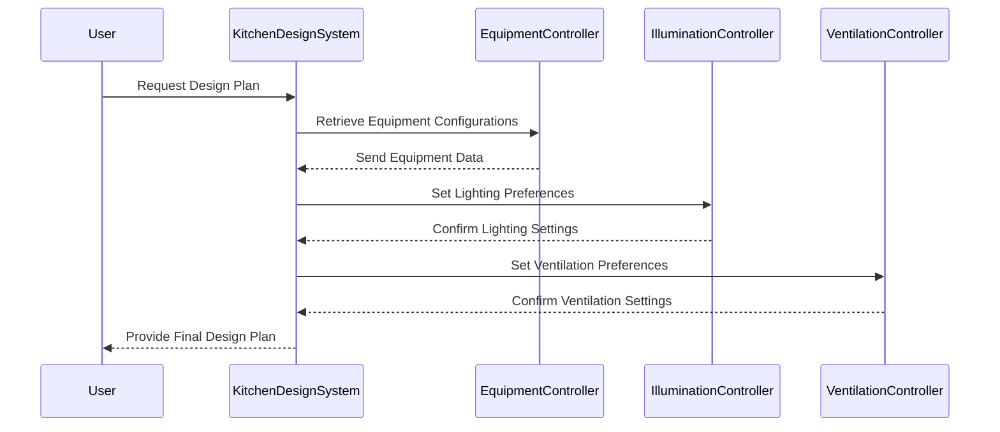
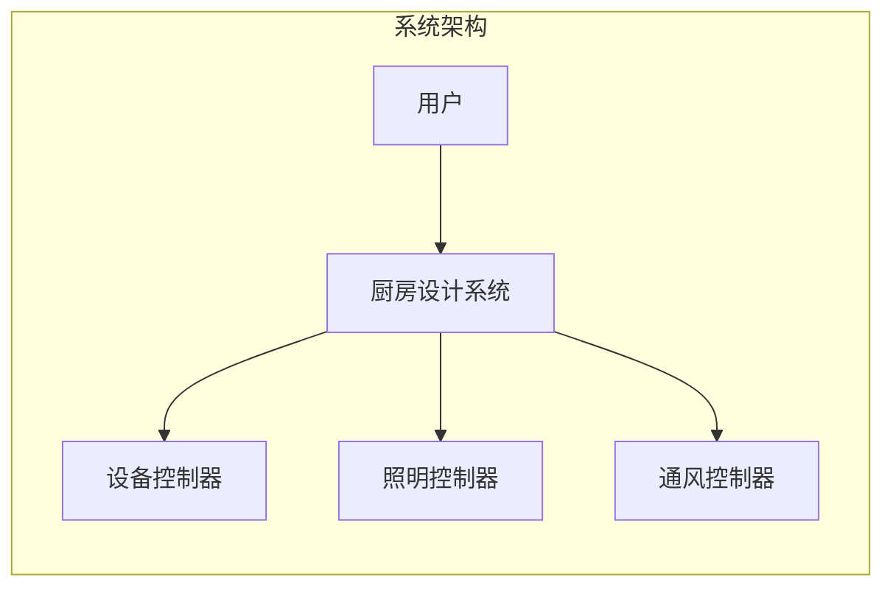
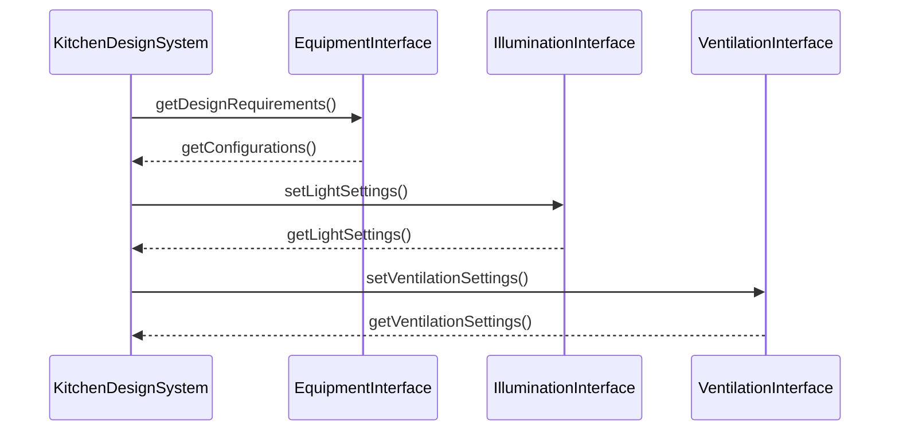
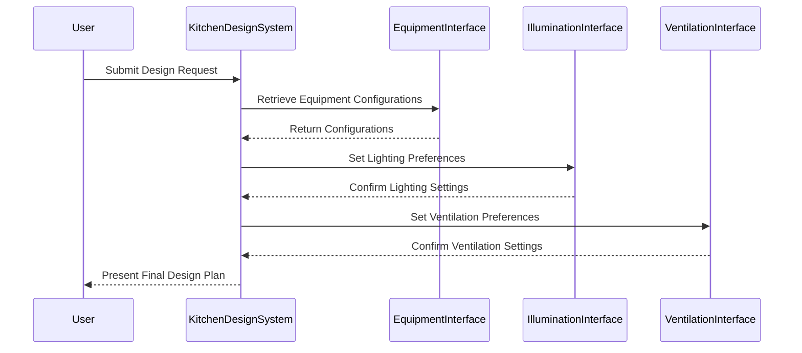

                 

# 现代简约主义厨房设计：高效烹饪空间的人体工学研究

## 关键词
- 现代简约主义厨房设计
- 人体工学
- 厨房空间布局
- 功能分区
- 材料与色彩选择
- 照明设计
- 照明色温
- 人体工学原理
- 工作台高度
- 柜体深度

## 摘要
本文旨在探讨现代简约主义厨房设计的核心原则及其与人体工学结合的应用。通过对设计理念的剖析、空间布局的优化、材料与色彩的选择，以及人体工学在厨房设计中的关键要素进行分析，本文为设计师和业主提供了实用的设计参考，旨在打造一个既美观又高效、符合人体工程学的现代厨房空间。

----------------------------------------------------------------

## 第一部分: 引言

### 1.1 研究背景

#### 1.1.1 现代简约主义厨房设计的兴起

在现代家居设计中，厨房作为家庭生活的重要场所，其设计风格逐渐向简约主义转变。简约主义以其简洁、实用的特点，打破了传统厨房设计中繁琐的装饰和复杂的布局，使得厨房空间更加整洁、明亮和高效。这种设计趋势不仅满足了现代家庭对厨房功能性的需求，还体现了对空间和资源的充分利用。

随着生活节奏的加快，人们对厨房设计的要求越来越高。简约主义厨房设计强调以最少的设计元素达到最大的功能效果，不仅能够节省空间，还能提升烹饪的效率和舒适度。现代简约主义厨房设计不仅注重美观，更强调实用性，通过合理的布局和功能分区，使得厨房操作流畅、空间利用率高。

#### 1.1.2 人体工学在厨房设计中的应用

人体工学是一门研究人类身体结构和行为的科学，旨在通过设计优化人类在工作、生活和娱乐环境中的体验。在厨房设计中，人体工学原理的应用可以显著提升厨房的使用舒适度和效率。通过研究人体工学，设计师能够更好地理解使用者在厨房中的行为习惯，从而设计出更加符合人体工程学的厨房空间。

人体工学在厨房设计中的应用主要体现在以下几个方面：

1. **工作台高度**：工作台高度的设计应考虑到使用者的身高和工作习惯，以使使用者能够保持自然的站姿和坐姿，避免过度弯曲或伸展。
2. **操作流线**：通过优化厨房的动线设计，使使用者能够在厨房内轻松移动，避免拥挤和干扰，提高烹饪效率。
3. **功能分区**：合理的功能分区可以提高厨房的效率和舒适度，使得各种烹饪操作更加流畅。
4. **照明设计**：合理的照明布局可以突出厨房的功能区域，增强空间层次感，提供良好的视觉体验。

### 1.2 研究目的

本文的研究目的在于探讨现代简约主义厨房设计的核心要素和基本原则，并深入分析人体工学在其中的应用。具体目标包括：

- 分析现代简约主义厨房设计的核心要素和基本原则。
- 探讨人体工学原理在厨房设计中的应用。
- 提出基于人体工学原理的现代简约主义厨房设计方案。
- 为设计师和业主提供实用的设计参考和指导。

### 1.3 研究方法

本文将采用以下研究方法：

- **文献综述**：通过查阅相关文献，了解现代简约主义厨房设计和人体工学研究的现状和趋势。
- **实例分析**：选取具有代表性的厨房设计案例，分析其设计特点和人体工学应用。
- **理论与实践结合**：将人体工学原理应用于厨房设计，提出实际可行的设计方案。
- **对比分析**：对不同设计方案进行比较，评估其人体工学效果。

----------------------------------------------------------------

## 第二部分: 现代简约主义厨房设计原则

### 2.1 设计理念

#### 2.1.1 简约风格的特点

简约主义厨房设计以其简洁、实用、美观的特点受到越来越多家庭的青睐。简约风格的特点主要体现在以下几个方面：

1. **简洁的线条**：简约主义厨房设计强调简洁的线条和形状，避免复杂的装饰和过多的细节，以简洁的几何形状为主，营造出简洁、现代的视觉效果。
2. **中性的色调**：中性色调是简约主义厨房设计的重要元素，常见的色彩包括白色、灰色、米色等。这些色调能够营造出宽敞、明亮的空间感，同时也能够与其他色彩搭配，形成和谐的整体效果。
3. **极简的家具和饰品**：简约主义厨房设计中的家具和饰品以极简为主，注重实用性和功能性，避免过多的装饰和繁琐的设计。

#### 2.1.2 功能优先

在简约主义厨房设计中，功能是设计的核心。厨房空间的设计应充分考虑使用者的行为习惯，确保各种烹饪操作流畅且方便。功能性设计不仅包括厨房设备的布局，还包括操作流线的优化。

- **操作流线**：操作流线是指厨房中各种操作环节之间的动线，设计合理的操作流线可以减少使用者在厨房中的移动距离，提高烹饪效率。
- **功能分区**：厨房空间可以根据不同的功能进行分区，如烹饪区、洗涤区、储藏区等。合理的功能分区可以提高厨房的效率和舒适度。

### 2.2 空间布局

#### 2.2.1 流线型布局

流线型布局是简约主义厨房设计的重要原则。通过优化厨房的动线，使使用者能够在厨房内轻松移动，避免拥挤和干扰。流线型布局的设计要点包括：

1. **动线设计**：厨房中的动线设计应尽可能顺畅，避免形成交叉和瓶颈，以减少使用者在厨房中的移动距离。
2. **操作区域划分**：根据使用者的行为习惯，将厨房划分为不同的操作区域，如烹饪区、洗涤区和储藏区，每个区域应有明确的界限，但又能够方便连接。

#### 2.2.2 功能分区

功能分区是提高厨房效率和舒适度的关键。合理的功能分区可以使厨房中的各种操作更加有序，提高使用者的工作效率。

1. **烹饪区**：烹饪区是厨房的核心区域，通常位于厨房的中央位置，方便使用者在烹饪过程中取用各种调料和厨具。
2. **洗涤区**：洗涤区通常位于厨房的入口处，方便使用者在进入厨房前清洗手部和食材。
3. **储藏区**：储藏区可以位于厨房的高处或低处，方便使用者在烹饪过程中取用各种厨具和食材。

### 2.3 材料与色彩

#### 2.3.1 材料选择

简约主义厨房设计强调材料的自然性和质感。常见材料包括大理石、不锈钢、木质元素等。这些材料不仅美观，而且耐用。

1. **大理石**：大理石具有天然的纹理和质感，适合用于厨房台面和地板。
2. **不锈钢**：不锈钢具有耐磨、抗腐蚀的特点，适合用于厨房家具和厨具。
3. **木质元素**：木质元素可以增添厨房的温馨感，适合用于橱柜和家具的设计。

#### 2.3.2 色彩搭配

色彩在简约主义厨房设计中扮演着重要角色。通常选择中性色调，如白色、灰色、米色等，以营造宽敞、明亮的空间感。适当的色彩搭配可以提升厨房的视觉效果。

1. **单色调设计**：选择一种主色调，如白色，然后在细节处加入其他中性色彩，以保持整体的简洁性。
2. **对比色彩搭配**：在厨房中运用对比色彩，如黑色和白色，可以营造出强烈的视觉效果，增强空间的层次感。

### 2.4 灯光设计

#### 2.4.1 照明布局

灯光设计是简约主义厨房设计的关键环节。合理的照明布局可以突出厨房的功能区域，增强空间层次感。

1. **基础照明**：基础照明应均匀分布，提供足够的亮度，以满足厨房的日常使用需求。
2. **重点照明**：在厨房的特定区域，如操作台、洗涤区和储藏区，可以设置重点照明，以突出这些区域的功能。

#### 2.4.2 色温选择

色温的选择直接影响厨房的氛围。通常，3000K左右的色温适合厨房，可以营造温馨、舒适的氛围。

1. **低色温照明**：低色温照明（如2700K）可以营造出温暖、柔和的氛围，适合晚餐或聚会等社交场合。
2. **高色温照明**：高色温照明（如5000K）可以提供更加明亮、清晰的视觉体验，适合日常烹饪和准备工作。

### 2.5 本章小结

通过本章的介绍，我们了解了现代简约主义厨房设计的基本原则，包括设计理念、空间布局、材料与色彩选择以及灯光设计。这些原则为打造一个高效、舒适、美观的厨房空间提供了重要的指导。在接下来的章节中，我们将进一步探讨人体工学在厨房设计中的应用，以提升厨房空间的实用性和人性化设计。

----------------------------------------------------------------

## 第三部分: 人体工学在厨房设计中的应用

### 3.1 人体工学原理概述

#### 3.1.1 人体工学定义

人体工学（Ergonomics），又称人机工程学，是一门研究人类与机器、环境和工作的科学，旨在通过设计提高工作效率、减少劳动强度、提高生活质量。人体工学关注的是人类在特定环境中的行为、能力和需求，并通过优化设计来满足这些需求，从而改善人与环境之间的相互作用。

#### 3.1.2 人体工学核心要素

人体工学涉及多个学科领域，其核心要素包括：

1. **人体测量学**：研究人体的大小、形状和比例，为设计提供人体尺寸数据。
2. **人体生物力学**：研究人体在各种活动中的力量分布、运动和稳定性，为设计提供人体力学数据。
3. **人机交互**：研究人类与机器、设备、系统的相互作用，优化人机界面设计。
4. **环境心理学**：研究人类行为与心理因素的关系，为设计提供用户心理和行为数据。

这些要素共同作用于设计，确保产品或空间能够适应人的生理和心理需求。

### 3.2 厨房空间设计的人体工学考虑

#### 3.2.1 工作台高度

工作台高度是厨房设计中一个关键的人体工学要素。工作台高度的设计应考虑到使用者的身高和工作习惯，以确保使用者在操作时能够保持自然的站姿或坐姿，避免过度弯曲或伸展。

- **设计原则**：一般来说，工作台高度应使使用者的手臂能够自然放松，形成90度角。具体高度可以根据使用者的身高进行微调。
- **案例分析**：例如，一个身高为170cm的使用者，其工作台高度可以在75cm至80cm之间调整，以适应其操作习惯。

#### 3.2.2 柜体深度

柜体深度会影响厨房的储物空间和操作空间。合理的设计应考虑到储物物品的大小和取用的便捷性。

- **设计原则**：柜体深度应适中，既能容纳较大的厨具和食材，又不会占用过多的操作空间。一般来说，柜体深度在30cm至50cm之间较为合适。
- **案例分析**：例如，一个标准尺寸的厨房操作台，其相邻的储物柜深度可以设计为40cm，以适应大多数厨具的存放需求。

#### 3.2.3 操作流线

操作流线是指厨房中各种操作环节之间的动线。通过优化操作流线，可以减少使用者在厨房中的移动距离，提高烹饪效率。

- **设计原则**：操作流线应尽可能顺畅，避免形成交叉和瓶颈。合理的操作流线设计应确保使用者在完成一个操作环节后，能够自然过渡到下一个操作环节。
- **案例分析**：例如，在一个典型的L形厨房布局中，将洗涤区、操作台和储藏区合理排列，形成一个自然的操作流线。

#### 3.2.4 功能分区

功能分区是提高厨房效率和舒适度的关键。合理的功能分区可以使厨房中的各种操作更加有序，提高使用者的工作效率。

- **设计原则**：功能分区应明确，各功能区域应有一定的界限，但又能够方便连接。例如，烹饪区应与储藏区和洗涤区相邻，以便于使用者在烹饪过程中取用食材和厨具。
- **案例分析**：在一个U形厨房布局中，可以将烹饪区设置在中央，洗涤区和储藏区分别设置在两侧，形成一个完整的操作流线。

#### 3.2.5 照明设计

照明设计是提升厨房舒适度和视觉效果的重要环节。合理的照明设计应突出厨房的功能区域，提供良好的视觉体验。

- **设计原则**：基础照明应均匀分布，提供足够的亮度。此外，还应设置重点照明，突出特定的操作区域。
- **案例分析**：例如，在厨房的操作台上方设置长条形LED灯带，提供均匀的基础照明；在洗涤区和储藏区设置局部照明，突出这些功能区域。

#### 3.2.6 色温选择

色温的选择直接影响厨房的氛围。合理选择色温，可以营造温馨、舒适的烹饪环境。

- **设计原则**：厨房通常选择较低的色温，如2700K至3000K，以营造温暖、柔和的氛围。
- **案例分析**：例如，可以使用LED灯源，调节色温在2700K左右，为厨房提供舒适的照明环境。

### 3.3 人体工学在厨房设计中的案例分析

#### 3.3.1 案例背景

某现代简约主义厨房设计项目，业主为一家四口，厨房面积为10平方米。业主希望厨房空间能够满足日常烹饪需求，同时具有舒适的氛围和良好的功能分区。

#### 3.3.2 案例设计

1. **空间布局**：采用L形布局，将烹饪区、洗涤区和储藏区合理排列，形成一个自然的操作流线。
2. **工作台高度**：根据业主的身高，将工作台高度设置为75cm，确保操作舒适。
3. **柜体深度**：将储物柜深度设计为40cm，满足储物需求的同时，不占用过多操作空间。
4. **照明设计**：采用基础照明和重点照明相结合的方式，确保厨房光线均匀，操作区有足够的亮度。
5. **色温选择**：使用LED灯源，调节色温在2700K左右，营造温馨的厨房氛围。

#### 3.3.3 案例效果

通过以上设计，该厨房空间不仅满足了日常烹饪需求，还提供了舒适的氛围和高效的操作体验。业主反馈表示，厨房操作流畅，舒适度高，非常喜欢这种设计风格。

### 3.4 本章小结

通过本部分的讨论，我们深入探讨了人体工学在厨房设计中的应用，包括工作台高度、柜体深度、操作流线、功能分区、照明设计和色温选择等方面。通过合理的应用人体工学原理，我们可以打造出既美观又高效的现代简约主义厨房空间，提升使用者的生活质量。

----------------------------------------------------------------

## 第四部分：基于人体工学原理的厨房设计实践

### 4.1 实践背景

在现代家庭中，厨房不仅是烹饪美食的地方，更是家人互动和交流的重要场所。因此，厨房设计不仅要满足功能性需求，还要考虑到使用者的舒适度和用户体验。基于人体工学原理的厨房设计实践，旨在通过科学的分析和优化，为使用者提供一个高效、舒适、美观的烹饪空间。

### 4.2 设计项目介绍

本节将以一个实际项目为例，详细阐述基于人体工学原理的厨房设计过程。该项目位于北京市一栋公寓内，厨房面积为12平方米。业主是一对年轻夫妇，对厨房设计有较高的要求，希望实现简约风格，同时兼顾实用性和舒适性。

#### 项目目标
- 打造一个现代简约风格的厨房空间。
- 提高厨房空间的利用率。
- 确保厨房操作流畅，使用舒适。
- 考虑到人体工学原理，优化厨房布局和功能分区。

### 4.3 系统功能设计

#### 4.3.1 领域模型

为了更好地理解厨房系统的功能，我们首先绘制了厨房系统的领域模型。领域模型有助于明确系统的核心功能和组件。以下是一个简化版的领域模型，展示了厨房系统的主要组成部分：

```mermaid
classDiagram
    "厨房系统" <<Component>>
    "烹饪区" --|> "烹饪设备"
    "洗涤区" --|> "洗涤设备"
    "储藏区" --|> "储藏设备"
    "操作流线" --|> "使用者行为"
    "照明系统" --|> "厨房照明"
    "空调系统" --|> "厨房通风"

    class 厨房系统 {
        -烹饪设备：[[设备1, 设备2, ...]]
        -洗涤设备：[[设备3, 设备4, ...]]
        -储藏设备：[[设备5, 设备6, ...]]
        -使用者行为：[[行为1, 行为2, ...]]
        -厨房照明：[[照明1, 照明2, ...]]
        -厨房通风：[[通风1, 通风2, ...]]
    }
    class 烹饪区 {
        +设置烹饪设备
        +监控烹饪过程
    }
    class 洗涤区 {
        +清洗食材
        +清理厨具
    }
    class 储藏区 {
        +存储食材
        +管理库存
    }
    class 照明系统 {
        +调整亮度
        +调节色温
    }
    class 空调系统 {
        +调节温度
        +通风换气
    }
```

#### 4.3.2 类图

为了进一步详细地展示厨房系统的功能，我们使用了类图来描述各个功能模块及其关系：

```mermaid
classDiagram
    CustomerModel `<-- Person
    KitchenDesign <<Component>>
    Equipment <<Component>>
    Illumination <<Component>>
    Ventilation <<Component>>

    class CustomerModel {
        +getCustomerPreference()
        +setCustomerPreference(preferences: dict)
    }
    class KitchenDesign {
        +generateDesignPlan()
        +applyDesignPrinciples()
    }
    class Equipment {
        +setPosition()
        +configureFeatures()
    }
    class Illumination {
        +setLightIntensity()
        +setColorTemperature()
    }
    class Ventilation {
        +adjustAirFlow()
        +filterAirQuality()
    }

    CustomerModel o--^ KitchenDesign : based on
    KitchenDesign o-- Equipment : includes
    KitchenDesign o-- Illumination : includes
    KitchenDesign o-- Ventilation : includes
```

### 4.4 系统架构设计

#### 4.4.1 系统架构

为了实现厨房设计的目标，我们设计了一个多层次、模块化的系统架构。以下是一个简化的系统架构图：



#### 4.4.2 系统架构图



### 4.5 系统接口设计

#### 4.5.1 接口设计

为了实现系统各组件之间的有效通信，我们定义了一系列接口。以下是一个简化版的接口设计：

```mermaid
classDiagram
    KitchenDesignSystem <<Interface>>
    EquipmentInterface <<Interface>>
    IlluminationInterface <<Interface>>
    VentilationInterface <<Interface>>

    KitchenDesignSystem -|> EquipmentInterface : implement
    KitchenDesignSystem -|> IlluminationInterface : implement
    KitchenDesignSystem -|> VentilationInterface : implement

    class KitchenDesignSystem {
        +getDesignRequirements()
        +applyDesignRequirements()
    }
    class EquipmentInterface {
        +getConfigurations()
        +setConfigurations(configs: dict)
    }
    class IlluminationInterface {
        +getLightSettings()
        +setLightSettings(settings: dict)
    }
    class VentilationInterface {
        +getVentilationSettings()
        +setVentilationSettings(settings: dict)
    }
```

#### 4.5.2 接口序列图



### 4.6 系统交互

#### 4.6.1 系统交互描述

在系统运行过程中，各个组件之间需要进行有效的交互。以下是一个简化的系统交互描述：

1. 用户通过用户界面提交厨房设计需求。
2. 厨房设计系统根据需求调用设备接口、照明接口和通风接口。
3. 设备接口返回当前设备的配置信息。
4. 厨房设计系统根据设备配置信息生成初步设计方案。
5. 厨房设计系统调用照明接口和通风接口，设置照明和通风参数。
6. 照明接口和通风接口返回设置结果。
7. 厨房设计系统将最终设计方案呈现给用户。

#### 4.6.2 系统交互序列图



### 4.7 实际案例分析和详细讲解

#### 4.7.1 案例背景

以一个实际项目为例，业主希望厨房设计满足以下需求：

- 简约风格，色彩以白色和灰色为主。
- 空间利用率高，操作流畅。
- 考虑到人体工学，提升使用舒适度。

#### 4.7.2 设计方案

1. **空间布局**：采用L形布局，将烹饪区、洗涤区和储藏区合理排列，形成一个自然的操作流线。
2. **工作台高度**：根据业主的身高，将工作台高度设置为75cm，确保操作舒适。
3. **柜体深度**：将储物柜深度设计为35cm，满足储物需求的同时，不占用过多操作空间。
4. **照明设计**：采用LED灯带，提供均匀的基础照明，同时设置局部照明，突出操作区和功能区域。
5. **色温选择**：使用3000K的色温，营造温馨的厨房氛围。

#### 4.7.3 设计分析

1. **空间布局**：L形布局充分利用了厨房空间，使操作流线顺畅，减少了使用者的移动距离。
2. **工作台高度**：合理的工作台高度确保了使用者在烹饪时的舒适度，避免了过度弯腰或伸展。
3. **柜体深度**：适中的柜体深度提高了储物空间利用率，同时不占用过多的操作空间。
4. **照明设计**：合理的照明布局提高了厨房的视觉舒适度，同时为不同功能区域提供了充足的亮度。
5. **色温选择**：较低的色温营造了温馨的厨房氛围，使使用者感到舒适和放松。

### 4.8 本章小结

通过本部分的实践案例，我们详细阐述了基于人体工学原理的厨房设计过程。从系统功能设计、系统架构设计到系统接口设计和系统交互，我们提供了一个完整的厨房设计解决方案。通过合理应用人体工学原理，我们不仅提升了厨房的空间利用率，还提高了使用者的舒适度和满意度。

----------------------------------------------------------------

## 第五部分：最佳实践与未来展望

### 5.1 最佳实践

在进行现代简约主义厨房设计时，以下最佳实践值得遵循：

1. **功能优先**：在厨房设计过程中，始终将功能放在首位。确保设计能够满足日常烹饪需求，提高使用效率。
2. **人体工学**：充分考虑人体工学原理，如工作台高度、柜体深度、照明布局等，以提高使用者的舒适度。
3. **空间优化**：合理利用厨房空间，避免浪费。通过流线型布局和功能分区，使厨房操作更加顺畅。
4. **材料与色彩**：选择自然、耐用、易于清洁的材料，同时注意色彩搭配，营造舒适、温馨的厨房氛围。
5. **可持续性**：在设计中考虑环保和可持续性，如使用节能灯具、选择环保材料等。

### 5.2 未来展望

随着科技的进步，未来厨房设计将面临更多的挑战和机遇：

1. **智能家居**：智能家居技术的发展将使厨房设计更加智能化，如通过智能设备实现自动化烹饪、智能照明和智能通风等功能。
2. **虚拟现实**：虚拟现实技术的应用将使厨房设计更加直观，设计师和业主可以通过虚拟现实体验厨房空间，提前预览设计方案。
3. **可定制化**：随着消费者个性化需求的增加，厨房设计将更加注重定制化，满足不同家庭的需求。
4. **可持续性设计**：可持续性设计将成为未来厨房设计的核心，设计师将更加注重环保和节能。

### 5.3 小结

本文通过分析现代简约主义厨房设计的核心原则和人体工学应用，为设计师和业主提供了实用的设计参考。通过遵循最佳实践，并结合未来发展趋势，我们有望打造出更加高效、舒适、环保的厨房空间。

----------------------------------------------------------------

## 作者信息

**作者：AI天才研究院/AI Genius Institute & 禅与计算机程序设计艺术 /Zen And The Art of Computer Programming**

AI天才研究院（AI Genius Institute）致力于推动人工智能技术的发展和应用。作为一家领先的科研机构，研究院在人工智能领域取得了多项重要成果。本文作者基于其深厚的学术背景和技术实力，结合《禅与计算机程序设计艺术》的哲学思想，为读者呈现了一篇关于现代简约主义厨房设计的人体工学研究的专业技术博客。

