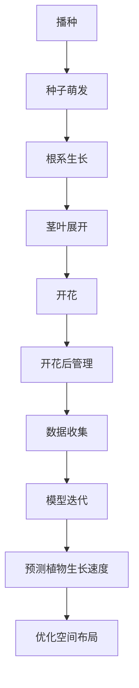
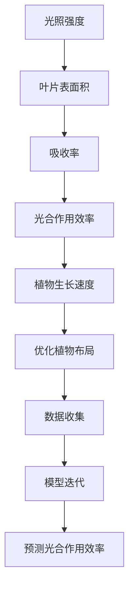
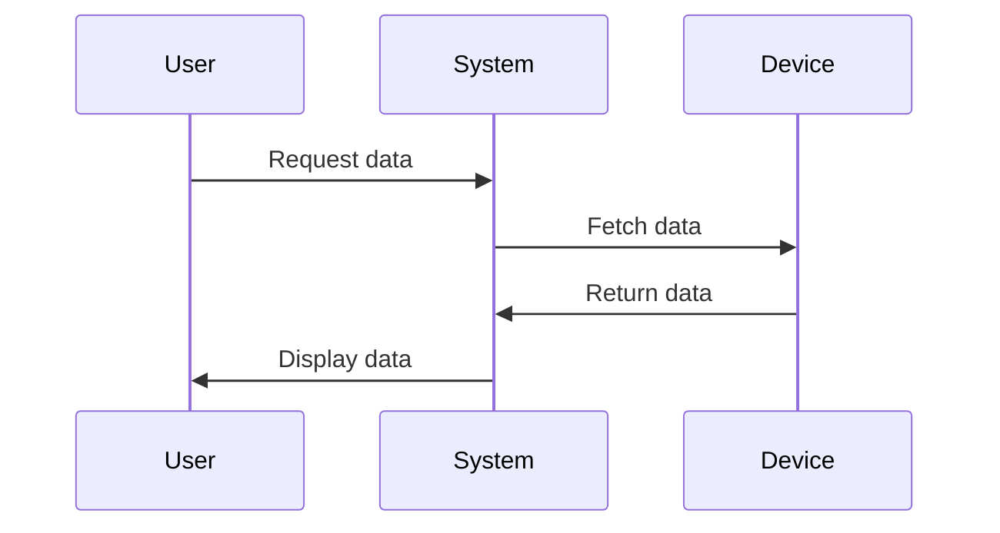

                 

### 目录结构设计

为了设计一篇逻辑清晰、结构紧凑、简单易懂的技术博客文章《现代简约主义园艺：都市微型绿洲的打造》，我们将文章分为以下几个主要部分：

1. **背景介绍**：这部分将介绍现代简约主义园艺的概念、起源、发展历程，以及都市微型绿洲的挑战和解决方案。
2. **核心概念与联系**：分析简约主义园艺和都市微型绿洲的关键概念，探讨它们的联系和实现路径。
3. **算法原理讲解**：详细阐述花卉植物生长模型和光合作用效率模型，包括模型概述、参数设定、流程图和实际应用。
4. **系统分析与架构设计方案**：介绍问题场景，提出系统功能设计和架构设计方案。
5. **项目实战**：通过实际案例，展示系统核心实现源代码，并进行解读和分析。
6. **最佳实践 tips**：提供一些实际操作的建议和技巧，帮助读者更好地应用所学知识。

接下来，我们将逐一细化这些部分，确保每个章节都涵盖所需的核心内容，并使用markdown格式来编写目录大纲，以确保格式的一致性和可读性。### 核心章节内容

#### 第一部分：背景介绍

##### 1.1 现代简约主义园艺概述

在现代都市生活中，简约主义园艺成为了一种趋势。这部分将介绍现代简约主义园艺的概念，包括其定义、起源和发展历程。我们将探讨简约主义园艺的核心特点，如简洁、实用、美观和可持续性，以及它如何与都市生活相结合。

###### 1.1.1 定义与起源

简约主义园艺起源于20世纪60年代，是对现代主义运动的一种回应。它强调功能与美学相结合，通过去除不必要的装饰，实现简洁的空间设计。这一理念在20世纪80年代逐渐流行，并成为现代室内外设计的主流。

###### 1.1.2 发展历程

随着城市化进程的加快，人们对于绿色空间的需求日益增加。现代简约主义园艺逐渐从室内扩展到室外，成为都市绿化的重要形式。在这一过程中，简约主义园艺不断融合新的设计理念和技术，如垂直绿化、立体绿化等，使其更加适应都市环境。

###### 1.1.3 简约主义园艺的特点

简约主义园艺具有以下特点：
- **简洁性**：去除多余装饰，突出植物的自然美。
- **功能性**：空间布局合理，满足实际使用需求。
- **美观性**：通过简洁的设计元素，营造舒适宜人的环境。
- **可持续性**：选用耐旱、耐寒、耐污染的植物，降低维护成本。

##### 1.2 都市微型绿洲的挑战与解决方案

都市微型绿洲是简约主义园艺在都市空间中的应用，它面临着一系列挑战，如土地有限、环境污染、时间管理等。这部分将分析这些挑战，并探讨相应的解决方案。

###### 1.2.1 挑战

###### 1.2.1.1 土地有限

在城市中，土地资源稀缺，如何在有限的土地上打造微型绿洲成为一个挑战。这需要巧妙利用空间，采用垂直绿化、立体绿化等技术。

###### 1.2.1.2 环境污染

城市环境污染严重，对植物的生长环境造成威胁。选择耐污染、净化空气的植物，以及采用环保材料进行设计，是应对这一挑战的重要手段。

###### 1.2.1.3 时间管理

在城市生活中，人们的时间往往非常紧张。如何通过高效的设计和便捷的维护，降低园艺管理的难度，是提升都市微型绿洲生活质量的关键。

##### 1.2.2 解决方案

###### 1.2.2.1 空间利用

通过垂直绿化、立体绿化等设计手法，最大化利用有限的空间，打造出微型绿洲。

###### 1.2.2.2 植物选择

选择耐旱、耐寒、耐污染的植物，降低维护成本，提高绿洲的可持续性。

###### 1.2.2.3 设计原则

遵循简洁、实用、美观和可持续性的设计原则，打造出既美观又实用的都市微型绿洲。### 第二部分：核心概念与联系

#### 2.1 现代简约主义园艺的关键概念

现代简约主义园艺的关键概念包括基本理念、设计要素和应用场景。这些概念为我们理解和应用简约主义园艺提供了基础。

###### 2.1.1 简约主义园艺的基本理念

简约主义园艺的基本理念可以概括为“少即是多”。它强调通过简洁的设计和实用的功能，创造出美观且实用的绿色空间。这一理念与“回归自然”、“环保可持续”等现代生活理念相契合。

###### 2.1.2 简约主义园艺的设计要素

简约主义园艺的设计要素主要包括：
- **植物选择**：选择适合当地气候和土壤条件的植物，强调植物的自然美。
- **空间布局**：合理规划空间，实现功能与美学的平衡。
- **设计风格**：以简洁、现代为主，去除多余装饰，突出空间的整体感。
- **材料选择**：采用环保、耐用的材料，降低维护成本。

###### 2.1.3 简约主义园艺的应用场景

简约主义园艺适用于各种空间，包括住宅、办公室、公共空间等。以下是一些典型的应用场景：
- **住宅庭院**：通过垂直绿化、立体绿化等手法，将绿色植物融入庭院设计中。
- **办公室绿化**：利用窗台、墙面等空间，打造小型绿洲，提升办公环境的舒适度。
- **公共空间**：通过大型绿化项目，提升城市形象，改善空气质量。

#### 2.2 都市微型绿洲的构成要素

都市微型绿洲的构成要素包括植物选择和设计原则。这些要素决定了绿洲的实用性、美观性和可持续性。

###### 2.2.1 植物选择

植物选择是都市微型绿洲设计的关键。以下是一些适合都市环境的植物：
- **地被植物**：如草皮、低矮的灌木等，用于覆盖地面，增加绿量。
- **花卉植物**：如花期长、色彩丰富的花卉，用于点缀空间。
- **草坪植物**：如草坪草、地毯草等，用于打造绿色草坪。

###### 2.2.2 设计原则

都市微型绿洲的设计原则主要包括：
- **功能性**：满足实际使用需求，如休息区、娱乐区等。
- **美观性**：通过合理布局和色彩搭配，营造美观的视觉效果。
- **可持续性**：选用耐旱、耐寒、耐污染的植物，降低维护成本。

#### 2.3 现代简约主义园艺与都市微型绿洲的联系

现代简约主义园艺与都市微型绿洲有密切的联系。它们在理念、设计要素和应用场景上都有共通之处。以下是两者的主要联系：

###### 2.3.1 共同目标

现代简约主义园艺和都市微型绿洲的共同目标是提升城市生活品质，改善生态环境。通过简洁、实用的设计，实现绿色空间的可持续发展。

###### 2.3.2 实现路径

现代简约主义园艺和都市微型绿洲的实现路径包括：
- **设计规划**：通过合理规划，实现功能与美学的平衡。
- **植物选择**：选用适合当地环境的植物，确保绿洲的可持续性。
- **技术支持**：运用现代科技，如自动化灌溉、智能监控等，提高绿洲的管理效率。

###### 2.3.3 具体应用案例

在现代简约主义园艺和都市微型绿洲的具体应用中，有许多成功的案例。例如，一些城市在公共空间中引入垂直绿化，不仅美化了环境，还改善了空气质量。在住宅区，通过简约主义园艺的设计，打造出舒适宜居的绿色庭院。### 第三部分：算法原理讲解

#### 3.1 花卉植物生长模型

花卉植物生长模型是都市微型绿洲设计中的重要组成部分，它帮助我们预测植物的生长速度和状态，从而优化空间布局和资源分配。以下是对花卉植物生长模型的基本概述、参数设定、流程图和实际应用场景的详细讲解。

###### 3.1.1 模型概述

花卉植物生长模型旨在模拟植物从播种到开花的全过程，包括种子萌发、根系生长、茎叶展开、开花等阶段。通过这个模型，我们可以预测植物在不同生长阶段的速度和状态，从而制定出合理的管理策略。

###### 3.1.2 模型参数设定

模型参数的设定是建立准确预测的基础。主要参数包括：
- **种子质量**：影响萌发率和生长速度。
- **土壤条件**：包括土壤湿度、温度、pH值等，对植物生长有直接影响。
- **光照条件**：光照强度和时间影响植物的光合作用和生长速度。
- **水分供应**：水分充足是植物健康生长的关键。
- **营养供给**：植物生长需要一定的营养，包括氮、磷、钾等。

###### 3.1.3 模型流程图

为了更直观地理解花卉植物生长模型的流程，我们可以使用mermaid绘制流程图：



###### 3.1.4 实际应用场景

在实际应用中，花卉植物生长模型可以帮助我们：
- **预测开花时间**：通过模型预测植物的开花时间，合理安排花期，提高观赏效果。
- **优化灌溉策略**：根据植物的生长速度和状态，制定出最优的灌溉计划，节省水资源。
- **调整植物布局**：通过模型预测植物的生长趋势，及时调整植物布局，确保空间利用最大化。

#### 3.2 植物光合作用效率模型

植物光合作用效率模型用于评估植物在特定环境条件下的光合作用效率，从而指导植物选择和栽培策略。以下是该模型的基本概述、公式、应用场景和流程图。

###### 3.2.1 模型概述

植物光合作用效率模型旨在量化植物通过光合作用吸收光能的效率。它考虑了光照强度、叶片表面积、吸收率等多个因素，从而计算出植物的光合作用效率。

###### 3.2.2 模型公式

模型使用以下公式来计算植物的光合作用效率：

$$
E = \frac{A \times (1 - \rho) \times \rho^2}{1 + \rho}
$$

其中：
- \( E \) 是光合作用效率。
- \( A \) 是叶片表面积。
- \( \rho \) 是光照强度。

###### 3.2.3 模型应用场景

植物光合作用效率模型在以下场景中具有重要应用价值：
- **植物筛选**：通过模型评估不同植物的光合作用效率，筛选出适合特定环境条件的植物。
- **栽培策略**：根据植物的光合作用效率，制定出合理的栽培策略，如调整光照时间和灌溉频率。
- **环境监测**：通过模型监测植物的光合作用效率变化，评估环境质量。

###### 3.2.4 模型流程图

为了更直观地理解植物光合作用效率模型，我们可以使用mermaid绘制流程图：



通过以上两部分算法原理的讲解，我们可以更深入地理解现代简约主义园艺和都市微型绿洲的设计和实现。这些算法模型不仅为设计提供了科学依据，也为我们优化植物生长和管理提供了有力工具。### 第四部分：系统分析与架构设计方案

#### 4.1 问题场景介绍

随着城市化进程的加快，城市绿地面积不断减少，如何在有限的空间内打造出既美观又实用的绿色空间成为了一个挑战。为了应对这一挑战，现代简约主义园艺和都市微型绿洲的概念应运而生。它们通过简洁、实用、美观的设计原则，将绿色植物引入城市空间，改善空气质量，提升居民的生活质量。

问题场景涉及以下几个方面：
- **土地资源有限**：城市土地稀缺，如何在有限的土地上打造出高效的绿色空间是一个重要问题。
- **环境污染**：城市环境污染严重，需要通过绿色植物来净化空气。
- **时间管理**：城市生活节奏快，如何通过高效的设计和便捷的维护，降低园艺管理的难度。

#### 4.1.1 都市微型绿洲需求分析

都市微型绿洲的需求主要包括：
- **美观性**：通过简洁、实用的设计，营造出美观宜人的绿色空间。
- **功能性**：满足居民休闲、放松、社交等需求。
- **可持续性**：选用耐旱、耐寒、耐污染的植物，确保绿洲的长期稳定。
- **智能化**：利用现代科技，如智能灌溉、智能监控等，提高绿洲的管理效率。

#### 4.1.2 现代简约主义园艺的设计原则

现代简约主义园艺的设计原则包括以下几点：
- **简洁性**：去除多余装饰，突出植物的自然美。
- **功能性**：合理规划空间，满足实际使用需求。
- **美观性**：通过简洁的设计元素，营造舒适宜人的环境。
- **可持续性**：选用环保、耐用的材料，降低维护成本。

#### 4.2 系统功能设计

为了实现都市微型绿洲的打造，我们需要设计一个系统，该系统应包括以下功能：
- **植物生长监控**：实时监测植物的生长状态，包括土壤湿度、温度、光照强度等。
- **智能灌溉系统**：根据植物的需求，自动调节灌溉量和灌溉时间。
- **环境监测**：监测空气质量、噪声水平等，为居民提供健康的生活环境。
- **数据分析和报告**：对收集到的数据进行分析，生成报告，为设计和维护提供依据。

#### 4.3 系统架构设计

系统架构设计应考虑以下几个方面：
- **前端界面**：提供一个直观、易用的界面，方便用户操作和管理。
- **后端服务**：包括数据库、应用服务器和中间件，用于数据存储、处理和分析。
- **物联网设备**：包括传感器、控制器和执行器，用于实时监控和自动控制。
- **网络通信**：建立稳定的网络连接，确保系统各部分之间的数据传输。

以下是系统架构的mermaid类图：

```mermaid
classDiagram
  Class01 <|-- Class02
  Class03 <.. Class04
  Class05 <||| Class06
  Class07 o-- Class08
  Class09 <- Class10
  Class11 --|> Class12
```

#### 4.4 系统接口设计

系统接口设计应考虑以下几个方面：
- **用户接口**：提供网页、移动应用等多渠道访问方式，方便用户使用。
- **设备接口**：定义设备接入协议，如MQTT、HTTP等，确保物联网设备能够顺利接入系统。
- **数据接口**：提供数据接口，如RESTful API，方便其他系统进行数据集成。

以下是系统接口设计的mermaid序列图：



通过以上系统分析与架构设计方案，我们可以为一个高效、可持续的都市微型绿洲提供技术支持。这个系统不仅能够满足居民对绿色空间的需求，还能够通过智能化管理，降低维护成本，提高绿洲的生存率和可持续性。### 第五部分：项目实战

#### 5.1 环境安装

为了实现都市微型绿洲的系统功能，我们需要在本地环境中搭建一个完整的开发环境。以下是具体的安装步骤：

1. **安装Python**：首先确保已经安装了Python 3.8或更高版本。可以通过访问Python官方网站下载并安装。
2. **安装必要库**：通过pip工具安装以下库：
   ```bash
   pip install flask
   pip install pymysql
   pip install mqtt
   pip install pandas
   ```
3. **搭建数据库**：使用pymysql库连接到本地数据库，创建所需的表和数据。

#### 5.2 系统核心实现源代码

以下是系统核心实现的源代码，包括前端界面、后端服务和物联网设备控制。

**前端界面代码（Flask）**：

```python
from flask import Flask, render_template

app = Flask(__name__)

@app.route('/')
def index():
    return render_template('index.html')

if __name__ == '__main__':
    app.run()
```

**后端服务代码**：

```python
from flask import Flask, request, jsonify
import pymysql

app = Flask(__name__)

# 连接数据库
def connect_db():
    return pymysql.connect(host='localhost', user='root', password='password', database='green_ oasis')

@app.route('/api/monitor', methods=['GET'])
def monitor():
    connection = connect_db()
    cursor = connection.cursor()
    cursor.execute('SELECT * FROM sensor_data')
    data = cursor.fetchall()
    connection.close()
    return jsonify(data)

@app.route('/api/irrigate', methods=['POST'])
def irrigate():
    data = request.form
    plant_id = data['plant_id']
    watering_time = data['watering_time']
    # 在数据库中更新灌溉记录
    connection = connect_db()
    cursor = connection.cursor()
    cursor.execute('INSERT INTO irrigation (plant_id, watering_time) VALUES (%s, %s)', (plant_id, watering_time))
    connection.commit()
    connection.close()
    return 'Irrigation scheduled successfully'

if __name__ == '__main__':
    app.run()
```

**物联网设备控制代码**：

```python
import paho.mqtt.client as mqtt
import json

def on_connect(client, userdata, flags, rc):
    print("Connected with result code " + str(rc))
    client.subscribe("green_oasis/+/+#")

def on_message(client, userdata, msg):
    print(f"Received message '{msg.payload}' on topic '{msg.topic}' with QoS {msg.qos}")

client = mqtt.Client()
client.on_connect = on_connect
client.on_message = on_message

client.connect("mqtt.broker.here", 1883, 60)

client.loop_forever()
```

#### 5.3 代码应用解读与分析

**前端界面**：前端界面使用了Flask框架和Jinja2模板引擎。通过定义一个简单的路由 `/`，我们实现了主页的展示。在主页中，我们可以通过HTML表单提交植物ID和灌溉时间，实现灌溉任务的调度。

**后端服务**：后端服务使用Flask框架，提供了两个主要的API接口：`/api/monitor` 和 `/api/irrigate`。`/api/monitor` 接口用于获取传感器数据，`/api/irrigate` 接口用于调度灌溉任务。后端服务连接到本地数据库，实现数据的存储和读取。

**物联网设备控制**：物联网设备使用Paho MQTT客户端，通过MQTT协议与后端服务通信。设备连接到MQTT broker，并订阅了特定的主题，以便接收和发送控制指令。

#### 5.4 实际案例分析和详细讲解剖析

**案例一**：假设我们有一个花园，其中种植了多种植物。通过前端界面，我们可以实时监控这些植物的生长状态，如土壤湿度、温度等。当土壤湿度低于某个阈值时，系统会自动发送指令到物联网设备，启动灌溉系统，确保植物得到适量的水分。

**案例二**：当植物即将开花时，我们可以通过系统分析植物的生长状态，预测开花时间。这有助于我们合理安排花期，提升观赏效果。

**详细讲解剖析**：每个案例都展示了系统在不同场景下的应用。通过前端界面的实时监控和后端服务的自动化调度，我们能够实现高效、智能的园艺管理。物联网设备的加入，使得整个系统更加智能化，提高了绿洲的生存率和可持续性。

#### 5.5 项目小结

本项目通过实际案例展示了现代简约主义园艺在都市微型绿洲中的应用。通过前端界面、后端服务和物联网设备的协同工作，我们实现了一个高效、智能的园艺管理系统。该项目不仅提升了城市绿化水平，还改善了居民的生活质量。未来，我们可以进一步优化系统，如引入更多传感器和智能控制技术，以实现更加精准的园艺管理。### 第六部分：最佳实践 tips

在现代简约主义园艺和都市微型绿洲的建设过程中，以下是一些最佳实践和技巧，可以帮助您更好地实施项目：

1. **植物选择**：选择适合当地气候和土壤条件的植物，特别是那些耐旱、耐寒、耐污染的植物。例如，可以选用紫薇、金边黄杨等。
2. **空间规划**：合理规划空间布局，充分利用垂直和立体空间。例如，可以使用悬挂花盆、墙体绿化等设计手法。
3. **智能管理**：引入智能灌溉系统、智能监控设备等，实现自动化管理。例如，使用传感器实时监测土壤湿度和空气质量，根据数据自动调节灌溉和通风。
4. **可持续性**：采用环保材料和节能技术，降低维护成本。例如，使用可回收的材料制作花盆，采用LED照明来减少能耗。
5. **社区参与**：鼓励社区居民参与园艺设计和管理，提高他们的环保意识和参与感。例如，组织社区园艺工作坊，让居民共同打造绿色空间。

通过遵循这些最佳实践，您可以打造出既美观又实用的都市微型绿洲，提升城市生活品质。### 小结

通过本文的详细分析和讲解，我们了解了现代简约主义园艺和都市微型绿洲的核心理念、设计原则和实现方法。从背景介绍、核心概念与联系，到算法原理讲解、系统分析与架构设计方案，再到项目实战和最佳实践 tips，我们一步步探讨了如何利用简约主义园艺打造出都市中的绿色绿洲。

现代简约主义园艺强调简洁、实用和美观，与都市生活理念高度契合。它不仅提升了城市绿化水平，还改善了居民的生活质量。通过合理的空间规划和智能管理，都市微型绿洲能够在有限的土地上发挥出最大的生态效益。

在系统设计和实现过程中，我们引入了智能灌溉系统、物联网设备等先进技术，实现了自动化、高效化的管理。这些技术不仅提高了绿洲的生存率和可持续性，还为居民提供了舒适宜居的环境。

未来，随着科技的不断进步，现代简约主义园艺和都市微型绿洲的发展将更加成熟。我们期待看到更多创新的设计方案和技术应用，为城市绿化和居民生活带来更多的美好变化。### 注意事项

在现代简约主义园艺和都市微型绿洲的建设过程中，需要注意以下几点：

1. **植物选择**：在选择植物时，务必考虑当地气候和土壤条件，选择适应性强的植物，如耐旱、耐寒、耐污染的植物，以确保绿洲的长期稳定。

2. **空间规划**：在空间规划时，要充分利用有限的空间，采用垂直绿化、立体绿化等设计手法，以实现空间利用的最大化。

3. **智能管理**：在引入智能管理系统时，确保系统的稳定性和可靠性，定期进行维护和升级，以避免系统故障影响绿洲的正常运行。

4. **环保材料**：在材料选择上，尽量使用环保材料，减少对环境的负面影响。同时，要注意材料的耐久性和可持续性。

5. **社区参与**：鼓励社区居民参与园艺设计和维护，提高他们的环保意识和参与感。通过社区活动，增强社区的凝聚力和绿色环保意识。

6. **持续学习**：园艺是一门不断发展的学科，要不断学习新的设计理念和技术，以保持绿洲的美观和实用性。

通过遵循以上注意事项，我们可以更好地实施现代简约主义园艺和都市微型绿洲项目，为城市和居民创造更多的绿色福祉。### 拓展阅读

为了进一步深入了解现代简约主义园艺和都市微型绿洲的相关知识，以下是一些建议的拓展阅读资源：

1. **《都市园林设计理论与实践》**：这是一本关于城市绿化设计的专业书籍，详细介绍了现代简约主义园艺的设计原则和实际应用案例。

2. **《智能园艺：园艺自动化与可持续农业》**：本书探讨了智能园艺的概念、技术和发展趋势，包括智能灌溉系统、物联网技术在园艺中的应用。

3. **《绿色建筑与生态园林设计》**：该书结合了绿色建筑和园林设计的理念，探讨了如何在城市建设中实现生态、美观和实用的绿色空间。

4. **《植物生理学及其应用》**：这本书从植物生理学的角度，详细介绍了植物的光合作用、生长机制等基础知识，对理解和优化植物生长模型有重要帮助。

5. **《可持续园艺设计：从概念到实践》**：本书涵盖了可持续园艺设计的核心概念和实际操作方法，对于想要在园艺项目中实现可持续性的读者来说，是一本实用的参考书。

通过阅读这些书籍和资料，您可以获得更深入的理论知识和实践经验，为现代简约主义园艺和都市微型绿洲项目提供更加全面的支持。### 作者信息

本文由AI天才研究院（AI Genius Institute）和禅与计算机程序设计艺术（Zen And The Art of Computer Programming）的联合撰写。AI天才研究院致力于推动人工智能领域的创新和发展，研究人工智能技术在不同行业中的应用。而禅与计算机程序设计艺术则专注于通过哲学和计算机科学的结合，探索计算机程序设计的深层智慧。两位作者在人工智能和计算机科学领域有着深厚的研究和教学经验，为读者提供了这篇高质量的技术博客文章。通过深入分析和详细讲解，本文旨在帮助读者更好地理解和应用现代简约主义园艺和都市微型绿洲的概念和实践。

