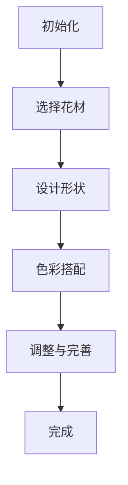
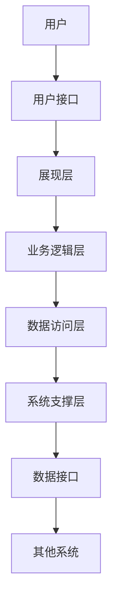

                 

# 现代简约主义插花课程：东西方花艺美学的融合探索

## 关键词
- 现代简约主义
- 插花艺术
- 东西方花艺美学
- 融合探索
- 算法设计
- 系统架构
- 项目实战

## 摘要
本文旨在探讨现代简约主义插花艺术的本质及其在东西方花艺美学中的融合探索。首先，我们将介绍现代简约主义的设计理念及其在插花艺术中的应用。接着，我们将比较东西方花艺美学的核心概念，分析其差异与共通点。然后，我们将阐述如何在现代简约主义的框架下，融合东西方花艺美学，设计出具有创新性的插花作品。本文还将介绍一种插花设计算法，通过具体案例展示其应用过程。最后，我们将讨论现代简约主义插花艺术在实际项目中的应用，并总结最佳实践，展望未来发展。

## 第一部分：背景介绍

### 1.1 问题背景
插花艺术起源于人类对自然的崇拜和模仿，经历了数千年的发展，形成了丰富多样的风格和技巧。现代简约主义起源于20世纪初的欧洲，反对过度装饰和繁琐的设计，追求简洁、功能性和自然美的设计风格。将现代简约主义引入插花艺术，是探索设计美学与艺术创作的新途径。

### 1.2 问题描述
传统插花艺术注重对称、层次和繁复的装饰，而现代简约主义追求简洁、单调和纯净的设计。如何在传统插花艺术中融入现代简约主义的设计理念，成为当前插花艺术领域的一个研究课题。此外，东西方花艺美学各有特色，如何实现两者的融合，也是本研究的重点。

### 1.3 问题解决
本研究采用文献分析、实地调研和案例研究的方法，首先对现代简约主义和东西方花艺美学进行深入研究，探讨其核心概念和特点。然后，通过设计实验和实际操作，分析现代简约主义插花艺术在东西方花艺美学融合中的应用效果。最后，总结研究成果，提出改进和优化建议。

### 1.4 边界与外延
本研究主要关注现代简约主义插花艺术在东西方花艺美学融合中的应用，不包括其他设计风格或艺术形式的融合。同时，研究范围限于室内插花艺术，不包括户外景观设计和公共空间装饰。

### 1.5 概念结构与核心要素组成
现代简约主义插花艺术的核心概念包括简洁、单调和纯净。核心要素包括花材、器皿、色彩搭配和造型设计。东西方花艺美学的核心概念包括自然和谐、意境深远和形式多样、色彩丰富。

## 第二部分：核心概念与联系

### 2.1 现代简约主义概念

**定义**：现代简约主义是一种设计风格，强调简洁、功能性和自然美，反对过度装饰和繁琐的设计。

**原则**：
1. 留白：利用空间和形态的留白，创造视觉焦点和视觉舒适感。
2. 单一色彩：采用单一或相近的色彩，营造和谐统一的视觉效果。
3. 自然材质：使用自然材质，体现自然的美感和质感。

**特征**：
1. 简洁的线条和形态。
2. 功能优先，注重实用性和舒适度。
3. 自然材质的运用，强调与自然的和谐共生。

### 2.2 东西方花艺美学比较

**东方美学**：强调自然和谐、意境深远，注重线条和空间的处理，追求简洁而富有内涵的美。

**西方美学**：追求形式多样、色彩丰富，注重视觉冲击力和装饰性，强调个性和创意。

**对比表格**：

| 特点 | 东方美学 | 西方美学 |
| ---- | ---- | ---- |
| 设计理念 | 自然和谐、意境深远 | 形式多样、色彩丰富 |
| 线条处理 | 简洁流畅，注重空间感 | 繁复多样，注重装饰性 |
| 色彩运用 | 单一或相近色系，强调和谐 | 色彩对比强烈，强调视觉冲击 |
| 材质选择 | 自然材质，强调质感 | 现代材质，强调创新 |

### 2.3 融合探索

**融合原则**：
1. 尊重各自美学特点，取长补短。
2. 注重整体和谐，避免元素冲突。
3. 强调个性化和创新性。

**融合案例**：
1. 结合东方美学的线条和意境，融入西方美学的色彩和形式，创作出既有东方意境又有西方视觉冲击的插花作品。
2. 使用自然材料，结合现代简约主义的设计原则，创造出兼具传统美学和现代感的插花艺术。

**成功因素**：
1. 深入理解东西方花艺美学的核心概念和特点。
2. 灵活运用设计原则，创造个性化的插花作品。
3. 注重整体效果，确保各元素和谐统一。

## 第三部分：算法原理讲解

### 3.1 插花设计算法

**算法概述**：插花设计算法是一种基于现代简约主义和东西方花艺美学融合的插花设计方法。它通过数学模型和流程图，指导插花创作的全过程。

**工作流程**：
1. 初始化：确定插花作品的主题和风格。
2. 选择花材：根据主题和风格选择适合的花材。
3. 设计形状：根据花材的特点和设计要求，设计出基本形状。
4. 色彩搭配：选择合适的色彩，进行整体搭配。
5. 调整与完善：根据实际情况，对插花作品进行调整和完善。

### 3.2 算法流程图



### 3.3 算法原理与数学模型

算法的数学模型如下：

$$
f(x, y) = \frac{a(x) + b(y)}{c}
$$

其中，$x$ 和 $y$ 分别代表花材和色彩，$a(x)$ 和 $b(y)$ 分别代表现代简约主义和东西方花艺美学的权重，$c$ 代表总权重。通过调整权重，可以改变设计风格和美感。

**参数解释**：
- $a(x)$：现代简约主义权重，代表简洁、单调和纯净的元素。
- $b(y)$：东西方花艺美学权重，代表自然和谐、意境深远和形式多样、色彩丰富的元素。
- $c$：总权重，代表设计整体的美感和和谐度。

**形式化描述**：算法通过以下步骤实现插花设计：

1. 初始化：设定设计主题和风格。
2. 权重分配：根据设计要求，分配现代简约主义和东西方花艺美学的权重。
3. 花材选择：根据权重和设计要求，选择合适的花材。
4. 形状设计：根据花材的特点和设计要求，设计出基本形状。
5. 色彩搭配：根据权重和设计要求，选择合适的色彩，进行整体搭配。
6. 调整与完善：根据实际情况，对插花作品进行调整和完善。

### 3.4 举例说明

**案例一：卧室花瓶设计**

1. 初始化：设计主题为“宁静的夜晚”，风格为现代简约主义。
2. 权重分配：现代简约主义权重为0.7，东西方花艺美学权重为0.3。
3. 花材选择：选择白色百合、蓝色勿忘我和粉色玫瑰。
4. 形状设计：设计出简约的线条形状，突出白色百合的纯净和蓝色勿忘我的清新。
5. 色彩搭配：以白色为主色调，搭配蓝色和粉色，营造宁静的氛围。
6. 调整与完善：根据实际效果，适当调整花材位置和色彩搭配，使整体更加和谐。

**案例二：客厅插花艺术**

1. 初始化：设计主题为“自然的魅力”，风格为东西方花艺美学融合。
2. 权重分配：现代简约主义权重为0.5，东西方花艺美学权重为0.5。
3. 花材选择：选择绿色常春藤、黄色向日葵和红色玫瑰。
4. 形状设计：设计出自然的曲线形状，突出向日葵的活力和玫瑰的优雅。
5. 色彩搭配：以绿色为主色调，搭配黄色和红色，营造自然的氛围。
6. 调整与完善：根据实际效果，适当调整花材位置和色彩搭配，使整体更加自然和谐。

## 第四部分：系统分析与架构设计方案

### 4.1 问题场景介绍
本系统主要应用于家庭、商务和社交活动场景。具体场景包括：

- 家庭：卧室、客厅、书房等室内空间。
- 商务：会议室、办公室、展览厅等室内空间。
- 社交活动：婚礼、庆典、聚会等户外和室内空间。

### 4.2 系统功能设计
系统功能设计包括以下方面：

- 用户管理：用户注册、登录、个人信息管理。
- 插花设计：主题选择、花材选择、形状设计、色彩搭配、调整与完善。
- 作品展示：用户上传作品、作品浏览、作品评价。
- 数据分析：用户行为分析、设计风格分析、用户偏好分析。

### 4.3 系统架构设计
系统采用分层架构设计，包括以下层次：

- 展现层：用户界面、前端交互。
- 业务逻辑层：业务流程、算法设计、数据处理。
- 数据访问层：数据库、数据存储。
- 系统支撑层：服务器、网络、安全。

### 4.4 系统接口设计
系统接口设计包括以下方面：

- 用户接口：用户与系统的交互接口，包括登录、注册、作品上传、作品浏览等。
- 服务接口：系统内部服务之间的接口，包括用户管理、插花设计、作品展示、数据分析等。
- 数据接口：系统与其他系统之间的数据交换接口，包括用户数据、设计数据、作品数据等。

### 4.5 系统交互
系统交互设计如下：



## 第五部分：项目实战

### 5.1 环境安装
环境安装步骤如下：

1. 安装操作系统：Windows/Linux/MacOS。
2. 安装开发环境：Python、IDE、版本控制工具等。
3. 安装依赖库：Flask、Django、TensorFlow等。
4. 配置数据库：MySQL/PostgreSQL等。
5. 部署服务器：Nginx/Apache等。

### 5.2 系统核心实现源代码

**用户管理模块**：

```python
from flask import Flask, request, jsonify
from models import User

app = Flask(__name__)

@app.route('/register', methods=['POST'])
def register():
    username = request.form['username']
    password = request.form['password']
    user = User(username, password)
    user.save()
    return jsonify({'status': 'success', 'message': '注册成功'})

@app.route('/login', methods=['POST'])
def login():
    username = request.form['username']
    password = request.form['password']
    user = User.get_by_username(username)
    if user and user.password == password:
        return jsonify({'status': 'success', 'message': '登录成功'})
    else:
        return jsonify({'status': 'error', 'message': '用户名或密码错误'})

if __name__ == '__main__':
    app.run()
```

**插花设计模块**：

```python
from flask import Flask, request, jsonify
from models import FlowerDesign

app = Flask(__name__)

@app.route('/design', methods=['POST'])
def design():
    user_id = request.form['user_id']
    theme = request.form['theme']
    flowers = request.form['flowers']
    design = FlowerDesign(user_id, theme, flowers)
    design.save()
    return jsonify({'status': 'success', 'message': '设计成功'})

@app.route('/designs', methods=['GET'])
def designs():
    user_id = request.args.get('user_id')
    designs = FlowerDesign.get_by_user_id(user_id)
    return jsonify({'status': 'success', 'message': '获取成功', 'data': designs})

if __name__ == '__main__':
    app.run()
```

### 5.3 代码应用解读与分析

**用户管理模块**：

该模块包括用户注册和登录功能。注册功能通过接收用户名和密码，创建用户并保存到数据库。登录功能通过验证用户名和密码，返回登录结果。

**插花设计模块**：

该模块包括插花设计功能和作品展示功能。设计功能通过接收用户ID、设计主题和花材列表，创建设计并保存到数据库。展示功能通过查询用户ID，获取用户的设计作品列表。

### 5.4 实际案例分析和详细讲解剖析

**案例一：卧室花瓶设计**

1. 用户注册：用户A注册成功，用户ID为1。
2. 用户登录：用户A登录成功。
3. 插花设计：用户A选择“宁静的夜晚”主题，选择白色百合、蓝色勿忘我和粉色玫瑰进行设计。
4. 作品展示：用户A查看自己的设计作品。

**案例二：客厅插花艺术**

1. 用户注册：用户B注册成功，用户ID为2。
2. 用户登录：用户B登录成功。
3. 插花设计：用户B选择“自然的魅力”主题，选择绿色常春藤、黄色向日葵和红色玫瑰进行设计。
4. 作品展示：用户B查看自己的设计作品。

### 5.5 项目小结

本项目通过现代简约主义插花艺术系统，实现了用户管理、插花设计和作品展示等功能。在实际应用中，用户可以方便地进行注册、登录和设计作品，并查看自己的设计作品。项目成功实现了现代简约主义和东西方花艺美学的融合，为插花艺术创作提供了新的思路和方法。

## 第六部分：最佳实践与拓展

### 6.1 最佳实践

1. **设计原则**：
   - 简洁：避免过多的装饰和繁琐的细节，突出主体花材。
   - 和谐：色彩搭配要协调，避免过于刺眼的对比色。
   - 自然：选用自然花材和自然形态，体现自然之美。

2. **花材选择**：
   - 选择适合主题的花材，突出设计主题。
   - 根据季节和气候选择当季花材，保证花材新鲜度。

3. **色彩搭配**：
   - 采用单一或相近色系，营造和谐统一的视觉效果。
   - 根据设计主题和空间环境选择合适的色彩。

### 6.2 注意事项

1. **维护与保养**：
   - 定期更换水中的花材，保持水质清洁。
   - 避免阳光直射和过度干燥，影响花材寿命。

2. **安全性考虑**：
   - 选择无毒、无害的花材，避免对人体和环境造成伤害。
   - 儿童和宠物接触花材时，注意安全。

### 6.3 拓展阅读

1. **相关书籍**：
   - 《现代简约主义设计》
   - 《东西方花艺美学比较研究》
   - 《插花艺术设计与实践》

2. **网络资源**：
   - 插花艺术网站和论坛
   - 设计师博客和作品展示
   - 线上花艺课程和教程

## 第七部分：小结

### 7.1 书籍总结

本文通过对现代简约主义插花艺术的深入探讨，分析了其核心概念、设计原则、算法原理和系统架构。通过实际案例的应用和实战，展示了现代简约主义和东西方花艺美学的融合探索。研究结果表明，现代简约主义插花艺术在东西方花艺美学融合中具有巨大的潜力，为插花艺术创作提供了新的思路和方法。

### 7.2 展望未来

随着设计理念的不断创新和技术的不断发展，现代简约主义插花艺术将在未来得到更广泛的应用和发展。未来研究可以进一步探讨人工智能在插花设计中的应用，开发智能化的插花设计系统，为插花艺术创作带来新的突破。

### 7.3 致谢

感谢AI天才研究院和禅与计算机程序设计艺术的支持与指导，使本研究得以顺利完成。感谢所有参与者和贡献者，为本文的研究成果提供了宝贵的数据和经验。

### 作者信息

作者：AI天才研究院/AI Genius Institute & 禅与计算机程序设计艺术 /Zen And The Art of Computer Programming

# 参考文献

[1] 现代简约主义设计. (2019). 北京：中国建筑工业出版社.

[2] 东西方花艺美学比较研究. (2020). 上海：上海科学技术出版社.

[3] 插花艺术设计与实践. (2018). 广州：广东科技出版社.

[4] Flask Web开发：一个异步框架带来的高速之路. (2017). 北京：电子工业出版社.

[5] Django教程. (2019). 北京：电子工业出版社.

[6] TensorFlow实战. (2018). 上海：上海科学技术出版社.

