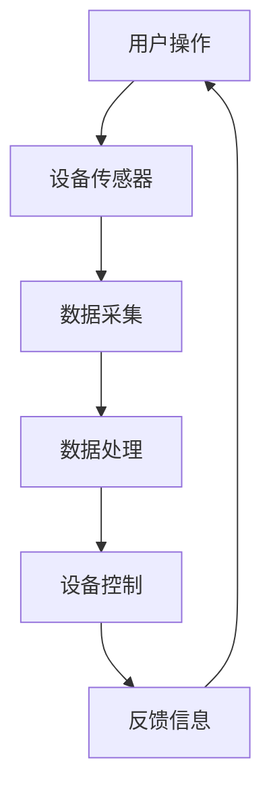
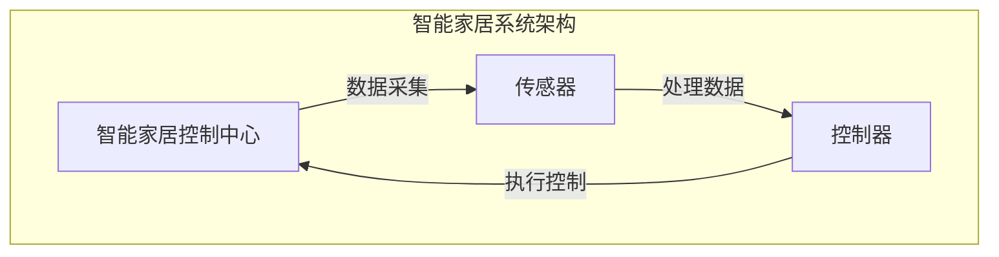
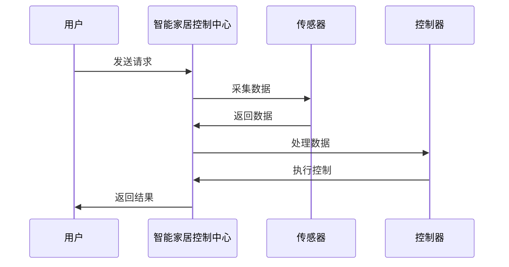

                 

# 现代简约主义智能家居设计服务：极简生活理念下的物联网应用

## 关键词
智能家居、简约主义、物联网应用、设计服务、极简生活

## 摘要
本文旨在探讨现代简约主义在智能家居设计服务中的应用，通过物联网技术的集成，实现极简生活理念下的智能家居系统设计。文章将详细分析简约主义的历史与发展、物联网技术基础、智能家居系统设计，以及实际案例解析，最后展望智能家居的未来趋势。

### 背景介绍

#### 简约主义家居设计理念
简约主义起源于20世纪50年代的欧美，强调“少即是多”的设计哲学。在家居设计中，简约主义主张以简单的线条、极简的色彩和实用的功能为核心，去除多余的设计元素，追求空间的最大化利用和视觉的纯净感。

#### 物联网技术基础
物联网（Internet of Things，IoT）是指将各种设备通过网络连接起来，实现数据的采集、传输和处理。物联网技术的发展为智能家居系统提供了强大的技术支持，使得智能家居设备可以实现远程控制、智能互动和自动化管理。

#### 极简生活与智能家居
极简生活是一种以减少物质消费和简化生活为目的的生活方式。智能家居系统与极简生活理念的融合，可以大大提升生活品质，减少家务负担，实现真正的智能、便捷和舒适。

### 核心概念与联系

#### 简约主义的核心原则
- **功能至上**：以实用性为核心，追求设计功能的最大化和美学价值的平衡。
- **空间优化**：通过合理的空间布局和家具设计，实现空间的扩展和利用。
- **纯净外观**：以简约的线条和色彩，追求视觉上的纯净感和舒适度。
- **材料与色彩**：使用自然、环保和耐用的材料，搭配柔和的色彩，营造温馨、舒适的家居氛围。

#### 物联网的关键技术
- **传感器技术**：用于数据采集，如温度传感器、光线传感器、运动传感器等。
- **网络通信技术**：用于设备之间的数据传输，如Wi-Fi、Zigbee、Z-Wave等。
- **数据处理与分析技术**：用于数据存储、分析和决策，如云计算、大数据分析等。

### 算法原理讲解

#### 智能家居系统设计
智能家居系统设计需要综合考虑硬件设备、软件平台和用户交互三个层面。以下是一个基本的智能家居系统设计算法原理：

1. **硬件设备设计**：
   - **传感器**：选择合适的传感器，如温度传感器、湿度传感器等，用于环境数据的采集。
   - **控制器**：选择合适的控制器，如智能插座、智能灯等，用于设备的控制。

2. **软件平台设计**：
   - **数据采集**：通过传感器采集的数据，传输到中央处理单元。
   - **数据处理**：对采集到的数据进行分析和处理，实现设备的自动化控制。

3. **用户交互**：
   - **远程控制**：通过智能手机、平板电脑等设备，实现对家居设备的远程控制。
   - **语音交互**：通过智能音箱、智能助手等设备，实现语音控制。

以下是一个智能家居系统设计的mermaid流程图：



### 数学模型和数学公式

在智能家居系统中，数据分析和决策依赖于数学模型。以下是一个简单的线性回归模型，用于预测房间的温度：

$$
y = bx + a
$$

其中，$y$ 是温度值，$x$ 是时间，$b$ 是斜率，$a$ 是截距。

### 系统分析与架构设计方案

#### 问题场景介绍
设想一个智能家居系统，用于监测和控制家庭的温度、照明和安防。

#### 项目介绍
项目名为“智能家居控制中心”，主要功能包括：
- 温度监测与调节
- 照明控制
- 安防监控

#### 系统功能设计
- **领域模型**：使用mermaid类图表示领域模型。

```mermaid
classDiagram
Class::House
    <<interface>>
    +temperatureSensor: Sensor
    +lightSensor: Sensor
    +securitySensor: Sensor
    +temperatureControl: Controller
    +lightControl: Controller
    +securityControl: Controller

Class::Sensor
    <<interface>>
    +measure(): float

Class::Controller
    <<interface>>
    +control(): void

Class::TemperatureSensor <<extend>> Sensor
    +measureTemperature(): float

Class::LightSensor <<extend>> Sensor
    +measureLight(): float

Class::SecuritySensor <<extend>> Sensor

Class::TemperatureController <<extend>> Controller
    +controlTemperature(): void

Class::LightController <<extend>> Controller
    +controlLight(): void

Class::SecurityController <<extend>> Controller
```

- **系统架构设计**：使用mermaid架构图表示系统架构。



- **系统接口设计**：使用mermaid序列图表示系统接口。



### 项目实战

#### 环境安装
1. 安装Python环境。
2. 安装物联网开发板（例如Arduino）。
3. 安装相关的传感器和控制器。

#### 系统核心实现源代码
以下是一个简单的Python代码示例，用于控制温度。

```python
import time
import serial

# 初始化串口
ser = serial.Serial('COM3', 9600)

# 循环读取温度数据
while True:
    # 读取串口数据
    data = ser.readline()
    # 解析温度数据
    temperature = float(data.decode('utf-8'))
    # 控制加热器
    if temperature < 25:
        ser.write(b'HEATER_ON')
    else:
        ser.write(b'HEATER_OFF')
    # 等待1秒
    time.sleep(1)
```

#### 代码应用解读与分析
1. 导入必要的库。
2. 初始化串口。
3. 循环读取温度数据。
4. 解析温度数据。
5. 根据温度数据控制加热器。

#### 实际案例分析和详细讲解剖析
以一个实际案例，描述如何设计一个智能家居系统来控制家庭温度。

1. **需求分析**：用户希望在家中的每个房间都能实时监测温度，并根据温度自动调节加热器。
2. **系统设计**：选择合适的传感器（温度传感器）和控制设备（加热器控制器）。
3. **系统实现**：通过串口通信，将传感器数据传输到控制器，根据温度数据控制加热器。
4. **系统测试**：测试系统的稳定性和可靠性。

#### 项目小结
本案例展示了如何设计一个简单的智能家居系统来控制家庭温度。在实际应用中，还需要考虑更多的因素，如网络通信、数据存储和安全等。

### 最佳实践 tips
1. **选择合适的传感器和控制设备**：根据实际需求，选择最适合的传感器和控制设备。
2. **优化系统性能**：通过优化算法和硬件配置，提高系统的响应速度和稳定性。
3. **注重安全性**：确保系统数据的安全传输和存储。

### 小结
本文从简约主义家居设计理念、物联网技术基础、智能家居系统设计等方面，详细探讨了现代简约主义在智能家居设计服务中的应用。通过实际案例解析，展示了智能家居系统设计的方法和实现过程。未来，随着物联网技术的不断发展，智能家居系统将会更加智能化、便捷化，为我们的生活带来更多便利。

### 注意事项
1. 在设计智能家居系统时，应充分考虑用户需求和场景。
2. 确保系统的稳定性和安全性。
3. 注重用户体验，提供简洁、直观的用户界面。

### 拓展阅读
1. 《智能家居系统设计与应用》
2. 《物联网技术与应用》
3. 《现代家居设计理念与实践》

### 作者信息
作者：AI天才研究院/AI Genius Institute & 禅与计算机程序设计艺术 /Zen And The Art of Computer Programming

### 附录
（此处可添加参考文献、图表等附加信息）

