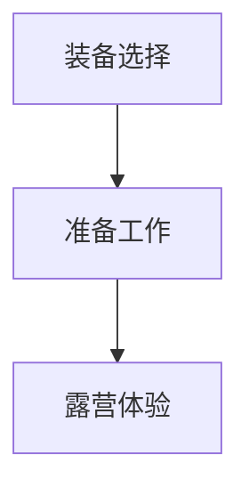

                 


## 第1章 引言

### 1.1 问题的背景

在现代社会中，人们越来越渴望逃离城市的喧嚣，寻找一片宁静的天地。露营作为一种回归自然的方式，逐渐受到大众的喜爱。然而，传统的露营方式往往伴随着复杂的装备、繁琐的准备工作以及高昂的费用，使得许多人望而却步。

随着环保意识的提高，人们开始思考如何以一种更加环保、经济且舒适的方式去享受露营的乐趣。现代简约主义露营应运而生，它主张以最少的物质投入，获取最大的露营体验。这种方式不仅符合环保理念，减少了对自然环境的破坏，同时也简化了生活，让参与者能够更加专注地享受与自然的互动。

### 1.2 问题描述

现代简约主义露营的核心问题是如何在保证舒适度的同时，最大限度地减少露营装备和准备工作的复杂性。这涉及到以下几个方面：

- **装备选择：** 如何在有限的预算内，选择最合适的露营装备，既保证舒适度，又避免装备过于复杂和繁多。
- **露营技巧：** 如何通过科学的露营技巧，提高露营的舒适度和安全性，同时减少对环境的负面影响。
- **资源管理：** 如何在露营过程中，合理管理水资源、能源和其他物资，确保露营的可持续性。

### 1.3 问题解决

本书旨在提供一套系统的、易于实践的现代简约主义露营方案。通过深入探讨露营的核心概念、装备选择、露营技巧、资源管理等内容，帮助读者理解并掌握现代简约主义露营的理念和技巧。

#### 1.4 边界与外延

本书主要关注户外露营活动，但简约主义露营的理念也可以应用于其他户外活动，如徒步、骑行等。同时，现代简约主义露营不仅限于装备的选择，还包括露营过程中的生活方式和态度。

#### 1.5 概念结构与核心要素组成

- **核心概念：** 现代简约主义露营、露营装备、露营技巧、资源管理。
- **要素组成：** 舒适度、成本、环保、互动性。

#### 1.6 本章小结

本章介绍了现代简约主义露营的背景、问题、解决方案以及相关概念。下一章将深入探讨现代简约主义露营的核心概念，帮助读者更好地理解这一露营方式。

## 第2章 现代简约主义露营的核心概念

### 2.1 核心概念原理

现代简约主义露营的核心在于以简驭繁，通过减少物质装备和简化准备工作，实现更加自然的露营体验。这一理念强调舒适度、成本效益和环保，与传统的露营方式形成鲜明对比。

#### 2.1.1 舒适度

虽然减少了装备，但现代简约主义露营依然注重露营者的舒适度。通过科学选择装备和合理规划，确保露营者在享受自然的同时，也能够获得良好的休息和体验。

**舒适度的重要性：** 舒适度是露营体验的核心。一个舒适的露营环境可以大大提升露营者的幸福感和满意度。通过合理选择装备，如舒适的睡袋、轻便的帐篷和舒适的睡垫，露营者可以在户外获得与家中相似的舒适体验。

**实现方式：** 
- 选择适合自己需求的露营装备。
- 在露营地点进行充分的环境调研，选择适合露营的区域。
- 在露营过程中，注重身体和心理的放松，享受与自然的亲密接触。

#### 2.1.2 成本效益

现代简约主义露营通过减少昂贵装备和简化准备工作，降低了露营成本。这种方式不仅让更多人群能够参与到露营活动中，也为环保贡献了一份力量。

**成本效益的重要性：** 成本效益是现代简约主义露营的一个重要特征。传统露营方式往往需要大量的资金投入，而现代简约主义露营通过减少装备数量和种类，降低了成本。这不仅让更多的人能够享受到露营的乐趣，也减少了对自然资源的浪费。

**实现方式：**
- 选择多功能、性价比高的露营装备。
- 通过租赁和二手市场获取所需装备。
- 减少露营期间的浪费，充分利用现有资源。

#### 2.1.3 环保

现代简约主义露营强调减少对自然环境的破坏，通过使用环保材料、减少废弃物等方式，实现可持续发展。

**环保的重要性：** 环保是现代简约主义露营的核心理念之一。传统露营方式往往伴随着大量废弃物的产生，对自然环境造成了一定的破坏。而现代简约主义露营通过减少浪费、使用环保材料等方式，最大限度地减少了对自然环境的负面影响。

**实现方式：**
- 使用环保材料制作露营装备。
- 减少露营期间的废弃物产生，如垃圾分类、废物回收等。
- 在露营过程中，尽量减少对自然环境的干扰。

#### 2.1.4 互动性

现代简约主义露营鼓励露营者与自然进行互动，通过亲身体验自然，增强对自然环境的认知和保护意识。

**互动性的重要性：** 互动性是现代简约主义露营的一大特色。通过亲身体验自然，露营者可以更好地理解自然、尊重自然，从而增强对自然环境的保护意识。

**实现方式：**
- 参与自然活动，如徒步、观鸟、野营等。
- 学习自然知识，如植物、动物、地理等。
- 尊重自然环境，遵守露营规范。

### 2.2 概念属性特征对比表格

| 特征               | 传统露营           | 现代简约主义露营         |
|--------------------|--------------------|-------------------------|
| 装备复杂度         | 高度复杂           | 简单高效                 |
| 准备工作           | 繁琐               | 简单                   |
| 舒适度             | 较高               | 良好                   |
| 成本               | 高                 | 低                     |
| 环境影响           | 大                 | 小                     |

### 2.3 ER实体关系图架构

```mermaid
erDiagram
   露营者 ||--|{ 装备 }|--|| 露营目的地
   露营者 ||--|{ 技能 }|--|| 露营方式
   装备 ||--|{ 品牌 }|--|| 装备种类
   技能 ||--|{ 水平 }|--|| 技能类别
```

### 2.4 算法原理讲解

现代简约主义露营的算法原理可以概括为三步：

1. **装备选择：** 根据露营目的地的特点和露营者的需求，选择合适的装备。这个过程需要考虑装备的轻便性、多功能性和耐用性。

2. **准备工作：** 通过简化准备工作，减少露营前的繁琐步骤。这包括提前规划行程、准备必要物品和熟悉露营技巧。

3. **露营体验：** 在露营过程中，注重与自然的互动，享受简约生活带来的乐趣。同时，通过合理管理资源，确保露营的可持续性。

下面是一个简单的算法流程图：



### 2.5 算法原理讲解（续）

#### 2.5.1 装备选择

**数学模型和公式：**

在装备选择阶段，我们需要考虑以下几个因素：

- **需求评估：** 对露营者需求进行评估，确定所需的装备类型和数量。
- **成本计算：** 计算每种装备的购买成本，并选择性价比最高的装备。

**具体步骤：**

1. **需求评估：** 根据露营目的地的气候条件、地形特征和露营时间，评估所需的装备类型。例如，在寒冷地区，可能需要保暖帐篷、睡袋和防风衣物。

2. **成本计算：** 对每种装备的市场价格进行调研，并计算总成本。选择性价比最高的装备，以达到成本效益最大化。

3. **装备选择：** 根据需求评估和成本计算，选择合适的装备。尽量选择多功能、轻便且耐用的装备，以减少行李负担。

**Python代码示例：**

```python
def assess_needs(temperature, terrain, duration):
    # 根据温度、地形和持续时间评估所需装备
    if temperature < 10:
        equipment_needed = ["warm tent", "warm sleeping bag", "windproof clothing"]
    elif terrain == "mountain":
        equipment_needed = ["mountain tent", "warm sleeping bag", "snow shoes"]
    else:
        equipment_needed = ["standard tent", "sleeping bag", "sandals"]
    return equipment_needed

def calculate_costs(equipment_list, prices):
    # 计算装备总成本
    total_cost = 0
    for equipment in equipment_list:
        total_cost += prices[equipment]
    return total_cost

def select_equipment(temperature, terrain, duration, prices):
    # 选择合适装备
    equipment_needed = assess_needs(temperature, terrain, duration)
    total_cost = calculate_costs(equipment_needed, prices)
    return equipment_needed, total_cost

# 测试代码
prices = {"warm tent": 1500, "warm sleeping bag": 800, "windproof clothing": 300,
          "standard tent": 1000, "sleeping bag": 500, "sandals": 200,
          "mountain tent": 2000, "snow shoes": 600}

equipment_needed, total_cost = select_equipment(5, "mountain", 7, prices)
print("Equipment needed:", equipment_needed)
print("Total cost:", total_cost)
```

#### 2.5.2 准备工作

**数学模型和公式：**

在准备工作阶段，我们需要考虑以下几个因素：

- **物资准备：** 根据露营时间、人数和活动类型，准备足够的食物、水和燃料等物资。
- **风险评估：** 对可能遇到的风险进行评估，并准备相应的应急物资。

**具体步骤：**

1. **物资准备：** 根据露营时间和人数，列出所需的物资清单，包括食物、水、燃料、应急物资等。尽量选择便携、耐储存的物资，以减少行李负担。

2. **风险评估：** 根据露营目的地的自然环境、气候条件和活动类型，评估可能遇到的风险。准备相应的应急物资，如急救包、帐篷修复工具、手电筒等。

3. **物资整理：** 将所有物资整理成清单，确保在出发前已经准备充分。

**Python代码示例：**

```python
def prepare_supplies(duration, people, activities):
    # 根据露营时间、人数和活动类型准备物资
    food = 2  # 人均食物重量（公斤）
    water = 2  # 人均水重量（升）
    fuel = 1  # 人均燃料重量（公斤）
    
    total_food = food * people
    total_water = water * people
    total_fuel = fuel * people
    
    emergency_supplies = ["first aid kit", "tent repair tools", "flashlight"]
    
    return total_food, total_water, total_fuel, emergency_supplies

# 测试代码
duration = 5
people = 4
activities = ["hiking", "camping"]

total_food, total_water, total_fuel, emergency_supplies = prepare_supplies(duration, people, activities)
print("Total food needed:", total_food)
print("Total water needed:", total_water)
print("Total fuel needed:", total_fuel)
print("Emergency supplies:", emergency_supplies)
```

#### 2.5.3 露营体验

**数学模型和公式：**

在露营体验阶段，我们需要考虑以下几个因素：

- **舒适度评估：** 对露营地的舒适度进行评估，包括帐篷的稳定性、水源的清洁程度、食物的口感等。
- **资源管理：** 对露营过程中所需的资源进行合理管理，确保资源的可持续使用。

**具体步骤：**

1. **舒适度评估：** 在到达露营地点后，对帐篷的稳定性、水源的清洁程度、食物的口感等进行评估。根据评估结果，调整露营地的选择和装备的使用。

2. **资源管理：** 在露营过程中，合理管理食物、水和其他资源。尽量避免浪费，确保资源的可持续使用。

3. **体验分享：** 在露营结束后，与家人或朋友分享露营的经历和感受，增强互动和体验的乐趣。

**Python代码示例：**

```python
def assess_comfort(tent_stability, water_quality, food_taste):
    # 对舒适度进行评估
    comfort_score = 0
    if tent_stability:
        comfort_score += 1
    if water_quality:
        comfort_score += 1
    if food_taste:
        comfort_score += 1
    return comfort_score

def manage_resources(food, water, fuel, duration):
    # 对资源进行管理
    remaining_food = food - (duration * 0.5)  # 假设每人每天消耗0.5公斤食物
    remaining_water = water - (duration * 1)  # 假设每人每天消耗1升水
    remaining_fuel = fuel - (duration * 0.2)  # 假设每人每天消耗0.2公斤燃料
    
    return remaining_food, remaining_water, remaining_fuel

# 测试代码
tent_stability = True
water_quality = True
food_taste = True
duration = 3

comfort_score = assess_comfort(tent_stability, water_quality, food_taste)
print("Comfort score:", comfort_score)

food, water, fuel = 10, 20, 5
remaining_food, remaining_water, remaining_fuel = manage_resources(food, water, fuel, duration)
print("Remaining resources:", remaining_food, remaining_water, remaining_fuel)
```

### 2.6 最佳实践 Tips

1. **提前规划：** 在出发前，提前规划行程和物资，确保露营过程顺利进行。
2. **环保意识：** 在露营过程中，注重环保，尽量减少对自然环境的破坏。
3. **学习技巧：** 学习基本的露营技巧，提高露营的安全性和舒适度。
4. **团队协作：** 与家人或朋友一起露营，增强互动和体验的乐趣。

### 2.7 本章小结

本章详细介绍了现代简约主义露营的核心概念，包括舒适度、成本效益、环保和互动性。通过对比表格、ER实体关系图和算法原理讲解，帮助读者深入理解现代简约主义露营的理念和实现方式。在下一章中，我们将进一步探讨露营装备的选择和准备工作的细节。

## 第3章 露营装备的选择

### 3.1 装备选择的重要性

露营装备的选择直接影响到露营的舒适度、安全性和可持续性。在选择装备时，需要考虑以下几个关键因素：

- **功能性：** 装备必须满足露营的基本需求，如提供庇护、保暖、照明等。
- **轻便性：** 考虑到长途跋涉和露营地的限制，轻便性是选择装备的重要标准。
- **耐用性：** 装备需要经受住各种恶劣环境的考验，保持其功能性和使用寿命。
- **成本效益：** 选择性价比高的装备，确保在预算范围内获得最佳体验。

### 3.2 装备种类介绍

#### 3.2.1 帐篷

帐篷是露营中最基本的装备之一，主要功能是提供庇护和保暖。根据露营地的气候条件、地形特征和预算，可以选择不同类型的帐篷。

- **单层帐篷：** 结构简单，适合温暖干燥的气候。
- **双层帐篷：** 内外两层，具有更好的保暖和防风性能。
- **山地帐篷：** 结构坚固，适合恶劣天气和复杂地形。

#### 3.2.2 睡袋

睡袋是露营者夜间休息的重要装备，根据气温和露营地的气候条件，选择合适的睡袋温度等级。

- **温控睡袋：** 根据不同温度范围，分为冬季睡袋、春季睡袋和夏季睡袋。
- **极端温度睡袋：** 适用于极寒或极热的气候条件。

#### 3.2.3 睡垫

睡垫主要用于提高露营者的舒适度，减少地面传导的寒冷。

- **空气睡垫：** 轻便，易于充放，但可能不够保暖。
- **充气睡垫：** 提供更好的保暖性能，但相对较重。
- **泡沫睡垫：** 轻便，耐用，但保暖性能较差。

#### 3.2.4 照明设备

在户外露营中，照明设备至关重要，尤其在夜间和低光环境下。

- **手电筒：** 便携，易于操作，适用于短时间照明。
- **头灯：** 方便双手操作，适合长时间活动。
- **太阳能灯：** 环保，可持续，适用于无电源区域。

#### 3.2.5 炊具

炊具用于烹饪食物，根据露营地的条件和需求，可以选择不同的炊具。

- **便携炉具：** 如汽油炉、酒精炉等，适用于各种露营场景。
- **便携锅具：** 轻便，易于携带，满足基本的烹饪需求。
- **野餐垫：** 提供清洁、防滑的烹饪环境。

### 3.3 装备选择的算法原理

在现代简约主义露营中，装备选择是一个复杂的过程，需要考虑多种因素。以下是一种基于优先级和成本效益的算法原理：

#### 3.3.1 算法步骤

1. **需求分析：** 根据露营目的地的气候条件、地形特征和露营时间，分析露营者所需的基本装备。
2. **成本评估：** 调研各种装备的市场价格，计算总成本。
3. **优先级排序：** 根据需求的重要性和成本，对装备进行优先级排序。
4. **装备选择：** 选择优先级最高的装备，确保满足基本需求。
5. **成本控制：** 在满足基本需求的前提下，尽量控制总成本，避免不必要的开支。

#### 3.3.2 Python代码示例

```python
def analyze_needs(climate, terrain, duration):
    # 分析露营需求
    if climate == "cold":
        equipment = ["double-layer tent", "warm sleeping bag", "portable stove"]
    elif terrain == "mountain":
        equipment = ["mountain tent", "extreme-temperature sleeping bag", "portable stove"]
    else:
        equipment = ["single-layer tent", "spring sleeping bag", "portable stove"]
    return equipment

def assess_costs(equipment_list, prices):
    # 评估装备成本
    total_cost = 0
    for equipment in equipment_list:
        total_cost += prices[equipment]
    return total_cost

def select_equipment(climate, terrain, duration, prices):
    # 选择装备
    equipment_list = analyze_needs(climate, terrain, duration)
    total_cost = assess_costs(equipment_list, prices)
    return equipment_list, total_cost

# 测试代码
prices = {"double-layer tent": 2000, "warm sleeping bag": 1000, "portable stove": 300,
          "single-layer tent": 1500, "spring sleeping bag": 800, "mountain tent": 2500,
          "extreme-temperature sleeping bag": 1500}

climate = "cold"
terrain = "mountain"
duration = 7

equipment_list, total_cost = select_equipment(climate, terrain, duration, prices)
print("Selected equipment:", equipment_list)
print("Total cost:", total_cost)
```

### 3.4 装备选择的具体案例

**案例1：城市周边短途露营**

- **气候条件：** 温暖干燥
- **地形特征：** 平坦
- **露营时间：** 2天

**装备选择：**

- **帐篷：** 单层帐篷
- **睡袋：** 春季睡袋
- **睡垫：** 空气睡垫
- **照明设备：** 头灯
- **炊具：** 便携炉具和便携锅具

**成本评估：**

- **总成本：** 约1000美元

**优势：**

- 轻便，易于携带
- 满足基本需求，性价比高

**劣势：**

- 在寒冷或恶劣天气下可能不够保暖
- 空气睡垫可能不够舒适

**案例2：山地长途露营**

- **气候条件：** 极端寒冷
- **地形特征：** 崎岖
- **露营时间：** 5天

**装备选择：**

- **帐篷：** 山地帐篷
- **睡袋：** 极端温度睡袋
- **睡垫：** 充气睡垫
- **照明设备：** 太阳能灯和头灯
- **炊具：** 便携炉具和便携锅具

**成本评估：**

- **总成本：** 约3000美元

**优势：**

- 具有良好的保暖和耐用性
- 适用于极端气候和复杂地形

**劣势：**

- 较为沉重，不适合长途徒步
- 成本较高

### 3.5 最佳实践 Tips

1. **提前规划：** 在出发前，根据露营目的地的气候条件、地形特征和时间，提前规划所需的装备。
2. **多功能装备：** 尽量选择多功能、轻便的装备，减少行李负担。
3. **二手市场：** 可以在二手市场或租赁服务中寻找合适的装备，降低成本。
4. **适应环境：** 根据实际环境条件，灵活调整装备的选择。

### 3.6 本章小结

本章详细介绍了露营装备的选择，包括帐篷、睡袋、睡垫、照明设备和炊具等。通过算法原理讲解和具体案例，帮助读者理解如何根据露营目的地的条件和需求，选择合适的装备。在下一章中，我们将进一步探讨露营技巧的掌握和准备工作的重要性。

## 第4章 露营技巧的掌握

### 4.1 露营技巧的重要性

露营技巧的掌握直接影响到露营的安全性和舒适度。无论是初次露营者还是有经验的露营者，都需要熟练掌握一系列基本技巧，以确保露营过程顺利进行。

#### 4.1.1 安全意识

在户外露营中，安全始终是首要考虑的因素。以下是一些基本的安全意识：

- **天气预报：** 出发前，关注目的地的天气预报，避免在恶劣天气中进行露营。
- **风险评估：** 根据目的地的自然环境和活动类型，评估可能遇到的风险，并制定相应的应对措施。
- **紧急应对：** 学习基本的急救知识和技能，如心肺复苏、止血和骨折固定等。
- **团队协作：** 与队友保持沟通，确保在紧急情况下能够互相协助。

#### 4.1.2 搭建帐篷

帐篷是露营中的临时住所，其稳定性直接影响到露营者的安全。以下是一些搭建帐篷的基本技巧：

- **选择合适地点：** 根据地形特征，选择一个平坦、干燥、避风的位置。
- **地面处理：** 清除地上的石块、树枝等杂物，并用防水布或垫子铺设地面。
- **帐篷搭建：** 按照说明书或视频教程，正确搭建帐篷。确保帐篷的入口和通风口畅通。
- **加固设施：** 在帐篷周围堆放石块或木桩，以增加帐篷的稳定性。

#### 4.1.3 照明和火源管理

在户外露营中，照明和火源管理是保障安全的关键。以下是一些基本技巧：

- **使用手电筒和头灯：** 便于操作，减少手持物品的不便。
- **太阳能灯：** 环保、可持续，适用于长时间露营。
- **火源管理：** 在允许的情况下，使用便携炉具或篝火。确保火源远离帐篷和其他易燃物品，并在露营结束后彻底熄灭。

#### 4.1.4 水源和卫生

在户外露营中，水源和卫生是保障健康的重要因素。以下是一些基本技巧：

- **寻找清洁水源：** 根据水源的清澈度和味道，判断其是否适合饮用。在不确定的情况下，使用水净化工具。
- **储备饮用水：** 根据露营时间和需求，储备足够的饮用水。
- **个人卫生：** 使用便携式洗手盆或水壶，保持个人卫生。在露营区域附近设立厕所或使用便携式厕所。

### 4.2 露营技巧的算法原理

为了系统地掌握露营技巧，我们可以采用以下算法原理：

#### 4.2.1 算法步骤

1. **风险评估：** 根据露营目的地的自然环境和活动类型，评估可能遇到的风险，并制定相应的应对措施。
2. **技能培训：** 参加专业的露营培训课程，学习基本的露营技巧和安全知识。
3. **实地演练：** 在实际露营过程中，不断练习和改进技巧，确保在紧急情况下能够应对。
4. **持续学习：** 随着经验的积累，不断更新和提升露营技巧，适应不同的露营场景。

#### 4.2.2 Python代码示例

```python
def risk_evaluation(climate, terrain, activities):
    # 评估露营风险
    if climate == "cold":
        risks = ["hypothermia", " frostbite"]
    elif terrain == "mountain":
        risks = ["avalanches", "flooding"]
    else:
        risks = ["heatstroke", "snake bites"]
    if "hiking" in activities:
        risks.append("fall injuries")
    if "camping" in activities:
        risks.append("wildlife encounters")
    return risks

def skill_training(risks):
    # 培训所需技能
    training_program = []
    if "hypothermia" in risks:
        training_program.append("hypothermia prevention")
    if "avalanches" in risks:
        training_program.append("avalanche safety")
    if "heatstroke" in risks:
        training_program.append("heatstroke prevention")
    if "snake bites" in risks:
        training_program.append("first aid for snake bites")
    return training_program

# 测试代码
climate = "cold"
terrain = "mountain"
activities = ["hiking", "camping"]

risks = risk_evaluation(climate, terrain, activities)
training_program = skill_training(risks)
print("Risks:", risks)
print("Training program:", training_program)
```

### 4.3 露营技巧的具体案例

**案例1：城市周边短途露营**

- **露营地点：** 城市公园
- **气候条件：** 温暖干燥
- **活动类型：** 徒步和野餐

**技能需求：**

- **搭建帐篷：** 在平坦、避风的地点搭建帐篷。
- **照明设备：** 使用头灯和手电筒。
- **水源：** 在公园内寻找清洁水源。
- **卫生：** 使用便携式洗手盆。

**优势：**

- 地点熟悉，风险较低。
- 设施完善，方便露营。

**劣势：**

- 露营时间较短，体验受限。

**案例2：偏远山区露营**

- **露营地点：** 国家森林公园
- **气候条件：** 多变，可能遇到寒冷和暴雨
- **活动类型：** 徒步、露营和观星

**技能需求：**

- **风险评估：** 对山区环境进行评估，避免高风险区域。
- **搭建帐篷：** 在坚固的地面上搭建帐篷，确保稳定。
- **照明设备：** 使用头灯、手电筒和太阳能灯。
- **水源：** 使用便携式水壶和净水工具。
- **卫生：** 使用便携式厕所。

**优势：**

- 自然环境优美，露营体验丰富。
- 能体验不同的气候条件。

**劣势：**

- 地点偏远，救援不便。
- 设施不完善，需要更多的准备和技能。

### 4.4 最佳实践 Tips

1. **提前准备：** 出发前，充分准备所需的装备和技能。
2. **团队协作：** 与队友保持沟通，确保在紧急情况下能够互相协助。
3. **持续学习：** 随着经验的积累，不断更新和提升露营技巧。
4. **尊重自然：** 在露营过程中，尽量减少对自然环境的破坏。

### 4.5 本章小结

本章详细介绍了露营技巧的掌握，包括安全意识、搭建帐篷、照明和火源管理、水源和卫生等方面。通过算法原理讲解和具体案例，帮助读者理解如何根据不同的露营环境和需求，掌握基本的露营技巧。在下一章中，我们将进一步探讨资源管理的重要性和具体方法。

## 第5章 资源管理的重要性

### 5.1 资源管理的重要性

资源管理在露营过程中扮演着至关重要的角色。合理的资源管理不仅能够提高露营的舒适度和可持续性，还能减少对自然环境的负面影响。以下是资源管理的重要性概述：

- **提高露营体验：** 通过有效管理食物、水、燃料等资源，确保露营者在整个露营期间都能享受到舒适和便利。
- **降低成本：** 合理使用和分配资源，减少浪费，降低露营成本。
- **保护自然环境：** 通过减少废弃物的产生和资源的合理利用，减少对自然环境的破坏，实现可持续发展。

### 5.2 食物管理

食物管理是资源管理的一个重要方面。合理的食物管理能够确保露营者在整个露营期间都有充足的营养，同时减少浪费。

#### 5.2.1 食物准备

在准备食物时，应考虑以下几点：

- **便携性：** 选择易于携带和储存的食物，如罐头、干粮、能量棒等。
- **多样性：** 根据露营时间和活动强度，准备多样化的食物，满足不同口味和营养需求。
- **轻便性：** 尽量选择轻便、易处理的食材，减少行李负担。

#### 5.2.2 食物储存

食物储存需要注意以下几点：

- **防潮：** 将食物保存在防潮袋或密封容器中，防止食物受潮变质。
- **冷藏：** 如果条件允许，使用便携式冷藏设备，保持食物的新鲜度。
- **储存位置：** 将食物储存在干燥、阴凉的地方，避免阳光直射。

#### 5.2.3 食物烹饪

在烹饪食物时，应遵循以下原则：

- **环保：** 尽量使用无污染的燃料和炊具，避免产生过多废弃物。
- **高效：** 选择易于烹饪的食物，减少烹饪时间，节省燃料。
- **营养：** 烹饪过程中注意营养搭配，确保露营者获得充足的能量。

### 5.3 水资源管理

水资源管理是露营过程中另一个关键方面。在自然环境中，水资源可能受到污染，因此合理的水资源管理至关重要。

#### 5.3.1 水源寻找

寻找清洁水源时，应遵循以下原则：

- **观察：** 观察水源附近的环境，判断水质是否清澈。
- **探测：** 使用工具或试剂检测水质，确保水源安全。
- **筛选：** 对获取的水进行过滤或煮沸，去除杂质和细菌。

#### 5.3.2 水资源分配

在分配水资源时，应考虑以下几点：

- **合理规划：** 根据露营时间、人数和活动强度，合理规划水资源的分配。
- **优先保障：** 确保每个人都能获得足够的饮用水，特别是在炎热或高强度的活动后。
- **节约使用：** 尽量减少水资源的浪费，避免不必要的用水。

#### 5.3.3 水资源回收

水资源的回收利用能够减少对自然水源的依赖，提高露营的可持续性。以下是一些回收方法：

- **雨水收集：** 在露营地点搭建雨水收集系统，收集雨水用于洗涤和其他用途。
- **废水处理：** 对露营过程中的废水进行处理，使其达到再利用标准。
- **资源循环：** 将处理后的废水用于浇灌植物、冲洗厕所等，实现资源的循环利用。

### 5.4 燃料管理

燃料管理是露营过程中另一个重要方面，特别是在偏远地区。合理的燃料管理能够确保露营者在整个露营期间都有足够的燃料。

#### 5.4.1 燃料类型选择

在选择燃料时，应考虑以下几点：

- **环保性：** 选择环保燃料，减少对环境的污染。
- **实用性：** 根据露营地的条件和活动类型，选择合适的燃料类型。
- **可持续性：** 选择可再生燃料，提高露营的可持续性。

#### 5.4.2 燃料储存

燃料储存需要注意以下几点：

- **防潮：** 将燃料保存在防潮袋或密封容器中，防止燃料受潮变质。
- **安全：** 将燃料放置在安全的地方，避免阳光直射和高温环境。
- **防火：** 在使用燃料时，确保周围没有火源，避免发生火灾。

#### 5.4.3 燃料使用

在使用燃料时，应遵循以下原则：

- **节约：** 合理使用燃料，避免不必要的浪费。
- **高效：** 选择高效的燃料使用方式，提高燃料的利用率。
- **安全：** 确保燃料使用过程中的安全，避免发生意外。

### 5.5 废弃物管理

废弃物的管理是露营过程中不可忽视的一环。合理的废弃物管理能够减少对自然环境的污染。

#### 5.5.1 废弃物分类

对废弃物进行分类，有助于提高废弃物处理的效率。以下是一些常见的废弃物分类：

- **可回收物：** 玻璃、金属、塑料等可回收物品。
- **有害垃圾：** 废电池、废药品等有害物品。
- **厨余垃圾：** 食物残渣、厨余垃圾等。
- **其他垃圾：** 不可回收、有害的废弃物。

#### 5.5.2 废弃物处理

废弃物的处理应遵循以下原则：

- **分类存放：** 根据废弃物的类型，进行分类存放，确保处理过程的效率。
- **无害化处理：** 选择无害化的处理方式，减少对环境的污染。
- **回收利用：** 将可回收的废弃物进行回收利用，减少资源的浪费。

### 5.6 最佳实践 Tips

1. **提前规划：** 在出发前，合理规划食物、水和燃料的消耗量，确保资源的充足。
2. **节约使用：** 在露营过程中，尽量减少资源的浪费，提高资源的利用率。
3. **环保意识：** 提高环保意识，减少废弃物的产生，尽量使用环保材料。
4. **团队协作：** 与团队成员保持良好的沟通，共同承担资源管理的责任。

### 5.7 本章小结

本章详细介绍了资源管理的重要性，包括食物管理、水资源管理、燃料管理和废弃物管理等方面。通过具体方法和最佳实践，帮助读者理解如何合理利用资源，提高露营的舒适度和可持续性。在下一章中，我们将进一步探讨露营过程中的互动性和社交体验。

## 第6章 露营过程中的互动性和社交体验

### 6.1 互动性的重要性

露营作为一种社交活动，不仅是一种亲近自然的方式，更是增强人际关系和社交互动的良好机会。在露营过程中，互动性对于提升露营体验和情感联系至关重要。以下是一些关键点：

- **增进友谊：** 与家人、朋友或同事一起露营，能够加深彼此之间的了解和情感联系。
- **培养团队精神：** 通过共同面对挑战和解决问题，露营者可以培养团队协作和团队精神。
- **放松身心：** 互动性的露营活动有助于缓解压力，提升心理健康。
- **提升技能：** 互动性的学习过程，如教授和分享露营技巧，能够提高露营者的技能水平。

### 6.2 社交体验的设计

为了提升露营过程中的互动性和社交体验，以下是一些建议：

#### 6.2.1 活动策划

- **团队游戏：** 设计一些适合团队参与的游戏，如户外拼图、拔河、接力赛等，增强团队合作精神。
- **知识分享：** 安排知识分享环节，让每个露营者分享自己的专业知识或兴趣，促进彼此之间的交流。
- **自然探索：** 组织自然探索活动，如观鸟、植物识别等，让露营者更好地了解自然，增强对自然的尊重和热爱。

#### 6.2.2 沟通交流

- **小组讨论：** 设置小组讨论环节，让露营者围绕特定话题进行交流，增进彼此的了解。
- **社交互动：** 鼓励露营者主动与其他人交流，打破隔阂，建立友谊。
- **互动工具：** 使用互动工具，如社交媒体、视频会议等，保持与外界沟通，避免孤立感。

#### 6.2.3 营地文化

- **营地传统：** 建立营地的传统活动，如营地篝火晚会、营地歌曲等，增强营地文化的凝聚力。
- **社区氛围：** 营造积极的社区氛围，鼓励互助和分享，让每个露营者都感受到归属感。

### 6.3 互动性的算法原理

为了系统化地提升露营过程中的互动性，我们可以采用以下算法原理：

#### 6.3.1 算法步骤

1. **需求分析：** 分析露营者的需求和期望，确定互动活动的主题和类型。
2. **活动策划：** 根据需求，设计适合的互动活动，确保活动能够满足不同人群的需求。
3. **资源分配：** 根据活动类型和规模，合理分配资源，确保活动的顺利进行。
4. **执行与评估：** 实施互动活动，并收集反馈，不断调整和优化活动方案。

#### 6.3.2 Python代码示例

```python
def analyze_needs(l营ers):
    # 分析露营者需求
    interests = []
    for l员 in l营ers:
        interests.append(l员["interests"])
    return interests

def plan_activities(interests):
    # 设计互动活动
    activities = []
    if "teamwork" in interests:
        activities.append("team building games")
    if "knowledge sharing" in interests:
        activities.append("knowledge sharing sessions")
    if "nature exploration" in interests:
        activities.append("nature exploration activities")
    return activities

def allocate_resources(activities):
    # 分配资源
    resources = {}
    for activity in activities:
        if activity == "team building games":
            resources[activity] = ["sport equipment", "game materials"]
        if activity == "knowledge sharing sessions":
            resources[activity] = ["presentation tools", "note-taking materials"]
        if activity == "nature exploration activities":
            resources[activity] = ["binoculars", "guidebooks"]
    return resources

# 测试代码
l营ers = [{"name": "Alice", "interests": ["teamwork", "knowledge sharing"]},
          {"name": "Bob", "interests": ["nature exploration", "knowledge sharing"]},
          {"name": "Charlie", "interests": ["teamwork", "nature exploration"]}]

interests = analyze_needs(l营ers)
activities = plan_activities(interests)
resources = allocate_resources(activities)

print("Interests:", interests)
print("Activities:", activities)
print("Resources:", resources)
```

### 6.4 社交互动的具体案例

**案例1：家庭露营活动**

- **露营地点：** 城市周边的公园
- **参与人员：** 家庭成员
- **活动内容：** 野餐、徒步、沙滩排球

**互动体验：**

- **野餐：** 家庭成员一起准备野餐食物，增强了家庭互动。
- **徒步：** 家庭成员共同探索公园，增进了彼此的了解。
- **沙滩排球：** 家庭成员一起进行沙滩排球比赛，增强了团队精神。

**优势：**

- 活动简单，适合家庭参与。
- 能够增进家庭成员之间的情感联系。

**劣势：**

- 露营体验较为简单，可能无法满足追求深度体验的露营者。

**案例2：团队露营活动**

- **露营地点：** 偏远山区的营地
- **参与人员：** 公司员工
- **活动内容：** 徒步、露营、篝火晚会

**互动体验：**

- **徒步：** 员工们共同面对徒步挑战，培养了团队协作精神。
- **露营：** 员工们一起搭建帐篷，增强了团队凝聚力。
- **篝火晚会：** 员工们围坐在篝火旁，分享了彼此的故事和经历，增强了情感联系。

**优势：**

- 活动丰富，适合团队建设。
- 能够提高员工的团队合作能力和沟通能力。

**劣势：**

- 露营条件较为艰苦，可能对一些员工造成不适。

### 6.5 最佳实践 Tips

1. **提前策划：** 在出发前，提前策划互动活动和社交体验，确保活动的顺利进行。
2. **尊重差异：** 尊重不同人的兴趣和需求，设计多样化的活动，满足不同人的需求。
3. **积极互动：** 鼓励露营者积极参与互动活动，分享自己的经历和感受。
4. **持续反馈：** 收集露营者的反馈，不断改进和优化活动方案，提升互动体验。

### 6.6 本章小结

本章详细介绍了露营过程中的互动性和社交体验，包括互动性的重要性、社交体验的设计、算法原理讲解和具体案例。通过这些内容，帮助读者理解如何提升露营过程中的互动性和社交体验，增强情感联系和团队合作能力。在下一章中，我们将探讨现代简约主义露营的可持续性和其对环境的影响。

## 第7章 现代简约主义露营的可持续性

### 7.1 可持续性的重要性

现代简约主义露营强调通过减少物质消耗和优化资源利用，实现对环境的可持续影响。可持续性是现代简约主义露营的核心价值观之一，它不仅关乎环境的健康，也涉及到社会和经济层面的长远利益。

#### 7.1.1 环境保护

露营活动对自然环境的影响主要体现在以下几个方面：

- **土地破坏：** 不当的露营地点选择可能导致土地的破坏，如植被的破坏和土壤的侵蚀。
- **水资源污染：** 废弃物和污水的不当处理可能导致水源的污染。
- **空气污染：** 燃料的燃烧可能产生大量的烟雾和有害气体，影响空气质量。

现代简约主义露营通过减少废弃物的产生、合理利用资源、使用环保材料等措施，最大限度地减少对自然环境的影响。

#### 7.1.2 社会责任

露营活动也对社会产生一定的影响。可持续的露营活动不仅注重环境，还关注社会公平和经济发展。以下是一些具体的社会责任：

- **就业机会：** 露营产业的发展可以为当地居民创造就业机会。
- **文化交流：** 露营活动为不同文化背景的人提供了交流和了解的机会。
- **社区发展：** 可持续的露营活动可以促进当地社区的发展，提升居民的生活质量。

### 7.2 实现可持续性的方法

为了实现现代简约主义露营的可持续性，需要采取一系列的措施和方法。以下是一些具体的方法：

#### 7.2.1 环保材料的使用

使用环保材料是现代简约主义露营实现可持续性的关键措施之一。以下是一些环保材料的例子：

- **生物降解材料：** 如玉米淀粉制成的塑料袋和餐具，能够在自然环境中降解。
- **可再生材料：** 如竹子、亚麻和有机棉等，这些材料不仅可再生，而且对环境的影响较小。
- **回收材料：** 使用回收材料制作的露营装备，如帐篷和睡袋，可以减少废弃物的产生。

#### 7.2.2 资源的有效利用

在露营过程中，合理利用资源能够减少浪费，提高资源的可持续性。以下是一些资源利用的方法：

- **水的循环利用：** 在营地设置污水处理系统，将生活用水处理后循环使用，减少对自然水源的依赖。
- **食物的合理储存和烹饪：** 选择易于储存和烹饪的食物，减少食物浪费。
- **燃料的高效利用：** 选择高效的燃料使用方式，如便携式炉具和太阳能灯，减少燃料的消耗。

#### 7.2.3 废弃物的分类处理

废弃物的分类处理是确保资源循环利用的重要环节。以下是一些废弃物处理的方法：

- **分类存放：** 将废弃物按照可回收物、有害垃圾、厨余垃圾和其他垃圾进行分类存放。
- **无害化处理：** 对有害垃圾进行无害化处理，如废电池的回收和处理。
- **资源回收：** 对可回收物进行回收，如塑料、金属和纸张的回收。

### 7.3 案例分析

以下是一个关于现代简约主义露营实现可持续性的案例分析：

#### 案例背景

一个露营团队计划在偏远山区进行为期三天的露营活动。该团队注重环保和可持续发展，希望通过这次露营活动实践现代简约主义露营的理念。

#### 可行性分析

- **环保材料：** 团队选择使用竹制餐具和可降解的塑料袋，减少对环境的污染。
- **资源利用：** 团队在营地设置了一个污水处理系统，将生活用水处理后用于植物浇灌和营地清洁。
- **废弃物处理：** 团队对废弃物进行分类处理，可回收物回收利用，有害垃圾进行无害化处理，厨余垃圾用于堆肥。

#### 实施效果

通过这些措施，团队成功地实现了露营活动的可持续发展。他们在露营期间没有产生明显的环境污染，废弃物的处理也得到了很好的执行。这个案例展示了现代简约主义露营在实际中的应用和成效。

### 7.4 最佳实践 Tips

1. **环保材料的选用：** 尽量选择环保材料，如生物降解材料、可再生材料和回收材料。
2. **资源的高效利用：** 设计和实施有效的资源利用方案，减少浪费。
3. **废弃物的分类处理：** 对废弃物进行分类处理，确保资源的回收利用。
4. **社区参与：** 鼓励当地社区参与露营活动，共同实践可持续性理念。

### 7.5 本章小结

本章详细介绍了现代简约主义露营的可持续性，包括环境保护、社会责任和实现可持续性的方法。通过案例分析，展示了现代简约主义露营在实际中的应用和成效。在下一章中，我们将探讨现代简约主义露营的未来趋势和发展方向。

## 第8章 现代简约主义露营的未来趋势和发展方向

### 8.1 未来发展趋势

随着环保意识的提高和社会的进步，现代简约主义露营正逐步成为一种趋势。以下是一些未来发展趋势：

#### 8.1.1 技术创新的推动

技术的不断创新将推动现代简约主义露营的发展。例如，智能家居设备的引入将使露营更加舒适和便捷。太阳能、风能等可再生能源的使用将提高露营的可持续性。虚拟现实和增强现实技术的应用将使露营者能够在虚拟环境中体验不同的露营场景。

#### 8.1.2 社交互动的增强

随着社交网络和在线社区的兴起，露营者将更加注重互动和分享。通过社交媒体和在线平台，露营者可以分享自己的露营经历，结识新朋友，甚至参与线上露营活动。这种社交互动将促进露营文化的传播和发展。

#### 8.1.3 可持续性的提升

可持续性是现代简约主义露营的核心价值观。未来，露营者将更加注重环保和可持续发展，使用环保材料、可再生能源和绿色能源。同时，露营地的管理和规划也将更加注重生态保护和资源的合理利用。

### 8.2 发展方向

为了推动现代简约主义露营的发展，以下是一些具体的发展方向：

#### 8.2.1 政策和法规的完善

政府和相关部门应出台相关政策和法规，鼓励和规范现代简约主义露营的发展。例如，提供税收减免、补贴等优惠政策，鼓励露营企业和个人采用环保材料和绿色能源。同时，制定露营地的管理规范，确保露营活动的可持续性和安全性。

#### 8.2.2 教育和宣传的加强

通过教育和宣传，提高公众对现代简约主义露营的认知和参与度。教育部门可以在学校课程中引入露营教育，培养学生的环保意识和露营技能。媒体和社交平台可以通过宣传和推广，让更多的人了解和参与现代简约主义露营。

#### 8.2.3 营地和基础设施的建设

政府和私人企业应加大对露营营地和基础设施的投入，提高露营地的数量和质量。建设更多的环保露营营地，提供完善的基础设施，如污水处理系统、电力供应、公共厕所等，提高露营的舒适度和可持续性。

#### 8.2.4 社区和社区的参与

鼓励当地社区参与露营活动，共同推动露营文化的发展。通过社区活动、志愿者项目等方式，提高社区居民的环保意识和参与度。同时，露营者可以通过参与社区项目，了解当地文化和自然环境，增进与社区的互动和联系。

### 8.3 未来展望

未来，现代简约主义露营将迎来更多的发展机遇和挑战。随着科技的进步和社会的变革，露营方式将更加多样化和智能化。露营者将能够享受到更加舒适、便捷和可持续的露营体验。同时，露营活动也将成为人们生活方式的重要组成部分，成为连接自然、社区和社会的桥梁。

### 8.4 最佳实践 Tips

1. **参与露营活动：** 亲身体验现代简约主义露营，感受其带来的乐趣和价值。
2. **关注环保：** 在露营过程中，注重环保，使用环保材料和绿色能源。
3. **学习和分享：** 学习露营技巧和知识，与家人、朋友分享露营的经历和感受。
4. **支持露营产业发展：** 积极参与露营产业的发展，为露营文化的传承和创新贡献力量。

### 8.5 本章小结

本章探讨了现代简约主义露营的未来趋势和发展方向，包括技术创新、社交互动增强、可持续性提升等方面。通过政策和法规的完善、教育和宣传的加强、营地和基础设施的建设以及社区和社区的参与，现代简约主义露营将迎来更加美好的未来。在下一章中，我们将总结全文，回顾现代简约主义露营的核心观点，并展望未来的发展方向。

## 总结与展望

### 8.1 核心观点回顾

本文从多个角度深入探讨了现代简约主义露营的理念和实践。通过系统的分析和详细的讲解，我们得出了以下核心观点：

1. **简约主义露营的核心在于以简驭繁，通过减少物质装备和简化准备工作，实现更加自然的露营体验。**
2. **现代简约主义露营强调舒适度、成本效益、环保和互动性，与传统的露营方式形成鲜明对比。**
3. **装备选择、露营技巧、资源管理和互动性是现代简约主义露营的重要组成部分。**
4. **可持续性是现代简约主义露营的重要价值观，通过使用环保材料、合理利用资源和废弃物分类处理，实现对环境的保护。**
5. **现代简约主义露营不仅是一种生活方式，也是一种态度，鼓励人们与自然和谐相处，关注环保和可持续发展。**

### 8.2 未来发展方向

展望未来，现代简约主义露营将继续发展，并在以下几个方面取得突破：

1. **技术创新：** 新技术的应用将使露营更加便捷和舒适，如智能家居设备、可再生能源和虚拟现实技术等。
2. **可持续性提升：** 露营者将更加注重环保和可持续发展，推动露营行业的绿色转型。
3. **社交互动增强：** 社交网络和在线社区的兴起将促进露营文化的传播和互动，提高露营者的参与度和满意度。
4. **政策支持：** 政府和相关部门将出台更多政策和法规，鼓励和规范现代简约主义露营的发展。

### 8.3 最佳实践建议

为了更好地实践现代简约主义露营的理念，以下是一些建议：

1. **提前规划：** 在出发前，提前规划行程和物资，确保露营过程顺利进行。
2. **环保意识：** 在露营过程中，注重环保，减少废弃物的产生，使用环保材料。
3. **技能培训：** 学习基本的露营技巧和安全知识，提高露营的安全性和舒适度。
4. **团队协作：** 与家人、朋友或同事一起露营，增强互动和体验的乐趣。
5. **持续学习：** 随着经验的积累，不断更新和提升露营技巧，适应不同的露营场景。

### 8.4 本章小结

本文全面介绍了现代简约主义露营的理念和实践，从核心概念到具体技巧，从装备选择到资源管理，再到可持续性和未来趋势，为读者提供了一套系统的现代简约主义露营指南。希望通过本文的介绍，读者能够更好地理解现代简约主义露营的理念，并在实践中享受到回归自然的乐趣。未来，随着科技的进步和社会的发展，现代简约主义露营将迎来更加美好的发展前景。让我们共同期待这一天的到来。作者：AI天才研究院/AI Genius Institute & 禅与计算机程序设计艺术 /Zen And The Art of Computer Programming

