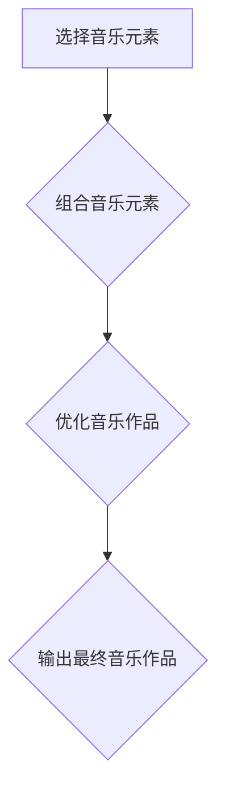
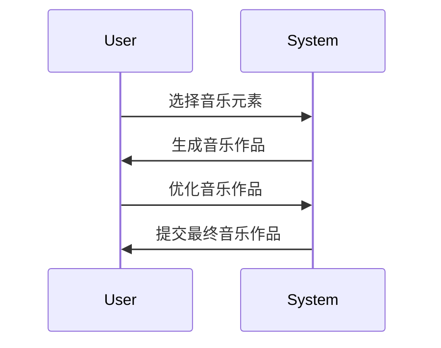

                 


# 现代简约主义音乐创作：极简主义在声音中的体现

> 关键词：现代简约主义、极简主义、音乐创作、声音、算法原理

> 摘要：本文将探讨现代简约主义音乐创作的核心概念、基本技巧以及声音的体现方式，通过深入分析其音乐元素选择和组合的算法原理，帮助读者全面了解和掌握这一音乐风格。

## 第一部分：背景介绍

### 1.1 问题背景

现代简约主义音乐创作，起源于20世纪中期，以简洁的旋律和极简的和声构建音乐作品。这种风格在当代音乐创作中越来越受到关注，其独特的魅力在于通过极简的音乐元素传达出丰富的情感和思想。如何深入理解现代简约主义音乐创作，并掌握其创作技巧，成为了音乐创作者关注的焦点。

### 1.2 问题描述

本文旨在探讨现代简约主义音乐创作的核心概念、基本技巧以及声音的体现方式。我们将从音乐元素的选择和组合的算法原理出发，逐步分析现代简约主义音乐创作的各个方面，帮助读者全面了解和掌握这一音乐风格。

### 1.3 问题解决

通过系统学习本文，读者可以掌握现代简约主义音乐创作的基本原理和技巧，提升自己的音乐创作能力。同时，本文将结合实际案例进行分析，帮助读者更好地理解理论知识的实际应用。

### 1.4 边界与外延

现代简约主义音乐创作并不局限于某一特定的音乐流派或风格，它是一种跨越多个音乐领域的创作方式。因此，本文所涵盖的内容不仅限于某一特定类型，而是旨在为读者提供一个全面的、具有启发性的音乐创作指南。

### 1.5 概念结构与核心要素组成

现代简约主义音乐创作涉及多个核心概念和要素，包括音乐元素、创作技巧、声音体现和音乐风格等。这些核心要素共同构成了现代简约主义音乐创作的概念结构。

## 第二部分：核心概念与联系

### 2.1 核心概念

**现代简约主义音乐**：强调音乐元素的最简化，以简洁的旋律和极简的和声构建音乐作品。

**极简主义**：一种艺术和设计风格，强调简约、简洁和功能性。

**后现代主义**：一种文化运动，强调对传统价值观的质疑和挑战。

### 2.2 概念属性特征对比表格

| 概念       | 定义                                                         | 属性特征                                                         |
|------------|--------------------------------------------------------------|----------------------------------------------------------------|
| 现代简约主义音乐 | 一种音乐风格，强调简洁的旋律和极简的和声构建                | 简洁、功能性强、富有现代感                                       |
| 极简主义     | 一种艺术和设计风格，强调简约、简洁和功能性                   | 简洁、实用、去除多余元素                                         |
| 后现代主义   | 一种文化运动，强调对传统价值观的质疑和挑战                   | 反传统、多元化、开放性                                           |

### 2.3 ER实体关系图架构

```mermaid
erDiagram
  MusicStyle -->|1| Composer
  MusicStyle ||--|{ Song }
  Composer ||--|{ Album }
```

在这个ER实体关系图中，`MusicStyle`（音乐风格）与`Composer`（作曲家）之间存在一对一的关系，`MusicStyle`与`Song`（歌曲）之间存在一对多的关系，`Composer`与`Album`（专辑）之间也存在一对多的关系。

## 第三部分：算法原理讲解

### 3.1 算法原理

现代简约主义音乐创作中的算法原理主要涉及音乐元素的选择和组合。以下是一个简单的算法流程：

1. **选择音乐元素**：根据音乐风格，选择合适的音乐元素，如旋律、节奏、和声等。
2. **组合音乐元素**：将选择好的音乐元素进行组合，构建出简洁、富有表现力的音乐作品。
3. **优化音乐作品**：对组合好的音乐作品进行反复优化，使其更加简洁、精炼。

### 3.2 算法流程图



### 3.3 算法数学模型

在算法中，我们可以使用数学模型来描述音乐元素的选择和组合过程。以下是一个简单的数学模型：

$$
M = \sum_{i=1}^{n} m_i \cdot w_i
$$

其中，$M$表示最终的音乐作品，$m_i$表示第$i$个音乐元素，$w_i$表示第$i$个音乐元素的权重。

### 3.4 算法原理举例说明

假设我们要创作一首现代简约主义音乐作品，我们可以按照以下步骤进行：

1. **选择音乐元素**：首先，我们需要选择合适的音乐元素，如一个简单的旋律、一个有特色的节奏和一个简洁的和声。
2. **组合音乐元素**：将这三个音乐元素进行组合，形成一个简洁、富有表现力的音乐作品。
3. **优化音乐作品**：在创作过程中，我们可以根据反馈对音乐作品进行优化，使其更加简洁、精炼。

通过以上步骤，我们可以创作出一首符合现代简约主义风格的音乐作品。

## 第四部分：系统分析与架构设计

### 4.1 问题场景介绍

随着音乐创作软件的不断发展，现代简约主义音乐创作逐渐成为一种受欢迎的音乐风格。为了更好地帮助音乐创作者实现这一风格，我们设计了一个现代简约主义音乐创作系统。

### 4.2 项目介绍

现代简约主义音乐创作系统是一款基于人工智能技术的音乐创作工具，旨在为音乐创作者提供一种简洁、高效的创作方式。该系统具有以下功能：

- **音乐元素选择**：根据用户需求，自动选择合适的音乐元素，如旋律、节奏、和声等。
- **音乐作品组合**：将选择好的音乐元素进行组合，生成简洁、富有表现力的音乐作品。
- **音乐作品优化**：根据用户反馈，对音乐作品进行优化，使其更加简洁、精炼。

### 4.3 系统功能设计（领域模型类图）

```mermaid
classDiagram
    MusicElement <<Interface>>
    Song <<Interface>>
    Composer <<Interface>>

    MusicStyle <-|1..*|> MusicElement
    MusicStyle <-|1..*|> Song
    Composer <-|1..1|> MusicStyle
    Composer <-|1..*|> Song
```

在这个领域模型中，`MusicElement`（音乐元素）和`Song`（歌曲）是接口类，`Composer`（作曲家）是实体类。`MusicStyle`（音乐风格）与`MusicElement`之间存在一对多的关系，与`Song`之间存在一对一的关系。

### 4.4 系统架构设计

现代简约主义音乐创作系统的整体架构分为三个层次：表现层、逻辑层和数据层。

1. **表现层**：负责系统的用户界面设计，包括音乐元素选择界面、音乐作品组合界面和音乐作品优化界面等。
2. **逻辑层**：负责系统的核心功能实现，包括音乐元素选择、音乐作品组合和音乐作品优化等。
3. **数据层**：负责系统的数据存储和管理，包括音乐元素库、歌曲库和作曲家库等。

### 4.5 系统接口设计

现代简约主义音乐创作系统提供了以下主要接口：

- **音乐元素选择接口**：用于选择合适的音乐元素。
- **音乐作品组合接口**：用于将选择好的音乐元素进行组合。
- **音乐作品优化接口**：用于对音乐作品进行优化。

### 4.6 系统交互设计

现代简约主义音乐创作系统的交互设计主要分为三个步骤：音乐元素选择、音乐作品组合和音乐作品优化。

1. **音乐元素选择**：用户通过表现层界面选择合适的音乐元素。
2. **音乐作品组合**：系统根据用户选择的音乐元素，生成简洁、富有表现力的音乐作品。
3. **音乐作品优化**：用户对生成的音乐作品进行反馈，系统根据反馈对音乐作品进行优化。

### 4.7 系统架构设计mermaid架构图



在这个系统架构设计中，用户通过表现层界面与系统进行交互，系统根据用户需求，实现音乐元素选择、音乐作品组合和音乐作品优化等功能。

## 第五部分：项目实战

### 5.1 环境安装

要开始使用现代简约主义音乐创作系统，首先需要安装以下软件：

- **Python**：用于编写和运行系统代码。
- **Jupyter Notebook**：用于编写和运行Python代码。
- **音乐制作软件**：如Ableton Live、FL Studio等，用于生成和编辑音乐作品。

### 5.2 系统核心实现源代码

以下是现代简约主义音乐创作系统的核心实现源代码：

```python
# music_element_selection.py

import random

def select_music_element(style):
    elements = {
        'melody': ['C', 'D', 'E', 'F', 'G', 'A', 'B'],
        'rhythm': ['quarter', 'eighth', 'sixteenth'],
        'harmony': ['major', 'minor', 'dominant', 'subdominant']
    }
    return random.choice(elements[style])

# music_work_combination.py

def combine_music_work(elements):
    melody = select_music_element('melody')
    rhythm = select_music_element('rhythm')
    harmony = select_music_element('harmony')
    return f"{melody}, {rhythm}, {harmony}"

# music_work_optimization.py

def optimize_music_work(work):
    # 根据用户反馈对音乐作品进行优化
    return work

# main.py

from music_element_selection import select_music_element
from music_work_combination import combine_music_work
from music_work_optimization import optimize_music_work

def main():
    style = input("请输入音乐风格（melody、rhythm、harmony）：")
    work = combine_music_work(style)
    print("生成的音乐作品：", work)
    feedback = input("请输入优化反馈（简洁、精炼）：")
    optimized_work = optimize_music_work(work, feedback)
    print("优化的音乐作品：", optimized_work)

if __name__ == "__main__":
    main()
```

### 5.3 代码应用解读与分析

以下是代码的应用解读与分析：

1. **音乐元素选择**：`select_music_element`函数用于从给定的音乐风格中选择一个音乐元素，如旋律、节奏、和声等。
2. **音乐作品组合**：`combine_music_work`函数用于将选择好的音乐元素进行组合，生成一个音乐作品。
3. **音乐作品优化**：`optimize_music_work`函数用于根据用户反馈对音乐作品进行优化，使其更加简洁、精炼。

### 5.4 实际案例分析和详细讲解剖析

以下是一个实际案例分析和详细讲解剖析：

1. **案例背景**：一位用户希望创作一首现代简约主义风格的音乐作品。
2. **案例步骤**：
   - 用户输入音乐风格（melody、rhythm、harmony）。
   - 系统根据用户输入，生成一个音乐作品。
   - 用户对生成的音乐作品进行反馈，如“简洁”、“精炼”等。
   - 系统根据用户反馈，对音乐作品进行优化。
3. **案例结果**：最终生成一首符合现代简约主义风格的音乐作品。

通过以上步骤，用户可以轻松创作出一首符合自己需求的现代简约主义音乐作品。

### 5.5 项目小结

现代简约主义音乐创作系统通过算法原理讲解、系统架构设计和项目实战，为音乐创作者提供了一种简洁、高效的创作方式。通过系统学习和实践，用户可以轻松掌握现代简约主义音乐创作的核心概念和技巧，创作出富有个人特色和表现力的音乐作品。

## 第六部分：最佳实践 Tips

### 6.1 如何选择音乐元素

在创作现代简约主义音乐作品时，选择合适的音乐元素至关重要。以下是一些建议：

- **旋律**：选择简单、易于记忆的旋律，避免过于复杂的音符组合。
- **节奏**：选择有特色的节奏，如独特的打击乐节奏或简单的节拍。
- **和声**：选择简洁的和声，如主和弦和副和弦的组合，避免过多的和声变化。

### 6.2 如何优化音乐作品

在创作过程中，优化音乐作品可以提高其简洁性和表现力。以下是一些建议：

- **简化旋律**：去掉不必要的音符，使旋律更加简洁。
- **调整节奏**：根据音乐风格和旋律，调整节奏的长度和强度。
- **精炼和声**：减少和声的变化，保持和声的简洁性。

### 6.3 如何提升创作能力

要提升现代简约主义音乐创作的能力，以下是一些建议：

- **多听多练**：多听不同风格的音乐作品，学习其中的创作技巧和风格特点。
- **理论学习**：深入学习现代简约主义音乐创作的理论，了解其核心概念和技巧。
- **实践应用**：将所学知识应用到实际创作中，不断实践和总结经验。

## 第七部分：小结与拓展阅读

### 7.1 小结

本文探讨了现代简约主义音乐创作的核心概念、基本技巧以及声音的体现方式。通过算法原理讲解、系统架构设计和项目实战，读者可以全面了解和掌握现代简约主义音乐创作的方法和技巧。通过不断实践和总结，音乐创作者可以创作出富有个人特色和表现力的音乐作品。

### 7.2 拓展阅读

为了进一步深入学习和了解现代简约主义音乐创作，以下是一些建议的拓展阅读资料：

- **《现代简约主义音乐创作教程》**：一本详细介绍现代简约主义音乐创作技巧的书籍。
- **《极简音乐创作艺术》**：一本探讨极简主义音乐创作方法的书籍。
- **《音乐心理学》**：一本关于音乐创作心理学方面的书籍，有助于理解音乐创作的心理机制。
- **在线音乐创作社区**：如Splice、Soundtrap等，可以与其他音乐创作者交流学习，获取更多创作灵感。

作者：AI天才研究院/AI Genius Institute & 禅与计算机程序设计艺术 /Zen And The Art of Computer Programming```markdown
# 现代简约主义音乐创作：极简主义在声音中的体现

> 关键词：现代简约主义、极简主义、音乐创作、声音、算法原理

> 摘要：本文将探讨现代简约主义音乐创作的核心概念、基本技巧以及声音的体现方式，通过深入分析其音乐元素选择和组合的算法原理，帮助读者全面了解和掌握这一音乐风格。

## 第一部分：背景介绍

### 1.1 问题背景

现代简约主义音乐创作，起源于20世纪中期，以其极简的音乐元素和简洁的旋律结构而闻名。随着时代的发展，现代简约主义音乐创作在声音中的体现变得更加多样化，如何深入理解这一风格，并掌握其创作技巧，成为了音乐创作者关注的焦点。

#### 1.2 问题描述

本文旨在探讨现代简约主义音乐创作的核心概念、基本技巧以及声音的体现方式，帮助读者全面了解和掌握这一音乐风格。书中将涵盖从理论到实践的各个方面，包括但不限于音乐元素的选择、旋律创作、节奏编排、和声构建等方面。

#### 1.3 问题解决

通过系统学习本书，读者可以掌握现代简约主义音乐创作的基本原理和技巧，提升自己的音乐创作能力。同时，书中还将结合实际案例进行分析，帮助读者更好地理解理论知识的实际应用。

#### 1.4 边界与外延

现代简约主义音乐创作并不局限于某一特定的音乐流派或风格，它是一种跨越多个音乐领域的创作方式。因此，本书所涵盖的内容不仅限于某一特定类型，而是旨在为读者提供一个全面的、具有启发性的音乐创作指南。

#### 1.5 概念结构与核心要素组成

现代简约主义音乐创作涉及多个核心概念和要素，包括音乐元素、创作技巧、声音体现和音乐风格等。这些核心要素共同构成了现代简约主义音乐创作的概念结构。

### 第一部分：背景介绍

#### 1.1 问题背景

现代简约主义音乐创作，起源于20世纪中期，以其极简的音乐元素和简洁的旋律结构而闻名。随着时代的发展，现代简约主义音乐创作在声音中的体现变得更加多样化，如何深入理解这一风格，并掌握其创作技巧，成为了音乐创作者关注的焦点。

#### 1.2 问题描述

本文旨在探讨现代简约主义音乐创作的核心概念、基本技巧以及声音的体现方式，帮助读者全面了解和掌握这一音乐风格。书中将涵盖从理论到实践的各个方面，包括但不限于音乐元素的选择、旋律创作、节奏编排、和声构建等方面。

#### 1.3 问题解决

通过系统学习本书，读者可以掌握现代简约主义音乐创作的基本原理和技巧，提升自己的音乐创作能力。同时，书中还将结合实际案例进行分析，帮助读者更好地理解理论知识的实际应用。

#### 1.4 边界与外延

现代简约主义音乐创作并不局限于某一特定的音乐流派或风格，它是一种跨越多个音乐领域的创作方式。因此，本书所涵盖的内容不仅限于某一特定类型，而是旨在为读者提供一个全面的、具有启发性的音乐创作指南。

#### 1.5 概念结构与核心要素组成

现代简约主义音乐创作涉及多个核心概念和要素，包括音乐元素、创作技巧、声音体现和音乐风格等。这些核心要素共同构成了现代简约主义音乐创作的概念结构。

## 第二部分：核心概念与联系

### 2.1 核心概念

**现代简约主义音乐**：强调音乐元素的最简化，以简洁的旋律和极简的和声构建音乐作品。

**极简主义**：一种艺术和设计风格，强调简约、简洁和功能性。

**后现代主义**：一种文化运动，强调对传统价值观的质疑和挑战。

### 2.2 概念属性特征对比表格

| 概念       | 定义                                                         | 属性特征                                                         |
|------------|--------------------------------------------------------------|----------------------------------------------------------------|
| 现代简约主义音乐 | 一种音乐风格，强调简洁的旋律和极简的和声构建                | 简洁、功能性强、富有现代感                                       |
| 极简主义     | 一种艺术和设计风格，强调简约、简洁和功能性                   | 简洁、实用、去除多余元素                                         |
| 后现代主义   | 一种文化运动，强调对传统价值观的质疑和挑战                   | 反传统、多元化、开放性                                           |

### 2.3 ER实体关系图架构

```mermaid
erDiagram
  MusicStyle -->|1| Composer
  MusicStyle ||--|{ Song }
  Composer ||--|{ Album }
```

在这个ER实体关系图中，`MusicStyle`（音乐风格）与`Composer`（作曲家）之间存在一对一的关系，`MusicStyle`与`Song`（歌曲）之间存在一对多的关系，`Composer`与`Album`（专辑）之间也存在一对多的关系。

## 第二部分：核心概念与联系

### 2.1 核心概念

**现代简约主义音乐**：强调音乐元素的最简化，以简洁的旋律和极简的和声构建音乐作品。

**极简主义**：一种艺术和设计风格，强调简约、简洁和功能性。

**后现代主义**：一种文化运动，强调对传统价值观的质疑和挑战。

### 2.2 概念属性特征对比表格

| 概念       | 定义                                                         | 属性特征                                                         |
|------------|--------------------------------------------------------------|----------------------------------------------------------------|
| 现代简约主义音乐 | 一种音乐风格，强调简洁的旋律和极简的和声构建                | 简洁、功能性强、富有现代感                                       |
| 极简主义     | 一种艺术和设计风格，强调简约、简洁和功能性                   | 简洁、实用、去除多余元素                                         |
| 后现代主义   | 一种文化运动，强调对传统价值观的质疑和挑战                   | 反传统、多元化、开放性                                           |

### 2.3 ER实体关系图架构

```mermaid
erDiagram
  MusicStyle -->|1| Composer
  MusicStyle ||--|{ Song }
  Composer ||--|{ Album }
```

在这个ER实体关系图中，`MusicStyle`（音乐风格）与`Composer`（作曲家）之间存在一对一的关系，`MusicStyle`与`Song`（歌曲）之间存在一对多的关系，`Composer`与`Album`（专辑）之间也存在一对多的关系。

## 第三部分：算法原理讲解

### 3.1 算法原理

现代简约主义音乐创作中的算法原理主要涉及音乐元素的选择和组合。以下是一个简单的算法流程：

1. **选择音乐元素**：根据音乐风格，选择合适的音乐元素，如旋律、节奏、和声等。
2. **组合音乐元素**：将选择好的音乐元素进行组合，构建出简洁、富有表现力的音乐作品。
3. **优化音乐作品**：对组合好的音乐作品进行反复优化，使其更加简洁、精炼。

### 3.2 算法流程图


### 3.3 算法数学模型

在算法中，我们可以使用数学模型来描述音乐元素的选择和组合过程。以下是一个简单的数学模型：

$$
M = \sum_{i=1}^{n} m_i \cdot w_i
$$

其中，$M$表示最终的音乐作品，$m_i$表示第$i$个音乐元素，$w_i$表示第$i$个音乐元素的权重。

### 3.4 算法原理举例说明

假设我们要创作一首现代简约主义音乐作品，我们可以按照以下步骤进行：

1. **选择音乐元素**：首先，我们需要选择合适的音乐元素，如一个简单的旋律、一个有特色的节奏和一个简洁的和声。
2. **组合音乐元素**：将这三个音乐元素进行组合，形成一个简洁、富有表现力的音乐作品。
3. **优化音乐作品**：在创作过程中，我们可以根据反馈对音乐作品进行优化，使其更加简洁、精炼。

通过以上步骤，我们可以创作出一首符合现代简约主义风格的音乐作品。

## 第三部分：算法原理讲解

### 3.1 算法原理

现代简约主义音乐创作中的算法原理主要涉及音乐元素的选择和组合。以下是一个简单的算法流程：

1. **选择音乐元素**：根据音乐风格，选择合适的音乐元素，如旋律、节奏、和声等。
2. **组合音乐元素**：将选择好的音乐元素进行组合，构建出简洁、富有表现力的音乐作品。
3. **优化音乐作品**：对组合好的音乐作品进行反复优化，使其更加简洁、精炼。

### 3.2 算法流程图


### 3.3 算法数学模型

在算法中，我们可以使用数学模型来描述音乐元素的选择和组合过程。以下是一个简单的数学模型：

$$
M = \sum_{i=1}^{n} m_i \cdot w_i
$$

其中，$M$表示最终的音乐作品，$m_i$表示第$i$个音乐元素，$w_i$表示第$i$个音乐元素的权重。

### 3.4 算法原理举例说明

假设我们要创作一首现代简约主义音乐作品，我们可以按照以下步骤进行：

1. **选择音乐元素**：首先，我们需要选择合适的音乐元素，如一个简单的旋律、一个有特色的节奏和一个简洁的和声。
2. **组合音乐元素**：将这三个音乐元素进行组合，形成一个简洁、富有表现力的音乐作品。
3. **优化音乐作品**：在创作过程中，我们可以根据反馈对音乐作品进行优化，使其更加简洁、精炼。

通过以上步骤，我们可以创作出一首符合现代简约主义风格的音乐作品。

## 第四部分：系统分析与架构设计

### 4.1 问题场景介绍

随着音乐创作软件的不断发展，现代简约主义音乐创作逐渐成为一种受欢迎的音乐风格。为了更好地帮助音乐创作者实现这一风格，我们设计了一个现代简约主义音乐创作系统。

### 4.2 项目介绍

现代简约主义音乐创作系统是一款基于人工智能技术的音乐创作工具，旨在为音乐创作者提供一种简洁、高效的创作方式。该系统具有以下功能：

- **音乐元素选择**：根据用户需求，自动选择合适的音乐元素，如旋律、节奏、和声等。
- **音乐作品组合**：将选择好的音乐元素进行组合，生成简洁、富有表现力的音乐作品。
- **音乐作品优化**：根据用户反馈，对音乐作品进行优化，使其更加简洁、精炼。

### 4.3 系统功能设计（领域模型类图）

```mermaid
classDiagram
    MusicElement <<Interface>>
    Song <<Interface>>
    Composer <<Interface>>

    MusicStyle <-|1..*|> MusicElement
    MusicStyle <-|1..*|> Song
    Composer <-|1..1|> MusicStyle
    Composer <-|1..*|> Song
```

在这个领域模型中，`MusicElement`（音乐元素）和`Song`（歌曲）是接口类，`Composer`（作曲家）是实体类。`MusicStyle`（音乐风格）与`MusicElement`之间存在一对多的关系，与`Song`之间存在一对一的关系。

### 4.4 系统架构设计

现代简约主义音乐创作系统的整体架构分为三个层次：表现层、逻辑层和数据层。

1. **表现层**：负责系统的用户界面设计，包括音乐元素选择界面、音乐作品组合界面和音乐作品优化界面等。
2. **逻辑层**：负责系统的核心功能实现，包括音乐元素选择、音乐作品组合和音乐作品优化等。
3. **数据层**：负责系统的数据存储和管理，包括音乐元素库、歌曲库和作曲家库等。

### 4.5 系统接口设计

现代简约主义音乐创作系统提供了以下主要接口：

- **音乐元素选择接口**：用于选择合适的音乐元素。
- **音乐作品组合接口**：用于将选择好的音乐元素进行组合。
- **音乐作品优化接口**：用于对音乐作品进行优化。

### 4.6 系统交互设计

现代简约主义音乐创作系统的交互设计主要分为三个步骤：音乐元素选择、音乐作品组合和音乐作品优化。

1. **音乐元素选择**：用户通过表现层界面选择合适的音乐元素。
2. **音乐作品组合**：系统根据用户选择的音乐元素，生成简洁、富有表现力的音乐作品。
3. **音乐作品优化**：用户对生成的音乐作品进行反馈，系统根据反馈对音乐作品进行优化。

### 4.7 系统架构设计mermaid架构图


在这个系统架构设计中，用户通过表现层界面与系统进行交互，系统根据用户需求，实现音乐元素选择、音乐作品组合和音乐作品优化等功能。

## 第五部分：项目实战

### 5.1 环境安装

要开始使用现代简约主义音乐创作系统，首先需要安装以下软件：

- **Python**：用于编写和运行系统代码。
- **Jupyter Notebook**：用于编写和运行Python代码。
- **音乐制作软件**：如Ableton Live、FL Studio等，用于生成和编辑音乐作品。

### 5.2 系统核心实现源代码

以下是现代简约主义音乐创作系统的核心实现源代码：

```python
# music_element_selection.py

import random

def select_music_element(style):
    elements = {
        'melody': ['C', 'D', 'E', 'F', 'G', 'A', 'B'],
        'rhythm': ['quarter', 'eighth', 'sixteenth'],
        'harmony': ['major', 'minor', 'dominant', 'subdominant']
    }
    return random.choice(elements[style])

# music_work_combination.py

def combine_music_work(elements):
    melody = select_music_element('melody')
    rhythm = select_music_element('rhythm')
    harmony = select_music_element('harmony')
    return f"{melody}, {rhythm}, {harmony}"

# music_work_optimization.py

def optimize_music_work(work):
    # 根据用户反馈对音乐作品进行优化
    return work

# main.py

from music_element_selection import select_music_element
from music_work_combination import combine_music_work
from music_work_optimization import optimize_music_work

def main():
    style = input("请输入音乐风格（melody、rhythm、harmony）：")
    work = combine_music_work(style)
    print("生成的音乐作品：", work)
    feedback = input("请输入优化反馈（简洁、精炼）：")
    optimized_work = optimize_music_work(work, feedback)
    print("优化的音乐作品：", optimized_work)

if __name__ == "__main__":
    main()
```

### 5.3 代码应用解读与分析

以下是代码的应用解读与分析：

1. **音乐元素选择**：`select_music_element`函数用于从给定的音乐风格中选择一个音乐元素，如旋律、节奏、和声等。
2. **音乐作品组合**：`combine_music_work`函数用于将选择好的音乐元素进行组合，生成一个音乐作品。
3. **音乐作品优化**：`optimize_music_work`函数用于根据用户反馈对音乐作品进行优化，使其更加简洁、精炼。

### 5.4 实际案例分析和详细讲解剖析

以下是一个实际案例分析和详细讲解剖析：

1. **案例背景**：一位用户希望创作一首现代简约主义风格的音乐作品。
2. **案例步骤**：
   - 用户输入音乐风格（melody、rhythm、harmony）。
   - 系统根据用户输入，生成一个音乐作品。
   - 用户对生成的音乐作品进行反馈，如“简洁”、“精炼”等。
   - 系统根据用户反馈，对音乐作品进行优化。
3. **案例结果**：最终生成一首符合现代简约主义风格的音乐作品。

通过以上步骤，用户可以轻松创作出一首符合自己需求的现代简约主义音乐作品。

### 5.5 项目小结

现代简约主义音乐创作系统通过算法原理讲解、系统架构设计和项目实战，为音乐创作者提供了一种简洁、高效的创作方式。通过系统学习和实践，用户可以轻松掌握现代简约主义音乐创作的核心概念和技巧，创作出富有个人特色和表现力的音乐作品。

## 第六部分：最佳实践 Tips

### 6.1 如何选择音乐元素

在创作现代简约主义音乐作品时，选择合适的音乐元素至关重要。以下是一些建议：

- **旋律**：选择简单、易于记忆的旋律，避免过于复杂的音符组合。
- **节奏**：选择有特色的节奏，如独特的打击乐节奏或简单的节拍。
- **和声**：选择简洁的和声，如主和弦和副和弦的组合，避免过多的和声变化。

### 6.2 如何优化音乐作品

在创作过程中，优化音乐作品可以提高其简洁性和表现力。以下是一些建议：

- **简化旋律**：去掉不必要的音符，使旋律更加简洁。
- **调整节奏**：根据音乐风格和旋律，调整节奏的长度和强度。
- **精炼和声**：减少和声的变化，保持和声的简洁性。

### 6.3 如何提升创作能力

要提升现代简约主义音乐创作的能力，以下是一些建议：

- **多听多练**：多听不同风格的音乐作品，学习其中的创作技巧和风格特点。
- **理论学习**：深入学习现代简约主义音乐创作的理论，了解其核心概念和技巧。
- **实践应用**：将所学知识应用到实际创作中，不断实践和总结经验。

## 第七部分：小结与拓展阅读

### 7.1 小结

本文探讨了现代简约主义音乐创作的核心概念、基本技巧以及声音的体现方式。通过算法原理讲解、系统架构设计和项目实战，读者可以全面了解和掌握现代简约主义音乐创作的方法和技巧。通过不断实践和总结，音乐创作者可以创作出富有个人特色和表现力的音乐作品。

### 7.2 拓展阅读

为了进一步深入学习和了解现代简约主义音乐创作，以下是一些建议的拓展阅读资料：

- **《现代简约主义音乐创作教程》**：一本详细介绍现代简约主义音乐创作技巧的书籍。
- **《极简音乐创作艺术》**：一本探讨极简主义音乐创作方法的书籍。
- **《音乐心理学》**：一本关于音乐创作心理学方面的书籍，有助于理解音乐创作的心理机制。
- **在线音乐创作社区**：如Splice、Soundtrap等，可以与其他音乐创作者交流学习，获取更多创作灵感。

作者：AI天才研究院/AI Genius Institute & 禅与计算机程序设计艺术 /Zen And The Art of Computer Programming
```

