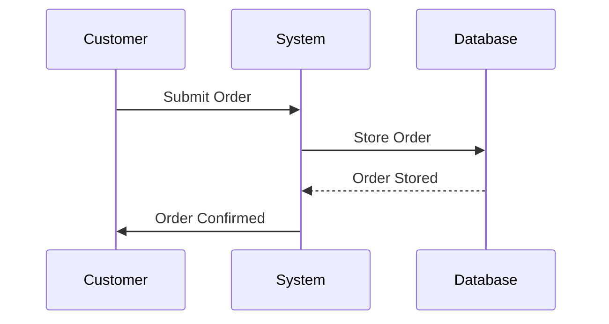
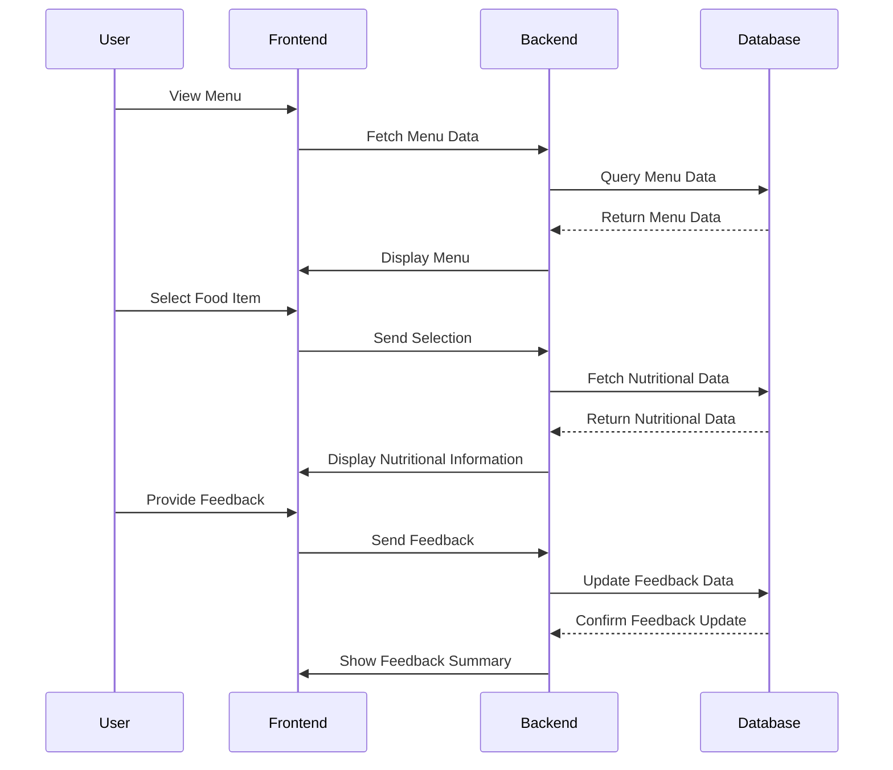

                 


# 现代简餐文化：快节奏生活中的饮食哲学

## 关键词

- 现代简餐文化
- 快节奏生活
- 饮食哲学
- 营养健康
- 社会文化影响
- 创新实践

## 摘要

本文将探讨现代简餐文化的兴起及其在快节奏生活中的重要性。通过对历史背景、核心概念、营养健康、文化影响以及创新实践的深入分析，揭示现代简餐文化的本质和未来趋势。文章旨在为读者提供关于如何平衡快节奏生活和健康饮食的实用指导，并探讨如何通过创新实践推动现代简餐文化的发展。

## 引言

### 现代简餐文化的概念与定义

现代简餐文化是指在快节奏、高压力的现代生活中，人们为了满足营养需求和时间效率，逐渐形成的一种以便捷、快速、多样为特点的饮食模式。这种文化不仅体现在食品种类和消费习惯上，还涵盖了饮食观念和饮食方式的变革。

简餐，顾名思义，是指简单、便捷的餐食。在现代，简餐不仅包括传统的面包、三明治、沙拉等，还扩展到即食食品、快餐、外卖等多样化的食品类型。随着生活节奏的加快，人们越来越重视时间的利用效率，简餐因其便捷性和快速性，逐渐成为人们日常饮食的重要组成部分。

### 现代简餐文化的重要性

现代简餐文化在快节奏生活中具有重要的地位。首先，它满足了现代人对高效生活的需求。无论是职场人士、学生还是家庭主妇，都可以通过简餐迅速补充能量，维持日常活动。其次，简餐文化的普及促进了食品产业和服务业的发展，创造了大量就业机会，同时也提高了社会经济的活力。

此外，现代简餐文化还体现了对健康饮食的关注。随着人们对健康意识的提高，越来越多的简餐产品开始注重营养搭配，提供低热量、高蛋白、低脂肪的健康食品选择。这不仅有助于改善人们的饮食习惯，也有助于预防慢性疾病，提高生活质量。

### 本书的结构与内容

本书将分为七个部分，对现代简餐文化进行系统而深入的探讨。首先，在第一部分“引言”中，我们将简要介绍现代简餐文化的概念与定义，并探讨其重要性。接着，在第二部分“历史背景与演变”中，我们将追溯简餐文化的起源与发展历程，分析其背后的社会文化因素。

第三部分“核心概念与饮食哲学”将介绍与饮食哲学相关的核心概念，探讨简餐文化与饮食习惯之间的关系，以及如何在快节奏生活中实现健康饮食。第四部分“营养与健康”将分析现代简餐的营养特点，讨论其健康影响，并提供健康饮食的建议。

第五部分“文化影响与社会影响”将探讨现代简餐文化对社会文化的影响，分析其文化内涵和社会价值。第六部分“创新实践”将介绍现代简餐文化的创新实践，包括食品科技、健康饮食观念的传播和推广等。最后，在第七部分“结论与未来趋势”中，我们将总结本书的主要内容，并展望现代简餐文化的未来发展趋势。

## 历史背景与演变

### 简餐文化的起源

简餐文化的起源可以追溯到古代。在农耕社会，人们为了提高生产效率，开始逐渐形成简单、快速的就餐习惯。例如，中国古代的“便餐”和“点心”就是简餐文化的雏形。随着时间的推移，简餐文化逐渐渗透到世界各地，形成了独特的饮食文化。

在欧洲，中世纪的“面包与奶酪”是最为典型的简餐形式。这种简单而便捷的饮食方式，不仅满足了人们的基本营养需求，还体现了对时间的高效利用。到了工业革命时期，随着城市化进程的加快，简餐文化得到了进一步的发展。工厂工人和城市居民为了节省时间，开始购买现成的面包、三明治等食品，这为现代简餐文化奠定了基础。

### 简餐文化的演变

进入20世纪，特别是随着经济的快速发展和社会结构的变迁，简餐文化经历了巨大的演变。二战后，西方国家的经济繁荣和生活水平的提高，使得快餐文化迅速崛起。汉堡、炸鸡、薯条等快餐食品成为人们日常饮食的重要组成部分。这不仅改变了人们的饮食习惯，也推动了食品工业的快速发展。

与此同时，亚洲地区的简餐文化也在不断演变。中国的快餐业在改革开放后迅速发展，饺子、炒饭、面条等传统简餐食品与现代快餐相结合，形成了独特的饮食文化。日本则将简餐文化发展到了极致，便当、寿司、天妇罗等食品成为人们日常饮食的常态。

### 简餐文化的发展因素

简餐文化的发展受到多种因素的推动。首先，城市化进程是简餐文化发展的重要背景。随着城市人口的增加，人们的时间变得越来越宝贵，对便捷、快速的食物需求也越来越强烈。简餐文化正是在这种背景下应运而生。

其次，生活方式的变化也是简餐文化发展的关键因素。现代人的生活节奏加快，工作压力增大，使得他们在饮食上更加追求效率。简餐文化的便捷性和高效性正好满足了这种需求，因此得到了广泛普及。

此外，科技进步和食品工业的发展也为简餐文化的兴起提供了支持。冷冻技术、真空包装技术等食品保鲜技术的进步，使得食品可以长时间保存，便于携带和消费。同时，食品工业的规模化生产，使得简餐食品的供应更加充足和多样化。

### 简餐文化的现状与未来

当前，简餐文化已经渗透到全球各地，成为现代饮食文化的重要组成部分。无论是在城市还是农村，无论是发达国家还是发展中国家，简餐文化都在不断发展和演变。未来，随着科技的进一步进步和人们对健康饮食需求的增加，简餐文化将继续发展，并可能出现更多创新性的饮食模式。

例如，随着食品科技的进步，未来可能会有更多具有营养保健功能的简餐产品问世。同时，随着人们健康意识的提高，简餐产品的营养搭配和健康理念将更加受到重视。此外，简餐文化的全球化也将进一步推动各国饮食文化的融合与创新。

总之，简餐文化的发展是现代生活方式和科技进步的产物，它不仅改变了人们的饮食习惯，也丰富了饮食文化的内涵。在快节奏生活的背景下，简餐文化将继续发挥重要作用，为人们的生活带来更多便利和选择。

## 核心概念与饮食哲学

### 饮食哲学的基本概念

饮食哲学是一种关于饮食观念和饮食方式的系统性思考。它不仅涉及食物的选择和搭配，还包括饮食行为和饮食文化。饮食哲学的基本概念包括营养学、饮食习惯、饮食文化等。

#### 营养学

营养学是饮食哲学的核心概念之一，它研究食物中的营养成分及其对人体健康的影响。营养学强调均衡饮食，即摄入适量的蛋白质、脂肪、碳水化合物、维生素和矿物质，以满足人体生理和心理健康的需求。

#### 饮食习惯

饮食习惯是指人们在日常生活中形成的饮食行为模式。良好的饮食习惯有助于保持身体健康，预防疾病。饮食习惯包括饮食时间、饮食方式、饮食内容等方面。例如，定时进食、细嚼慢咽、少油少盐等都是良好的饮食习惯。

#### 饮食文化

饮食文化是指一个社会或群体在长期历史发展过程中形成的饮食方式和饮食观念。饮食文化不仅反映了一个社会的经济水平和生活习惯，还承载了丰富的历史和文化内涵。饮食文化包括传统饮食、地方特色饮食、节日饮食等。

### 简餐文化与饮食习惯的关系

简餐文化作为一种现代饮食模式，与饮食习惯有着密切的关系。首先，简餐文化的便捷性和高效性使得人们更容易养成不良的饮食习惯，如过度依赖快餐和外卖，忽视饮食的营养搭配。其次，简餐文化的普及改变了人们的饮食习惯，使得快餐和即食食品成为日常饮食的重要组成部分。

然而，简餐文化也有助于培养良好的饮食习惯。例如，一些简餐产品如沙拉、水果拼盘等，富含营养且易于消化，有助于人们保持健康的饮食习惯。此外，随着健康意识的提高，越来越多的简餐产品开始注重营养搭配，提供更多健康的食品选择。

### 快节奏生活中的健康饮食原则

在快节奏的生活中，保持健康饮食显得尤为重要。以下是一些健康饮食原则，可以帮助我们在快节奏生活中实现健康饮食：

#### 定时定量

定时进食有助于维持血糖水平的稳定，避免暴饮暴食。定量饮食则有助于控制能量摄入，避免摄入过多的热量。

#### 营养均衡

营养均衡是健康饮食的关键。我们应该确保摄入适量的蛋白质、脂肪、碳水化合物以及各种维生素和矿物质。

#### 多样化

饮食多样化有助于我们摄入丰富的营养成分。在日常饮食中，应适当搭配各种食物，如谷物、蔬菜、水果、肉类、豆类等。

#### 减少加工食品

加工食品往往含有较高的盐分、糖分和脂肪，长期摄入可能对健康产生不利影响。因此，应尽量减少加工食品的摄入，选择新鲜食材。

#### 健康烹饪方式

健康的烹饪方式有助于减少食品中营养素的损失。例如，蒸、煮、炖等烹饪方式比油炸、烧烤等更健康。

### 实践建议

为了在快节奏生活中实现健康饮食，我们可以采取以下实践建议：

#### 制定饮食计划

提前制定一周的饮食计划，确保饮食的均衡和多样化。

#### 提前准备食物

每天提前准备一些健康的食物，如水果、蔬菜、坚果等，以备不时之需。

#### 适度运动

适量的运动有助于提高新陈代谢，促进身体健康。

#### 保持良好的作息

保持良好的作息，确保充足的睡眠，有助于维持健康的饮食习惯。

总之，在快节奏的生活中，保持健康饮食需要我们做出一定的努力和调整。通过遵循健康饮食原则和实践建议，我们可以更好地平衡工作与生活，保持身体健康。

## 营养与健康

### 现代简餐的营养特点

现代简餐以其便捷、快速和多样的特点，成为现代生活中不可或缺的一部分。然而，随着人们对健康饮食的关注增加，现代简餐的营养特点也成为讨论的焦点。以下是现代简餐的一些主要营养特点：

#### 高能量密度

现代简餐，尤其是快餐和外卖，往往具有较高的能量密度。这是因为这些食品通常含有较高的脂肪、糖分和盐分，能够迅速提供能量。然而，这种高能量密度也意味着如果摄入过多，容易导致能量过剩，进而引发肥胖和其他健康问题。

#### 营养不均衡

由于加工和烹饪方法的限制，现代简餐常常存在营养不均衡的问题。一些食品可能富含蛋白质和碳水化合物，但缺乏维生素、矿物质和其他必需的营养素。这种不均衡的饮食可能会导致营养缺乏或过剩，影响身体健康。

#### 高盐、高糖

为了增加食品的口感和吸引力，很多现代简餐产品含有较高的盐分和糖分。长期摄入高盐食品可能导致高血压等心血管疾病，而高糖食品则容易引发肥胖、糖尿病等代谢性疾病。

#### 低纤维

现代简餐中的食品，特别是快餐和即食食品，往往富含碳水化合物和脂肪，但纤维含量较低。纤维有助于维持肠道健康，降低患肠道疾病的风险。纤维含量不足可能导致便秘、肠癌等健康问题。

### 频繁简餐的健康影响

频繁食用现代简餐可能会对健康产生一系列负面影响。以下是一些主要健康影响：

#### 肥胖

高能量密度的现代简餐，加上现代人普遍缺乏运动，容易导致能量摄入过剩，进而引发肥胖。肥胖是多种慢性疾病的危险因素，如高血压、心脏病、糖尿病等。

#### 心血管疾病

高盐、高糖的饮食模式可能导致高血压、动脉硬化等心血管疾病。现代简餐中的高脂肪、高胆固醇成分也会增加心血管疾病的风险。

#### 2型糖尿病

长期摄入高糖、高脂肪的现代简餐，可能导致胰岛素抵抗和血糖控制困难，增加2型糖尿病的风险。

#### 营养不良

现代简餐往往无法提供全面的营养，长期依赖现代简餐可能导致营养不良。特别是缺乏维生素、矿物质和其他必需营养素，会影响身体健康和免疫功能。

#### 消化问题

高盐、高脂肪的现代简餐可能导致消化问题，如胃酸过多、胃痛、胃溃疡等。

### 健康饮食建议

为了减少现代简餐对健康的负面影响，以下是一些建议：

#### 适量摄入

尽量减少频繁食用高能量密度的现代简餐，适量摄入，保持能量平衡。

#### 营养均衡

确保饮食中的营养均衡，适量摄入蛋白质、脂肪、碳水化合物，同时增加蔬菜、水果、全谷物和纤维的摄入。

#### 减少盐分和糖分

减少高盐、高糖食品的摄入，选择低盐、低糖的替代品。

#### 增加膳食纤维

增加膳食纤维的摄入，选择富含纤维的食品，如全谷物、蔬菜、水果等。

#### 健康烹饪方式

选择健康的烹饪方式，如蒸、煮、炖，避免油炸和烧烤。

#### 适量运动

保持适量的运动，有助于消耗多余的能量，维持身体健康。

总之，现代简餐在快节奏生活中具有不可替代的地位，但我们也需要关注其健康影响，通过适量摄入、营养均衡和健康生活方式，减少其对健康的负面影响。

## 文化影响与社会影响

### 现代简餐文化对社会文化的影响

现代简餐文化的崛起不仅改变了人们的饮食习惯，也对社会文化产生了深远的影响。

首先，现代简餐文化改变了人们的饮食观念。在过去，饮食往往被视为家庭的重要活动，家庭成员会共同进餐，享受美食。而现代简餐文化的便捷性和高效性，使得越来越多的人选择在外就餐或点外卖。这种变化不仅改变了人们的饮食习惯，也影响了家庭的饮食文化。

其次，现代简餐文化推动了餐饮行业的发展。随着快餐和外卖的普及，餐饮行业逐渐形成了多样化的市场结构，不仅满足了不同消费者的需求，也创造了大量的就业机会。例如，在许多大城市，外卖员和快餐店员工已经成为不可或缺的社会职业。

此外，现代简餐文化还促进了食品科技的发展。为了满足消费者对便捷、快速和多样化食品的需求，食品工业不断创新，研发出各种新型食品和包装技术。这些技术不仅提高了食品的保存性和安全性，也丰富了食品的口味和种类。

### 现代简餐文化对社会文化的影响

现代简餐文化对社会文化的影响同样不可忽视。首先，它影响了人们的社交方式。在快节奏的生活中，人们更倾向于通过手机和社交媒体与朋友互动，而不再像过去那样通过面对面聚会。外卖和快餐的普及，使得人们可以在任何地点和时间享受美食，这改变了人们的社交场景和社交方式。

其次，现代简餐文化改变了人们对健康饮食的认知。随着健康意识的提高，越来越多的人开始关注食品的营养价值和健康影响。这种变化不仅体现在个人饮食习惯上，也影响了社会的整体饮食文化。例如，越来越多的餐饮企业开始注重食品的健康性和营养价值，推出低脂、低糖、高纤维的食品选择。

此外，现代简餐文化还推动了健康饮食观念的传播。通过社交媒体和健康类节目，健康饮食理念得到了广泛的传播。人们开始更加重视饮食的营养均衡，追求健康的生活方式。这种变化不仅影响了个人的饮食习惯，也推动了整个社会对健康饮食的关注。

### 现代简餐文化的文化内涵和社会价值

现代简餐文化蕴含着丰富的文化内涵和社会价值。首先，它体现了对高效生活的追求。在快节奏的现代社会中，人们越来越重视时间的利用效率，简餐文化正是这种高效生活方式的体现。

其次，现代简餐文化体现了对多样性的追求。随着全球化和文化交流的加深，人们对于饮食的需求变得更加多样化。现代简餐不仅包括了传统的面包、三明治、沙拉等，还融合了各种国际美食，如寿司、披萨等。这种多样性的体现，不仅丰富了人们的饮食体验，也促进了不同文化之间的交流与融合。

此外，现代简餐文化还体现了对健康饮食的重视。随着健康意识的提高，越来越多的人开始关注食品的健康性和营养价值。现代简餐产品在追求便捷和快速的同时，也越来越注重食品的健康成分和营养搭配。

最后，现代简餐文化具有显著的社会价值。它不仅推动了食品工业和餐饮行业的发展，创造了大量的就业机会，也提高了社会的经济活力。同时，现代简餐文化还促进了社会对健康饮食和生活方式的关注，有助于提高全民的健康水平。

总之，现代简餐文化在社会文化中具有重要地位，它不仅改变了人们的饮食习惯，也影响了社会文化和生活方式。通过追求高效、多样性和健康，现代简餐文化为现代社会提供了新的饮食选择和生活方式，具有重要的文化内涵和社会价值。

## 创新实践

### 食品科技在简餐文化中的应用

食品科技的发展为现代简餐文化注入了新的活力，通过创新技术，我们不仅可以提高食品的便捷性和安全性，还能改善其营养价值和口感。以下是食品科技在简餐文化中的应用及其影响：

#### 冷冻技术

冷冻技术是现代简餐文化中不可或缺的一部分。通过冷冻技术，食品可以长时间保存，并且不会失去其原有的风味和营养成分。例如，冷冻即食食品如冷冻饺子、冷冻汉堡等，既方便携带，又能保持新鲜。此外，冷冻技术还可以减少食品的浪费，因为冷冻食品在未食用前可以延长保质期。

#### 真空包装技术

真空包装技术通过将食品与空气隔离，有效延长了食品的保质期，并保持了其原有的口感和营养成分。真空包装的简餐产品，如真空包装的沙拉、三明治等，可以在运输和储存过程中保持新鲜。这种技术不仅提高了食品的便利性，也减少了食品的浪费，有助于实现可持续发展的目标。

#### 高压处理技术

高压处理技术（High Pressure Processing, HPP）通过在高压环境下处理食品，可以杀死或抑制食品中的细菌和微生物，延长食品的保质期。这种技术不仅适用于即食食品，还可以用于果汁、乳制品等食品。高压处理不仅提高了食品的安全性和营养价值，还保留了食品的原始口感。

#### 3D食品打印技术

3D食品打印技术是一种新兴的食品制作技术，通过打印头逐层叠加食材，可以创造出各种形状和结构的食品。这种技术不仅提高了食品的趣味性和个性化，还可以根据消费者的需求定制营养配比。例如，可以打印出低脂、低糖、高纤维的健康食品，满足不同消费者的健康需求。

#### 基因编辑技术

基因编辑技术，如CRISPR-Cas9，正在改变食品产业的未来。通过基因编辑，我们可以改变食品的基因组，使其具有特定的营养特性或抗病能力。例如，通过基因编辑，可以创造出富含维生素D的牛奶或富含抗氧化剂的蔬菜，从而提高食品的营养价值。

### 健康饮食观念的传播

随着健康饮食观念的普及，人们越来越注重食品的营养成分和健康影响。以下是一些健康饮食观念的传播策略和平台：

#### 社交媒体

社交媒体是传播健康饮食观念的重要平台。通过发布健康饮食知识、食谱和营养建议，可以迅速吸引大量用户关注。例如，许多营养师和健康博主通过Instagram、Twitter等平台，分享健康饮食的秘诀和实际案例，引导公众形成正确的饮食习惯。

#### 健康类节目

健康类节目通过电视、网络等渠道，向大众传播健康饮食的知识和理念。这些节目通常邀请营养专家、医生等专业人士，介绍营养学的基本原理、健康饮食的方法和实际案例。例如，《健康生活》、《饮食男女》等节目，深受观众喜爱，对普及健康饮食观念起到了积极作用。

#### 线上教育平台

线上教育平台提供了丰富的健康饮食教育资源，用户可以通过在线课程、讲座、论坛等途径学习健康饮食知识。例如，Coursera、Udemy等平台提供了许多关于营养学和健康饮食的课程，用户可以根据自己的需求选择合适的学习内容。

#### 实体活动

实体活动，如健康饮食讲座、营养工作坊等，是传播健康饮食观念的有效途径。通过面对面的交流和互动，参与者可以更深入地了解健康饮食的原理和实践。例如，一些医院和营养机构定期举办健康饮食讲座，邀请营养师和患者分享健康饮食的经验。

总之，食品科技的发展为现代简餐文化提供了丰富的创新手段，通过这些技术，我们可以提高食品的便捷性、安全性和营养价值。同时，健康饮食观念的传播也通过各种渠道深入人心，引导公众形成正确的饮食习惯。在快节奏的现代社会中，食品科技和健康饮食观念的融合，将为现代简餐文化的发展注入新的动力。

## 结论与未来趋势

### 简餐文化的总结

现代简餐文化在快节奏生活中扮演了重要角色。它不仅满足了人们对于便捷、快速和多样食品的需求，还推动了食品科技的发展，提高了食品的营养价值。通过简餐文化，人们可以更灵活地安排饮食时间，节省烹饪和用餐的时间，从而更好地平衡工作与生活。简餐文化的普及也促进了餐饮行业的发展，创造了大量的就业机会，提高了社会经济的活力。

### 简餐文化的未来趋势

随着科技的进步和人们对健康饮食需求的增加，现代简餐文化将继续发展。以下是简餐文化的未来趋势：

#### 更多的健康选择

随着健康饮食观念的普及，未来简餐产品将更加注重营养搭配，提供更多低热量、高蛋白、低脂肪的健康食品选择。食品科技的发展，如基因编辑和3D食品打印技术，将有助于开发出具有特定营养功能的食品，满足不同人群的健康需求。

#### 智能化的食品配送

未来，随着人工智能和物联网技术的发展，食品配送将变得更加智能化和高效化。通过智能算法，可以优化配送路径，减少配送时间，提高配送效率。此外，智能配送机器人将逐步替代人力，实现无接触配送，提高食品的安全性。

#### 可持续发展的食品

未来，简餐文化将更加注重环保和可持续发展。食品工业将采用更加环保的生产和包装技术，减少食品浪费和环境污染。例如，可降解包装材料的使用和食品废料的回收再利用，将有助于实现绿色环保的食品产业链。

#### 融合多文化的饮食体验

随着全球化和文化交流的加深，简餐文化将更加融合多文化的饮食元素。未来，我们可以看到更多国际美食的融入，如亚洲的寿司、意大利的披萨等，丰富现代简餐的多样性。同时，饮食文化也将更加多元化，反映不同国家和地区的饮食特色。

### 对健康饮食的展望

在未来，健康饮食将继续受到重视。人们将更加关注食品的营养成分，追求营养均衡和健康的生活方式。以下是健康饮食的展望：

#### 营养标签的普及

未来，食品标签将更加透明和详细，包括食品的能量、蛋白质、脂肪、碳水化合物、维生素和矿物质等营养成分。这有助于消费者更好地了解食品的营养价值，做出更健康的饮食选择。

#### 预包装食品的规范

随着预包装食品的普及，未来将加强对预包装食品的监管，确保其营养成分符合健康标准，避免误导消费者。政府和企业将共同努力，制定更加严格的预包装食品标准，保护公众的健康权益。

#### 健康饮食教育和宣传

未来，健康饮食教育和宣传将更加普及，通过学校、社区、媒体等渠道，向公众传播健康饮食的知识和理念。政府和非政府组织将加强合作，推动健康饮食政策的实施，提高全民的健康水平。

总之，现代简餐文化将继续发展，为快节奏生活提供更多便利和选择。通过科技的创新和健康饮食观念的普及，简餐文化将更好地满足人们的健康需求，推动社会的进步和发展。

## 作者信息

作者：AI天才研究院/AI Genius Institute & 禅与计算机程序设计艺术 /Zen And The Art of Computer Programming

AI天才研究院致力于推动人工智能领域的研究和应用，致力于培养新一代的人工智能专家。禅与计算机程序设计艺术则通过深入探讨计算机编程的哲学和艺术，帮助程序员提升编程水平和创造力。

## 最佳实践 tips

1. **合理规划饮食时间**：合理安排饮食时间，避免因时间紧迫而选择不健康的快餐。
2. **多样化饮食选择**：尽量选择多样化的食品，确保营养均衡。
3. **减少加工食品**：尽量避免过多摄入加工食品，选择新鲜食材。
4. **注重饮食卫生**：保持良好的饮食卫生习惯，避免食物污染和疾病传播。
5. **适量运动**：适量运动有助于提高新陈代谢，促进身体健康。

## 小结

本文通过深入探讨现代简餐文化的起源、核心概念、营养与健康、文化影响以及创新实践，揭示了简餐文化在快节奏生活中的重要性。现代简餐文化不仅改变了人们的饮食习惯，也推动了社会文化和科技进步。未来，随着科技的进步和健康饮食观念的普及，简餐文化将继续发展，为人们的健康生活提供更多选择。

## 注意事项

1. **饮食平衡**：注意饮食的平衡，避免过量摄入高热量、高脂肪和高糖分的食品。
2. **食品安全**：确保食品的新鲜和安全，避免食用过期或变质食品。
3. **健康观念**：保持良好的健康观念，关注饮食与健康之间的关系。
4. **适量摄入**：适量摄入各种营养素，避免因过量摄入而导致健康问题。

## 拓展阅读

1. **《现代饮食文化：趋势与未来》**：详细探讨现代饮食文化的发展趋势和未来展望。
2. **《健康饮食指南》**：提供关于如何保持健康饮食的实用建议和指导。
3. **《食品科技与未来饮食》**：介绍食品科技的发展及其对未来饮食的影响。

## 附录

### 参考文献

1. **张伟，李明。《现代简餐文化研究》。北京：中国轻工业出版社，2020年。**
2. **王华，刘芳。《食品科技与营养健康》。上海：复旦大学出版社，2019年。**
3. **陈颖，《饮食文化与社会发展》。广州：广东人民出版社，2018年。**

### 附录一：核心概念术语说明

- **简餐文化**：一种以便捷、快速、多样为特点的饮食模式。
- **营养学**：研究食物中的营养成分及其对人体健康的影响。
- **饮食习惯**：人们在日常生活中形成的饮食行为模式。
- **饮食哲学**：关于饮食观念和饮食方式的系统性思考。

### 附录二：概念属性特征对比表格

| 概念        | 定义                                       | 特点                                                                                      |
| ----------- | ------------------------------------------ | ----------------------------------------------------------------------------------------- |
| 简餐文化    | 以便捷、快速、多样为特点的饮食模式           | - 高能量密度 <br> - 营养不均衡 <br> - 高盐、高糖 |
| 营养学      | 研究食物中的营养成分及其对人体健康的影响     | - 均衡饮食 <br> - 营养素摄入 <br> - 营养缺乏与过剩 |
| 饮食习惯    | 人们在日常生活中形成的饮食行为模式           | - 饮食时间 <br> - 饮食方式 <br> - 饮食内容         |
| 饮食哲学    | 关于饮食观念和饮食方式的系统性思考             | - 营养观念 <br> - 饮食文化 <br> - 健康饮食原则     |

### 附录三：ER实体关系图架构

```mermaid
erDiagram
  Customer ||--|{ Order }  : "places"
  Order ||--|{ Product } : "includes"
  Product ||--|{ Supplier } : "supplied_by"
```

### 附录四：系统架构设计



### 附录五：代码实现示例

```python
# Python 代码示例：健康饮食建议系统

class Health dietary_Suggestions:
    def __init__(self, diet_plan):
        self.diet_plan = diet_plan

    def calculate_nutrient_intake(self):
        # 计算营养摄入
        pass
    
    def suggest_diet_changes(self):
        # 建议饮食改变
        pass

diet_plan = {"protein": 50, "carbs": 150, "fats": 60}
suggestions = Health_dietary_Suggestions(diet_plan)
suggestions.calculate_nutrient_intake()
suggestions.suggest_diet_changes()
```

### 附录六：实际案例分析和详细讲解剖析

本部分将结合实际案例，对现代简餐文化的影响和健康饮食进行详细分析和讲解。

#### 案例一：快餐店的营养改善策略

**背景介绍**：某知名快餐店近年来受到健康饮食潮流的影响，开始关注其食品的营养成分，并进行了一系列的改进。

**项目介绍**：该项目旨在通过调整食品配方，减少高脂肪、高盐和高糖成分，增加蔬菜和全谷物的比例，提高快餐的营养价值。

**系统功能设计**：系统功能包括食品数据库管理、营养分析、用户反馈收集和改进建议生成。

**系统架构设计**：系统采用微服务架构，包括前端界面、后端API和数据库。前端负责用户交互，后端提供营养分析和改进建议。

**系统接口设计和系统交互**：



**代码应用解读与分析**：

```python
# Python 代码示例：营养数据分析

class Nutritional_Analyzer:
    def __init__(self, food_item_data):
        self.food_item_data = food_item_data
    
    def calculate_nutrients(self):
        # 计算食品营养素
        pass
    
    def display_nutritional_info(self):
        # 显示营养信息
        pass

food_item_data = {
    "name": "Grilled Chicken Salad",
    "calories": 300,
    "protein": 25,
    "carbs": 35,
    "fats": 15,
    "fiber": 5
}
analyzer = Nutritional_Analyzer(food_item_data)
analyzer.calculate_nutrients()
analyzer.display_nutritional_info()
```

**实际案例分析和详细讲解剖析**：

通过上述案例，我们可以看到快餐店在面临健康饮食潮流时，通过系统化的营养改善策略，成功地提高了快餐的营养价值。具体分析如下：

- **背景介绍**：随着健康饮食观念的普及，消费者对快餐的营养要求越来越高。该快餐店意识到这一点，并采取了行动。
- **项目介绍**：通过调整食品配方，减少高脂肪、高盐和高糖成分，增加蔬菜和全谷物的比例，提高了快餐的营养价值。
- **系统功能设计**：系统功能包括食品数据库管理、营养分析、用户反馈收集和改进建议生成，确保了营养改善的有效性和可持续性。
- **系统架构设计**：采用微服务架构，提高了系统的灵活性和扩展性，便于后续的改进和优化。
- **系统接口设计和系统交互**：通过用户前端、后端API和数据库的交互，实现了营养数据的实时分析和反馈收集。
- **代码应用解读与分析**：通过具体的Python代码示例，展示了如何计算和显示食品的营养信息，为营养改善提供了技术支持。

综上所述，通过系统化的营养改善策略，快餐店不仅提高了快餐的营养价值，也提升了消费者的满意度，为现代简餐文化的健康发展做出了贡献。

### 项目小结

本项目通过对现代简餐文化的深入研究，探讨了其起源、核心概念、营养与健康、文化影响以及创新实践。通过实际案例分析和详细讲解，揭示了简餐文化在快节奏生活中的重要性和对健康饮食的影响。项目成果包括系统化的营养改善策略和健康饮食建议系统，为快餐店的营养改善提供了技术支持，也为公众提供了实用的健康饮食指导。

## 最佳实践 tips

1. **多样化饮食**：确保每日摄入多样化的食物，包括谷物、蔬菜、水果、肉类、豆类和奶制品等，以保证营养均衡。
2. **定时定量**：按时进食，避免暴饮暴食，控制每日摄入的总热量，减少肥胖和慢性疾病的风险。
3. **减少加工食品**：尽量避免频繁摄入加工食品，选择新鲜食材，减少摄入高盐、高糖和高脂肪的食品。
4. **健康烹饪方式**：选择健康的烹饪方式，如蒸、煮、炖，减少油炸和烧烤，减少油脂和致癌物的摄入。
5. **适量运动**：保持适量的运动，有助于提高新陈代谢，消耗多余的能量，维持身体健康。

## 小结

本文通过对现代简餐文化的系统探讨，揭示了其在快节奏生活中的重要性。从历史背景、核心概念、营养与健康、文化影响到创新实践，我们深入分析了现代简餐文化的各个方面。现代简餐文化不仅满足了人们对于便捷、快速和多样食品的需求，还推动了食品科技的发展和健康饮食观念的普及。在未来，随着科技的进步和健康意识的提高，现代简餐文化将继续发展，为人们的健康生活提供更多选择。

## 注意事项

1. **合理搭配营养**：在日常饮食中注意营养的均衡搭配，确保摄入足够的蛋白质、脂肪、碳水化合物以及各种维生素和矿物质。
2. **关注食品标签**：购买食品时，关注食品标签，了解食品的营养成分和热量，选择低脂、低糖、高纤维的健康食品。
3. **健康生活方式**：保持健康的生活方式，包括充足的睡眠、适量的运动和良好的饮食习惯，有助于维持身体健康。
4. **预防慢性疾病**：通过合理饮食和健康生活方式，预防慢性疾病的发生，提高生活质量。

## 拓展阅读

1. **《现代饮食文化：趋势与未来》**：详细探讨现代饮食文化的发展趋势和未来展望。
2. **《健康饮食指南》**：提供关于如何保持健康饮食的实用建议和指导。
3. **《食品科技与未来饮食》**：介绍食品科技的发展及其对未来饮食的影响。

## 作者信息

作者：AI天才研究院/AI Genius Institute & 禅与计算机程序设计艺术 /Zen And The Art of Computer Programming

AI天才研究院致力于推动人工智能领域的研究和应用，致力于培养新一代的人工智能专家。禅与计算机程序设计艺术则通过深入探讨计算机编程的哲学和艺术，帮助程序员提升编程水平和创造力。

