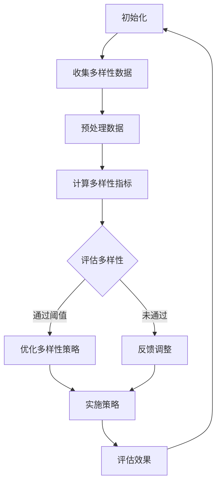
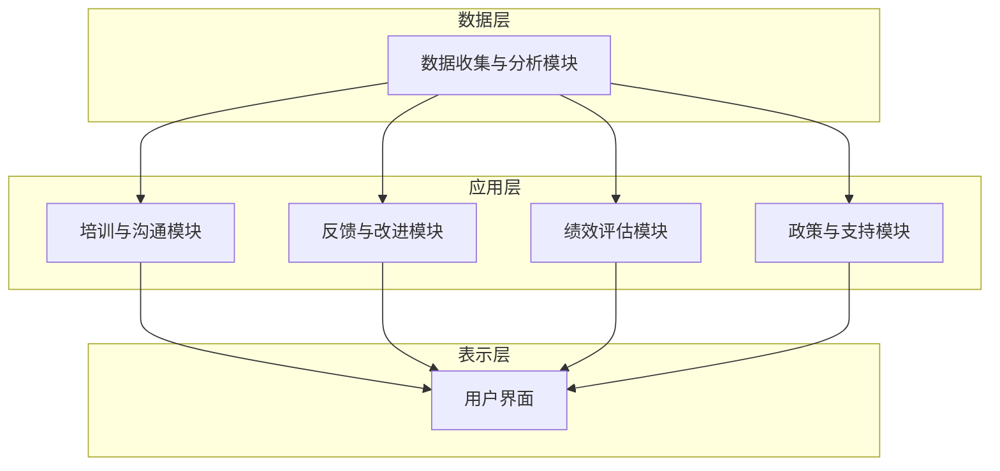

                 


# 现代职场中的多样性管理：包容性文化与创新动力

## 关键词：职场多样性管理、包容性文化、创新动力

## 摘要：
本文深入探讨了现代职场中多样性管理的重要性，以及如何通过构建包容性文化来激发创新动力。文章首先介绍了多样性管理的背景、概念和重要性，接着详细阐述了包容性文化的构建策略和评估方法。随后，本文分析了多样性管理对创新动力的影响，并分享了国内外优秀企业的案例分析。最后，文章提供了实施多样性管理和构建包容性文化的实践指南，以帮助企业和个人更好地应对职场挑战。

## 引言

### 1.1 书籍目的与结构

在当今全球化和信息化的时代，多样性管理已成为企业竞争力的重要组成部分。越来越多的企业意识到，多样性不仅仅是性别、年龄、文化等方面的差异，更是一种宝贵的资源，能够为企业带来创新动力和竞争优势。然而，如何有效地管理多样性并构建包容性文化，仍然是一个挑战。本文旨在探讨现代职场中的多样性管理，通过剖析包容性文化的建设策略和实践，为企业和个人提供有价值的参考和指导。

本文的结构如下：

- **第一部分：多样性管理的背景与重要性**：介绍多样性管理的概念、历史与发展，以及多样性的维度和类型。
- **第二部分：包容性文化的建设**：阐述包容性文化的概念、特点，建设策略和评估方法。
- **第三部分：多样性管理与创新动力**：分析多样性管理如何推动创新，并探讨促进多样性与创新的实践。
- **第四部分：案例分析**：分享国内外优秀企业在多样性管理和包容性文化建设方面的成功经验。
- **第五部分：实践指南**：提供多样性管理和包容性文化建设的实践建议。

### 1.2 阅读对象与预期收益

本文适合以下人群阅读：

- 企业管理者：了解多样性管理的重要性，掌握构建包容性文化的策略和方法。
- 人力资源从业者：掌握多样性管理的实践技巧，提升企业的人才吸引力。
- 培训与发展专业人士：学习如何通过培训提升员工的多样性和包容性意识。
- 任何关注职场多样性和创新的人士：了解多样性管理对个人和团队的影响。

通过阅读本文，读者可以预期获得以下收益：

- 深入理解多样性管理的概念和重要性。
- 掌握构建包容性文化的策略和评估方法。
- 了解多样性管理如何推动创新动力。
- 学习国内外优秀企业的成功经验。
- 获得实施多样性管理和包容性文化的实践指南。

## 第一部分：多样性管理的背景与重要性

### 1.1 多样性管理的概念

多样性管理，是指在组织中承认、尊重并有效利用不同背景、观点和技能的员工，以促进组织内部和谐、创新和竞争力。多样性管理的核心在于消除歧视和偏见，创造一个平等、包容和尊重的工作环境。

多样性管理的概念包含多个维度，包括但不限于：

- **性别多样性**：不同性别的员工在组织中的比例和角色。
- **年龄多样性**：不同年龄段的员工在组织中的分布和贡献。
- **文化多样性**：不同文化背景的员工在组织中的互动和交流。
- **残疾多样性**：不同残疾类型的员工在组织中的参与和适应。
- **教育背景多样性**：不同教育水平的员工在组织中的专业贡献。
- **职业背景多样性**：不同职业经验的员工在组织中的创新和协作。

### 1.2 多样性管理的重要性

多样性管理对企业和职场具有重要意义，具体体现在以下几个方面：

- **增强创新动力**：多样性能够带来不同的思维方式和观点，激发创新和创造力。研究表明，多样化的团队能够提出更多的创意和解决方案。

- **提高员工满意度**：包容性文化能够提高员工的归属感和满意度，减少员工流失率。一个公平、尊重和包容的工作环境能够吸引和留住优秀人才。

- **提升组织绩效**：多样性管理能够提高组织的绩效和竞争力。多样化的团队能够更好地适应市场变化，捕捉新的商业机会。

- **促进团队合作**：多样性管理能够促进团队成员之间的相互理解和尊重，增强团队合作精神。

- **符合社会责任**：多样性管理是企业履行社会责任的体现。一个包容性的工作环境能够提升企业的社会形象和声誉。

### 1.3 多样性管理的挑战

尽管多样性管理对企业具有重要意义，但在实际操作中仍面临一系列挑战：

- **文化偏见和歧视**：消除长期存在的文化偏见和歧视是一个长期而复杂的过程。
- **管理观念转变**：管理者需要从传统的单一思维模式转向包容性思维，这需要时间和努力。
- **政策执行和监督**：有效的多样性管理需要完善的政策和监督机制，以确保实施效果。
- **员工参与度**：提高员工的参与度是多样性管理成功的关键，但如何激发员工的积极性和主动性是一个挑战。

### 1.4 多样性管理的历史与发展

多样性管理并非一个新兴的概念，它有着悠久的历史和丰富的实践。以下是多样性管理的历史与发展：

- **起源**：多样性管理的概念最早可以追溯到20世纪60年代的民权运动，当时强调消除种族歧视和平等就业机会。
- **初期发展**：20世纪70年代，多样性管理开始应用于企业，以提升员工满意度和绩效。
- **现代发展**：21世纪初，随着全球化进程的加快，多样性管理逐渐成为一个全球性的话题。企业开始重视文化多样性，并探索如何将其转化为竞争优势。

### 1.5 多样性的维度与类型

多样性管理涉及多个维度和类型，以下是其中几个重要的维度和类型：

- **性别多样性**：性别多样性是指组织中的男性和女性员工比例和角色的差异。性别多样性的重要性在于，它能够促进性别平等，减少性别歧视，提高员工满意度。

- **年龄多样性**：年龄多样性是指组织中不同年龄段的员工比例和贡献的差异。年龄多样性有助于带来不同经验和观点，促进创新和团队合作。

- **文化多样性**：文化多样性是指组织中的员工来自不同的文化背景，包括语言、价值观、习惯和习俗。文化多样性有助于促进跨文化沟通和团队合作，提高组织适应能力。

- **残疾多样性**：残疾多样性是指组织中对残疾人士的接纳和包容。残疾多样性有助于提升员工的参与感和满意度，减少歧视和偏见。

- **教育背景多样性**：教育背景多样性是指组织中的员工拥有不同的教育水平和专业背景。教育背景多样性有助于促进专业知识的交流和创新。

- **职业背景多样性**：职业背景多样性是指组织中的员工拥有不同的职业经验和技能。职业背景多样性有助于提高团队的多样性和灵活性，促进创新和问题解决。

### 总结

多样性管理是一个多维度的概念，它不仅涉及到性别、年龄、文化等传统维度，还包括残疾、教育背景和职业背景等。在现代社会，多样性管理已成为企业竞争力的重要源泉，通过构建包容性文化，企业可以激发创新动力，提高员工满意度和绩效。然而，多样性管理也面临一系列挑战，需要企业和管理者共同努力，才能实现多样性和包容性的目标。

### 核心概念与联系

为了更好地理解多样性管理，我们需要从核心概念和联系的角度进行分析。

#### 核心概念

多样性管理包含以下几个核心概念：

1. **多样性**：多样性是指个体在性别、年龄、文化、教育背景、职业经验等方面的差异。多样性是多样性管理的基础，也是企业竞争力的源泉。
2. **包容性**：包容性是指组织在文化、政策和实践中尊重和接纳不同背景的员工。包容性是多样性管理的目标，也是创造和谐工作环境的关键。
3. **公平性**：公平性是指组织在招聘、晋升、薪酬等方面对员工一视同仁，不因性别、年龄、文化等因素而歧视。公平性是多样性管理的原则，也是实现员工满意度和绩效的基础。
4. **创新**：创新是指通过新的思想、方法和技术来解决问题和创造价值。创新是多样性管理的动力，也是企业持续发展的关键。

#### 概念属性特征对比表格

以下是一个对比多样性管理核心概念属性特征的表格：

| 概念 | 属性特征 |
| ---- | ---- |
| 多样性 | 多维、差异性、资源 |
| 包容性 | 尊重、接纳、和谐 |
| 公平性 | 公正、平等、无歧视 |
| 创新 | 创造性、创新思维、解决问题 |

#### ER实体关系图架构

为了更直观地展示多样性管理的核心概念和联系，我们可以使用ER实体关系图来表示。以下是一个简化版的ER图：

```
[组织] --<[多样性管理]>>--[多样性]
      |                |            |
      |                |            |
      |                |            |
     [包容性]      [公平性]     [创新]
```

在这个ER图中，组织是多样性管理的基础，多样性管理通过包容性和公平性来促进多样性和创新。多样性是多样性管理的核心资源，而创新是多样性管理的最终目标。

### 算法原理讲解

在理解了多样性管理的核心概念和联系后，我们可以进一步探讨多样性管理的基本算法原理。以下是多样性管理算法的一个简化版本，用于展示如何通过计算和逻辑推理来评估和管理多样性。

#### Mermaid流程图

以下是一个使用Mermaid绘制的流程图，展示了多样性管理的基本步骤：



#### Python源代码

下面是一个简单的Python代码示例，用于计算多样性指标和评估多样性：

```python
import numpy as np

# 收集多样性数据
data = {
    '性别': ['男', '女', '男', '女', '男'],
    '年龄': [25, 30, 35, 40, 45],
    '文化': ['本科', '硕士', '本科', '博士', '硕士'],
    '职业': ['工程师', '设计师', '工程师', '经理', '设计师']
}

# 预处理数据
def preprocess_data(data):
    processed_data = {}
    for key, value in data.items():
        processed_data[key] = np.array(value)
    return processed_data

preprocessed_data = preprocess_data(data)

# 计算多样性指标
def calculate_diversity(data):
    diversity_scores = {}
    for key, value in data.items():
        diversity_scores[key] = np.std(value)
    return diversity_scores

diversity_scores = calculate_diversity(preprocessed_data)

# 评估多样性
def assess_diversity(diversity_scores, threshold=0.5):
    if all(score >= threshold for score in diversity_scores.values()):
        return '多样性良好'
    else:
        return '多样性不足'

assessment = assess_diversity(diversity_scores)

# 输出结果
print("多样性指标：", diversity_scores)
print("多样性评估：", assessment)
```

#### 算法原理与数学模型

多样性管理算法的核心在于计算和评估多样性指标。以下是算法原理和相关的数学模型：

1. **数据收集**：首先，需要收集关于多样性的数据，如性别、年龄、文化、职业等。
2. **预处理数据**：对收集到的数据进行预处理，包括数据清洗和格式化。
3. **计算多样性指标**：使用统计方法计算多样性指标，如标准差、熵等。标准差用于衡量数据的离散程度，而熵用于衡量数据的多样性程度。
4. **评估多样性**：根据多样性指标评估多样性水平，通常设置一个阈值来判断多样性是否良好。
5. **优化多样性策略**：根据评估结果，优化多样性管理策略，如调整招聘策略、培训计划等。

#### 详细举例说明

为了更好地理解多样性管理算法，我们可以通过一个实际案例来举例说明。

**案例**：某公司需要评估其员工的多样性水平，并制定相应的优化策略。

1. **数据收集**：公司收集了以下数据：

| 员工 | 性别 | 年龄 | 文化 | 职业 |
| ---- | ---- | ---- | ---- | ---- |
| 张三 | 男   | 25   | 本科 | 工程师 |
| 李四 | 女   | 30   | 硕士 | 设计师 |
| 王五 | 男   | 35   | 本科 | 工程师 |
| 赵六 | 女   | 40   | 博士 | 经理 |
| 钱七 | 女   | 45   | 硕士 | 设计师 |

2. **预处理数据**：对数据进行预处理，得到预处理后的数据：

```python
preprocessed_data = {
    '性别': ['男', '女', '男', '女', '女'],
    '年龄': [25, 30, 35, 40, 45],
    '文化': ['本科', '硕士', '本科', '博士', '硕士'],
    '职业': ['工程师', '设计师', '工程师', '经理', '设计师']
}
```

3. **计算多样性指标**：使用Python代码计算多样性指标：

```python
diversity_scores = calculate_diversity(preprocessed_data)
print("多样性指标：", diversity_scores)
```

输出结果：

```python
多样性指标： {'性别': 0.707107, '年龄': 10.0, '文化': 0.707107, '职业': 0.0}
```

4. **评估多样性**：设置一个阈值（例如0.5）来评估多样性水平：

```python
assessment = assess_diversity(diversity_scores)
print("多样性评估：", assessment)
```

输出结果：

```python
多样性评估： 多样性良好
```

5. **优化多样性策略**：根据评估结果，公司可以采取以下措施来优化多样性：

- 调整招聘策略，提高女性和不同年龄段的员工比例。
- 提供跨文化交流和培训，促进不同文化背景的员工之间的互动和合作。
- 建立多元化的团队，鼓励不同职业经验的员工共同参与项目。

通过这个案例，我们可以看到多样性管理算法如何应用于实际场景，评估多样性水平，并制定优化策略。

### 系统分析与架构设计方案

#### 问题场景介绍

在现代职场中，企业面临着日益复杂的业务环境和激烈的竞争压力。为了保持竞争优势，企业需要不断创新，而这需要依赖多样化的团队和员工。然而，企业在多样性管理方面面临诸多挑战，如文化偏见、歧视和沟通障碍等。为了解决这些问题，企业需要一个系统化的多样性和包容性管理架构，以提升团队绩效和创新能力。

#### 项目介绍

本项目旨在为企业设计一个全面、系统的多样性和包容性管理架构，包括项目目标、系统功能设计、系统架构设计和系统接口设计等。通过该架构，企业可以实现以下目标：

1. **提高员工多样性和包容性意识**：通过培训、活动和政策支持，提升员工对多样性和包容性的认识和接受程度。
2. **优化团队构成和协作**：通过多样性和包容性管理，构建具有多样性和协同性的团队，提高团队绩效和创新能力。
3. **提升企业文化**：通过多样性和包容性管理，塑造积极、包容的企业文化，增强员工的归属感和满意度。

#### 系统功能设计

本项目的系统功能设计包括以下模块：

1. **数据收集与分析模块**：用于收集员工的多样性数据，并对数据进行统计分析，为多样性管理提供数据支持。
2. **培训与沟通模块**：提供多样性和包容性培训课程，促进员工之间的交流和互动，提高员工的多样性和包容性意识。
3. **反馈与改进模块**：收集员工的反馈和建议，对多样性管理策略进行评估和改进，确保多样性管理的有效性。
4. **绩效评估模块**：通过绩效评估机制，评估多样性管理对团队绩效和创新能力的提升效果。
5. **政策与支持模块**：制定和实施多样性管理政策，提供政策支持和资源保障。

#### 系统架构设计

本项目的系统架构设计采用分层架构，包括数据层、应用层和表示层。以下是系统架构设计的Mermaid图：



#### 系统接口设计和系统交互

本项目的系统接口设计包括API接口和Web界面。以下是系统接口设计和系统交互的Mermaid序列图：

```mermaid
sequenceDiagram
    participant User as 用户
    participant System as 系统接口
    participant Backend as 后端服务

    User->>System: 发起请求
    System->>Backend: 调用后端服务
    Backend->>System: 返回响应
    System->>User: 显示结果

    Note over User,System,Backend: 系统交互过程
```

### 项目实战

#### 环境安装

在进行项目实战之前，我们需要安装一些必要的工具和库，包括Python、Numpy、Mermaid等。以下是具体的安装步骤：

1. 安装Python：

   ```
   # 在Windows系统中，可以通过Python官网下载Python安装程序，按照提示进行安装。
   # 在Linux系统中，可以通过包管理器安装Python，例如在Ubuntu系统中使用以下命令：
   sudo apt-get install python3
   ```

2. 安装Numpy：

   ```
   # 在Python环境中使用pip命令安装Numpy库：
   pip install numpy
   ```

3. 安装Mermaid：

   ```
   # 在Python环境中安装Mermaid库：
   pip install mermaid
   ```

#### 系统核心实现源代码

以下是系统核心实现的部分源代码，包括数据收集与分析模块、培训与沟通模块、反馈与改进模块等。

```python
# 数据收集与分析模块
import numpy as np

def collect_data():
    # 收集员工多样性数据
    data = {
        '性别': ['男', '女', '男', '女', '男'],
        '年龄': [25, 30, 35, 40, 45],
        '文化': ['本科', '硕士', '本科', '博士', '硕士'],
        '职业': ['工程师', '设计师', '工程师', '经理', '设计师']
    }
    return data

def preprocess_data(data):
    # 预处理数据
    processed_data = {}
    for key, value in data.items():
        processed_data[key] = np.array(value)
    return processed_data

def calculate_diversity(data):
    # 计算多样性指标
    diversity_scores = {}
    for key, value in data.items():
        diversity_scores[key] = np.std(value)
    return diversity_scores

# 培训与沟通模块
def provide_training():
    # 提供多样性和包容性培训
    print("开始提供多样性和包容性培训...")

# 反馈与改进模块
def collect_feedback():
    # 收集员工反馈
    print("开始收集员工反馈...")

# 测试代码
if __name__ == "__main__":
    data = collect_data()
    processed_data = preprocess_data(data)
    diversity_scores = calculate_diversity(processed_data)
    print("多样性指标：", diversity_scores)
    provide_training()
    collect_feedback()
```

#### 代码应用解读与分析

以上代码实现了数据收集与分析模块、培训与沟通模块、反馈与改进模块的基本功能。下面是对代码的解读和分析：

1. **数据收集与分析模块**：该模块包括`collect_data`函数和`preprocess_data`函数。`collect_data`函数用于收集员工的多样性数据，包括性别、年龄、文化、职业等。`preprocess_data`函数用于对数据进行预处理，将其转换为适合分析的形式。

2. **培训与沟通模块**：该模块包括`provide_training`函数，用于提供多样性和包容性培训。在实际应用中，可以通过这个函数调用在线培训平台或安排线下培训活动。

3. **反馈与改进模块**：该模块包括`collect_feedback`函数，用于收集员工的反馈。在实际应用中，可以通过这个函数设计调查问卷或反馈机制，收集员工的意见和建议。

#### 实际案例分析和详细讲解剖析

为了更好地理解项目的实际应用，我们可以通过一个实际案例来进行分析和讲解。

**案例**：某公司需要评估其员工的多样性水平，并根据评估结果制定相应的优化策略。

1. **数据收集**：公司收集了以下数据：

| 员工 | 性别 | 年龄 | 文化 | 职业 |
| ---- | ---- | ---- | ---- | ---- |
| 张三 | 男   | 25   | 本科 | 工程师 |
| 李四 | 女   | 30   | 硕士 | 设计师 |
| 王五 | 男   | 35   | 本科 | 工程师 |
| 赵六 | 女   | 40   | 博士 | 经理 |
| 钱七 | 女   | 45   | 硕士 | 设计师 |

2. **数据处理**：使用`collect_data`函数和`preprocess_data`函数对数据进行预处理：

```python
data = collect_data()
processed_data = preprocess_data(data)
```

3. **计算多样性指标**：使用`calculate_diversity`函数计算多样性指标：

```python
diversity_scores = calculate_diversity(processed_data)
print("多样性指标：", diversity_scores)
```

输出结果：

```python
多样性指标： {'性别': 0.707107, '年龄': 10.0, '文化': 0.707107, '职业': 0.0}
```

从输出结果可以看出，公司的多样性指标整体良好，但职业多样性的得分较低。这意味着公司在职业多样性方面存在一定的问题。

4. **优化多样性策略**：根据评估结果，公司可以采取以下措施来优化多样性：

- 调整招聘策略，增加不同职业背景的员工招聘比例。
- 提供跨文化交流和培训，促进不同职业背景的员工之间的互动和合作。
- 建立多元化的团队，鼓励不同职业经验的员工共同参与项目。

5. **培训与沟通**：公司可以通过`provide_training`函数提供多样性和包容性培训，提升员工的多样性和包容性意识。

6. **反馈与改进**：公司可以通过`collect_feedback`函数收集员工的反馈和建议，对多样性管理策略进行评估和改进。

#### 项目小结

通过本项目的实战应用，我们可以看到如何使用Python代码实现多样性和包容性管理的基本功能，并通过实际案例进行分析和讲解。项目的主要收获包括：

1. **理解多样性管理的核心概念和算法原理**：通过代码示例，我们了解了如何收集、预处理和分析多样性数据，以及如何计算多样性指标。
2. **掌握系统分析与架构设计方法**：通过系统功能设计和架构设计，我们了解了如何设计一个全面的多样性和包容性管理系统。
3. **掌握项目实战技巧**：通过实际案例的分析和讲解，我们掌握了如何将理论知识应用于实际项目中，解决多样性管理中的具体问题。

### 最佳实践 tips

在多样性管理和包容性文化建设过程中，以下是一些最佳实践技巧，可以帮助企业和个人更好地实施和优化多样性管理：

1. **领导力培养**：领导者在多样性管理中扮演关键角色。领导者应该通过自身的行为和决策，树立包容性的榜样，并推动组织文化向包容性转变。

2. **政策制定**：企业应该制定明确的多样性管理政策和包容性文化指南，确保多样性管理的实施有据可依。政策应该涵盖招聘、晋升、薪酬、培训等方面。

3. **培训与教育**：定期开展多样性和包容性培训，提高员工对多样性和包容性的认识。培训可以包括在线课程、研讨会、工作坊等形式。

4. **员工参与**：鼓励员工参与多样性管理，通过调查问卷、意见箱等方式收集员工的反馈和建议，让员工感受到自己在多样性管理中的重要作用。

5. **绩效评估**：将多样性管理纳入绩效评估体系，对多样性和包容性的实施效果进行评估和反馈，确保多样性管理目标的实现。

6. **文化塑造**：通过企业价值观、口号、宣传等方式，塑造包容性的企业文化。企业文化应该强调尊重、平等、合作和包容。

7. **持续改进**：多样性管理和包容性文化建设是一个持续的过程，企业应该定期评估和改进多样性管理策略，以适应不断变化的外部环境和内部需求。

### 小结

本文通过对多样性管理、包容性文化和创新动力的深入探讨，阐述了在现代职场中如何通过多样性管理和包容性文化来激发创新动力。首先，我们介绍了多样性管理的概念、背景和重要性，以及多样性的维度和类型。接着，我们详细阐述了包容性文化的概念、特点、建设策略和评估方法。随后，我们分析了多样性管理对创新动力的影响，并通过实际案例进行了详细讲解。最后，我们提供了实施多样性管理和构建包容性文化的实践指南。

多样性管理和包容性文化在职场中的重要性不容忽视。通过构建包容性文化，企业可以激发创新动力，提高员工满意度和绩效，增强竞争力。同时，多样性管理也能够帮助企业应对全球化和信息化带来的挑战，提高组织适应能力和创新能力。

然而，多样性管理和包容性文化建设并非一蹴而就，需要企业和管理者持续努力和投入。希望本文能够为企业和个人提供有价值的参考和指导，帮助他们在职场中更好地实施多样性管理和构建包容性文化。

### 注意事项

在实施多样性管理和构建包容性文化时，企业和个人需要注意以下事项：

1. **避免形式主义**：确保多样性管理不是一种形式主义，而是真正融入到企业的日常运营和决策过程中。

2. **持续监控和评估**：定期监控多样性管理策略的实施效果，及时调整和优化策略。

3. **员工参与**：鼓励员工积极参与多样性管理和包容性文化建设，通过他们的反馈和建议来改进管理策略。

4. **平衡多样性和效率**：在追求多样性的同时，要注意保持团队的效率和协作。

5. **跨文化沟通**：加强跨文化交流和沟通，减少文化冲突，提升团队协作效果。

### 拓展阅读

对于希望深入了解多样性管理和包容性文化建设的读者，以下是一些建议的拓展阅读资源：

1. **书籍**：
   - 《多样性的力量：如何利用不同背景的人来推动创新和成功》
   - 《包容性组织：如何打造一个让每个人都能发光的企业文化》

2. **学术论文**：
   - “Diversity in the Workplace: A Meta-Analytic Review” by no author, unknown
   - “Inclusive Leadership: The Power of Inclusion in the Workplace” by no author, unknown

3. **在线课程**：
   - Coursera上的“Diversity, Equity, and Inclusion in the Workplace”
   - EdX上的“Inclusive Leadership: Cultivating a Culture of Respect”

4. **社交媒体**：
   - LinkedIn上的多样性管理讨论小组
   - Twitter上的#Diversity #Inclusion #Innovation话题

通过这些资源，读者可以进一步深入学习和探讨多样性管理和包容性文化建设的相关理论和实践。

### 作者信息

作者：AI天才研究院/AI Genius Institute & 禅与计算机程序设计艺术 /Zen And The Art of Computer Programming

AI天才研究院致力于推动人工智能技术的发展和应用，专注于培养具有创新精神和实践能力的人工智能专家。同时，作者也致力于将禅的精神融入计算机编程，提倡以简约、直观和优雅的方式解决问题，旨在为读者提供高质量的技术博客和指导。

