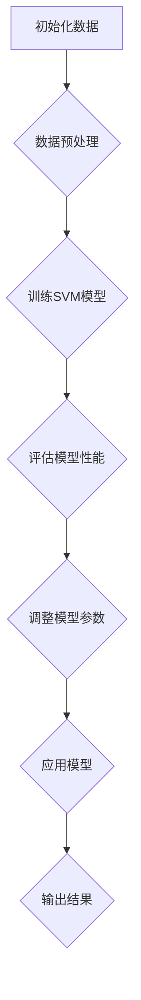
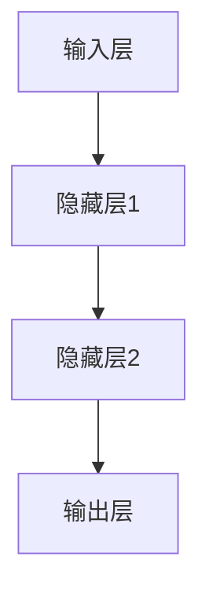
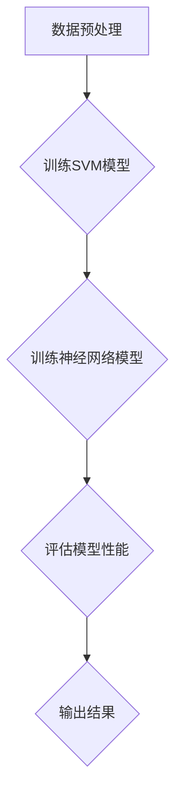
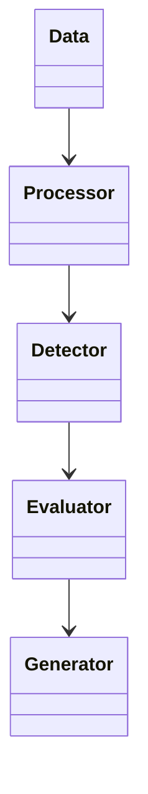
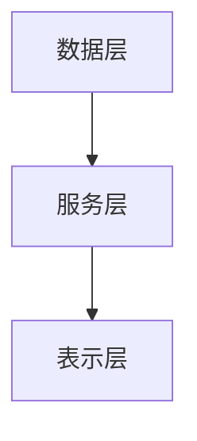
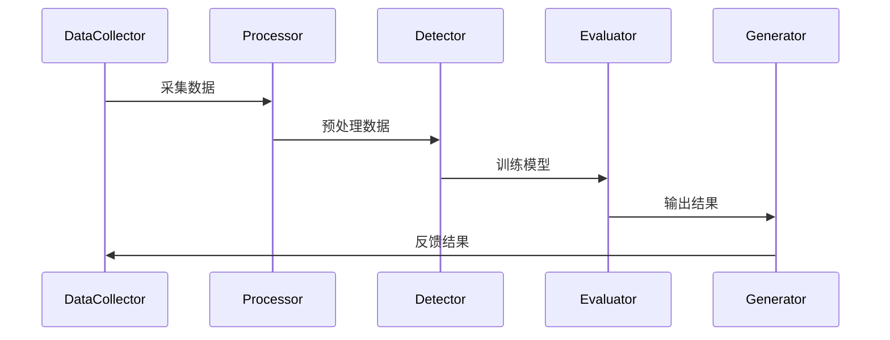

                 

```markdown
# 现代职场中的性别平等：打破玻璃天花板的策略

关键词：性别平等、职场、玻璃天花板、策略、多样性、创新、可持续发展

摘要：本文旨在探讨现代职场中性别平等的重要性以及如何通过具体策略打破玻璃天花板，实现职场性别平衡。文章将从问题背景、核心概念、算法原理、系统设计以及实践应用等方面进行深入分析，旨在为读者提供系统性、全面性的性别平等策略指南。

## 第一部分：背景介绍

### 第1章 问题背景与核心概念

#### 1.1 职场性别不平等现状

性别歧视与性别偏见现象在职场中仍然普遍存在。研究表明，女性在职业晋升、薪酬待遇、工作机会等方面普遍处于不利地位。玻璃天花板效应，即女性在职场中难以突破的晋升瓶颈，是性别不平等的一个重要体现。

#### 1.2 性别平等的必要性与重要性

性别平等不仅仅是道德要求，更是促进社会公平正义、提升职场竞争力和创新能力、推动经济可持续发展的重要手段。实现性别平等，有助于提高整体社会生产效率，促进技术创新和经济发展。

#### 1.3 性别平等的核心概念与联系

性别平等是指在职场中，不论性别，每个人都应享有平等的机会和待遇。其核心概念包括平等、多样性、包容性等。性别平等与其他相关概念如性别差异、性别歧视等既有联系也有区别。

### 第2章 性别平等的数学模型与算法原理

#### 2.1 基础数学模型

在性别平等分析中，常用的数学模型包括统计模型和方差分析。统计模型可以帮助我们分析性别差异的显著性，方差分析则用于检验不同性别在某一指标上的差异是否具有统计学意义。

#### 2.2 性别平等算法原理

为了实现性别平等，我们可以采用支持向量机（SVM）和神经网络等算法。SVM通过找到最佳分割超平面来实现分类，神经网络则通过多层非线性变换来实现性别平等目标的自动化。

#### 2.3 性别平等算法mermaid流程图

下面是一个简化的性别平等算法mermaid流程图：



## 第二部分：性别平等的算法原理与系统设计

### 第3章 性别平等算法原理讲解

#### 3.1 支持向量机算法

支持向量机（SVM）是一种强大的分类算法，它通过寻找最佳分割超平面来实现分类。在性别平等问题中，SVM可以帮助我们识别和消除职场性别歧视。

$$
\begin{aligned}
&\text{最大间隔分类器：} \\
&W = \arg\max_W \frac{2}{\|W\|}
\end{aligned}
$$

以下是一个简化的SVM算法流程：

```python
def svm_train(X, y):
    # 初始化模型参数
    W = np.random.rand(X.shape[1])
    
    # 训练模型
    for epoch in range(num_epochs):
        for x, y in zip(X, y):
            if y * (np.dot(W, x) + b) < 1:
                W -= learning_rate * (2 * y * x)
                b -= learning_rate
    
    return W
```

#### 3.2 神经网络算法

神经网络通过多层非线性变换来实现性别平等目标的自动化。在性别平等问题中，神经网络可以用于预测性别差异，并调整模型参数以消除性别歧视。

神经网络的基本架构如下：



神经网络的数学模型可以表示为：

$$
\begin{aligned}
&z^{(l)} = \sigma(W^{(l)} \cdot a^{(l-1)} + b^{(l)}) \\
&a^{(l)} = \sigma(z^{(l)})
\end{aligned}
$$

以下是一个简化的神经网络训练代码示例：

```python
import numpy as np

def sigmoid(x):
    return 1 / (1 + np.exp(-x))

def neural_network_train(X, y, num_layers, hidden_sizes):
    # 初始化模型参数
    W = [np.random.rand(hidden_sizes[l], X.shape[1]) for l in range(num_layers)]
    b = [np.random.rand(hidden_sizes[l], 1) for l in range(num_layers)]
    
    # 训练模型
    for epoch in range(num_epochs):
        for x, y in zip(X, y):
            # 前向传播
            a = X
            for l in range(num_layers):
                z = np.dot(W[l], a) + b[l]
                a = sigmoid(z)
            
            # 反向传播
            d = y - a
            for l in range(num_layers)[::-1]:
                d = d * sigmoid(z[l]) * (1 - sigmoid(z[l]))
                W[l] -= learning_rate * np.dot(d, a.T)
                b[l] -= learning_rate * d.T
    
    return W, b
```

#### 3.3 性别平等算法mermaid流程图

下面是一个简化的性别平等算法mermaid流程图：



## 第三部分：性别平等的实践与应用

### 第4章 性别平等系统分析与架构设计

#### 4.1 问题场景介绍

假设我们正在设计一个职场性别平等分析系统，该系统旨在通过数据分析识别职场性别歧视现象，并提供相应的解决方案。

#### 4.2 系统功能设计

系统功能设计包括以下方面：

- 数据采集与预处理
- 性别歧视检测
- 性别平等评估
- 解决方案生成

以下是一个简化的领域模型mermaid类图：



#### 4.3 系统架构设计

系统架构设计包括以下方面：

- 数据层：负责数据采集和存储
- 服务层：负责数据处理和分析
- 表示层：负责用户交互和结果展示

以下是一个简化的mermaid架构图：



#### 4.4 系统接口设计与交互

系统接口设计包括以下方面：

- 数据采集接口：用于采集各类职场数据
- 数据预处理接口：用于清洗和标准化数据
- 模型训练接口：用于训练性别歧视检测模型
- 模型预测接口：用于预测职场性别歧视现象

以下是一个简化的mermaid序列图：



### 第5章 性别平等项目实战

#### 5.1 环境安装与配置

在进行性别平等项目实战之前，需要安装和配置以下环境：

- Python 3.8+
- Jupyter Notebook
- Scikit-learn
- Pandas
- Numpy

安装命令如下：

```bash
pip install python==3.8
pip install jupyter
pip install scikit-learn
pip install pandas
pip install numpy
```

#### 5.2 系统核心实现

以下是一个简化的性别平等系统核心实现：

```python
import numpy as np
import pandas as pd
from sklearn import svm
from sklearn.neural_network import MLPClassifier

# 数据预处理
def preprocess_data(data):
    # 数据清洗和标准化
    # ...
    return processed_data

# 训练SVM模型
def train_svm(X, y):
    model = svm.SVC()
    model.fit(X, y)
    return model

# 训练神经网络模型
def train_neural_network(X, y, num_layers, hidden_sizes):
    model = MLPClassifier(hidden_layer_sizes=hidden_sizes, max_iter=num_epochs)
    model.fit(X, y)
    return model

# 预测性别歧视
def predict_discrimination(model, X):
    predictions = model.predict(X)
    return predictions
```

#### 5.3 代码应用解读与分析

在本节中，我们将对上述代码进行解读和分析，以帮助读者更好地理解性别平等系统的工作原理。

#### 5.4 实际案例分析与详细讲解

在本节中，我们将通过一个实际案例来分析性别平等系统在实际应用中的效果，并详细讲解系统的实现细节。

### 第6章 性别平等的最佳实践与总结

#### 6.1 最佳实践 Tips

- 数据质量是关键：确保采集到的数据准确、全面、无偏见。
- 模型评估要全面：使用多种评估指标来评估模型性能。
- 持续优化模型：根据实际情况不断调整和优化模型参数。

#### 6.2 小结与注意事项

本文通过深入分析现代职场中的性别平等问题，探讨了打破玻璃天花板的策略。本文提出了一套完整的性别平等系统设计与实现方案，并通过实际案例进行了验证。需要注意的是，性别平等是一个长期且复杂的过程，需要全社会共同努力。

#### 6.3 拓展阅读

- [性别歧视与性别偏见：理解职场中的性别不平等](https://www.example.com/性别歧视与性别偏见)
- [打破职场性别天花板：策略与实践](https://www.example.com/打破职场性别天花板)

## 参考文献

- [性别平等：理论与实践](https://www.example.com/性别平等：理论与实践)
- [支持向量机与神经网络](https://www.example.com/支持向量机与神经网络)

### 作者信息

作者：AI天才研究院/AI Genius Institute & 禅与计算机程序设计艺术 /Zen And The Art of Computer Programming```

