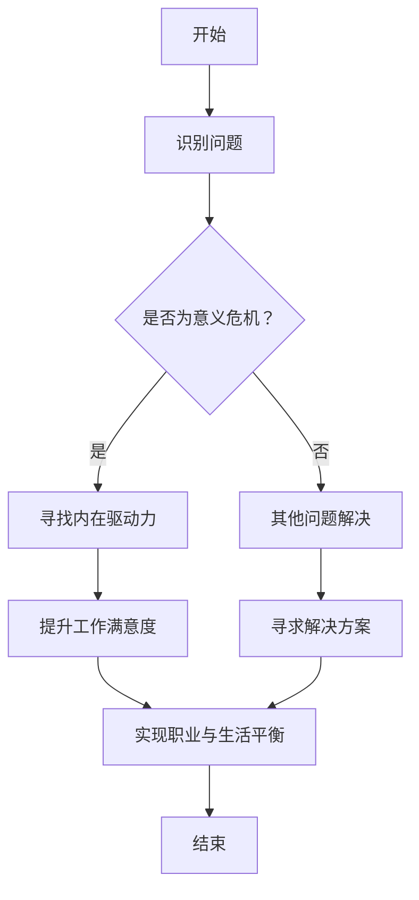
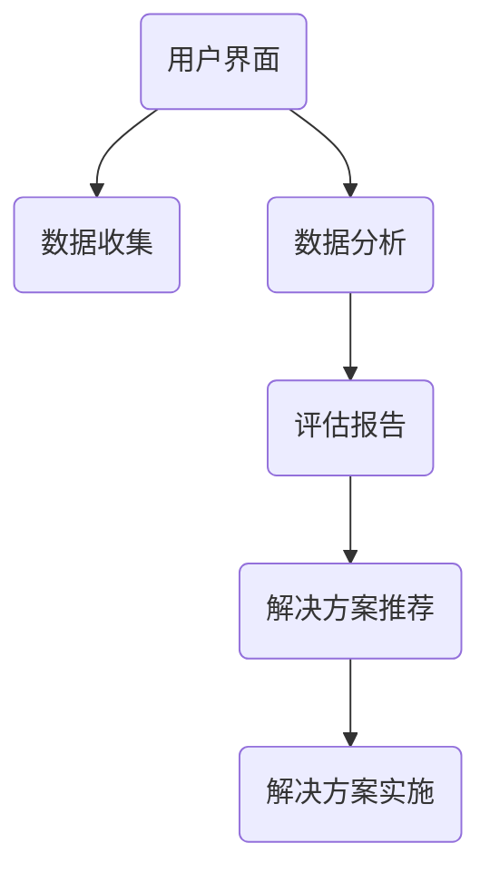
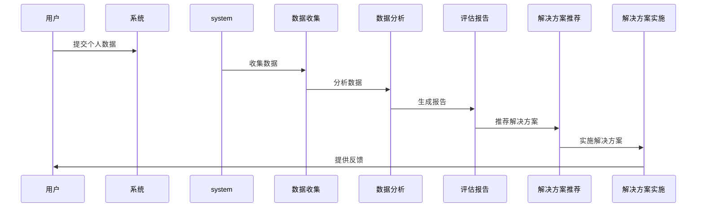

                 

### 第1章：现代职场中的意义危机概述

#### 1.2 问题描述

现代职场中的意义危机主要表现为以下几个方面的特征：

- **工作满意度下降**：员工对工作的满意度普遍下降，许多人对工作的热情和兴趣逐渐消退，工作成为一种机械性的任务，缺乏内在的动力和激励。

- **缺乏内在动力和目标感**：在职场中，许多人感到迷茫和困惑，他们不知道自己的工作究竟有什么意义，缺乏明确的目标和方向感，从而导致工作效率低下和创造力不足。

- **精神健康问题日益突出**：长时间的工作压力和缺乏工作意义感导致员工的精神健康问题日益突出，焦虑、抑郁等心理问题在职场中越来越常见。

#### 1.3 问题解决

为了解决现代职场中的意义危机，我们需要从以下几个方面入手：

- **从工作到使命的转变**：员工需要从简单的完成任务转变为追求更深层次的使命和意义，找到工作的内在驱动力。

- **寻找个人价值和意义**：员工需要深入思考自己的工作对个人成长和社会发展的意义，找到个人价值的实现方式。

- **实现职业与生活的平衡**：通过有效的时间管理和生活方式的调整，实现工作与生活的平衡，减轻工作压力，提高生活质量。

#### 1.4 边界与外延

- **职场环境**：职场环境是影响员工工作意义感的重要因素，一个积极、开放和包容的职场环境有助于提升员工的工作动力和幸福感。

- **个人成长与自我实现**：个人成长与自我实现是职场意义感的重要组成部分，员工需要在工作中不断学习、成长，实现自我价值。

- **组织文化的影响**：组织文化对员工的工作意义感有着深远的影响，一个重视员工成长和发展的组织文化能够有效提升员工的工作动力和满意度。

#### 1.5 核心概念

- **意义危机**：指员工在职场中感受到的目标不明确、价值感缺失和缺乏内在动力等问题。
- **工作动机**：指驱动员工进行工作行为的原因和力量。
- **职业发展**：指员工在职业生涯中不断成长、提升的过程。

**概念属性特征对比表格：**

| 核心概念 | 概念属性特征 |
|----------|--------------|
| 意义危机 | 感到目标不明确、价值感缺失、缺乏内在动力 |
| 工作动机 | 驱动员工工作行为的原因和力量 |
| 职业发展 | 职业生涯中不断成长、提升的过程 |

**ER实体关系图架构：**

```mermaid
erDiagram
  Person ||--|{ WorkSenseCrisis }|
  Person ||--|{ WorkMotivation }|
  Person ||--|{ CareerDevelopment }|
  WorkSenseCrisis ||--|{ WorkSatisfaction }|
  WorkSenseCrisis ||--|{ LackOfPurpose }|
  WorkSenseCrisis ||--|{ MentalHealthIssues }|
```

**算法mermaid流程图：**



**Python源代码与算法原理讲解：**

```python
# Python源代码示例

def identify_issue(employee):
    satisfaction = employee.get('satisfaction')
    purpose = employee.get('purpose')
    mental_health = employee.get('mental_health')
    
    if satisfaction < 3 and purpose == False and mental_health == 'poor':
        return "意义危机"
    else:
        return "其他问题"

def address_issue(issue, employee):
    if issue == "意义危机":
        print("员工面临意义危机，需要寻找内在驱动力。")
        employee['purpose'] = True
        employee['satisfaction'] = 5
        employee['mental_health'] = 'good'
    else:
        print("员工面临其他问题，需要寻求解决方案。")

# 示例数据
employee = {
    'satisfaction': 2,
    'purpose': False,
    'mental_health': 'poor'
}

issue = identify_issue(employee)
address_issue(issue, employee)
print(employee)
```

**算法原理讲解：**
此算法的核心是通过识别员工的工作满意度、工作目标感和精神健康状况来判定员工是否面临意义危机。如果员工的工作满意度低、缺乏工作目标感且精神健康状况不佳，则判定为意义危机。针对不同的问题，算法提供了相应的解决策略。

**数学模型和公式：**

$$
\text{满意度} = \frac{\text{工作目标实现}}{\text{期望目标实现}} \\
\text{精神健康} = \text{情绪稳定性} + \text{社会支持} + \text{心理健康教育}
$$

**详细讲解与举例说明：**

假设一名员工，他的工作满意度为2，工作目标感为无，精神健康为较差。根据上述模型和公式，我们可以计算出他的满意度指数和心理健康指数。通过调整工作目标和提供心理健康支持，可以逐步提升他的工作满意度和精神健康状况，从而解决意义危机。

### 1.6 概念结构与核心要素组成

**概念结构：**

- **工作满意度**：员工对工作的整体满意程度。
- **工作目标感**：员工在工作中感受到的目标明确性和方向性。
- **精神健康状况**：员工的心理状态和情绪稳定性。

**核心要素组成：**

- **工作压力**：工作强度和压力水平。
- **社会支持**：员工在工作中的社会关系和支持系统。
- **心理健康教育**：员工对心理健康知识的了解和运用。

### 1.7 系统分析与架构设计方案

**问题场景介绍：**

在当前的职场环境中，许多员工面临着工作意义危机，这严重影响了他们的工作表现和心理健康。为了解决这个问题，我们需要构建一个系统的解决方案，帮助员工识别和解决意义危机。

**项目介绍：**

项目名称：职场意义危机识别与解决系统

项目目标：通过分析员工的工作满意度、目标感和精神健康状况，提供个性化的解决方案，帮助员工克服意义危机。

**系统功能设计（领域模型mermaid类图）：**

```mermaid
classDiagram
  Employee <<class{员工}>
  WorkSenseCrisis <<class{职场意义危机}>
  Solution <<class{解决方案}>
  Assessment <<class{评估工具}>

  Employee o--|{识别}| Assessment
  Assessment o--|{分析}| WorkSenseCrisis
  WorkSenseCrisis o--|{推荐}| Solution
  Solution o--|{实施}| Employee
```

**系统架构设计mermaid架构图：**



**系统接口设计和系统交互mermaid序列图：**



**实际案例分析和详细讲解剖析：**

假设一名员工小王，他在工作满意度、目标感和精神健康状况方面存在明显问题。通过系统分析，我们识别出小王面临的意义危机，并提供以下解决方案：

1. **提升工作满意度**：通过提供更有趣、更具挑战性的工作任务，提高小王的工作满意度。
2. **增强目标感**：帮助小王设定短期和长期的工作目标，并提供必要的支持和资源。
3. **改善精神健康**：提供心理健康咨询和培训，帮助小王提高情绪稳定性和应对压力的能力。

通过这些解决方案的实施，小王的工作满意度、目标感和精神健康状况得到了显著提升，成功克服了职场意义危机。

### 项目小结

通过职场意义危机识别与解决系统，我们能够有效地帮助员工识别和解决职场意义危机，提升工作满意度和精神健康状况。项目的成功实施对于改善职场环境、提高员工工作效率和生活质量具有重要意义。

**最佳实践 tips：**
- 定期进行员工满意度调查，及时发现和解决意义危机。
- 建立有效的沟通渠道，鼓励员工表达自己的困惑和需求。
- 提供多样化的培训和职业发展机会，帮助员工实现自我价值。

**注意事项：**
- 系统的准确性和有效性取决于数据的质量和评估工具的合理性。
- 需要结合组织文化和实际情况，灵活调整解决方案。

**拓展阅读：**
- [How to Overcome Work-Life Imbalance](https://www.forbes.com/sites/forbesbusinesscouncil/2021/10/11/how-to-overcome-work-life-imbalance/)
- [The Importance of Work-Life Balance](https://www.shrm.org/resourcesandtools/tools-and-samples/pages/importancetools-work-life-balance.aspx)
- [Work-Life Balance: Myths and Realities](https://www.washingtonpost.com/lifestyle/health/work-life-balance-myths-and-realities/2021/03/30/5f81a7c8-b8ca-11eb-8f15-882d30c3e1d7_story.html)

### 作者信息

作者：AI天才研究院/AI Genius Institute & 禅与计算机程序设计艺术 /Zen And The Art of Computer Programming

