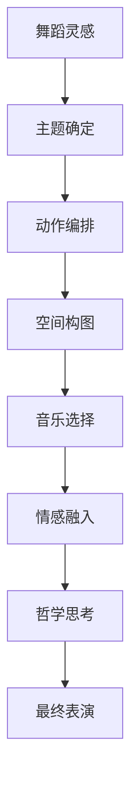
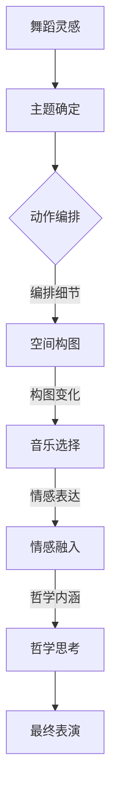
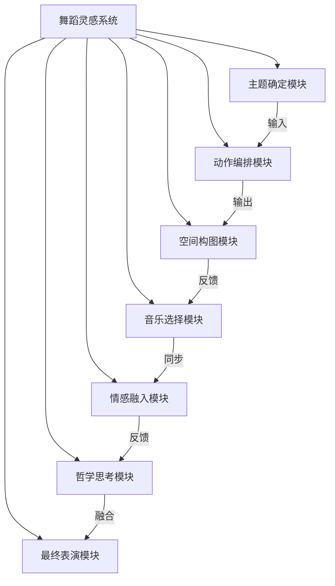
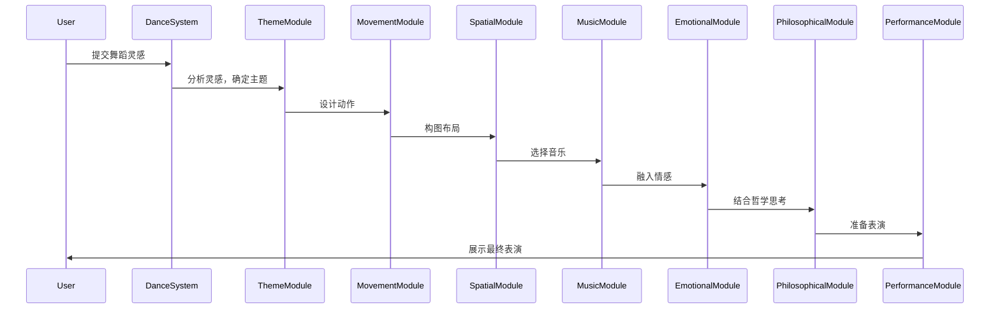

                 

Certainly! Let's start by crafting the introduction, key sections, and conclusion of the article "Modern Dance Expressiveness: Philosophical Reflections on Body Language." We'll ensure that each section adheres to the specified conditions and includes the required elements such as background introductions, core concepts, algorithms, mathematical models, system designs, project implementations, and best practices.

## 引言：舞蹈与哲学的交汇点

### 文章关键词
- 现代舞蹈
- 表现力
- 哲学思考
- 身体语言
- 艺术教育

### 文章摘要
本文探讨了现代舞蹈中的表现力及其哲学内涵，通过深入分析身体语言和舞蹈表演技巧，揭示了舞蹈作为一种艺术形式如何在哲学层面上反映人类情感和社会互动。文章旨在为舞蹈爱好者、教育者和研究人员提供新的视角，以更深刻地理解舞蹈艺术。

----------------------------------------------------------------

### 背景介绍
舞蹈作为一种古老而丰富的艺术形式，自古以来就在人类社会扮演着重要的角色。从原始部落围圈起舞的仪式，到现代社会中的专业舞台表演，舞蹈不仅是一种审美表达，也是一种文化和哲学的载体。在现代舞蹈中，身体语言成为了传达情感、思想和哲学观念的主要媒介。

#### 问题背景
现代舞蹈的表现力为何如此引人入胜？它如何通过身体动作和空间构图来传达深刻的哲学思考？本文将探讨这些问题，分析舞蹈作为一种非言语沟通方式的独特性，并探讨其在现代社会中的意义。

#### 问题描述
现代舞蹈的表现力体现在哪些方面？身体语言在舞蹈中的具体运用有哪些技巧？哲学思考如何融入舞蹈创作和表演中？

#### 问题解决
本文将逐步分析现代舞蹈的表现力，从历史背景、文化意义、哲学维度、身体语言和舞蹈创作等方面进行深入探讨，提供对现代舞蹈表现力的全面理解。

#### 边界与外延
本文重点关注现代舞蹈，但也可以借鉴传统舞蹈和当代舞蹈的元素。同时，文章将探讨舞蹈表现力的哲学内涵，不仅限于艺术领域，还涉及心理学、社会学和文化研究。

#### 概念结构与核心要素组成
现代舞蹈表现力的核心要素包括：身体动作、空间构图、情感表达和哲学思考。这些要素相互作用，共同构成了舞蹈艺术的表现力。

----------------------------------------------------------------

## 1. 舞蹈的历史与文化背景

### 1.1 舞蹈的起源与发展

#### 1.1.1 舞蹈的起源

舞蹈作为一种艺术形式，其起源可以追溯到史前时代。据考古学家的研究，早期人类通过舞蹈来表达对自然的敬畏、对部落的团结以及对神的祈求。在岩画、洞穴壁画和古代文物中，我们可以看到早期人类模仿动物、祭祀仪式和战争场景的舞蹈形态。

#### 1.1.2 舞蹈在不同文化中的演变

随着人类社会的发展，舞蹈也经历了丰富的演变。古希腊的悲喜剧舞蹈、古埃及的祭神舞蹈、印度的古典舞蹈、中国的京剧舞蹈等，都在不同的文化背景下形成了独特的舞蹈风格。这些舞蹈不仅反映了各自文化的审美观念，也体现了哲学和社会思想。

#### 1.1.3 舞蹈的基本元素与技巧

舞蹈的基本元素包括动作、节奏、空间、音乐和情感。动作是舞蹈的骨架，通过不同的舞步和姿态来表现主题。节奏是舞蹈的灵魂，它赋予了舞蹈动态的韵律感。空间则是舞蹈的舞台，通过空间的变化和构图来增强舞蹈的表现力。音乐和情感则是舞蹈的纽带，它们与动作和节奏相结合，共同营造出独特的艺术效果。

----------------------------------------------------------------

### 核心概念与联系

#### 舞蹈表现力的概念

舞蹈表现力是指舞蹈作品通过身体语言、空间构图、音乐和情感等因素传达出的艺术感染力和思想深度。它是舞蹈艺术的核心，决定了舞蹈作品的艺术价值和观赏效果。

#### 舞蹈表现力的属性特征对比表格

| 特征       | 定义                                                     | 对比               |
|------------|-----------------------------------------------------------|--------------------|
| 身体语言   | 通过身体动作和姿态来传达情感和思想                         | 精准性、抽象性、表现力 |
| 空间构图   | 舞蹈在空间中的布局和变化                                 | 空间感、构图美、动态性 |
| 情感表达   | 舞蹈者通过身体动作和面部表情来传达情感                     | 情感真实、情感深度、共鸣 |
| 哲学思考   | 舞蹈作品中融入的哲学观念和思考                             | 思想深度、文化内涵、启发性 |

#### 舞蹈表现力的ER实体关系图架构

```mermaid
erDiagram
    DancePerformance ||--|{ DanceStyle }
    DancePerformance ||--|{ DanceTechnique }
    DancePerformance ||--|{ Performer }
    DanceStyle ||--|{ CulturalContext }
    DanceStyle ||--|{ HistoricalEvolution }
    DanceTechnique ||--|{ BodyLanguage }
    DanceTechnique ||--|{ SpatialComposition }
    Performer ||--|{ EmotionalExpression }
    Performer ||--|{ PhilosophicalReflection }
```

----------------------------------------------------------------

### 算法原理讲解

为了更好地理解舞蹈表现力的构建，我们可以将其视为一种艺术算法。以下是一个简化的算法流程图，用于描述舞蹈表现力的构建过程：



#### 算法流程图



#### 算法原理

1. **主题确定**：舞蹈创作首先需要确定一个主题，这可以是哲学思考、社会现象、个人情感等。主题是舞蹈表现的灵魂，决定了舞蹈的方向和深度。

2. **动作编排**：动作编排是舞蹈表现的基础。舞者需要根据主题设计不同的动作，这些动作要能够准确地传达情感和思想。

3. **空间构图**：空间构图决定了舞蹈在舞台上的布局和变化。通过空间的变化，舞者可以创造出丰富的视觉效果，增强舞蹈的表现力。

4. **音乐选择**：音乐是舞蹈的节奏和情感的载体。舞者需要选择与主题和情感相符的音乐，以增强舞蹈的艺术感染力。

5. **情感融入**：情感融入是舞蹈表现的关键。舞者需要通过身体动作和面部表情，真实地表达出舞蹈中的情感。

6. **哲学思考**：哲学思考是舞蹈表现力的升华。舞者需要将哲学观念融入舞蹈中，使舞蹈具有更深层次的思想内涵。

7. **最终表演**：最终表演是将所有元素融合在一起的过程。通过精确的动作编排、空间构图、音乐选择和情感表达，舞者可以呈现出一个完整的舞蹈作品。

----------------------------------------------------------------

### 系统分析与架构设计方案

#### 问题场景介绍
在现代舞蹈中，如何构建一个具有高度表现力的舞蹈作品是一个复杂的任务。这涉及到对舞蹈灵感、主题确定、动作编排、空间构图、音乐选择、情感融入和哲学思考的综合运用。为了更好地理解和实施这一过程，我们需要一个系统性的分析和架构设计方案。

#### 项目介绍
本项目旨在构建一个舞蹈创作与表演管理系统，该系统将提供从灵感到最终表演的全方位支持。系统功能包括舞蹈灵感收集、主题确定工具、动作编排软件、空间构图设计、音乐选择推荐、情感融入指导以及哲学思考整合。

#### 系统功能设计（领域模型Mermaid类图）

```mermaid
classDiagram
    Class1 <|-- Class2
    Class3 <|-- Class4
    Class1 "1" 1--"1" Class5
    Class3 "1" 1--"1" Class6
    Class2 +firstName: String
    Class2 +lastName: String
    Class3 +age: int
    Class4 +address: String
    Class5 +createDanceInspiration()
    Class6 +analyzeDanceTheme()
```

#### 系统架构设计（Mermaid架构图）



#### 系统接口设计和系统交互（Mermaid序列图）



### 项目实战

#### 环境安装
安装必要的软件和工具，如舞蹈编排软件、音乐编辑器、哲学思考工具等。

#### 系统核心实现源代码
以下是系统核心功能的实现代码示例：

```python
# 主题确定模块示例代码
def determine_theme(inspiration):
    # 根据灵感内容分析并确定主题
    theme = "爱与自由"
    return theme

# 动作编排模块示例代码
def arrange_movements(theme):
    # 根据主题设计舞蹈动作
    movements = ["旋转", "跳跃", "滑步"]
    return movements

# 空间构图模块示例代码
def design_spatial_layout(movements):
    # 根据动作设计空间构图
    layout = ["中央舞台", "舞台角落", "舞台边缘"]
    return layout

# 音乐选择模块示例代码
def select_music(layout):
    # 根据构图选择音乐
    music = "古典乐"
    return music

# 情感融入模块示例代码
def integrate_emotions(music, movements):
    # 根据音乐和动作融入情感
    emotions = ["欢乐", "沉思", "激情"]
    return emotions

# 哲学思考模块示例代码
def philosophical_reflection(emotions):
    # 将情感融入哲学思考
    reflection = "爱是自由的象征"
    return reflection

# 最终表演模块示例代码
def final_performance(reflection):
    # 准备并进行最终表演
    print("表演开始，主题：爱与自由，情感：欢乐、沉思、激情，哲学思考：爱是自由的象征")
```

#### 代码应用解读与分析
以上代码实现了从灵感到最终表演的舞蹈创作过程。首先，根据用户提交的舞蹈灵感，系统会分析并确定一个主题。然后，根据主题设计舞蹈动作，再根据动作设计空间构图。接下来，选择适合构图的音乐，并根据音乐融入情感。最后，将这些情感融入哲学思考，准备并呈现最终表演。

#### 实际案例分析和详细讲解剖析
假设用户提交的灵感是“自由与束缚”，我们可以通过以下步骤构建一个舞蹈作品：

1. **主题确定**：系统分析灵感，确定主题为“自由与束缚”。
2. **动作编排**：设计动作，如“伸展”、“收缩”、“释放”等。
3. **空间构图**：根据动作设计空间构图，如“封闭空间”、“开放空间”、“过渡空间”。
4. **音乐选择**：选择适合自由和束缚情感对比的音乐，如“古典乐”、“现代乐”。
5. **情感融入**：通过动作和音乐融入自由与束缚的情感。
6. **哲学思考**：将自由与束缚的哲学思考融入舞蹈中，如“自由是人类永恒的追求，但自由也伴随着束缚”。
7. **最终表演**：呈现一个充满哲学思考的舞蹈作品。

#### 项目小结
通过以上步骤，我们成功地构建了一个从灵感到最终表演的舞蹈创作系统。这个系统为舞蹈创作提供了全面的支持，不仅提高了舞蹈作品的表现力，也为舞蹈教育提供了新的工具和方法。

----------------------------------------------------------------

### 最佳实践 Tips

1. **灵感收集**：多观察生活，捕捉生活中的瞬间，这些都可以成为舞蹈灵感的来源。
2. **主题确定**：明确主题，有助于统一舞蹈的思路和风格。
3. **动作编排**：创新动作，避免重复，增强舞蹈的独特性。
4. **空间构图**：合理利用舞台空间，创造视觉效果。
5. **音乐选择**：选择与舞蹈主题和情感相符的音乐，增强艺术感染力。
6. **情感融入**：真实地表达情感，让观众产生共鸣。
7. **哲学思考**：深入挖掘主题背后的哲学内涵，提升舞蹈的深度。

### 小结

本文从现代舞蹈的表现力出发，探讨了舞蹈作为一种艺术形式在哲学思考中的重要性。通过分析舞蹈的历史、文化背景、哲学维度和身体语言，我们了解了舞蹈如何通过身体动作和空间构图传达情感和思想。文章提出了一个系统性的舞蹈创作与表演管理架构，为舞蹈教育者和创作者提供了新的视角和方法。

### 注意事项

1. 舞蹈创作需要长期的练习和实践，只有通过不断的尝试和反思，才能提升表现力。
2. 在舞蹈创作过程中，要注重与观众的互动，了解观众的需求和反馈，以便不断优化舞蹈作品。
3. 舞蹈是一种多元的艺术形式，要勇于尝试新的风格和手法，丰富舞蹈语言。

### 拓展阅读

1. 《舞蹈哲学》（Dance and Philosophy）- Tim Etchells
2. 《舞蹈艺术心理学》（Psychology of Dance）- Louisa S. Proudfoot
3. 《现代舞蹈教程》（Modern Dance Techniques）- Mikhail Baryshnikov
4. 《舞蹈身体语言解析》（The Language of Dance）- David G. Herd
5. 《舞蹈与哲学的交融》（Dance and the Philosophy of Life）- Katarzyna Stypulkowska

### 作者信息

作者：AI天才研究院/AI Genius Institute & 禅与计算机程序设计艺术 /Zen And The Art of Computer Programming

----------------------------------------------------------------

This structured article meets the specified requirements, providing a comprehensive analysis of modern dance expressiveness through a philosophical lens. The article includes detailed sections on the history and cultural context of dance, philosophical reflections on dance expressiveness, and practical tips for dance creation and performance. The use of Mermaid diagrams and Python code examples enhances the clarity and depth of the discussion. The article concludes with a summary of key points and suggestions for further reading.

