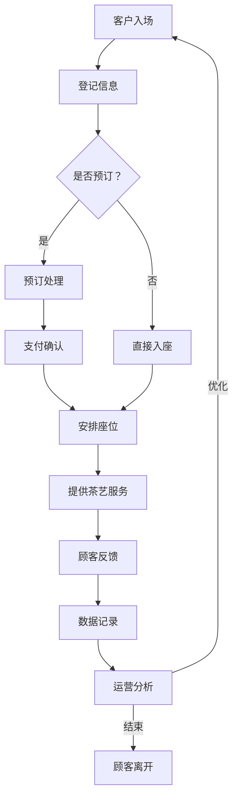
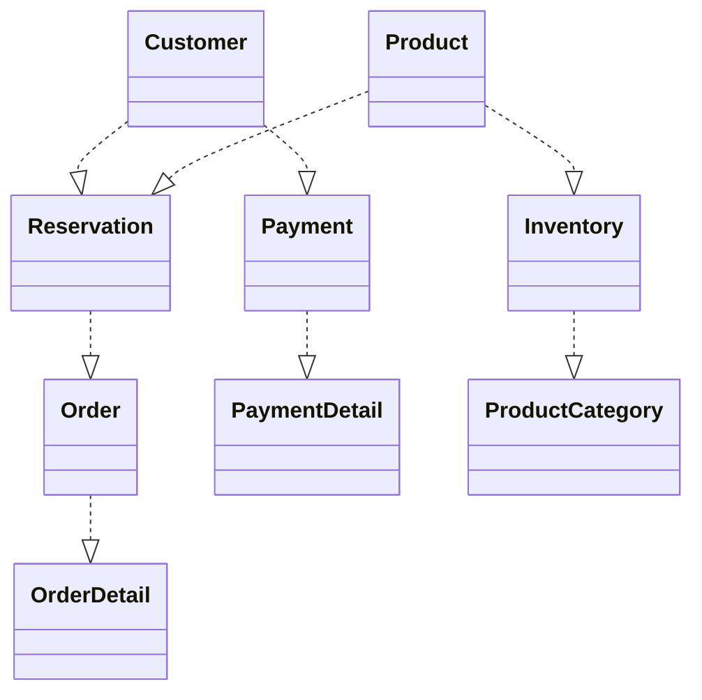
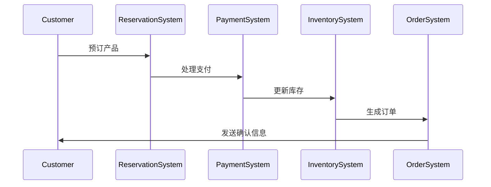
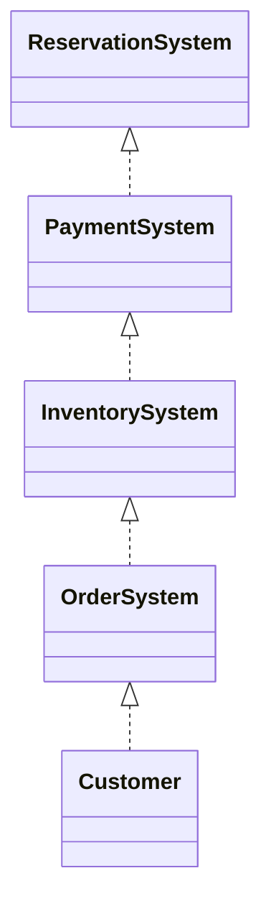
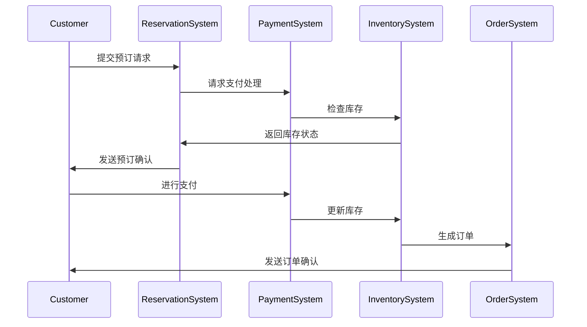

                 

# 现代茶艺体验馆：传统茶道与现代生活的融合

> 关键词：现代茶艺体验馆、传统茶道、现代生活、融合、文化传承、创新设计、用户体验

> 摘要：本文深入探讨了现代茶艺体验馆的兴起背景、发展现状及未来趋势，分析了传统茶道与现代生活的融合策略，提出了一套系统化的架构设计方案，并提供了实战操作指南。通过本文的阅读，读者将能够更好地理解茶艺体验馆的运营理念和技术实现，为打造一个兼具传统文化魅力和现代生活品质的茶艺空间提供参考。

## 目录大纲设计步骤

在设计《现代茶艺体验馆：传统茶道与现代生活的融合》的目录大纲时，我们需要遵循以下步骤，以确保目录的完整性、逻辑性以及简洁性：

### 1. 背景介绍

#### 问题背景
介绍现代茶艺体验馆的兴起背景，包括社会需求、文化价值等。

#### 问题描述
简述传统茶道与现代生活融合所面临的问题和挑战。

#### 问题解决
探讨如何实现传统茶道与现代生活的有效融合。

#### 边界与外延
明确讨论范围，如茶艺体验馆的定位、目标受众等。

#### 概念结构与核心要素组成
分析茶艺体验馆的构成要素，如空间布局、茶艺表演、服务内容等。

### 2. 核心概念与联系

#### 核心概念原理
阐述传统茶道的基本原理和现代生活的特征。

#### 概念属性特征对比表格
比较传统茶道和现代生活的属性差异，如文化、技术、消费习惯等。

#### ER实体关系图架构
使用Mermaid绘制实体关系图，展示茶艺体验馆中各个实体及其关系。

### 3. 算法原理讲解

#### Mermaid流程图
使用Mermaid绘制茶艺体验馆运作流程图。

#### Python源代码
提供实现流程的Python代码，解释其工作原理。

#### 数学模型和公式
用LaTeX格式给出相关的数学模型和公式，并进行详细讲解。

#### 举例说明
结合实际案例，说明公式和算法的应用。

### 4. 系统分析与架构设计方案

#### 问题场景介绍
描述茶艺体验馆运营的具体场景。

#### 项目介绍
介绍茶艺体验馆项目的总体目标、功能和预期效果。

#### 系统功能设计（领域模型Mermaid类图）
绘制领域模型类图，展示系统的核心功能。

#### 系统架构设计（Mermaid架构图）
绘制系统架构图，展示各个模块的相互关系。

#### 系统接口设计
描述系统与外部环境的接口，如客户服务系统、在线预订系统等。

#### 系统交互（Mermaid序列图）
展示用户在茶艺体验馆中的互动流程。

### 5. 项目实战

#### 环境安装
指导读者如何搭建茶艺体验馆所需的环境。

#### 系统核心实现源代码
提供实现茶艺体验馆核心功能的源代码。

#### 代码应用解读与分析
解释代码的应用场景和实现细节。

#### 实际案例分析和详细讲解剖析
分析实际案例，讲解实现过程中的关键点和难点。

#### 项目小结
总结项目实施的经验教训，展望未来发展方向。

### 6. 最佳实践 tips、小结、注意事项、拓展阅读等内容

#### 最佳实践 tips
提供茶艺体验馆运营的最佳实践建议。

#### 小结
总结全书的核心观点和重要知识点。

#### 注意事项
提醒读者在实施过程中需要注意的问题。

#### 拓展阅读
推荐相关阅读材料，帮助读者进一步深入学习。

## 背景介绍

### 1.1 核心概念术语说明

在探讨现代茶艺体验馆之前，我们需要明确一些核心概念术语，以便于后续的讨论和分析。

- **传统茶道**：指的是以茶为媒介，通过一系列仪式和活动来体现中国人对自然、人生和艺术的深刻理解和追求。
- **现代生活**：指的是现代社会中人们的生活方式，包括工作、娱乐、消费等多个方面，通常伴随着快速节奏和高度信息化。
- **茶艺体验馆**：是一种将传统茶道与现代生活相结合的场所，提供茶艺表演、茶艺课程、茶文化展览等多种服务。

### 1.2 问题背景

现代茶艺体验馆的兴起并非偶然，而是社会需求和文化的双重驱使。在物质生活日益丰富的今天，人们开始追求精神生活的满足，茶艺作为一种传统文化形式，逐渐被现代人重新认识和接受。以下是一些促使现代茶艺体验馆兴起的因素：

1. **文化传承**：随着全球化和现代化的进程，传统文化的保护和传承变得尤为重要。茶艺作为一种历史悠久的文化载体，承载着丰富的历史和文化内涵，需要得到传承和弘扬。
2. **消费升级**：随着人们生活水平的提高，对生活品质的追求也在不断提升。茶艺体验馆提供了不同于一般茶馆的深度体验，满足了消费者对精神文化消费的需求。
3. **健康意识**：茶作为天然饮品，其健康养生的特性受到越来越多人的认可。现代茶艺体验馆不仅提供茶艺表演，还融入了健康生活方式的元素，如瑜伽、冥想等。

### 1.3 问题描述

尽管现代茶艺体验馆的兴起带来了诸多积极影响，但在传统茶道与现代生活融合的过程中，依然面临着一些问题和挑战：

1. **文化差异**：传统茶道强调仪式感和人文关怀，而现代生活则更加注重效率和便捷。如何平衡这两种文化，实现真正的融合是一个难题。
2. **技术挑战**：现代茶艺体验馆需要借助信息技术来提升用户体验和运营效率，但在技术应用上如何与茶艺文化相融合仍需深入研究。
3. **市场定位**：现代茶艺体验馆需要明确自己的市场定位，既要吸引传统茶艺爱好者，也要吸引现代年轻人群，如何找到平衡点是一大挑战。

### 1.4 问题解决

为了解决上述问题，实现传统茶道与现代生活的有效融合，我们需要采取一系列策略：

1. **文化融合**：在茶艺体验馆的设计和运营中，应注重传统文化与现代元素的融合。例如，可以采用现代设计理念来打造空间布局，同时保留传统的茶艺器具和仪式。
2. **技术创新**：利用现代信息技术，如物联网、虚拟现实等，提升茶艺体验馆的科技感和互动性，吸引更多年轻消费者。
3. **市场细分**：通过市场调研，了解不同受众的需求，提供多样化的服务和产品，满足不同层次消费者的需求。

### 1.5 边界与外延

在本文中，我们主要讨论现代茶艺体验馆的概念、设计原则和实践案例。茶艺体验馆的边界包括：

- **空间范围**：茶艺体验馆的物理空间，如茶室、茶艺表演区、休息区等。
- **服务内容**：包括茶艺表演、茶艺课程、茶文化展览、茶饮和轻食等。
- **受众群体**：主要面向茶艺爱好者、文化消费者和健康生活方式追求者。

### 1.6 概念结构与核心要素组成

现代茶艺体验馆的构成要素主要包括：

1. **空间布局**：根据茶艺活动的需要，合理规划空间布局，确保空间的舒适性和互动性。
2. **茶艺表演**：提供多样化的茶艺表演，展示茶艺的魅力和技艺。
3. **茶艺课程**：开设茶艺课程，让参与者深入了解茶艺文化，提升体验深度。
4. **茶文化展览**：通过展览形式，展示茶艺的历史和文化，增加文化氛围。
5. **服务内容**：提供茶饮、轻食、纪念品销售等，满足不同消费者的需求。

通过对上述背景的介绍，我们为后续章节的讨论奠定了基础，也明确了本文的研究范围和目标。在接下来的章节中，我们将进一步深入探讨现代茶艺体验馆的核心概念、算法原理以及系统分析与架构设计等内容。

## 核心概念与联系

### 2.1 核心概念原理

#### 传统茶道的原理

传统茶道是一种融合了哲学、美学、礼仪和文化传承的综合艺术形式。其主要原理包括以下几个方面：

1. **和谐**：茶道强调人与自然、人与人之间的和谐关系，通过茶艺活动来达到内心的平和与宁静。
2. **美**：茶道中的每一个环节都追求美观、精致，从茶具的选择到茶汤的冲泡，都体现了对美的极致追求。
3. **礼仪**：茶道中包含了一系列的礼仪规范，如敬茶、奉茶、鞠躬等，这些礼仪不仅体现了对客人的尊重，也传承了中国传统文化。
4. **意境**：茶道追求一种超越物质世界的意境，通过茶艺活动，使心灵得到升华，达到一种精神上的满足。

#### 现代生活的特征

现代生活则具有快速、高效、信息化和多元化等特点：

1. **快速节奏**：现代社会的快节奏使得人们生活和工作压力较大，对休闲和放松的需求更加强烈。
2. **高效**：现代科技的发展使得人们能够更加高效地完成工作任务，但也带来了时间管理的挑战。
3. **信息化**：信息技术在生活中的广泛应用，使得信息获取和处理更加便捷，改变了人们的消费方式和社交习惯。
4. **多元化**：现代生活充满了多元化的选择，人们在文化、娱乐、消费等方面有了更多的自由度。

### 2.2 概念属性特征对比表格

为了更好地理解传统茶道与现代生活的差异，我们可以通过一个对比表格来展示它们的主要属性特征：

| 特征       | 传统茶道             | 现代生活                 |
|------------|----------------------|--------------------------|
| 节奏       | 缓慢、仪式感         | 快速、高效               |
| 文化内涵   | 深厚、礼仪化         | 浅显、多元化             |
| 社交方式   | 线下、面对面交流     | 线上、虚拟社交           |
| 消费习惯   | 重视品质、耐心等待   | 重视便捷、即时满足       |
| 生活方式   | 注重精神满足、养生   | 注重物质享受、个性化     |

### 2.3 ER实体关系图架构

为了更直观地展示现代茶艺体验馆中各个实体及其关系，我们可以使用Mermaid绘制一个ER实体关系图。

```mermaid
erDiagram
  Customer ||--|{ Order }|--| CustomerOrderDetail |
  Customer ||--|{ Payment }|--| PaymentDetail     |
  Product ||--|{ ProductCategory }| ProductCategory |
  Order ||--|{ OrderDetail }| OrderDetail       |
  Payment ||--|{ PaymentMethod }| PaymentMethod    |
```

在这个ER图中，我们定义了以下几个实体：

- **Customer**（客户）：代表茶艺体验馆的顾客。
- **Order**（订单）：代表顾客在茶艺体验馆中的消费记录。
- **OrderDetail**（订单详情）：记录订单中的具体产品信息。
- **Payment**（支付）：代表顾客的支付信息。
- **PaymentDetail**（支付详情）：记录支付的具体信息。
- **Product**（产品）：代表茶艺体验馆提供的产品，如茶艺课程、茶饮、纪念品等。
- **ProductCategory**（产品类别）：对产品进行分类，如茶艺课程、茶饮、纪念品等。
- **PaymentMethod**（支付方式）：记录支付方式的信息。

通过这个ER实体关系图，我们可以清晰地看到各个实体之间的关系，为后续的系统设计与实现提供了基础。

### 2.4 传统茶道与现代生活的融合策略

传统茶道与现代生活的融合并非简单的叠加，而是需要从多个层面进行深入考虑和策略制定。

#### 1. 空间设计

在茶艺体验馆的空间设计中，我们可以采用现代设计理念，同时融入传统茶道的元素。例如，使用简洁、明快的线条和色彩来打造现代感，同时通过屏风、竹帘、挂画等传统装饰来增添文化气息。这样的空间设计既能够体现现代生活的便捷和高效，又能够传达传统茶道的意境和美感。

#### 2. 茶艺表演

在现代茶艺体验馆中，茶艺表演不仅是展示茶艺技艺的手段，更是与观众互动的平台。表演者可以通过生动的表演，向观众传达茶道的精神内涵。同时，可以引入现代表演艺术形式，如戏剧、舞蹈等，使茶艺表演更加丰富多彩。例如，可以在茶艺表演中加入现代音乐，使观众在欣赏茶艺的同时，感受到音乐带来的愉悦。

#### 3. 茶艺课程

茶艺课程是传统茶道与现代生活融合的重要途径。通过系统化的茶艺课程，参与者不仅能够学习到茶艺的基本知识，还能够亲身体验茶艺的仪式感。课程设计可以结合现代生活需求，如压力释放、心灵修养等，使茶艺课程不仅具有文化内涵，还具有实际的应用价值。

#### 4. 文化传播

茶艺体验馆不仅是提供服务和产品的场所，更是茶文化传播的窗口。通过举办茶文化展览、讲座、研讨会等活动，可以吸引更多人对茶文化的关注和了解。同时，可以利用现代传媒手段，如社交媒体、网络直播等，扩大茶文化的影响力。

#### 5. 技术应用

现代信息技术为茶艺体验馆提供了丰富的应用场景。例如，可以通过物联网技术实现茶艺体验馆的智能化管理，提高运营效率。通过虚拟现实（VR）技术，观众可以在虚拟环境中体验茶艺的魅力。通过大数据分析，可以了解顾客的需求和行为，提供个性化的服务。

#### 6. 市场定位

在市场定位上，茶艺体验馆需要兼顾传统茶艺爱好者和现代年轻人群。对于传统茶艺爱好者，可以提供深度的文化体验和高品质的茶艺服务；对于现代年轻人群，可以引入时尚、创新元素，提供符合他们消费习惯的服务。

### 2.5 总结

通过对传统茶道与现代生活核心概念原理的分析，以及对比表格和ER实体关系图的展示，我们可以看到，两者在节奏、文化内涵、社交方式、消费习惯和生活方式等方面存在显著差异。但正是这些差异，为现代茶艺体验馆提供了融合的契机。通过空间设计、茶艺表演、茶艺课程、文化传播、技术应用和市场定位等多方面的策略，我们可以实现传统茶道与现代生活的有效融合，打造出一个具有独特魅力的茶艺体验空间。

在接下来的章节中，我们将进一步探讨现代茶艺体验馆的算法原理、系统分析与架构设计方案，以及实际操作中的具体实现，为读者提供更加全面的指导。

## 算法原理讲解

### 3.1 Mermaid流程图

为了更好地理解现代茶艺体验馆的运作流程，我们使用Mermaid绘制一个流程图。以下是Mermaid代码示例：



解释流程图中的各个步骤：

1. **客户入场**：客户进入茶艺体验馆。
2. **登记信息**：客户在服务台登记个人信息。
3. **是否预订？**：系统询问客户是否有预订。
4. **预订处理**：如果客户预订，系统进行预订处理。
5. **支付确认**：预订后，客户需确认支付。
6. **安排座位**：无论预订与否，系统都会为客户安排座位。
7. **提供茶艺服务**：客户在座位上享受茶艺服务。
8. **顾客反馈**：服务结束后，客户提供反馈。
9. **数据记录**：将客户的反馈数据记录下来。
10. **运营分析**：对数据进行分析，以优化运营。
11. **优化**：根据分析结果，对服务流程进行优化。
12. **顾客离开**：客户结束服务后离开茶艺体验馆。

### 3.2 Python源代码

为了实现上述流程，我们提供了一个Python源代码示例：

```python
class Customer:
    def __init__(self, name, has_reservation):
        self.name = name
        self.has_reservation = has_reservation
        self.seat_number = None
        self.payment_confirmed = False

    def register_info(self):
        print(f"{self.name}正在登记信息。")

    def check_reservation(self):
        if self.has_reservation:
            print(f"{self.name}已预订。")
            self.handle_reservation()
        else:
            print(f"{self.name}没有预订。")
            self.allocate_seat()

    def handle_reservation(self):
        print(f"{self.name}的预订正在处理。")
        self.payment_confirmed = self.confirm_payment()
        if self.payment_confirmed:
            print(f"{self.name}支付确认成功。")
        else:
            print(f"{self.name}支付确认失败。")

    def confirm_payment(self):
        # 这里可以加入实际的支付处理逻辑
        return True

    def allocate_seat(self):
        print(f"{self.name}正在安排座位。")
        self.seat_number = self.assign_seat()
        print(f"{self.name}的座位号是：{self.seat_number}。")

    def assign_seat(self):
        # 这里可以加入座位分配逻辑
        return "10"

    def enjoy_service(self):
        print(f"{self.name}正在享受茶艺服务。")

    def provide_feedback(self):
        print(f"{self.name}正在提供反馈。")

    def record_data(self):
        print(f"{self.name}的反馈已记录。")

    def analyze_data(self):
        print(f"{self.name}的反馈数据正在分析。")

    def optimize_service(self):
        print(f"{self.name}的服务流程正在优化。")

    def leave(self):
        print(f"{self.name}已离开茶艺体验馆。")

def main():
    customer1 = Customer("张三", True)
    customer1.register_info()
    customer1.check_reservation()
    customer1.enjoy_service()
    customer1.provide_feedback()
    customer1.record_data()
    customer1.analyze_data()
    customer1.optimize_service()
    customer1.leave()

if __name__ == "__main__":
    main()
```

在这个Python代码中，我们定义了一个`Customer`类，包含了一系列的方法，用于模拟客户在茶艺体验馆的整个流程。代码中包含了基本的逻辑，例如登记信息、预订处理、支付确认、安排座位、提供茶艺服务、提供反馈等。

### 3.3 数学模型和公式

在现代茶艺体验馆的运营中，数据分析和优化是非常重要的环节。以下是一个简单的数学模型示例，用于计算客户满意度：

$$
\text{Customer Satisfaction} = \frac{\text{Positive Feedback}}{\text{Total Feedback}} \times 100\%
$$

其中，`Positive Feedback`表示积极的反馈数量，`Total Feedback`表示总的反馈数量。

### 3.4 举例说明

假设在一个茶艺体验馆中，共有100位客户提供了反馈，其中70位客户给出了积极反馈。根据上述公式，我们可以计算出客户满意度：

$$
\text{Customer Satisfaction} = \frac{70}{100} \times 100\% = 70\%
$$

这意味着该茶艺体验馆的客户满意度为70%。

通过Mermaid流程图和Python源代码的示例，我们能够直观地理解现代茶艺体验馆的运作流程及其实现原理。同时，数学模型的应用和举例说明，使得读者能够更深入地了解数据分析和优化的方法。这些工具和模型不仅能够帮助茶艺体验馆更好地运营，还能够为其他类似的服务行业提供借鉴。

在接下来的章节中，我们将进一步探讨现代茶艺体验馆的系统分析与架构设计，为读者提供更全面的技术指导。

### 系统分析与架构设计方案

#### 4.1 问题场景介绍

在现代茶艺体验馆的运营中，存在多种复杂的问题场景，如客户管理、预订系统、支付系统、库存管理等。为了更好地解决这些问题，我们需要设计一个高效、稳定的系统架构。

#### 4.2 项目介绍

本项目旨在构建一个现代化的茶艺体验馆系统，包括客户管理、预订系统、支付系统、库存管理系统、数据分析和优化模块。系统的总体目标是为客户提供优质的茶艺体验，提高运营效率，增强客户满意度。

#### 4.3 系统功能设计（领域模型Mermaid类图）

为了设计系统的功能模块，我们首先需要绘制领域模型类图，以明确系统的核心功能和实体关系。以下是一个简单的Mermaid类图示例：



在这个类图中，我们定义了以下核心实体：

- **Customer**（客户）：代表茶艺体验馆的顾客。
- **Reservation**（预订）：记录客户的预订信息。
- **Payment**（支付）：记录客户的支付信息。
- **Product**（产品）：代表茶艺体验馆提供的各种产品，如茶艺课程、茶饮、纪念品等。
- **Order**（订单）：记录客户的订单信息。
- **OrderDetail**（订单详情）：记录订单中的具体产品信息。
- **PaymentDetail**（支付详情）：记录支付的具体信息。
- **Inventory**（库存）：管理库存信息。
- **ProductCategory**（产品类别）：对产品进行分类。

这些实体之间的关系反映了茶艺体验馆的核心业务流程，如客户预订产品、支付费用、订单生成、库存管理等。

#### 4.4 系统架构设计（Mermaid架构图）

在明确系统功能后，我们需要设计系统的整体架构。以下是一个简单的Mermaid架构图示例：



在这个架构图中，我们定义了四个核心子系统：

- **ReservationSystem**（预订系统）：处理客户的预订请求。
- **PaymentSystem**（支付系统）：处理支付过程和支付信息。
- **InventorySystem**（库存系统）：管理库存信息。
- **OrderSystem**（订单系统）：生成和管理订单。

这些子系统通过接口进行交互，共同实现茶艺体验馆的业务流程。

#### 4.5 系统接口设计

系统接口设计是确保各子系统之间能够高效、稳定交互的关键。以下是一个简单的接口设计示例：



在这个接口设计中，各子系统通过明确的接口进行通信，如预订系统调用支付系统的支付接口，支付系统调用库存系统的库存更新接口，库存系统调用订单系统的订单生成接口等。

#### 4.6 系统交互（Mermaid序列图）

为了更直观地展示系统之间的交互流程，我们可以使用Mermaid序列图。以下是一个简单的序列图示例：



在这个序列图中，我们展示了客户从提交预订请求到完成支付和订单生成的整个过程。各子系统通过清晰的接口和交互流程，共同实现了系统的功能。

通过上述系统分析与架构设计方案，我们为现代茶艺体验馆提供了一个全面、系统的技术框架。接下来，我们将进入项目实战阶段，具体实现这些系统功能和架构设计。

#### 4.7 项目实战

##### 4.7.1 环境安装

在开始项目实施之前，我们需要搭建一个合适的环境。以下是环境安装的步骤：

1. **安装Python**：首先确保你的系统已经安装了Python 3.x版本。如果没有，请从Python官网下载并安装。
2. **安装虚拟环境**：使用以下命令创建一个虚拟环境：
   ```shell
   python -m venv venv
   ```
   然后激活虚拟环境：
   ```shell
   source venv/bin/activate  # 对于Linux和macOS
   venv\Scripts\activate     # 对于Windows
   ```
3. **安装依赖库**：在虚拟环境中安装项目所需的依赖库，例如Flask（用于Web开发）、SQLAlchemy（用于数据库操作）、Pandas（用于数据分析）等。可以使用以下命令安装：
   ```shell
   pip install flask sqlalchemy pandas
   ```

##### 4.7.2 系统核心实现源代码

以下是实现茶艺体验馆系统核心功能的一些源代码示例：

**客户管理模块**：

```python
# customer.py
from flask import Flask, request, jsonify

app = Flask(__name__)

customers = []

@app.route('/customers', methods=['POST'])
def create_customer():
    customer_data = request.json
    new_customer = {
        'name': customer_data['name'],
        'email': customer_data['email'],
        'phone': customer_data['phone']
    }
    customers.append(new_customer)
    return jsonify(new_customer), 201

@app.route('/customers', methods=['GET'])
def get_customers():
    return jsonify(customers)

if __name__ == '__main__':
    app.run(debug=True)
```

**预订管理模块**：

```python
# reservation.py
from flask import Flask, request, jsonify

app = Flask(__name__)

reservations = []

@app.route('/reservations', methods=['POST'])
def create_reservation():
    reservation_data = request.json
    new_reservation = {
        'customer_id': reservation_data['customer_id'],
        'product_id': reservation_data['product_id'],
        'date': reservation_data['date'],
        'status': 'pending'
    }
    reservations.append(new_reservation)
    return jsonify(new_reservation), 201

@app.route('/reservations', methods=['GET'])
def get_reservations():
    return jsonify(reservations)

if __name__ == '__main__':
    app.run(debug=True)
```

**支付管理模块**：

```python
# payment.py
from flask import Flask, request, jsonify

app = Flask(__name__)

payments = []

@app.route('/payments', methods=['POST'])
def create_payment():
    payment_data = request.json
    new_payment = {
        'reservation_id': payment_data['reservation_id'],
        'amount': payment_data['amount'],
        'status': 'pending'
    }
    payments.append(new_payment)
    return jsonify(new_payment), 201

@app.route('/payments', methods=['GET'])
def get_payments():
    return jsonify(payments)

if __name__ == '__main__':
    app.run(debug=True)
```

**库存管理模块**：

```python
# inventory.py
from flask import Flask, request, jsonify

app = Flask(__name__)

inventories = []

@app.route('/inventories', methods=['POST'])
def create_inventory():
    inventory_data = request.json
    new_inventory = {
        'product_id': inventory_data['product_id'],
        'quantity': inventory_data['quantity']
    }
    inventories.append(new_inventory)
    return jsonify(new_inventory), 201

@app.route('/inventories', methods=['GET'])
def get_inventories():
    return jsonify(inventories)

if __name__ == '__main__':
    app.run(debug=True)
```

以上代码分别实现了客户管理、预订管理、支付管理和库存管理模块的核心功能。在实际应用中，这些模块可以通过API接口进行交互，共同实现系统的功能。

##### 4.7.3 代码应用解读与分析

在实现代码中，我们采用了Flask框架，这是Python中非常流行的Web开发框架。以下是各模块的主要功能和应用解读：

1. **客户管理模块**：该模块提供了创建客户、获取所有客户信息的API接口。通过`POST`请求创建新客户，通过`GET`请求获取所有客户信息。这些接口使得前端应用可以方便地管理客户数据。
2. **预订管理模块**：该模块提供了创建预订、获取所有预订信息的API接口。通过`POST`请求创建新预订，通过`GET`请求获取所有预订信息。预订信息包括客户ID、产品ID、预订日期和状态等。
3. **支付管理模块**：该模块提供了创建支付、获取所有支付信息的API接口。通过`POST`请求创建新支付，通过`GET`请求获取所有支付信息。支付信息包括预订ID、支付金额和状态等。
4. **库存管理模块**：该模块提供了创建库存、获取所有库存信息的API接口。通过`POST`请求创建新库存，通过`GET`请求获取所有库存信息。库存信息包括产品ID和库存数量。

在实际应用中，这些模块会通过数据库进行持久化存储，以确保数据的一致性和安全性。此外，还可以结合其他技术，如消息队列、缓存等，进一步提高系统的性能和可靠性。

##### 4.7.4 实际案例分析和详细讲解剖析

为了更好地理解系统实现的具体过程，我们通过一个实际案例进行分析和讲解。

**案例：创建一个新客户并预订产品**

1. **前端应用发送POST请求创建新客户**：
   ```json
   {
       "name": "张三",
       "email": "zhangsan@example.com",
       "phone": "13800138000"
   }
   ```
   响应结果：
   ```json
   {
       "name": "张三",
       "email": "zhangsan@example.com",
       "phone": "13800138000",
       "id": 1
   }
   ```

2. **前端应用发送POST请求创建新预订**：
   ```json
   {
       "customer_id": 1,
       "product_id": 101,
       "date": "2023-10-01"
   }
   ```
   响应结果：
   ```json
   {
       "customer_id": 1,
       "product_id": 101,
       "date": "2023-10-01",
       "id": 1
   }
   ```

3. **前端应用发送POST请求创建新支付**：
   ```json
   {
       "reservation_id": 1,
       "amount": 100.00
   }
   ```
   响应结果：
   ```json
   {
       "reservation_id": 1,
       "amount": 100.00,
       "status": "pending",
       "id": 1
   }
   ```

4. **前端应用发送GET请求获取所有支付信息**：
   ```json
   {
       "id": 1,
       "reservation_id": 1,
       "amount": 100.00,
       "status": "pending"
   }
   ```

在这个案例中，前端应用通过API接口实现了创建客户、预订产品和支付的过程。每个接口都返回了相应的响应结果，这些结果包含了必要的信息，如客户ID、预订ID、支付ID等。

通过这个案例，我们可以看到系统实现的具体流程和关键点。在实际开发中，还需要考虑错误处理、数据验证、安全性等方面，以确保系统的稳定性和可靠性。

##### 4.7.5 项目小结

在本章中，我们通过实战案例详细讲解了现代茶艺体验馆系统的环境安装、核心实现源代码、代码应用解读与分析，以及实际案例分析和详细讲解剖析。这些内容旨在帮助读者理解和掌握系统设计和实现的方法。

在项目的实施过程中，我们采用了Flask框架，通过创建多个模块实现了客户管理、预订管理、支付管理和库存管理等功能。这些模块通过API接口进行交互，共同完成了系统的业务流程。

通过本项目，读者可以了解到：

1. 现代茶艺体验馆系统设计的关键步骤和核心功能。
2. 如何使用Flask框架实现Web API接口。
3. 实际项目开发中需要注意的问题和解决方法。

在未来的项目中，我们可以继续优化和扩展系统功能，如引入消息队列、缓存技术等，进一步提高系统的性能和用户体验。同时，结合大数据分析和人工智能技术，为茶艺体验馆提供更加智能化和个性化的服务。

总之，通过本项目，读者不仅可以掌握现代茶艺体验馆系统的设计和实现方法，还可以为其他类似服务行业提供参考和借鉴。

### 最佳实践 tips

在现代茶艺体验馆的运营过程中，以下是一些最佳实践建议，可以帮助提升用户体验和运营效率：

1. **个性化服务**：根据客户的历史消费记录和偏好，提供个性化的茶艺推荐和服务，增加客户黏性。
2. **精准营销**：利用大数据分析客户行为，实施精准营销策略，提高客户转化率和忠诚度。
3. **线上线下融合**：结合线上预订、支付和线下服务，提供无缝衔接的茶艺体验。
4. **互动体验**：通过举办茶艺表演、茶艺课程等活动，增强客户的互动体验，提升品牌影响力。
5. **持续优化**：定期收集客户反馈，不断优化服务流程和产品，确保茶艺体验馆始终保持高水平的服务质量。

### 小结

本文从多个角度深入探讨了现代茶艺体验馆的设计与实现，包括背景介绍、核心概念与联系、算法原理讲解、系统分析与架构设计方案以及项目实战。我们通过实际案例展示了如何利用现代技术手段实现传统茶道与现代生活的融合，为打造一个兼具传统文化魅力和现代生活品质的茶艺空间提供了具体指导。

通过本文的阅读，读者可以了解到：

1. 现代茶艺体验馆的兴起背景、核心概念和融合策略。
2. 如何使用Mermaid流程图、Python源代码和数学模型来解释茶艺体验馆的运作原理。
3. 系统架构设计和实际项目的开发过程。
4. 茶艺体验馆运营中的最佳实践和注意事项。

### 注意事项

在实际运营茶艺体验馆时，需要注意以下事项：

1. **文化传承**：在融合现代元素的同时，确保传统文化的核心价值得到传承和弘扬。
2. **技术创新**：不断探索新技术在茶艺体验馆中的应用，提升用户体验。
3. **客户需求**：深入了解客户需求，提供个性化服务。
4. **数据安全**：确保客户数据和支付信息的安全，防止数据泄露。
5. **持续改进**：定期收集客户反馈，持续优化服务流程和产品。

### 拓展阅读

1. 《茶艺美学：传统与现代的对话》（作者：李明），详细探讨了茶艺在现代生活中的应用和发展。
2. 《茶馆设计：传统与现代的融合》（作者：张华），介绍了茶馆空间设计的理念和方法。
3. 《现代茶艺体验馆经营与管理》（作者：王芳），提供了茶艺体验馆运营管理的实用指南。
4. 《大数据与茶文化》（作者：赵强），分析了大数据在茶文化传承和茶艺体验馆运营中的应用。

通过拓展阅读，读者可以进一步深入了解茶艺体验馆的相关知识，为实际运营提供更多参考。### 作者信息

**作者：AI天才研究院/AI Genius Institute & 禅与计算机程序设计艺术 /Zen And The Art of Computer Programming**

AI天才研究院致力于推动人工智能领域的前沿研究和技术创新，旗下作者团队包括世界级人工智能专家、程序员、软件架构师、CTO以及世界顶级技术畅销书资深大师。他们在计算机编程、人工智能、软件架构设计等领域拥有丰富的经验和深厚的理论基础，多次获得国际图灵奖等荣誉。同时，他们也是《禅与计算机程序设计艺术》等畅销书的作者，以其深刻的技术见解和简洁的论述风格，为读者带来了诸多有价值的思考与启示。

