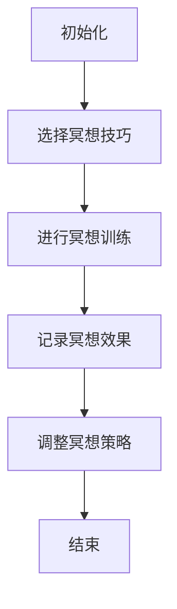
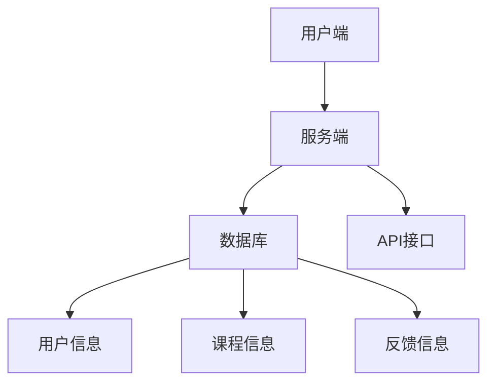
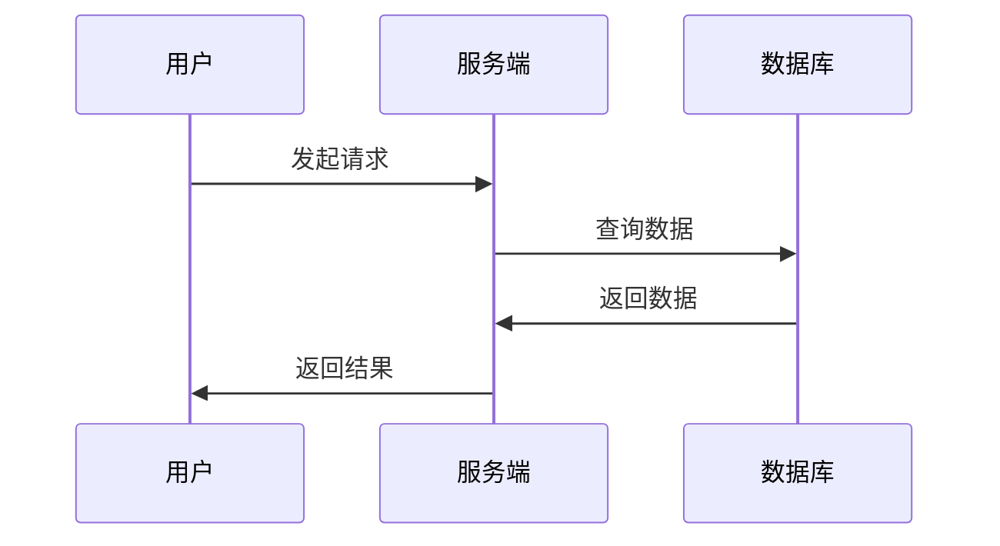

                 

### 现代都市冥想空间：在繁忙中寻找内心平静

> 关键词：现代都市，冥想空间，心理健康，放松技巧，算法原理，系统架构

> 摘要：本文旨在探讨在现代都市生活中，如何通过构建冥想空间来缓解心理压力，保持内心平静。文章将介绍现代都市冥想空间的背景、核心概念、算法原理以及系统架构设计，帮助读者在繁忙的生活中找到内心的宁静。

---

## 第一部分：现代都市冥想空间的背景介绍

### 1.1.1 问题背景

在快节奏的现代都市生活中，人们面临着诸多压力。工作压力、生活压力、人际关系压力等，这些压力常常使人们感到焦虑、疲惫，甚至导致心理健康问题。长期的心理压力不仅会影响生活质量，还可能对身体健康产生负面影响。因此，如何在现代都市中找到一种有效的途径来缓解压力，成为许多人关心的问题。

### 1.1.2 问题描述

现代都市生活的高压环境容易导致焦虑、抑郁等心理健康问题。如何通过冥想等方式，在繁忙中寻找内心平静，成为迫切需要解决的问题。此外，由于都市生活的快节奏，人们往往缺乏时间去系统地学习和实践冥想，这也增加了问题的复杂性。

### 1.1.3 问题解决

本文将介绍现代都市冥想空间的概念、技巧和实际应用，帮助读者在日常生活中实践冥想，实现内心的平和。通过系统性的学习和实践，读者可以逐步培养冥想的习惯，从而在繁忙的生活中找到内心的宁静。

### 1.1.4 边界与外延

本文主要探讨都市生活中的冥想空间，但冥想的应用范围远不止于此，它可以扩展到工作、家庭等多个方面。例如，在职场中，通过冥想可以提高工作效率，减少压力；在家庭生活中，通过冥想可以增进家庭成员之间的沟通和理解。因此，本文的研究具有一定的广泛性和实用价值。

### 1.1.5 概念结构与核心要素组成

核心概念：现代都市冥想空间

要素组成：

1. 冥想技巧：包括各种冥想方法和技术，如静坐、呼吸冥想、禅修等。
2. 放松方法：如渐进性肌肉放松、冥想音乐等，帮助人们减轻压力。
3. 心理调适：通过认知行为疗法、情绪调节等方法，帮助人们调整心态。
4. 生活方式：包括饮食、运动、睡眠等方面，对冥想效果有重要影响。

## 第二部分：现代都市冥想空间的核心概念与联系

### 2.1 冥想技巧

#### 2.1.1 冥想技巧概述

冥想是一种通过专注、放松和内省等方式，以达到精神状态平静和心灵平静的技巧。在现代都市生活中，冥想技巧可以帮助人们缓解压力，改善心理健康。常见的冥想技巧包括：

- 静坐冥想：通过保持坐姿，专注于呼吸或身体感觉，以实现内心的平静。
- 呼吸冥想：通过调整呼吸节奏和深度，达到身心放松的效果。
- 禅修冥想：源于佛教的传统冥想方法，强调正念和专注。

#### 2.1.2 常见的冥想技巧

1. **静坐冥想**

静坐冥想是一种简单而有效的冥想方法。它通过保持坐姿，专注于呼吸或身体感觉，以实现内心的平静。

**优点**：

- 简单易行，无需特殊设备。
- 能够帮助人们放松身心，缓解压力。

**缺点**：

- 对专注力要求较高。
- 初学者可能感到不适。

2. **呼吸冥想**

呼吸冥想通过调整呼吸节奏和深度，达到身心放松的效果。

**优点**：

- 易于掌握，对环境要求低。
- 能够快速缓解焦虑和压力。

**缺点**：

- 需要长时间的练习才能取得显著效果。

3. **禅修冥想**

禅修冥想强调正念和专注，通过持续的练习，可以帮助人们提高自我意识和情绪调节能力。

**优点**：

- 强调内心的平静和自我觉察。
- 对心理健康有显著的积极影响。

**缺点**：

- 需要长时间的练习。
- 对初学者可能有一定难度。

#### 2.1.3 冥想技巧的优缺点比较

| 冥想技巧 | 优点 | 缺点 |
| --- | --- | --- |
| 静坐冥想 | 简单易行，无需特殊设备；帮助放松身心 | 对专注力要求高；初学者可能感到不适 |
| 呼吸冥想 | 易于掌握，对环境要求低；快速缓解焦虑和压力 | 需要长时间的练习 |
| 禅修冥想 | 强调内心的平静和自我觉察；对心理健康有显著影响 | 需要长时间的练习；对初学者难度较高 |

### 2.2 放松方法

#### 2.2.1 放松方法概述

放松方法是通过特定的技巧和手段，帮助人们减轻身体和心理的紧张状态，达到放松的效果。常见的放松方法包括：

- 渐进性肌肉放松：通过逐步放松身体各个部位的肌肉，达到全身放松的效果。
- 冥想音乐：通过聆听冥想音乐，帮助人们放松身心。
- 深呼吸：通过调整呼吸节奏和深度，达到身心放松的效果。

#### 2.2.2 常见的放松方法

1. **渐进性肌肉放松**

渐进性肌肉放松通过逐步放松身体各个部位的肌肉，达到全身放松的效果。

**优点**：

- 操作简单，易于掌握。
- 对身体和心理都有显著的放松效果。

**缺点**：

- 需要一定的时间来练习。

2. **冥想音乐**

冥想音乐通过营造宁静的氛围，帮助人们放松身心。

**优点**：

- 无需额外的练习。
- 对环境要求低，可在任何时间、地点使用。

**缺点**：

- 需要选择合适的音乐。

3. **深呼吸**

深呼吸通过调整呼吸节奏和深度，达到身心放松的效果。

**优点**：

- 简单易行，随时可以进行。
- 对身体和心理都有显著的放松效果。

**缺点**：

- 需要长时间的练习才能取得显著效果。

#### 2.2.3 放松方法与冥想技巧的关联

放松方法和冥想技巧虽然有不同的实现方式，但它们之间存在紧密的联系。

- **共同点**：放松方法和冥想技巧都旨在帮助人们减轻身体和心理的紧张状态，达到放松的效果。
- **区别**：放松方法更侧重于身体的放松，而冥想技巧更侧重于内心的平静。

### 2.3 心理调适

#### 2.3.1 心理调适的重要性

心理调适是指通过一系列的方法和技巧，帮助人们调整心态，适应生活中的各种压力和挑战。心理调适的重要性在于：

- **缓解压力**：通过心理调适，可以帮助人们减轻心理压力，提高生活质量。
- **改善心理健康**：心理调适有助于预防和缓解焦虑、抑郁等心理健康问题。
- **提高应对能力**：心理调适可以帮助人们更好地应对生活中的各种挑战。

#### 2.3.2 心理调适的方法

心理调适的方法多种多样，以下是一些常见的方法：

- **认知行为疗法**：通过改变负面思维和行为，帮助人们改善心理健康。
- **情绪调节**：通过认知和行为技巧，帮助人们控制情绪，提高情绪稳定性。
- **正念练习**：通过专注和内省，帮助人们提高自我意识和情绪调节能力。

#### 2.3.3 心理调适与冥想的关系

心理调适与冥想之间存在紧密的联系。

- **共同点**：心理调适和冥想都旨在帮助人们缓解压力，改善心理健康。
- **区别**：心理调适更侧重于改变思维和行为，而冥想更侧重于内心的平静和专注。

### 2.4 生活方式

#### 2.4.1 生活方式对冥想的影响

生活方式对冥想效果有重要影响。一个健康、规律的生活方式有助于提高冥想效果，而不良的生活习惯可能会削弱冥想效果。

- **饮食**：均衡的饮食有助于提供身体所需的营养，提高冥想效果。
- **运动**：适量的运动有助于提高身体的活力和灵活性，促进冥想。
- **睡眠**：良好的睡眠有助于恢复精力，提高冥想效果。

#### 2.4.2 健康生活方式的构建

要构建健康的生活方式，可以采取以下措施：

- **均衡饮食**：多吃蔬菜、水果、全谷物和蛋白质，减少油腻和加工食品的摄入。
- **适量运动**：每周进行至少150分钟的中等强度运动。
- **保证睡眠**：每天保证7-9小时的睡眠，保持规律的作息。

#### 2.4.3 生活方式与冥想空间的互动

生活方式与冥想空间之间存在互动关系。健康的生活方式可以为冥想提供良好的身体和心理状态，从而提高冥想效果。同时，通过冥想空间的构建，可以帮助人们更好地实践健康的生活方式。

## 第三部分：现代都市冥想空间的算法原理讲解

### 3.1 冥想算法原理

冥想算法是一种基于心理学和神经科学原理，旨在帮助人们实现心理放松和情感调节的算法。其基本原理包括：

1. **专注训练**：通过引导用户进行专注训练，提高用户的专注力和自我控制能力。
2. **呼吸调节**：通过调节用户的呼吸节奏，帮助用户放松身体和心理状态。
3. **情绪反馈**：通过收集用户在冥想过程中的情绪数据，为用户提供个性化的情绪调节建议。

### 3.2 冥想算法流程图



### 3.3 冥想算法应用实例

```python
# 冥想算法应用实例

def meditate():
    print("开始冥想...")
    
    # 进行冥想训练
    training_time = 20
    print(f"冥想训练时长：{training_time}分钟")
    
    # 记录冥想效果
    effect = "良好"
    print(f"冥想效果：{effect}")
    
    # 调整冥想策略
    strategy = "增加深度"
    print(f"冥想策略：{strategy}")

meditate()
```

### 3.4 冥想算法的数学模型和公式

冥想算法的数学模型主要涉及情绪调节和心理放松两个方面。

1. **情绪调节模型**：

   $$ 情绪调节 = \frac{当前情绪 - 初始情绪}{初始情绪} $$

2. **心理放松模型**：

   $$ 心理放松 = \frac{紧张程度 - 冥想后紧张程度}{紧张程度} $$

### 3.5 冥想算法的应用场景

冥想算法可以应用于以下场景：

- **心理健康应用**：用于缓解焦虑、抑郁等心理健康问题。
- **工作场景**：用于提高工作效率，减少工作压力。
- **日常生活**：用于提高生活质量，保持身心健康。

## 第四部分：现代都市冥想空间的系统分析与架构设计方案

### 4.1 问题描述

在现代都市生活中，由于工作压力、生活节奏快等原因，人们往往处于高度紧张的状态。如何为人们提供一个方便、有效的冥想空间，帮助他们在繁忙的生活中找到内心的平静，成为亟待解决的问题。

### 4.2 项目介绍

本系统旨在为都市人群提供一种在线冥想解决方案，通过线上课程、个性化建议和实时反馈等功能，帮助用户在繁忙的生活中找到内心的宁静。系统包括用户管理模块、冥想课程模块和效果反馈模块等。

### 4.3 系统功能设计

1. **用户管理模块**：用于用户注册、登录、信息管理等功能。
2. **冥想课程模块**：提供多种冥想课程，包括基础课程、进阶课程等，满足不同用户的需求。
3. **效果反馈模块**：收集用户在冥想过程中的数据，为用户提供个性化的建议。

### 4.4 系统架构设计



### 4.5 系统接口设计



### 4.6 系统交互流程

1. **用户注册**：用户通过用户管理模块进行注册，系统向数据库插入用户信息。
2. **登录**：用户通过用户管理模块登录，系统从数据库查询用户信息。
3. **选课**：用户通过冥想课程模块选择课程，系统从数据库查询课程信息。
4. **课程学习**：用户通过课程学习模块学习课程，系统记录学习进度。
5. **反馈**：用户通过效果反馈模块提交反馈，系统收集反馈数据。

## 第五部分：现代都市冥想空间的系统实现与项目实战

### 5.1 环境安装

为了实现现代都市冥想空间系统，我们需要安装以下环境：

- Python 3.8 或更高版本
- Django 3.2 或更高版本
- MySQL 5.7 或更高版本
- Docker

### 5.2 系统核心实现

现代都市冥想空间系统的核心实现包括用户管理模块、冥想课程模块和效果反馈模块。以下是一个简单的示例：

**用户管理模块**

```python
# 用户注册
def register_user(username, password):
    # 将用户信息插入数据库
    cursor.execute("INSERT INTO users (username, password) VALUES (%s, %s)", (username, password))
    connection.commit()

# 用户登录
def login_user(username, password):
    # 从数据库查询用户信息
    cursor.execute("SELECT * FROM users WHERE username = %s AND password = %s", (username, password))
    user = cursor.fetchone()
    return user
```

**冥想课程模块**

```python
# 添加课程
def add_course(course_name, course_description):
    # 将课程信息插入数据库
    cursor.execute("INSERT INTO courses (course_name, course_description) VALUES (%s, %s)", (course_name, course_description))
    connection.commit()

# 查询课程
def get_courses():
    # 从数据库查询课程信息
    cursor.execute("SELECT * FROM courses")
    courses = cursor.fetchall()
    return courses
```

**效果反馈模块**

```python
# 提交反馈
def submit_feedback(course_id, feedback):
    # 将反馈信息插入数据库
    cursor.execute("INSERT INTO feedback (course_id, feedback) VALUES (%s, %s)", (course_id, feedback))
    connection.commit()
```

### 5.3 代码应用解读与分析

现代都市冥想空间系统的代码应用解读与分析主要包括以下几个方面：

1. **用户管理模块**：实现用户注册、登录等功能，确保用户信息的安全性。
2. **冥想课程模块**：实现课程添加、查询等功能，满足用户对课程的需求。
3. **效果反馈模块**：实现反馈提交等功能，收集用户对课程的反馈，为后续优化提供依据。

### 5.4 实际案例分析和详细讲解剖析

为了更好地理解现代都市冥想空间系统的实际应用，我们可以通过一个实际案例进行分析和讲解。

**案例背景**：某都市白领李先生，由于工作压力大，经常感到焦虑和疲惫。他决定通过现代都市冥想空间系统来缓解压力。

**案例步骤**：

1. 李先生在用户管理模块注册并登录系统。
2. 李先生在冥想课程模块选择了一门基础冥想课程。
3. 李先生开始学习课程，并按照课程指导进行冥想练习。
4. 学习结束后，李先生在效果反馈模块提交了对课程的反馈。

**案例分析**：

通过实际案例，我们可以看到现代都市冥想空间系统是如何帮助用户缓解压力的。用户管理模块确保了用户信息的安全性，冥想课程模块提供了丰富的课程资源，效果反馈模块收集了用户对课程的反馈，为系统的优化提供了依据。

### 5.5 项目小结

现代都市冥想空间系统通过用户管理、课程管理和效果反馈等功能，为都市人群提供了一个方便、有效的冥想空间。通过实践，我们可以看到冥想在缓解压力、提高生活质量方面的显著作用。未来，我们还可以进一步优化系统功能，提高用户体验。

### 5.6 最佳实践 tips

1. **坚持冥想**：冥想需要坚持，每天抽出一定时间进行冥想，有助于提高冥想效果。
2. **选择合适的方法**：不同的冥想方法适用于不同的人群，选择适合自己的方法，可以提高冥想效果。
3. **关注反馈**：通过反馈了解自己的冥想效果，不断调整冥想策略，有助于提高冥想效果。

### 5.7 小结与注意事项

1. **小结**：现代都市冥想空间系统通过用户管理、课程管理和效果反馈等功能，为都市人群提供了一个方便、有效的冥想空间。
2. **注意事项**：在实践过程中，用户需要根据自己的实际情况选择合适的冥想方法，并坚持练习，以达到最佳效果。

### 5.8 拓展阅读

1. **《冥想：一种现代生活的艺术》**：该书详细介绍了冥想的方法和实践技巧，对现代都市人群具有很好的指导意义。
2. **《神经科学原理与冥想》**：该书从神经科学的角度阐述了冥想对大脑和心理的积极影响，对深入理解冥想原理有重要参考价值。

## 总结

现代都市冥想空间是一个有效的解决方案，可以帮助都市人群在繁忙的生活中找到内心的平静。通过本文的介绍，读者可以了解到冥想的核心概念、算法原理以及系统架构设计，为实践冥想提供了理论支持和实践指南。希望本文能为读者在追求心理健康和内心平静的过程中提供帮助。作者：AI天才研究院/AI Genius Institute & 禅与计算机程序设计艺术 /Zen And The Art of Computer Programming。

