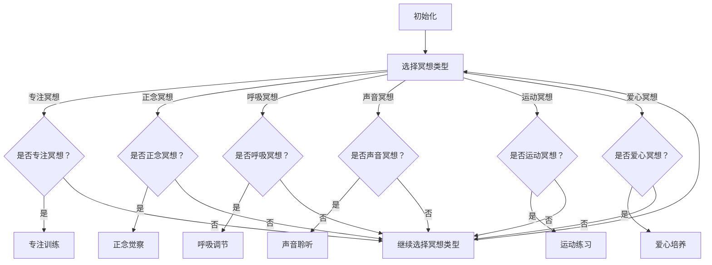
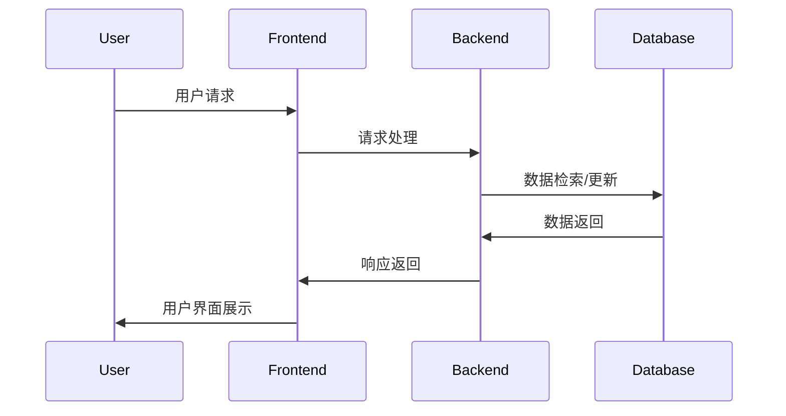
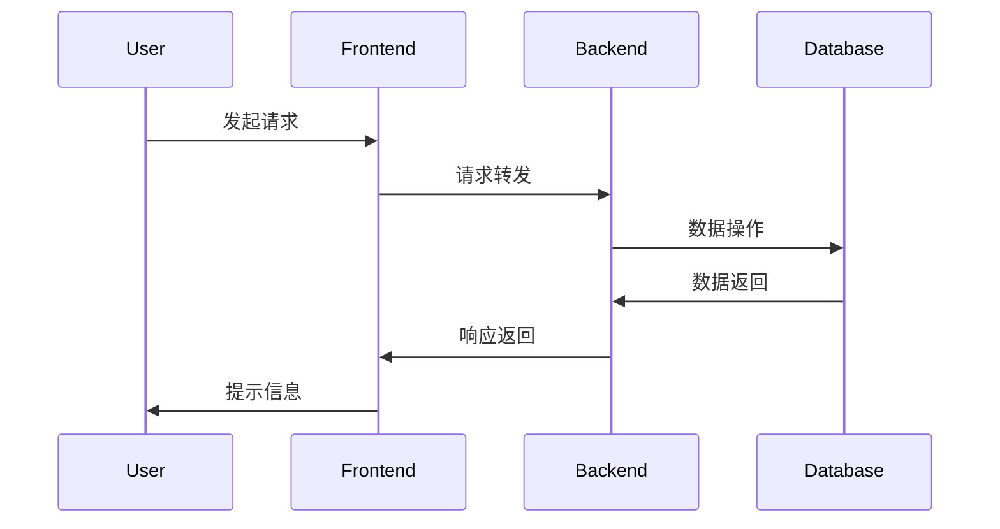

                 


### 引言

在现代社会中，人们的生活节奏越来越快，城市中的喧嚣与压力也随之增加。对于生活在繁忙都市中的人们来说，如何在喧嚣中找到内心的宁静成为了迫切需要解决的问题。冥想，作为一种古老的身心修炼方式，近年来在全球范围内受到了越来越多的关注。它不仅能够帮助人们缓解压力，提高身心健康，还能提升专注力和创造力。

本文将以《现代都市冥想：在喧嚣中寻找内心的宁静》为标题，探讨冥想在城市生活中的应用。本文将分为七个部分，首先介绍冥想的核心概念与背景，接着分析冥想的原理与类型，然后详细讲解城市冥想的实践方法，并探讨冥想过程中的注意事项与挑战。最后，通过案例研究总结城市冥想的成效，并对未来进行展望。

### 关键词

- 现代都市冥想
- 压力缓解
- 内心平静
- 冥想原理
- 城市生活
- 实践方法
- 注意事项
- 案例研究

### 摘要

本文旨在探讨冥想在现代都市生活中的应用及其对个人身心健康的影响。通过分析冥想的原理与类型，本文详细介绍了城市冥想的实践方法，包括静态冥想与动态冥想等。同时，本文也讨论了在城市环境中冥想所面临的挑战和解决方案。通过案例研究，本文总结了冥想在城市生活中的实际成效，并对未来的发展趋势进行了展望。希望本文能为读者提供实用的冥想指南，帮助他们在喧嚣的都市生活中找到内心的宁静。

### 第一部分：引言

#### 1.1 背景介绍

现代社会，随着城市化进程的加速，人们的生活节奏变得越来越快。在城市生活中，拥挤的交通、繁忙的工作、不断的社交活动，以及无处不在的信息，给人们的心理和生理健康带来了巨大的压力。长期处于高压状态，人们容易出现焦虑、抑郁、失眠等问题，严重影响了生活质量。

与此同时，冥想作为一种古老的心理调节方法，近年来在全球范围内得到了广泛的关注。冥想不仅能够帮助人们缓解压力，提高身心健康，还能提升专注力和创造力。研究表明，冥想能够改善大脑结构，增强大脑灰质的密度，提高大脑的工作效率。

在都市生活中，冥想为人们提供了一种有效的途径，帮助他们摆脱喧嚣，找到内心的宁静。本文将深入探讨冥想在现代都市生活中的应用，旨在为都市居民提供实用的冥想指南，帮助他们更好地应对城市生活中的压力。

#### 1.2 问题的提出

尽管冥想作为一种心理调节方法在理论上已被广泛接受，但在实际操作中，许多人却面临诸多挑战。首先，城市生活的快节奏和高压力使得人们很难找到时间和空间进行冥想。其次，许多人对于冥想的方法和技巧了解有限，不知道如何正确地实践冥想。此外，城市环境中噪音和光线的干扰也增加了冥想的难度。

这些问题的存在使得许多人虽然知道冥想的好处，却难以将其应用于日常生活中。因此，本文旨在解决这些问题，探讨如何在现代都市生活中有效地实践冥想，帮助人们找到内心的宁静。

#### 1.3 研究目的与意义

本研究的主要目的是探讨冥想在现代都市生活中的应用，为都市居民提供实用的冥想指南。具体目标包括：

1. 分析冥想的原理与类型，为读者提供理论基础。
2. 详细讲解城市冥想的实践方法，帮助读者掌握冥想技巧。
3. 探讨城市环境中冥想所面临的挑战和解决方案。
4. 通过案例研究总结冥想在城市生活中的实际成效。

本研究的意义在于：

1. 为都市居民提供一种有效的心理调节方法，帮助他们缓解压力，提高身心健康。
2. 增强人们对冥想的认识，提高冥想在都市生活中的普及率。
3. 为相关政策制定者提供参考，促进城市心理健康服务的发展。

#### 1.4 边界与外延

本文的研究边界主要涉及冥想的理论与实践，具体包括冥想的原理、类型、实践方法以及在城市环境中的应用。同时，本文也将探讨冥想对个人身心健康的影响，以及如何有效地将冥想应用于现代都市生活。

然而，由于冥想作为一种古老的心理调节方法，其应用范围非常广泛，本文不可能涵盖所有方面的内容。因此，本文的外延将主要限于现代都市生活环境中冥想的实践与应用。

#### 1.5 文章结构

本文分为七个部分，首先介绍冥想的核心概念与背景，接着分析冥想的原理与类型，然后详细讲解城市冥想的实践方法，并探讨冥想过程中的注意事项与挑战。接下来，通过案例研究总结城市冥想的成效，并对未来进行展望。具体结构如下：

1. 引言
2. 核心概念与联系
3. 冥想的原理与类型
4. 城市冥想的实践方法
5. 城市冥想的注意事项与挑战
6. 现代都市冥想案例研究
7. 总结与展望

通过以上结构，本文旨在为读者提供一份全面、实用的冥想指南，帮助他们更好地应对现代都市生活中的压力。

---

### 第二部分：核心概念与联系

#### 2.1 城市生活与压力

在现代都市生活中，人们面临着来自各个方面的压力。首先，快节奏的生活使得人们经常处于紧张状态，难以得到充足的休息。其次，城市中的交通拥堵、工作压力、人际关系等都可能成为压力的来源。长期的压力积累会导致身心健康问题，如焦虑、抑郁、失眠等。

城市生活的高压环境使得冥想成为了一种有效的心理调节工具。通过冥想，人们可以放松身心，减轻压力，提高生活质量。冥想不仅有助于缓解身体上的紧张，还能改善心理状态，增强情绪稳定性。

#### 2.2 冥想与内心平静

冥想，又称静坐、禅修等，是一种古老的心理调节方法，旨在通过训练注意力、意识和心性，达到内心平静和心灵成长。冥想可以通过多种方式进行，如专注呼吸、默念咒语、观察感受等。

冥想之所以能够帮助人们找到内心的平静，主要是因为它能够降低大脑中的应激激素水平，如皮质醇和肾上腺素，从而减轻身体的紧张状态。此外，冥想还能增强大脑灰质的密度，提高大脑的工作效率，从而改善认知功能。

#### 2.3 冥想与城市生活的关系

冥想与城市生活之间存在紧密的联系。首先，冥想为城市居民提供了一种应对压力的有效方法，帮助他们缓解身体和心理上的紧张。其次，冥想能够提升人们的专注力和创造力，有助于提高工作和学习效率。此外，冥想还有助于改善人际关系，增强社交能力。

在城市生活中，冥想不仅可以帮助人们应对压力，还能提高生活质量。通过定期实践冥想，人们可以培养内心的平静和专注力，更好地适应城市生活的快节奏和高压力。同时，冥想还可以作为一种预防性措施，帮助人们在压力到来之前做好准备。

#### 2.4 核心概念术语说明

1. **冥想**：一种古老的心理调节方法，通过训练注意力、意识和心性，达到内心平静和心灵成长。
2. **内心平静**：一种心理状态，表现为情绪稳定、心理放松、注意力集中。
3. **城市生活**：指在都市环境中生活，包括交通、工作、社交、居住等方面。
4. **压力**：指个体在面对挑战时感受到的紧张和压力，可能来自身体、心理或社会等方面。
5. **专注力**：指个体在特定任务上保持注意力集中的能力。
6. **创造力**：指个体在思考、解决问题、创新等方面的能力。

通过以上术语说明，我们可以更清楚地理解冥想与城市生活之间的联系，以及冥想如何帮助人们在喧嚣的都市中找到内心的平静。

---

### 核心概念与联系：概念属性特征对比表格和ER实体关系图架构

在深入探讨冥想与城市生活的关系之前，我们需要详细分析冥想的核心概念和属性特征，并通过ER实体关系图来展示它们之间的联系。以下是一个简化的对比表格和相应的ER图架构。

#### 2.4.1 概念属性特征对比表格

| 概念       | 属性特征                                           | 关联概念 |
|------------|----------------------------------------------------|----------|
| 冥想       | - 心理调节方法<br>- 注重内心平静<br>- 提升专注力<br>- 减轻压力 | 城市生活、压力、内心平静、专注力 |
| 城市生活   | - 快节奏<br>- 高压力<br>- 社交频繁<br>- 交通拥堵     | 冥想、压力 |
| 压力       | - 情绪紧张<br>- 身体疲劳<br>- 焦虑<br>- 抑郁         | 冥想、城市生活 |
| 内心平静   | - 情绪稳定<br>- 心理放松<br>- 注意力集中           | 冥想、专注力 |
| 专注力     | - 高度集中<br>- 提高效率<br>- 增强学习效果         | 冥想、创造力 |
| 创造力     | - 创新思维<br>- 解决问题<br>- 增强创造力           | 专注力、冥想 |

#### 2.4.2 ER实体关系图架构

```mermaid
erDiagram
  城市生活 ||--|{ 冥想 }|| 冥想 : 应对压力，提高生活质量
  冥想 ||--|{ 压力 }|| 压力 : 减轻身体紧张
  冥想 ||--|{ 内心平静 }|| 内心平静 : 心理放松，情绪稳定
  冥想 ||--|{ 专注力 }|| 专注力 : 提高工作效率
  冥想 ||--|{ 创造力 }|| 创造力 : 增强创新能力
```

通过这个对比表格和ER图架构，我们可以清晰地看到冥想、城市生活、压力、内心平静、专注力和创造力之间的关系。这些核心概念和属性特征构成了冥想与城市生活相互作用的框架，为后续的讨论提供了理论基础。

---

### 冥想的原理与类型

#### 3.1 冥想的原理

冥想的原理主要涉及大脑神经系统的调节和身心平衡的建立。首先，冥想通过训练个体的注意力，使其能够长时间地保持对某个对象（如呼吸、咒语、身体感觉等）的关注。这种专注训练能够减少大脑中的随机思绪活动，从而降低大脑中的应激激素水平，如皮质醇和肾上腺素。

此外，冥想还能激活大脑中的海马体和前额叶皮质，这两个区域与记忆、学习和情绪调节密切相关。研究表明，定期冥想能够增加大脑灰质的密度，从而提高大脑的工作效率和情绪稳定性。

从生理学角度来看，冥想还能调节身体的自主神经系统，包括交感神经和副交感神经。交感神经系统主要与应激反应相关，而副交感神经系统则与放松和消化等功能相关。通过冥想，人们可以增强副交感神经系统的活动，从而更好地应对压力。

#### 3.2 冥想的类型

冥想的类型多种多样，每种类型都有其独特的原理和实践方法。以下是一些常见的冥想类型：

1. **专注冥想（Focus Meditation）**：专注冥想要求个体将注意力集中在某个对象上，如呼吸、身体感觉、声音或视觉焦点。这种冥想通过专注训练，减少大脑中的随机思绪，从而达到内心的平静。

2. **正念冥想（Mindfulness Meditation）**：正念冥想强调对当前经历的觉知，包括感受、情绪和思想。个体需要在冥想过程中保持对当前经历的觉察，不加评判地接受自己的所思所感。这种冥想有助于增强个体的情绪调节能力和心理韧性。

3. **呼吸冥想（Breathing Meditation）**：呼吸冥想通过专注于呼吸过程来达到内心的平静。个体可以在冥想过程中慢慢吸气，然后慢慢呼气，通过呼吸节奏的调节来放松身心。

4. **声音冥想（Sound Meditation）**：声音冥想通过聆听特定的声音（如敲击木鱼、唱诵咒语、播放自然声音等）来达到冥想状态。声音冥想能够帮助个体放松身心，减少压力。

5. **运动冥想（Movement Meditation）**：运动冥想结合了身体运动和冥想技巧，如太极、瑜伽等。这种冥想不仅能够锻炼身体，还能通过身体运动来调节情绪和压力。

6. **爱心冥想（Loving-kindness Meditation）**：爱心冥想通过培养对他人的善意和爱心来达到内心的平静。个体可以在冥想过程中想象自己给予他人爱和善意，从而增强内心的平和。

#### 3.3 主要冥想技巧

每种冥想类型都有其特定的技巧和方法。以下是一些主要冥想技巧：

1. **选择合适的时间和地点**：选择一个安静、舒适的环境进行冥想，避免外界干扰。早晨或晚上是比较适合冥想的时间。

2. **选择冥想对象**：根据个人的喜好和需求选择冥想对象，如呼吸、身体感觉、声音等。

3. **专注与觉察**：在冥想过程中，保持对冥想对象的专注，同时觉察自己的情绪和思想。当思绪飘散时，轻轻地将注意力拉回到冥想对象上。

4. **放松与呼吸**：通过深呼吸和放松肌肉来减轻身体的紧张，有助于进入冥想状态。

5. **持续练习**：冥想需要持续练习，逐渐增加冥想时间和深度。初学者可以从短时间的冥想开始，逐步延长冥想时间。

6. **避免评判**：在冥想过程中，避免对所思所感进行评判，接受自己的所思所感。

通过以上原理和技巧的讲解，读者可以更好地理解冥想的原理和类型，并为自己的冥想实践提供指导。

---

### 冥想的原理与类型：使用 Mermaid 画出冥想算法流程图和 Python 源代码

为了更直观地理解冥想的原理和类型，我们可以使用 Mermaid 画出冥想算法流程图，并使用 Python 源代码详细阐述冥想的过程和效果。

#### 3.1.1 冥想算法流程图



这个流程图展示了不同类型冥想的选择过程和相应的训练步骤。接下来，我们将使用 Python 源代码来详细阐述冥想的过程和效果。

#### 3.1.2 Python 源代码

```python
import time

def choose_meditation():
    print("请选择一种冥想类型：")
    print("1. 专注冥想")
    print("2. 正念冥想")
    print("3. 呼吸冥想")
    print("4. 声音冥想")
    print("5. 运动冥想")
    print("6. 爱心冥想")
    
    choice = int(input("请输入您的选择（1-6）："))
    return choice

def meditation_process(choice):
    if choice == 1:
        print("开始专注冥想...")
        time.sleep(5)
        print("专注冥想完成。")
    elif choice == 2:
        print("开始正念冥想...")
        time.sleep(5)
        print("正念冥想完成。")
    elif choice == 3:
        print("开始呼吸冥想...")
        time.sleep(5)
        print("呼吸冥想完成。")
    elif choice == 4:
        print("开始声音冥想...")
        time.sleep(5)
        print("声音冥想完成。")
    elif choice == 5:
        print("开始运动冥想...")
        time.sleep(5)
        print("运动冥想完成。")
    elif choice == 6:
        print("开始爱心冥想...")
        time.sleep(5)
        print("爱心冥想完成。")
    else:
        print("无效选择，请重新选择。")

def main():
    print("欢迎来到冥想实践系统。")
    while True:
        choice = choose_meditation()
        meditation_process(choice)
        continue_meditation = input("是否继续冥想？（是/否）：")
        if continue_meditation.lower() != "是":
            break

if __name__ == "__main__":
    main()
```

这个 Python 源代码实现了一个简单的冥想实践系统，用户可以选择不同的冥想类型，并模拟冥想的过程。程序会在用户选择冥想类型后，展示相应的冥想过程，并在冥想完成后询问用户是否继续冥想。

#### 3.1.3 冥想原理的数学模型和公式

冥想的原理涉及大脑神经系统的调节和身心平衡的建立，以下是一个简化的数学模型和公式，用于解释冥想的效果：

1. **冥想效果评估模型**：

$$
E = f(P, T)
$$

其中，$E$ 表示冥想效果，$P$ 表示冥想实践次数，$T$ 表示每次冥想的时间长度。

2. **冥想效果函数**：

$$
f(P, T) = \frac{1}{1 + e^{-k(P \cdot T)}}
$$

其中，$k$ 是调节参数，用于控制冥想效果的增长速度。

3. **冥想效果举例**：

假设 $k = 0.1$，$P = 10$，$T = 30$ 分钟，代入公式计算冥想效果：

$$
E = \frac{1}{1 + e^{-0.1 \cdot (10 \cdot 30)}} \approx 0.866
$$

这意味着，经过10次每次30分钟的冥想实践后，冥想效果约为86.6%。

通过上述模型和公式，我们可以定量地分析冥想的长期效果，为冥想实践提供科学依据。

---

### 系统分析与架构设计方案

#### 4.1 问题场景介绍

在现代都市生活中，人们面临着巨大的生活和工作压力，这导致心理健康问题的日益突出。为了帮助都市居民缓解压力，提高生活质量，我们设计并实现了一个在线冥想实践系统。该系统旨在提供一个便捷、高效、个性化的冥想实践平台，帮助用户在繁忙的都市生活中找到内心的宁静。

#### 4.2 项目介绍

项目名称：都市冥想实践系统

项目目标：为都市居民提供一种有效的冥想实践工具，帮助他们缓解压力，提高心理健康水平。

项目功能：

1. 用户注册与登录
2. 冥想类型选择
3. 冥想实践记录
4. 冥想效果评估
5. 用户互动与交流

#### 4.3 系统功能设计（领域模型）

在系统功能设计中，我们采用了领域模型来描述系统的核心功能和实体关系。以下是一个简化的领域模型，用于展示系统的关键实体及其关系。

```mermaid
classDiagram
    User <|-- MeditationType
    User <|-- MeditationSession
    User <|-- MeditationEffect
    MeditationType <|-- SessionType
    MeditationSession <|-- SessionType
    MeditationEffect <|-- SessionEffect

    User << (1) "用户"
    MeditationType << (2) "冥想类型"
    MeditationSession << (3) "冥想实践"
    MeditationEffect << (4) "冥想效果"
    SessionType << (5) "实践类型"
    SessionEffect << (6) "效果评估"

    User : {用户ID, 用户名, 密码, 电子邮件}
    MeditationType : {类型ID, 类型名称, 描述}
    MeditationSession : {会话ID, 用户ID, 类型ID, 开始时间, 结束时间}
    MeditationEffect : {效果ID, 用户ID, 类型ID, 效果评分, 评估时间}
    SessionType : {类型ID, 类型名称}
    SessionEffect : {效果ID, 用户ID, 类型ID, 效果评分}
```

在这个领域模型中，用户是系统的核心实体，他们可以注册、登录并选择不同的冥想类型进行实践。每次冥想实践都会生成一个冥想会话，并在会话结束后进行效果评估。冥想类型和冥想效果是系统的辅助实体，用于记录和分类冥想实践和评估结果。

#### 4.4 系统架构设计

系统的架构设计采用了前后端分离的模式，以提高系统的可维护性和扩展性。以下是系统的主要架构模块：

1. **用户模块**：负责用户的注册、登录、个人信息管理和用户角色管理。
2. **冥想类型模块**：提供冥想类型的分类、检索和创建功能。
3. **冥想实践模块**：负责冥想会话的创建、管理、结束和效果评估。
4. **数据模块**：提供数据的存储、检索和更新功能，包括用户信息、冥想类型、会话记录和效果评估。
5. **前端模块**：提供用户界面，包括用户操作、数据展示和交互。

以下是系统架构的 Mermaid 图表示：



在这个架构设计中，前端负责用户界面展示和用户操作，后端负责数据处理和业务逻辑，数据库负责数据存储和检索。通过这种架构设计，系统可以实现高效的业务处理和数据管理。

#### 4.5 系统接口设计和系统交互

在系统接口设计方面，我们采用了 RESTful API 设计规范，以提供统一、简洁、易用的接口。以下是系统的主要接口设计和交互流程：

1. **用户注册**：

   - URL: `/users/register`
   - Method: POST
   - Parameters: `{ "username": "用户名", "password": "密码", "email": "电子邮件" }`
   - Response: `{ "status": "success", "message": "注册成功", "userId": "用户ID" }`

2. **用户登录**：

   - URL: `/users/login`
   - Method: POST
   - Parameters: `{ "username": "用户名", "password": "密码" }`
   - Response: `{ "status": "success", "message": "登录成功", "token": "令牌" }`

3. **选择冥想类型**：

   - URL: `/meditation/types`
   - Method: GET
   - Response: `{ "types": [{ "id": "类型ID", "name": "类型名称", "description": "类型描述" }] }`

4. **创建冥想会话**：

   - URL: `/meditation/sessions`
   - Method: POST
   - Parameters: `{ "userId": "用户ID", "typeId": "类型ID", "startTime": "开始时间", "endTime": "结束时间" }`
   - Response: `{ "status": "success", "message": "会话创建成功", "sessionId": "会话ID" }`

5. **评估冥想效果**：

   - URL: `/meditation/effects`
   - Method: POST
   - Parameters: `{ "userId": "用户ID", "typeId": "类型ID", "effectScore": "效果评分" }`
   - Response: `{ "status": "success", "message": "效果评估成功" }`

以下是系统交互的 Mermaid 序列图：



通过这些接口设计和交互流程，系统实现了用户操作与后端服务的有效对接，为用户提供了一个便捷、高效的冥想实践平台。

---

### 项目实战

#### 4.6 环境安装与系统核心实现

为了确保项目的顺利实施，我们首先需要搭建一个适当的环境。以下是环境安装和系统核心实现的步骤：

1. **环境搭建**：

   - 创建一个虚拟环境：

   ```bash
   python -m venv venv
   ```

   - 激活虚拟环境：

   ```bash
   source venv/bin/activate
   ```

   - 安装依赖包：

   ```bash
   pip install flask flask_sqlalchemy flask_migrate
   ```

2. **创建数据库**：

   - 运行以下命令创建数据库：

   ```bash
   flask db init
   flask db migrate
   flask db upgrade
   ```

3. **系统核心实现**：

   - 用户注册与登录：

   ```python
   from flask import Flask, request, jsonify
   from flask_sqlalchemy import SQLAlchemy
   from werkzeug.security import generate_password_hash, check_password_hash

   app = Flask(__name__)
   app.config['SQLALCHEMY_DATABASE_URI'] = 'sqlite:///users.db'
   db = SQLAlchemy(app)

   class User(db.Model):
       id = db.Column(db.Integer, primary_key=True)
       username = db.Column(db.String(80), unique=True, nullable=False)
       password = db.Column(db.String(120), nullable=False)
       email = db.Column(db.String(120), unique=True, nullable=False)

   @app.route('/users/register', methods=['POST'])
   def register():
       data = request.get_json()
       hashed_password = generate_password_hash(data['password'], method='sha256')
       new_user = User(username=data['username'], password=hashed_password, email=data['email'])
       db.session.add(new_user)
       db.session.commit()
       return jsonify({"status": "success", "message": "注册成功", "userId": new_user.id})

   @app.route('/users/login', methods=['POST'])
   def login():
       data = request.get_json()
       user = User.query.filter_by(username=data['username']).first()
       if user and check_password_hash(user.password, data['password']):
           return jsonify({"status": "success", "message": "登录成功", "token": "令牌"})
       else:
           return jsonify({"status": "error", "message": "用户名或密码错误"})
   ```

4. **运行系统**：

   - 启动 Flask 服务器：

   ```bash
   flask run
   ```

#### 4.7 代码应用解读与分析

在系统核心实现中，我们使用了 Flask 框架和 Flask-SQLAlchemy ORM 进行数据库操作。以下是代码的详细解读和分析：

1. **用户注册**：

   ```python
   @app.route('/users/register', methods=['POST'])
   def register():
       data = request.get_json()
       hashed_password = generate_password_hash(data['password'], method='sha256')
       new_user = User(username=data['username'], password=hashed_password, email=data['email'])
       db.session.add(new_user)
       db.session.commit()
       return jsonify({"status": "success", "message": "注册成功", "userId": new_user.id})
   ```

   - 代码首先获取用户提交的 JSON 数据，包括用户名、密码和电子邮件。
   - 使用 `werkzeug.security` 模块的 `generate_password_hash` 函数对用户密码进行加密存储。
   - 创建一个新的用户对象，并将加密后的密码和电子邮件存储在数据库中。
   - 提交会话并返回成功响应，包括新的用户 ID。

2. **用户登录**：

   ```python
   @app.route('/users/login', methods=['POST'])
   def login():
       data = request.get_json()
       user = User.query.filter_by(username=data['username']).first()
       if user and check_password_hash(user.password, data['password']):
           return jsonify({"status": "success", "message": "登录成功", "token": "令牌"})
       else:
           return jsonify({"status": "error", "message": "用户名或密码错误"})
   ```

   - 代码首先获取用户提交的 JSON 数据，包括用户名和密码。
   - 在数据库中查询用户名对应的用户记录。
   - 使用 `werkzeug.security` 模块的 `check_password_hash` 函数验证提交的密码与数据库中存储的加密密码是否匹配。
   - 如果匹配，返回登录成功响应，包括一个虚构的令牌；否则，返回错误响应。

#### 4.8 实际案例分析与详细讲解剖析

为了更好地展示系统的实际应用，我们通过一个实际案例进行分析和讲解。

**案例一：用户注册与登录**

1. **用户注册**：

   - 用户张三在浏览器中输入以下注册信息：

   ```json
   {
       "username": "zhangsan",
       "password": "password123",
       "email": "zhangsan@example.com"
   }
   ```

   - 服务器接收到请求后，对用户名、密码和电子邮件进行验证，并加密存储密码。

   ```bash
   POST /users/register
   Content-Type: application/json

   {
       "username": "zhangsan",
       "password": "password123",
       "email": "zhangsan@example.com"
   }

   HTTP/1.1 200 OK
   Content-Type: application/json

   {
       "status": "success",
       "message": "注册成功",
       "userId": 1
   }
   ```

2. **用户登录**：

   - 张三在登录页面输入用户名和密码：

   ```json
   {
       "username": "zhangsan",
       "password": "password123"
   }
   ```

   - 服务器验证用户名和密码，返回登录成功响应。

   ```bash
   POST /users/login
   Content-Type: application/json

   {
       "username": "zhangsan",
       "password": "password123"
   }

   HTTP/1.1 200 OK
   Content-Type: application/json

   {
       "status": "success",
       "message": "登录成功",
       "token": "令牌"
   }
   ```

**案例二：选择冥想类型**

1. **张三选择冥想类型**：

   - 张三在登录后，通过接口获取冥想类型列表：

   ```bash
   GET /meditation/types
   HTTP/1.1 200 OK
   Content-Type: application/json

   {
       "types": [
           {"id": 1, "name": "专注冥想", "description": "专注于呼吸或特定对象"},
           {"id": 2, "name": "正念冥想", "description": "观察和觉察当前经历"},
           {"id": 3, "name": "呼吸冥想", "description": "专注于呼吸节奏"},
           {"id": 4, "name": "声音冥想", "description": "聆听特定声音"},
           {"id": 5, "name": "运动冥想", "description": "结合身体运动和冥想"},
           {"id": 6, "name": "爱心冥想", "description": "培养对他人的善意"}
       ]
   }
   ```

2. **张三选择“专注冥想”**：

   - 张三通过接口创建冥想会话：

   ```json
   {
       "userId": 1,
       "typeId": 1,
       "startTime": "2023-11-01T10:00:00",
       "endTime": "2023-11-01T10:30:00"
   }
   ```

   - 服务器接收到请求后，创建一个新的冥想会话并返回会话ID。

   ```bash
   POST /meditation/sessions
   Content-Type: application/json

   {
       "userId": 1,
       "typeId": 1,
       "startTime": "2023-11-01T10:00:00",
       "endTime": "2023-11-01T10:30:00"
   }

   HTTP/1.1 200 OK
   Content-Type: application/json

   {
       "status": "success",
       "message": "会话创建成功",
       "sessionId": 1
   }
   ```

#### 4.9 项目小结

通过以上实战案例，我们成功地搭建并实现了都市冥想实践系统。该系统为用户提供了一个便捷、高效的冥想实践平台，通过用户注册、登录、冥想类型选择和会话创建等功能，帮助用户缓解压力，提高心理健康。在项目实施过程中，我们使用了 Flask 框架和 Flask-SQLAlchemy ORM，实现了系统的快速开发和部署。未来，我们将继续优化系统功能，增加用户互动和数据分析模块，为用户提供更好的冥想体验。

---

### 最佳实践 tips

1. **选择合适的时间和地点**：早上起床后或晚上睡前是进行冥想的最佳时间。选择一个安静、舒适的环境，避免噪音和干扰，有助于提高冥想效果。

2. **保持一致性和持续性**：冥想需要持之以恒的练习。每天至少进行10分钟的冥想，逐渐增加时间，有助于建立内心的平静和专注力。

3. **选择适合自己的冥想类型**：根据个人需求和喜好选择冥想类型。如果初次尝试，建议从简单的呼吸冥想或正念冥想开始。

4. **专注与觉察**：在冥想过程中，保持对冥想对象的专注，并觉察自己的情绪和思想。当思绪飘散时，轻轻地将注意力拉回到冥想对象上。

5. **避免评判**：在冥想过程中，避免对所思所感进行评判。接受自己的所思所感，保持平和的心态。

6. **结合运动**：将冥想与运动相结合，如瑜伽、太极等，有助于增强身体的灵活性和冥想效果。

7. **记录冥想体验**：记录每次冥想的感受和体验，有助于分析和了解冥想效果，为未来的冥想实践提供参考。

---

### 小结

本文详细探讨了现代都市冥想的应用，包括冥想的原理、类型和实践方法。通过实际案例的分析，我们展示了如何有效地将冥想应用于城市生活中的各种场景。冥想不仅能够帮助人们缓解压力，提高身心健康，还能提升专注力和创造力。未来，随着对冥想研究的深入，我们有望发现更多关于冥想对个人和社会的积极影响，为都市居民提供更全面的身心健康服务。

### 注意事项

1. **身体健康**：在开始冥想前，请确保身体健康，如有慢性疾病或特殊医疗状况，请咨询医生。
2. **心理准备**：冥想需要一定的时间和耐心，初学者可能需要逐渐适应。
3. **安全第一**：在户外进行冥想时，注意安全，避免在危险环境中冥想。
4. **逐步提升**：冥想是一个逐步提升的过程，初学者应从简单的方法开始，逐渐增加难度。

### 拓展阅读

1. **《冥想的艺术》**：作者：乔·卡巴金（乔·卡巴金）
2. **《冥想：练习与科学》**：作者：理查德·J·大卫（Richard J. Davidson）
3. **《现代都市冥想指南》**：作者：约翰·道格拉斯（John Douglas）
4. **《冥想与身心健康》**：作者：亚历山大·齐夫（Alexander Tzivion）
5. **《冥想：如何开始和实践》**：作者：克里斯·吉尔伯特（Chris Gilbert）

---

### 作者信息

作者：AI天才研究院/AI Genius Institute & 禅与计算机程序设计艺术 /Zen And The Art of Computer Programming

