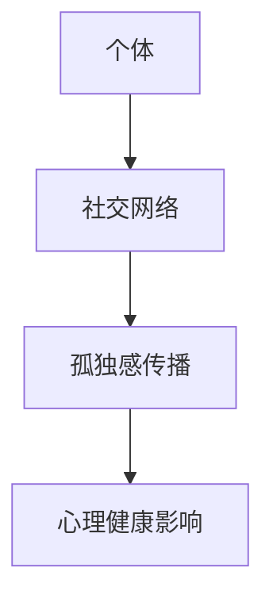
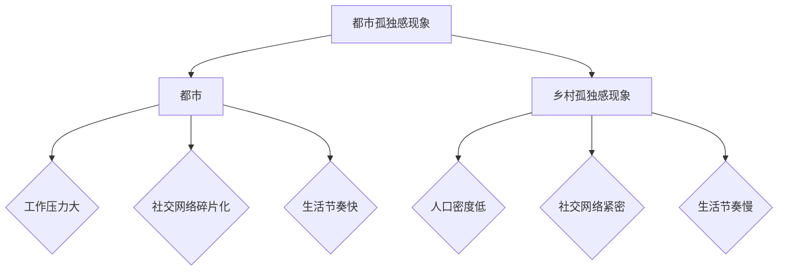
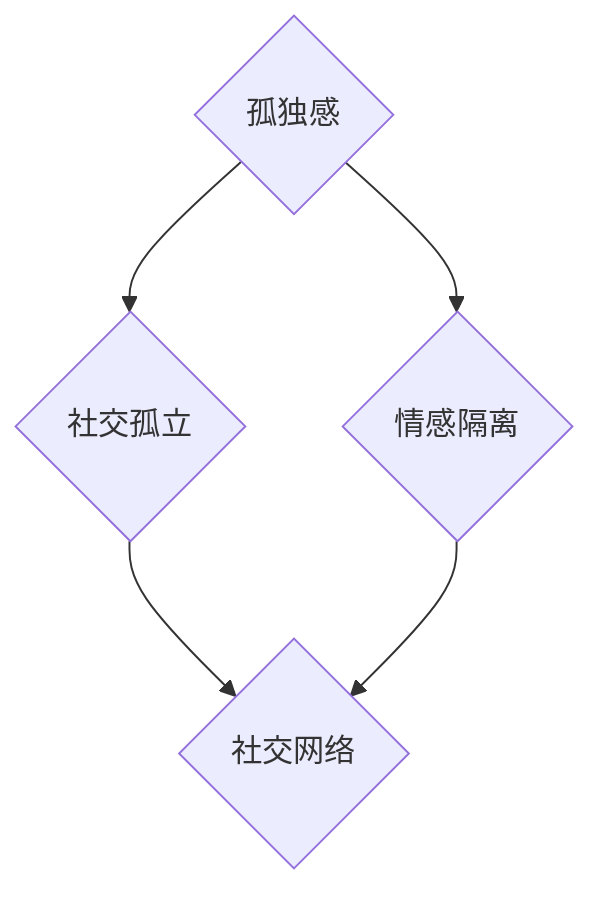
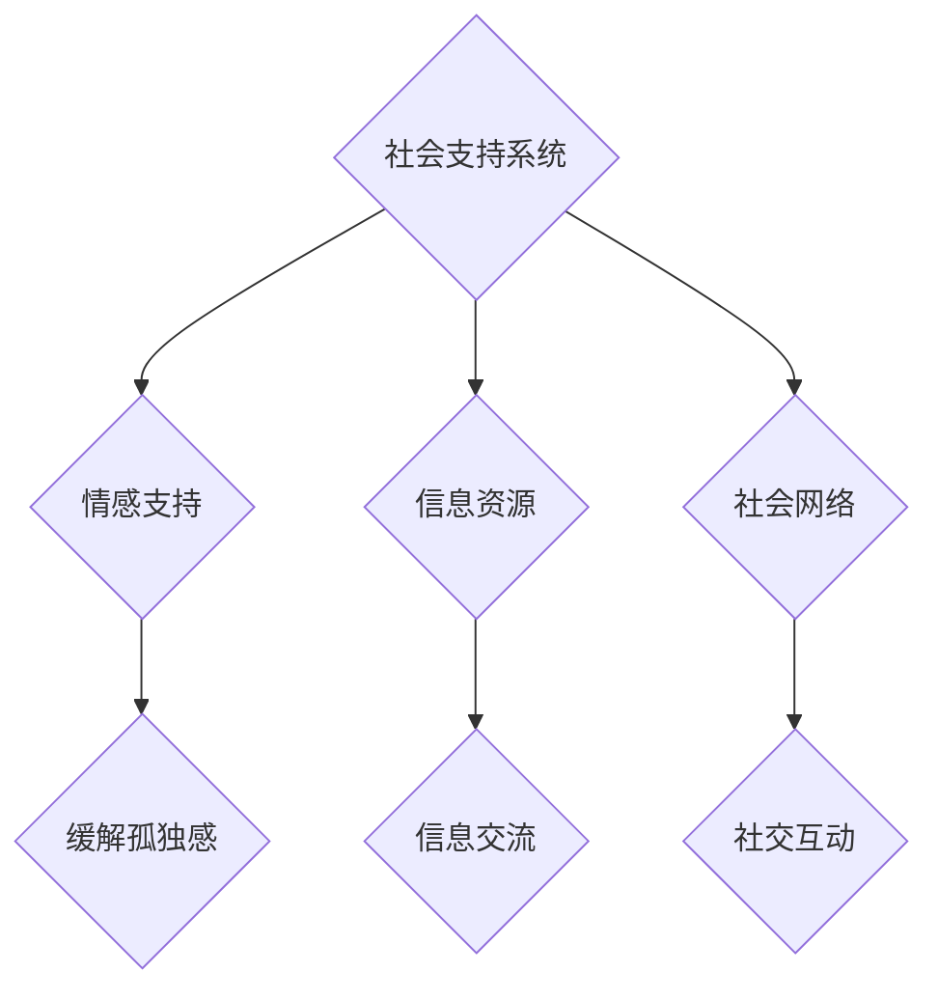
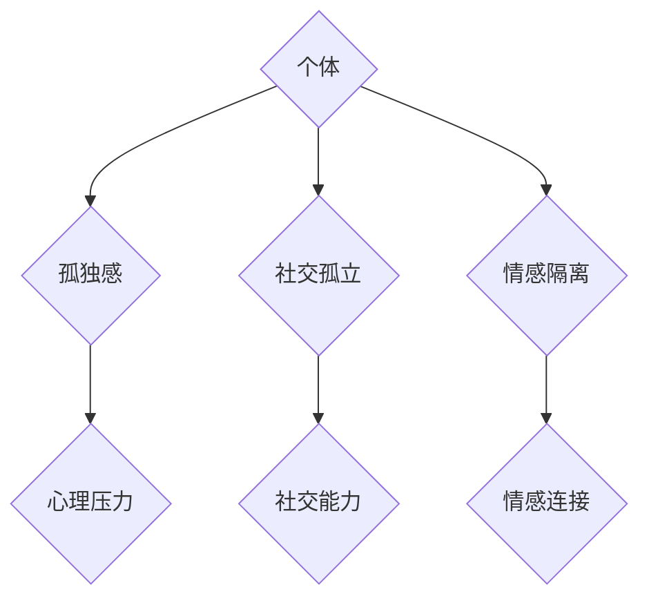
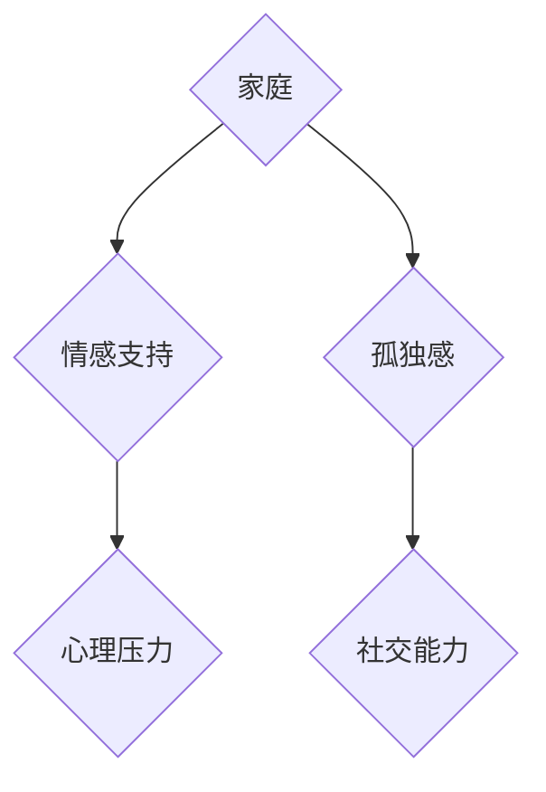
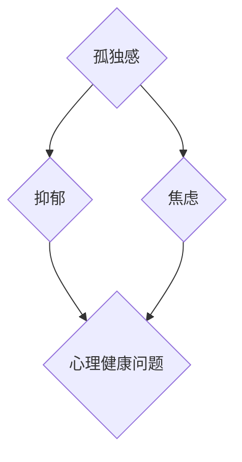
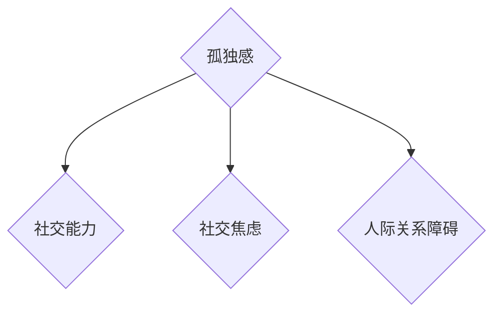
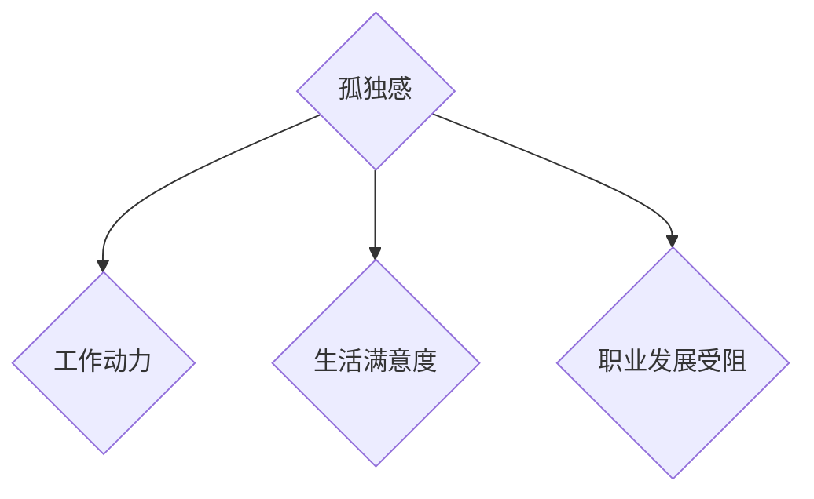
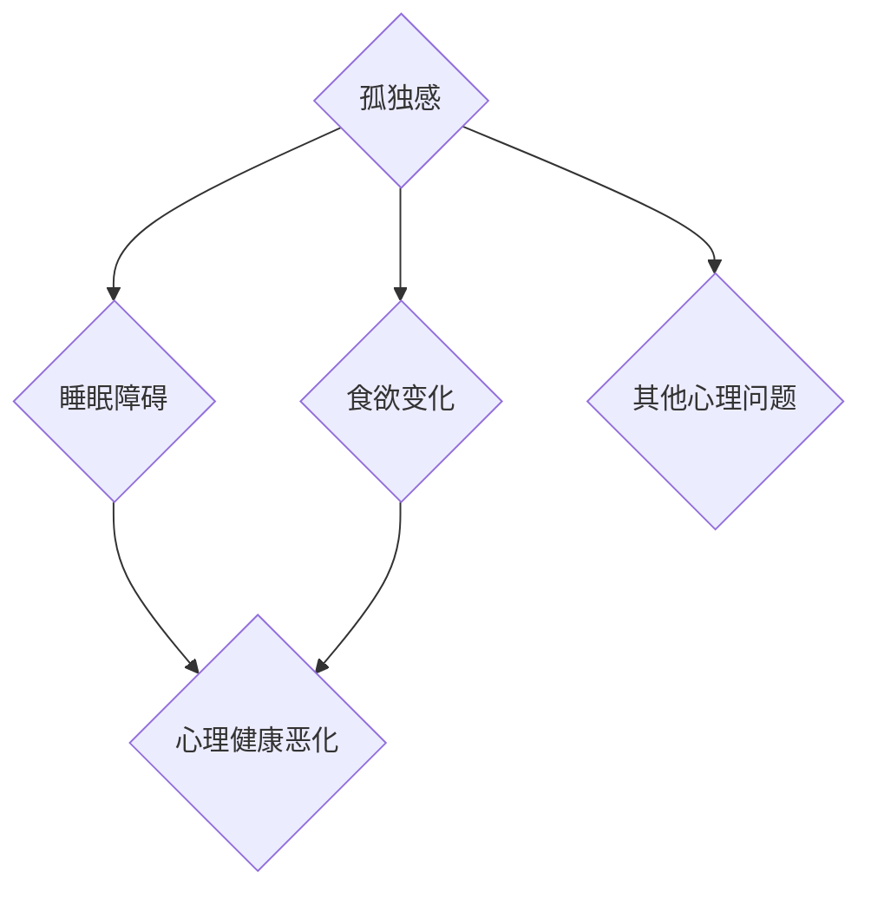

                 

**现代都市生活中的孤独感：原因、影响及应对**

摘要：本文旨在探讨现代都市生活中孤独感的成因、影响及应对策略。通过系统的分析，本文将揭示孤独感的定义及其与社交孤立、情感隔离的区别，分析孤独感在都市生活中的现象和影响。随后，本文将探讨孤独感的核心概念与联系，以及其对社会支持系统、家庭结构和社交能力的影响。在此基础上，本文将提出一系列应对孤独感的策略，包括心理调适、社交技能提升、环境调整和社会支持系统的建立。最后，通过实际案例分析和最佳实践总结，本文将为读者提供实用的应对孤独感的建议。

## 第1章：孤独感的定义与现象分析

### 1.1 孤独感的定义

孤独感是指个体在社交和情感层面上感受到的孤立和缺失。这种感觉可能源于缺乏亲密关系、社交网络的缺失或与他人的情感连接不足。孤独感不仅仅是一种情感体验，它还可能对个体的心理健康产生深远的影响。

在技术领域，我们可以将孤独感视为一种“状态监控指标”。通过分析孤独感在社交网络中的传播路径和影响范围，我们可以更好地理解其在现代都市生活中的作用。以下是一个简单的 Mermaid 流程图，展示了孤独感在社交网络中的传播过程：

在这个流程图中，个体通过社交网络与其他人建立联系，当个体感受到孤独时，这种情感会在社交网络中传播，最终可能影响个体的心理健康。

### 1.2 现代都市孤独感的现象分析

现代都市生活节奏快，人们常常因为工作忙碌而忽视了与家人和朋友的互动。这种情况下，孤独感在都市人群中变得尤为普遍。以下是一个关于都市孤独感现象的表格，对比了都市与乡村环境中的孤独感差异：

### 1.3 孤独感的边界与外延

孤独感与社交孤立、情感隔离是相关的概念，但它们之间有明确的边界。社交孤立通常指的是缺乏社交联系的状态，而情感隔离则是指个体与他人之间的情感距离。以下是一个 Mermaid ER 实体关系图，展示了这三个概念之间的关系：

### 1.4 核心概念：孤独感、社交孤立、情感隔离

孤独感、社交孤立和情感隔离是理解现代都市生活中孤独现象的重要核心概念。它们之间的关系和区别如下：

- **孤独感**：个体在社交和情感层面上感受到的孤立和缺失。
- **社交孤立**：缺乏社交联系的状态。
- **情感隔离**：个体与他人之间的情感距离。

这些概念在心理健康和社会互动中扮演着关键角色，下面是一个简单的 Mermaid 类图，展示了这三个概念的基本结构和关系：

## 第2章：孤独感的核心概念与联系

### 2.1 社会支持系统的概念与功能

社会支持系统是指个体在面临生活压力和挑战时，从家人、朋友、社区和其他社会资源中获得的帮助和支持。一个有效的社会支持系统可以提供情感支持、信息资源和社会网络，帮助个体应对孤独感和心理压力。

以下是一个关于社会支持系统的 Mermaid 类图，展示了其核心要素和功能：

### 2.2 社交网络的属性特征对比表格

社交网络的属性特征对于理解孤独感至关重要。以下是一个对比表格，列出了社交网络的主要属性特征：

| 特征         | 社交网络A | 社交网络B | 社交网络C |
| ------------ | ---------- | ---------- | ---------- |
| 人口密度     | 高         | 中         | 低         |
| 连接紧密度   | 松散       | 中等       | 紧密       |
| 信息流通速度 | 快         | 中         | 慢         |
| 社交互动频率 | 高         | 中         | 低         |

通过对比不同社交网络的属性特征，我们可以更好地理解它们对孤独感的影响。

### 2.3 ER实体关系图架构

ER（实体关系）图是数据库设计和数据建模的重要工具。以下是一个简单的 ER 图，展示了孤独感相关的实体和它们之间的关系：

### 2.4 家庭与孤独感的关系分析

家庭是现代社会中最基本的社会单元，对个体的心理健康和生活满意度有着重要影响。以下是一个关于家庭与孤独感关系的 Mermaid 流程图：

通过分析家庭在孤独感产生和发展中的作用，我们可以更好地理解孤独感的内在机制。

## 第3章：孤独感的影响

### 3.1 心理健康的影响

孤独感对心理健康有着显著的负面影响。研究表明，长期感到孤独的人更容易出现抑郁、焦虑和心理健康问题。以下是一个关于孤独感与心理健康关系的 Mermaid 流程图：

### 3.2 社交能力的影响

孤独感还会影响个体的社交能力，导致个体在社交场合中表现出不自在、焦虑和难以建立深层次的人际关系。以下是一个关于孤独感与社交能力关系的 Mermaid 流程图：

### 3.3 工作与生活满意度的影响

孤独感不仅影响心理健康和社交能力，还会影响个体的工作表现和生活满意度。长期感到孤独的人往往在工作中缺乏动力，生活满意度较低。以下是一个关于孤独感与工作生活满意度关系的 Mermaid 流程图：

### 3.4 孤独感与其他心理问题的关系

孤独感与其他心理问题之间存在复杂的相互作用。例如，孤独感可能导致个体出现睡眠障碍、食欲变化等生理症状，而这些症状又可能加剧孤独感。以下是一个关于孤独感与其他心理问题关系的 Mermaid 流程图：

## 第4章：孤独感的应对策略

### 4.1 心理调适方法

心理调适是应对孤独感的重要策略。以下是一些心理调适方法：

1. **认知行为疗法（CBT）**：通过改变负面思维模式和行为习惯来缓解孤独感。
2. **情感调节技巧**：学习如何识别和调节自己的情感，以减少孤独感的体验。

### 4.2 社交技能提升

提升社交技能可以帮助个体更好地融入社交环境。以下是一些提升社交技能的方法：

1. **参与社交活动**：参加兴趣小组、俱乐部或社区活动，以扩大社交圈。
2. **学习社交技巧**：通过阅读书籍、观看视频或参加工作坊来学习社交技巧。

### 4.3 环境调整策略

环境调整可以改变个体所处的社交环境，从而减轻孤独感。以下是一些环境调整策略：

1. **改善居住环境**：选择居住在一个社交氛围更好的社区。
2. **改变工作环境**：通过调整工作时间或工作地点来改善社交机会。

### 4.4 社会支持系统的建立

建立有效的社会支持系统可以帮助个体应对孤独感。以下是一些建立社会支持系统的建议：

1. **建立亲密关系**：培养与家人、朋友和爱人的亲密关系。
2. **加入社区组织**：参与社区活动，建立与邻居和志愿者的联系。

## 第5章：孤独感的应对案例分析

### 5.1 案例一：通过心理咨询缓解孤独感

一个30岁的都市白领因为长时间的工作压力和缺乏社交互动，感到孤独和焦虑。通过接受心理咨询，他学会了认知行为疗法和情感调节技巧，逐渐改善了孤独感和心理健康状况。

### 5.2 案例二：通过社交活动改善孤独感

一位退休老人，由于子女都工作繁忙，很少回家探望，感到孤独。他加入了社区的老年活动中心，通过参与各种社交活动，如舞蹈、手工制作和旅游，结识了许多新朋友，孤独感得到了缓解。

### 5.3 案例三：通过职业规划应对孤独感

一位技术工程师因为工作压力大，经常加班，感到孤独和失落。通过职业规划，他调整了工作节奏，找回了工作的激情，同时也参加了一些技术社区活动，扩大了社交圈，孤独感得到了显著缓解。

## 第6章：孤独感的最佳实践

### 6.1 最佳实践 tips

- **定期进行自我反思**：了解自己的情感状态，识别孤独感的早期迹象。
- **建立健康的生活习惯**：保持规律的作息时间，均衡饮食，适量运动。

### 6.2 小结

孤独感是现代都市生活中的一个普遍现象，对个体的心理健康、社交能力和工作满意度都有显著的负面影响。通过心理调适、社交技能提升、环境调整和社会支持系统的建立，可以有效应对孤独感。

### 6.3 注意事项

- **不要忽视孤独感**：孤独感是一种常见的情感体验，但如果不及时处理，可能演变成更严重的问题。
- **寻求专业帮助**：如果孤独感严重影响到日常生活，应寻求心理咨询或其他专业帮助。

### 6.4 拓展阅读

- **《孤独六讲》- 龙应台**：从社会学和哲学的角度探讨孤独现象。
- **《社交心理学》- 戴维·迈尔斯**：深入探讨社交行为和心理机制。

## 作者信息

作者：AI天才研究院/AI Genius Institute & 禅与计算机程序设计艺术 /Zen And The Art of Computer Programming

