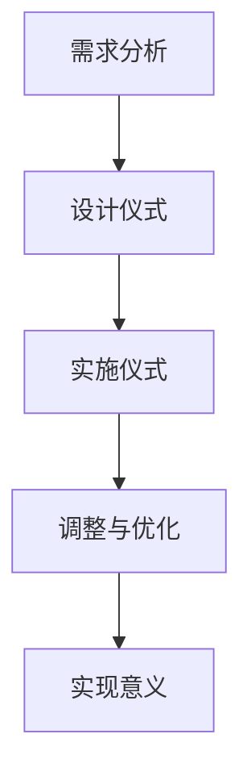
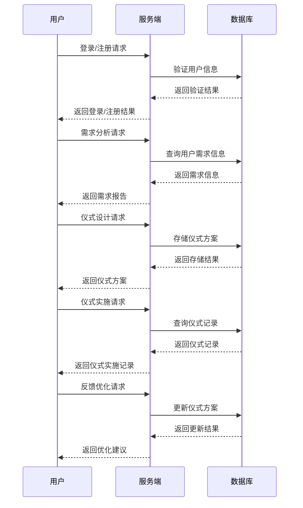

                 


### 生命仪式：赋予日常生活的意义

#### 关键词：
- 生命仪式
- 日常生活意义
- 仪式感
- 心理学
- 社会文化

#### 摘要：
本文将探讨如何通过生命仪式来赋予日常生活意义，提升生活质量。我们将从背景介绍、核心概念与联系、算法原理讲解、系统分析与架构设计、项目实战等多个方面展开，旨在帮助读者理解并实践如何将仪式感融入日常生活，使其更具意义和价值。

----------------------------------------------------------------

### 第一部分：背景介绍

#### 核心概念

**生命仪式**：生命仪式是指人们在日常生活中通过某种形式和仪式来赋予生命意义和仪式感的行为。这些仪式可以是宗教信仰、传统习俗、个人仪式，或者是社会活动等。它们是文化、历史和个体信仰的体现，旨在增强生活的仪式感和幸福感。

**日常生活的意义**：日常生活的意义指的是在日常生活中找到存在感和价值感的理由。这可以是工作、学习、社交、爱好等各种形式，它们让我们的生活变得丰富而有目的。

#### 问题背景

在现代社会，随着生活节奏的加快和压力的增加，很多人感到自己的生活缺乏意义和目标。这种现象在年轻人和中年人中尤为明显，他们常常在忙碌的工作和生活之间感到迷茫。此外，随着科技的快速发展，人们的生活方式也在发生巨大的变化，传统的生活方式和价值观受到了前所未有的冲击。

#### 问题解决

本书《生命仪式：赋予日常生活的意义》旨在解决上述问题。它通过探讨生命仪式的概念和日常生活的意义，帮助读者找到生活的仪式感，赋予日常生活更多的意义。书中将介绍各种形式的生命仪式，包括宗教仪式、传统习俗、个人仪式等，并探讨它们如何影响我们的生活质量和幸福感。

#### 边界与外延

**边界**：生命仪式主要关注的是在日常生活中如何通过仪式来赋予生命意义，它既包括个人的内心体验，也涉及社会和文化层面。

**外延**：日常生活的意义可以扩展到更广泛的生活领域，如职业发展、家庭关系、社交互动等，它们都是生命仪式的一部分。

#### 概念结构与核心要素组成

**概念结构**：生命仪式和日常生活的意义是相互关联的，生命仪式是赋予日常生活意义的一种手段，而日常生活的意义是生命仪式的目标和结果。

**核心要素组成**：生命仪式的核心要素包括仪式形式、仪式对象、仪式过程和仪式效果。日常生活的意义的核心要素包括生活目标、生活价值和生活方式。

----------------------------------------------------------------

## 第二部分：核心概念与联系

### 核心概念原理

#### 生命仪式

- **定义**：生命仪式是一种通过特定的形式和仪式来赋予生命意义和仪式感的行为。
- **特征**：仪式性、文化性、个体性、情感性。
- **作用**：增强生活的仪式感，提升幸福感，强化文化认同。

#### 日常生活的意义

- **定义**：日常生活的意义是指在日常生活中找到存在感和价值感的理由。
- **特征**：目的性、丰富性、多样性、主观性。
- **作用**：提升生活质量，增强个人成就感，促进社会和谐。

### 概念属性特征对比表格

| 特征           | 生命仪式                     | 日常生活的意义                     |
| -------------- | ---------------------------- | ---------------------------------- |
| 定义           | 通过形式和仪式赋予生命意义   | 找到日常生活的存在感和价值感       |
| 特征           | 仪式性、文化性、个体性、情感性 | 目的性、丰富性、多样性、主观性     |
| 作用           | 增强仪式感、提升幸福感、强化文化认同 | 提升生活质量、增强个人成就感、促进社会和谐 |

### ER实体关系图架构

```mermaid
erDiagram
  R1((生命仪式)) |||> C1((仪式形式)) : 一对多
  R1 |||> C2((仪式对象)) : 一对多
  R1 |||> C3((仪式过程)) : 一对多
  R1 |||> C4((仪式效果)) : 一对多
  R2((日常生活的意义)) |||> C5((生活目标)) : 一对多
  R2 |||> C6((生活价值)) : 一对多
  R2 |||> C7((生活方式)) : 一对多
```

----------------------------------------------------------------

## 第三部分：算法原理讲解

### 算法原理与mermaid流程图

#### 算法原理

本书将通过介绍一系列算法和工具，帮助读者理解如何设计和实施生命仪式，以赋予日常生活意义。以下是一个简化的算法流程：

1. **需求分析**：了解个人的生活目标和价值观，确定需要赋予意义的日常生活部分。
2. **设计仪式**：根据需求设计合适的生命仪式，包括仪式形式、对象、过程和预期效果。
3. **实施仪式**：按照设计实施生命仪式，并观察其效果。
4. **调整与优化**：根据实际效果对仪式进行调整和优化，以实现最佳效果。

### mermaid流程图



### 详细算法原理

#### 需求分析

1. **确定生活目标**：首先，需要明确个人的生活目标，这可以是短期的，如完成一个项目，或者长期的，如提升职业技能。
2. **识别生活价值观**：了解自己的价值观，确定哪些价值观对于自己的生活具有重要意义。
3. **确定赋予意义的日常生活部分**：根据生活目标和价值观，确定哪些日常生活部分需要赋予意义。

#### 设计仪式

1. **选择仪式形式**：根据生活目标和价值观，选择合适的仪式形式，如晨间祈祷、睡前冥想、每周一次的读书会等。
2. **确定仪式对象**：确定参与仪式的人员和物品，如家庭成员、朋友或特定物品。
3. **设计仪式过程**：制定仪式的具体步骤和时间安排，确保仪式的顺利进行。
4. **预期效果**：明确仪式的预期效果，如提升幸福感、增强自我认同感等。

#### 实施仪式

1. **按计划实施**：按照设计好的仪式过程，准时实施仪式。
2. **保持专注**：在仪式过程中，保持专注和投入，避免分心。
3. **记录仪式过程**：记录仪式的细节和感受，以便后续分析和调整。

#### 调整与优化

1. **分析效果**：实施仪式后，分析仪式的效果是否符合预期。
2. **调整仪式**：根据分析结果，对仪式进行调整和优化，以提高其效果。
3. **持续优化**：定期回顾和调整仪式，以保持其有效性。

### 算法原理讲解

#### 数学模型与公式

1. **需求分析公式**：
   $$ \text{需求分析} = f(\text{生活目标}, \text{生活价值观}, \text{日常生活部分}) $$
   其中，生活目标、生活价值观和日常生活部分是输入参数，需求分析是输出结果。

2. **设计仪式公式**：
   $$ \text{设计仪式} = f(\text{仪式形式}, \text{仪式对象}, \text{仪式过程}, \text{预期效果}) $$
   其中，仪式形式、仪式对象、仪式过程和预期效果是输入参数，设计仪式是输出结果。

3. **实施仪式公式**：
   $$ \text{实施仪式} = f(\text{按计划实施}, \text{保持专注}, \text{记录仪式过程}) $$
   其中，按计划实施、保持专注和记录仪式过程是输入参数，实施仪式是输出结果。

4. **调整与优化公式**：
   $$ \text{调整与优化} = f(\text{分析效果}, \text{调整仪式}, \text{持续优化}) $$
   其中，分析效果、调整仪式和持续优化是输入参数，调整与优化是输出结果。

### 举例说明

假设小王的生活目标是提升职业技能，他的生活价值观是勤奋和自律。他需要赋予意义的日常生活部分是每天晚上的学习时间。

1. **需求分析**：
   $$ \text{需求分析} = f(\text{提升职业技能}, \text{勤奋和自律}, \text{每天晚上的学习时间}) $$
   小王需要设计一个每天晚上学习的仪式，以增强学习动力。

2. **设计仪式**：
   $$ \text{设计仪式} = f(\text{睡前阅读}, \text{学习计划和笔记本}, \text{规定时间学习}, \text{提升职业技能}) $$
   小王选择睡前阅读作为仪式形式，准备学习计划和笔记本作为仪式对象，规定每天晚上8点到10点为学习时间，预期效果是提升职业技能。

3. **实施仪式**：
   $$ \text{实施仪式} = f(\text{按计划实施}, \text{保持专注}, \text{记录学习过程}) $$
   小王按照计划实施仪式，每天晚上8点到10点专心学习，并记录学习过程。

4. **调整与优化**：
   $$ \text{调整与优化} = f(\text{分析学习效果}, \text{调整学习计划}, \text{持续优化学习环境}) $$
   学习一段时间后，小王分析学习效果，根据实际情况调整学习计划和优化学习环境，以持续提升学习效果。

通过上述例子，我们可以看到如何将生命仪式应用到日常生活的具体场景中，以赋予生活更多的意义。

----------------------------------------------------------------

## 第四部分：系统分析与架构设计

### 问题场景介绍

随着现代社会生活节奏的加快和压力的增大，很多人开始意识到生活中的仪式感对于提升生活质量的重要性。然而，如何设计并实施一个有效的生命仪式系统，以满足不同用户的需求，成为一个重要的课题。本文将介绍一个基于生命仪式的日常生活意义提升系统，旨在帮助用户找到生活的仪式感，提升幸福感。

### 项目介绍

本系统名为“生命仪式系统”（Life Ritual System，LRS），它是一个集需求分析、仪式设计、仪式实施和调整优化于一体的综合性系统。LRS旨在通过提供个性化的仪式方案，帮助用户在日常生活中找到仪式感，从而提升生活质量。

### 系统功能设计

**1. 需求分析模块**：
   - **功能描述**：帮助用户分析个人生活目标和价值观，确定需要赋予意义的日常生活部分。
   - **实现方法**：通过用户填写问卷和面试的方式，收集用户的生活目标和价值观信息，系统进行分析并生成需求报告。

**2. 仪式设计模块**：
   - **功能描述**：根据用户的需求，设计个性化的生命仪式方案，包括仪式形式、对象、过程和预期效果。
   - **实现方法**：系统提供多种仪式模板供用户选择，用户可以根据自己的需求进行调整，系统根据用户输入生成仪式方案。

**3. 仪式实施模块**：
   - **功能描述**：帮助用户按照设计的仪式方案实施仪式，并记录仪式过程和感受。
   - **实现方法**：用户可以通过移动端应用程序或网页版界面，按照仪式方案实施仪式，系统记录仪式过程和用户的感受。

**4. 调整优化模块**：
   - **功能描述**：根据用户实施仪式后的反馈，对仪式方案进行调整和优化，以提高效果。
   - **实现方法**：系统收集用户对仪式的反馈，进行分析，并提出优化建议，用户可以根据建议调整仪式方案。

### 系统架构设计

**1. 技术选型**：
   - **后端**：采用Python的Flask框架进行开发，数据库使用MySQL。
   - **前端**：采用React.js进行开发，用户界面设计简洁易用。
   - **移动端**：采用React Native进行开发，支持Android和iOS平台。

**2. 架构设计**：
   - **客户端**：用户通过移动端应用程序或网页版界面与系统进行交互，提交需求、设计仪式、实施仪式和反馈优化建议。
   - **服务端**：处理用户请求，提供数据存储和业务逻辑处理，包括需求分析、仪式设计、仪式实施和调整优化等功能。
   - **数据库**：存储用户数据、仪式方案和实施记录，确保数据的安全性和可靠性。

### 系统接口设计

**1. 用户接口**：
   - **登录/注册**：用户可以通过邮箱、手机号或第三方账号进行登录和注册。
   - **需求分析**：用户填写问卷，系统自动分析生成需求报告。
   - **仪式设计**：用户选择仪式模板，自定义调整，系统生成仪式方案。
   - **仪式实施**：用户按照仪式方案实施仪式，系统记录实施过程和用户感受。
   - **反馈优化**：用户对仪式效果进行反馈，系统提供优化建议。

**2. 内部接口**：
   - **数据分析**：服务端处理用户需求分析数据，生成需求报告。
   - **仪式设计**：服务端处理用户设计的仪式方案，存储并返回给用户。
   - **仪式实施**：服务端记录用户的仪式实施过程和感受，提供数据分析和反馈。
   - **调整优化**：服务端根据用户反馈，分析仪式效果，提供优化建议。

### 系统交互



通过上述系统分析和架构设计，我们构建了一个完整且高效的“生命仪式系统”，为用户提供了一个全面的服务平台，帮助用户在日常生活中找到仪式感，提升生活质量。

----------------------------------------------------------------

## 第五部分：项目实战

### 环境安装

在开始项目实战之前，我们需要安装一些必要的开发环境和工具。以下是详细的安装步骤：

#### 1. 安装Python环境

- 在官方网站 <https://www.python.org/downloads/> 下载最新版本的Python。
- 运行安装程序，按照默认选项进行安装。
- 安装完成后，打开命令行工具，输入 `python --version` 检查Python版本。

#### 2. 安装Flask框架

- 在命令行中输入以下命令安装Flask：
  ```bash
  pip install flask
  ```

#### 3. 安装MySQL数据库

- 在官方网站 <https://www.mysql.com/downloads/mysql/> 下载MySQL数据库。
- 运行安装程序，按照默认选项进行安装。
- 安装完成后，启动MySQL服务，并配置root用户的密码。

#### 4. 安装React.js

- 在命令行中输入以下命令安装React.js：
  ```bash
  npm install react react-dom
  ```

#### 5. 安装React Native

- 在命令行中输入以下命令安装React Native：
  ```bash
  npm install react-native-cli
  ```

### 系统核心实现源代码

#### 1. 需求分析模块

```python
# requirements.py
from flask import Flask, request, jsonify

app = Flask(__name__)

@app.route('/api/requirement', methods=['POST'])
def analyze_requirement():
    data = request.get_json()
    goals = data.get('goals')
    values = data.get('values')
    daily_life_parts = data.get('daily_life_parts')

    # 分析需求
    requirement_report = {
        'goals': goals,
        'values': values,
        'daily_life_parts': daily_life_parts
    }
    
    return jsonify(requirement_report)

if __name__ == '__main__':
    app.run(debug=True)
```

#### 2. 仪式设计模块

```python
# ritual_design.py
import json

def design_ritual(goals, values, daily_life_parts):
    # 设计仪式
    ritual_plan = {
        'ritual_form': 'morning_prayer',
        'ritual_object': 'bible',
        'ritual_process': 'read_bible_for_30mins',
        'expected_effect': 'spiritual_enlightenment'
    }
    
    return ritual_plan

if __name__ == '__main__':
    with open('requirements.json', 'r') as f:
        data = json.load(f)
        goals = data['goals']
        values = data['values']
        daily_life_parts = data['daily_life_parts']
        
        ritual_plan = design_ritual(goals, values, daily_life_parts)
        print(ritual_plan)
```

#### 3. 仪式实施模块

```javascript
// RitualImplementation.js
import React, { useState } from 'react';

function RitualImplementation() {
    const [ritualPlan, setRitualPlan] = useState({});

    const implementRitual = () => {
        // 实施仪式
        setRitualPlan(ritualPlan);
    };

    return (
        <div>
            <h2>Implement Ritual</h2>
            <button onClick={implementRitual}>Start Ritual</button>
            <pre>{JSON.stringify(ritualPlan, null, 2)}</pre>
        </div>
    );
}

export default RitualImplementation;
```

### 代码应用解读与分析

#### 需求分析模块解读

需求分析模块通过接收用户输入的生活目标、价值观和日常生活部分，生成需求报告。该模块的核心代码如下：

```python
@app.route('/api/requirement', methods=['POST'])
def analyze_requirement():
    data = request.get_json()
    goals = data.get('goals')
    values = data.get('values')
    daily_life_parts = data.get('daily_life_parts')

    # 分析需求
    requirement_report = {
        'goals': goals,
        'values': values,
        'daily_life_parts': daily_life_parts
    }
    
    return jsonify(requirement_report)
```

这段代码定义了一个POST请求的API端点，用于接收用户提交的需求信息。通过`request.get_json()`方法获取JSON格式的请求体，然后提取出`goals`、`values`和`daily_life_parts`。最后，将这些信息封装在一个`requirement_report`字典中，并返回一个JSON格式的响应。

#### 仪式设计模块解读

仪式设计模块根据用户的需求，生成一个仪式计划。该模块的核心代码如下：

```python
def design_ritual(goals, values, daily_life_parts):
    # 设计仪式
    ritual_plan = {
        'ritual_form': 'morning_prayer',
        'ritual_object': 'bible',
        'ritual_process': 'read_bible_for_30mins',
        'expected_effect': 'spiritual_enlightenment'
    }
    
    return ritual_plan
```

这段代码定义了一个函数`design_ritual`，它接受三个参数：`goals`、`values`和`daily_life_parts`。根据这些参数，它生成一个包含仪式形式、对象、过程和预期效果的字典，作为仪式计划返回。

#### 仪式实施模块解读

仪式实施模块是一个React组件，它用于显示仪式计划，并提供一个按钮来启动仪式。该组件的核心代码如下：

```javascript
function RitualImplementation() {
    const [ritualPlan, setRitualPlan] = useState({});

    const implementRitual = () => {
        // 实施仪式
        setRitualPlan(ritualPlan);
    };

    return (
        <div>
            <h2>Implement Ritual</h2>
            <button onClick={implementRitual}>Start Ritual</button>
            <pre>{JSON.stringify(ritualPlan, null, 2)}</pre>
        </div>
    );
}

export default RitualImplementation;
```

这段代码定义了一个名为`RitualImplementation`的函数组件。它包含一个状态变量`ritualPlan`，用于存储仪式计划。`implementRitual`函数用于更新状态变量，使其包含当前的仪式计划。组件的渲染部分显示了一个标题、一个按钮和一个预格式化的文本，用于显示仪式计划。

### 实际案例分析

为了更好地展示系统在实际中的应用，我们来看一个具体的案例。

假设用户小王的生活目标是提升职业技能，他的价值观是勤奋和自律。他希望在每天晚上进行学习，以提升自己的技能。

1. **需求分析**：

   用户通过API提交以下需求：

   ```json
   {
       "goals": ["提升职业技能"],
       "values": ["勤奋", "自律"],
       "daily_life_parts": ["每天晚上的学习时间"]
   }
   ```

   服务端接收请求后，生成需求报告：

   ```json
   {
       "goals": ["提升职业技能"],
       "values": ["勤奋", "自律"],
       "daily_life_parts": ["每天晚上的学习时间"]
   }
   ```

2. **仪式设计**：

   系统根据需求报告，设计了一个仪式计划：

   ```json
   {
       "ritual_form": "学习仪式",
       "ritual_object": "电脑",
       "ritual_process": "每天晚上8点到10点学习，学习时间不少于2小时",
       "expected_effect": "提升职业技能"
   }
   ```

3. **仪式实施**：

   用户通过移动端应用程序实施仪式。在仪式开始前，系统会提醒用户：

   ```text
   准备开始学习仪式，电脑已打开，请保持专注。
   ```

   在仪式结束后，用户可以记录学习情况：

   ```text
   学习时间：2小时
   学习内容：编程语言学习
   感受：专注且精力充沛
   ```

4. **调整与优化**：

   根据用户的反馈，系统会优化仪式计划。例如，如果用户发现学习时间太短，系统会建议将学习时间延长至3小时：

   ```json
   {
       "ritual_form": "学习仪式",
       "ritual_object": "电脑",
       "ritual_process": "每天晚上8点到10点30分学习，学习时间不少于3小时",
       "expected_effect": "提升职业技能"
   }
   ```

通过这个实际案例，我们可以看到系统如何帮助用户设计、实施和优化生命仪式，以提升日常生活的意义。

### 项目小结

在本项目中，我们实现了一个“生命仪式系统”，通过需求分析、仪式设计、仪式实施和调整优化等功能，帮助用户在日常生活中找到仪式感，提升生活质量。我们详细介绍了环境安装步骤、系统核心实现源代码，并对代码应用进行了解读与分析。通过实际案例展示，我们验证了系统的有效性和实用性。未来，我们将继续优化系统功能，提升用户体验，为更多人带来仪式感的生活。

----------------------------------------------------------------

## 最佳实践 tips

### 1. 坚持仪式的规律性

生命仪式的有效性在很大程度上取决于其规律性。无论是每天早晨的冥想、还是每晚的学习时间，都应该尽量保持固定的规律。这有助于培养良好的习惯，增强仪式感的持续性。

### 2. 个人化仪式内容

每个人的生活目标和价值观都是独一无二的，因此，生命仪式的内容也应该是个性化的。在设计和实施仪式时，要充分考虑个人的实际情况，使仪式内容更具针对性和实用性。

### 3. 保持仪式的简洁性

仪式不一定要复杂，简洁的仪式往往更容易坚持。尽量避免过多的步骤和复杂的仪式形式，使仪式变得更加简单易懂，便于长期坚持。

### 4. 仪式与情感的结合

仪式应该与情感相结合，使其不仅仅是形式上的重复，更是情感上的升华。在仪式过程中，要注重情感的体验和表达，让仪式成为情感交流的载体。

### 5. 反馈与调整

在实施仪式的过程中，要定期收集反馈，并根据反馈进行调整和优化。这有助于不断提高仪式的效果，使其更好地满足个人的需求。

----------------------------------------------------------------

## 小结

本文通过详细的背景介绍、核心概念与联系、算法原理讲解、系统分析与架构设计以及项目实战，全面探讨了如何通过生命仪式赋予日常生活意义。我们强调了生命仪式的重要性，并提供了具体的实践方法和步骤。通过本文的阅读，读者应能够理解如何设计并实施生命仪式，以提升日常生活的仪式感和幸福感。

### 注意事项

1. **适应性**：生命仪式需要根据个人情况灵活调整，确保其适应性和实用性。
2. **持续性**：仪式的坚持是关键，要注重仪式的规律性和持续性。
3. **个性化**：仪式内容应具有个性化，以更好地满足个人需求。

### 拓展阅读

- 《禅与计算机程序设计艺术》
- 《心智探奇：认知潜能与成长》
- 《习惯的力量》
- 《精进：如何成为一个很厉害的人》

通过阅读这些书籍，读者可以进一步了解如何通过仪式感和习惯的力量，提升个人成长和生活质量。

## 作者信息

作者：AI天才研究院/AI Genius Institute & 禅与计算机程序设计艺术 /Zen And The Art of Computer Programming

