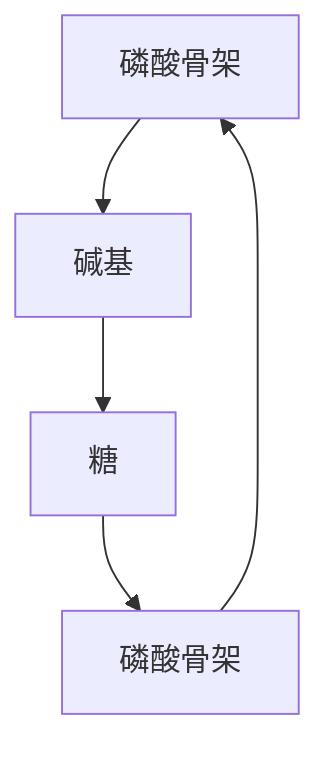
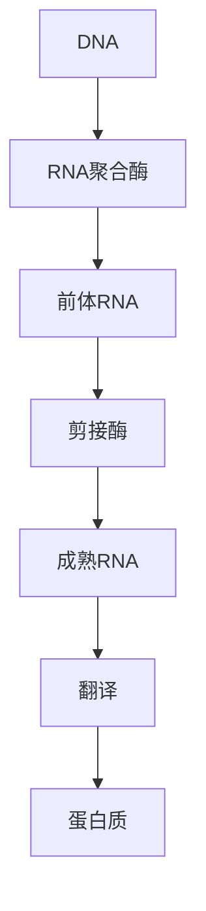
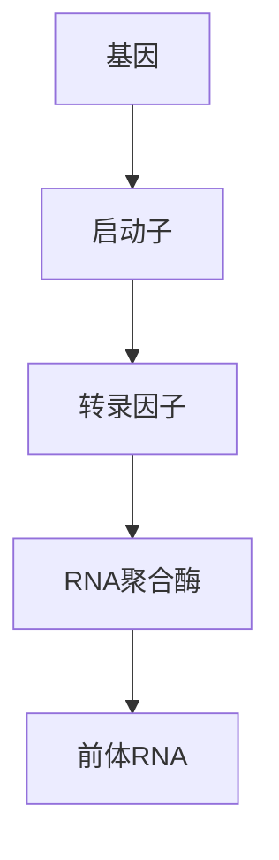
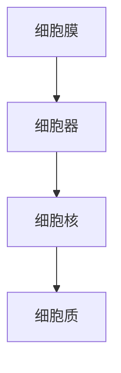
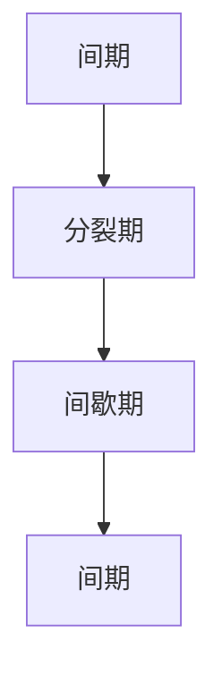
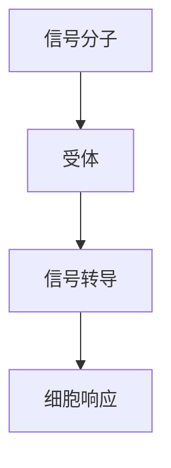

                 

# 生命科学：探索存在的本质

## 关键词
生命科学、存在的本质、生物学、物理学、哲学、前沿研究、技术应用、伦理问题、未来展望

## 摘要
生命科学作为一门综合性的学科，探讨了生命的起源、发展、演化及其与宇宙的深层联系。本文将从基础概念、学科交叉、前沿研究、技术应用、伦理问题等多个角度，系统地探索生命的本质。通过深入分析生命科学的各个层面，本文旨在揭示生命存在的奥秘，探讨生命科学在现代社会中的重要性，以及其带来的挑战和机遇。

## 引言

### 1.1 生命科学的重要性

#### 1.1.1 生命科学的定义与范畴
生命科学，是研究生命现象及其本质的科学。它涵盖了生物学、医学、生态学、遗传学、分子生物学等多个领域。生命科学的范畴广泛，从微观的细胞和分子，到宏观的生态系统和物种演化，都是其研究的对象。

#### 1.1.2 生命科学在现代社会中的作用
在现代社会中，生命科学扮演着至关重要的角色。它不仅为医学提供了基础，推动了疾病的治疗和预防，还为农业、食品科学、环境保护等领域提供了重要的理论支持和实践指导。

#### 1.1.3 本书的目的与结构
本书旨在通过对生命科学的深入探讨，揭示生命的本质。本文将分为基础概念、学科交叉、前沿研究、技术应用、伦理问题、未来展望等多个部分，系统地介绍生命科学的各个方面。通过这样的结构，希望读者能够全面了解生命科学的内涵和外延，以及其在现代社会中的重要地位。

### 基础概念

#### 2. 生命科学基础

##### 2.1 生物化学
生物化学是生命科学的基础，研究生命现象中的化学反应和生物分子的功能。以下是几个核心概念及其联系：

#### 2.1.1 生物大分子
生物大分子包括蛋白质、核酸、碳水化合物等。它们是生命活动的基本物质，具有特定的结构和功能。

**核心概念与联系表格**

| 生物大分子 | 功能 | 联系 |
| --- | --- | --- |
| 蛋白质 | 构成细胞结构、参与代谢和信号传导 | 蛋白质的折叠和功能受核酸调控 |
| 核酸 | 存储和传递遗传信息 | 核酸的复制和转录产生蛋白质 |
| 碳水化合物 | 提供能量、构成细胞壁 | 碳水化合物的代谢产物参与能量代谢 |

#### 2.1.2 生物能量代谢
生物能量代谢研究生物体内能量的转换和利用。以下是一个简化的生物能量代谢模型：

$$
\text{食物} \xrightarrow{\text{消化}} \text{营养物质} \xrightarrow{\text{代谢}} \text{能量}
$$

这个模型展示了食物通过消化变成营养物质，再通过代谢产生能量的过程。

#### 2.1.3 生化反应与调控
生化反应是生命活动的基础，包括合成、分解、转移等多种类型。这些反应受到多种调控机制的控制，确保生命活动的正常进行。

##### 2.2 分子生物学
分子生物学研究生物大分子（如核酸和蛋白质）的结构、功能和相互作用。以下是几个核心概念及其联系：

#### 2.2.1 DNA结构
DNA是遗传信息的存储载体，其双螺旋结构由碱基、糖和磷酸组成。

**DNA结构简图**

#### 2.2.2 基因表达
基因表达是指基因在细胞中转录和翻译的过程，产生特定的蛋白质。

**基因表达流程图**

#### 2.2.3 基因调控
基因调控是细胞根据不同环境和需求，有选择性地表达特定基因的过程。

**基因调控ER图**

##### 2.3 细胞生物学
细胞生物学研究细胞的结构和功能，是理解生命活动的基础。以下是几个核心概念及其联系：

#### 2.3.1 细胞结构
细胞是生命的基本单位，由细胞膜、细胞器、细胞核等组成。

**细胞结构图**

#### 2.3.2 细胞周期
细胞周期是指细胞从一次分裂开始到下一次分裂结束所经历的一系列过程。

**细胞周期流程图**

#### 2.3.3 细胞信号传导
细胞信号传导是细胞间传递信息的机制，通过一系列信号分子的传递和转化，调控细胞行为。

**细胞信号传导流程图**

### 学科交叉

#### 3. 生命科学与物理学

##### 3.1 量子生物学
量子生物学研究生命现象中的量子效应。以下是一个简化的量子生物学模型：

$$
\text{生物大分子} \xrightarrow{\text{量子效应}} \text{特殊功能}
$$

这个模型展示了生物大分子如何通过量子效应实现特殊功能。

##### 3.2 生物物理学
生物物理学研究生命现象中的物理原理和规律。以下是一个简化的生物物理学模型：

$$
\text{生物系统} \xrightarrow{\text{物理原理}} \text{功能表现}
$$

这个模型展示了生物系统如何通过物理原理实现特定的功能表现。

### 前沿研究

#### 4. 生命科学的最新进展

##### 4.1 系统生物学
系统生物学研究生物系统的整体行为和相互作用。以下是一个简化的系统生物学模型：

$$
\text{生物系统} \xrightarrow{\text{相互作用}} \text{整体行为}
$$

这个模型展示了生物系统如何通过相互作用产生整体行为。

##### 4.2 Synthetic biology
Synthetic biology 研究人工设计和构建生物系统。以下是一个简化的合成生物学模型：

$$
\text{生物元件} \xrightarrow{\text{设计合成}} \text{生物系统}
$$

这个模型展示了如何通过设计合成生物元件构建复杂的生物系统。

### 技术应用

#### 5. 生命科学在医学中的应用

##### 5.1 基因治疗
基因治疗是通过基因工程技术修复或替代异常基因，治疗遗传病或其他疾病。以下是一个简化的基因治疗流程：

$$
\text{异常基因} \xrightarrow{\text{基因编辑}} \text{正常基因} \xrightarrow{\text{治疗疾病}}
$$

##### 5.2 精准医学
精准医学是通过个性化治疗，根据患者的基因、环境等因素，提供最佳治疗方案。以下是一个简化的精准医学流程：

$$
\text{患者信息} \xrightarrow{\text{分析评估}} \text{个性化治疗方案}
$$

### 伦理与哲学

#### 6. 生命科学的伦理问题

##### 6.1 基因编辑的伦理争议
基因编辑技术在医学和科学领域带来了巨大的潜力，但也引发了伦理争议。以下是一个简化的基因编辑伦理模型：

$$
\text{基因编辑技术} \xrightarrow{\text{伦理争议}} \text{社会影响}
$$

##### 6.2 生命伦理学
生命伦理学研究生命科学带来的伦理问题。以下是一个简化的生命伦理学模型：

$$
\text{生命科学应用} \xrightarrow{\text{伦理问题}} \text{伦理决策}
$$

### 未来展望

#### 7. 生命科学的未来趋势

##### 7.1 生命科学与人工智能的融合
生命科学与人工智能的融合是未来生命科学的重要趋势。以下是一个简化的融合模型：

$$
\text{生命科学数据} \xrightarrow{\text{人工智能分析}} \text{科学发现}
$$

##### 7.2 生命科学的未来挑战
生命科学的发展也面临着一系列挑战，包括技术难题、伦理问题和社会影响。以下是一个简化的挑战模型：

$$
\text{生命科学进展} \xrightarrow{\text{挑战}} \text{未来发展}
$$

### 总结

本文通过对生命科学的深入探讨，揭示了生命的本质和生命科学在现代社会中的重要地位。本文从基础概念、学科交叉、前沿研究、技术应用、伦理问题、未来展望等多个角度，系统地介绍了生命科学的各个方面。希望通过本文，读者能够对生命科学有更全面、深入的理解，认识到其巨大的潜力和面临的挑战。

## 作者

**作者：AI天才研究院/AI Genius Institute & 禅与计算机程序设计艺术 /Zen And The Art of Computer Programming**

