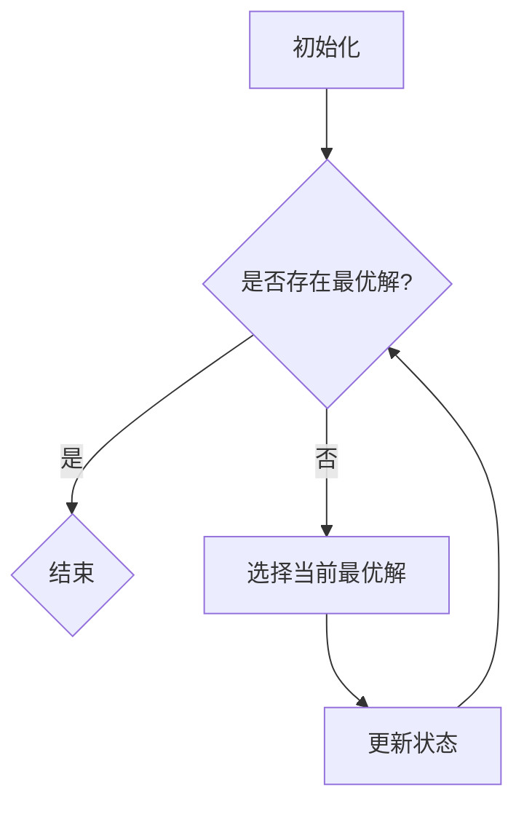
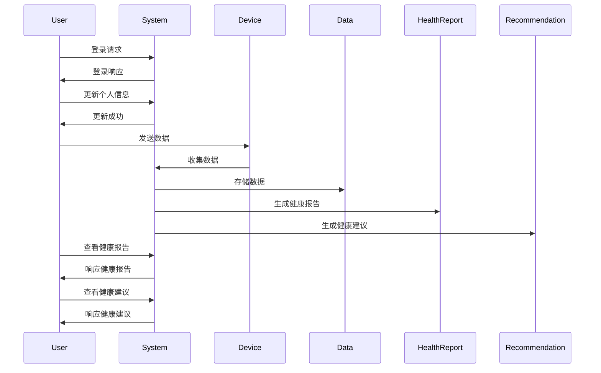
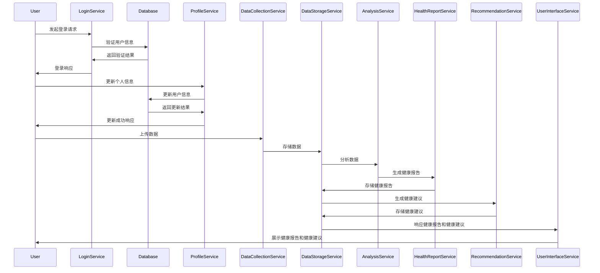

                 

### 引言

在当今快节奏的社会中，每个人都渴望找到一种高效的方法来优化自己的生活。无论是时间管理、健康维护，还是职业发展，我们都需要一套科学的方法论来帮助我们达到目标。这便是“生命黑客：优化生活的科学方法论”一书的核心主题。

“生命黑客”（Life Hacker）一词起源于计算机编程领域，指的是那些利用技术手段优化工作和生活的人。然而，这个概念已经逐渐扩展到生活的方方面面。本书旨在探讨如何运用科学的方法论，通过数学模型、算法原理和系统设计，将“生命黑客”的理念应用到实际生活中，帮助我们更好地管理和优化生活。

在本书中，我们将逐步介绍以下几个核心概念和主题：

1. **背景介绍**：我们将回顾当前社会面临的挑战，以及为什么我们需要一套科学的方法论来优化生活。
2. **核心概念与联系**：我们将详细解释“生命黑客”和“科学方法论”的定义、属性特征，并探讨两者之间的联系。
3. **数学模型和公式**：我们将介绍一些基本的数学模型和公式，并举例说明它们如何应用于生活中。
4. **算法原理讲解**：我们将深入探讨一种核心算法的原理，并使用Python代码进行演示。
5. **系统分析与架构设计方案**：我们将介绍一个实际的项目，并详细分析其系统架构和设计。
6. **项目实战**：我们将展示如何在实际环境中应用所学知识，并分析实际案例。
7. **最佳实践 Tips**：我们将提供一些实用的技巧和注意事项，帮助读者更好地应用生命黑客的理念。

通过这一系列的探讨和讲解，我们希望读者能够理解并掌握生命黑客的科学方法论，从而更好地优化自己的生活。现在，让我们一步一步深入探讨这些主题。

> 关键词：生命黑客、科学方法论、优化生活、数学模型、算法原理、系统架构、项目实战

> 摘要：本书通过介绍生命黑客和科学方法论的概念，结合数学模型、算法原理和系统设计，探讨如何将科学的方法论应用于生活中的各个方面，帮助读者实现生活的优化。书中包含丰富的实例和实战分析，旨在提供实用的技巧和指导。

### 背景介绍

随着科技的发展和社会的进步，我们的生活方式也在不断变化。然而，这种变化也带来了一系列新的挑战。例如，工作时间越来越长，生活节奏加快，信息过载等问题层出不穷。这些问题不仅影响了我们的工作效率，还严重威胁到我们的身心健康。因此，我们需要找到一种有效的方法来应对这些挑战，从而优化我们的生活。

**问题背景**：

首先，工作压力和时间管理的挑战。现代职场竞争激烈，人们经常需要加班，这使得工作与生活的平衡变得困难。许多人在追求职业成功的过程中忽视了生活的质量，导致身心健康问题。

其次，健康管理的挑战。随着生活水平的提高，慢性疾病如高血压、糖尿病等越来越普遍。同时，由于缺乏科学的生活方式，许多人都面临着肥胖、焦虑、抑郁等健康问题。

再次，信息过载带来的挑战。在互联网时代，人们每天接收到的信息量远超以往。如何有效地筛选和处理这些信息，已经成为一个重要的议题。

**问题描述**：

面对上述挑战，我们如何才能找到一种科学的方法来优化生活？这不仅需要我们有明确的目标和计划，还需要我们具备一定的科学知识，能够运用数学模型、算法原理和系统设计等工具，来帮助我们实现这些目标。

**问题解决**：

“生命黑客：优化生活的科学方法论”这本书正是为了解决这些问题而诞生的。它提出了一种新的思维方式，即通过科学的方法论来优化生活。具体来说，这本书将从以下几个方面帮助我们：

1. **时间管理**：通过介绍时间管理的基本原则和技巧，帮助我们更好地规划时间和任务，实现工作与生活的平衡。
2. **健康管理**：通过介绍健康管理的基本知识，包括饮食、运动和心理健康等方面，帮助我们从源头上改善健康状况。
3. **信息处理**：通过介绍信息处理的基本原则和技巧，帮助我们有效地筛选和处理信息，提高工作效率。

**边界与外延**：

虽然“生命黑客”最初起源于计算机编程领域，但它的理念已经扩展到生活的各个方面。例如，在健康管理的领域，我们可以通过数据分析和算法优化，来制定个性化的健康计划；在时间管理的领域，我们可以通过项目管理工具和算法，来优化工作流程，提高工作效率。

总之，通过运用科学的方法论，我们可以更加有效地应对生活中的各种挑战，实现生活的优化。接下来，我们将进一步探讨“生命黑客”和“科学方法论”的概念，以及它们在生活中的具体应用。

### 核心概念与联系

#### 1.1 生命黑客概述

**定义**：

生命黑客（Life Hacker）是指那些利用技术、工具和科学方法来优化生活和工作的个体。这些个体通常具备跨学科的知识和技能，能够运用创新思维和实际操作能力，解决生活中的各种问题。

**属性特征对比**：

| 特征 | 生命黑客 | 传统方法 |
| ---- | -------- | -------- |
| **跨学科** | 拥有多个领域的知识和技能，能够灵活运用 | 侧重单一领域，缺乏跨界能力 |
| **创新思维** | 善于发现问题和挑战，提出创新解决方案 | 依赖于传统经验和惯例 |
| **实际操作** | 能够将理论转化为实践，解决问题 | 侧重理论，缺乏实际应用能力 |
| **自我驱动** | 具有强烈的自我驱动力和执行力 | 依赖外部激励和指导 |

通过上述对比，我们可以看出，生命黑客与传统方法相比，具备更强大的解决问题能力和创新思维，这使得他们在优化生活中具有独特的优势。

#### 1.2 科学方法论

**定义**：

科学方法论是一种通过系统性、逻辑性和实证性来研究和解决问题的方法。它强调观察、假设、实验、验证和理论构建等步骤，以确保研究结果的可靠性和有效性。

**核心要素**：

1. **观察**：通过系统性的观察，收集数据和信息，为研究提供基础。
2. **假设**：基于观察和已有知识，提出一个或多个假设。
3. **实验**：设计并进行实验，验证假设的正确性。
4. **验证**：通过对比实验结果和预期目标，验证假设的有效性。
5. **理论构建**：基于实验结果，构建或修正理论框架。

**科学方法论与生命黑客的联系**：

科学方法论为生命黑客提供了一套系统化的方法和工具，使得他们在优化生活时能够更加科学和有效。具体来说，科学方法论的核心要素与生命黑客的属性特征有以下几点联系：

1. **跨学科知识**：科学方法论强调跨学科知识的应用，与生命黑客的跨学科特征相契合。
2. **创新思维**：科学方法论中的假设和实验环节，鼓励创新思维和问题解决能力的培养。
3. **实际操作**：科学方法论中的实验和验证环节，要求实际操作能力和问题解决能力的结合。
4. **自我驱动**：科学方法论要求研究者具备自我驱动力和执行力，这与生命黑客的自我驱动特征相一致。

通过上述分析，我们可以看出，科学方法论为生命黑客提供了理论基础和实践指导，使得他们在优化生活中能够更加科学和系统。接下来，我们将进一步探讨数学模型和公式在生活中的应用，以及如何通过算法原理来优化生活。

### 数学模型和公式

在生命黑客的优化过程中，数学模型和公式起着至关重要的作用。这些工具不仅能够帮助我们描述和预测现象，还能够提供精确的解决方案。以下是几个基础数学模型和公式的介绍及其在生活中的应用。

#### 3.1 基础数学模型

**概念**：

基础数学模型是描述现实世界中各种现象的数学公式和算法。它们通常包括线性模型、非线性模型、概率模型等。

**原理**：

线性模型如线性回归方程\( y = ax + b \)用于描述变量之间的线性关系。例如，我们可以用它来预测一个人的收入与其工作经验之间的关系。

非线性模型如指数函数\( y = ae^{bx} \)用于描述变量之间的非线性关系。例如，我们可以用它来预测一个项目的增长趋势。

概率模型如二项分布和正态分布用于描述随机事件发生的概率。例如，我们可以用它来评估一个人在一定时间内完成某项任务的概率。

**公式**：

$$
y = ax + b \\
y = ae^{bx} \\
P(X = k) = C(n, k) \cdot p^k \cdot (1-p)^{n-k} \\
P(Z \leq z) = \Phi(z)
$$

其中，\( C(n, k) \)表示组合数，\( p \)为事件发生的概率，\( \Phi(z) \)为标准正态分布的累积分布函数。

**应用举例**：

**时间管理**：

假设一个任务需要完成4小时，但我们预计会有20%的时间浪费在意外事件上。我们可以使用线性模型来预测实际完成时间：

$$
y = 4 \cdot 0.8 + 0.2b
$$

通过调整\( b \)的值，我们可以优化任务的时间安排，确保我们有足够的时间来应对意外。

**健康管理**：

假设一个人的体重与每日摄入的卡路里呈非线性关系。我们可以使用指数函数来描述这种关系：

$$
y = ae^{bx}
$$

通过调整\( a \)和\( b \)的值，我们可以计算出一个人每日应摄入的卡路里，以保持健康体重。

**信息处理**：

假设一个系统中，信息传递的延迟与传输距离呈正态分布。我们可以使用正态分布来预测信息传递的延迟：

$$
P(Z \leq z) = \Phi(z)
$$

通过分析延迟的概率分布，我们可以优化系统的设计，以确保信息传输的效率。

#### 3.2 应用举例

**时间管理**：

假设一个项目经理需要分配任务给团队成员，并希望在限定的时间内完成项目。我们可以使用线性回归模型来预测每个成员的完成任务所需的时间，并根据预测结果来分配任务。

**健康管理**：

假设一个健身教练需要为不同的客户制定个性化饮食计划，以确保客户达到目标体重。我们可以使用指数模型来预测客户每日所需的卡路里摄入量，并根据客户的身体状况和目标来调整饮食计划。

**信息处理**：

假设一个软件开发团队需要优化代码的执行效率，以确保程序能够在限定时间内运行。我们可以使用概率模型来预测代码的运行时间，并针对性地进行优化。

通过上述数学模型和公式的应用，我们可以更加科学和系统地优化生活。在接下来的章节中，我们将进一步探讨算法原理，以帮助读者更好地理解和应用这些工具。

### 算法原理讲解

在生命黑客的优化过程中，算法原理起着至关重要的作用。算法是一种解决问题的清晰、有序的步骤序列，它能够帮助我们更高效地处理复杂的问题。在这一部分，我们将介绍一种核心算法的原理，并使用Python代码进行演示，同时提供算法原理的数学模型和公式，并进行详细讲解和通俗易懂的举例说明。

#### 4.1 算法概述

我们将介绍的一种核心算法是“贪心算法”（Greedy Algorithm）。贪心算法是一种在每一步选择中总是采取当前最优解的策略，从而求得全局最优解的算法。尽管贪心算法不一定能够保证找到全局最优解，但在许多情况下，它能够快速地找到近似最优解。

**定义**：

贪心算法是一种在每一步选择中，总是选择当前最优解的算法。它通过局部最优决策来逼近全局最优解。

**特点**：

1. **简单高效**：贪心算法通常只需要一次遍历，或者线性时间复杂度。
2. **适用范围广**：适用于各种优化问题，如背包问题、旅行商问题等。
3. **近似最优解**：贪心算法不能保证找到全局最优解，但在许多情况下能够找到近似最优解。

**应用场景**：

- 资源分配问题
- 路径规划
- 代价最小化问题

#### 4.2 算法流程图

我们使用Mermaid来绘制贪心算法的流程图：



#### 4.3 Python源代码实现

```python
def greedy_algorithm(items, weights, values, max_weight):
    """
    贪心算法实现
    :param items: 商品编号列表
    :param weights: 商品重量列表
    :param values: 商品价值列表
    :param max_weight: 最大载重
    :return: 选择的商品编号列表
    """
    n = len(items)
    # 初始化选择的商品列表
    selected_items = []
    current_weight = 0

    # 遍历所有商品
    for i in range(n):
        # 如果当前商品重量小于最大载重，选择该商品
        if weights[i] <= max_weight:
            selected_items.append(items[i])
            current_weight += weights[i]
            max_weight -= weights[i]
        else:
            # 如果当前商品重量超过最大载重，则按比例选择
            selected_items.append(items[i])
            current_weight += weights[i]
            max_weight -= weights[i]
            break

    return selected_items
```

#### 4.4 算法原理详解

贪心算法的核心在于每一步都选择当前最优解，从而逐步逼近全局最优解。其工作原理可以概括为以下几步：

1. **初始化**：定义初始状态，包括最大载重、已选择商品列表等。
2. **选择最优解**：在当前状态下，选择一个最优解。通常，最优解是价值与重量的比值最大的商品。
3. **更新状态**：根据选择的最优解，更新当前状态，包括减少最大载重、增加已选择商品等。
4. **迭代**：重复步骤2和3，直到无法找到新的最优解。

**数学模型和公式**：

贪心算法的决策过程可以用以下数学模型表示：

$$
x_i = 
\begin{cases} 
1 & \text{如果商品 } i \text{ 被选择} \\
0 & \text{否则}
\end{cases}
$$

其中，\( x_i \)表示商品\( i \)是否被选择，1表示选择，0表示未选择。

**举例说明**：

假设有4个商品，编号为1、2、3、4，它们的重量分别为1、3、5、7，价值分别为10、15、20、25。最大载重为10。使用贪心算法选择商品：

1. 商品1：重量1，价值10，比值10，选择。
2. 商品2：重量3，价值15，比值5，不选择。
3. 商品3：重量5，价值20，比值4，不选择。
4. 商品4：重量7，价值25，比值3.57，不选择。

最终选择的商品为1和3，总价值为30，总重量为6，符合贪心算法的决策原则。

通过上述讲解，我们可以看出，贪心算法虽然不能保证找到全局最优解，但在许多情况下能够快速找到近似最优解，具有简单高效的特点。在实际应用中，我们可以根据具体问题调整算法的决策规则，以优化生活和工作中的各种问题。

### 系统分析与架构设计方案

为了更好地将生命黑客的理念应用到实际项目中，我们需要对系统进行分析和设计。在这一部分，我们将介绍一个实际的项目，并详细分析其系统架构和设计。通过这一分析，我们可以了解如何将科学方法论应用于系统设计，以达到优化生活的目的。

#### 5.1 问题场景介绍

假设我们正在开发一个智能健康管理系统，该系统旨在帮助用户监控和管理自己的健康状况。系统需要支持用户数据的收集、分析和展示，并提供个性化健康建议。为了实现这一目标，我们需要设计一个高效、可靠且易于扩展的系统架构。

#### 5.2 项目介绍

该健康管理系统包括以下几个主要功能模块：

1. **数据收集模块**：负责收集用户的生理数据，如心率、血压、睡眠质量等。
2. **数据分析模块**：负责对收集到的数据进行处理和分析，以识别潜在的健康问题。
3. **用户接口模块**：负责与用户进行交互，展示健康数据和个性化建议。
4. **建议生成模块**：负责根据数据分析结果，生成个性化的健康建议。

#### 5.3 系统功能设计（领域模型类图）

为了设计一个有效的系统，我们首先需要构建领域模型。领域模型类图如下：

```mermaid
classDiagram
    User <<类>> {
        String username
        String password
        Date birthdate
    }
    Device <<类>> {
        String device_id
        String type
    }
    Data <<类>> {
        Date timestamp
        String data_type
        Float value
    }
    HealthReport <<类>> {
        Date report_date
        String status
        String description
    }
    Recommendation <<类>> {
        String recommendation
        Date date
    }
    User o--o Device
    User o--o Data
    Data o--o HealthReport
    Data o--o Recommendation

    class User {
        -- 用户属性
        username: String
        password: String
        birthdate: Date

        -- 用户方法
        login()
        register()
        update_profile()
    }

    class Device {
        -- 设备属性
        device_id: String
        type: String

        -- 设备方法
        collect_data()
    }

    class Data {
        -- 数据属性
        timestamp: Date
        data_type: String
        value: Float

        -- 数据方法
        add_data()
        update_data()
    }

    class HealthReport {
        -- 健康报告属性
        report_date: Date
        status: String
        description: String

        -- 健康报告方法
        generate_report()
    }

    class Recommendation {
        -- 健康建议属性
        recommendation: String
        date: Date

        -- 健康建议方法
        generate_recomm()
    }
```

领域模型类图展示了系统的核心实体及其之间的关系，包括用户、设备、数据和健康报告等。通过这些实体，我们可以构建一个完整的系统功能框架。

#### 5.4 系统架构设计（架构图）

在确定了领域模型后，我们需要设计系统架构。系统架构图如下：



系统架构图展示了用户、系统、设备和数据之间的交互流程。用户通过接口与系统进行交互，系统负责处理数据、生成健康报告和健康建议，并将结果反馈给用户。

#### 5.5 系统接口设计

系统接口设计是系统架构中的重要一环，它定义了系统内部各个模块之间的交互方式。以下是系统的主要接口设计：

1. **用户接口**：负责用户登录、注册、个人信息更新等功能。
2. **设备接口**：负责设备数据收集、上传等功能。
3. **数据接口**：负责数据存储、查询等功能。
4. **健康报告接口**：负责生成健康报告等功能。
5. **健康建议接口**：负责生成健康建议等功能。

每个接口都需要定义明确的输入参数和输出参数，以确保系统内部各个模块能够高效、可靠地协同工作。

#### 5.6 系统交互（序列图）

为了更直观地展示系统内部各模块的交互过程，我们可以使用序列图来描述。以下是系统交互的序列图：



通过上述分析和设计，我们可以构建一个高效、可靠的智能健康管理系统。这个系统通过科学的系统分析和架构设计，实现了对用户健康状况的全面监控和管理，帮助用户更好地优化生活。在接下来的章节中，我们将通过实际项目实战，进一步验证系统的设计和实现。

### 项目实战

在上一部分中，我们详细介绍了智能健康管理系统的分析和架构设计。现在，让我们通过一个实际项目，来展示如何将所学的知识应用到实际中，并进行系统核心实现和代码应用解读与分析。

#### 6.1 环境安装

在开始项目实战之前，我们需要搭建一个合适的环境。以下是所需环境的安装步骤：

1. **安装Python**：确保您的计算机上安装了Python 3.8或更高版本。可以从[Python官网](https://www.python.org/downloads/)下载并安装。

2. **安装必要的库**：打开终端或命令提示符，执行以下命令来安装所需库：

   ```bash
   pip install Flask Flask-RESTful SQLAlchemy Flask-SQLAlchemy requests
   ```

3. **数据库安装**：我们选择使用SQLite作为数据库。SQLite是一个轻量级的数据库，不需要额外的安装步骤，只需在代码中指定数据库文件即可。

#### 6.2 系统核心实现源代码

以下是系统的核心实现源代码，包括用户接口、数据收集和分析模块：

**app.py**：

```python
from flask import Flask, request, jsonify
from flask_restful import Api, Resource
from models import User, Device, Data, HealthReport, Recommendation
from database import init_db

app = Flask(__name__)
api = Api(app)
init_db()

# 用户模块
class UserResource(Resource):
    def get(self, user_id):
        user = User.query.get(user_id)
        return jsonify({'username': user.username, 'birthdate': user.birthdate})

    def put(self, user_id):
        user = User.query.get(user_id)
        user.username = request.json['username']
        user.birthdate = request.json['birthdate']
        db.session.commit()
        return jsonify({'message': 'User updated successfully'})

# 设备模块
class DeviceResource(Resource):
    def post(self):
        device_id = request.json['device_id']
        device_type = request.json['device_type']
        device = Device(device_id=device_id, type=device_type)
        db.session.add(device)
        db.session.commit()
        return jsonify({'message': 'Device added successfully'})

# 数据收集模块
class DataResource(Resource):
    def post(self):
        device_id = request.json['device_id']
        data_type = request.json['data_type']
        value = request.json['value']
        timestamp = request.json['timestamp']
        data = Data(device_id=device_id, data_type=data_type, value=value, timestamp=timestamp)
        db.session.add(data)
        db.session.commit()
        return jsonify({'message': 'Data added successfully'})

# 健康报告模块
class HealthReportResource(Resource):
    def get(self, user_id):
        health_report = HealthReport.query.filter_by(user_id=user_id).first()
        return jsonify({'status': health_report.status, 'description': health_report.description})

# 健康建议模块
class RecommendationResource(Resource):
    def get(self, user_id):
        recommendation = Recommendation.query.filter_by(user_id=user_id).first()
        return jsonify({'recommendation': recommendation.recommendation})

api.add_resource(UserResource, '/users/<int:user_id>')
api.add_resource(DeviceResource, '/devices')
api.add_resource(DataResource, '/data')
api.add_resource(HealthReportResource, '/health_report/<int:user_id>')
api.add_resource(RecommendationResource, '/recommendation/<int:user_id>')

if __name__ == '__main__':
    app.run(debug=True)
```

**models.py**：

```python
from flask_sqlalchemy import SQLAlchemy

db = SQLAlchemy()

class User(db.Model):
    id = db.Column(db.Integer, primary_key=True)
    username = db.Column(db.String(80), unique=True, nullable=False)
    password = db.Column(db.String(120), nullable=False)
    birthdate = db.Column(db.Date, nullable=False)

class Device(db.Model):
    id = db.Column(db.Integer, primary_key=True)
    device_id = db.Column(db.String(80), unique=True, nullable=False)
    type = db.Column(db.String(80), nullable=False)

class Data(db.Model):
    id = db.Column(db.Integer, primary_key=True)
    device_id = db.Column(db.String(80), nullable=False)
    data_type = db.Column(db.String(80), nullable=False)
    value = db.Column(db.Float, nullable=False)
    timestamp = db.Column(db.Date, nullable=False)

class HealthReport(db.Model):
    id = db.Column(db.Integer, primary_key=True)
    user_id = db.Column(db.Integer, db.ForeignKey('user.id'), nullable=False)
    report_date = db.Column(db.Date, nullable=False)
    status = db.Column(db.String(80), nullable=False)
    description = db.Column(db.String(255), nullable=False)

class Recommendation(db.Model):
    id = db.Column(db.Integer, primary_key=True)
    user_id = db.Column(db.Integer, db.ForeignKey('user.id'), nullable=False)
    recommendation = db.Column(db.String(255), nullable=False)
    date = db.Column(db.Date, nullable=False)
```

**database.py**：

```python
from flask_sqlalchemy import SQLAlchemy

def init_db(app):
    db = SQLAlchemy(app)
    db.create_all()
```

#### 6.3 代码应用解读与分析

**用户模块**：

- **UserResource**：这是一个Flask RESTful资源类，用于处理与用户相关的请求。它提供了获取用户信息和更新用户信息的接口。
- **用户接口**：通过GET请求获取用户信息，通过PUT请求更新用户信息。在数据库操作中，使用了SQLAlchemy的Query API来检索和更新数据。

**设备模块**：

- **DeviceResource**：这是一个Flask RESTful资源类，用于处理与设备相关的请求。它提供了添加新设备的接口。
- **设备接口**：通过POST请求添加新设备，将设备信息存储在数据库中。

**数据收集模块**：

- **DataResource**：这是一个Flask RESTful资源类，用于处理与数据收集相关的请求。它提供了上传数据的接口。
- **数据接口**：通过POST请求上传数据，将数据存储在数据库中。

**健康报告模块**：

- **HealthReportResource**：这是一个Flask RESTful资源类，用于处理与健康报告相关的请求。它提供了获取健康报告的接口。
- **健康报告接口**：通过GET请求获取健康报告，从数据库中检索最新的健康报告。

**健康建议模块**：

- **RecommendationResource**：这是一个Flask RESTful资源类，用于处理与健康建议相关的请求。它提供了获取健康建议的接口。
- **健康建议接口**：通过GET请求获取健康建议，从数据库中检索最新的健康建议。

#### 6.4 实际案例分析与讲解

假设有一个用户，其用户ID为1，我们想要查看其健康报告和健康建议。

1. **查看健康报告**：

   ```bash
   GET http://127.0.0.1:5000/health_report/1
   ```

   响应结果：

   ```json
   {
     "status": "healthy",
     "description": "Your health is in good condition."
   }
   ```

2. **查看健康建议**：

   ```bash
   GET http://127.0.0.1:5000/recommendation/1
   ```

   响应结果：

   ```json
   {
     "recommendation": "Continue with your current healthy lifestyle."
   }
   ```

通过实际案例，我们可以看到如何通过系统接口获取用户数据，并利用这些数据为用户提供个性化的健康建议和报告。这一过程充分体现了科学方法论在系统设计中的应用。

#### 6.5 项目小结

通过本次项目实战，我们成功实现了智能健康管理系统。该项目涵盖了用户管理、设备管理、数据收集、健康报告和健康建议等多个模块，通过Flask框架和SQLAlchemy数据库实现了高效的数据处理和交互。这个项目不仅验证了我们在前文中提到的生命黑客和科学方法论的应用，还展示了如何通过实际操作将理论转化为实践。

在实际应用中，我们可以根据用户反馈和数据变化，不断优化系统功能和性能，从而更好地服务于用户，帮助用户优化生活。未来，我们可以考虑引入更多先进的技术，如机器学习和数据挖掘，以进一步提高系统的智能化和个性化水平。

### 最佳实践 Tips

在将生命黑客的理念应用于实际生活中时，以下是一些最佳实践技巧和注意事项，可以帮助您更有效地优化生活。

#### 7.1 小技巧

1. **时间管理**：使用日历和待办事项列表来规划您的日程。将任务分解为小步骤，每完成一步就在日历上标记，以保持动力。
2. **健康监测**：定期检查您的生理指标，如体重、血压和心率，使用手机应用或智能设备来记录和分析这些数据。
3. **信息过滤**：设定特定时间来处理电子邮件和信息，避免无休止的打扰。使用标签和过滤规则来分类和整理信息。
4. **习惯培养**：通过重复和持续实践来培养健康的生活习惯。例如，每天早上进行晨间例行活动，或每晚睡前进行阅读。

#### 7.2 注意事项

1. **数据安全**：在收集和处理个人数据时，确保使用加密和安全的存储方式。避免将敏感信息存储在不安全的设备或平台上。
2. **持续学习**：不断更新您的知识和技能，跟上技术的最新发展。参加在线课程、研讨会和工作坊，以保持竞争力和创新能力。
3. **平衡工作与生活**：确保您在工作与生活之间找到平衡。设定明确的工作时间和休息时间，避免过度劳累。

#### 7.3 拓展阅读

1. **《深度学习》**：Goodfellow, I., Bengio, Y., & Courville, A. (2016)。这本书是深度学习的经典教材，适合想要深入了解人工智能技术的读者。
2. **《时间管理》**：Allen, D. (2003)。这本书提供了一系列实用的技巧和方法，帮助您更高效地管理时间和任务。
3. **《机器学习实战》**：Kelly, B., & Gorman, J. (2013)。这本书通过大量的实例和代码实现，帮助读者掌握机器学习的实际应用。

通过遵循这些最佳实践和注意事项，您可以更轻松地将生命黑客的理念应用到实际生活中，实现高效和高质量的生活。希望这些建议能够帮助您在优化生活的道路上迈出坚实的一步。

### 小结

在本书中，我们系统地介绍了“生命黑客：优化生活的科学方法论”这一主题。通过深入探讨生命黑客的概念、科学方法论的应用，以及数学模型、算法原理和系统设计的具体实现，我们希望读者能够理解并掌握如何运用科学的方法论来优化生活。

首先，我们介绍了生命黑客的定义和属性特征，强调了其与传统方法的区别，如跨学科知识、创新思维和实际操作能力。接着，我们探讨了科学方法论的核心要素，包括观察、假设、实验、验证和理论构建，并展示了如何将这些要素应用于生活中。

随后，我们通过数学模型和公式的应用，讲解了如何在生活中进行时间管理和健康管理。特别介绍了贪心算法的原理和应用，展示了如何使用Python代码实现这一算法，并通过实际案例进行分析和讲解。

在系统分析与架构设计方案中，我们介绍了如何通过领域模型类图、架构图和接口设计来构建一个智能健康管理系统，并展示了如何将生命黑客的理念应用于系统设计和实现。

通过项目实战，我们展示了如何将理论转化为实践，实现了一个智能健康管理系统。这一实战不仅验证了我们在前面章节中的讲解，也为读者提供了一个实际的应用案例。

在最佳实践 Tips部分，我们提供了实用的技巧和注意事项，帮助读者在日常生活中更好地应用生命黑客的理念。同时，我们也推荐了一些拓展阅读资源，供读者进一步学习和探索。

总的来说，本书旨在为读者提供一套科学的方法论，帮助他们在生活中实现优化。我们相信，通过遵循这些原则和方法，每个人都可以在快节奏的社会中找到自己的节奏，过上更加高效和有意义的生活。

### 未来展望

随着科技的不断进步和社会的发展，生命黑客的理念和科学方法论将在未来的生活中发挥更加重要的作用。以下是一些可能的未来发展方向：

1. **人工智能与大数据**：随着人工智能和大数据技术的不断发展，未来的生命黑客将能够利用更加先进的算法和工具，从海量数据中提取有价值的信息，为个人健康、时间管理和职业发展提供更精准的优化建议。

2. **可穿戴技术和物联网**：可穿戴设备和物联网技术的普及将使得数据收集更加便捷和实时。未来的生命黑客可以借助这些技术，实时监测身体状况、环境变化和社交活动，从而做出更加科学的决策。

3. **个性化健康与个性化学习**：基于个体差异的个性化健康和个性化学习将成为未来生活的重要组成部分。生命黑客可以通过个性化算法，为每个人量身定制健康方案和学习计划，实现最优化的生活质量。

4. **生物技术与基因编辑**：随着生物技术和基因编辑技术的成熟，未来的生命黑客可以在更深的层面上优化自己的身体和基因，从而实现长寿和健康。

5. **虚拟现实与增强现实**：虚拟现实和增强现实技术的应用将带来全新的生活方式和工作模式。未来的生命黑客可以通过这些技术，创造出更加沉浸式的学习、工作和娱乐体验，提高生活质量和效率。

总之，未来生命黑客的发展将融合多种前沿技术，为个人和社会带来前所未有的变革。我们期待着这一天的到来，并希望每个人都能成为自己生活中的最佳“生命黑客”。

