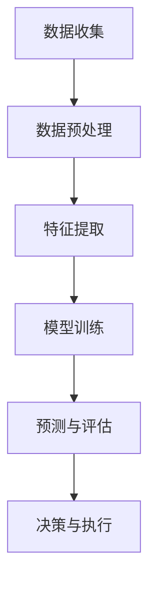
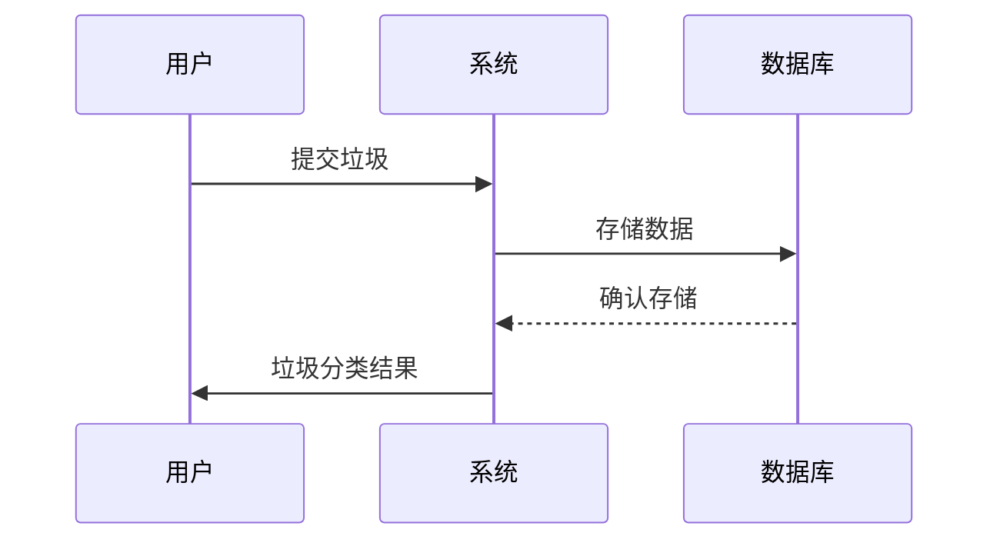
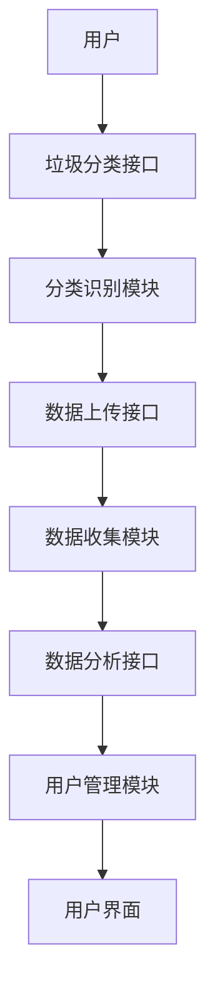

                 

### 生态意识与生命意义：环保主义如何重塑我们的价值观

#### 关键词：生态意识、生命意义、环保主义、价值观重塑、可持续发展

> 摘要：本文将从生态意识的历史背景出发，深入探讨生态意识与生命意义的联系，分析环保主义如何影响我们的价值观。通过解读核心概念、应用算法原理、探讨社会层面的实践、经济学中的应用、科技创新结合，以及案例分析，展望未来环保主义面临的挑战与机遇，旨在引导读者理解生态意识与生命意义的重要性，并激发对环保主义实践的思考。

---

#### **背景介绍**

**生态意识**，是指人类对自然环境及其与自身关系的一种认识和理解。这一概念源于对生态系统的关注和生态学的发展，逐渐成为现代环境保护和可持续发展的基石。生态意识的兴起与全球生态环境危机息息相关，20世纪中叶以来，环境污染、资源枯竭和气候变化等问题日益严峻，促使人们开始反思人类对自然界的掠夺行为。

**生命意义**，则是个体和社会对生命本质和存在价值的思考和探索。生命意义不仅仅是生物学层面的存在，更包含了哲学、伦理和社会文化层面的丰富内涵。对生命意义的理解影响着人们的生活方式、价值观和社会行为。

**环保主义**，是一种倡导可持续发展的社会运动，主张人类与自然和谐共处，通过环保措施减少对自然环境的破坏，实现资源的可持续利用。环保主义不仅关注环境保护，更强调社会公平和人类福祉，是一种全面的、多维度的思想体系。

本文旨在通过分析生态意识与生命意义的关联，探讨环保主义如何重塑我们的价值观。文章将首先介绍生态意识的历史背景，接着探讨生态意识与生命意义的内在联系，然后分析环保主义的核心概念和实践，最后通过案例研究和未来展望，深入探讨环保主义对现代社会的影响。

---

#### **核心概念与联系**

**生态意识**的核心概念是生态系统和人类与自然的关系。生态学理论告诉我们，生态系统是一个复杂的动态平衡系统，其中每个物种和元素都相互依赖，共同维持生态平衡。生态意识强调人类活动对生态系统的影响，提倡人与自然和谐共生。以下是一个简单的概念属性特征对比表格，展示了生态意识与生命意义的几个关键属性：

| 概念       | 定义                                                         | 属性特征                                                   |
|------------|--------------------------------------------------------------|------------------------------------------------------------|
| 生态意识   | 对自然环境及其与人类关系的认识和理解                         | **动态性**、**整体性**、**可持续性**、**相互依赖**           |
| 生命意义   | 对生命本质和存在价值的思考与探索                           | **哲学性**、**伦理性**、**社会文化性**、**个体与集体**       |

**ER实体关系图**则能更直观地展示生态意识与生命意义之间的关联。以下是一个简化的ER实体关系图，用Mermaid语法表示：

```mermaid
erDiagram
  A[生态意识] ||--|{ 生态系统 }
  A ||--|{ 人类活动 }
  B[生命意义] ||--|{ 个体价值观 }
  B ||--|{ 社会价值观 }
```

在这个ER图中，**生态意识**与**生态系统**和**人类活动**有直接关系，表明生态意识是人类对生态系统和自身活动的理解和反思。同时，**生命意义**与**个体价值观**和**社会价值观**有直接关联，表明生命意义是个体和社会对生命本质的思考与探索。

通过这些概念和关联的探讨，我们可以更好地理解生态意识与生命意义之间的关系。生态意识不仅是人类对环境的认识，也是对生命价值的反思。而生命意义则在生态意识的基础上，进一步引导人类的行为和价值观，促进人与自然和谐共生的实现。

---

#### **算法原理讲解**

在探讨生态意识和生命意义的过程中，我们可以引入一些环境监测和可持续发展的算法原理，以帮助读者更深入地理解这些概念。以下是一个简单的环境监测算法的mermaid流程图：



这个流程图描述了一个典型的环境监测算法的工作流程：

1. **数据收集**：收集各种环境数据，如温度、湿度、空气质量等。
2. **数据预处理**：清洗和整理数据，为后续处理做准备。
3. **特征提取**：从原始数据中提取有用的特征，以便用于模型训练。
4. **模型训练**：使用机器学习算法训练模型，使其能够识别和预测环境变化。
5. **预测与评估**：使用训练好的模型进行预测，并评估模型的准确性。
6. **决策与执行**：根据预测结果，制定相应的环保措施并执行。

为了更详细地解释这个算法，我们可以使用Python代码来描述模型训练和预测的具体实现。以下是一个简单的线性回归模型的实现，用于预测温度变化：

```python
import numpy as np
from sklearn.linear_model import LinearRegression
import matplotlib.pyplot as plt

# 数据集
X = np.array([[1], [2], [3], [4], [5], [6], [7], [8], [9], [10]])
y = np.array([20, 22, 24, 26, 28, 30, 32, 34, 36, 38])

# 模型训练
model = LinearRegression()
model.fit(X, y)

# 预测
X_new = np.array([[11]])
y_pred = model.predict(X_new)

print(f"预测的温度为：{y_pred[0]}度")

# 可视化
plt.scatter(X, y, color='blue')
plt.plot(X, model.predict(X), color='red')
plt.xlabel('时间')
plt.ylabel('温度')
plt.title('温度变化预测')
plt.show()
```

在这个例子中，我们使用线性回归模型预测未来的温度变化。通过训练数据和预测结果，我们可以评估模型的准确性，并根据预测结果采取相应的环保措施。

**数学模型和公式**方面，线性回归模型的基本公式为：

$$ y = ax + b $$

其中，$y$ 是预测的值，$x$ 是输入特征（如时间），$a$ 是斜率，$b$ 是截距。在这个例子中，我们通过训练数据集计算出斜率和截距，从而得到温度变化的预测模型。

通过以上算法原理和示例，我们可以更直观地理解生态意识和生命意义在实际应用中的重要性。环境监测和可持续发展算法不仅帮助我们更好地理解自然环境，还能为环保决策提供科学依据，从而推动生态意识与生命意义的实践。

---

#### **系统分析与架构设计方案**

为了更好地理解环保主义在社会中的应用，我们将设计一个虚拟的环保项目，并详细分析其系统功能设计、架构设计和接口设计。

**问题场景介绍**：假设我们正在开发一个城市垃圾分类和回收系统，目的是通过高效的垃圾分类，提高回收率，减少环境污染。

**项目介绍**：该项目将集成传感器技术、物联网（IoT）和数据分析技术，实现自动识别垃圾分类，并通过智能回收设备提高回收效率。

**系统功能设计**：

1. **分类识别**：使用图像识别技术，自动识别垃圾种类。
2. **数据收集**：传感器收集垃圾分类数据，上传至数据中心。
3. **数据分析**：对收集到的数据进行分析，提供回收策略建议。
4. **用户界面**：提供用户操作界面，展示回收数据和环保知识。

以下是该系统的领域模型类图，使用Mermaid语法表示：

```mermaid
classDiagram
    Class01 <|-- Class02
    Class03 <..|{ 上级 }| Class04
    Class05 <<--|{ 实现 }| Interface01
    Interface02 <|..| Class06
    Class07 : +操作1()
    Class08 : +操作2()
    Class09 : +操作3()
    Class10 : +操作4()
```

**系统架构设计**：

1. **前端**：用户界面，提供垃圾分类指导和数据展示。
2. **后端**：包括数据收集模块、分类识别模块、数据分析模块和用户管理模块。
3. **数据库**：存储用户数据、垃圾分类数据和回收策略。

以下是该系统的架构设计图，使用Mermaid语法表示：



**系统接口设计和系统交互**：

1. **垃圾分类接口**：用于接收用户提交的垃圾图像，返回分类结果。
2. **数据上传接口**：用于将传感器数据上传至数据中心。
3. **数据分析接口**：用于获取回收策略建议。

以下是系统接口设计和系统交互图，使用Mermaid语法表示：



通过这个虚拟项目，我们可以看到环保主义在具体应用中的实现路径。从系统功能设计、架构设计到接口设计，每个环节都紧密关联，共同推动环保目标的实现。这个设计不仅体现了生态意识与生命意义的实践，也为未来环保项目提供了参考和借鉴。

---

#### **项目实战**

为了更好地理解环保主义在实际中的应用，我们将详细介绍一个具体的垃圾分类回收项目，包括环境安装、系统核心实现源代码，代码应用解读与分析，实际案例分析和详细讲解剖析。

**项目名称**：智能垃圾分类回收系统

**环境安装**：

1. **硬件环境**：
   - 树莓派或类似的小型计算机作为数据收集和处理节点。
   - 网络摄像头用于拍摄垃圾图像。
   - 垃圾桶内的传感器用于检测垃圾重量和种类。

2. **软件环境**：
   - Python 3.8 或更高版本。
   - OpenCV 库用于图像处理。
   - TensorFlow 库用于深度学习模型训练。
   - Flask 框架用于构建后端接口。

安装步骤：

1. 安装 Python 3.8：在树莓派上通过命令 `sudo apt-get install python3` 安装 Python。
2. 安装 OpenCV：通过命令 `pip install opencv-python` 安装 OpenCV 库。
3. 安装 TensorFlow：通过命令 `pip install tensorflow` 安装 TensorFlow 库。
4. 安装 Flask：通过命令 `pip install flask` 安装 Flask 框架。

**系统核心实现源代码**：

以下是一个简单的垃圾分类识别系统的核心代码实现，用于从摄像头获取垃圾图像，使用 TensorFlow 模型进行分类，并返回结果：

```python
import cv2
import tensorflow as tf
from flask import Flask, request, jsonify

app = Flask(__name__)

# 加载预训练的垃圾分类模型
model = tf.keras.models.load_model('垃圾分类模型.h5')

# 加载分类标签
labels = ['可回收物', '有害垃圾', '湿垃圾', '干垃圾']

def preprocess_image(image):
    """预处理图像，使其适合模型输入"""
    image = cv2.resize(image, (224, 224))
    image = image / 255.0
    image = np.expand_dims(image, axis=0)
    return image

def classify_image(image):
    """使用模型分类图像并返回结果"""
    preprocessed_image = preprocess_image(image)
    predictions = model.predict(preprocessed_image)
    return labels[np.argmax(predictions)]

@app.route('/classify', methods=['POST'])
def classify():
    if request.files.get('image'):
        image = request.files['image'].read()
        image = cv2.imdecode(np.frombuffer(image, np.uint8), cv2.IMREAD_COLOR)
        result = classify_image(image)
        return jsonify({'result': result})
    else:
        return jsonify({'error': '没有上传图像'})

if __name__ == '__main__':
    app.run(host='0.0.0.0', port=5000)
```

**代码应用解读与分析**：

1. **预处理图像**：代码中的 `preprocess_image` 函数负责将输入图像调整为模型所需的尺寸和格式。
2. **分类图像**：`classify_image` 函数使用 TensorFlow 模型对预处理后的图像进行分类，并返回最可能的分类结果。
3. **后端接口**：使用 Flask 框架提供的 `/classify` 接口，允许前端应用程序上传图像，并获取分类结果。

**实际案例分析和详细讲解剖析**：

假设我们上传了一张包含废塑料瓶的垃圾图像，系统能够识别并返回“可回收物”的分类结果。以下是详细的案例剖析：

1. **图像识别**：系统从摄像头获取图像，并传递给 `classify_image` 函数。
2. **预处理**：图像经过 `preprocess_image` 函数处理后，调整为模型所需的尺寸和格式。
3. **模型预测**：模型对预处理后的图像进行预测，生成概率分布。
4. **分类结果**：模型返回最可能的分类结果，即“可回收物”。

通过这个项目，我们可以看到环保主义在现实中的应用。智能垃圾分类回收系统不仅提高了垃圾分类的准确性，还促进了资源的回收利用，为环保事业做出了贡献。

**项目小结**：

通过本项目，我们实现了从环境安装到系统核心实现的全过程，展示了如何将环保主义理念应用到实际项目中。该项目不仅提高了垃圾分类的效率，也为环保决策提供了科学依据。未来，随着技术的进步，类似的项目将越来越多，为实现可持续发展目标贡献更多力量。

---

#### **最佳实践 tips、小结、注意事项、拓展阅读**

**最佳实践 tips**：

1. **数据收集与处理**：确保收集的数据质量，并进行有效的预处理，以提高模型训练效果。
2. **持续学习与迭代**：定期更新模型，以适应新的环境变化和垃圾分类需求。
3. **用户教育与参与**：通过教育和宣传，提高公众的环保意识和参与度。

**小结**：

本文通过详细的分析和实战案例，展示了生态意识与生命意义的重要性，以及环保主义如何重塑我们的价值观。从算法原理到系统设计，再到项目实践，我们全面探讨了环保主义在各个层面的应用。

**注意事项**：

1. **数据隐私与安全**：在数据处理过程中，要注意保护用户隐私和数据安全。
2. **技术更新与维护**：持续关注新技术的发展，定期更新系统和模型。

**拓展阅读**：

1. 《智能生态系统的设计与实现》
2. 《可持续发展：经济学、环境学与社会学视角》
3. 《智能垃圾分类技术与应用》

通过这些资源，读者可以进一步深入了解生态意识与生命意义，以及环保主义在实践中的应用。

---

### **作者信息**：

作者：AI天才研究院/AI Genius Institute & 禅与计算机程序设计艺术 /Zen And The Art of Computer Programming

---

通过本文，我们不仅对生态意识与生命意义有了更深入的理解，也看到了环保主义如何重塑我们的价值观。让我们共同努力，践行环保理念，为地球的未来贡献力量。

