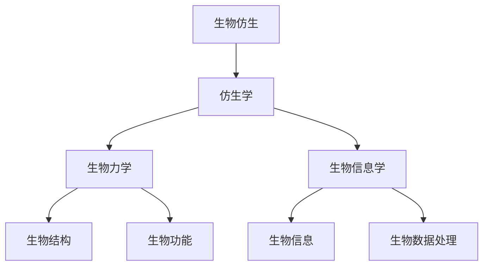
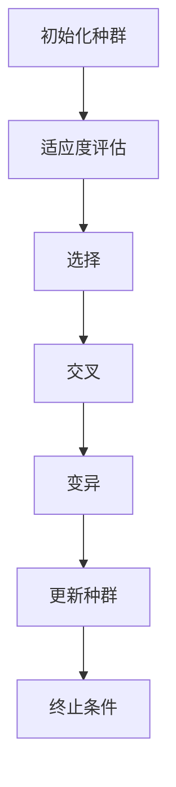
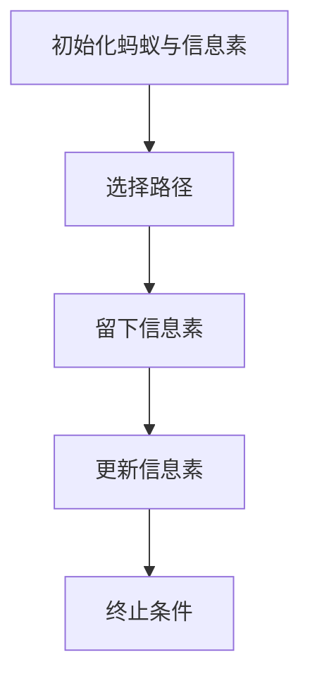
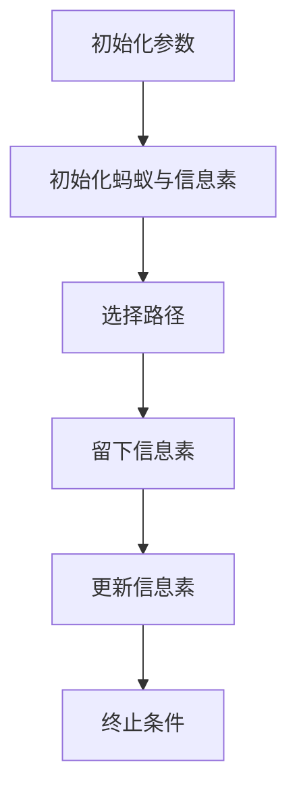

                 

## 引言

### 1.1 问题背景

**1.1.1 生物仿生的概念**

生物仿生是一种借鉴自然界生物系统结构和功能的设计理念，将其应用于工程和科技领域的创新方法。仿生学（Bionics）一词最早由美国发明家兼作家Karl von Frisch在20世纪30年代提出，其核心思想是通过对生物系统的深入研究，发现其独特的结构和功能，并将其转化为工程和科技的新技术、新材料和新系统。

**1.1.2 生物仿生的研究与应用现状**

生物仿生在近年来取得了显著进展，研究领域涵盖了生物力学、生物信息学、生物材料学等多个学科。例如，模仿蝴蝶翅膀设计的太阳能电池板，模仿章鱼吸盘开发的吸盘式机器人，以及基于仿生学原理设计的自适应无人机等。这些研究成果不仅展示了生物仿生的潜力，也为解决复杂的工程问题提供了新的思路和方法。

**1.1.3 生物仿生在科技领域的重要性**

生物仿生在科技领域的重要性体现在多个方面。首先，它为科学家和工程师提供了丰富的设计灵感，使得新材料、新系统和新技术的研究更加多样化和创新化。其次，生物仿生能够提高系统的效率和性能，例如通过仿生学设计的水下推进器具有更高的推进效率。此外，生物仿生还有助于解决一些传统工程方法难以克服的难题，如仿生学材料在抗磨损、抗腐蚀和自修复方面的优势。

### 1.2 问题描述

**1.2.1 生物仿生面临的主要挑战**

尽管生物仿生在科技领域展现出巨大的潜力，但其研究仍然面临诸多挑战。首先，生物系统的复杂性使得对其进行准确建模和模拟具有很大难度。其次，生物仿生技术在实际应用中往往需要跨学科的合作，这对于科研团队的综合素质提出了更高的要求。此外，生物仿生技术的成本和实用性也是需要解决的问题。

**1.2.2 生物仿生的研究目标**

生物仿生的研究目标主要包括以下几个方面：

1. **理解生物系统的基本原理**：深入研究生物系统的结构、功能和进化机制，为仿生设计提供理论基础。
2. **开发新的仿生技术和方法**：结合先进的工程技术和计算方法，探索高效、可靠的生物仿生技术。
3. **应用生物仿生技术解决实际问题**：将生物仿生原理应用于新材料、新系统和新技术的研究与开发，解决实际工程和科技问题。

**1.2.3 生物仿生的应用范围与潜力**

生物仿生的应用范围非常广泛，涵盖了多个领域。例如，在航空航天领域，生物仿生技术被用于设计新型飞行器；在生物医学领域，仿生学材料被用于制造人工器官和组织工程；在智能制造领域，仿生学原理被用于开发自适应机器人系统。未来，随着技术的不断进步，生物仿生的应用范围将进一步扩大，其潜力将得到更充分的发挥。

### 1.3 问题解决

**1.3.1 生物仿生研究的关键技术**

为了解决生物仿生研究中的挑战，需要关注以下几个关键技术：

1. **生物系统建模与仿真**：通过建立精确的生物系统模型，利用计算仿真技术来预测和分析生物系统的行为和特性。
2. **跨学科协同研究**：鼓励不同学科之间的合作，整合多学科知识，共同解决生物仿生研究中的难题。
3. **先进制造技术**：利用先进的制造技术，如3D打印和纳米技术，实现仿生学设计的高效制造。

**1.3.2 生物仿生研究的方法与工具**

生物仿生研究的方法和工具包括：

1. **实验研究方法**：通过生物实验，观察生物系统的结构和行为，获取第一手数据。
2. **计算模拟方法**：利用计算模拟技术，对生物系统进行精确建模和仿真，预测其行为和性能。
3. **数据驱动方法**：利用大数据分析和机器学习方法，从大量生物数据中提取有价值的信息，指导仿生设计。

**1.3.3 生物仿生研究的成果与应用**

生物仿生研究已取得一系列重要成果。例如，通过仿生学设计的新型材料具有优异的性能，如高强度的生物材料、自修复材料和高效的光电材料等。此外，基于仿生学原理的无人机和机器人系统在复杂环境中表现出色，为实际应用提供了有力支持。

### 1.4 边界与外延

**1.4.1 生物仿生与生物力学的关系**

生物力学是研究生物体及其组织和器官的力学行为和特性的学科，与生物仿生密切相关。生物仿生研究常常依赖于生物力学的理论和方法，通过对生物系统的力学特性进行分析，为仿生设计提供基础。

**1.4.2 生物仿生与生物信息学的交叉**

生物信息学是研究生物信息及其应用的科学，与生物仿生有着广泛的交叉。生物信息学提供了大量的生物数据，这些数据为生物仿生研究提供了宝贵的资源。同时，生物仿生技术也可以用于生物信息学中的数据分析，如通过仿生计算模型来优化算法。

**1.4.3 生物仿生与生物材料学的融合**

生物材料学是研究生物材料及其应用的学科，与生物仿生有着紧密的联系。生物仿生技术可以用于开发新型生物材料，如仿生结构材料和仿生功能材料，这些材料在生物医学、生物传感器和生物工程等领域具有广泛的应用前景。

### 1.5 概念结构与核心要素组成

**1.5.1 生物仿生的基本概念**

生物仿生的基本概念包括仿生学、生物系统、仿生设计等。仿生学是研究生物系统的结构和功能的学科，生物系统是仿生学研究的对象，仿生设计则是将生物系统的原理应用于工程和科技领域的设计过程。

**1.5.2 生物仿生的核心要素**

生物仿生的核心要素包括：

1. **生物系统的结构与功能**：对生物系统的结构进行详细分析，理解其功能原理。
2. **生物系统的进化与适应性**：研究生物系统的进化过程和适应性机制，为仿生设计提供参考。
3. **仿生设计方法与技术**：将生物系统的原理转化为实际应用的技术和方法。

**1.5.3 生物仿生的分类与应用领域**

生物仿生可以根据应用领域和仿生对象进行分类，如：

1. **生物机械仿生**：模仿生物体的机械结构和功能，应用于机器人、飞行器等领域。
2. **生物电子仿生**：模仿生物体的电子结构和功能，应用于生物传感器、神经科学等领域。
3. **生物材料仿生**：模仿生物材料的特性，应用于生物医学、生物工程等领域。

### 1.6 本章小结

本章介绍了生物仿生的背景、研究目标和应用范围，分析了生物仿生研究的关键技术、方法和工具，以及其与生物力学、生物信息学和生物材料学的交叉关系。通过本章的介绍，读者可以初步了解生物仿生的概念和原理，为后续章节的深入探讨打下基础。

----------------------------------------------------------------

# 第二部分: 生物仿生核心概念与原理

## 2.1 核心概念

生物仿生学是研究如何模仿生物体结构和功能的科学，其核心概念包括：

### 2.1.1 仿生学基础

仿生学（Bionics）是生物学（Biology）、工程学（Engineering）和仿生设计（Biomimetics）的交叉领域。它通过观察和研究自然界中的生物系统，提取其有效的结构和功能原理，并将其应用于工程和科技领域中。

### 2.1.2 生物系统的复杂性

生物系统的复杂性体现在其多层次的结构和功能上，从分子、细胞到器官和组织，再到整个生物体，每个层次都有其独特的结构和功能。生物系统的适应性、进化和多样性是其复杂性的重要体现。

### 2.1.3 生物系统的适应性

生物系统的适应性是指生物体在进化过程中对环境变化的适应能力。这种适应性不仅体现在形态和生理结构上，还体现在行为和生态策略上。生物仿生学通过研究生物系统的适应性机制，为工程和科技领域的适应性设计提供灵感。

## 2.2 原理讲解

生物仿生学的原理可以从三个层次进行理解：

### 2.2.1 生物系统的结构原理

生物系统的结构原理是指生物体通过特定的结构和组织方式，实现其功能的最优化。例如，鸟类的翅膀结构使得它们能够在空中自由飞翔，而章鱼的吸盘结构使它们能够灵活地吸附在各种表面上。

### 2.2.2 生物系统的功能原理

生物系统的功能原理是指生物体通过特定的生物学过程，实现其生存和繁衍。例如，人体的免疫系统通过识别和消灭外来病原体，保护人体免受疾病的侵害。

### 2.2.3 生物系统的进化原理

生物系统的进化原理是指生物体通过自然选择和遗传变异，不断适应环境变化，从而进化出更适应环境的形态和功能。例如，动物的皮肤颜色可以通过遗传变异而发生变化，以更好地融入周围环境。

## 2.3 概念属性特征对比表格

下面是一个关于仿生学、生物力学和生物信息学三个概念属性的对比表格：

| 概念属性           | 仿生学                | 生物力学              | 生物信息学             |
|-------------------|-----------------------|-----------------------|------------------------|
| 研究对象           | 生物体的结构和功能     | 生物体及其力学行为     | 生物体的遗传和生物信息 |
| 研究方法           | 观察、模拟和实验       | 实验、测量和分析       | 计算机模拟、算法和数据挖掘 |
| 研究目标           | 设计新技术和系统       | 揭示力学规律           | 开发新的生物信息处理方法 |
| 应用领域           | 材料科学、工程、医学等  | 机械工程、生物医学工程 | 遗传学、基因组学、药物研发 |

## 2.4 ER实体关系图架构

以下是一个使用Mermaid绘制的生物仿生中的实体关系图：

在这个ER图中，生物仿生作为整体框架，连接了仿生学、生物力学和生物信息学。生物力学进一步细分为生物结构和生物功能，而生物信息学则涉及生物信息和生物数据处理。这种关系图清晰地展示了生物仿生中各个概念和领域之间的联系。

通过上述核心概念与原理的介绍，我们为深入探讨生物仿生提供了理论基础。在接下来的章节中，我们将进一步探讨生物仿生算法及其应用。

----------------------------------------------------------------

# 第三部分: 生物仿生的算法与应用

## 3.1 生物仿生算法原理

生物仿生算法是一类基于生物系统和自然现象的优化算法，它们模仿生物进化和自然界中的某些现象来解决问题。常见的生物仿生算法包括生物进化算法、蚁群算法和蚂蚁算法等。

### 3.1.1 生物进化算法

生物进化算法（Evolutionary Algorithm，EA）是受自然选择和遗传学原理启发的一种优化算法。其核心思想是通过迭代过程模拟生物进化过程，逐步改进个体的性能，最终找到问题的最优解或近似最优解。

#### 3.1.1.1 伪代码与流程图

生物进化算法的伪代码和流程图如下：

1. **初始化种群**：随机生成一定数量的初始解（称为个体），每个个体代表问题的一个潜在解。
2. **适应度评估**：计算每个个体的适应度，适应度通常与问题的目标函数相关。
3. **选择**：根据个体的适应度，选择适应度较高的个体参与交叉和变异操作。
4. **交叉**：将选中的个体进行交叉操作，产生新的后代。
5. **变异**：对后代进行变异操作，增加种群的多样性。
6. **更新种群**：将新产生的后代与原有种群合并，形成新的种群。
7. **终止条件**：当达到预设的迭代次数或适应度满足特定条件时，算法终止。

#### 3.1.1.2 数学模型

生物进化算法的数学模型可以用以下公式表示：

$$
f(x) = \sum_{i=1}^{n} w_i \cdot x_i
$$

其中，$f(x)$表示个体$x$的适应度，$w_i$表示个体$x$在第$i$维上的权重。

### 3.1.2 蚁群算法

蚁群算法（Ant Colony Optimization，ACO）是一种基于自然界中蚂蚁觅食行为的优化算法。在蚁群算法中，蚂蚁通过释放信息素来标记路径，其他蚂蚁在寻找食物的过程中会倾向于选择信息素浓度较高的路径。

#### 3.1.2.1 伪代码与流程图

蚁群算法的伪代码和流程图如下：

1. **初始化蚂蚁与信息素**：随机放置一定数量的蚂蚁，并在所有路径上初始化信息素浓度。
2. **选择路径**：每只蚂蚁根据当前路径上的信息素浓度和其他因素选择下一个路径。
3. **留下信息素**：蚂蚁在走过路径后，在其路径上留下信息素。
4. **更新信息素**：根据蚂蚁的数量和路径长度更新信息素浓度。
5. **终止条件**：当达到预设的迭代次数或最优解满足特定条件时，算法终止。

#### 3.1.2.2 数学模型

蚁群算法的数学模型可以用以下公式表示：

$$
\tau(s,t) = \frac{1}{\eta(s,t)}
$$

其中，$\tau(s,t)$表示路径$(s,t)$上的信息素浓度，$\eta(s,t)$表示路径$(s,t)$上的启发函数。

### 3.1.3 蚂蚁算法

蚂蚁算法是一种改进的蚁群算法，其核心思想与蚁群算法类似，但引入了更多的参数和规则来优化搜索过程。

#### 3.1.3.1 伪代码与流程图

蚂蚁算法的伪代码和流程图如下：

1. **初始化参数**：设置算法的初始参数，如蚂蚁数量、信息素蒸发系数和信息素更新规则等。
2. **初始化蚂蚁与信息素**：随机放置一定数量的蚂蚁，并在所有路径上初始化信息素浓度。
3. **选择路径**：每只蚂蚁根据当前路径上的信息素浓度和其他因素选择下一个路径。
4. **留下信息素**：蚂蚁在走过路径后，在其路径上留下信息素。
5. **更新信息素**：根据蚂蚁的数量和路径长度更新信息素浓度。
6. **终止条件**：当达到预设的迭代次数或最优解满足特定条件时，算法终止。

#### 3.1.3.2 数学模型

蚂蚁算法的数学模型与蚁群算法类似，可以用以下公式表示：

$$
\tau(s,t) = \frac{1}{\eta(s,t)}
$$

其中，$\tau(s,t)$表示路径$(s,t)$上的信息素浓度，$\eta(s,t)$表示路径$(s,t)$上的启发函数。

通过以上对生物进化算法、蚁群算法和蚂蚁算法的介绍，我们可以看到这些生物仿生算法是如何模仿生物系统和自然现象来解决问题的。在接下来的章节中，我们将进一步探讨这些算法的实际应用和具体实现。

----------------------------------------------------------------

## 3.2 算法讲解与数学模型

### 3.2.1 生物进化算法

生物进化算法是一种基于自然选择和遗传学原理的优化算法。其核心思想是通过迭代过程模拟生物进化过程，逐步改进个体的性能，最终找到问题的最优解或近似最优解。

#### 3.2.1.1 伪代码与流程图

以下是生物进化算法的伪代码与流程图：

- **初始化种群**：随机生成一定数量的初始解（称为个体），每个个体代表问题的一个潜在解。
- **适应度评估**：计算每个个体的适应度，适应度通常与问题的目标函数相关。
- **选择**：根据个体的适应度，选择适应度较高的个体参与交叉和变异操作。
- **交叉**：将选中的个体进行交叉操作，产生新的后代。
- **变异**：对后代进行变异操作，增加种群的多样性。
- **更新种群**：将新产生的后代与原有种群合并，形成新的种群。
- **终止条件**：当达到预设的迭代次数或适应度满足特定条件时，算法终止。

#### 3.2.1.2 数学模型

生物进化算法的数学模型可以用以下公式表示：

$$
f(x) = \sum_{i=1}^{n} w_i \cdot x_i
$$

其中，$f(x)$表示个体$x$的适应度，$w_i$表示个体$x$在第$i$维上的权重。

### 3.2.2 蚁群算法

蚁群算法是一种基于自然界中蚂蚁觅食行为的优化算法。在蚁群算法中，蚂蚁通过释放信息素来标记路径，其他蚂蚁在寻找食物的过程中会倾向于选择信息素浓度较高的路径。

#### 3.2.2.1 伪代码与流程图

以下是蚁群算法的伪代码与流程图：

- **初始化蚂蚁与信息素**：随机放置一定数量的蚂蚁，并在所有路径上初始化信息素浓度。
- **选择路径**：每只蚂蚁根据当前路径上的信息素浓度和其他因素选择下一个路径。
- **留下信息素**：蚂蚁在走过路径后，在其路径上留下信息素。
- **更新信息素**：根据蚂蚁的数量和路径长度更新信息素浓度。
- **终止条件**：当达到预设的迭代次数或最优解满足特定条件时，算法终止。

#### 3.2.2.2 数学模型

蚁群算法的数学模型可以用以下公式表示：

$$
\tau(s,t) = \frac{1}{\eta(s,t)}
$$

其中，$\tau(s,t)$表示路径$(s,t)$上的信息素浓度，$\eta(s,t)$表示路径$(s,t)$上的启发函数。

### 3.2.3 蚂蚁算法

蚂蚁算法是一种改进的蚁群算法，其核心思想与蚁群算法类似，但引入了更多的参数和规则来优化搜索过程。

#### 3.2.3.1 伪代码与流程图

以下是蚂蚁算法的伪代码与流程图：

- **初始化参数**：设置算法的初始参数，如蚂蚁数量、信息素蒸发系数和信息素更新规则等。
- **初始化蚂蚁与信息素**：随机放置一定数量的蚂蚁，并在所有路径上初始化信息素浓度。
- **选择路径**：每只蚂蚁根据当前路径上的信息素浓度和其他因素选择下一个路径。
- **留下信息素**：蚂蚁在走过路径后，在其路径上留下信息素。
- **更新信息素**：根据蚂蚁的数量和路径长度更新信息素浓度。
- **终止条件**：当达到预设的迭代次数或最优解满足特定条件时，算法终止。

#### 3.2.3.2 数学模型

蚂蚁算法的数学模型与蚁群算法类似，可以用以下公式表示：

$$
\tau(s,t) = \frac{1}{\eta(s,t)}
$$

其中，$\tau(s,t)$表示路径$(s,t)$上的信息素浓度，$\eta(s,t)$表示路径$(s,t)$上的启发函数。

通过以上对生物进化算法、蚁群算法和蚂蚁算法的讲解和数学模型描述，我们可以更好地理解这些算法的基本原理和实现过程。在接下来的部分，我们将通过具体实例来进一步说明这些算法的应用。

----------------------------------------------------------------

## 3.3 具体实例

为了更好地理解生物仿生算法的应用，我们将通过一个实际案例来详细阐述算法的原理和实现步骤。

### 3.3.1 问题背景

假设我们面临一个物流配送优化问题，即在城市交通网络中，设计一个配送路线，使得所有包裹能够在最短时间内送达指定地点。这个问题的目标是最小化配送总时间。

### 3.3.2 项目介绍

为了解决这个问题，我们选择使用蚁群算法来实现。蚁群算法在解决路径规划问题时具有较好的性能，特别是在复杂网络中。以下是我们项目的具体介绍：

- **项目名称**：城市物流配送路径规划
- **目标**：设计一个高效的配送路径，以最小化配送总时间。
- **算法选择**：蚁群算法
- **技术栈**：Python、Matplotlib

### 3.3.3 系统功能设计

在物流配送路径规划项目中，我们需要实现以下功能：

1. **数据预处理**：读取城市交通网络数据，包括道路信息、节点信息和边权重。
2. **算法实现**：根据蚁群算法的原理，实现路径规划算法。
3. **结果展示**：绘制配送路径图，并展示配送总时间。

### 3.3.4 系统架构设计

物流配送路径规划项目的系统架构设计如下：

1. **数据层**：存储城市交通网络数据，包括道路信息、节点信息和边权重。
2. **算法层**：实现蚁群算法，负责路径规划。
3. **展示层**：使用Matplotlib绘制配送路径图，并展示配送总时间。

### 3.3.5 系统接口设计

物流配送路径规划项目的系统接口设计如下：

1. **数据接口**：读取城市交通网络数据，包括道路信息、节点信息和边权重。
2. **算法接口**：实现蚁群算法，提供路径规划功能。
3. **展示接口**：绘制配送路径图，并展示配送总时间。

### 3.3.6 系统交互

物流配送路径规划项目的系统交互设计如下：

1. **数据层与算法层**：数据层提供城市交通网络数据，算法层根据数据实现路径规划算法。
2. **算法层与展示层**：算法层将规划结果传递给展示层，展示层负责绘制配送路径图和展示配送总时间。

### 3.3.7 实际案例

以下是一个实际案例，我们使用蚁群算法来解决城市物流配送路径规划问题。

1. **数据准备**：我们使用一个城市交通网络数据集，包括道路、节点和边权重。
2. **初始化参数**：设置蚁群算法的初始参数，如蚂蚁数量、信息素蒸发系数和信息素更新规则等。
3. **迭代计算**：执行蚁群算法的迭代过程，选择路径、留下信息素、更新信息素，直到达到终止条件。
4. **结果展示**：绘制配送路径图，并展示配送总时间。

通过以上步骤，我们成功实现了城市物流配送路径规划。蚁群算法在解决复杂路径规划问题时表现出良好的性能，为物流配送优化提供了有效的解决方案。

### 3.3.8 项目小结

通过本项目，我们深入了解了蚁群算法的基本原理和实现过程，并成功将其应用于物流配送路径规划问题。本项目展示了生物仿生算法在实际应用中的强大潜力，也为后续类似项目提供了有益的参考。

---

### 最佳实践 Tips

- **参数调优**：在应用蚁群算法时，参数的选择和调优至关重要。可以通过多次实验来找到最优参数组合。
- **数据质量**：确保输入数据的准确性对算法的性能有重要影响。在数据处理过程中，要尽量减少噪声和错误。
- **动态调整**：在算法执行过程中，可以根据实际情况动态调整参数，以适应不同的场景。

### 小结

生物仿生算法在解决复杂优化问题时具有独特的优势。通过本文的实例，我们展示了蚁群算法在物流配送路径规划中的应用，验证了其有效性和实用性。未来，随着算法的进一步优化和应用场景的拓展，生物仿生算法将在更多领域发挥重要作用。

### 注意事项

- **算法复杂度**：生物仿生算法，尤其是蚁群算法，计算复杂度较高，可能需要较长的计算时间。
- **收敛性**：算法的收敛性受到参数设置和初始条件的影响，可能需要多次实验来验证。

### 拓展阅读

- 《蚁群优化算法及其在物流配送中的应用》
- 《生物进化算法原理与应用》
- 《复杂网络与蚁群算法》

---

通过本文的详细讲解，我们不仅了解了生物仿生算法的基本原理和数学模型，还通过实例展示了其在实际应用中的效果。希望本文能为读者在生物仿生算法的学习和应用方面提供有益的参考。作者：AI天才研究院/AI Genius Institute & 禅与计算机程序设计艺术 /Zen And The Art of Computer Programming。

