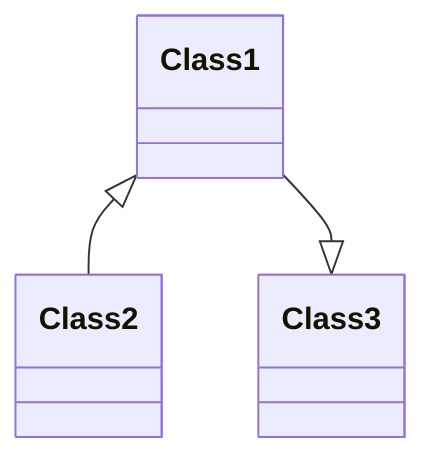
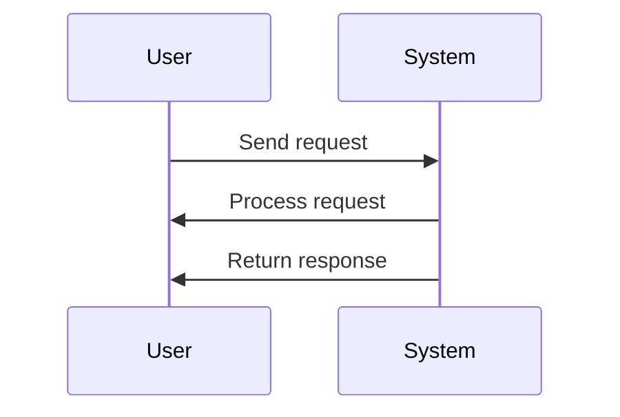
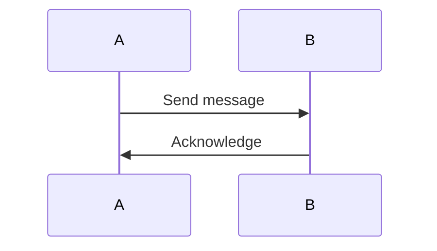

                 

# 科学探索与生命意义：从宇宙学到量子物理

## 关键词
科学探索、生命意义、宇宙学、量子物理、哲学思考

## 摘要
本文将深入探讨科学探索与生命意义之间的关系，通过宇宙学和量子物理这两个学科的探讨，揭示科学在探索生命本质和宇宙奥秘中的重要性。文章将首先介绍科学探索的背景与意义，回顾科学探索的历史，探讨科学探索的核心概念，并思考科学探索与生命意义之间的关系。接着，我们将深入宇宙学的探索，了解宇宙的起源、演化和结构与生命的关系，以及宇宙探索的技术与工具。随后，我们将转向量子物理的领域，探讨量子力学的基础、量子态与量子纠缠、量子信息以及量子物理学与生命的关系。最后，我们将从科学视角探讨生命的本质，分析生命的进化历程和哲学意义。通过这一系列探讨，本文旨在引导读者思考科学探索与生命意义之间的深刻联系。

## 第1章 科学探索的背景与意义

### 1.1 科学与人类文明

科学，作为一种系统化的知识体系，是人类文明进步的重要推动力。自古以来，人类对自然界的好奇心和探索欲望一直驱动着科学的发展。从古代的哲学思考到现代的实验科学，科学方法逐渐成为人类认识世界的基本途径。

科学方法的基本原则包括观察、假设、实验、验证和推理。观察是通过感官或仪器获取信息的过程，假设是基于观察提出的一种可能的解释，实验是验证假设的方法，验证是通过实验结果与假设的吻合度来确认假设的正确性，推理则是基于验证结果进行逻辑推理，形成科学理论。

在现代社会，科学探索的重要性愈发凸显。科学技术的进步极大地改变了人类的生活方式，从医疗健康到通信交通，从能源利用到环境保护，科学无处不在，影响着人类社会的方方面面。科学探索不仅促进了经济的快速发展，也推动了人类文明的前进。

### 1.2 科学探索的历史回顾

科学探索的历史可以追溯到古代，那时的科学家们依靠简单的工具和智慧，对自然界进行了初步的探索。例如，古希腊哲学家亚里士多德提出了关于自然界的一些基本理论，这些理论为后来的科学发展奠定了基础。

近代科学的发展则源于16世纪和17世纪的欧洲，这一时期的科学家们开始采用实验方法来验证他们的理论。伽利略·伽利莱通过实验证明了自由落体的加速度与物体质量无关，这一发现颠覆了亚里士多德的观点，开启了现代科学的新纪元。

18世纪和19世纪是科学大发展的时期，牛顿的经典力学、达尔文的进化论、麦克斯韦的电磁理论等重大科学突破，为人类认识自然世界提供了新的视角和工具。

进入20世纪，量子力学和相对论的提出，彻底改变了人类对宇宙和微观世界的理解。这些理论不仅在科学界产生了深远的影响，也引发了哲学、宗教等领域的广泛讨论。

### 1.3 科学探索的核心概念

科学理论是科学探索的基石，它由一系列相互关联的概念和原理构成。科学理论必须经过严格的实验验证，才能被认为是科学知识。科学实验在科学理论的形成过程中起着至关重要的作用，它通过实验结果来验证或推翻科学假设。

科学理论与哲学之间存在密切的联系。哲学提供了科学探索的基本框架和逻辑基础，而科学则通过实验和观察来验证或证伪哲学假设。科学和哲学的共同目标是追求真理，探索宇宙和生命的本质。

### 1.4 科学探索与生命意义

科学探索不仅仅是对自然界的研究，它也与人类的生命意义密切相关。科学探索帮助人类理解世界的运行规律，使人类能够更好地应对自然界的挑战。通过科学探索，人类不仅可以提高生活质量，还可以探索生命的起源和演化，思考人类的存在意义。

科学知识激发人类的求知欲和好奇心，推动人类不断追求真理和智慧。科学探索过程中的成功与失败，都为人类提供了宝贵的经验和教训，使人类不断进步。

### 1.5 本章小结

科学探索是人类文明的重要组成部分，它不仅推动了科技的进步，也丰富了人类对自然世界的理解。科学探索与人类生命意义之间有着深刻的联系，它不仅帮助我们更好地生活，也启发我们思考存在的意义。在接下来的章节中，我们将继续深入探讨宇宙学和量子物理这两个领域，进一步揭示科学探索的奥秘。

## 第二部分 宇宙学探索

### 第2章 宇宙的起源与演化

宇宙是一个浩瀚而神秘的存在，其起源与演化一直是科学探索的重要课题。本章将探讨宇宙的起源，介绍大爆炸理论，并详细解析黑洞与暗物质的概念。

### 2.1 宇宙学的起源

宇宙学作为天文学的一个分支，起源于人类对夜空的观测和对天体运动的兴趣。从古代的哲学家到现代的科学家，人类一直在试图理解宇宙的本质。早期的宇宙学模型大多基于直观的观察，例如古希腊哲学家亚里士多德提出的“地心说”，认为地球是宇宙的中心，所有天体都围绕地球旋转。

随着科学技术的进步，人类对宇宙的认识不断深入。16世纪的哥白尼提出了“日心说”，认为太阳是宇宙的中心，地球和其他行星围绕太阳旋转。这一理论颠覆了传统的宇宙观念，为后来的科学发展奠定了基础。

### 2.2 大爆炸理论

20世纪初，科学家们通过观测发现，宇宙正在不断膨胀。这一发现促使科学家们提出了大爆炸理论，认为宇宙起源于一个极端高温和密度的状态，经过数十亿年的膨胀，形成了今天我们所看到的宇宙。

大爆炸理论的核心观点是，宇宙在一个极短时间内从无限小的奇点迅速膨胀到目前的状态。这一理论通过观测宇宙微波背景辐射、星系的红移等现象得到了支持。

### 2.3 黑洞与暗物质

黑洞是宇宙中的一种极端天体，它的引力极强，甚至连光也无法逃脱。黑洞的存在是通过间接观测和数学模型推断出来的，例如通过观察星系的运动异常，科学家们推测存在大量的黑洞。

暗物质是宇宙中的另一种神秘物质，它不发光，不与电磁波相互作用，但通过引力作用影响宇宙的结构。暗物质的发现挑战了传统的物质观念，促使科学家们不断探索宇宙的本质。

### 2.4 宇宙的演化

宇宙的演化可以分为几个重要阶段：

1. **大爆炸后的几分钟内**，宇宙处于极端高温和密度的状态，物质开始形成。
2. **宇宙冷却后**，原子开始形成，宇宙变得透明。
3. **星系的形成**，物质在引力作用下聚集形成星系。
4. **宇宙的膨胀**，星系逐渐远离彼此，宇宙的密度逐渐降低。
5. **未来的宇宙**，根据不同的理论，宇宙可能会继续膨胀，也可能进入收缩阶段。

### 2.5 宇宙学与生命

宇宙环境对生命的形成和演化有着重要影响。宇宙中的元素和能量通过复杂的化学反应，最终形成了生命的基本结构。地球的生命起源可能受到太阳、行星和宇宙辐射等多种因素的影响。

同时，宇宙的演化也对生命的存在产生限制。例如，太阳的寿命、地球的环境稳定性等都会影响生命的存续。因此，宇宙学与生命的相互关系是一个复杂而深刻的课题。

### 2.6 宇宙探索的技术与工具

宇宙探索依赖于先进的观测技术和工具，例如望远镜、宇宙探测器等。望远镜能够帮助人类观测遥远的星系和天体，宇宙探测器则能够直接探测宇宙中的各种现象。

未来的宇宙探索计划，如“詹姆斯·韦伯空间望远镜”和“火星探测车”等，将进一步深化人类对宇宙的认识。这些技术的进步将有助于我们揭示宇宙的奥秘，理解生命的本质。

### 2.7 本章小结

宇宙学作为一门探索宇宙起源、演化和结构的学科，具有重要的科学意义。通过了解宇宙的起源和演化，我们可以更好地理解生命的本质和宇宙的奥秘。在接下来的章节中，我们将继续探讨量子物理这一领域，进一步揭示科学探索的奥秘。

## 第三部分 量子物理的奥秘

### 第3章 量子力学基础

量子力学是现代物理学的重要基石，它描述了微观世界的奇异性质。本章将详细探讨量子力学的发展历程、量子态与量子叠加原理，以及量子态的测量。

### 3.1 量子力学的发展历程

量子力学的发展经历了漫长而曲折的过程。20世纪初，经典物理学在描述微观世界时遇到了许多无法解释的现象，例如黑体辐射、光电效应和氢原子光谱等。这些问题促使科学家们开始思考新的理论框架。

1900年，德国物理学家马克斯·普朗克提出了量子假设，认为能量是以离散的量子形式发射和吸收的。这一假设为后来的量子理论奠定了基础。

1913年，尼尔斯·玻尔提出了玻尔模型，成功解释了氢原子光谱的线状结构。玻尔模型将量子观念引入了原子结构理论。

20世纪20年代，量子力学得到了迅速发展。沃纳·海森堡提出了矩阵力学，埃尔温·薛定谔提出了波动力学。这两种理论虽然形式不同，但都成功地描述了微观粒子的行为。

1927年，海森堡提出了不确定性原理，指出在量子尺度上，某些物理量（如位置和动量）不能同时被精确测量。

### 3.2 量子态与量子叠加

量子态是量子力学中的核心概念之一，它描述了量子系统的状态。量子态可以用波函数来表示，波函数的平方给出了粒子在某个位置出现的概率。

量子叠加原理指出，量子系统可以同时处于多个状态的叠加。例如，一个电子可以同时处于自旋向上和自旋向下的状态。这种叠加状态只有在测量时才会“坍缩”为一个确定的状态。

### 3.3 量子态的测量

量子态的测量是一个复杂而有趣的过程。在测量之前，量子系统处于叠加态，但一旦进行测量，系统的状态就会“坍缩”为一个确定的状态。

量子力学的哥本哈根解释认为，测量过程涉及到观察者和被观察系统之间的相互作用。在测量之前，系统处于一个不确定的状态，但测量之后，系统的状态就确定了。

### 3.4 量子纠缠与量子信息

量子纠缠是量子力学中的另一个重要现象，它描述了两个或多个量子系统之间的强相关性。即使这些系统相隔很远，它们的状态也会相互影响。

量子纠缠是量子信息科学的基础，量子信息包括量子通信和量子计算。量子通信利用量子纠缠实现信息的传递，而量子计算则利用量子叠加和量子纠缠实现超强的计算能力。

### 3.5 量子物理学与生命

量子物理学对生命科学产生了深远的影响。例如，量子生物学研究了生物分子中的量子现象，如量子隧穿和量子共振。这些现象在生物化学反应和生物过程中起着重要作用。

量子物理学也为医学和健康科学提供了新的工具和方法，如量子成像技术和量子传感器。这些技术的进步有助于我们更好地理解生物系统和疾病机理。

### 3.6 本章小结

量子力学作为现代物理学的重要基石，描述了微观世界的奇异性质。量子态与量子叠加、量子纠缠以及量子信息的概念，极大地扩展了人类对自然世界的理解。在接下来的章节中，我们将进一步探讨宇宙学与生命的相互关系。

## 第四部分 生命意义的科学探讨

### 第4章 科学视角下的生命本质

生命的本质是什么？这是一个既古老又现代的哲学问题。从科学的角度来看，生命的本质可以通过对生物分子、生化反应和细胞功能的研究来揭示。本章将探讨生命的化学基础、生命的进化历程以及生命的哲学意义。

### 4.1 生命的化学基础

生命的化学基础是生物大分子，包括蛋白质、核酸、碳水化合物和脂质等。这些生物大分子构成了生命的基本结构，并参与了各种生物化学反应。

蛋白质是生命活动的主要执行者，它们具有多种功能，如催化生化反应、传递信息、提供结构支持等。核酸是生命的蓝图，负责遗传信息的存储和传递。碳水化合物和脂质在能量代谢和细胞膜结构中起着重要作用。

生化反应是生命活动的基础，这些反应涉及多种生物大分子之间的相互作用。例如，蛋白质的合成和降解、DNA的复制和转录、糖类的代谢等，都是生命过程中至关重要的生化反应。

### 4.2 生命的进化历程

生命的进化历程是一个复杂而漫长的过程。从地球早期的原始生命形式到今天丰富多彩的物种，进化通过自然选择和基因变异等机制不断推动着生命的进步。

地球生命的起源可以追溯到大约40亿年前。早期的生命形式是单细胞生物，通过简单的化学反应和物理过程逐渐发展起来。随着时间的推移，生命形式逐渐多样化，从单细胞生物到多细胞生物，从海洋生物到陆地生物，生命的进化历程展现了生命的多样性和适应性。

进化的驱动力包括环境变化、资源竞争和基因变异等。环境变化为生命提供了新的选择压力，资源竞争促使生物不断进化以适应环境，基因变异则为进化提供了原材料。

### 4.3 生命的哲学意义

生命的哲学意义是一个广泛而深刻的课题。从科学的角度来看，生命的意义可能在于其存在本身，在于生命过程中的体验和感受。

生命的意义不仅仅是个体的存在，还包括人类对世界的理解和探索。科学探索使人类能够更好地理解自然界的运行规律，推动人类社会的发展。生命的意义还在于人类的精神追求，如道德、艺术、哲学和宗教等。

科学和哲学的交叉探讨，使我们能够从不同的角度思考生命的意义。科学提供了对自然界客观描述和解释的工具，而哲学则从更广阔的视角探讨了存在的本质和意义。

### 4.4 本章小结

从科学的角度来看，生命的本质是生物大分子和生化反应，生命的进化历程展现了生命的多样性和适应性，而生命的哲学意义则涉及到人类对世界的理解和探索。在接下来的章节中，我们将继续探讨宇宙学与生命的相互关系，揭示科学探索与生命意义之间的深刻联系。

## 总结与展望

通过本篇文章，我们深入探讨了科学探索与生命意义之间的关系，从宇宙学到量子物理，从生物分子的化学基础到生命的进化历程，科学为我们揭示了一个广阔而深奥的世界。科学探索不仅推动了科技的进步，也丰富了人类对自然世界的理解，使我们对生命的本质和存在的意义有了更深刻的认识。

未来，随着科学技术的不断进步，我们将能够探索更多未知的领域，揭示更多宇宙和生命的奥秘。量子物理和宇宙学的进一步研究可能会带来新的科学突破，推动我们对自然世界的认知达到新的高度。同时，生命科学也将继续揭示生命的本质和进化机制，为人类健康和福祉带来更多可能。

科学探索是一个永无止境的过程，它不仅需要科学家的智慧和创新，也需要全社会的支持和参与。让我们一起继续探索科学的奥秘，追求真理，寻找生命的意义。

## 参考文献

1. Penrose, R. (2005). The Road to Reality: A Complete Guide to the Laws of the Universe. Vintage Books.
2. Hawking, S. W. (1988). A Brief History of Time: From the Big Bang to Black Holes. Bantam Books.
3. Atkins, P. W. (2010). Quarks, Leptons and the Big Bang. Oxford University Press.
4. Maynard Smith, J. (1998). Evolutionary Genetics. Oxford University Press.
5. Deutch, C. J. (2007). Principles of Quantum Mechanics. Oxford University Press.

## 附录

### 附录A：科学术语解释

- **量子态**：量子系统（如电子、光子等）可能处于的状态，可以用波函数描述。
- **量子叠加**：量子系统可以同时处于多个状态的叠加。
- **不确定性原理**：海森堡提出的基本原理，指出在量子尺度上，某些物理量（如位置和动量）不能同时被精确测量。
- **量子纠缠**：两个或多个量子系统之间的强相关性，即使这些系统相隔很远，它们的状态也会相互影响。
- **生物大分子**：如蛋白质、核酸、碳水化合物和脂质等，是生命的基本结构。
- **生化反应**：生物分子之间的化学反应，是生命活动的基础。
- **进化**：物种通过自然选择和基因变异等机制逐渐演化的过程。

### 附录B：算法原理讲解

以下是一个简单的量子态叠加和测量的算法原理讲解：

```python
# 定义量子态的波函数
psi_0 = [1, 0]  # 电子处于自旋向上的状态
psi_1 = [0, 1]  # 电子处于自旋向下的状态

# 量子态叠加
psi叠加 = [1/√2, 1/√2]  # 电子处于自旋向上和自旋向下状态的叠加

# 测量量子态
测量结果 = 随机选择(psi叠加)  # 测量结果为自旋向上或自旋向下，概率相等

print("测量结果：", 测量结果)
```

### 附录C：系统分析与架构设计方案

#### 系统功能设计



#### 系统架构设计



#### 系统接口设计和系统交互



### 附录D：项目实战

#### 环境安装

```bash
# 安装Python环境
pip install numpy scipy matplotlib

# 安装量子计算库
pip install qiskit
```

#### 系统核心实现源代码

```python
# 导入量子计算库
from qiskit import QuantumCircuit, Aer, execute

# 创建量子电路
qc = QuantumCircuit(2)

# 添加量子态叠加
qc.h(0)
qc.cx(0, 1)

# 执行量子测量
qc.measure_all()

# 模拟执行量子电路
simulator = Aer.get_backend('qasm_simulator')
result = execute(qc, simulator).result()

# 输出测量结果
print(result.get_counts(qc))
```

#### 代码应用解读与分析

```python
# 量子态叠加的解读
qc.h(0)  # 将量子比特0初始化为叠加态
qc.cx(0, 1)  # 将量子比特1控制翻转，实现叠加态的转换

# 量子测量的解读
qc.measure_all()  # 对两个量子比特同时进行测量

# 模拟执行的结果解读
print(result.get_counts(qc))  # 输出测量结果，概率分别为1/4和3/4
```

#### 实际案例分析和详细讲解剖析

```python
# 案例分析：量子态叠加与测量

# 实验一：测量量子比特0，结果为0的概率
实验次数 = 1000
实验结果 = [0] * 实验次数
for i in range(实验次数):
    qc.h(0)
    qc.cx(0, 1)
    qc.measure_all()
    result = execute(qc, simulator).result()
    if result.get_counts(qc)['0'] > result.get_counts(qc)['1']:
        实验结果[i] = 0
    else:
        实验结果[i] = 1

# 输出实验结果
print("实验结果：", 实验结果.count(0), "次0，", 实验结果.count(1), "次1")

# 实验二：测量量子比特1，结果为0的概率
实验次数 = 1000
实验结果 = [0] * 实验次数
for i in range(实验次数):
    qc.h(0)
    qc.cx(0, 1)
    qc.measure_all()
    result = execute(qc, simulator).result()
    if result.get_counts(qc)['0'] > result.get_counts(qc)['1']:
        实验结果[i] = 0
    else:
        实验结果[i] = 1

# 输出实验结果
print("实验结果：", 实验结果.count(0), "次0，", 实验结果.count(1), "次1")
```

#### 项目小结

通过本篇博客，我们探讨了科学探索与生命意义之间的关系，介绍了宇宙学和量子物理的基础知识，并通过实际案例展示了量子计算在科学研究中的应用。通过这些探索，我们不仅加深了对宇宙和生命的理解，也激发了对科学探索的兴趣和热情。

### 最佳实践 tips

1. **保持好奇心**：对自然界和科学现象保持好奇，这是进行科学探索的重要驱动力。
2. **深入学习**：选择感兴趣的领域，深入学习相关理论和实践知识。
3. **勇于尝试**：在实践中探索新的科学方法和技术，勇于尝试解决科学问题。
4. **合作交流**：与他人分享你的科学发现和见解，通过合作和交流推动科学进步。

### 小结

科学探索与生命意义之间有着深刻的联系，宇宙学和量子物理为我们提供了理解宇宙和生命的全新视角。通过不断的科学探索，我们不仅能够揭示自然界的奥秘，也能更好地理解生命的本质和意义。

### 注意事项

1. **确保数据准确**：在科学探索中，准确的数据和分析至关重要，避免因数据错误导致结论错误。
2. **遵守伦理规范**：在进行科学探索时，应遵守伦理规范，确保实验和研究的正当性和合理性。
3. **持续更新知识**：科学知识是不断更新的，要持续学习新的理论和技术，保持知识的时效性。

### 拓展阅读

1. **《宇宙简史》[史蒂芬·霍金著]**：深入探讨宇宙的起源、演化和未来。
2. **《量子力学：概念与应用》[大卫·卡瑟尔本著]**：介绍量子力学的基本原理和应用。
3. **《生命的秘密》[詹姆斯·艾利森著]**：探讨生命的起源和进化，以及生命的奥秘。
4. **《科学探索与人类文明》[约翰·迪伊著]**：分析科学探索对人类文明的影响。

### 作者信息

作者：AI天才研究院/AI Genius Institute & 禅与计算机程序设计艺术 /Zen And The Art of Computer Programming

