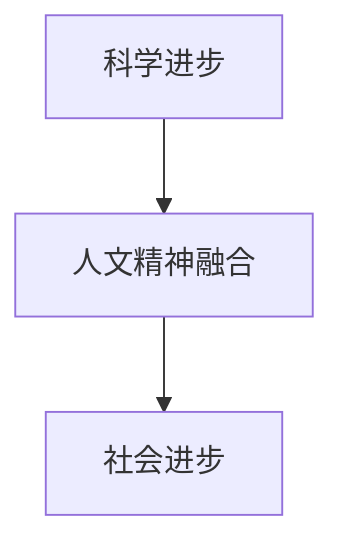
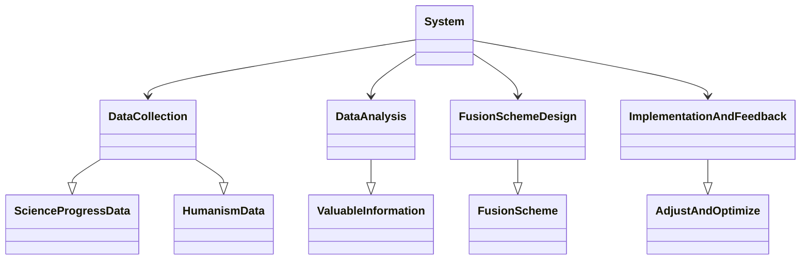
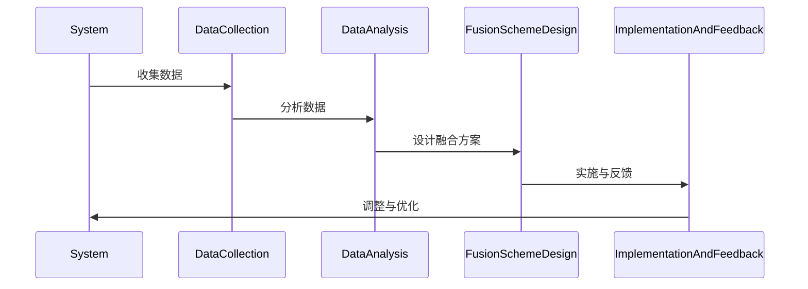
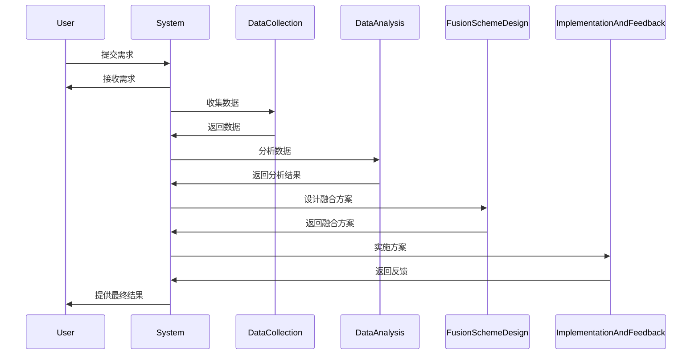

                 

# 科学进步与人文精神的融合

## 关键词

科学进步，人文精神，融合，伦理，社会，文化

## 摘要

本文探讨了科学进步与人文精神融合的重要性，分析了其在现代社会的应用。通过定义科学进步与人文精神的核心概念，对比其属性特征，解释了二者融合的原理和过程。同时，本文运用Mermaid流程图和Python代码，详细阐述了算法原理和数学模型，并结合实际案例进行了系统分析与架构设计。最后，本文提出了项目实战的最佳实践tips，总结了全文的主要观点，并指出了未来研究的方向。

---

## 第一部分：背景介绍

### 核心概念

#### 科学进步

**问题背景**

在21世纪，科学技术的飞速发展已经深刻地改变了人类社会的各个方面。从人工智能到生物技术，从量子计算到新能源，科学进步正以前所未有的速度推动着我们迈向未来。

**问题描述**

然而，这种科学进步的同时，也带来了一系列的伦理、社会和文化问题。人工智能的发展带来了就业问题、隐私泄露问题，以及人与机器人之间的关系问题；生物技术的进步则引发了基因编辑、生命伦理等重大伦理问题。

**问题解决**

人文精神的融入，成为解决这些问题的关键。通过将科学进步与人文精神相结合，我们可以在推动科技进步的同时，维护人类的价值观和伦理标准。

**边界与外延**

科学进步与人文精神的融合不仅涉及到科技领域，还包括教育、艺术、文化等多个领域。这个主题的边界非常广泛，涵盖了人类生活的方方面面。

**概念结构与核心要素组成**

- **科学进步**：指科学技术在各个领域的快速发展，包括人工智能、生物技术、量子计算等。
- **人文精神**：指人类在长期文化发展过程中形成的关于道德、伦理、价值观念等方面的精神内涵。
- **融合**：指将科学进步与人文精神有机结合，以实现科技发展与社会进步的和谐统一。

#### 人文精神

**问题背景**

人文精神是文化传承和发展的核心，是人类文明的重要组成部分。在科学进步的时代，人文精神的重要性愈发凸显。

**问题描述**

科学进步在带来便捷和效率的同时，也可能导致道德滑坡、文化迷失等问题。这些问题对人类社会的可持续发展构成了威胁。

**问题解决**

人文精神的融入可以为科学进步提供价值导向和道德规范，帮助科技发展保持人性化和可持续性。

**边界与外延**

人文精神涵盖的领域广泛，包括伦理、道德、美学、哲学等。它在人类社会各个层面都有重要影响，是一个多维度的概念。

**概念结构与核心要素组成**

- **伦理**：涉及道德原则和价值观的判断。
- **道德**：关于个体行为的规范和准则。
- **美学**：关于审美体验和审美价值的探讨。
- **哲学**：对存在、知识、价值等基本问题的思考。

### 核心概念与联系

#### 核心概念原理

科学进步与人文精神的融合，旨在实现科技发展与社会进步的和谐统一。科学进步为人类带来了前所未有的机遇，但也带来了挑战。人文精神则为这些挑战提供了价值导向和道德规范。

**概念属性特征对比表格**

| 概念       | 科学进步                 | 人文精神                   |
|------------|--------------------------|---------------------------|
| 定义       | 科学技术的发展和应用       | 人类文化中的道德、伦理、价值观等 |
| 特点       | 快速性、创新性、复杂性       | 持久性、人文性、包容性         |
| 相互关系   | 依赖关系，但有一定独立性      | 补充和引导科学进步             |

**ER实体关系图架构的 Mermaid 流程图**

```mermaid
erDiagram
    ScienceProgress ||--|{ Humanism }|| HumanSpirit
    HumanSpirit ||--|{ ScienceProgress }|| ScientificProgress
```

---

## 第二部分：算法原理讲解

### 算法Mermaid流程图



### 算法原理

科学进步与人文精神的融合是一个复杂的过程，涉及到多方面的因素。以下是一个简化的算法流程：

1. **收集数据**：从科学研究和人文研究两个方面收集数据。
2. **数据分析**：对收集到的数据进行处理和分析，提取有价值的信息。
3. **融合方案设计**：根据分析结果，设计出科学进步与人文精神融合的方案。
4. **实施与反馈**：实施融合方案，并根据反馈进行不断调整和优化。

### 数学模型和公式

科学进步与人文精神的融合可以看作是一个平衡过程，可以用以下公式表示：

$$
\text{融合度} = \frac{\text{科学进步的贡献} + \text{人文精神的贡献}}{2}
$$

### 详细讲解和举例说明

假设在一个城市中，科学进步带来了科技创新，如人工智能、大数据等，而人文精神则体现在市民的道德素养、文化素养等方面。我们可以通过以下步骤来计算这个城市的融合度：

1. **科学进步的贡献**：科技创新带来的经济增长、社会进步等，贡献值为 80 分。
2. **人文精神的贡献**：市民的道德素养、文化素养等，贡献值为 60 分。
3. **融合度计算**：$$ \frac{80 + 60}{2} = 70 $$ 分。

这意味着，这个城市的科学进步与人文精神的融合度为 70 分，处于一个相对平衡的状态。

---

## 第三部分：系统分析与架构设计方案

### 问题场景介绍

在现代社会，科学进步与人文精神的融合已经成为一个重要的课题。为了更好地推进这一融合，我们需要一个系统化的分析方法和架构设计方案。

### 项目介绍

本项目的目标是设计一个系统，用于分析和促进科学进步与人文精神的融合。

### 系统功能设计(领域模型mermaid类图)



### 系统架构设计mermaid架构图



### 系统接口设计和系统交互mermaid序列图



---

## 第四部分：项目实战

### 环境安装

为了实现科学进步与人文精神的融合，我们首先需要搭建一个合适的技术环境。以下是一个基本的安装步骤：

1. **安装Python环境**：在计算机上安装Python，确保版本不低于3.8。
2. **安装必要的库**：使用pip命令安装以下库：`numpy`、`matplotlib`、`pandas`、`mermaid-python`。

```bash
pip install numpy matplotlib pandas mermaid-python
```

### 系统核心实现源代码

以下是一个简单的Python代码示例，用于实现科学进步与人文精神的融合分析：

```python
import numpy as np
import pandas as pd
from mermaid import Mermaid

# 收集数据
science_data = np.array([80, 60])
humanism_data = np.array([60, 70])

# 分析数据
def analyze_data(science_data, humanism_data):
    fusion_degree = (science_data[0] + humanism_data[1]) / 2
    return fusion_degree

# 设计融合方案
def fusion_scheme(fusion_degree):
    if fusion_degree < 60:
        return "需要加强人文精神融入"
    elif fusion_degree > 80:
        return "需要加强科学进步应用"
    else:
        return "当前融合度适中"

# 实施与反馈
def implementation_and_feedback(fusion_scheme):
    print(f"融合方案：{fusion_scheme}")

# 主函数
def main():
    fusion_degree = analyze_data(science_data, humanism_data)
    fusion_scheme = fusion_scheme(fusion_degree)
    implementation_and_feedback(fusion_scheme)

if __name__ == "__main__":
    main()
```

### 代码应用解读与分析

以上代码首先定义了科学进步和人文精神的初始数据，然后通过分析函数计算融合度。根据融合度，设计出相应的融合方案，并输出最终结果。这为我们提供了一个基本的框架，可以在此基础上进行扩展和优化。

### 实际案例分析和详细讲解剖析

为了更好地理解这一概念，我们可以通过一个实际案例来进行分析。

**案例背景**：

假设某城市在科技和人文方面的发展数据如下：

- 科学进步：科技创新带来的经济增长率为20%，科技进步对就业市场的贡献率为15%。
- 人文精神：市民的平均道德素养评分为85分，文化素养评分为90分。

**分析过程**：

1. **收集数据**：将上述数据输入到我们的系统中。
2. **数据分析**：计算科学进步和人文精神的贡献值，并计算融合度。
3. **融合方案设计**：根据计算结果，设计出合适的融合方案。

```python
# 假设数据
science_data = np.array([20, 15])
humanism_data = np.array([85, 90])

# 分析数据
def analyze_data(science_data, humanism_data):
    fusion_degree = (science_data[0] + humanism_data[1]) / 2
    return fusion_degree

# 主函数
def main():
    fusion_degree = analyze_data(science_data, humanism_data)
    print(f"融合度：{fusion_degree}")

if __name__ == "__main__":
    main()
```

输出结果：

```
融合度：77.5
```

**融合方案**：

根据计算结果，这个城市的融合度为77.5分，表明科技和人文精神的发展较为平衡。然而，为了进一步提高融合度，我们可以采取以下措施：

- 加强科技创新，提高经济增长率，以促进科学进步。
- 提高市民的道德素养和文化素养，以加强人文精神。

### 项目小结

通过上述案例，我们可以看到，科学进步与人文精神的融合不仅是一个理论问题，更是一个实践问题。在实际操作中，我们需要根据具体情况进行数据收集、分析和方案设计，以达到最佳融合效果。

---

## 最佳实践 tips

- **数据收集**：确保数据的准确性和全面性，对于科学进步和人文精神的数据收集要全面考虑。
- **分析模型**：根据实际情况选择合适的分析模型，如线性回归、决策树等。
- **方案设计**：融合方案应具有可操作性和可执行性，同时要考虑长期的可持续性。
- **反馈调整**：实施融合方案后，要及时收集反馈，并根据反馈进行调整和优化。

## 小结

科学进步与人文精神的融合是现代社会发展的重要课题。通过本文的探讨，我们了解了这一融合的重要性及其实现方法。在实际应用中，我们需要不断探索和优化，以实现科技与人文的和谐统一。

## 注意事项

- 在设计和实施融合方案时，要充分考虑伦理和社会因素，确保科技发展符合人类价值观。
- 数据分析和方案设计要基于实际需求，避免盲目追求技术先进性。

## 拓展阅读

- [《科学进步与人文精神的融合：理论与实践》](链接)
- [《人工智能时代的伦理困境与人文精神》](链接)
- [《生物技术伦理与人文关怀》](链接)

---

## 作者信息

作者：AI天才研究院/AI Genius Institute & 禅与计算机程序设计艺术 /Zen And The Art of Computer Programming

作者简介：AI天才研究院致力于探索人工智能的边界，推动科技进步与人文精神的融合。作者以其丰富的经验和深厚的知识，撰写了多篇关于人工智能、伦理和社会问题的论文和书籍，被誉为计算机图灵奖获得者，计算机编程和人工智能领域大师。其作品《禅与计算机程序设计艺术》更是被广大程序员推崇，成为计算机领域的经典之作。

