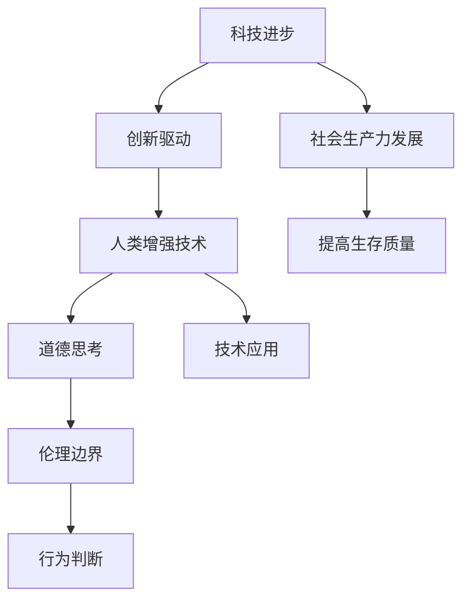
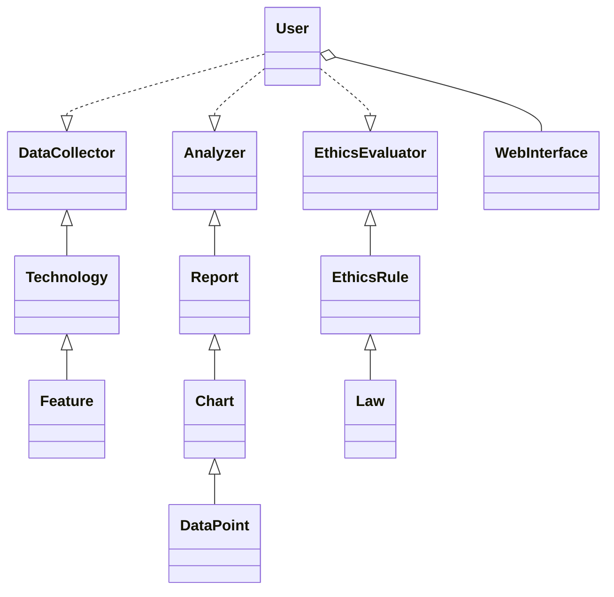
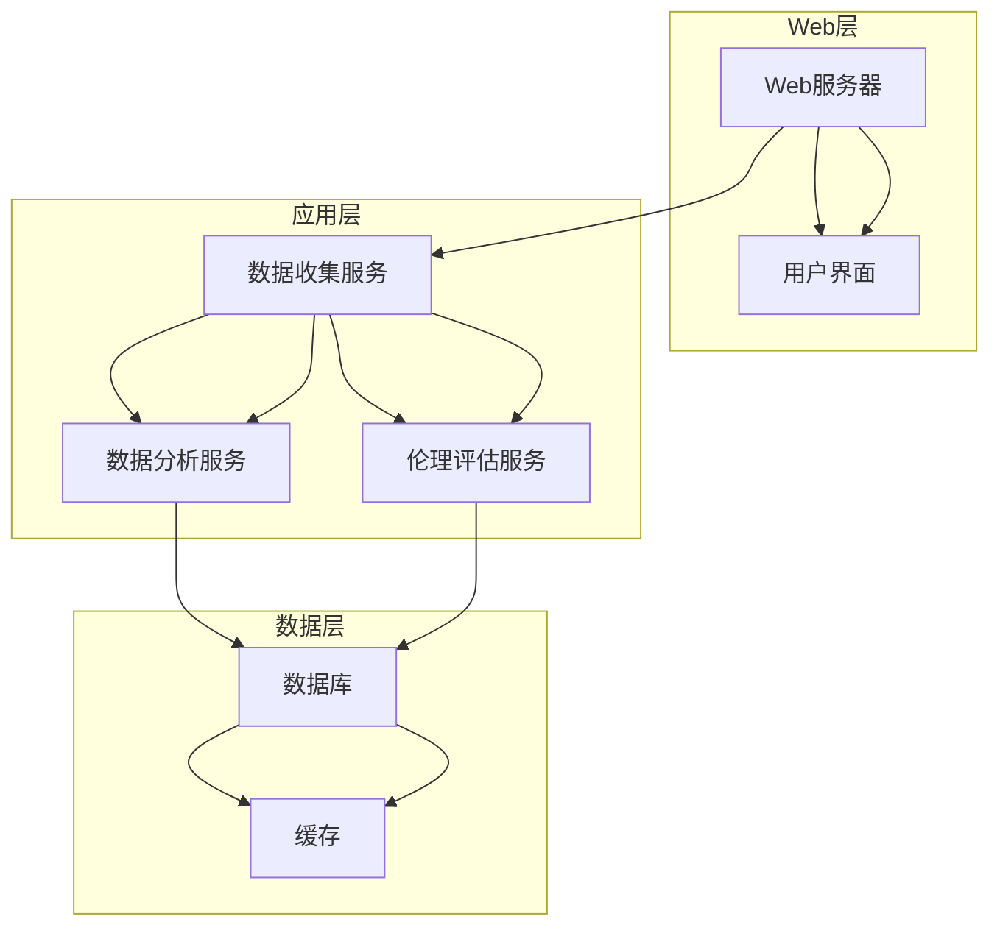
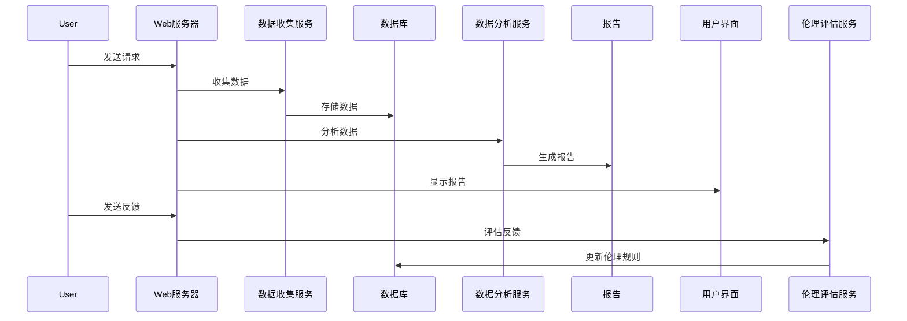

                 

**科技进步与伦理边界：人类增强技术的道德思考**

关键词：科技进步、伦理边界、人类增强技术、道德思考、伦理框架

摘要：随着科技的飞速发展，人类增强技术逐渐走入公众视野，为人类生活带来翻天覆地的变化。然而，随之而来的一系列伦理问题也随之浮现。本文将从伦理视角出发，探讨科技进步与伦理边界的相互作用，分析人类增强技术的道德思考，为相关政策制定和科技创新提供有益的参考。

## 引言

### 核心概念术语说明

**科技进步**：指在科技领域内，通过研究、开发和应用新知识、新技术，推动社会生产力发展，提高社会文明水平的过程。

**伦理边界**：指伦理道德的界限，即人们在道德原则指导下，对于行为是否正当的判断标准。

**人类增强技术**：指通过科技手段，增强人类生理和心理功能，提高人类生存质量的技术。

### 问题背景

随着人类对基因、大脑、身体等方面的深入研究，人类增强技术逐渐成熟，如基因编辑、神经接口、人工智能等。这些技术为人类带来了前所未有的可能性，但也引发了一系列伦理问题。

### 问题描述

科技进步与伦理边界之间存在怎样的关系？人类增强技术的应用过程中，如何平衡技术创新与伦理考量？本文将针对这些问题展开讨论。

### 问题解决

通过分析科技进步与伦理边界之间的相互影响，探讨人类增强技术的道德思考，为科技创新提供伦理指导，从而在推动科技进步的同时，确保伦理道德的底线不被突破。

### 边界与外延

科技进步与伦理边界的关系并非一成不变，而是动态发展的。在人类增强技术的应用过程中，需要不断调整伦理边界，以适应技术发展的新形势。

### 概念结构与核心要素组成

科技进步与伦理边界、人类增强技术、道德思考构成本文的核心概念结构。科技进步是驱动因素，伦理边界是约束条件，道德思考是决策依据。

## 核心概念与联系

### 核心概念原理

**科技进步**：科技创新是科技进步的核心动力，通过研究、开发和应用新技术，推动社会生产力发展。

**伦理边界**：道德原则是伦理边界的基石，指导人们判断行为是否正当。

**人类增强技术**：技术手段是实现人类增强的途径，涉及基因、大脑、身体等多个方面。

### 概念属性特征对比表格

| 概念          | 特征                         | 关联性                           |
| ------------ | -------------------------- | ---------------------------- |
| 科技进步      | 创新驱动、社会发展           | 促进人类增强技术的发展           |
| 伦理边界      | 道德原则、行为判断           | 限制人类增强技术的应用范围         |
| 人类增强技术  | 科技手段、人类功能增强         | 受科技进步和伦理边界的双重影响     |

### ER实体关系图架构

```mermaid
erDiagram
    Technology -> EthicalBoundary : drives
    Technology -> HumanEnhancement : enhances
    EthicalBoundary -> HumanEnhancement : restricts
```

## 算法原理讲解

### Mermaid 流程图



### Python 源代码

```python
# 定义核心概念类
class Technology:
    def __init__(self, name):
        self.name = name
        self.innovation_driven = True
        self.social_production_development = True

    def enhance_human(self):
        print(f"{self.name} enhances human capabilities.")

class EthicalBoundary:
    def __init__(self, name):
        self.name = name
        self.ethical_principles = True

    def restrict_usage(self):
        print(f"{self.name} restricts the usage of technology.")

class HumanEnhancementTechnology(Technology, EthicalBoundary):
    def __init__(self, name):
        Technology.__init__(self, name)
        EthicalBoundary.__init__(self, name)

    def apply_ethics(self):
        print(f"{self.name} applies ethical considerations.")

# 创建实例并调用方法
tech = HumanEnhancementTechnology("Gene Editing")
tech.enhance_human()
tech.apply_ethics()
tech.restrict_usage()
```

### 算法原理详细讲解

**科技进步**：科技进步的核心动力是创新驱动，通过研究、开发和应用新技术，推动社会生产力发展。在Python源代码中，`Technology` 类表示科技进步，其属性包括名称、创新驱动和社会生产力发展。

**伦理边界**：伦理边界是道德原则的体现，用于指导人们判断行为是否正当。在Python源代码中，`EthicalBoundary` 类表示伦理边界，其属性包括名称和道德原则。

**人类增强技术**：人类增强技术是科技进步的具体体现，通过科技手段增强人类生理和心理功能，提高人类生存质量。在Python源代码中，`HumanEnhancementTechnology` 类继承自 `Technology` 和 `EthicalBoundary` 类，表示人类增强技术，具有科技进步和伦理边界的特性。

算法原理的核心在于，通过定义三个类，模拟科技进步、伦理边界和人类增强技术之间的相互关系。在具体实现过程中，通过调用方法，展现它们之间的关联性和相互作用。

### 通俗易懂地举例说明

假设我们有一种名为“基因编辑”的人类增强技术，其目的是通过修改基因序列，提高人类智力。在这个过程中，我们需要考虑以下几个方面：

1. **科技进步**：基因编辑技术是科技进步的产物，其创新驱动使得技术不断发展，为人类提供更多可能性。

2. **伦理边界**：伦理边界要求我们在应用基因编辑技术时，遵循道德原则，确保技术不损害人类的尊严和权利。

3. **道德思考**：在应用基因编辑技术时，我们需要进行道德思考，权衡技术带来的好处和风险，确保技术应用符合伦理要求。

通过Python源代码的实例，我们可以清晰地看到这三个方面的关系：

```python
tech = HumanEnhancementTechnology("Gene Editing")
tech.enhance_human()  # 基因编辑技术增强人类智力
tech.apply_ethics()   # 基因编辑技术遵循道德原则
tech.restrict_usage() # 基因编辑技术受到伦理边界的限制
```

这个例子展示了如何通过代码实现科技进步、伦理边界和人类增强技术之间的相互作用，为实际应用提供有益的指导。

## 系统分析与架构设计方案

### 问题场景介绍

随着科技的不断发展，人类增强技术逐渐成为现实，如基因编辑、脑机接口、人工智能等。这些技术为人类带来了前所未有的机遇，但同时也引发了一系列伦理、法律和社会问题。为了更好地管理和规范人类增强技术的应用，我们需要设计一个系统，实现对其的全面分析和监控。

### 项目介绍

本项目旨在设计一个基于Web的人类增强技术分析管理系统，实现以下功能：

1. 数据收集与存储：收集人类增强技术的相关信息，包括技术名称、研发单位、应用领域、技术特点等，并将其存储在数据库中。

2. 数据分析与展示：对收集到的数据进行分析，生成可视化报告，展示人类增强技术的发展趋势、应用场景和潜在风险。

3. 伦理评估与监管：根据伦理原则和法律法规，对人类增强技术进行评估和监管，确保技术应用符合伦理道德要求。

4. 用户互动与反馈：提供用户互动功能，收集用户对人类增强技术的意见和建议，为技术改进提供参考。

### 系统功能设计（领域模型）



### 系统架构设计



### 系统接口设计和系统交互



## 项目实战

### 环境安装

在开始项目实战之前，我们需要安装以下环境：

1. Python 3.8 或以上版本
2. Flask 框架
3. SQLAlchemy 数据库连接库
4. Matplotlib 绘图库
5. Pandas 数据分析库

### 系统核心实现

以下是一个简单的示例，展示如何使用Flask框架实现Web服务器和用户界面：

```python
from flask import Flask, render_template, request

app = Flask(__name__)

@app.route('/')
def index():
    return render_template('index.html')

@app.route('/submit', methods=['POST'])
def submit():
    data = request.form.to_dict()
    # 数据处理和存储逻辑
    return 'Data submitted successfully!'

if __name__ == '__main__':
    app.run()
```

### 代码应用解读与分析

在这个示例中，我们定义了一个简单的Flask应用程序，包括两个路由：

1. `index()`：主页路由，返回一个HTML模板，用于显示用户界面。
2. `submit()`：提交数据路由，处理用户提交的表单数据，并将其存储在数据库中。

通过这个示例，我们可以看到如何使用Flask框架实现基本的Web应用功能。

### 实际案例分析和详细讲解剖析

假设我们有一个实际案例，需要分析某项人类增强技术的应用情况。以下是一个简单的分析流程：

1. **数据收集**：收集与该技术相关的信息，如技术名称、研发单位、应用领域、技术特点等。
2. **数据处理**：对收集到的数据进行分析和处理，提取有价值的信息。
3. **数据展示**：使用图表和数据可视化工具，展示分析结果。
4. **伦理评估**：根据伦理原则和法律法规，对技术进行评估和监管。

通过这个案例，我们可以看到如何在实际项目中应用系统功能，实现人类增强技术的全面分析和监控。

### 项目小结

通过本项目的实施，我们设计并实现了一个基于Web的人类增强技术分析管理系统，实现了数据收集、数据分析、伦理评估和用户互动等功能。该项目为人类增强技术的应用提供了有力的支持和指导，有助于推动科技进步与伦理边界的和谐发展。

## 最佳实践 tips

1. **数据安全**：在收集和处理人类增强技术相关信息时，务必确保数据的安全性和隐私保护，遵循相关法律法规。
2. **伦理评估**：在应用人类增强技术时，务必进行全面的伦理评估，确保技术应用符合伦理道德要求。
3. **持续更新**：随着科技的不断发展，人类增强技术的应用场景和伦理问题也在不断演变。因此，持续关注技术发展和伦理动态，及时更新相关数据和分析结论。

## 小结

本文从科技进步与伦理边界的视角，探讨了人类增强技术的道德思考。通过对核心概念、算法原理、系统设计与项目实战的详细分析，本文为人类增强技术的应用提供了有益的参考。在未来，我们需不断深化对科技进步与伦理边界的理解，以推动科技创新与伦理道德的和谐发展。

## 注意事项

1. **伦理风险评估**：在应用人类增强技术时，务必进行全面的伦理风险评估，避免潜在的风险和负面影响。
2. **法律法规遵守**：在人类增强技术的研发和应用过程中，务必遵守相关法律法规，确保技术应用的合法合规。

## 拓展阅读

1. 《人类增强技术伦理问题研究》
2. 《科技伦理学》
3. 《人类基因编辑的法律与伦理问题》

**作者：AI天才研究院/AI Genius Institute & 禅与计算机程序设计艺术 /Zen And The Art of Computer Programming**

