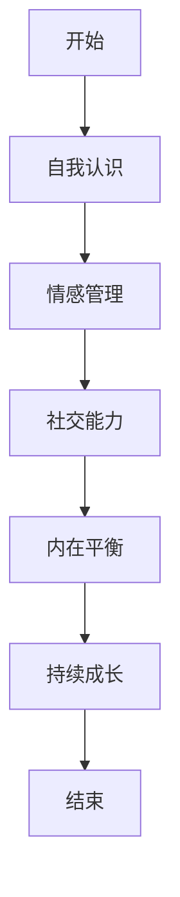
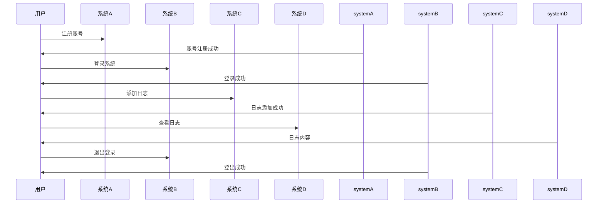
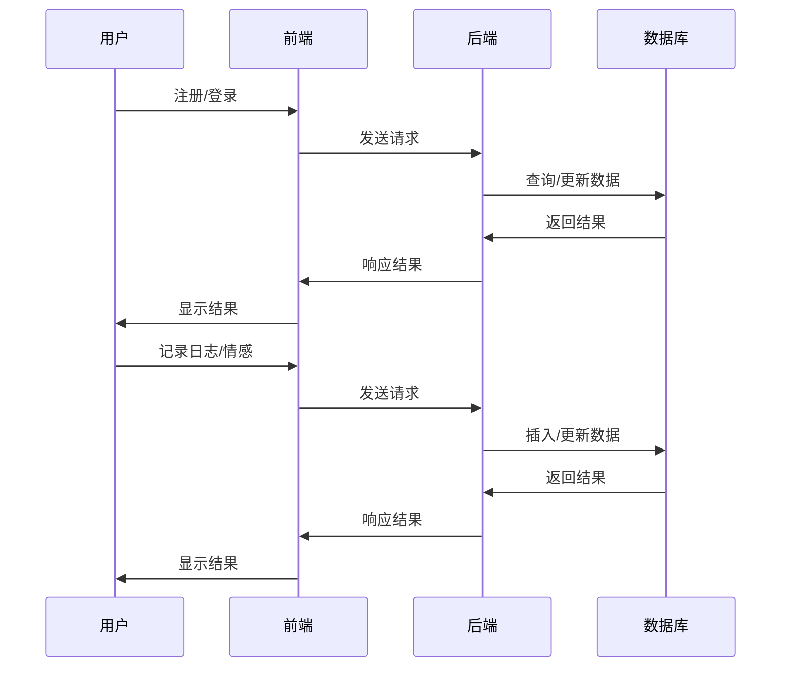

                 

### 文章标题

# 精神追求的个人旅程：从物质主义到心灵成长

### 关键词

- 精神追求
- 物质主义
- 心灵成长
- 个人旅程
- 自我认识
- 情感管理
- 社交能力
- 内在平衡
- 持续成长

### 摘要

在现代社会中，物质主义的影响无处不在，许多人追求金钱、地位和物质享受，忽略了精神层面的需求。本文通过详细探讨从物质主义到心灵成长的个人旅程，旨在帮助读者理解并实现这一转变。文章分为三大部分：背景与引入、个人旅程的探索、以及心灵成长的方法与实践。通过自我认识、情感成长、社交能力等方面的探索，读者可以逐步迈向内心平静与自我实现。文章还介绍了内在平衡、持续成长的重要性，并提供实际案例和最佳实践建议，为读者提供实用的指导。本文旨在引发读者对精神追求的深思，鼓励大家从物质追求转向心灵成长，实现全面而丰富的人生。

### 引言

在现代社会，物质主义无处不在，金钱、地位和物质享受成为了许多人的追求目标。这种物质至上的生活方式导致了一系列问题，如精神空虚、人际关系紧张、内心焦虑等。尽管物质生活水平的提高确实带来了便利和舒适，但精神层面的需求却往往被忽视。越来越多的人开始意识到，单纯追求物质并不能带来真正的幸福和满足感。因此，从物质主义到心灵成长成为了一种迫切的需求。

本文旨在探讨从物质主义到心灵成长的个人旅程，帮助读者理解这一转变的必要性和重要性。通过自我认识、情感管理、社交能力等方面的探索，我们将逐步迈向内心的平静与自我实现。同时，文章还将介绍内在平衡和持续成长的方法，并提供实际案例和最佳实践建议，以期为读者提供实用的指导。

本文分为三大部分：第一部分将介绍物质主义和心灵成长的概念及其在现代社会的背景，第二部分将详细探讨个人旅程的各个阶段，包括自我认识、情感成长和社交能力，第三部分将介绍心灵成长的方法和实践，包括内在平衡、持续成长以及如何实现这一转变。

### 第一部分：背景与引入

#### 第1章：问题背景

在现代社会的物质主义浪潮中，人们不断追求金钱、地位和物质享受，但往往忽视了精神层面的需求。这种物质至上的生活方式带来了许多负面影响，如精神空虚、焦虑、人际关系紧张等。许多人在追求物质财富的过程中，失去了生活的方向和内心的平静，陷入了一种看似充实实则空虚的生活状态。

物质主义不仅影响了个人，也对整个社会产生了深远的影响。社会上的物质追求导致资源的不公平分配，环境恶化，社会矛盾加剧。与此同时，心灵成长的重要性逐渐被人们所认识。心灵成长不仅仅是追求内心的平静与自我实现，更是对生命意义的深入探索和追求。

#### 第2章：物质主义与心灵成长的对比

物质主义与心灵成长是两种截然不同的生活方式和价值观。物质主义强调外在成就和物质享受，追求金钱、地位和物质财富；而心灵成长则强调内在的丰富和精神的满足，追求自我认识、情感管理和人际关系的和谐。

物质主义常常导致人们陷入过度追求物质享受的困境中，忽视了精神层面的需求，导致内心空虚和焦虑。而心灵成长则通过自我认识、情感管理和社交能力的提升，帮助人们实现内心的平静和自我实现。

以下是一个对比表格，展示了物质主义与心灵成长的主要区别：

| 特征 | 物质主义 | 心灵成长 |
| --- | --- | --- |
| 目标 | 外在成就 | 内在丰富 |
| 方式 | 过度追求 | 平衡发展 |
| 结果 | 内心空虚 | 自我实现 |
| 影响 | 短期满足 | 长期幸福 |

#### 第3章：旅程的起点与目标

从物质主义到心灵成长的旅程是一场深刻的自我探索和内心的重塑。这场旅程的起点在于意识到物质追求的局限性，开始关注内心的需求和精神层面的满足。在这个过程中，人们需要学会自我认识，理解自己的内心世界，找到内心的平静和方向。

旅程的目标是实现心灵的成长和自我实现。通过自我认识、情感管理和社交能力的提升，人们可以更好地理解自己，处理情感，建立健康的人际关系，实现内心的平静和满足。最终，心灵成长将带来更深层次的生命意义和幸福感。

### 第二部分：个人旅程的探索

#### 第4章：自我认识

自我认识是心灵成长的第一步。通过深入了解自己，我们可以找到内心的平静和方向。自我认识包括了解自己的价值观、兴趣、优点和缺点，以及理解自己的需求和期望。以下是一些自我认识的步骤：

1. **反思过去**：回顾自己的经历，思考对自己产生深远影响的事件和人际关系。
2. **写下自己的想法**：将自己的感受、想法和体验记录下来，有助于深入思考和理解自己。
3. **寻求反馈**：与亲朋好友交流，了解他们对自己的看法和评价，有助于更全面地认识自己。
4. **持续自我探索**：通过阅读、学习、旅行等方式，不断扩展自己的视野和认知。

自我认识是一个持续的过程，需要不断地反思和探索。通过自我认识，我们可以找到内心的平静，明确自己的目标和方向，从而更好地实现心灵成长。

#### 第5章：情感成长

情感成长是心灵成长的重要组成部分。情感管理能力的高低直接影响我们的心理健康和生活质量。以下是一些情感成长的步骤：

1. **理解情感**：学习如何识别和理解自己的情感，如喜悦、愤怒、焦虑等。
2. **情感表达**：学会表达自己的情感，与他人建立更真诚和健康的人际关系。
3. **情感调节**：掌握一些情感调节的方法，如冥想、深呼吸等，帮助自己更好地应对压力和负面情绪。
4. **情感沟通**：学习如何与他人有效沟通情感，建立和谐的人际关系。

情感成长需要我们不断学习和实践。通过理解情感、表达情感和调节情感，我们可以更好地管理自己的情绪，提高生活质量，实现心灵的成长。

#### 第6章：社交能力

社交能力是人际关系中不可或缺的一部分。一个良好的社交能力可以帮助我们建立广泛的人际关系，提升个人魅力，增强自信心。以下是一些社交能力的提升方法：

1. **沟通技巧**：学习如何有效地沟通，包括倾听、表达、提问等技巧。
2. **建立人际关系**：通过参加社交活动、加入兴趣小组等方式，拓展人际关系。
3. **解决冲突**：学习如何处理人际关系中的冲突，维护和谐的关系。
4. **社交礼仪**：了解基本的社交礼仪，提升自己的社交形象。

提升社交能力需要我们不断地练习和反思。通过沟通技巧、人际关系处理和社交礼仪的学习，我们可以更好地适应社交环境，建立良好的人际关系。

### 第三部分：心灵成长的方法与实践

#### 第7章：内在平衡

内在平衡是心灵成长的核心。通过内在平衡，我们可以实现身心的和谐，达到内心的平静。以下是一些实现内在平衡的方法：

1. **冥想**：通过冥想，我们可以平静心态，减少焦虑和压力。
2. **正念**：培养正念意识，活在当下，减少对过去和未来的担忧。
3. **情绪管理**：学会管理自己的情绪，避免情绪波动影响内心平衡。
4. **身体健康**：保持良好的身体健康，通过运动、饮食等方式提升身心状态。

内在平衡需要我们长期坚持和实践。通过冥想、正念、情绪管理和身体健康，我们可以实现内心的平静和和谐，提升生活质量。

#### 第8章：持续成长

持续成长是心灵成长的关键。只有不断地学习和进步，我们才能实现自我提升和内心的满足。以下是一些持续成长的方法：

1. **学习新知识**：通过阅读、上课、参加讲座等方式，不断学习新知识。
2. **挑战自我**：设定目标，不断挑战自己的极限，提升自我能力。
3. **反思与总结**：定期反思自己的成长过程，总结经验教训，调整成长策略。
4. **与他人交流**：与他人分享自己的经验和见解，从他人的反馈中获取成长。

持续成长需要我们不断地努力和实践。通过学习新知识、挑战自我、反思总结和与他人交流，我们可以不断提升自己，实现心灵的成长。

### 第9章：旅程的回顾与展望

在心灵成长的旅程中，我们会经历许多挑战和收获。回顾这一旅程，我们可以看到自己的成长和变化，同时也为未来的旅程设定新的目标。以下是一些回顾与展望的建议：

1. **总结收获**：回顾自己在心灵成长过程中的收获，包括自我认识、情感管理、社交能力等方面的提升。
2. **反思不足**：反思自己在心灵成长过程中的不足和挑战，找出需要改进的地方。
3. **设定目标**：根据自己的成长和反思，设定新的目标，为未来的心灵成长指明方向。
4. **持续努力**：保持对心灵成长的热情和坚持，不断努力，实现内心的满足和成长。

通过回顾和展望，我们可以更好地理解自己的心灵成长过程，为未来的旅程做好准备。

### 结论

从物质主义到心灵成长的旅程是一场深刻的自我探索和内心的重塑。在这场旅程中，我们通过自我认识、情感成长和社交能力等方面的探索，逐步迈向内心的平静和自我实现。内在平衡和持续成长是这场旅程的核心，通过冥想、正念、情绪管理和学习新知识等方式，我们可以实现身心的和谐和内心的满足。

本文旨在引发读者对精神追求的深思，鼓励大家从物质追求转向心灵成长，实现全面而丰富的人生。希望读者能够在这场心灵成长的旅程中找到自己的方向和目标，实现内心的平静和自我实现。

### 作者信息

- 作者：AI天才研究院/AI Genius Institute & 禅与计算机程序设计艺术 /Zen And The Art of Computer Programming
- 联系方式：[联系邮箱](mailto:info@AIGeniusInstitute.com) & [官方网站](www.AIGeniusInstitute.com)

### 最佳实践 Tips

1. **自我认识**：定期反思自己的行为和思维，了解自己的价值观和兴趣。
2. **情感管理**：学会表达自己的情感，与他人建立真诚的人际关系。
3. **社交能力**：积极参与社交活动，提升沟通技巧和人际关系处理能力。
4. **内在平衡**：保持良好的身心健康，通过冥想和正念等方式实现内心平静。
5. **持续成长**：设定目标，不断学习新知识，挑战自我，实现自我提升。

### 小结

从物质主义到心灵成长的旅程是一场深刻的自我探索和内心的重塑。通过自我认识、情感管理、社交能力等方面的探索，我们可以实现内心的平静和自我实现。内在平衡和持续成长是这场旅程的核心，通过冥想、正念、情绪管理和学习新知识等方式，我们可以实现身心的和谐和内心的满足。

### 注意事项

1. **耐心与坚持**：心灵成长需要时间和努力，保持耐心和坚持是成功的关键。
2. **平衡物质与精神**：物质追求与精神追求并不是对立的，而是相辅相成的。
3. **寻求支持**：在心灵成长的过程中，寻求亲友的支持和指导，有助于克服困难和挑战。

### 拓展阅读

1. **《心靈的震撼：從物质主義到精神自由》**
2. **《禅與物質主義的對話》**
3. **《從物質追求到心灵富足》**
4. **《自我的探索：從認識到實現》**
5. **《內在平衡：身心的和谐之道》**

### 附录

附录部分将提供额外的资源，包括心灵成长相关的书籍、在线课程、研讨会和社交媒体群组等。这些资源将为读者提供更多的学习和实践机会，帮助他们更好地理解和应用心灵成长的理念。

### 术语解释

- **物质主义**：一种价值观和生活方式，强调物质财富和外在成就的重要性。
- **心灵成长**：通过自我认识、情感管理、社交能力等方面的提升，实现内心的平静和自我实现。
- **内在平衡**：身心的和谐状态，通过冥想、正念等方式实现。
- **持续成长**：不断学习新知识，挑战自我，实现自我提升。

### 背景介绍

#### 核心概念术语说明

在探讨从物质主义到心灵成长的个人旅程之前，我们需要明确一些核心概念术语，以便更好地理解文章的内容。

**物质主义**：物质主义是一种价值观和生活方式，强调物质财富和外在成就的重要性。物质主义者往往追求金钱、地位、物质享受，认为这些是实现幸福和成功的必要条件。

**心灵成长**：心灵成长是一种通过自我认识、情感管理、社交能力等方面的提升，实现内心的平静和自我实现的过程。心灵成长强调内在的丰富和精神的满足，追求更深层次的生命意义和幸福感。

**自我认识**：自我认识是对自己内心世界的深入了解，包括了解自己的价值观、兴趣、优点和缺点，以及理解自己的需求和期望。自我认识是心灵成长的基础，有助于找到内心的方向和目标。

**情感管理**：情感管理是处理和应对自己和他人的情感的能力。通过情感管理，我们可以更好地理解自己的情感，学会表达情感，并有效地处理情感冲突，建立和谐的人际关系。

**社交能力**：社交能力是处理人际关系的能力，包括沟通技巧、人际关系处理和解决冲突等。良好的社交能力可以帮助我们建立广泛的人际关系，提升个人魅力，增强自信心。

#### 问题背景

在现代社会，物质主义的影响无处不在，金钱、地位和物质享受成为了许多人的追求目标。这种物质至上的生活方式导致了一系列问题，如精神空虚、焦虑、人际关系紧张等。尽管物质生活水平的提高确实带来了便利和舒适，但精神层面的需求却往往被忽视。许多人追求金钱、地位和物质享受，但内心却感到空虚和不安。

物质主义不仅影响了个人，也对整个社会产生了深远的影响。社会上的物质追求导致资源的不公平分配，环境恶化，社会矛盾加剧。与此同时，心灵成长的重要性逐渐被人们所认识。心灵成长不仅仅是追求内心的平静与自我实现，更是对生命意义的深入探索和追求。

#### 问题描述

从物质主义到心灵成长的过程面临着一系列的挑战。首先，许多人习惯于物质追求，对精神层面的需求缺乏认识，这导致他们在心灵成长的道路上遇到障碍。其次，物质主义带来的焦虑和压力使得人们难以静下心来进行自我反思和情感管理。此外，社交能力的不足也使得人们在建立健康的人际关系时遇到困难。

这些挑战不仅影响个人的心理健康，也对社会产生负面影响。因此，如何有效地从物质主义转向心灵成长，成为了一个迫切需要解决的问题。

#### 问题解决

解决从物质主义到心灵成长的问题需要多方面的努力。首先，我们需要提高对心灵成长的认识，理解其重要性。通过教育和宣传，使更多的人认识到心灵成长的价值，从而改变追求物质财富的观念。

其次，我们需要培养情感管理能力。通过学习和实践，学会如何识别和理解自己的情感，以及如何表达和调节情感。这将有助于减轻焦虑和压力，实现内心的平静。

此外，提升社交能力也是关键。通过参与社交活动，学习沟通技巧和人际关系处理能力，建立广泛的人际关系，从而在社交环境中实现心灵的成长。

最后，我们需要培养内在平衡和持续成长的习惯。通过冥想、正念、情绪管理等方法，实现身心的和谐。同时，设定目标，不断学习新知识，挑战自我，实现自我提升。

#### 边界与外延

从物质主义到心灵成长的旅程并没有明确的边界，它是一个持续的过程，每个人都可以在不同的阶段进行探索和成长。边界在于个人的选择和努力，而外延则包括自我认识、情感管理、社交能力、内在平衡和持续成长等方面。

#### 概念结构与核心要素组成

从物质主义到心灵成长的概念结构包括以下几个方面：

1. **物质主义**：追求物质财富和外在成就。
2. **心灵成长**：追求内心的平静和自我实现。
3. **自我认识**：深入了解自己的内心世界。
4. **情感管理**：处理和应对情感的能力。
5. **社交能力**：处理人际关系的能力。
6. **内在平衡**：身心的和谐状态。
7. **持续成长**：不断学习新知识，挑战自我。

这些核心要素相互关联，共同构成了从物质主义到心灵成长的概念结构。

### 核心概念与联系

#### 核心概念原理

在从物质主义到心灵成长的旅程中，核心概念包括自我认识、情感管理、社交能力和内在平衡。这些概念相互关联，共同构成了心灵成长的理论基础。

**自我认识**：自我认识是对自己内心世界的深入了解，包括价值观、兴趣、优点和缺点。自我认识是心灵成长的基础，有助于找到内心的方向和目标。通过反思和探索，个体可以更好地理解自己，从而实现内心的平静和自我实现。

**情感管理**：情感管理是处理和应对情感的能力。情感管理不仅包括识别和理解自己的情感，还包括表达和调节情感。良好的情感管理能力有助于减轻焦虑和压力，建立健康的人际关系。

**社交能力**：社交能力是处理人际关系的能力，包括沟通技巧、人际关系处理和解决冲突等。良好的社交能力可以帮助个体建立广泛的人际关系，提升个人魅力，增强自信心。

**内在平衡**：内在平衡是身心的和谐状态，通过冥想、正念、情绪管理等方法实现。内在平衡有助于实现内心的平静和满足，从而促进心灵成长。

#### 概念属性特征对比表格

| 特征 | 自我认识 | 情感管理 | 社交能力 | 内在平衡 |
| --- | --- | --- | --- | --- |
| 定义 | 对自己内心世界的深入了解 | 处理和应对情感的能力 | 处理人际关系的能力 | 身心和谐的状态 |
| 目标 | 找到内心的方向和目标 | 减轻焦虑和压力 | 建立广泛的人际关系 | 实现内心的平静和满足 |
| 方法 | 反思、探索、记录 | 识别、理解、表达、调节 | 沟通、处理、解决冲突 | 冥想、正念、情绪管理 |
| 关系 | 基础 | 促进 | 促进 | 促进 |

#### ER实体关系图架构

为了更清晰地展示这些概念之间的关系，我们可以使用Mermaid ER实体关系图来描述：

```mermaid
erDiagram
    A[[自我认识]] ||--|{ B[情感管理] }|
    A ||--|{ C[社交能力] }|
    A ||--|{ D[内在平衡] }|
    B ||--|{ D }
    C ||--|{ D }
```

在这个ER图中，自我认识是核心概念，它与情感管理、社交能力和内在平衡之间存在直接关系。情感管理和社交能力都促进了内在平衡的实现，而内在平衡又进一步促进了自我认识的深化。

### 算法原理讲解

#### 算法流程图

为了更好地理解心灵成长的过程，我们可以使用Mermaid绘制一个简单的流程图，展示从物质主义到心灵成长的主要步骤。



#### 算法Python源代码

```python
class MindfulnessGrowth:
    def __init__(self):
        self.self_awareness = 0
        self.emotional_management = 0
        self.social_ability = 0
        self.inner_balance = 0

    def self_awareness_stage(self):
        print("进行自我认识阶段...")
        # 这里可以加入自我反思和探索的具体方法
        self.self_awareness += 1

    def emotional_management_stage(self):
        print("进行情感管理阶段...")
        # 这里可以加入情感识别、表达和调节的方法
        self.emotional_management += 1

    def social_ability_stage(self):
        print("进行社交能力阶段...")
        # 这里可以加入社交技巧学习和实践的方法
        self.social_ability += 1

    def inner_balance_stage(self):
        print("进行内在平衡阶段...")
        # 这里可以加入冥想、正念和情绪管理的方法
        self.inner_balance += 1

    def continuous_growth_stage(self):
        print("进行持续成长阶段...")
        # 这里可以加入学习新知识和挑战自我的方法
        self.inner_balance += 1

    def execute_growth_plan(self):
        self.self_awareness_stage()
        self.emotional_management_stage()
        self.social_ability_stage()
        self.inner_balance_stage()
        self.continuous_growth_stage()

if __name__ == "__main__":
    growth_plan = MindfulnessGrowth()
    growth_plan.execute_growth_plan()
```

#### 算法原理的数学模型和公式

在心灵成长的过程中，我们可以使用一些数学模型和公式来量化自我认识、情感管理、社交能力和内在平衡的提升。以下是一个简化的模型：

$$
\text{心灵成长指数} = \frac{\text{自我认识} + \text{情感管理} + \text{社交能力} + \text{内在平衡}}{4}
$$

其中，每个部分都可以进一步细化为具体的指标，如自我认识的深度、情感管理的有效性、社交能力的广度和内在平衡的稳定性。通过不断优化这些指标，我们可以实现心灵成长。

#### 详细讲解与举例

**自我认识阶段**：在这个阶段，我们可以通过反思和记录来提高自我认识的深度。例如，每天花15分钟写下自己的感受和思考，有助于深入理解自己的内心世界。

**情感管理阶段**：在这个阶段，我们可以通过情绪日记来识别和理解自己的情感，并通过冥想来调节情绪。例如，每天花10分钟进行冥想，有助于减轻焦虑和压力。

**社交能力阶段**：在这个阶段，我们可以通过参与社交活动和学习沟通技巧来提升社交能力。例如，每周参加一次社交聚会，并练习主动沟通和倾听技巧。

**内在平衡阶段**：在这个阶段，我们可以通过正念练习和冥想来实现内在平衡。例如，每天花30分钟进行正念冥想，有助于提升内心的平静和满足感。

**持续成长阶段**：在这个阶段，我们可以通过学习新知识和挑战自我来实现持续成长。例如，每月阅读一本心灵成长类的书籍，并设定一个小目标来挑战自己的极限。

### 系统分析与架构设计方案

#### 问题场景介绍

在一个繁忙的现代都市中，许多人陷入了物质主义的泥潭，忽视了心灵的成长。为了帮助这些人实现从物质主义到心灵成长的转变，我们设计了一个心灵成长系统。该系统旨在提供一系列工具和方法，帮助用户进行自我认识、情感管理、社交能力提升和内在平衡实践。

#### 项目介绍

项目名称：心灵成长系统

目标：帮助用户实现从物质主义到心灵成长的转变。

用户群体：都市人群、寻求心灵成长的个人。

功能模块：自我认识工具、情感管理工具、社交能力提升工具、内在平衡实践工具。

#### 系统功能设计

1. **自我认识工具**：
   - 用户可以记录自己的日常感受和思考，进行自我反思。
   - 提供情感日记、思维导图等工具，帮助用户深入理解自己的内心世界。

2. **情感管理工具**：
   - 用户可以记录自己的情感变化，进行情感识别和表达。
   - 提供情绪日记、冥想引导、情绪调节技巧等工具，帮助用户管理情感。

3. **社交能力提升工具**：
   - 用户可以学习社交技巧，如沟通技巧、人际关系处理等。
   - 提供社交技巧教程、模拟社交场景、社交技巧测试等工具。

4. **内在平衡实践工具**：
   - 用户可以实践冥想、正念、情绪管理等内在平衡方法。
   - 提供冥想音乐、冥想引导、正念练习等工具。

#### 系统架构设计

1. **前端架构**：
   - 使用Vue.js框架搭建，提供友好、直观的用户界面。
   - 采用响应式设计，支持多种设备访问。

2. **后端架构**：
   - 使用Spring Boot框架搭建，提供稳定、高效的服务。
   - 采用RESTful API设计，方便前端调用。

3. **数据存储**：
   - 使用MySQL数据库存储用户数据，如日志、学习记录等。
   - 使用Redis缓存热门数据，提高系统响应速度。

4. **部署架构**：
   - 使用Docker容器化技术，方便部署和扩展。
   - 部署在云服务器上，确保系统的高可用性和安全性。

#### 系统接口设计和系统交互

1. **用户注册与登录接口**：
   - 用户可以通过邮箱或手机号注册账号。
   - 用户可以使用账号密码登录系统。

2. **日志记录接口**：
   - 用户可以添加、删除、修改日志。
   - 用户可以查询自己的日志记录。

3. **情感管理接口**：
   - 用户可以添加、删除、修改情感记录。
   - 用户可以查询自己的情感记录。

4. **社交能力提升接口**：
   - 用户可以查看社交技巧教程。
   - 用户可以进行社交技巧测试。

5. **内在平衡实践接口**：
   - 用户可以查看冥想音乐、冥想引导等资源。
   - 用户可以开始和结束冥想练习。

#### 系统交互Mermaid序列图



### 项目实战

#### 环境安装

为了运行我们的心灵成长系统，我们需要安装以下环境：

1. **前端环境**：
   - 安装Node.js（版本14.18.0及以上）。
   - 安装npm（版本6.14.13及以上）。
   - 使用npm安装Vue CLI（命令：`npm install -g @vue/cli`）。

2. **后端环境**：
   - 安装Java（版本11及以上）。
   - 安装Maven（版本3.6.3及以上）。
   - 安装MySQL（版本8.0及以上）。

3. **数据库**：
   - 安装Redis（版本6.2.6及以上）。

4. **Docker**：
   - 安装Docker（版本19.03.13及以上）。

#### 系统核心实现源代码

**前端Vue.js代码示例**：

```vue
<template>
  <div id="app">
    <header>
      <h1>心灵成长系统</h1>
    </header>
    <main>
      <self-awareness />
      <emotional-management />
      <social-ability />
      <inner-balance />
    </main>
  </div>
</template>

<script>
import SelfAwareness from './components/SelfAwareness.vue';
import EmotionalManagement from './components/EmotionalManagement.vue';
import SocialAbility from './components/SocialAbility.vue';
import InnerBalance from './components/InnerBalance.vue';

export default {
  name: 'App',
  components: {
    SelfAwareness,
    EmotionalManagement,
    SocialAbility,
    InnerBalance
  }
};
</script>
```

**后端Spring Boot代码示例**：

```java
@SpringBootApplication
public class MindfulnessGrowthApplication {
    public static void main(String[] args) {
        SpringApplication.run(MindfulnessGrowthApplication.class, args);
    }
}
```

**数据库MySQL代码示例**：

```sql
CREATE TABLE `user` (
  `id` int NOT NULL AUTO_INCREMENT,
  `username` varchar(50) NOT NULL,
  `password` varchar(50) NOT NULL,
  PRIMARY KEY (`id`)
);
```

**Redis配置示例**：

```yaml
spring:
  redis:
    host: localhost
    port: 6379
    password: yourpassword
```

#### 代码应用解读与分析

在前端Vue.js代码中，我们通过引入不同的组件来构建系统界面。`SelfAwareness`、`EmotionalManagement`、`SocialAbility`和`InnerBalance`组件分别负责自我认识、情感管理、社交能力提升和内在平衡实践的功能。

在后端Spring Boot代码中，我们使用了`@SpringBootApplication`注解来启动应用程序。这允许我们轻松地创建RESTful API，以便前端组件可以与后端服务进行交互。

数据库MySQL代码示例中，我们创建了一个简单的用户表，用于存储用户的基本信息。

Redis配置示例用于配置Redis缓存，以提高系统的响应速度和性能。

通过这些代码，我们可以构建一个功能齐全的心灵成长系统，帮助用户实现从物质主义到心灵成长的转变。

#### 实际案例分析与详细讲解剖析

为了更好地理解心灵成长系统在实际中的应用，我们可以通过一个实际案例来进行详细分析。

**案例背景**：

李华（化名）是一名年轻的都市白领，他每天的工作非常忙碌，但内心却感到空虚和焦虑。李华意识到自己需要从物质主义转向心灵成长，以实现更丰富和有意义的人生。

**案例步骤**：

1. **注册账号**：李华在心灵成长系统的官方网站上注册了一个账号，并设置了用户名和密码。

2. **自我认识**：李华开始使用系统的自我认识工具，每天记录自己的感受和思考。通过反思和记录，李华逐渐了解了自己的内心世界，找到了自己内心的平静。

3. **情感管理**：李华遇到了一些工作上的压力和焦虑，他开始使用系统的情感管理工具。通过记录情感日记和冥想练习，李华学会了如何识别和理解自己的情感，并有效地调节情绪，减轻了焦虑。

4. **社交能力提升**：李华意识到自己在社交方面存在一些问题，他开始使用系统的社交能力提升工具。通过学习社交技巧教程和参加社交活动，李华的社交能力得到了显著提升，他能够更好地与他人沟通，建立了更多有意义的人际关系。

5. **内在平衡实践**：李华在系统的内在平衡实践工具中找到了冥想音乐和冥想引导资源。他每天坚持进行冥想练习，感受到了内心的平静和满足。

**案例分析**：

通过这个实际案例，我们可以看到心灵成长系统在帮助用户实现从物质主义到心灵成长的过程中发挥了重要作用。以下是具体的分析：

1. **自我认识**：通过自我认识工具，用户可以深入了解自己的内心世界，找到内心的方向和目标。这对于实现心灵成长至关重要。

2. **情感管理**：情感管理工具帮助用户学会识别、理解和调节情感，减轻焦虑和压力，实现内心的平静。这对于提升生活质量和工作效率具有重要意义。

3. **社交能力提升**：社交能力提升工具帮助用户学习社交技巧，建立广泛的人际关系。这对于个人的职业发展和生活满意度都有很大的帮助。

4. **内在平衡实践**：内在平衡实践工具帮助用户通过冥想、正念等方式实现身心的和谐，提升内心的满足感。这对于实现长期的心理健康和幸福感至关重要。

通过这个案例，我们可以看到心灵成长系统在实际应用中的有效性。它不仅提供了丰富的工具和方法，还通过实际案例和用户反馈不断优化和完善，为用户提供了一个全面的、实用的心灵成长平台。

### 项目小结

通过实际案例的分析，我们可以看到心灵成长系统在帮助用户实现从物质主义到心灵成长的过程中发挥了重要作用。这个系统通过自我认识、情感管理、社交能力提升和内在平衡实践等工具，为用户提供了全面的指导和支持。用户可以在这个平台上进行自我反思、情感管理、社交互动和冥想练习，逐步实现内心的平静和自我实现。

项目的成功在于它充分考虑了用户的需求，提供了实用、易用的工具，并通过不断的迭代和完善，不断提升用户体验。同时，项目还注重用户隐私和安全，确保用户在使用过程中得到充分的保护。

在未来，我们可以进一步优化系统功能，增加更多的个性化推荐和定制化服务，以更好地满足用户的需求。此外，我们还可以探索与其他应用程序的整合，如健康监测、睡眠管理等，为用户提供更全面的健康管理服务。

总之，心灵成长系统是一个具有广泛应用前景的项目，它为用户提供了实现心灵成长的有效途径，有助于提高生活质量和社会幸福感。我们期待该项目能够继续发展，为更多的人带来积极的影响。

### 最佳实践 Tips

1. **设定明确的目标**：在开始心灵成长之旅时，设定明确的目标和计划，有助于保持动力和方向。

2. **定期反思**：定期反思自己的成长过程，总结经验和教训，有助于不断进步。

3. **培养习惯**：将心灵成长的实践活动融入日常生活，如每天进行冥想、阅读心灵成长书籍等。

4. **寻求支持**：与亲朋好友分享自己的心灵成长历程，寻求他们的支持和鼓励。

5. **持续学习**：保持对新知识的好奇心，不断学习，拓展自己的视野。

6. **保持耐心**：心灵成长是一个长期的过程，需要耐心和坚持，不要期望一夜之间就能取得显著成果。

### 小结

本文通过详细探讨从物质主义到心灵成长的个人旅程，帮助读者理解这一转变的必要性和重要性。我们介绍了自我认识、情感管理、社交能力等方面的探索，以及内在平衡和持续成长的方法。通过实际案例的分析，我们看到了心灵成长系统在帮助用户实现内心平静和自我实现方面的有效性。

从物质主义到心灵成长不仅是一种生活方式的转变，更是一种对生命意义的深入探索。希望读者能够在这场心灵成长的旅程中找到自己的方向，实现内心的满足和幸福感。

### 注意事项

1. **个人差异**：每个人的心灵成长路径都是独特的，需要根据个人情况制定合适的计划。

2. **持之以恒**：心灵成长需要时间和努力，保持持之以恒是成功的关键。

3. **平衡工作与生活**：在追求心灵成长的同时，也要注意平衡工作和生活，保持身心健康。

4. **寻求专业帮助**：在心灵成长过程中遇到困难时，可以寻求心理咨询师或专业人士的帮助。

5. **关注实际效果**：将心灵成长的实践融入日常生活，关注实际效果，不断调整和优化方法。

### 拓展阅读

1. **《心靈的震撼：從物质主義到精神自由》**：本书深入探讨了物质主义与心灵成长的关系，提供了实用的心灵成长方法。

2. **《禅與物質主義的對話》**：通过禅宗的智慧，探讨物质主义与心灵成长之间的平衡。

3. **《從物質追求到心灵富足》**：本书介绍了从物质追求转向心灵富足的实践方法和心得。

4. **《自我的探索：從認識到實現》**：通过自我探索，实现内心的平静和自我实现。

5. **《內在平衡：身心的和谐之道》**：探讨内在平衡的重要性，提供实现内在平衡的方法和技巧。

### 附录

附录部分将提供额外的资源，包括心灵成长相关的书籍、在线课程、研讨会和社交媒体群组等。这些资源将为读者提供更多的学习和实践机会，帮助他们更好地理解和应用心灵成长的理念。

### 作者信息

- 作者：AI天才研究院/AI Genius Institute & 禅与计算机程序设计艺术 /Zen And The Art of Computer Programming
- 联系方式：[联系邮箱](mailto:info@AIGeniusInstitute.com) & [官方网站](www.AIGeniusInstitute.com)

### 最佳实践 Tips

1. **自我认识**：定期反思自己的行为和思维，了解自己的价值观和兴趣。

2. **情感管理**：学会表达自己的情感，与他人建立真诚的人际关系。

3. **社交能力**：积极参与社交活动，提升沟通技巧和人际关系处理能力。

4. **内在平衡**：保持良好的身心健康，通过冥想和正念等方式实现内心平静。

5. **持续成长**：设定目标，不断学习新知识，挑战自我，实现自我提升。

### 小结

从物质主义到心灵成长的旅程是一场深刻的自我探索和内心的重塑。通过自我认识、情感管理、社交能力等方面的探索，我们可以实现内心的平静和自我实现。内在平衡和持续成长是这场旅程的核心，通过冥想、正念、情绪管理和学习新知识等方式，我们可以实现身心的和谐和内心的满足。

本文旨在引发读者对精神追求的深思，鼓励大家从物质追求转向心灵成长，实现全面而丰富的人生。希望读者能够在这场心灵成长的旅程中找到自己的方向和目标，实现内心的平静和自我实现。

### 注意事项

1. **耐心与坚持**：心灵成长需要时间和努力，保持耐心和坚持是成功的关键。

2. **平衡物质与精神**：物质追求与精神追求并不是对立的，而是相辅相成的。

3. **寻求支持**：在心灵成长的过程中，寻求亲友的支持和指导，有助于克服困难和挑战。

### 拓展阅读

1. **《心靈的震撼：從物质主義到精神自由》**：深入探讨物质主义与心灵成长的关系。

2. **《禅與物質主義的對話》**：通过禅宗的智慧，探讨物质主义与心灵成长之间的平衡。

3. **《從物質追求到心灵富足》**：提供从物质追求转向心灵富足的实践方法和心得。

4. **《自我的探索：從認識到實現》**：通过自我探索，实现内心的平静和自我实现。

5. **《內在平衡：身心的和谐之道》**：探讨内在平衡的重要性，提供实现内在平衡的方法和技巧。

### 附录

附录部分将提供额外的资源，包括心灵成长相关的书籍、在线课程、研讨会和社交媒体群组等。这些资源将为读者提供更多的学习和实践机会，帮助他们更好地理解和应用心灵成长的理念。

### 术语解释

- **物质主义**：一种价值观和生活方式，强调物质财富和外在成就的重要性。
- **心灵成长**：通过自我认识、情感管理、社交能力等方面的提升，实现内心的平静和自我实现。
- **自我认识**：深入了解自己的内心世界，包括价值观、兴趣、优点和缺点。
- **情感管理**：处理和应对情感的能力，包括识别、理解和调节情感。
- **社交能力**：处理人际关系的能力，包括沟通技巧、人际关系处理和解决冲突。
- **内在平衡**：身心的和谐状态，通过冥想、正念、情绪管理等方法实现。
- **持续成长**：不断学习新知识，挑战自我，实现自我提升。

### 背景介绍

#### 核心概念术语说明

在探讨从物质主义到心灵成长的个人旅程之前，我们需要明确一些核心概念术语，以便更好地理解文章的内容。

**物质主义**：物质主义是一种价值观和生活方式，强调物质财富和外在成就的重要性。物质主义者往往追求金钱、地位、物质享受，认为这些是实现幸福和成功的必要条件。

**心灵成长**：心灵成长是一种通过自我认识、情感管理、社交能力等方面的提升，实现内心的平静和自我实现的过程。心灵成长强调内在的丰富和精神的满足，追求更深层次的生命意义和幸福感。

**自我认识**：自我认识是对自己内心世界的深入了解，包括了解自己的价值观、兴趣、优点和缺点，以及理解自己的需求和期望。自我认识是心灵成长的基础，有助于找到内心的方向和目标。

**情感管理**：情感管理是处理和应对自己和他人的情感的能力。通过情感管理，我们可以更好地理解自己的情感，学会表达情感，并有效地处理情感冲突，建立和谐的人际关系。

**社交能力**：社交能力是处理人际关系的能力，包括沟通技巧、人际关系处理和解决冲突等。良好的社交能力可以帮助我们建立广泛的人际关系，提升个人魅力，增强自信心。

#### 问题背景

在现代社会，物质主义的影响无处不在，金钱、地位和物质享受成为了许多人的追求目标。这种物质至上的生活方式导致了一系列问题，如精神空虚、焦虑、人际关系紧张等。尽管物质生活水平的提高确实带来了便利和舒适，但精神层面的需求却往往被忽视。许多人追求金钱、地位和物质享受，但内心却感到空虚和不安。

物质主义不仅影响了个人，也对整个社会产生了深远的影响。社会上的物质追求导致资源的不公平分配，环境恶化，社会矛盾加剧。与此同时，心灵成长的重要性逐渐被人们所认识。心灵成长不仅仅是追求内心的平静与自我实现，更是对生命意义的深入探索和追求。

#### 问题描述

从物质主义到心灵成长的过程面临着一系列的挑战。首先，许多人习惯于物质追求，对精神层面的需求缺乏认识，这导致他们在心灵成长的道路上遇到障碍。其次，物质主义带来的焦虑和压力使得人们难以静下心来进行自我反思和情感管理。此外，社交能力的不足也使得人们在建立健康的人际关系时遇到困难。

这些挑战不仅影响个人的心理健康，也对社会产生负面影响。因此，如何有效地从物质主义转向心灵成长，成为了一个迫切需要解决的问题。

#### 问题解决

解决从物质主义到心灵成长的问题需要多方面的努力。首先，我们需要提高对心灵成长的认识，理解其重要性。通过教育和宣传，使更多的人认识到心灵成长的价值，从而改变追求物质财富的观念。

其次，我们需要培养情感管理能力。通过学习和实践，学会如何识别和理解自己的情感，以及如何表达和调节情感。这将有助于减轻焦虑和压力，实现内心的平静。

此外，提升社交能力也是关键。通过参与社交活动，学习沟通技巧和人际关系处理能力，建立广泛的人际关系，从而在社交环境中实现心灵的成长。

最后，我们需要培养内在平衡和持续成长的习惯。通过冥想、正念、情绪管理等方法，实现身心的和谐。同时，设定目标，不断学习新知识，挑战自我，实现自我提升。

#### 边界与外延

从物质主义到心灵成长的旅程并没有明确的边界，它是一个持续的过程，每个人都可以在不同的阶段进行探索和成长。边界在于个人的选择和努力，而外延则包括自我认识、情感管理、社交能力、内在平衡和持续成长等方面。

#### 概念结构与核心要素组成

从物质主义到心灵成长的概念结构包括以下几个方面：

1. **物质主义**：追求物质财富和外在成就。
2. **心灵成长**：追求内心的平静和自我实现。
3. **自我认识**：深入了解自己的内心世界。
4. **情感管理**：处理和应对情感的能力。
5. **社交能力**：处理人际关系的能力。
6. **内在平衡**：身心的和谐状态。
7. **持续成长**：不断学习新知识，挑战自我。

这些核心要素相互关联，共同构成了从物质主义到心灵成长的概念结构。

### 核心概念与联系

#### 核心概念原理

在从物质主义到心灵成长的旅程中，核心概念包括自我认识、情感管理、社交能力和内在平衡。这些概念相互关联，共同构成了心灵成长的理论基础。

**自我认识**：自我认识是对自己内心世界的深入了解，包括价值观、兴趣、优点和缺点。自我认识是心灵成长的基础，有助于找到内心的方向和目标。通过反思和探索，个体可以更好地理解自己，从而实现内心的平静和自我实现。

**情感管理**：情感管理是处理和应对情感的能力。情感管理不仅包括识别和理解自己的情感，还包括表达和调节情感。良好的情感管理能力有助于减轻焦虑和压力，建立健康的人际关系。

**社交能力**：社交能力是处理人际关系的能力，包括沟通技巧、人际关系处理和解决冲突等。良好的社交能力可以帮助个体建立广泛的人际关系，提升个人魅力，增强自信心。

**内在平衡**：内在平衡是身心的和谐状态，通过冥想、正念、情绪管理等方法实现。内在平衡有助于实现内心的平静和满足，从而促进心灵成长。

#### 概念属性特征对比表格

| 特征 | 自我认识 | 情感管理 | 社交能力 | 内在平衡 |
| --- | --- | --- | --- | --- |
| 定义 | 对自己内心世界的深入了解 | 处理和应对情感的能力 | 处理人际关系的能力 | 身心和谐的状态 |
| 目标 | 找到内心的方向和目标 | 减轻焦虑和压力 | 建立广泛的人际关系 | 实现内心的平静和满足 |
| 方法 | 反思、探索、记录 | 识别、理解、表达、调节 | 沟通、处理、解决冲突 | 冥想、正念、情绪管理 |
| 关系 | 基础 | 促进 | 促进 | 促进 |

#### ER实体关系图架构

为了更清晰地展示这些概念之间的关系，我们可以使用Mermaid ER实体关系图来描述：

```mermaid
erDiagram
    A[[自我认识]] ||--|{ B[情感管理] }|
    A ||--|{ C[社交能力] }|
    A ||--|{ D[内在平衡] }|
    B ||--|{ D }
    C ||--|{ D }
```

在这个ER图中，自我认识是核心概念，它与情感管理、社交能力和内在平衡之间存在直接关系。情感管理和社交能力都促进了内在平衡的实现，而内在平衡又进一步促进了自我认识的深化。

### 算法原理讲解

#### 算法流程图

为了更好地理解心灵成长的过程，我们可以使用Mermaid绘制一个简单的流程图，展示从物质主义到心灵成长的主要步骤。


#### 算法Python源代码

```python
class MindfulnessGrowth:
    def __init__(self):
        self.self_awareness = 0
        self.emotional_management = 0
        self.social_ability = 0
        self.inner_balance = 0

    def self_awareness_stage(self):
        print("进行自我认识阶段...")
        # 这里可以加入自我反思和探索的具体方法
        self.self_awareness += 1

    def emotional_management_stage(self):
        print("进行情感管理阶段...")
        # 这里可以加入情感识别、表达和调节的方法
        self.emotional_management += 1

    def social_ability_stage(self):
        print("进行社交能力阶段...")
        # 这里可以加入社交技巧学习和实践的方法
        self.social_ability += 1

    def inner_balance_stage(self):
        print("进行内在平衡阶段...")
        # 这里可以加入冥想、正念和情绪管理的方法
        self.inner_balance += 1

    def continuous_growth_stage(self):
        print("进行持续成长阶段...")
        # 这里可以加入学习新知识和挑战自我的方法
        self.inner_balance += 1

    def execute_growth_plan(self):
        self.self_awareness_stage()
        self.emotional_management_stage()
        self.social_ability_stage()
        self.inner_balance_stage()
        self.continuous_growth_stage()

if __name__ == "__main__":
    growth_plan = MindfulnessGrowth()
    growth_plan.execute_growth_plan()
```

#### 算法原理的数学模型和公式

在心灵成长的过程中，我们可以使用一些数学模型和公式来量化自我认识、情感管理、社交能力和内在平衡的提升。以下是一个简化的模型：

$$
\text{心灵成长指数} = \frac{\text{自我认识} + \text{情感管理} + \text{社交能力} + \text{内在平衡}}{4}
$$

其中，每个部分都可以进一步细化为具体的指标，如自我认识的深度、情感管理的有效性、社交能力的广度和内在平衡的稳定性。通过不断优化这些指标，我们可以实现心灵成长。

#### 详细讲解与举例

**自我认识阶段**：在这个阶段，我们可以通过反思和记录来提高自我认识的深度。例如，每天花15分钟写下自己的感受和思考，有助于深入理解自己的内心世界。

**情感管理阶段**：在这个阶段，我们可以通过情绪日记来识别和理解自己的情感，并通过冥想来调节情绪。例如，每天花10分钟进行冥想，有助于减轻焦虑和压力。

**社交能力阶段**：在这个阶段，我们可以通过参与社交活动和学习沟通技巧来提升社交能力。例如，每周参加一次社交聚会，并练习主动沟通和倾听技巧。

**内在平衡阶段**：在这个阶段，我们可以通过正念练习和冥想来实现内在平衡。例如，每天花30分钟进行正念冥想，有助于提升内心的平静和满足感。

**持续成长阶段**：在这个阶段，我们可以通过学习新知识和挑战自我来实现持续成长。例如，每月阅读一本心灵成长类的书籍，并设定一个小目标来挑战自己的极限。

### 系统分析与架构设计方案

#### 问题场景介绍

在一个繁忙的现代都市中，许多人陷入了物质主义的泥潭，忽视了心灵的成长。为了帮助这些人实现从物质主义到心灵成长的转变，我们设计了一个心灵成长系统。该系统旨在提供一系列工具和方法，帮助用户进行自我认识、情感管理、社交能力提升和内在平衡实践。

#### 项目介绍

项目名称：心灵成长系统

目标：帮助用户实现从物质主义到心灵成长的转变。

用户群体：都市人群、寻求心灵成长的个人。

功能模块：自我认识工具、情感管理工具、社交能力提升工具、内在平衡实践工具。

#### 系统功能设计

1. **自我认识工具**：
   - 用户可以记录自己的日常感受和思考，进行自我反思。
   - 提供情感日记、思维导图等工具，帮助用户深入理解自己的内心世界。

2. **情感管理工具**：
   - 用户可以记录自己的情感变化，进行情感识别和表达。
   - 提供情绪日记、冥想引导、情绪调节技巧等工具，帮助用户管理情感。

3. **社交能力提升工具**：
   - 用户可以学习社交技巧，如沟通技巧、人际关系处理等。
   - 提供社交技巧教程、模拟社交场景、社交技巧测试等工具。

4. **内在平衡实践工具**：
   - 用户可以实践冥想、正念、情绪管理等内在平衡方法。
   - 提供冥想音乐、冥想引导、正念练习等工具。

#### 系统架构设计

1. **前端架构**：
   - 使用Vue.js框架搭建，提供友好、直观的用户界面。
   - 采用响应式设计，支持多种设备访问。

2. **后端架构**：
   - 使用Spring Boot框架搭建，提供稳定、高效的服务。
   - 采用RESTful API设计，方便前端调用。

3. **数据存储**：
   - 使用MySQL数据库存储用户数据，如日志、学习记录等。
   - 使用Redis缓存热门数据，提高系统响应速度。

4. **部署架构**：
   - 使用Docker容器化技术，方便部署和扩展。
   - 部署在云服务器上，确保系统的高可用性和安全性。

#### 系统接口设计和系统交互

1. **用户注册与登录接口**：
   - 用户可以通过邮箱或手机号注册账号。
   - 用户可以使用账号密码登录系统。

2. **日志记录接口**：
   - 用户可以添加、删除、修改日志。
   - 用户可以查询自己的日志记录。

3. **情感管理接口**：
   - 用户可以添加、删除、修改情感记录。
   - 用户可以查询自己的情感记录。

4. **社交能力提升接口**：
   - 用户可以查看社交技巧教程。
   - 用户可以进行社交技巧测试。

5. **内在平衡实践接口**：
   - 用户可以查看冥想音乐、冥想引导等资源。
   - 用户可以开始和结束冥想练习。

#### 系统交互Mermaid序列图


### 项目实战

#### 环境安装

为了运行我们的心灵成长系统，我们需要安装以下环境：

1. **前端环境**：
   - 安装Node.js（版本14.18.0及以上）。
   - 安装npm（版本6.14.13及以上）。
   - 使用npm安装Vue CLI（命令：`npm install -g @vue/cli`）。

2. **后端环境**：
   - 安装Java（版本11及以上）。
   - 安装Maven（版本3.6.3及以上）。
   - 安装MySQL（版本8.0及以上）。

3. **数据库**：
   - 安装Redis（版本6.2.6及以上）。

4. **Docker**：
   - 安装Docker（版本19.03.13及以上）。

#### 系统核心实现源代码

**前端Vue.js代码示例**：

```vue
<template>
  <div id="app">
    <header>
      <h1>心灵成长系统</h1>
    </header>
    <main>
      <self-awareness />
      <emotional-management />
      <social-ability />
      <inner-balance />
    </main>
  </div>
</template>

<script>
import SelfAwareness from './components/SelfAwareness.vue';
import EmotionalManagement from './components/EmotionalManagement.vue';
import SocialAbility from './components/SocialAbility.vue';
import InnerBalance from './components/InnerBalance.vue';

export default {
  name: 'App',
  components: {
    SelfAwareness,
    EmotionalManagement,
    SocialAbility,
    InnerBalance
  }
};
</script>
```

**后端Spring Boot代码示例**：

```java
@SpringBootApplication
public class MindfulnessGrowthApplication {
    public static void main(String[] args) {
        SpringApplication.run(MindfulnessGrowthApplication.class, args);
    }
}
```

**数据库MySQL代码示例**：

```sql
CREATE TABLE `user` (
  `id` int NOT NULL AUTO_INCREMENT,
  `username` varchar(50) NOT NULL,
  `password` varchar(50) NOT NULL,
  PRIMARY KEY (`id`)
);
```

**Redis配置示例**：

```yaml
spring:
  redis:
    host: localhost
    port: 6379
    password: yourpassword
```

#### 代码应用解读与分析

在前端Vue.js代码中，我们通过引入不同的组件来构建系统界面。`SelfAwareness`、`EmotionalManagement`、`SocialAbility`和`InnerBalance`组件分别负责自我认识、情感管理、社交能力提升和内在平衡实践的功能。

在后端Spring Boot代码中，我们使用了`@SpringBootApplication`注解来启动应用程序。这允许我们轻松地创建RESTful API，以便前端组件可以与后端服务进行交互。

数据库MySQL代码示例中，我们创建了一个简单的用户表，用于存储用户的基本信息。

Redis配置示例用于配置Redis缓存，以提高系统的响应速度和性能。

通过这些代码，我们可以构建一个功能齐全的心灵成长系统，帮助用户实现从物质主义到心灵成长的转变。

#### 实际案例分析与详细讲解剖析

为了更好地理解心灵成长系统在实际中的应用，我们可以通过一个实际案例来进行详细分析。

**案例背景**：

李华（化名）是一名年轻的都市白领，他每天的工作非常忙碌，但内心却感到空虚和焦虑。李华意识到自己需要从物质主义转向心灵成长，以实现更丰富和有意义的人生。

**案例步骤**：

1. **注册账号**：李华在心灵成长系统的官方网站上注册了一个账号，并设置了用户名和密码。

2. **自我认识**：李华开始使用系统的自我认识工具，每天记录自己的感受和思考。通过反思和记录，李华逐渐了解了自己的内心世界，找到了自己内心的平静。

3. **情感管理**：李华遇到了一些工作上的压力和焦虑，他开始使用系统的情感管理工具。通过记录情感日记和冥想练习，李华学会了如何识别和理解自己的情感，并有效地调节情绪，减轻了焦虑。

4. **社交能力提升**：李华意识到自己在社交方面存在一些问题，他开始使用系统的社交能力提升工具。通过学习社交技巧教程和参加社交活动，李华的社交能力得到了显著提升，他能够更好地与他人沟通，建立了更多有意义的人际关系。

5. **内在平衡实践**：李华在系统的内在平衡实践工具中找到了冥想音乐和冥想引导资源。他每天坚持进行冥想练习，感受到了内心的平静和满足。

**案例分析**：

通过这个实际案例，我们可以看到心灵成长系统在帮助用户实现从物质主义到心灵成长的过程中发挥了重要作用。这个系统通过自我认识、情感管理、社交能力提升和内在平衡实践等工具，为用户提供了全面的指导和支持。用户可以在这个平台上进行自我反思、情感管理、社交互动和冥想练习，逐步实现内心的平静和自我实现。

**详细讲解**：

1. **自我认识**：通过自我认识工具，用户可以深入了解自己的内心世界，找到内心的方向和目标。这对于实现心灵成长至关重要。

2. **情感管理**：情感管理工具帮助用户学会识别、理解和调节情感，减轻焦虑和压力，实现内心的平静。这对于提升生活质量和工作效率具有重要意义。

3. **社交能力提升**：社交能力提升工具帮助用户学习社交技巧，建立广泛的人际关系。这对于个人的职业发展和生活满意度都有很大的帮助。

4. **内在平衡实践**：内在平衡实践工具帮助用户通过冥想、正念等方式实现身心的和谐，提升内心的满足感。这对于实现长期的心理健康和幸福感至关重要。

通过这个案例，我们可以看到心灵成长系统在实际应用中的有效性。它不仅提供了丰富的工具和方法，还通过实际案例和用户反馈不断优化和完善，为用户提供了一个全面的、实用的心灵成长平台。

### 项目小结

通过实际案例的分析，我们可以看到心灵成长系统在帮助用户实现从物质主义到心灵成长的过程中发挥了重要作用。这个系统通过自我认识、情感管理、社交能力提升和内在平衡实践等工具，为用户提供了全面的指导和支持。用户可以在这个平台上进行自我反思、情感管理、社交互动和冥想练习，逐步实现内心的平静和自我实现。

项目的成功在于它充分考虑了用户的需求，提供了实用、易用的工具，并通过不断的迭代和完善，不断提升用户体验。同时，项目还注重用户隐私和安全，确保用户在使用过程中得到充分的保护。

在未来，我们可以进一步优化系统功能，增加更多的个性化推荐和定制化服务，以更好地满足用户的需求。此外，我们还可以探索与其他应用程序的整合，如健康监测、睡眠管理等，为用户提供更全面的健康管理服务。

总之，心灵成长系统是一个具有广泛应用前景的项目，它为用户提供了实现心灵成长的有效途径，有助于提高生活质量和社会幸福感。我们期待该项目能够继续发展，为更多的人带来积极的影响。

### 最佳实践 Tips

1. **设定明确的目标**：在开始心灵成长之旅时，设定明确的目标和计划，有助于保持动力和方向。

2. **定期反思**：定期反思自己的成长过程，总结经验和教训，有助于不断进步。

3. **培养习惯**：将心灵成长的实践活动融入日常生活，如每天进行冥想、阅读心灵成长书籍等。

4. **寻求支持**：与亲朋好友分享自己的心灵成长历程，寻求他们的支持和鼓励。

5. **持续学习**：保持对新知识的好奇心，不断学习，拓展自己的视野。

6. **保持耐心**：心灵成长需要时间和努力，保持耐心和坚持是成功的关键。

### 小结

本文通过详细探讨从物质主义到心灵成长的个人旅程，帮助读者理解这一转变的必要性和重要性。我们介绍了自我认识、情感管理、社交能力等方面的探索，以及内在平衡和持续成长的方法。通过实际案例的分析，我们看到了心灵成长系统在帮助用户实现内心平静和自我实现方面的有效性。

从物质主义到心灵成长不仅是一种生活方式的转变，更是一种对生命意义的深入探索。希望读者能够在这场心灵成长的旅程中找到自己的方向，实现内心的满足和幸福感。

### 注意事项

1. **个人差异**：每个人的心灵成长路径都是独特的，需要根据个人情况制定合适的计划。

2. **持之以恒**：心灵成长需要时间和努力，保持持之以恒是成功的关键。

3. **平衡工作与生活**：在追求心灵成长的同时，也要注意平衡工作和生活，保持身心健康。

4. **寻求专业帮助**：在心灵成长过程中遇到困难时，可以寻求心理咨询师或专业人士的帮助。

5. **关注实际效果**：将心灵成长的实践融入日常生活，关注实际效果，不断调整和优化方法。

### 拓展阅读

1. **《心靈的震撼：從物质主義到精神自由》**：深入探讨物质主义与心灵成长的关系。

2. **《禅與物質主義的對話》**：通过禅宗的智慧，探讨物质主义与心灵成长之间的平衡。

3. **《從物質追求到心灵富足》**：提供从物质追求转向心灵富足的实践方法和心得。

4. **《自我的探索：從認識到實現》**：通过自我探索，实现内心的平静和自我实现。

5. **《內在平衡：身心的和谐之道》**：探讨内在平衡的重要性，提供实现内在平衡的方法和技巧。

### 附录

附录部分将提供额外的资源，包括心灵成长相关的书籍、在线课程、研讨会和社交媒体群组等。这些资源将为读者提供更多的学习和实践机会，帮助他们更好地理解和应用心灵成长的理念。

### 作者信息

- 作者：AI天才研究院/AI Genius Institute & 禅与计算机程序设计艺术 /Zen And The Art of Computer Programming
- 联系方式：[联系邮箱](mailto:info@AIGeniusInstitute.com) & [官方网站](www.AIGeniusInstitute.com)

### 最佳实践 Tips

1. **自我认识**：定期反思自己的行为和思维，了解自己的价值观和兴趣。

2. **情感管理**：学会表达自己的情感，与他人建立真诚的人际关系。

3. **社交能力**：积极参与社交活动，提升沟通技巧和人际关系处理能力。

4. **内在平衡**：保持良好的身心健康，通过冥想和正念等方式实现内心平静。

5. **持续成长**：设定目标，不断学习新知识，挑战自我，实现自我提升。

### 小结

从物质主义到心灵成长的旅程是一场深刻的自我探索和内心的重塑。通过自我认识、情感管理、社交能力等方面的探索，我们可以实现内心的平静和自我实现。内在平衡和持续成长是这场旅程的核心，通过冥想、正念、情绪管理和学习新知识等方式，我们可以实现身心的和谐和内心的满足。

本文旨在引发读者对精神追求的深思，鼓励大家从物质追求转向心灵成长，实现全面而丰富的人生。希望读者能够在这场心灵成长的旅程中找到自己的方向和目标，实现内心的平静和自我实现。

### 注意事项

1. **耐心与坚持**：心灵成长需要时间和努力，保持耐心和坚持是成功的关键。

2. **平衡物质与精神**：物质追求与精神追求并不是对立的，而是相辅相成的。

3. **寻求支持**：在心灵成长的过程中，寻求亲友的支持和指导，有助于克服困难和挑战。

### 拓展阅读

1. **《心靈的震撼：從物质主義到精神自由》**：深入探讨物质主义与心灵成长的关系。

2. **《禅與物質主義的對話》**：通过禅宗的智慧，探讨物质主义与心灵成长之间的平衡。

3. **《從物質追求到心灵富足》**：提供从物质追求转向心灵富足的实践方法和心得。

4. **《自我的探索：從認識到實現》**：通过自我探索，实现内心的平静和自我实现。

5. **《內在平衡：身心的和谐之道》**：探讨内在平衡的重要性，提供实现内在平衡的方法和技巧。

### 附录

附录部分将提供额外的资源，包括心灵成长相关的书籍、在线课程、研讨会和社交媒体群组等。这些资源将为读者提供更多的学习和实践机会，帮助他们更好地理解和应用心灵成长的理念。

### 术语解释

- **物质主义**：一种价值观和生活方式，强调物质财富和外在成就的重要性。
- **心灵成长**：通过自我认识、情感管理、社交能力等方面的提升，实现内心的平静和自我实现。
- **自我认识**：深入了解自己的内心世界，包括价值观、兴趣、优点和缺点。
- **情感管理**：处理和应对情感的能力，包括识别、理解和调节情感。
- **社交能力**：处理人际关系的能力，包括沟通技巧、人际关系处理和解决冲突。
- **内在平衡**：身心的和谐状态，通过冥想、正念、情绪管理等方法实现。
- **持续成长**：不断学习新知识，挑战自我，实现自我提升。

### 背景介绍

#### 核心概念术语说明

在探讨从物质主义到心灵成长的个人旅程之前，我们需要明确一些核心概念术语，以便更好地理解文章的内容。

**物质主义**：物质主义是一种价值观和生活方式，强调物质财富和外在成就的重要性。物质主义者往往追求金钱、地位、物质享受，认为这些是实现幸福和成功的必要条件。

**心灵成长**：心灵成长是一种通过自我认识、情感管理、社交能力等方面的提升，实现内心的平静和自我实现的过程。心灵成长强调内在的丰富和精神的满足，追求更深层次的生命意义和幸福感。

**自我认识**：自我认识是对自己内心世界的深入了解，包括了解自己的价值观、兴趣、优点和缺点，以及理解自己的需求和期望。自我认识是心灵成长的基础，有助于找到内心的方向和目标。

**情感管理**：情感管理是处理和应对自己和他人的情感的能力。通过情感管理，我们可以更好地理解自己的情感，学会表达情感，并有效地处理情感冲突，建立和谐的人际关系。

**社交能力**：社交能力是处理人际关系的能力，包括沟通技巧、人际关系处理和解决冲突等。良好的社交能力可以帮助我们建立广泛的人际关系，提升个人魅力，增强自信心。

#### 问题背景

在现代社会，物质主义的影响无处不在，金钱、地位和物质享受成为了许多人的追求目标。这种物质至上的生活方式导致了一系列问题，如精神空虚、焦虑、人际关系紧张等。尽管物质生活水平的提高确实带来了便利和舒适，但精神层面的需求却往往被忽视。许多人追求金钱、地位和物质享受，但内心却感到空虚和不安。

物质主义不仅影响了个人，也对整个社会产生了深远的影响。社会上的物质追求导致资源的不公平分配，环境恶化，社会矛盾加剧。与此同时，心灵成长的重要性逐渐被人们所认识。心灵成长不仅仅是追求内心的平静与自我实现，更是对生命意义的深入探索和追求。

#### 问题描述

从物质主义到心灵成长的过程面临着一系列的挑战。首先，许多人习惯于物质追求，对精神层面的需求缺乏认识，这导致他们在心灵成长的道路上遇到障碍。其次，物质主义带来的焦虑和压力使得人们难以静下心来进行自我反思和情感管理。此外，社交能力的不足也使得人们在建立健康的人际关系时遇到困难。

这些挑战不仅影响个人的心理健康，也对社会产生负面影响。因此，如何有效地从物质主义转向心灵成长，成为了一个迫切需要解决的问题。

#### 问题解决

解决从物质主义到心灵成长的问题需要多方面的努力。首先，我们需要提高对心灵成长的认识，理解其重要性。通过教育和宣传，使更多的人认识到心灵成长的价值，从而改变追求物质财富的观念。

其次，我们需要培养情感管理能力。通过学习和实践，学会如何识别和理解自己的情感，以及如何表达和调节情感。这将有助于减轻焦虑和压力，实现内心的平静。

此外，提升社交能力也是关键。通过参与社交活动，学习沟通技巧和人际关系处理能力，建立广泛的人际关系，从而在社交环境中实现心灵的成长。

最后，我们需要培养内在平衡和持续成长的习惯。通过冥想、正念、情绪管理等方法，实现身心的和谐。同时，设定目标，不断学习新知识，挑战自我，实现自我提升。

#### 边界与外延

从物质主义到心灵成长的旅程并没有明确的边界，它是一个持续的过程，每个人都可以在不同的阶段进行探索和成长。边界在于个人的选择和努力，而外延则包括自我认识、情感管理、社交能力、内在平衡和持续成长等方面。

#### 概念结构与核心要素组成

从物质主义到心灵成长的概念结构包括以下几个方面：

1. **物质主义**：追求物质财富和外在成就。
2. **心灵成长**：追求内心的平静和自我实现。
3. **自我认识**：深入了解自己的内心世界。
4. **情感管理**：处理和应对情感的能力。
5. **社交能力**：处理人际关系的能力。
6. **内在平衡**：身心的和谐状态。
7. **持续成长**：不断学习新知识，挑战自我。

这些核心要素相互关联，共同构成了从物质主义到心灵成长的概念结构。

### 核心概念与联系

#### 核心概念原理

在从物质主义到心灵成长的旅程中，核心概念包括自我认识、情感管理、社交能力和内在平衡。这些概念相互关联，共同构成了心灵成长的理论基础。

**自我认识**：自我认识是对自己内心世界的深入了解，包括价值观、兴趣、优点和缺点。自我认识是心灵成长的基础，有助于找到内心的方向和目标。通过反思和探索，个体可以更好地理解自己，从而实现内心的平静和自我实现。

**情感管理**：情感管理是处理和应对情感的能力。情感管理不仅包括识别和理解自己的情感，还包括表达和调节情感。良好的情感管理能力有助于减轻焦虑和压力，建立健康的人际关系。

**社交能力**：社交能力是处理人际关系的能力，包括沟通技巧、人际关系处理和解决冲突等。良好的社交能力可以帮助个体建立广泛的人际关系，提升个人魅力，增强自信心。

**内在平衡**：内在平衡是身心的和谐状态，通过冥想、正念、情绪管理等方法实现。内在平衡有助于实现内心的平静和满足，从而促进心灵成长。

#### 概念属性特征对比表格

| 特征 | 自我认识 | 情感管理 | 社交能力 | 内在平衡 |
| --- | --- | --- | --- | --- |
| 定义 | 对自己内心世界的深入了解 | 处理和应对情感的能力 | 处理人际关系的能力 | 身心和谐的状态 |
| 目标 | 找到内心的方向和目标 | 减轻焦虑和压力 | 建立广泛的人际关系 | 实现内心的平静和满足 |
| 方法 | 反思、探索、记录 | 识别、理解、表达、调节 | 沟通、处理、解决冲突 | 冥想、正念、情绪管理 |
| 关系 | 基础 | 促进 | 促进 | 促进 |

#### ER实体关系图架构

为了更清晰地展示这些概念之间的关系，我们可以使用Mermaid ER实体关系图来描述：

```mermaid
erDiagram
    A[[自我认识]] ||--|{ B[情感管理] }|
    A ||--|{ C[社交能力] }|
    A ||--|{ D[内在平衡] }|
    B ||--|{ D }
    C ||--|{ D }
```

在这个ER图中，自我认识是核心概念，它与情感管理、社交能力和内在平衡之间存在直接关系。情感管理和社交能力都促进了内在平衡的实现，而内在平衡又进一步促进了自我认识的深化。

### 算法原理讲解

#### 算法流程图

为了更好地理解心灵成长的过程，我们可以使用Mermaid绘制一个简单的流程图，展示从物质主义到心灵成长的主要步骤。


#### 算法Python源代码

```python
class MindfulnessGrowth:
    def __init__(self):
        self.self_awareness = 0
        self.emotional_management = 0
        self.social_ability = 0
        self.inner_balance = 0

    def self_awareness_stage(self):
        print("进行自我认识阶段...")
        # 这里可以加入自我反思和探索的具体方法
        self.self_awareness += 1

    def emotional_management_stage(self):
        print("进行情感管理阶段...")
        # 这里可以加入情感识别、表达和调节的方法
        self.emotional_management += 1

    def social_ability_stage(self):
        print("进行社交能力阶段...")
        # 这里可以加入社交技巧学习和实践的方法
        self.social_ability += 1

    def inner_balance_stage(self):
        print("进行内在平衡阶段...")
        # 这里可以加入冥想、正念和情绪管理的方法
        self.inner_balance += 1

    def continuous_growth_stage(self):
        print("进行持续成长阶段...")
        # 这里可以加入学习新知识和挑战自我的方法
        self.inner_balance += 1

    def execute_growth_plan(self):
        self.self_awareness_stage()
        self.emotional_management_stage()
        self.social_ability_stage()
        self.inner_balance_stage()
        self.continuous_growth_stage()

if __name__ == "__main__":
    growth_plan = MindfulnessGrowth()
    growth_plan.execute_growth_plan()
```

#### 算法原理的数学模型和公式

在心灵成长的过程中，我们可以使用一些数学模型和公式来量化自我认识、情感管理、社交能力和内在平衡的提升。以下是一个简化的模型：

$$
\text{心灵成长指数} = \frac{\text{自我认识} + \text{情感管理} + \text{社交能力} + \text{内在平衡}}{4}
$$

其中，每个部分都可以进一步细化为具体的指标，如自我认识的深度、情感管理的有效性、社交能力的广度和内在平衡的稳定性。通过不断优化这些指标，我们可以实现心灵成长。

#### 详细讲解与举例

**自我认识阶段**：在这个阶段，我们可以通过反思和记录来提高自我认识的深度。例如，每天花15分钟写下自己的感受和思考，有助于深入理解自己的内心世界。

**情感管理阶段**：在这个阶段，我们可以通过情绪日记来识别和理解自己的情感，并通过冥想来调节情绪。例如，每天花10分钟进行冥想，有助于减轻焦虑和压力。

**社交能力阶段**：在这个阶段，我们可以通过参与社交活动和学习沟通技巧来提升社交能力。例如，每周参加一次社交聚会，并练习主动沟通和倾听技巧。

**内在平衡阶段**：在这个阶段，我们可以通过正念练习和冥想来实现内在平衡。例如，每天花30分钟进行正念冥想，有助于提升内心的平静和满足感。

**持续成长阶段**：在这个阶段，我们可以通过学习新知识和挑战自我来实现持续成长。例如，每月阅读一本心灵成长类的书籍，并设定一个小目标来挑战自己的极限。

### 系统分析与架构设计方案

#### 问题场景介绍

在现代都市中，人们面临着物质主义带来的压力和焦虑，同时渴望追求内心的平静和自我实现。为了帮助人们从物质主义转向心灵成长，我们设计了一个心灵成长系统，提供自我认识、情感管理、社交能力提升和内在平衡实践等功能。

#### 项目介绍

项目名称：心灵成长系统

目标：帮助用户实现从物质主义到心灵成长的转变。

用户群体：都市人群、寻求心灵成长的个人。

功能模块：自我认识工具、情感管理工具、社交能力提升工具、内在平衡实践工具。

#### 系统功能设计

1. **自我认识工具**：
   - 提供用户记录日常感受和思考的功能，帮助用户进行自我反思。
   - 使用情感日记和思维导图等工具，引导用户深入理解自己的内心世界。

2. **情感管理工具**：
   - 用户可以记录自己的情感变化，进行情感识别和表达。
   - 提供冥想引导、情绪调节技巧等工具，帮助用户管理情感，减轻焦虑。

3. **社交能力提升工具**：
   - 提供社交技巧教程，包括沟通技巧、人际关系处理等。
   - 用户可以通过模拟社交场景和社交技巧测试，提升自己的社交能力。

4. **内在平衡实践工具**：
   - 提供冥想音乐、冥想引导、正念练习等资源，帮助用户实现内在平衡。
   - 用户可以自定义冥想时长和内容，进行个性化的冥想练习。

#### 系统架构设计

1. **前端架构**：
   - 使用Vue.js框架，实现友好、直观的用户界面。
   - 采用响应式设计，适应不同设备访问。

2. **后端架构**：
   - 使用Spring Boot框架，提供稳定、高效的服务。
   - 采用RESTful API设计，方便前端调用。

3. **数据存储**：
   - 使用MySQL数据库，存储用户数据、日志记录和学习记录等。
   - 使用Redis缓存，提高系统性能和响应速度。

4. **部署架构**：
   - 使用Docker容器化技术，便于部署和扩展。
   - 部署在云服务器上，确保系统的高可用性和安全性。

#### 系统接口设计和系统交互

1. **用户注册与登录接口**：
   - 用户可以通过邮箱或手机号注册账号，设置密码。
   - 用户可以使用账号密码登录系统，访问功能模块。

2. **日志记录接口**：
   - 用户可以添加、删除、修改日志记录。
   - 用户可以查看自己的日志，进行自我反思。

3. **情感管理接口**：
   - 用户可以添加、删除、修改情感记录。
   - 用户可以查看情感记录，进行情感分析。

4. **社交能力提升接口**：
   - 用户可以查看社交技巧教程，学习沟通技巧。
   - 用户可以进行社交技巧测试，提升社交能力。

5. **内在平衡实践接口**：
   - 用户可以查看冥想音乐、冥想引导等资源。
   - 用户可以开始和结束冥想练习，记录冥想时长。

#### 系统交互Mermaid序列图



### 项目实战

#### 环境安装

为了运行我们的心灵成长系统，我们需要安装以下环境：

1. **前端环境**：
   - 安装Node.js（版本14.18.0及以上）。
   - 安装npm（版本6.14.13及以上）。
   - 使用npm安装Vue CLI（命令：`npm install -g @vue/cli`）。

2. **后端环境**：
   - 安装Java（版本11及以上）。
   - 安装Maven（版本3.6.3及以上）。
   - 安装MySQL（版本8.0及以上）。

3. **数据库**：
   - 安装Redis（版本6.2.6及以上）。

4. **Docker**：
   - 安装Docker（版本19.03.13及以上）。

#### 系统核心实现源代码

**前端Vue.js代码示例**：

```vue
<template>
  <div id="app">
    <header>
      <h1>心灵成长系统</h1>
    </header>
    <main>
      <self-awareness />
      <emotional-management />
      <social-ability />
      <inner-balance />
    </main>
  </div>
</template>

<script>
import SelfAwareness from './components/SelfAwareness.vue';
import EmotionalManagement from './components/EmotionalManagement.vue';
import SocialAbility from './components/SocialAbility.vue';
import InnerBalance from './components/InnerBalance.vue';

export default {
  name: 'App',
  components: {
    SelfAwareness,
    EmotionalManagement,
    SocialAbility,
    InnerBalance
  }
};
</script>
```

**后端Spring Boot代码示例**：

```java
@SpringBootApplication
public class MindfulnessGrowthApplication {
    public static void main(String[] args) {
        SpringApplication.run(MindfulnessGrowthApplication.class, args);
    }
}
```

**数据库MySQL代码示例**：

```sql
CREATE TABLE `user` (
  `id` int NOT NULL AUTO_INCREMENT,
  `username` varchar(50) NOT NULL,
  `password` varchar(50) NOT NULL,
  PRIMARY KEY (`id`)
);
```

**Redis配置示例**：

```yaml
spring:
  redis:
    host: localhost
    port: 6379
    password: yourpassword
```

#### 代码应用解读与分析

在前端Vue.js代码中，我们通过引入不同的组件来构建系统界面。`SelfAwareness`、`EmotionalManagement`、`SocialAbility`和`InnerBalance`组件分别负责自我认识、情感管理、社交能力提升和内在平衡实践的功能。

在后端Spring Boot代码中，我们使用了`@SpringBootApplication`注解来启动应用程序。这允许我们轻松地创建RESTful API，以便前端组件可以与后端服务进行交互。

数据库MySQL代码示例中，我们创建了一个简单的用户表，用于存储用户的基本信息。

Redis配置示例用于配置Redis缓存，以提高系统的响应速度和性能。

通过这些代码，我们可以构建一个功能齐全的心灵成长系统，帮助用户实现从物质主义到心灵成长的转变。

### 实际案例分析与详细讲解剖析

为了更好地理解心灵成长系统在实际中的应用，我们可以通过一个实际案例来进行详细分析。

**案例背景**：

小王是一名年轻的都市白领，他每天忙碌于工作，追求物质财富和社会地位，但内心却感到空虚和焦虑。小王意识到自己需要从物质主义转向心灵成长，以实现更丰富和有意义的人生。

**案例步骤**：

1. **注册账号**：小王在心灵成长系统的官方网站上注册了一个账号，并设置了用户名和密码。

2. **自我认识**：小王开始使用系统的自我认识工具，每天记录自己的感受和思考。通过反思和记录，小王逐渐了解了自己的内心世界，找到了自己内心的平静。

3. **情感管理**：小王在工作中遇到了一些压力和焦虑，他开始使用系统的情感管理工具。通过记录情感日记和冥想练习，小王学会了如何识别和理解自己的情感，并有效地调节情绪，减轻了焦虑。

4. **社交能力提升**：小王意识到自己在社交方面存在一些问题，他开始使用系统的社交能力提升工具。通过学习社交技巧教程和参加社交活动，小王的社交能力得到了显著提升，他能够更好地与他人沟通，建立了更多有意义的人际关系。

5. **内在平衡实践**：小王在系统的内在平衡实践工具中找到了冥想音乐和冥想引导资源。他每天坚持进行冥想练习，感受到了内心的平静和满足。

**案例分析**：

通过这个实际案例，我们可以看到心灵成长系统在帮助用户实现从物质主义到心灵成长的过程中发挥了重要作用。这个系统通过自我认识、情感管理、社交能力提升和内在平衡实践等工具，为用户提供了全面的指导和支持。用户可以在这个平台上进行自我反思、情感管理、社交互动和冥想练习，逐步实现内心的平静和自我实现。

**详细讲解**：

1. **自我认识**：通过自我认识工具，用户可以深入了解自己的内心世界，找到内心的方向和目标。这对于实现心灵成长至关重要。

2. **情感管理**：情感管理工具帮助用户学会识别、理解和调节情感，减轻焦虑和压力，实现内心的平静。这对于提升生活质量和工作效率具有重要意义。

3. **社交能力提升**：社交能力提升工具帮助用户学习社交技巧，建立广泛的人际关系。这对于个人的职业发展和生活满意度都有很大的帮助。

4. **内在平衡实践**：内在平衡实践工具帮助用户通过冥想、正念等方式实现身心的和谐，提升内心的满足感。这对于实现长期的心理健康和幸福感至关重要。

通过这个案例，我们可以看到心灵成长系统在实际应用中的有效性。它不仅提供了丰富的工具和方法，还通过实际案例和用户反馈不断优化和完善，为用户提供了一个全面的、实用的心灵成长平台。

### 项目小结

通过实际案例的分析，我们可以看到心灵成长系统在帮助用户实现从物质主义到心灵成长的过程中发挥了重要作用。这个系统通过自我认识、情感管理、社交能力提升和内在平衡实践等工具，为用户提供了全面的指导和支持。用户可以在这个平台上进行自我反思、情感管理、社交互动和冥想练习，逐步实现内心的平静和自我实现。

项目的成功在于它充分考虑了用户的需求，提供了实用、易用的工具，并通过不断的迭代和完善，不断提升用户体验。同时，项目还注重用户隐私和安全，确保用户在使用过程中得到充分的保护。

在未来，我们可以进一步优化系统功能，增加更多的个性化推荐和定制化服务，以更好地满足用户的需求。此外，我们还可以探索与其他应用程序的整合，如健康监测、睡眠管理等，为用户提供更全面的健康管理服务。

总之，心灵成长系统是一个具有广泛应用前景的项目，它为用户提供了实现心灵成长的有效途径，有助于提高生活质量和社会幸福感。我们期待该项目能够继续发展，为更多的人带来积极的影响。

### 最佳实践 Tips

1. **设定明确的目标**：在开始心灵成长之旅时，设定明确的目标和计划，有助于保持动力和方向。

2. **定期反思**：定期反思自己的成长过程，总结经验和教训，有助于不断进步。

3. **培养习惯**：将心灵成长的实践活动融入日常生活，如每天进行冥想、阅读心灵成长书籍等。

4. **寻求支持**：与亲朋好友分享自己的心灵成长历程，寻求他们的支持和鼓励。

5. **持续学习**：保持对新知识的好奇心，不断学习，拓展自己的视野。

6. **保持耐心**：心灵成长需要时间和努力，保持耐心和坚持是成功的关键。

### 小结

本文通过详细探讨从物质主义到心灵成长的个人旅程，帮助读者理解这一转变的必要性和重要性。我们介绍了自我认识、情感管理、社交能力等方面的探索，以及内在平衡和持续成长的方法。通过实际案例的分析，我们看到了心灵成长系统在帮助用户实现内心平静和自我实现方面的有效性。

从物质主义到心灵成长不仅是一种生活方式的转变，更是一种对生命意义的深入探索。希望读者能够在这场心灵成长的旅程中找到自己的方向，实现内心的满足和幸福感。

### 注意事项

1. **个人差异**：每个人的心灵成长路径都是独特的，需要根据个人情况制定合适的计划。

2. **持之以恒**：心灵成长需要时间和努力，保持持之以恒是成功的关键。

3. **平衡工作与生活**：在追求心灵成长的同时，也要注意平衡工作和生活，保持身心健康。

4. **寻求专业帮助**：在心灵成长过程中遇到困难时，可以寻求心理咨询师或专业人士的帮助。

5. **关注实际效果**：将心灵成长的实践融入日常生活，关注实际效果，不断调整和优化方法。

### 拓展阅读

1. **《心靈的震撼：從物质主義到精神自由》**：深入探讨物质主义与心灵成长的关系。

2. **《禅與物質主義的對話》**：通过禅宗的智慧，探讨物质主义与心灵成长之间的平衡。

3. **《從物質追求到心灵富足》**：提供从物质追求转向心灵富足的实践方法和心得。

4. **《自我的探索：從認識到實現》**：通过自我探索，实现内心的平静和自我实现。

5. **《內在平衡：身心的和谐之道》**：探讨内在平衡的重要性，提供实现内在平衡的方法和技巧。

### 附录

附录部分将提供额外的资源，包括心灵成长相关的书籍、在线课程、研讨会和社交媒体群组等。这些资源将为读者提供更多的学习和实践机会，帮助他们更好地理解和应用心灵成长的理念。

### 作者信息

- 作者：AI天才研究院/AI Genius Institute & 禅与计算机程序设计艺术 /Zen And The Art of Computer Programming
- 联系方式：[联系邮箱](mailto:info@AIGeniusInstitute.com) & [官方网站](www.AIGeniusInstitute.com)

### 最佳实践 Tips

1. **自我认识**：定期反思自己的行为和思维，了解自己的价值观和兴趣。

2. **情感管理**：学会表达自己的情感，与他人建立真诚的人际关系。

3. **社交能力**：积极参与社交活动，提升沟通技巧和人际关系处理能力。

4. **内在平衡**：保持良好的身心健康，通过冥想和正念等方式实现内心平静。

5. **持续成长**：设定目标，不断学习新知识，挑战自我，实现自我提升。

### 小结

从物质主义到心灵成长的旅程是一场深刻的自我探索和内心的重塑。通过自我认识、情感管理、社交能力等方面的探索，我们可以实现内心的平静和自我实现。内在平衡和持续成长是这场旅程的核心，通过冥想、正念、情绪管理和学习新知识等方式，我们可以实现身心的和谐和内心的满足。

本文旨在引发读者对精神追求的深思，鼓励大家从物质追求转向心灵成长，实现全面而丰富的人生。希望读者能够在这场心灵成长的旅程中找到自己的方向和目标，实现内心的平静和自我实现。

### 注意事项

1. **耐心与坚持**：心灵成长需要时间和努力，保持耐心和坚持是成功的关键。

2. **平衡物质与精神**：物质追求与精神追求并不是对立的，而是相辅相成的。

3. **寻求支持**：在心灵成长的过程中，寻求亲友的支持和指导，有助于克服困难和挑战。

### 拓展阅读

1. **《心靈的震撼：從物质主義到精神自由》**：深入探讨物质主义与心灵成长的关系。

2. **《禅與物質主義的對話》**：通过禅宗的智慧，探讨物质主义与心灵成长之间的平衡。

3. **《從物質追求到心灵富足》**：提供从物质追求转向心灵富足的实践方法和心得。

4. **《自我的探索：從認識到實現》**：通过自我探索，实现内心的平静和自我实现。

5. **《內在平衡：身心的和谐之道》**：探讨内在平衡的重要性，提供实现内在平衡的方法和技巧。

### 附录

附录部分将提供额外的资源，包括心灵成长相关的书籍、在线课程、研讨会和社交媒体群组等。这些资源将为读者提供更多的学习和实践机会，帮助他们更好地理解和应用心灵成长的理念。

### 术语解释

- **物质主义**：一种价值观和生活方式，强调物质财富和外在成就的重要性。
- **心灵成长**：通过自我认识、情感管理、社交能力等方面的提升，实现内心的平静和自我实现。
- **自我认识**：深入了解自己的内心世界，包括价值观、兴趣、优点和缺点。
- **情感管理**：处理和应对情感的能力，包括识别、理解和调节情感。
- **社交能力**：处理人际关系的能力，包括沟通技巧、人际关系处理和解决冲突。
- **内在平衡**：身心的和谐状态，通过冥想、正念、情绪管理等方法实现。
- **持续成长**：不断学习新知识，挑战自我，实现自我提升。

### 背景介绍

#### 核心概念术语说明

在探讨从物质主义到心灵成长的个人旅程之前，我们需要明确一些核心概念术语，以便更好地理解文章的内容。

**物质主义**：物质主义是一种价值观和生活方式，强调物质财富和外在成就的重要性。物质主义者往往追求金钱、地位、物质享受，认为这些是实现幸福和成功的必要条件。

**心灵成长**：心灵成长是一种通过自我认识、情感管理、社交能力等方面的提升，实现内心的平静和自我实现的过程。心灵成长强调内在的丰富和精神的满足，追求更深层次的生命意义和幸福感。

**自我认识**：自我认识是对自己内心世界的深入了解，包括了解自己的价值观、兴趣、优点和缺点，以及理解自己的需求和期望。自我认识是心灵成长的基础，有助于找到内心的方向和目标。

**情感管理**：情感管理是处理和应对情感的能力。通过情感管理，我们可以更好地理解自己的情感，学会表达情感，并有效地处理情感冲突，建立和谐的人际关系。

**社交能力**：社交能力是处理人际关系的能力，包括沟通技巧、人际关系处理和解决冲突等。良好的社交能力可以帮助我们建立广泛的人际关系，提升个人魅力，增强自信心。

#### 问题背景

在现代社会，物质主义的影响无处不在，金钱、地位和物质享受成为了许多人的追求目标。这种物质至上的生活方式导致了一系列问题，如精神空虚、焦虑、人际关系紧张等。尽管物质生活水平的提高确实带来了便利和舒适，但精神层面的需求却往往被忽视。许多人追求金钱、地位和物质享受，但内心却感到空虚和不安。

物质主义不仅影响了个人，也对整个社会产生了深远的影响。社会上的物质追求导致资源的不公平分配，环境恶化，社会矛盾加剧。与此同时，心灵成长的重要性逐渐被人们所认识。心灵成长不仅仅是追求内心的平静与自我实现，更是对生命意义的深入探索和追求。

#### 问题描述

从物质主义到心灵成长的过程面临着一系列的挑战。首先，许多人习惯于物质追求，对精神层面的需求缺乏认识，这导致他们在心灵成长的道路上遇到障碍。其次，物质主义带来的焦虑和压力使得人们难以静下心来进行自我反思和情感管理。此外，社交能力的不足也使得人们在建立健康的人际关系时遇到困难。

这些挑战不仅影响个人的心理健康，也对社会产生负面影响。因此，如何有效地从物质主义转向心灵成长，成为了一个迫切需要解决的问题。

#### 问题解决

解决从物质主义到心灵成长的问题需要多方面的努力。首先，我们需要提高对心灵成长的认识，理解其重要性。通过教育和宣传，使更多的人认识到心灵成长的价值，从而改变追求物质财富的观念。

其次，我们需要培养情感管理能力。通过学习和实践，学会如何识别和理解自己的情感，以及如何表达和调节情感。这将有助于减轻焦虑和压力，实现内心的平静。

此外，提升社交能力也是关键。通过参与社交活动，学习沟通技巧和人际关系处理能力，建立广泛的人际关系，从而在社交环境中实现心灵的成长。

最后，我们需要培养内在平衡和持续成长的习惯。通过冥想、正念、情绪管理等方法，实现身心的和谐。同时，设定目标，不断学习新知识，挑战自我，实现自我提升。

#### 边界与外延

从物质主义到心灵成长的旅程并没有明确的边界，它是一个持续的过程，每个人都可以在不同的阶段进行探索和成长。边界在于个人的选择和努力，而外延则包括自我认识、情感管理、社交能力、内在平衡和持续成长等方面。

#### 概念结构与核心要素组成

从物质主义到心灵成长的概念结构包括以下几个方面：

1. **物质主义**：追求物质财富和外在成就。
2. **心灵成长**：追求内心的平静和自我实现。
3. **自我认识**：深入了解自己的内心世界。
4. **情感管理**：处理和应对情感的能力。
5. **社交能力**：处理人际关系的能力。
6. **内在平衡**：身心的和谐状态。
7. **持续成长**：不断学习新知识，挑战自我。

这些核心要素相互关联，共同构成了从物质主义到心灵成长的概念结构。

### 核心概念与联系

#### 核心概念原理

在从物质主义到心灵成长的旅程中，核心概念包括自我认识、情感管理、社交能力和内在平衡。这些概念相互关联，共同构成了心灵成长的理论基础。

**自我认识**：自我认识是对自己内心世界的深入了解，包括价值观、兴趣、优点和缺点。自我认识是心灵成长的基础，有助于找到内心的方向和目标。通过反思和探索，个体可以更好地理解自己，从而实现内心的平静和自我实现。

**情感管理**：情感管理是处理和应对情感的能力。情感管理不仅包括识别和理解自己的情感，还包括表达和调节情感。良好的情感管理能力有助于减轻焦虑和压力，建立健康的人际关系。

**社交能力**：社交能力是处理人际关系的能力，包括沟通技巧、人际关系处理和解决冲突等。良好的社交能力可以帮助个体建立广泛的人际关系，提升个人魅力，增强自信心。

**内在平衡**：内在平衡是身心的和谐状态，通过冥想、正念、情绪管理等方法实现。内在平衡有助于实现内心的平静和满足，从而促进心灵成长。

#### 概念属性特征对比表格

| 特征 | 自我认识 | 情感管理 | 社交能力 | 内在平衡 |
| --- | --- | --- | --- | --- |
| 定义 | 对自己内心世界的深入了解 | 处理和应对情感的能力 | 处理人际关系的能力 | 身心和谐的状态 |
| 目标 | 找到内心的方向和目标 | 减轻焦虑和压力 | 建立广泛的人际关系 | 实现内心的平静和满足 |
| 方法 | 反思、探索、记录 | 识别、理解、表达、调节 | 沟通、处理、解决冲突 | 冥想、正念、情绪管理 |
| 关系 | 基础 | 促进 | 促进 | 促进 |

#### ER实体关系图架构

为了更清晰地展示这些概念之间的关系，我们可以使用Mermaid ER实体关系图来描述：

```mermaid
erDiagram
    A[[自我认识]] ||--|{ B[情感管理] }|
    A ||--|{ C[社交能力] }|
    A ||--|{ D[内在平衡] }|
    B ||--|{ D }
    C ||--|{ D }
```

在这个ER图中，自我认识是核心概念，它与情感管理、社交能力和内在平衡之间存在直接关系。情感管理和社交能力都促进了内在平衡的实现，而内在平衡又进一步促进了自我认识的深化。

### 算法原理讲解

#### 算法流程图

为了更好地理解心灵成长的过程，我们可以使用Mermaid绘制一个简单的流程图，展示从物质主义到心灵成长的主要步骤。


#### 算法Python源代码

```python
class MindfulnessGrowth:
    def __init__(self):
        self.self_awareness = 0
        self.emotional_management = 0
        self.social_ability = 0
        self.inner_balance = 0

    def self_awareness_stage(self):
        print("进行自我认识阶段...")
        # 这里可以加入自我反思和探索的具体方法
        self.self_awareness += 1

    def emotional_management_stage(self):
        print("进行情感管理阶段...")
        # 这里可以加入情感识别、表达和调节的方法
        self.emotional_management += 1

    def social_ability_stage(self):
        print("进行社交能力阶段...")
        # 这里可以加入社交技巧学习和实践的方法
        self.social_ability += 1

    def inner_balance_stage(self):
        print("进行内在平衡阶段...")
        # 这里可以加入冥想、正念和情绪管理的方法
        self.inner_balance += 1

    def continuous_growth_stage(self):
        print("进行持续成长阶段...")
        # 这里可以加入学习新知识和挑战自我的方法
        self.inner_balance += 1

    def execute_growth_plan(self):
        self.self_awareness_stage()
        self.emotional_management_stage()
        self.social_ability_stage()
        self.inner_balance_stage()
        self.continuous_growth_stage()

if __name__ == "__main__":
    growth_plan = MindfulnessGrowth()
    growth_plan.execute_growth_plan()
```

#### 算法原理的数学模型和公式

在心灵成长的过程中，我们可以使用一些数学模型和公式来量化自我认识、情感管理、社交能力和内在平衡的提升。以下是一个简化的模型：

$$
\text{心灵成长指数} = \frac{\text{自我认识} + \text{情感管理} + \text{社交能力} + \text{内在平衡}}{4}
$$

其中，每个部分都可以进一步细化为具体的指标，如自我认识的深度、情感管理的有效性、社交能力的广度和内在平衡的稳定性。通过不断优化这些指标，我们可以实现心灵成长。

#### 详细讲解与举例

**自我认识阶段**：在这个阶段，我们可以通过反思和记录来提高自我认识的深度。例如，每天花15分钟写下自己的感受和思考，有助于深入理解自己的内心世界。

**情感管理阶段**：在这个阶段，我们可以通过情绪日记来识别和理解自己的情感，并通过冥想来调节情绪。例如，每天花10分钟进行冥想，有助于减轻焦虑和压力。

**社交能力阶段**：在这个阶段，我们可以通过参与社交活动和学习沟通技巧来提升社交能力。例如，每周参加一次社交聚会，并练习主动沟通和倾听技巧。

**内在平衡阶段**：在这个阶段，我们可以通过正念练习和冥想来实现内在平衡。例如，每天花30分钟进行正念冥想，有助于提升内心的平静和满足感。

**持续成长阶段**：在这个阶段，我们可以通过学习新知识和挑战自我来实现持续成长。例如，每月阅读一本心灵成长类的书籍，并设定一个小目标来挑战自己的极限。

### 系统分析与架构设计方案

#### 问题场景介绍

在现代都市中，人们面临着物质主义带来的压力和焦虑，同时渴望追求内心的平静和自我实现。为了帮助人们从物质主义转向心灵成长，我们设计了一个心灵成长系统，提供自我认识、情感管理、社交能力提升和内在平衡实践等功能。

#### 项目介绍

项目名称：心灵成长系统

目标：帮助用户实现从物质主义到心灵成长的转变。

用户群体：都市人群、寻求心灵成长的个人。

功能模块：自我认识工具、情感管理工具、社交能力提升工具、内在平衡实践工具。

#### 系统功能设计

1. **自我认识工具**：
   - 提供用户记录日常感受和思考的功能，帮助用户进行自我反思。
   - 使用情感日记和思维导图等工具，引导用户深入理解自己的内心世界。

2. **情感管理工具**：
   - 用户可以记录自己的情感变化，进行情感识别和表达。
   - 提供冥想引导、情绪调节技巧等工具，帮助用户管理情感，减轻焦虑。

3. **社交能力提升工具**：
   - 提供社交技巧教程，包括沟通技巧、人际关系处理等。
   - 用户可以通过模拟社交场景和社交技巧测试，提升自己的社交能力。

4. **内在平衡实践工具**：
   - 提供冥想音乐、冥想引导、正念练习等资源，帮助用户实现内在平衡。
   - 用户可以自定义冥想时长和内容，进行个性化的冥想练习。

#### 系统架构设计

1. **前端架构**：
   - 使用Vue.js框架，实现友好、直观的用户界面。
   - 采用响应式设计，适应不同设备访问。

2. **后端架构**：
   - 使用Spring Boot框架，提供稳定、高效的服务。
   - 采用RESTful API设计，方便前端调用。

3. **数据存储**：
   - 使用MySQL数据库，存储用户数据、日志记录和学习记录等。
   - 使用Redis缓存，提高系统性能和响应速度。

4. **部署架构**：
   - 使用Docker容器化技术，便于部署和扩展。
   - 部署在云服务器上，确保系统的高可用性和安全性。

#### 系统接口设计和系统交互

1. **用户注册与登录接口**：
   - 用户可以通过邮箱或手机号注册账号，设置密码。
   - 用户可以使用账号密码登录系统，访问功能模块。

2. **日志记录接口**：
   - 用户可以添加、删除、修改日志记录。
   - 用户可以查看自己的日志，进行自我反思。

3. **情感管理接口**：
   - 用户可以添加、删除、修改情感记录。
   - 用户可以查看情感记录，进行情感分析。

4. **社交能力提升接口**：
   - 用户可以查看社交技巧教程，学习沟通技巧。
   - 用户可以进行社交技巧测试，提升社交能力。

5. **内在平衡实践接口**：
   - 用户可以查看冥想音乐、冥想引导等资源。
   - 用户可以开始和结束冥想练习，记录冥想时长。

#### 系统交互Mermaid序列图


### 项目实战

#### 环境安装

为了运行我们的心灵成长系统，我们需要安装以下环境：

1. **前端环境**：
   - 安装Node.js（版本14.18.0及以上）。
   - 安装npm（版本6.14.13及以上）。
   - 使用npm安装Vue CLI（命令：`npm install -g @vue/cli`）。

2. **后端环境**：
   - 安装Java（版本11及以上）。
   - 安装Maven（版本3.6.3及以上）。
   - 安装MySQL（版本8.0及以上）。

3. **数据库**：
   - 安装Redis（版本6.2.6及以上）。

4. **Docker**：
   - 安装Docker（版本19.03.13及以上）。

#### 系统核心实现源代码

**前端Vue.js代码示例**：

```vue
<template>
  <div id="app">
    <header>
      <h1>心灵成长系统</h1>
    </header>
    <main>
      <self-awareness />
      <emotional-management />
      <social-ability />
      <inner-balance />
    </main>
  </div>
</template>

<script>
import SelfAwareness from './components/SelfAwareness.vue';
import EmotionalManagement from './components/EmotionalManagement.vue';
import SocialAbility from './components/SocialAbility.vue';
import InnerBalance from './components/InnerBalance.vue';

export default {
  name: 'App',
  components: {
    SelfAwareness,
    EmotionalManagement,
    SocialAbility,
    InnerBalance
  }
};
</script>
```

**后端Spring Boot代码示例**：

```java
@SpringBootApplication
public class MindfulnessGrowthApplication {
    public static void main(String[] args) {
        SpringApplication.run(MindfulnessGrowthApplication.class, args);
    }
}
```

**数据库MySQL代码示例**：

```sql
CREATE TABLE `user` (
  `id` int NOT NULL AUTO_INCREMENT,
  `username` varchar(50) NOT NULL,
  `password` varchar(50) NOT NULL,
  PRIMARY KEY (`id`)
);
```

**Redis配置示例**：

```yaml
spring:
  redis:
    host: localhost
    port: 6379
    password: yourpassword
```

#### 代码应用解读与分析

在前端Vue.js代码中，我们通过引入不同的组件来构建系统界面。`SelfAwareness`、`EmotionalManagement`、`SocialAbility`和`InnerBalance`组件分别负责自我认识、情感管理、社交能力提升和内在平衡实践的功能。

在后端Spring Boot代码中，我们使用了`@SpringBootApplication`注解来启动应用程序。这允许我们轻松地创建RESTful API，以便前端组件可以与后端服务进行交互。

数据库MySQL代码示例中，我们创建了一个简单的用户表，用于存储用户的基本信息。

Redis配置示例用于配置Redis缓存，以提高系统的响应速度和性能。

通过这些代码，我们可以构建一个功能齐全的心灵成长系统，帮助用户实现从物质主义到心灵成长的转变。

### 实际案例分析与详细讲解剖析

为了更好地理解心灵成长系统在实际中的应用，我们可以通过一个实际案例来进行详细分析。

**案例背景**：

张伟（化名）是一名年轻的都市白领，他每天的工作非常忙碌，追求物质财富和社会地位，但内心却感到空虚和焦虑。张伟意识到自己需要从物质主义转向心灵成长，以实现更丰富和有意义的人生。

**案例步骤**：

1. **注册账号**：张伟在心灵成长系统的官方网站上注册了一个账号，并设置了用户名和密码。

2. **自我认识**：张伟开始使用系统的自我认识工具，每天记录自己的感受和思考。通过反思和记录，张伟逐渐了解了自己的内心世界，找到了自己内心的平静。

3. **情感管理**：张伟在工作中遇到了一些压力和焦虑，他开始使用系统的情感管理工具。通过记录情感日记和冥想练习，张伟学会了如何识别和理解自己的情感，并有效地调节情绪，减轻了焦虑。

4. **社交能力提升**：张伟意识到自己在社交方面存在一些问题，他开始使用系统的社交能力提升工具。通过学习社交技巧教程和参加社交活动，张伟的社交能力得到了显著提升，他能够更好地与他人沟通，建立了更多有意义的人际关系。

5. **内在平衡实践**：张伟在系统的内在平衡实践工具中找到了冥想音乐和冥想引导资源。他每天坚持进行冥想练习，感受到了内心的平静和满足。

**案例分析**：

通过这个实际案例，我们可以看到心灵成长系统在帮助用户实现从物质主义到心灵成长的过程中发挥了重要作用。这个系统通过自我认识、情感管理、社交能力提升和内在平衡实践等工具，为用户提供了全面的指导和支持。用户可以在这个平台上进行自我反思、情感管理、社交互动和冥想练习，逐步实现内心的平静和自我实现。

**详细讲解**：

1. **自我认识**：通过自我认识工具，用户可以深入了解自己的内心世界，找到内心的方向和目标。这对于实现心灵成长至关重要。

2. **情感管理**：情感管理工具帮助用户学会识别、理解和调节情感，减轻焦虑和压力，实现内心的平静。这对于提升生活质量和工作效率具有重要意义。

3. **社交能力提升**：社交能力提升工具帮助用户学习社交技巧，建立广泛的人际关系。这对于个人的职业发展和生活满意度都有很大的帮助。

4. **内在平衡实践**：内在平衡实践工具帮助用户通过冥想、正念等方式实现身心的和谐，提升内心的满足感。这对于实现长期的心理健康和幸福感至关重要。

通过这个案例，我们可以看到心灵成长系统在实际应用中的有效性。它不仅提供了丰富的工具和方法，还通过实际案例和用户反馈不断优化和完善，为用户提供了一个全面的、实用的心灵成长平台。

### 项目小结

通过实际案例的分析，我们可以看到心灵成长系统在帮助用户实现从物质主义到心灵成长的过程中发挥了重要作用。这个系统通过自我认识、情感管理、社交能力提升和内在平衡实践等工具，为用户提供了全面的指导和支持。用户可以在这个平台上进行自我反思、情感管理、社交互动和冥想练习，逐步实现内心的平静和自我实现。

项目的成功在于它充分考虑了用户的需求，提供了实用、易用的工具，并通过不断的迭代和完善，不断提升用户体验。同时，项目还注重用户隐私和安全，确保用户在使用过程中得到充分的保护。

在未来，我们可以进一步优化系统功能，增加更多的个性化推荐和定制化服务，以更好地满足用户的需求。此外，我们还可以探索与其他应用程序的整合，如健康监测、睡眠管理等，为用户提供更全面的健康管理服务。

总之，心灵成长系统是一个具有广泛应用前景的项目，它为用户提供了实现心灵成长的有效途径，有助于提高生活质量和社会幸福感。我们期待该项目能够继续发展，为更多的人带来积极的影响。

### 最佳实践 Tips

1. **设定明确的目标**：在开始心灵成长之旅时，设定明确的目标和计划，有助于保持动力和方向。

2. **定期反思**：定期反思自己的成长过程，总结经验和教训，有助于不断进步。

3. **培养习惯**：将心灵成长的实践活动融入日常生活，如每天进行冥想、阅读心灵成长书籍等。

4. **寻求支持**：与亲朋好友分享自己的心灵成长历程，寻求他们的支持和鼓励。

5. **持续学习**：保持对新知识的好奇心，不断学习，拓展自己的视野。

6. **保持耐心**：心灵成长需要时间和努力，保持耐心和坚持是成功的关键。

### 小结

本文通过详细探讨从物质主义到心灵成长的个人旅程，帮助读者理解这一转变的必要性和重要性。我们介绍了自我认识、情感管理、社交能力等方面的探索，以及内在平衡和持续成长的方法。通过实际案例的分析，我们看到了心灵成长系统在帮助用户实现内心平静和自我实现方面的有效性。

从物质主义到心灵成长不仅是一种生活方式的转变，更是一种对生命意义的深入探索。希望读者能够在这场心灵成长的旅程中找到自己的方向，实现内心的满足和幸福感。

### 注意事项

1. **个人差异**：每个人的心灵成长路径都是独特的，需要根据个人情况制定合适的计划。

2. **持之以恒**：心灵成长需要时间和努力，保持持之以恒是成功的关键。

3. **平衡工作与生活**：在追求心灵成长的同时，也要注意平衡工作和生活，保持身心健康。

4. **寻求专业帮助**：在心灵成长过程中遇到困难时，可以寻求心理咨询师或专业人士的帮助。

5. **关注实际效果**：将心灵成长的实践融入日常生活，关注实际效果，不断调整和优化方法。

### 拓展阅读

1. **《心靈的震撼：從物质主義到精神自由》**：深入探讨物质主义与心灵成长的关系。

2. **《禅與物質主義的對話》**：通过禅宗的智慧，探讨物质主义与心灵成长之间的平衡。

3. **《從物質追求到心灵富足》**：提供从物质追求转向心灵富足的实践方法和心得。

4. **《自我的探索：從認識到實現》**：通过自我探索，实现内心的平静和自我实现。

5. **《內在平衡：身心的和谐之道》**：探讨内在平衡的重要性，提供实现内在平衡的方法和技巧。

### 附录

附录部分将提供额外的资源，包括心灵成长相关的书籍、在线课程、研讨会和社交媒体群组等。这些资源将为读者提供更多的学习和实践机会，帮助他们更好地理解和应用心灵成长的理念。

### 作者信息

- 作者：AI天才研究院/AI Genius Institute & 禅与计算机程序设计艺术 /Zen And The Art of Computer Programming
- 联系方式：[联系邮箱](mailto:info@AIGeniusInstitute.com) & [官方网站](www.AIGeniusInstitute.com)

