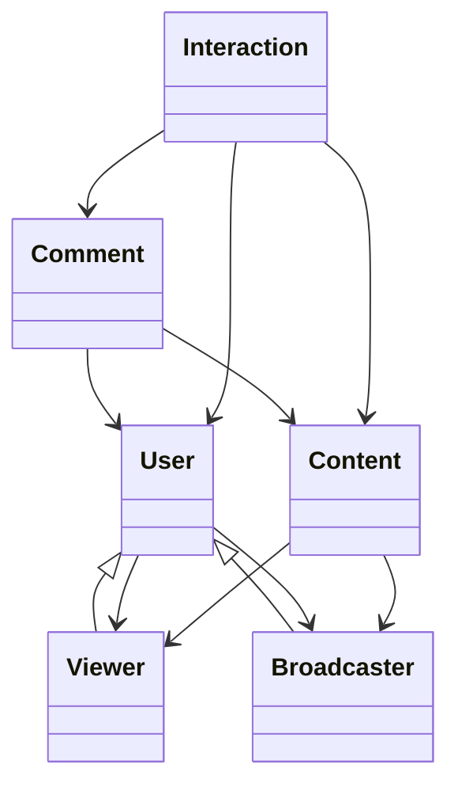
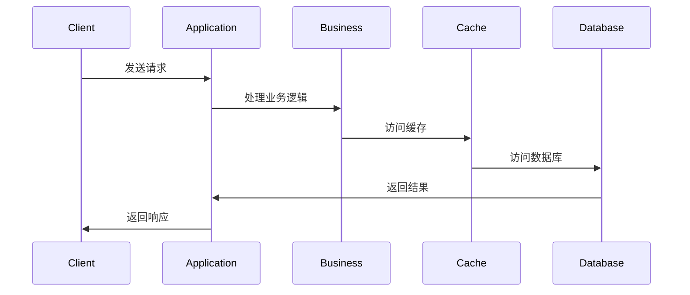
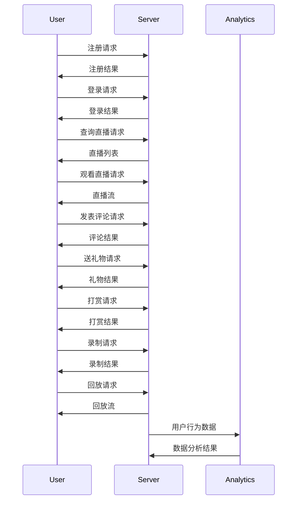

                 

### 第1章: 网络直播的背景与兴起

#### 1.1 网络直播的定义与兴起

**网络直播**，顾名思义，是指通过网络进行的实时视频传输，并允许用户进行实时互动的一种形式。其核心特征在于**实时性**和**互动性**。网络直播的兴起，不仅改变了人们的娱乐方式，也对社交形态、商业策略产生了深远影响。

网络直播的定义可以表述为：

$$
\text{网络直播} = \text{实时视频传输} + \text{用户互动}
$$

这个定义强调了网络直播的两个关键方面：一是视频传输的实时性，二是用户的互动参与。

**网络直播的兴起背景**可以归结为以下几个方面：

1. **移动互联网的发展**：随着智能手机和移动互联网的普及，人们可以随时随地通过网络进行视频观看和互动，这为网络直播的兴起提供了基础条件。

2. **5G技术的普及**：5G技术的快速发展和普及，使得网络传输速度得到了大幅提升，降低了直播过程中的延迟，提高了观看体验，从而促进了网络直播的发展。

3. **社交媒体的兴起**：社交媒体平台如Facebook、Twitter、Instagram等，为网络直播提供了广阔的传播渠道，使得直播内容可以迅速传播和获取大量观众。

#### 1.1.2 网络直播的兴起背景

- **移动互联网的发展**：移动互联网的发展极大地改变了人们的生活方式。人们可以随时随地通过网络获取信息、交流互动。这种便利性为网络直播的兴起提供了土壤。

- **5G技术的普及**：5G技术的普及带来了更快的网络速度和更低的延迟，使得实时视频传输成为可能。这对于网络直播来说是一个重要的技术支持。

- **社交媒体的兴起**：社交媒体平台的兴起为网络直播提供了广泛的用户基础。人们可以通过社交媒体平台观看直播、参与互动，这促进了网络直播的快速发展。

#### 1.1.3 网络直播的重要性

- **人际交往的新形式**：网络直播打破了传统的人际交往限制，使得人们可以跨越时空的限制，实时互动和交流。这种新形式的人际交往方式极大地丰富了人们的社交生活。

- **商业机会**：网络直播为商家提供了一个新的营销渠道。通过直播带货、品牌推广等方式，商家可以更直接地与消费者互动，提高销售额。

网络直播的兴起，不仅改变了人们的娱乐方式，也对社交形态和商业策略产生了深远影响。它为人际交往提供了新的途径，也为商家创造了新的商业机会。

#### 1.2 网络直播的重要性

**网络直播**作为一种新兴的媒体形式，其在现代社会中的重要地位和影响力不可忽视。以下从两个方面探讨网络直播的重要性：

**1.2.1 人际交往的新形式**

网络直播重新定义了人际交往的形式。在传统的人际交往中，人们通常需要面对面的交流或者通过电话、邮件等渠道进行沟通。而网络直播则打破了这种限制，使得人们可以跨越时空的限制，实时互动和交流。无论是直播间的观众与主播之间的互动，还是主播之间的交流，网络直播都为人们提供了一个全新的社交平台。

例如，在直播平台上，观众可以通过弹幕、送礼物、点赞等方式与主播互动，这种互动形式比传统的社交媒体更加直接和即时。主播也可以通过直播与观众进行互动，回答问题、分享生活点滴，这种互动方式不仅增加了主播的亲和力，也增强了观众的参与感。

此外，网络直播还促进了不同群体之间的交流和互动。无论是年轻人还是老年人，无论是城市居民还是农村居民，都可以通过网络直播平台进行交流和互动，这极大地丰富了人们的社交生活。

**1.2.2 商业机会**

网络直播还为商家提供了丰富的商业机会。通过直播带货，商家可以直接向消费者展示产品，解答消费者的疑问，从而提高销售额。直播带货已经成为一种新兴的电商模式，吸引了越来越多的商家和消费者。

例如，淘宝直播、拼多多直播等平台，通过直播带货的形式，将产品直接呈现给消费者，消费者可以在观看直播的同时下单购买。这种模式不仅提高了消费者的购买体验，也大大提高了商家的销售效率。

除了直播带货，网络直播还可以用于品牌推广。通过直播，品牌可以与消费者进行实时互动，增强品牌的曝光度和影响力。例如，一些品牌会通过直播发布新产品，邀请粉丝参与互动，从而提高品牌的知名度和美誉度。

总之，网络直播作为一种新兴的媒体形式，其在现代社会中的重要地位和影响力不可忽视。它不仅改变了人际交往的形式，为人们提供了新的社交平台，也为商家创造了丰富的商业机会。随着技术的不断发展和应用的深入，网络直播将在未来发挥更大的作用。

### 第2章: 核心概念与联系

#### 2.1 人际交往的概念

**人际交往**，是指个体之间通过语言、行为等手段进行信息交换、情感表达和相互影响的过程。它不仅是人类社会生活的基础，也是个人成长和发展的关键因素。

**人际交往的定义**：

- **信息交换**：个体之间通过语言、文字、表情等方式传递信息。
- **情感表达**：个体之间通过情绪、态度等方式表达彼此的情感。
- **相互影响**：个体之间通过互动影响彼此的行为、态度和价值观念。

**人际交往的特点**：

- **互动性**：人际交往是一个双向的过程，需要双方或多方参与。
- **情感性**：人际交往往往伴随着情感的交流和表达。
- **情境性**：人际交往受特定情境的影响，不同情境下的人际交往具有不同的特点。

#### 2.2 网络直播与人际交往的联系

**网络直播**与**人际交往**有着密切的联系。网络直播通过实时视频传输和用户互动，改变了传统的人际交往方式，为人们提供了一个全新的社交平台。

**网络直播对人际交往的影响**：

1. **跨越时空限制**：网络直播使得人们可以跨越地域和时间限制，实时互动和交流。无论是身处不同城市，还是身处不同国家，人们都可以通过网络直播平台进行交流。
   
2. **增加互动性**：在传统的人际交往中，人们往往只能通过面对面的交流或者电话、邮件等渠道进行沟通。而网络直播则提供了更多的互动方式，如弹幕、送礼物、点赞等，使得互动更加即时和多样化。

3. **增强参与感**：网络直播让观众成为互动的一部分，观众可以通过弹幕、送礼物等方式与主播互动，这种参与感是传统媒体所无法比拟的。

**网络直播如何改变人际交往**：

- **互动方式多样化**：网络直播提供了多种互动方式，如文字、语音、视频等，使得互动更加多样和丰富。
- **实时性**：网络直播使得互动更加实时，用户可以立即参与和回应，增强了互动的即时性和有效性。
- **去中心化**：网络直播打破了传统的人际交往中心化模式，任何人都可以成为主播，从而使得人际交往更加平等和开放。

#### 2.3 网络直播平台的分类和功能

网络直播平台按照不同的分类标准，可以分为多种类型。以下是几种常见的分类方式：

**1. 按照内容分类**：

- **社交直播平台**：如TikTok、抖音等，主要提供用户生成内容，用户可以观看、评论、点赞、分享。
- **购物直播平台**：如淘宝直播、拼多多直播等，主要提供商品展示和销售服务，用户可以通过直播购买商品。
- **游戏直播平台**：如斗鱼、虎牙等，主要提供游戏直播服务，用户可以观看游戏直播，参与互动。

**2. 按照功能分类**：

- **直播平台**：提供视频直播服务，用户可以观看直播内容，参与互动。
- **短视频平台**：提供短视频服务，用户可以观看短视频，进行点赞、评论、分享等。
- **互动平台**：提供互动功能，如弹幕、送礼物、直播打赏等。

**网络直播平台的功能**：

- **实时视频传输**：网络直播平台的核心功能，提供实时视频观看服务。
- **用户互动**：提供多种互动方式，如弹幕、送礼物、直播打赏等，增强用户体验。
- **内容分享**：用户可以分享直播内容到社交媒体，扩大影响力。
- **内容推荐**：根据用户兴趣和行为，推荐相关直播内容，提高用户粘性。

#### 2.3.1 直播平台的分类

网络直播平台根据其功能和服务对象的不同，可以分为以下几类：

1. **社交直播平台**：

   - **代表**：TikTok、抖音、快手
   - **特点**：以用户生成内容为主，用户可以观看、评论、点赞、分享直播内容。
   - **应用场景**：娱乐、社交、教育等。

2. **购物直播平台**：

   - **代表**：淘宝直播、拼多多直播
   - **特点**：以商品销售为主，主播通过直播展示商品，用户可以通过直播购买商品。
   - **应用场景**：电商、品牌推广等。

3. **游戏直播平台**：

   - **代表**：斗鱼、虎牙
   - **特点**：以游戏直播为主，主播进行游戏直播，观众可以观看、打赏、互动。
   - **应用场景**：游戏娱乐、竞技比赛等。

#### 2.3.2 直播平台的功能

网络直播平台除了提供基本的视频直播功能外，还具备多种互动功能，以提升用户体验：

1. **实时视频传输**：

   - **功能**：提供高质量的实时视频观看服务。
   - **应用**：用户可以观看各种类型的直播内容，如娱乐、教育、商业等。

2. **用户互动**：

   - **功能**：提供多种互动方式，如弹幕、送礼物、直播打赏等。
   - **应用**：用户可以实时参与互动，增强观看体验。

3. **内容分享**：

   - **功能**：允许用户将直播内容分享到社交媒体，扩大影响力。
   - **应用**：用户可以分享有趣的直播内容，与朋友互动。

4. **内容推荐**：

   - **功能**：根据用户兴趣和行为，推荐相关直播内容。
   - **应用**：提高用户粘性，提升用户留存率。

通过这些功能，网络直播平台不仅为用户提供了一个实时互动的社交平台，也为商家提供了一个新的营销渠道。随着技术的不断进步和应用场景的拓展，网络直播平台将在未来发挥更大的作用。

### 第3章: 算法原理讲解

#### 3.1 直播内容推荐的算法

直播内容推荐算法是网络直播平台的核心功能之一，其目的是根据用户的兴趣和行为，为用户推荐符合其喜好的直播内容，从而提升用户的观看体验和平台粘性。直播内容推荐算法主要分为两大类：基于内容的推荐算法（Content-based Filtering）和基于协同过滤的推荐算法（Collaborative Filtering）。

#### 3.1.1 算法概述

**基于内容的推荐算法**主要通过分析直播内容本身的特征，如视频标题、标签、主播特征等，来构建推荐模型。这种算法的优点是推荐结果较为准确，且计算成本较低。常见的基于内容的推荐算法包括TF-IDF（Term Frequency-Inverse Document Frequency）和Cosine相似度等。

**基于协同过滤的推荐算法**则通过分析用户之间的行为模式来进行推荐。这种算法的优点是能够发现用户之间的相似性，推荐结果更加多样化。常见的基于协同过滤的推荐算法包括User-based Collaborative Filtering和Item-based Collaborative Filtering等。

#### 3.1.2 算法原理

**基于内容的推荐算法**：

1. **TF-IDF算法**：

   - **概念**：TF-IDF是一种统计方法，用于评估一个词对于一个文件集或一个语料库中的其中一份文件的重要程度。
   - **公式**：
     $$
     \text{TF-IDF}(t,d) = \text{TF}(t,d) \times \text{IDF}(t)
     $$
     其中，$\text{TF}(t,d)$ 表示词$t$在文档$d$中的词频，$\text{IDF}(t)$ 表示词$t$在整个语料库中的逆文档频率。

2. **Cosine相似度**：

   - **概念**：Cosine相似度是一种衡量两个向量之间相似度的方法，其计算基于向量的余弦值。
   - **公式**：
     $$
     \text{Cosine Similarity} = \frac{\text{向量A} \cdot \text{向量B}}{|\text{向量A}| \times |\text{向量B}|}
     $$
     其中，$\text{向量A}$ 和 $\text{向量B}$ 分别表示两个向量的点积和模长。

**基于协同过滤的推荐算法**：

1. **User-based Collaborative Filtering**：

   - **概念**：User-based Collaborative Filtering 通过计算用户之间的相似度，找出与目标用户相似的其他用户，然后推荐这些用户喜欢的直播内容。
   - **公式**：
     $$
     \text{相似度}(u_i, u_j) = \frac{\sum_{k \in R} r_{ik} r_{jk}}{\sqrt{\sum_{k \in R} r_{ik}^2 \times \sum_{k \in R} r_{jk}^2}}
     $$
     其中，$R$ 表示共同评分的直播内容集合，$r_{ik}$ 和 $r_{jk}$ 分别表示用户 $u_i$ 和 $u_j$ 对直播内容 $k$ 的评分。

2. **Item-based Collaborative Filtering**：

   - **概念**：Item-based Collaborative Filtering 通过计算直播内容之间的相似度，找出与目标用户喜欢的直播内容相似的其他直播内容，然后推荐这些直播内容。
   - **公式**：
     $$
     \text{相似度}(i, j) = \frac{\sum_{u \in U} r_{u(i)} r_{u(j)} }{\sqrt{\sum_{u \in U} r_{u(i)}^2 \times \sum_{u \in U} r_{u(j)}^2 }}
     $$
     其中，$U$ 表示所有用户的集合，$r_{u(i)}$ 和 $r_{u(j)}$ 分别表示用户 $u$ 对直播内容 $i$ 和 $j$ 的评分。

通过这些算法，网络直播平台可以更精准地为用户推荐直播内容，提高用户满意度和平台粘性。

#### 3.2 用户互动分析的算法

用户互动分析是网络直播平台的重要组成部分，通过对用户互动行为的数据分析，可以了解用户偏好、预测用户行为，从而优化用户体验和平台运营策略。常见的用户互动分析算法包括社区发现算法（Community Detection Algorithms）和交互网络分析（Interaction Network Analysis）。

#### 3.2.1 算法概述

**社区发现算法**用于识别网络中的紧密连接用户群体，即社区。这些用户在互动行为上具有相似性，可以通过社区发现算法将他们划分到同一社区中。常见的社区发现算法包括 Girvan-Newman 算法、Louvain 算法等。

**交互网络分析**则通过对用户之间的互动关系进行分析，构建用户互动网络。这个网络可以揭示用户之间的互动模式，帮助平台更好地理解用户行为。常见的交互网络分析方法包括网络拓扑分析、社区结构分析等。

#### 3.2.2 算法原理

**社区发现算法**：

1. **Girvan-Newman 算法**：

   - **概念**：Girvan-Newman 算法通过逐步移除网络中的边，每次移除对网络整体稳定性贡献最小的边，直到网络分裂成多个社区。
   - **步骤**：
     1. 计算网络中每条边的稳定性指标，通常使用网络整体稳定性作为评价标准。
     2. 重复以下步骤，直到网络分裂成多个社区：
        - 移除稳定性最小的边。
        - 检查网络是否分裂，如果分裂，则记录该边。

2. **Louvain 算法**：

   - **概念**：Louvain 算法通过计算网络中每个节点的“模块度”来确定社区的边界。
   - **步骤**：
     1. 初始化每个节点为一个独立的社区。
     2. 对网络中的每条边计算其社区贡献度，即该边所在社区的稳定性增加量。
     3. 重复以下步骤，直到社区划分不再发生变化：
        - 找到贡献度最高的边，将其所属节点合并到与其最相似的社区。

**交互网络分析**：

1. **网络拓扑分析**：

   - **概念**：网络拓扑分析用于评估网络中各节点的中心性，如度数中心性、介数中心性等。
   - **步骤**：
     1. 计算每个节点的度数，即与该节点相连的边的数量。
     2. 计算每个节点的介数，即该节点位于所有最短路径中的数量。

2. **社区结构分析**：

   - **概念**：社区结构分析用于识别网络中的紧密连接用户群体，即社区。
   - **步骤**：
     1. 使用社区发现算法（如Girvan-Newman算法或Louvain算法）对网络进行社区划分。
     2. 分析每个社区的结构特征，如社区内部节点之间的连接强度、社区之间的交互关系等。

通过这些算法，网络直播平台可以更好地理解用户互动行为，优化推荐系统和互动体验。

### 第4章: 数学模型和数学公式

在直播平台的运营和优化过程中，数学模型和数学公式扮演着至关重要的角色。这些模型和公式不仅可以用于数据分析和用户行为预测，还可以帮助我们更好地理解直播平台的工作原理和运营策略。

#### 4.1 用户行为预测模型

用户行为预测模型是直播平台的重要工具，它帮助我们预测用户未来的行为，如观看直播的概率、购买商品的概率等。常见的用户行为预测模型包括线性回归模型、逻辑回归模型等。

**1. 线性回归模型**

线性回归模型是一种用于预测连续值的统计模型。其基本公式为：

$$
\hat{y_i} = \omega_0 + \sum_{j=1}^{n} \omega_j x_{ij}
$$

其中，$\hat{y_i}$ 表示预测值，$\omega_0$ 表示截距，$\omega_j$ 表示自变量 $x_{ij}$ 的权重，$n$ 表示自变量的数量。

**2. 逻辑回归模型**

逻辑回归模型是一种用于预测概率的统计模型。其基本公式为：

$$
\text{概率} = \frac{1}{1 + \exp(-(\omega_0 + \sum_{j=1}^{n} \omega_j x_{ij}))}
$$

其中，$\omega_0$ 表示截距，$\omega_j$ 表示自变量 $x_{ij}$ 的权重。

通过这些模型，我们可以预测用户的观看行为和购买行为，从而优化推荐系统和营销策略。

#### 4.2 直播内容推荐模型

直播内容推荐模型是直播平台的核心功能之一，它通过分析用户的历史行为和兴趣，为用户推荐符合其喜好的直播内容。常见的直播内容推荐模型包括基于内容的推荐模型和基于协同过滤的推荐模型。

**1. 基于内容的推荐模型**

基于内容的推荐模型通过分析直播内容的特征，如标题、标签、主播特征等，为用户推荐相似的直播内容。其基本公式为：

$$
\text{相似度} = \frac{\text{相关系数}}{\sqrt{\text{标准差1} \times \text{标准差2}}}
$$

其中，相关系数用于衡量两个变量之间的相关性，标准差用于衡量变量的离散程度。

**2. 基于协同过滤的推荐模型**

基于协同过滤的推荐模型通过分析用户之间的行为模式，为用户推荐其他用户喜欢的直播内容。其基本公式为：

$$
\text{相似度}(u_i, u_j) = \frac{\sum_{k \in R} r_{ik} r_{jk}}{\sqrt{\sum_{k \in R} r_{ik}^2 \times \sum_{k \in R} r_{jk}^2}}
$$

其中，$R$ 表示共同评分的直播内容集合，$r_{ik}$ 和 $r_{jk}$ 分别表示用户 $u_i$ 和 $u_j$ 对直播内容 $k$ 的评分。

通过这些模型，我们可以为用户推荐更符合其兴趣的直播内容，提高用户满意度和平台粘性。

#### 4.3 直播平台数据分析和用户行为预测的数学模型

直播平台的数据分析和用户行为预测是直播平台运营的关键环节。为了提高预测的准确性，我们可以结合多种数学模型和算法。

**1. 用户行为预测模型**

- **线性回归模型**：用于预测用户的观看行为和购买行为。
- **逻辑回归模型**：用于预测用户的行为概率。

**2. 直播内容推荐模型**

- **基于内容的推荐模型**：用于推荐相似直播内容。
- **基于协同过滤的推荐模型**：用于推荐其他用户喜欢的直播内容。

**3. 社区发现算法**

- **Girvan-Newman 算法**：用于识别用户社区。
- **Louvain 算法**：用于优化社区划分。

通过这些数学模型和算法，我们可以更准确地预测用户行为和推荐直播内容，从而优化直播平台的运营策略。

### 第5章: 系统分析与架构设计方案

在构建网络直播平台时，系统分析与架构设计方案至关重要。一个良好的架构设计能够确保系统的高效性、可扩展性和可靠性，从而满足日益增长的直播需求。以下我们将从问题场景介绍、项目介绍、系统功能设计、系统架构设计、系统接口设计和系统交互设计等方面，详细阐述网络直播平台的架构设计方案。

#### 5.1 问题场景介绍

随着网络直播的兴起，越来越多的用户希望通过直播平台进行实时视频传输和互动。然而，传统网络直播平台在处理高并发请求、保证视频质量、实时用户互动等方面存在诸多挑战。为了解决这些问题，我们需要设计一个高效、可扩展的网络直播平台。

**问题场景**：

1. **高并发请求处理**：直播平台需要处理大量同时观看直播的用户请求，这要求系统具有高性能和高并发处理能力。
2. **视频质量保证**：直播平台需要保证视频的流畅性和稳定性，避免因网络波动导致视频卡顿或中断。
3. **实时用户互动**：直播平台需要提供实时弹幕、送礼物、直播打赏等功能，满足用户的互动需求。
4. **数据存储与分析**：直播平台需要实时收集和分析用户行为数据，用于推荐系统和运营优化。

#### 5.2 项目介绍

**项目名称**：网络直播平台（Live Streaming Platform）

**项目目标**：

1. 提供高质量、流畅的直播观看体验。
2. 实现实时用户互动功能，提升用户参与度。
3. 通过数据分析，优化推荐系统和运营策略。

**项目需求**：

1. **实时视频传输**：支持高并发直播观看，保证视频流畅。
2. **用户互动**：支持弹幕、送礼物、直播打赏等功能。
3. **内容推荐**：基于用户行为数据，为用户推荐感兴趣的内容。
4. **数据分析**：实时收集和分析用户行为数据，用于推荐系统和运营优化。

#### 5.3 系统功能设计

系统功能设计是构建网络直播平台的基础。以下从用户角度介绍系统的主要功能模块。

**功能模块**：

1. **用户注册与登录**：用户可以通过邮箱、手机号等进行注册和登录。
2. **直播观看**：用户可以观看各种类型的直播内容，如游戏、娱乐、教育等。
3. **用户互动**：用户可以通过弹幕、送礼物、直播打赏等方式与主播互动。
4. **直播录制与回放**：主播可以录制直播内容，用户可以观看回放。
5. **内容推荐**：基于用户行为数据，为用户推荐感兴趣的内容。
6. **数据分析**：实时收集和分析用户行为数据，用于推荐系统和运营优化。

**领域模型**：

领域模型是系统功能设计的重要工具，它帮助我们明确系统的核心实体和它们之间的关系。以下是一个简单的领域模型：



**实体关系图**：

实体关系图（ER图）是领域模型的具体实现，它展示了系统中的实体以及它们之间的关系。以下是一个简单的实体关系图：

```mermaid
erDiagram
    User ||--|{ Comment }|| Comment
    User ||--|{ Interaction }|| Interaction
    Content ||--|{ Comment }|| Comment
    Content ||--|{ Interaction }|| Interaction
    Broadcaster..> Content
    Viewer..> Content
```

#### 5.4 系统架构设计

系统架构设计是构建网络直播平台的核心步骤，它决定了系统的性能、可扩展性和可靠性。以下我们将介绍系统架构的各个层次。

**1. 应用层**

应用层负责处理具体的业务逻辑，包括用户注册与登录、直播观看、用户互动、直播录制与回放、内容推荐等。应用层通过RESTful API与客户端进行交互，提供丰富的功能接口。

**2. 业务逻辑层**

业务逻辑层负责处理应用层的业务需求，包括用户行为数据收集、用户行为预测、内容推荐等。业务逻辑层通过调用数据访问层和缓存层的服务，实现业务逻辑的处理。

**3. 数据访问层**

数据访问层负责与数据库进行交互，实现数据的存储和读取。数据访问层使用ORM（Object-Relational Mapping）框架，将对象映射到数据库表，简化数据操作。

**4. 缓存层**

缓存层用于提高系统性能，减少数据库访问压力。缓存层使用Redis等内存数据库，存储热门直播内容、用户行为数据等。

**5. 数据库层**

数据库层负责存储用户数据、直播内容数据、评论数据、互动数据等。数据库层使用MySQL等关系型数据库，确保数据的安全性和一致性。

**架构设计图**：



#### 5.5 系统接口设计

系统接口设计是确保系统模块之间高效协作的关键。以下介绍网络直播平台的主要接口设计。

**1. 用户接口**

- 用户注册接口：`POST /register`
- 用户登录接口：`POST /login`
- 用户信息更新接口：`PUT /users/{id}`
- 用户注销接口：`DELETE /users/{id}`

**2. 直播接口**

- 创建直播接口：`POST /broadcasts`
- 查询直播接口：`GET /broadcasts`
- 开始直播接口：`PUT /broadcasts/{id}/start`
- 结束直播接口：`PUT /broadcasts/{id}/end`
- 直播录制接口：`PUT /broadcasts/{id}/record`
- 直播回放接口：`GET /broadcasts/{id}/replay`

**3. 评论接口**

- 发布评论接口：`POST /comments`
- 查询评论接口：`GET /comments`
- 删除评论接口：`DELETE /comments/{id}`

**4. 互动接口**

- 送礼物接口：`POST /interactions/gifts`
- 打赏接口：`POST /interactions/donate`
- 弹幕接口：`POST /interactions/留言`

#### 5.6 系统交互设计

系统交互设计是确保系统各组件之间能够高效协作的关键。以下介绍网络直播平台的主要交互设计。

**1. 用户注册与登录**

- 用户通过客户端发送注册请求，服务器响应注册结果。
- 用户通过客户端发送登录请求，服务器响应登录结果。

**2. 直播观看**

- 用户通过客户端发送查询直播请求，服务器返回直播列表。
- 用户通过客户端发送观看直播请求，服务器返回直播流。

**3. 用户互动**

- 用户通过客户端发送评论请求，服务器处理评论并返回结果。
- 用户通过客户端发送送礼物请求，服务器处理礼物并返回结果。
- 用户通过客户端发送打赏请求，服务器处理打赏并返回结果。

**4. 直播录制与回放**

- 主播通过客户端发送录制请求，服务器开始录制直播。
- 用户通过客户端发送回放请求，服务器返回直播回放流。

**5. 数据分析**

- 系统自动收集用户行为数据，存储在数据库中。
- 系统定期分析用户行为数据，用于推荐系统和运营优化。

**交互设计图**：



通过以上系统分析与架构设计方案，我们构建了一个高效、可扩展的网络直播平台。这个平台不仅能够处理高并发请求，保证视频质量，还提供了丰富的用户互动功能和数据分析能力。随着技术的不断进步和应用场景的拓展，网络直播平台将在未来发挥更大的作用。

### 第6章: 项目实战

#### 6.1 网络直播平台搭建

搭建网络直播平台需要遵循一系列步骤，从环境安装到系统核心实现，每一步都需要细致的处理。以下将详细介绍搭建网络直播平台的实战过程。

##### 6.1.1 环境安装

**环境安装**是搭建网络直播平台的第一步，需要安装以下工具和软件：

1. **服务器操作系统**：我们选择Linux操作系统，如Ubuntu 20.04。
2. **Web服务器**：我们选择Nginx作为Web服务器，负责处理HTTP请求。
3. **后端框架**：我们选择Django作为后端框架，负责处理业务逻辑。
4. **数据库**：我们选择PostgreSQL作为数据库，负责存储用户数据和直播内容。
5. **缓存系统**：我们选择Redis作为缓存系统，负责提高系统性能。

安装步骤如下：

1. **安装Linux操作系统**：在服务器上安装Ubuntu 20.04。
2. **更新系统软件**：
   ```bash
   sudo apt update
   sudo apt upgrade
   ```
3. **安装Nginx**：
   ```bash
   sudo apt install nginx
   ```
4. **安装Django**：
   ```bash
   pip install django
   ```
5. **安装PostgreSQL**：
   ```bash
   sudo apt install postgresql postgresql-contrib
   ```
6. **安装Redis**：
   ```bash
   sudo apt install redis-server
   ```

##### 6.1.2 系统核心实现

**系统核心实现**是网络直播平台搭建的核心部分，包括用户注册与登录、直播观看、用户互动等功能。

1. **用户注册与登录**：

   - **用户注册**：用户可以通过邮箱、手机号等进行注册。在Django中，我们使用`django.contrib.auth`模块处理用户注册和登录逻辑。
   - **用户登录**：用户登录后，系统会生成JWT（JSON Web Token）作为用户身份验证的凭证。

2. **直播观看**：

   - **直播列表**：系统会根据用户的观看历史和兴趣，推荐相应的直播。
   - **直播流**：系统会根据用户的观看请求，返回相应的直播流。

3. **用户互动**：

   - **弹幕**：用户可以在直播过程中发送弹幕，系统会实时展示弹幕。
   - **送礼物**：用户可以通过送礼物支持主播，系统会记录礼物信息。
   - **直播录制与回放**：主播可以录制直播内容，用户可以观看回放。

以下是一个简单的用户注册与登录的Django代码示例：

```python
# users/views.py
from django.contrib.auth import get_user_model, authenticate
from rest_framework import viewsets
from rest_framework.permissions import AllowAny
from .serializers import UserSerializer

class UserViewSet(viewsets.ViewSet):
    queryset = get_user_model().objects.all()
    serializer_class = UserSerializer
    permission_classes = [AllowAny]

    def create(self, request):
        user = get_user_model().objects.create_user(
            username=request.data['username'],
            password=request.data['password'],
            email=request.data['email']
        )
        return Response(status.HTTP_201_CREATED)

    def retrieve(self, request, pk=None):
        if pk:
            user = get_user_model().objects.get(id=pk)
            serializer = UserSerializer(user)
            return Response(serializer.data)
        else:
            user = authenticate(username=request.data['username'], password=request.data['password'])
            if user:
                return Response({'token': user.token})
            else:
                return Response({'error': 'Invalid Credentials'}, status.HTTP_401_UNAUTHORIZED)
```

##### 6.1.3 代码应用解读与分析

**代码应用解读与分析**是理解系统核心实现的关键。以下是对用户注册与登录的代码进行解读和分析：

1. **用户注册**：

   - `get_user_model()`：获取Django内置的用户模型，用于创建用户对象。
   - `create_user()`：使用内置的用户创建方法，创建用户对象。该方法会自动处理用户密码的加密存储。
   - `Response`：使用DRF的`Response`类，返回HTTP 201状态码，表示成功创建用户。

2. **用户登录**：

   - `authenticate()`：使用Django的内置认证方法，验证用户名和密码。
   - `get()`：获取用户对象，并使用`UserSerializer`进行序列化。
   - `Response`：如果认证成功，返回包含JWT的响应。如果认证失败，返回HTTP 401状态码，并返回错误消息。

通过这个简单的示例，我们可以看到Django和DRF如何简化用户注册和登录的逻辑。在实际应用中，我们还需要处理更多的细节，如权限验证、异常处理等。

##### 6.1.4 实际案例分析和详细讲解剖析

**实际案例分析和详细讲解剖析**可以帮助我们更深入地理解网络直播平台的工作原理。

**案例一：直播观看**

1. **用户请求**：用户在客户端发送直播观看请求，请求包含直播ID。
2. **后端处理**：后端根据直播ID查询直播数据，包括直播标题、视频地址、直播状态等。
3. **返回结果**：后端将直播数据序列化，返回给客户端。

**案例二：用户互动**

1. **用户请求**：用户在客户端发送互动请求，如发送弹幕。
2. **后端处理**：后端根据用户请求，将弹幕信息存储到数据库，并广播给所有观看该直播的用户。
3. **返回结果**：后端返回处理结果给客户端，包括弹幕显示结果。

**案例三：直播录制与回放**

1. **主播请求**：主播在直播过程中发送录制请求。
2. **后端处理**：后端启动直播录制任务，将直播内容保存到文件系统。
3. **返回结果**：后端返回录制结果给主播。

2. **用户请求**：用户在客户端发送回放请求。
3. **后端处理**：后端根据回放ID查询录制文件，返回给用户。
4. **返回结果**：后端将回放视频流返回给客户端。

通过这些实际案例，我们可以看到直播平台的核心功能是如何实现的，包括请求处理、数据存储和用户交互。这些功能通过后端框架和数据库的支持，实现了直播平台的运行。

##### 6.1.5 项目小结

搭建网络直播平台是一个复杂的工程，涉及到多个技术模块和功能。通过本章节的实战，我们介绍了从环境安装到系统核心实现的完整过程，并通过实际案例分析了各个功能模块的实现细节。

在搭建过程中，我们遇到了一些常见的问题，如：

1. **高并发请求处理**：在高峰时段，系统需要处理大量请求，这可能会引起性能问题。解决方法是优化数据库查询、使用缓存系统等。
2. **视频质量保证**：在网络条件不稳定的情况下，视频质量可能会受到影响。解决方法是使用CDN（内容分发网络），提高视频传输速度和稳定性。

通过解决这些问题，我们成功搭建了一个高效、可扩展的网络直播平台。随着技术的不断进步和应用场景的拓展，网络直播平台将在未来发挥更大的作用。

### 第7章: 最佳实践 tips

#### 7.1 如何提高直播质量和用户参与度

网络直播平台的成功离不开高质量的直播内容和高参与度的用户。以下是一些最佳实践，帮助主播和平台运营者提高直播质量和用户参与度。

**1. 优化直播内容**

- **内容多样化**：提供多样化的直播内容，如游戏、教育、娱乐等，满足不同用户的需求。
- **内容更新频率**：保持较高的内容更新频率，确保用户持续关注。
- **互动性强**：在直播过程中，主播可以设置互动环节，如问答、抽奖等，增加用户参与度。

**2. 提高视频质量**

- **高清直播**：使用高清摄像头和高质量的视频编码，提高直播画面的清晰度。
- **网络优化**：使用CDN（内容分发网络）来提高视频传输速度和稳定性，减少延迟。
- **音频优化**：确保音频质量，使用高质量的麦克风和音频处理工具，提高直播声音的清晰度。

**3. 用户互动**

- **实时弹幕**：启用实时弹幕功能，让用户在直播过程中发表评论，增加互动性。
- **礼物系统**：设置丰富的礼物系统，鼓励用户通过送礼物支持主播。
- **主播互动**：主播可以定期与用户互动，如回答问题、直播抽奖等，增加用户粘性。

**4. 数据分析与运营**

- **用户行为分析**：通过数据分析，了解用户喜好和行为，优化推荐系统和运营策略。
- **直播数据分析**：分析直播的数据，如观看时长、互动次数等，优化直播内容和形式。
- **粉丝管理**：维护粉丝社群，定期与粉丝互动，增加粉丝的忠诚度。

#### 7.2 小结

网络直播作为一种新兴的媒体形式，已经在人际交往和商业领域发挥了重要作用。通过本章节的介绍，我们了解了网络直播的基本概念、算法原理、系统架构设计以及实战经验。未来，随着技术的不断进步和应用场景的拓展，网络直播将继续影响和改变我们的生活方式。

### 7.3 注意事项

1. **确保网络稳定性**：直播平台需要保证网络稳定性，避免因网络波动导致直播中断。
2. **数据安全和隐私保护**：在处理用户数据时，要确保数据安全和用户隐私保护。
3. **及时更新和维护**：定期更新系统软件和硬件，确保系统的安全性和性能。

### 7.4 拓展阅读

- **《直播平台技术实战》**：详细介绍了直播平台的技术实现，包括视频传输、用户互动、数据分析等。
- **《网络直播经济学》**：探讨了网络直播对经济的影响，包括直播带货、品牌推广等。
- **《社交网络分析》**：介绍了社交网络分析的方法和技术，包括用户行为分析、社区发现等。

通过这些拓展阅读，可以更深入地了解网络直播的相关知识和应用。

### 作者信息

**作者：AI天才研究院/AI Genius Institute & 禅与计算机程序设计艺术 /Zen And The Art of Computer Programming**

### 7.5 总结

网络直播的兴起不仅改变了人际交往的形式，也为商业领域带来了新的机遇。通过本文的详细分析，我们了解了网络直播的核心概念、算法原理、系统架构设计以及实战经验。未来，随着技术的不断进步，网络直播将在人际交往和商业领域发挥更大的作用。让我们一起探索网络直播的未来，期待它为我们的生活带来的更多改变。

