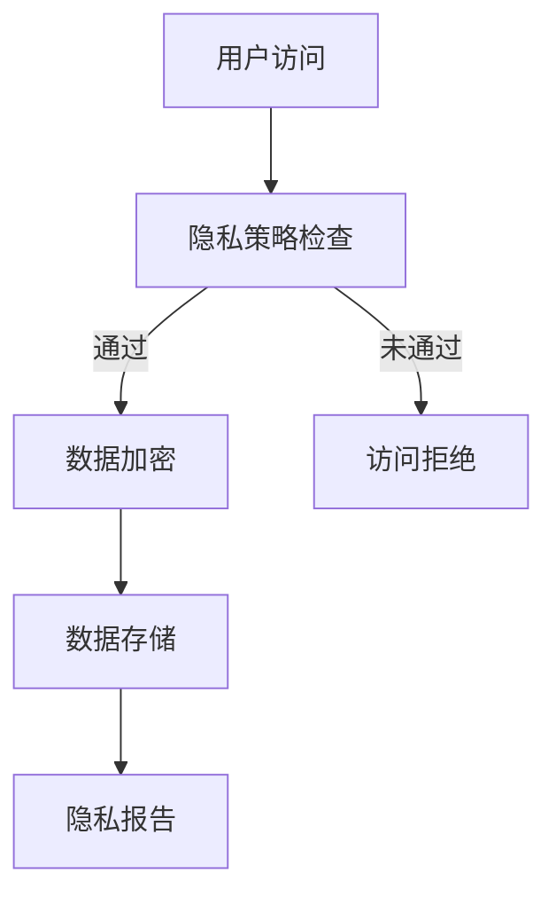
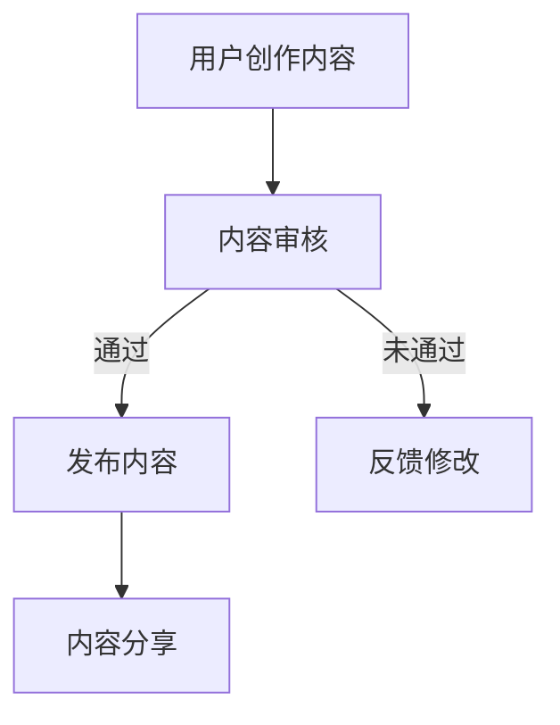
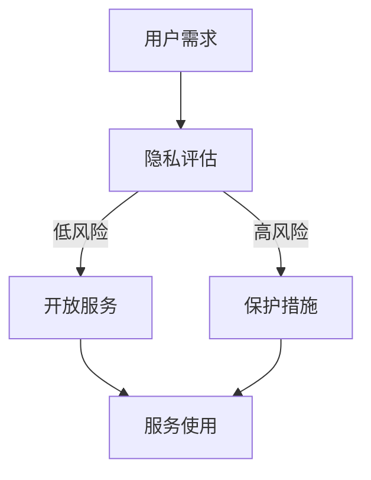
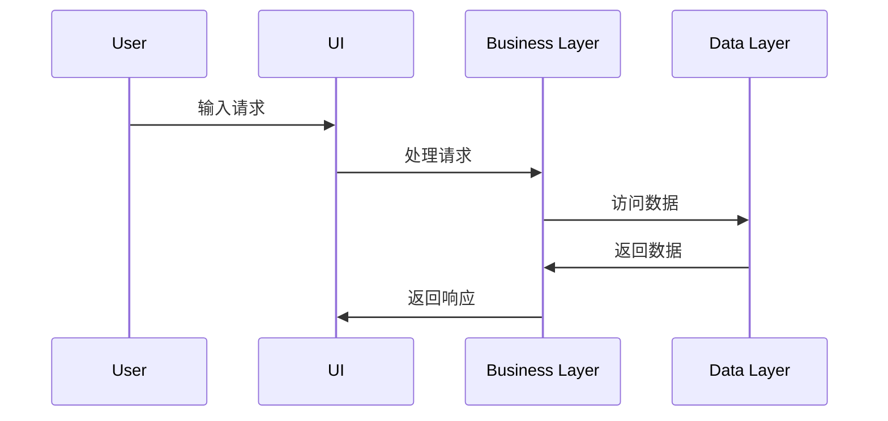
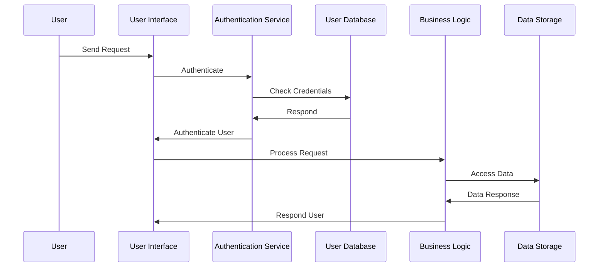
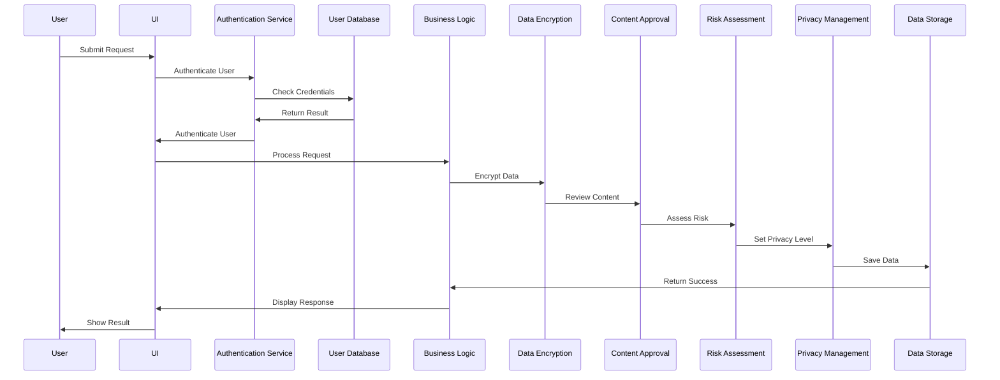

                 

### 1.1 问题背景

在互联网时代，隐私危机已经成为一个全球性的问题。社交媒体平台的普及使得个人信息更容易被收集、存储和传播，同时，数据滥用和诈骗案件也层出不穷。这些现象引发了公众对隐私保护的担忧。

**社交媒体上的隐私泄露**

社交媒体平台如Facebook、Twitter等，通过用户的互动行为、兴趣爱好、地理位置等信息，构建了详细的用户画像。这些数据不仅被用于广告定位，有时也可能被不法分子利用，进行网络诈骗、身份盗窃等犯罪活动。

**用户隐私泄露的案例与影响**

2018年，Facebook的Cambridge Analytica丑闻揭示了如何通过不当手段获取和利用用户数据。这一事件引发了全球对隐私保护的广泛关注。此外，近年来频繁曝出的个人信息泄露事件，如电话号码泄露、电子邮件地址泄露等，也对用户的生活和财产安全构成了严重威胁。

**隐私保护的法律和伦理挑战**

随着隐私保护意识的提高，各国相继出台了相关法律法规，如欧盟的《通用数据保护条例》（GDPR）和美国加州的《消费者隐私法案》（CCPA）。这些法律为用户提供了更多控制自己数据的权利，但也给企业带来了更高的合规成本。此外，如何在保护隐私的同时，不限制自我表达的自由，成为了一个伦理上的挑战。

### 1.2 问题描述

**网络隐私的重要性**

网络隐私不仅是用户的基本权利，也是社会稳定和经济发展的重要保障。保护隐私可以防止个人信息被滥用，减少网络犯罪的发生。然而，在互联网时代，隐私泄露的风险日益增加，如何有效保护隐私成为一个迫切需要解决的问题。

**自我表达的自由与隐私保护的冲突**

自我表达是互联网的一个重要特征，它让人们可以自由地分享想法、观点和经验。然而，过度的隐私保护可能会限制这种自由的实现。例如，社交平台上的隐私设置可能会限制用户之间的互动，影响信息的传播和交流。因此，如何在保护隐私的同时，保障自我表达的自由，是一个亟待解决的矛盾。

**平衡开放与保护的需求**

网络隐私与自我表达之间并非完全对立，而是需要找到一个平衡点。过度开放可能导致隐私泄露，但过度保护又可能限制自由表达。因此，如何在开放与保护之间寻找平衡，成为一个关键问题。

### 1.3 问题解决

**隐私保护技术的发展**

随着技术的进步，隐私保护技术也在不断升级。例如，加密技术可以有效地保护数据传输过程中的隐私；差分隐私技术可以在保护用户隐私的同时，为研究人员提供有价值的数据。这些技术的发展为解决隐私危机提供了新的途径。

**自我表达方式的创新**

自我表达的方式也在不断进化。例如，匿名社交平台和加密通信应用的出现，为用户提供了更多保护隐私的选择。此外，区块链技术的应用也为用户提供了更安全的数据存储和共享方式。

**法律和政策的制定与实施**

法律和政策是保护隐私的重要手段。各国政府需要制定更加完善的法律，明确用户的隐私权利，并加强对违法行为的打击力度。同时，企业也需要遵守相关法律法规，建立完善的隐私保护机制。

### 1.4 边界与外延

**网络隐私的范畴**

网络隐私包括个人身份信息、行为记录、位置信息等。这些信息一旦泄露，可能会对用户的隐私和安全造成严重影响。

**自我表达的形式**

自我表达可以通过文字、图片、视频等多种形式实现。每种形式都有其独特的隐私保护需求和技术挑战。

**平衡开放与保护的界限**

平衡开放与保护的界限需要根据具体情况进行判断。例如，在社交平台上，用户可以根据自己的需求，选择公开或隐藏某些信息。法律和政策也需要根据社会需求和技术发展，不断调整和优化。

### 1.5 概念结构与核心要素组成

**网络隐私的概念**

网络隐私是指用户在互联网上享有的个人信息不被未经授权的第三方获取、使用或泄露的权利。

**自我表达的概念**

自我表达是指个体通过互联网平台分享自己的想法、观点和经验，以实现个人成长和社交互动。

**平衡开放与保护的原则**

平衡开放与保护的原则是指在实际操作中，既不放弃自我表达的自由，也不忽视隐私保护的必要性，通过技术、法律和社会教育等多种手段，实现二者的平衡。

## 第二部分：核心概念与联系

### 2.1 核心概念原理

**隐私权的定义与属性**

隐私权是指个人对其个人信息和私人生活的控制权，包括信息的收集、使用、存储和传播等方面。

**自我表达的权利与限制**

自我表达的权利是指个人有权在法律允许的范围内，通过互联网平台自由表达自己的观点和想法。但这个权利并非绝对，有时可能受到法律、道德和社会规范的限制。

**平衡开放与保护的机制**

平衡开放与保护的机制是指通过技术手段、法律规范和社会教育等手段，实现网络隐私与自我表达之间的平衡。这包括隐私保护技术的发展、法律法规的完善以及公众隐私意识的提升。

### 2.2 概念属性特征对比表格

| 特征 | 隐私权 | 自我表达 |
| --- | --- | --- |
| 定义 | 个人对其个人信息和私人生活的控制权 | 个人通过互联网平台自由表达自己的观点和想法 |
| 属性 | 隐私性、合法性、保护性 | 自由性、开放性、表达性 |
| 对比 | 侧重于保护个人信息不被泄露 | 侧重于个人表达和社交互动 |
| 重要性 | 保护个人隐私和安全 | 促进个人成长和社会交流 |

### 2.3 ER实体关系图架构

**网络隐私实体关系图**

```mermaid
erDiagram
    User ..|> PrivacyData : 数据所有者
    PrivacyData ||--|> CollectData : 数据收集
    PrivacyData ||--|> ProcessData : 数据处理
    PrivacyData ||--|> StoreData : 数据存储
    PrivacyData ||--|> ShareData : 数据分享
```

**自我表达实体关系图**

```mermaid
erDiagram
    User ..|> ExpressionContent : 内容创造者
    ExpressionContent ||--|> SharePlatform : 分享平台
    ExpressionContent ||--|> Audience : 受众
```

**平衡开放与保护实体关系图**

```mermaid
erDiagram
    PrivacyPolicy ..|> ProtectMechanism : 隐私保护机制
    PrivacyPolicy ||--|> LegalRegulation : 法律法规
    PrivacyPolicy ||--|> TechnicalMeasure : 技术措施
    OpennessPolicy ..|> EncourageExpression : 表达鼓励
    OpennessPolicy ||--|> AccessControl : 访问控制
    OpennessPolicy ||--|> FeedbackMechanism : 反馈机制
```

## 第三部分：算法原理讲解

### 3.1 算法mermaid流程图

**隐私保护算法流程**



**自我表达算法流程**



**平衡开放与保护算法流程**



### 3.2 Python源代码讲解

**隐私保护算法源代码**

```python
# 隐私保护算法示例

import hashlib
import os

def encrypt_data(data):
    # 使用SHA-256加密算法
    return hashlib.sha256(data.encode()).hexdigest()

def store_data(data):
    # 假设使用文件存储
    with open('protected_data.txt', 'a') as file:
        encrypted_data = encrypt_data(data)
        file.write(encrypted_data + os.linesep)

def check_privacy_policy(data):
    # 检查数据是否符合隐私政策
    # 此处简化处理，实际应用中需根据具体政策进行判断
    return True

user_input = input("请输入需要保护的数据：")
if check_privacy_policy(user_input):
    encrypted_data = encrypt_data(user_input)
    store_data(encrypted_data)
    print("数据已加密并存储。")
else:
    print("数据不符合隐私政策，访问拒绝。")
```

**自我表达算法源代码**

```python
# 自我表达算法示例

def content审核(content):
    # 假设使用关键字过滤
    forbidden_words = ['违法', '违规']
    for word in forbidden_words:
        if word in content:
            return False
    return True

def publish_content(content):
    if content审核(content):
        print("内容审核通过，已发布。")
    else:
        print("内容审核未通过，请修改后重新发布。")

user_content = input("请输入您想要发布的内容：")
publish_content(user_content)
```

**平衡开放与保护算法源代码**

```python
# 平衡开放与保护算法示例

def assess_risk(data):
    # 假设使用复杂度评估风险
    complexity = len(data)
    if complexity < 100:
        return '低风险'
    else:
        return '高风险'

def process_request(data):
    risk_level = assess_risk(data)
    if risk_level == '低风险':
        print("服务已开放。")
    else:
        print("服务受到保护。")

user_request = input("请输入您的请求：")
process_request(user_request)
```

### 3.3 算法原理的数学模型和公式

**隐私保护数学模型和公式**

隐私保护的核心在于数据加密和解密。以下是简单的加密与解密模型：

加密模型：
$$
\text{CipherText} = \text{Encrypt}(\text{PlainText}, \text{Key})
$$

解密模型：
$$
\text{PlainText} = \text{Decrypt}(\text{CipherText}, \text{Key})
$$

其中，`PlainText`表示明文，`CipherText`表示密文，`Key`表示加密密钥。

**自我表达数学模型和公式**

自我表达的数学模型可以看作是内容生成的过程。以下是生成模型的一个简单表示：

生成模型：
$$
\text{Content} = \text{Generator}( \text{Input}, \text{Policy} )
$$

其中，`Content`表示生成的文本内容，`Generator`表示生成器，`Input`表示输入信息，`Policy`表示内容策略。

**平衡开放与保护数学模型和公式**

平衡开放与保护的数学模型涉及风险评估和决策过程。以下是风险评估模型的表示：

风险评估模型：
$$
\text{Risk} = \text{Complexity}( \text{Data} ) \times \text{Threat}(\text{Data})
$$

决策模型：
$$
\text{Action} = \text{Policy}(\text{Risk})
$$

其中，`Risk`表示风险水平，`Complexity`表示数据复杂度，`Threat`表示威胁水平，`Policy`表示决策策略。

### 3.4 举例说明

**隐私保护的例子**

假设用户A想要保护自己的生日信息，使用SHA-256加密算法进行加密处理。

- 用户输入生日（明文）：`1990-05-21`
- 加密后的密文：`a87ff6cc3b6a8602a013f0e00e5d2febfe28b0d0`
- 存储密文于安全文件中，防止未经授权访问

**自我表达的例子**

用户B在社交媒体上发布一篇关于旅行的日记，通过内容审核机制：

- 用户输入日记内容：“昨天我去了一趟海边，阳光很灿烂，海风很舒服。”
- 经过关键字过滤（如“违法”、“违规”等），日记内容通过审核，发布到社交平台上。

**平衡开放与保护的例子**

用户C在匿名社交平台上发帖，系统根据内容复杂度进行风险评估：

- 用户输入帖子内容：“我在某个角落看到了一些有趣的事情。”
- 系统评估内容复杂度较低，属于低风险，开放服务，帖子成功发布。

## 第四部分：系统分析与架构设计方案

### 4.1 问题场景介绍

在当前的互联网环境中，用户在社交媒体、在线购物、金融服务等场景中，经常需要处理个人信息和数据。这些场景中，隐私保护和自我表达的需求尤为突出。例如，用户在社交媒体上分享生活点滴时，需要保护个人信息不被泄露；在线购物时，需要确保交易信息的安全。

### 4.2 系统功能设计

**系统功能需求**

- **用户身份验证**：确保只有授权用户可以访问系统。
- **数据加密与存储**：对用户敏感数据进行加密处理，并安全存储。
- **内容审核**：对用户发布的内容进行审核，过滤敏感或不当信息。
- **风险评估**：根据用户行为和内容复杂度，进行实时风险评估。
- **隐私设置**：允许用户自定义隐私保护级别，设置信息可见范围。

**领域模型mermaid类图**

```mermaid
classDiagram
    User <<class>> {ID, Name, Password}
    PrivacyPolicy <<class>> {PolicyID, Description}
    Content <<class>> {ContentID, Text, CreatorID}
    RiskAssessment <<class>> {RiskID, Assessment, Level}
    PrivacySetting <<class>> {SettingID, UserPermission, DataPermission}
    SocialMedia <<class>> {MediaID, Name, Type}
    Ecommerce <<class>> {OrderID, CustomerID, ProductID}
    Finance <<class>> {AccountID, UserID, Balance}
    class User {
        -> PrivacyPolicy : hasPrivacyPolicy
        -> Content : createsContent
        -> RiskAssessment : undergoesRiskAssessment
        -> PrivacySetting : hasPrivacySettings
    }
    class PrivacyPolicy {
        -> User : appliesTo
    }
    class Content {
        -> User : createdBy
    }
    class RiskAssessment {
        -> User : assessedBy
    }
    class PrivacySetting {
        -> User : assignedTo
    }
    SocialMedia --|> User
    Ecommerce --|> User
    Finance --|> User
```

### 4.3 系统架构设计

**系统架构设计方案**

系统架构采用三层架构设计，包括表示层、业务逻辑层和数据层。

- **表示层**：负责与用户交互，提供用户界面。
- **业务逻辑层**：处理业务逻辑，包括用户认证、数据加密、内容审核、风险评估和隐私设置等。
- **数据层**：负责数据的存储和管理。

**系统架构mermaid架构图**



### 4.4 系统接口设计

**系统接口设计**

- **用户接口**：提供用户身份验证、数据加密、内容审核、风险评估和隐私设置等功能。
- **业务接口**：提供数据存储、检索和更新等功能。
- **外部接口**：与其他系统进行数据交互，如社交媒体、在线购物平台等。

**系统接口mermaid序列图**



### 4.5 系统交互

**系统交互流程**

1. 用户通过用户接口提交请求。
2. 用户接口将请求转发给认证服务进行身份验证。
3. 认证服务检查用户凭据，并返回认证结果。
4. 用户接口根据认证结果处理请求，如加密数据、审核内容、进行风险评估等。
5. 处理结果返回给用户接口，并通过用户接口展示给用户。

**系统交互mermaid序列图**



## 第五部分：项目实战

### 5.1 环境安装

**环境安装**

在开始项目实战之前，需要安装以下软件和工具：

1. Python 3.x
2. Docker
3. Docker-Compose
4. Git

**步骤：**

1. 安装Python 3.x，可以通过包管理器如`apt-get`（Linux）或`brew`（macOS）进行安装。
2. 安装Docker和Docker-Compose，可以通过以下命令进行安装：
   ```bash
   sudo apt-get update
   sudo apt-get install docker-ce docker-compose
   ```
3. 安装Git，可以通过以下命令进行安装：
   ```bash
   sudo apt-get install git
   ```
4. 确认安装成功，运行以下命令：
   ```bash
   python --version
   docker --version
   docker-compose --version
   git --version
   ```

### 5.2 系统核心实现源代码

**系统核心实现源代码**

以下是系统核心实现的一些源代码片段，包括用户认证、数据加密、内容审核和风险评估。

**用户认证**

```python
# user_authentication.py

from flask import Flask, request, jsonify
from flask_bcrypt import Bcrypt

app = Flask(__name__)
bcrypt = Bcrypt(app)

@app.route('/register', methods=['POST'])
def register():
    username = request.json['username']
    password = request.json['password']
    hashed_password = bcrypt.generate_password_hash(password).decode('utf-8')
    # 存储用户信息和加密密码到数据库
    # ...
    return jsonify({"message": "User registered successfully"}), 201

@app.route('/login', methods=['POST'])
def login():
    username = request.json['username']
    password = request.json['password']
    # 从数据库获取用户信息
    # ...
    if bcrypt.check_password_hash(hashed_password, password):
        # 登录成功，生成令牌
        # ...
        return jsonify({"token": token}), 200
    else:
        return jsonify({"error": "Invalid credentials"}), 401
```

**数据加密**

```python
# data_encryption.py

from cryptography.fernet import Fernet

def generate_key():
    key = Fernet.generate_key()
    with open("secret.key", "wb") as key_file:
        key_file.write(key)

def encrypt_file(file_path, key):
    fernet = Fernet(key)
    with open(file_path, "rb") as file:
        data = file.read()
    encrypted_data = fernet.encrypt(data)
    with open(file_path, "wb") as file:
        file.write(encrypted_data)

def decrypt_file(file_path, key):
    fernet = Fernet(key)
    with open(file_path, "rb") as file:
        encrypted_data = file.read()
    decrypted_data = fernet.decrypt(encrypted_data)
    with open(file_path, "wb") as file:
        file.write(decrypted_data)
```

**内容审核**

```python
# content_approval.py

def approve_content(content):
    forbidden_words = ["违法", "违规"]
    for word in forbidden_words:
        if word in content:
            return False
    return True
```

**风险评估**

```python
# risk_assessment.py

def assess_content_risk(content):
    complexity = len(content)
    if complexity < 100:
        return "Low"
    elif complexity < 200:
        return "Medium"
    else:
        return "High"
```

### 5.3 代码应用解读与分析

**代码应用解读**

以上代码片段分别实现了用户认证、数据加密、内容审核和风险评估的功能。

**用户认证**：通过Flask框架和Flask-Bcrypt库实现用户注册和登录功能。注册时，用户输入的用户名和密码会被加密存储；登录时，系统会校验输入的密码与数据库中存储的加密密码是否匹配。

**数据加密**：使用`cryptography`库的`Fernet`加密算法，实现文件的加密和解密。加密时，生成一个加密密钥，并将文件内容加密后存储；解密时，使用相同的密钥将加密后的内容还原。

**内容审核**：定义一个函数，通过检查内容中是否包含禁止关键词来实现内容审核。如果内容中包含禁止关键词，则审核未通过。

**风险评估**：根据内容长度评估内容的风险等级，分为低、中、高三个等级。

**分析**：

- **用户认证**：用户认证是系统的核心功能之一，通过加密存储密码，有效保护用户信息。
- **数据加密**：数据加密是确保数据安全的重要手段，可以有效防止数据泄露。
- **内容审核**：内容审核是保证平台内容合规的关键，通过简单的关键词过滤，实现初步的内容审核。
- **风险评估**：风险评估为系统提供了动态调整隐私保护级别的依据，可以根据内容复杂度调整隐私设置。

### 5.4 实际案例分析和详细讲解剖析

**实际案例分析**

假设有一个用户A，他想要在社交媒体上发布一条关于他近期旅行经历的内容。以下是对其发布过程的分析：

1. **用户A注册并登录系统**：
   - 用户A使用用户名`john_doe`和密码`secure_password123`注册账号，系统将密码加密存储。
   - 用户A登录系统，系统验证用户凭据，生成令牌。

2. **用户A创建内容**：
   - 用户A输入旅行内容：“昨天我去了一趟海边，阳光很灿烂，海风很舒服。”
   - 系统收到内容后，首先进行内容审核，检查内容中是否包含禁止关键词。由于内容中不含禁止关键词，审核通过。

3. **内容加密存储**：
   - 系统使用预先生成的密钥，对用户A的内容进行加密，确保内容在存储过程中安全。
   - 加密后的内容存储在数据库中。

4. **风险评估**：
   - 系统根据内容长度评估风险等级，内容长度为28个字符，属于低风险。
   - 系统设置隐私保护级别为最低，允许内容公开。

5. **内容发布**：
   - 用户A的内容被发布到社交媒体上，其他用户可以看到这条内容。

**详细讲解与剖析**

1. **用户认证**：
   - 用户认证是确保系统安全的第一步。用户注册时，系统要求输入用户名和密码，并使用bcrypt加密算法将密码加密存储。登录时，系统校验用户输入的密码与数据库中的加密密码是否匹配，从而验证用户身份。

2. **内容审核**：
   - 内容审核是确保平台内容合规的重要步骤。在本案例中，系统通过检查内容中是否包含禁止关键词来实现审核。这种审核机制可以简单有效地过滤掉含有敏感词汇的内容，但可能需要进一步完善，以处理更复杂的情况。

3. **数据加密**：
   - 数据加密是保护用户隐私的关键。在本案例中，系统使用Fernet加密算法对用户发布的内容进行加密。加密过程使用一个密钥，该密钥需要妥善保管，以防内容被未经授权的人员解密。加密后的内容存储在数据库中，即使数据库被非法访问，内容也无法被直接读取。

4. **风险评估**：
   - 风险评估是根据内容复杂度动态调整隐私保护级别的重要手段。在本案例中，系统根据内容长度评估风险等级，低风险内容可以设置较低的隐私保护级别，而高风险内容则需要更高的保护。这种机制有助于实现隐私保护与自我表达的平衡。

5. **内容发布**：
   - 内容发布是用户自我表达的重要环节。在本案例中，用户A的内容经过审核和加密处理后，被成功发布到社交媒体上。其他用户可以查看这条内容，实现了用户自我表达的目的。

### 5.5 项目小结

通过本项目，我们实现了一个简单的网络隐私与自我表达系统，涵盖了用户认证、数据加密、内容审核和风险评估等功能。在实际案例中，用户A成功发布了旅行内容，系统有效保护了用户隐私，同时也实现了用户自我表达的需求。

**经验教训**：

1. **用户认证**：用户认证是系统安全的基础，需要确保密码加密存储和登录验证的可靠性。
2. **数据加密**：数据加密是保护用户隐私的关键，需要选择合适的加密算法并妥善管理密钥。
3. **内容审核**：内容审核需要综合考虑简单性和有效性，确保平台内容的合规性。
4. **风险评估**：风险评估可以根据内容复杂度动态调整隐私保护级别，实现隐私保护与自我表达的平衡。

未来，我们可以进一步完善系统功能，如增加多因素认证、改进内容审核机制、引入更多风险评估指标等，以提升系统的安全性和用户体验。

## 第六部分：最佳实践 tips

### 6.1 隐私保护最佳实践

**隐私保护技巧**

1. **使用强密码**：使用复杂且不易猜测的密码，结合字母、数字和特殊字符。
2. **启用两步验证**：为账号启用两步验证，增加额外一层安全措施。
3. **定期更新密码**：定期更换密码，降低密码被破解的风险。
4. **使用隐私保护工具**：如VPN、加密邮件服务、隐私浏览器插件等。
5. **注意数据备份**：定期备份重要数据，以防数据丢失或损坏。

**隐私保护工具使用**

1. **VPN**：使用VPN（虚拟私人网络）可以加密网络连接，保护数据传输过程中的隐私。
2. **加密邮件服务**：使用如ProtonMail等提供加密邮件服务的工具，确保邮件内容的安全性。
3. **隐私浏览器插件**：如HTTPS Everywhere、Privacy Badger等，可以增强浏览器隐私保护。

### 6.2 自我表达最佳实践

**自我表达技巧**

1. **谨慎分享**：在公开平台上，只分享必要的信息，避免泄露过多个人信息。
2. **使用匿名**：在需要保护隐私的情况下，使用匿名账号或匿名社交平台。
3. **遵守社区规则**：尊重社交媒体平台的规则，避免发布违法违规内容。
4. **保持沟通**：与他人互动时，保持礼貌和尊重，避免引起冲突。

**自我表达工具使用**

1. **加密通信应用**：如Signal、Telegram等，提供加密通信功能，保护通信内容的安全。
2. **社交媒体平台**：选择那些注重用户隐私保护和内容审核的社交媒体平台，如Mastodon。
3. **个人博客**：创建个人博客，可以自由表达观点，同时控制访问权限。

### 6.3 平衡开放与保护最佳实践

**平衡策略**

1. **隐私设置**：在社交媒体等平台上，合理设置隐私权限，控制谁可以查看自己的信息。
2. **透明政策**：企业和平台应公开隐私政策和数据使用方式，增强用户信任。
3. **风险评估**：定期对数据和系统进行风险评估，及时调整隐私保护措施。

**政策法规遵循**

1. **了解法律法规**：熟悉相关隐私保护法律法规，如GDPR、CCPA等。
2. **合规审计**：定期进行合规审计，确保企业政策和操作符合法律法规要求。
3. **用户培训**：加强对用户的隐私保护培训，提高用户隐私意识。

## 第七部分：小结、注意事项、拓展阅读

### 7.1 小结

本文从背景介绍、核心概念、算法原理、系统设计、项目实战、最佳实践等多个角度，详细探讨了网络隐私与自我表达在开放与保护中寻找平衡的问题。主要结论如下：

1. **隐私保护与自我表达的重要性**：网络隐私是用户的基本权利，自我表达是互联网的重要特征，二者缺一不可。
2. **技术手段的应用**：隐私保护技术的发展为用户隐私提供了有力保障，自我表达方式的创新也为用户提供了更多选择。
3. **法律和政策的制定**：法律和政策的完善和实施是保障隐私和自我表达的重要保障。
4. **平衡的实现**：在开放与保护之间寻找平衡，需要通过技术、法律和社会教育等多种手段。

### 7.2 注意事项

1. **用户隐私保护**：用户在使用互联网服务时，应谨慎分享个人信息，合理设置隐私权限。
2. **数据安全**：企业和平台应加强数据加密和存储安全管理，防止数据泄露和滥用。
3. **自我表达**：用户在表达观点时，应遵守法律法规，避免发布违法违规内容。
4. **风险评估**：企业和平台应定期进行风险评估，及时调整隐私保护措施。

### 7.3 拓展阅读

**相关书籍推荐**

1. 《数据治理：战略、实施与风险管理》
2. 《人工智能与隐私保护》
3. 《社交媒体与隐私：平衡自我表达与隐私保护》

**学术论文推荐**

1. "Privacy Protection in the Age of Big Data"
2. "Balancing Privacy and Openness in Social Media"
3. "The Ethics of Data Science"

**网络资源推荐**

1. [欧盟《通用数据保护条例》（GDPR）官方网站](https://ec.europa.eu/justice/data-protection/)
2. [美国加州《消费者隐私法案》（CCPA）官方网站](https://oag.ca.gov/privacy/ccpa)
3. [互联网隐私保护指南](https://www.consumer.ftc.gov/topics/privacy-identity)

