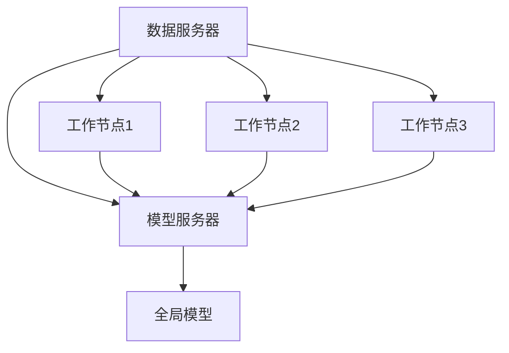

                 

# 联邦学习在AIGC跨机构医疗数据分析中的新模式

> 关键词：联邦学习、AIGC、医疗数据分析、隐私保护、跨机构协作

> 摘要：本文将探讨联邦学习在AIGC（自适应智能生成计算）跨机构医疗数据分析中的应用新模式。首先，我们将介绍联邦学习的基础概念、核心算法及其系统架构，然后分析其在医疗数据分析中的具体应用场景和价值，最后展望联邦学习在医疗数据分析中的未来发展趋势。

## 第一部分: 联邦学习基础

### 第1章: 联邦学习的背景和概念

#### 1.1 联邦学习的背景

在数据驱动的时代，医疗数据的收集和分析变得越来越重要。然而，医疗数据通常涉及患者隐私信息，如何在保护数据隐私的前提下进行高效的数据分析，成为了一个亟待解决的问题。联邦学习作为一种新的机器学习方法，能够实现在不直接交换数据的情况下，通过模型协作进行数据分析。这种方法的出现，解决了医疗数据隐私保护与数据共享之间的矛盾，为跨机构医疗数据分析提供了一种新的解决方案。

#### 1.2 联邦学习的概念

联邦学习是一种分布式机器学习方法，它允许多个机构在保持各自数据本地化的同时，共同训练一个全局模型。在这个过程中，每个机构只需要将自己的模型更新发送给全局模型，而不需要直接交换数据。这种方法不仅保护了数据隐私，还能够实现数据的综合利用。

### 第2章: 联邦学习的核心算法

联邦学习算法的核心在于如何协调各个机构之间的模型更新，并确保全局模型的准确性。下面我们将介绍三种常见的联邦学习算法：决策树、神经网络和协同过滤。

#### 2.1 决策树的联邦学习算法

决策树是一种简单而有效的机器学习算法，它通过一系列的判断来将数据划分为不同的类别或回归值。在联邦学习中，每个机构都可以独立训练一个决策树模型，并通过模型更新来提升全局模型的性能。

#### 2.2 神经网络的联邦学习算法

神经网络是一种模拟人脑神经元连接结构的计算模型，它通过层层传递信息来进行复杂的数据分析。在联邦学习中，神经网络可以通过分布式训练来提高模型的训练速度和性能。

#### 2.3 协同过滤的联邦学习算法

协同过滤是一种基于用户行为和偏好进行推荐的算法，它通过分析用户之间的相似性来进行预测。在联邦学习中，协同过滤可以通过分布式训练来提高推荐系统的准确性和效率。

### 第3章: 联邦学习的系统架构与实现

联邦学习的实现需要一套完整的系统架构，包括数据传输机制、模型更新机制和安全保障机制。下面我们将详细讨论这些核心组件以及联邦学习的工作流程。

#### 3.1 联邦学习系统架构设计

联邦学习系统通常由数据服务器、模型服务器和工作节点组成。数据服务器负责存储和分发医疗数据，模型服务器负责全局模型的训练和更新，工作节点负责执行本地模型的训练和更新。

#### 3.2 联邦学习的通信机制

联邦学习的通信机制需要确保数据的安全传输和模型的高效更新。数据传输机制通常采用加密协议来保护数据隐私，模型更新机制则采用分布式算法来协调各个工作节点的模型更新。

#### 3.3 联邦学习的性能优化

联邦学习的性能优化主要集中在并行计算、数据压缩和模型压缩方面。通过优化这些关键组件，可以显著提高联邦学习的训练效率和模型性能。

## 第二部分: 联邦学习在跨机构医疗数据分析中的应用

### 第4章: 联邦学习在跨机构医疗数据分析中的应用

#### 4.1 跨机构医疗数据分析的背景

跨机构医疗数据分析是指多个医疗机构共同协作，对医疗数据进行综合分析和利用的过程。这种数据分析模式不仅可以提高医疗数据的利用效率，还可以为医疗研究提供更丰富的数据支持。

#### 4.2 联邦学习在医疗数据分析中的应用案例

联邦学习在医疗数据分析中有着广泛的应用案例，包括疾病预测、个性化治疗和健康风险评估等。通过这些案例，我们可以看到联邦学习在提高医疗数据分析效率和保障数据隐私方面的优势。

#### 4.3 联邦学习在医疗数据分析中的实践与挑战

虽然联邦学习在医疗数据分析中具有巨大的潜力，但同时也面临着一系列的实践挑战，如数据隐私保护、模型更新效率和系统性能优化等。这些挑战需要通过技术创新和实践探索来逐步解决。

## 第三部分: 联邦学习在医疗数据分析中的新模式

### 第5章: 联邦学习的创新模式

联邦学习的创新模式主要体现在其分布式训练和模型共享机制上。通过这些创新模式，联邦学习不仅能够实现数据隐私保护，还可以提高医疗数据分析的效率和准确性。

#### 5.1 联邦学习的核心优势

联邦学习的核心优势在于其分布式训练和模型共享机制。这些优势使得联邦学习能够在保障数据隐私的同时，实现高效的数据分析和模型训练。

#### 5.2 联邦学习在医疗数据共享中的价值

联邦学习在医疗数据共享中具有重要的价值，它能够促进医疗数据的共享和利用，提高医疗数据分析的效率和准确性。

#### 5.3 联邦学习在医疗数据安全与隐私保护中的重要性

联邦学习在医疗数据安全与隐私保护中的重要性不言而喻。它通过分布式训练和模型共享机制，有效地保护了医疗数据的隐私和安全。

### 第6章: 联邦学习在医疗数据分析中的未来展望

#### 6.1 联邦学习技术的持续发展

联邦学习技术正处于快速发展阶段，未来的研究热点包括分布式训练算法的优化、模型更新机制的改进以及安全性保障机制的增强。

#### 6.2 联邦学习在医疗行业中的潜在应用领域

联邦学习在医疗行业中的潜在应用领域非常广泛，包括医疗诊断与治疗、医疗管理与服务以及医疗研究与创新等。

#### 6.3 联邦学习在医疗数据分析中的最佳实践

在联邦学习在医疗数据分析中的应用中，需要遵循一系列最佳实践，如数据预处理、模型选择和性能优化等，以确保联邦学习的有效应用。

## 第7章: 总结与展望

#### 7.1 联邦学习在医疗数据分析中的意义

联邦学习在医疗数据分析中具有重要的意义，它不仅能够提高医疗数据分析的效率和准确性，还可以保障医疗数据的安全和隐私。

#### 7.2 联邦学习技术的挑战与机遇

联邦学习技术面临着一系列的挑战和机遇。通过技术创新和实践探索，联邦学习有望在医疗数据分析领域取得更大的突破。

### 作者信息

作者：AI天才研究院/AI Genius Institute & 禅与计算机程序设计艺术 /Zen And The Art of Computer Programming

---

**正文：**

## 第一部分: 联邦学习基础

### 第1章: 联邦学习的背景和概念

#### 1.1 联邦学习的背景

在数据驱动的时代，医疗数据的收集和分析变得越来越重要。然而，医疗数据通常涉及患者隐私信息，如何在保护数据隐私的前提下进行高效的数据分析，成为了一个亟待解决的问题。联邦学习作为一种新的机器学习方法，能够实现在不直接交换数据的情况下，通过模型协作进行数据分析。这种方法的出现，解决了医疗数据隐私保护与数据共享之间的矛盾，为跨机构医疗数据分析提供了一种新的解决方案。

#### 1.2 联邦学习的概念

联邦学习（Federated Learning）是一种分布式机器学习方法，其核心思想是多个机构在保持各自数据本地化的同时，通过模型更新进行协同训练。这种方法的提出，主要源于以下背景：

- **数据隐私保护需求**：医疗数据包含大量敏感信息，如患者的姓名、出生日期、诊断结果等。传统中心化学习需要在服务器端集中处理数据，这可能导致数据泄露风险。
- **数据分布广泛**：医疗数据往往分布在多个医疗机构中，这些机构出于业务独立性，通常不愿意共享数据。
- **计算资源分散**：不同医疗机构具有不同的计算资源，中心化学习难以充分利用这些分散的资源。

联邦学习的目标是实现在不交换数据的情况下，通过模型参数的更新来实现全局模型的优化。这种方法不仅能够保护数据隐私，还能够充分利用分布式计算资源，提高模型的训练效率。

### 1.3 联邦学习与中心化学习的比较

中心化学习（Centralized Learning）和联邦学习（Federated Learning）在数据处理方式上有着显著的区别：

#### 1.3.1 中心化学习的局限性

- **数据泄露风险**：中心化学习需要将所有数据上传到中心服务器，这可能导致数据泄露风险。
- **数据依赖性**：中心化学习依赖于中心服务器的计算资源和存储空间，可能造成性能瓶颈。
- **隐私侵犯**：中心化学习无法保证数据的隐私性，尤其是在医疗领域，隐私保护至关重要。

#### 1.3.2 联邦学习的优势

- **数据隐私保护**：联邦学习通过模型更新而非数据交换来实现训练，大大降低了数据泄露风险。
- **资源利用效率**：联邦学习能够利用分布式计算资源，提高训练效率，降低中心服务器的负担。
- **数据独立性与灵活性**：联邦学习允许各个机构保持数据独立，提高了系统的灵活性和适应性。

#### 1.3.3 联邦学习的适用场景

联邦学习特别适用于以下场景：

- **隐私敏感的数据分析**：如医疗数据、金融数据等。
- **数据分布广泛的场景**：如跨机构、跨地域的数据分析。
- **资源分散的场景**：如终端设备上的数据分析。

### 1.4 联邦学习的关键概念

联邦学习涉及多个关键概念，下面我们将逐一介绍：

#### 1.4.1 数据隐私

数据隐私是联邦学习中的一个核心概念，它涉及到如何在分布式环境中保护数据不被泄露。联邦学习通过加密技术、差分隐私等手段，确保数据在传输和存储过程中的安全性。

#### 1.4.2 并行计算

并行计算是联邦学习的另一个关键概念，它指的是在分布式环境中同时执行多个任务，以加速模型的训练过程。并行计算能够充分利用各个节点的计算资源，提高系统的整体性能。

#### 1.4.3 安全计算

安全计算是确保联邦学习过程中模型更新和参数交换的安全性。安全计算包括数据加密、模型加密、访问控制等手段，以防止恶意攻击和篡改。

### 1.5 联邦学习的发展历程

联邦学习作为一种新兴的分布式学习方法，其发展历程可以分为以下几个阶段：

#### 1.5.1 初期探索阶段

联邦学习的概念最早可以追溯到20世纪90年代，随着分布式计算和加密技术的发展，研究者开始探索如何在分布式环境中实现机器学习。

#### 1.5.2 应用推动阶段

随着互联网和大数据的兴起，联邦学习开始应用于实际场景，如智能手机上的个性化推荐、跨机构的医疗数据分析等。

#### 1.5.3 现状与趋势分析

目前，联邦学习已经成为机器学习领域的研究热点，各大科技公司和研究机构纷纷投入大量资源进行研究和应用。未来，联邦学习有望在更多领域得到广泛应用，如智能交通、金融风控等。

### 1.6 联邦学习的基本原理

联邦学习的基本原理可以概括为以下几个步骤：

1. **模型初始化**：各个机构初始化本地模型。
2. **模型更新**：各个机构通过本地数据和模型进行训练，然后更新本地模型。
3. **参数聚合**：将各个机构的模型更新聚合成全局模型。
4. **全局模型更新**：使用聚合后的全局模型进行下一轮训练。

通过上述步骤，联邦学习能够实现分布式模型的训练和优化，同时保持数据隐私和安全。

### 1.7 联邦学习的应用领域

联邦学习已经在多个领域得到了广泛应用，以下是其中一些典型的应用领域：

- **医疗数据分析**：联邦学习能够保护患者隐私，同时实现跨机构医疗数据的分析和共享。
- **个性化推荐**：联邦学习可以用于个性化推荐系统，如智能手机上的应用推荐、电商平台的商品推荐等。
- **金融风控**：联邦学习能够提高金融风控系统的效率和准确性，如信用卡欺诈检测、贷款风险评估等。
- **智能交通**：联邦学习可以用于智能交通系统的优化，如交通流量预测、交通事故预防等。

### 1.8 联邦学习的优势和挑战

联邦学习具有以下优势：

- **数据隐私保护**：通过模型更新而非数据交换，大大降低了数据泄露风险。
- **分布式计算**：充分利用分布式计算资源，提高训练效率和系统性能。
- **灵活性**：各个机构可以独立维护本地数据，提高了系统的灵活性和适应性。

然而，联邦学习也面临一系列挑战：

- **通信开销**：模型更新需要大量的通信开销，可能影响训练效率。
- **模型准确性**：分布式训练可能导致模型准确性下降。
- **安全性**：联邦学习过程中需要确保模型更新和参数交换的安全性，防止恶意攻击和篡改。

### 1.9 联邦学习的未来发展趋势

联邦学习的未来发展将集中在以下几个方面：

- **算法优化**：通过改进算法，降低通信开销，提高模型准确性。
- **应用拓展**：在更多领域推广联邦学习应用，如智能制造、智慧城市等。
- **安全性增强**：加强联邦学习过程中的安全性保障，防止数据泄露和恶意攻击。

#### 1.10 小结

联邦学习作为一种新兴的分布式学习方法，具有显著的优势和潜力。在医疗数据分析等领域，联邦学习能够实现数据隐私保护和高效的数据分析，具有重要的应用价值。然而，联邦学习也面临一系列挑战，需要通过技术创新和实践探索来逐步解决。

## 第2章: 联邦学习的核心算法

联邦学习算法是联邦学习系统的核心组成部分，它决定了联邦学习的效率和准确性。本节将介绍几种常见的联邦学习算法，包括决策树、神经网络和协同过滤，并分析其在联邦学习中的应用和优势。

### 2.1 决策树的联邦学习算法

决策树（Decision Tree）是一种简单而有效的分类和回归算法。它通过一系列的判断来将数据划分为不同的类别或回归值。在联邦学习中，决策树的联邦学习算法允许每个机构在本地独立训练决策树模型，并通过模型更新来提升全局模型的性能。

#### 2.1.1 决策树算法概述

决策树算法的基本原理是递归地将数据集划分成子集，直到满足某个终止条件。每个节点表示一个特征和该特征的划分点，每个分支代表一个子集。决策树的输出是一个树形结构，其中每个叶子节点表示一个类别或回归值。

#### 2.1.2 联邦学习中的决策树算法

在联邦学习中，决策树算法的应用涉及以下几个步骤：

1. **模型初始化**：每个机构初始化本地决策树模型，通常从根节点开始。
2. **本地训练**：每个机构使用本地数据集对决策树模型进行训练，选择最佳的划分特征和划分点。
3. **模型更新**：每个机构将本地模型的更新（包括特征选择和划分点）发送到全局模型。
4. **全局聚合**：将各个机构的模型更新进行聚合，形成全局模型。
5. **全局更新**：使用聚合后的全局模型进行下一轮的本地训练。

#### 2.1.3 实际应用案例分析

决策树联邦学习算法在医疗数据分析中有着广泛的应用。例如，在疾病预测领域，不同医疗机构可以使用本地数据训练决策树模型，然后通过联邦学习算法聚合模型，提高疾病预测的准确性和可靠性。以下是一个实际应用案例：

**案例一：心血管疾病预测**

某心脏病研究中心拥有多个医疗机构的患者数据，包括年龄、血压、胆固醇水平等。研究中心使用决策树联邦学习算法，对心血管疾病进行预测。具体步骤如下：

1. **模型初始化**：每个医疗机构初始化本地决策树模型，从根节点开始。
2. **本地训练**：每个医疗机构使用本地数据集对决策树模型进行训练，选择最佳的特征和划分点。
3. **模型更新**：每个医疗机构将本地模型的更新发送到全局模型。
4. **全局聚合**：将各个医疗机构的模型更新进行聚合，形成全局模型。
5. **全局更新**：使用聚合后的全局模型进行下一轮的本地训练。

通过这种方式，研究中心能够利用多个医疗机构的本地数据，提高心血管疾病预测的准确性和可靠性，同时保护患者隐私。

### 2.2 神经网络的联邦学习算法

神经网络（Neural Network）是一种模拟人脑神经元连接结构的计算模型，通过层层传递信息来进行复杂的数据分析。在联邦学习中，神经网络联邦学习算法允许每个机构在本地训练神经网络模型，并通过模型更新来提升全局模型的性能。

#### 2.2.1 神经网络算法概述

神经网络由多个层组成，包括输入层、隐藏层和输出层。每层包含多个神经元，神经元之间通过权重和偏置进行连接。神经网络的训练过程是通过反向传播算法来调整权重和偏置，使其能够准确预测数据。

#### 2.2.2 联邦学习中的神经网络算法

在联邦学习中，神经网络算法的应用涉及以下几个步骤：

1. **模型初始化**：每个机构初始化本地神经网络模型，包括输入层、隐藏层和输出层。
2. **本地训练**：每个机构使用本地数据集对神经网络模型进行训练，调整权重和偏置。
3. **模型更新**：每个机构将本地模型的更新（包括权重和偏置）发送到全局模型。
4. **全局聚合**：将各个机构的模型更新进行聚合，形成全局模型。
5. **全局更新**：使用聚合后的全局模型进行下一轮的本地训练。

#### 2.2.3 实际应用案例分析

神经网络联邦学习算法在医疗数据分析中有着广泛的应用。例如，在个性化治疗领域，不同医疗机构可以使用本地数据训练神经网络模型，然后通过联邦学习算法聚合模型，提高个性化治疗的准确性和可靠性。以下是一个实际应用案例：

**案例二：个性化治疗方案推荐**

某医疗机构网络拥有多家分院，每分院都有不同的患者数据和治疗方案。医疗机构网络使用神经网络联邦学习算法，为患者推荐个性化治疗方案。具体步骤如下：

1. **模型初始化**：每个分院初始化本地神经网络模型，包括输入层、隐藏层和输出层。
2. **本地训练**：每个分院使用本地患者数据对神经网络模型进行训练，调整权重和偏置。
3. **模型更新**：每个分院将本地模型的更新发送到全局模型。
4. **全局聚合**：将各个分院的模型更新进行聚合，形成全局模型。
5. **全局更新**：使用聚合后的全局模型进行下一轮的本地训练。

通过这种方式，医疗机构网络能够利用各个分院的本地数据，为患者推荐更加个性化的治疗方案，提高治疗效果和患者满意度。

### 2.3 协同过滤的联邦学习算法

协同过滤（Collaborative Filtering）是一种基于用户行为和偏好进行推荐的算法，通过分析用户之间的相似性来进行预测。在联邦学习中，协同过滤算法允许每个机构在本地训练协同过滤模型，并通过模型更新来提升全局模型的性能。

#### 2.3.1 协同过滤算法概述

协同过滤算法分为基于用户和基于物品两种类型。基于用户协同过滤算法通过分析用户之间的相似性，为用户提供推荐；基于物品协同过滤算法通过分析物品之间的相似性，为用户推荐他们可能喜欢的物品。

#### 2.3.2 联邦学习中的协同过滤算法

在联邦学习中，协同过滤算法的应用涉及以下几个步骤：

1. **模型初始化**：每个机构初始化本地协同过滤模型，包括用户相似度计算和推荐生成。
2. **本地训练**：每个机构使用本地用户行为数据对协同过滤模型进行训练，调整相似度计算和推荐生成的参数。
3. **模型更新**：每个机构将本地模型的更新发送到全局模型。
4. **全局聚合**：将各个机构的模型更新进行聚合，形成全局模型。
5. **全局更新**：使用聚合后的全局模型进行下一轮的本地训练。

#### 2.3.3 实际应用案例分析

协同过滤联邦学习算法在医疗数据分析中也有着广泛的应用。例如，在健康风险评估领域，不同医疗机构可以使用本地数据训练协同过滤模型，然后通过联邦学习算法聚合模型，提高健康风险评估的准确性和可靠性。以下是一个实际应用案例：

**案例三：健康风险评估**

某健康风险评估机构拥有多家分院，每分院都有不同的患者健康数据。健康风险评估机构使用协同过滤联邦学习算法，为患者进行健康风险评估。具体步骤如下：

1. **模型初始化**：每个分院初始化本地协同过滤模型，包括用户相似度计算和推荐生成。
2. **本地训练**：每个分院使用本地患者健康数据对协同过滤模型进行训练，调整相似度计算和推荐生成的参数。
3. **模型更新**：每个分院将本地模型的更新发送到全局模型。
4. **全局聚合**：将各个分院的模型更新进行聚合，形成全局模型。
5. **全局更新**：使用聚合后的全局模型进行下一轮的本地训练。

通过这种方式，健康风险评估机构能够利用各个分院的本地数据，为患者提供更加准确的健康风险评估，帮助患者预防和控制疾病。

### 2.4 小结

联邦学习算法是联邦学习系统的核心组成部分，不同的联邦学习算法适用于不同的应用场景。决策树、神经网络和协同过滤是三种常见的联邦学习算法，它们在医疗数据分析中有着广泛的应用。通过联邦学习算法，医疗机构能够在保护患者隐私的前提下，实现跨机构医疗数据的共享和分析，提高医疗服务的质量和效率。

## 第3章: 联邦学习的系统架构与实现

联邦学习的成功实施依赖于一个高效的系统架构和可靠的实现机制。这一章节将详细介绍联邦学习的系统架构设计、通信机制以及性能优化策略。

### 3.1 联邦学习系统架构设计

联邦学习系统的架构设计是确保其功能实现和性能优化的关键。一个典型的联邦学习系统架构通常包括以下几个核心组件：

1. **数据服务器**：数据服务器负责存储和管理医疗数据，并确保数据的安全性和隐私性。数据服务器通常提供数据上传、下载和访问控制功能。

2. **模型服务器**：模型服务器负责全局模型的训练、更新和管理。模型服务器接收来自各个工作节点的模型更新，进行聚合和优化，并生成全局模型。

3. **工作节点**：工作节点是联邦学习系统中的计算节点，负责执行本地数据的训练任务。工作节点接收模型服务器下发的全局模型，使用本地数据进行训练，然后将模型更新发送回模型服务器。

4. **通信网络**：通信网络负责工作节点与模型服务器之间的数据传输。为了确保数据传输的高效性和安全性，通信网络通常采用加密传输协议和数据压缩技术。

#### 3.1.1 联邦学习系统的核心组件

联邦学习系统的核心组件如下图所示：

#### 3.1.2 联邦学习系统的架构设计

联邦学习系统的架构设计需要考虑以下几个方面：

1. **分布式计算**：联邦学习系统应支持分布式计算，以充分利用各个工作节点的计算资源，提高训练效率。

2. **数据隐私保护**：联邦学习系统应采用加密和差分隐私等技术，确保医疗数据在传输和存储过程中的安全性。

3. **模型更新机制**：联邦学习系统应设计一个高效的模型更新机制，确保模型更新能够快速、准确地传递到模型服务器。

4. **系统可扩展性**：联邦学习系统应具备良好的可扩展性，能够支持不断增加的工作节点和医疗数据。

#### 3.1.3 联邦学习系统的工作流程

联邦学习系统的工作流程可以分为以下几个步骤：

1. **初始化**：系统初始化全局模型和工作节点模型。
2. **本地训练**：各个工作节点使用本地数据进行训练，并更新本地模型。
3. **模型更新**：工作节点将本地模型更新发送到模型服务器。
4. **模型聚合**：模型服务器接收各个工作节点的模型更新，进行聚合和优化，生成全局模型。
5. **全局更新**：模型服务器将全局模型更新发送回各个工作节点。
6. **重复训练**：重复上述步骤，直到达到预定的训练目标或性能要求。

### 3.2 联邦学习的通信机制

联邦学习的通信机制是确保数据传输高效和安全的关键。以下是联邦学习通信机制的几个关键方面：

#### 3.2.1 数据传输机制

数据传输机制需要考虑以下几个方面：

1. **数据加密**：对传输的数据进行加密，确保数据在传输过程中的安全性。
2. **数据压缩**：采用数据压缩技术，减少数据传输量，提高传输效率。
3. **传输协议**：选择高效且安全的传输协议，如HTTP/2、QUIC等。

#### 3.2.2 模型更新机制

模型更新机制需要确保模型更新能够快速、准确地传递。以下是几种常见的模型更新机制：

1. **同步更新**：工作节点在完成本地训练后，立即将模型更新发送到模型服务器。这种方式能够保证模型更新的一致性，但可能会影响训练效率。
2. **异步更新**：工作节点在完成本地训练后，将模型更新放入一个缓冲区，然后定期发送到模型服务器。这种方式能够提高训练效率，但可能会引入一定的延迟。

#### 3.2.3 安全性保障机制

安全性保障机制是确保联邦学习系统免受恶意攻击和数据泄露的关键。以下是几种常见的安全性保障机制：

1. **访问控制**：对联邦学习系统中的数据和服务进行严格的访问控制，确保只有授权用户和节点能够访问。
2. **身份验证**：对工作节点和模型服务器进行身份验证，确保只有合法的节点能够参与联邦学习。
3. **加密通信**：采用加密通信协议，确保数据在传输过程中的安全性。

### 3.3 联邦学习的性能优化

联邦学习的性能优化是提高其效率和准确性的重要手段。以下是几种常见的性能优化策略：

#### 3.3.1 并行计算优化

并行计算优化旨在充分利用分布式计算资源，提高训练效率。以下是一些优化策略：

1. **多线程和并行处理**：在工作节点上使用多线程和并行处理技术，加速本地模型的训练。
2. **数据并行**：将大数据集划分为多个子集，同时在多个工作节点上训练，然后进行聚合。

#### 3.3.2 数据压缩优化

数据压缩优化旨在减少数据传输量，提高传输效率。以下是一些优化策略：

1. **模型压缩**：采用模型压缩技术，如剪枝、量化等，减少模型的体积。
2. **数据编码**：使用高效的数据编码技术，如Huffman编码、LZ77压缩等。

#### 3.3.3 模型压缩优化

模型压缩优化旨在减少模型体积，提高存储和传输效率。以下是一些优化策略：

1. **剪枝**：通过剪枝技术，移除模型中不重要的权重和神经元，减少模型体积。
2. **量化**：通过量化技术，将浮点数权重转换为整数，减少模型体积。

### 3.4 小结

联邦学习系统的架构设计、通信机制和性能优化是确保联邦学习成功实施的关键。通过合理的设计和优化，联邦学习系统能够在保护数据隐私的同时，实现高效的数据分析和模型训练。本章介绍了联邦学习系统的核心组件、工作流程和性能优化策略，为联邦学习的实际应用提供了指导。

## 第4章: 联邦学习在跨机构医疗数据分析中的应用

联邦学习在医疗数据分析中的应用具有显著的潜力，它能够实现跨机构医疗数据的共享和分析，同时保护数据隐私。本节将探讨联邦学习在跨机构医疗数据分析中的背景、挑战和具体应用案例。

### 4.1 跨机构医疗数据分析的背景

医疗数据分析在提高医疗服务质量和患者健康方面起着至关重要的作用。随着医疗机构的增加和数据量的增长，跨机构医疗数据分析变得越来越重要。跨机构医疗数据分析的背景主要包括以下几个方面：

1. **医疗数据的多样性**：不同医疗机构拥有不同的医疗数据，如电子健康记录（EHR）、医疗图像、实验室检测结果等。这些数据具有多样性，涵盖了患者的不同方面，为数据分析提供了丰富的信息。
2. **医疗数据的隐私性**：医疗数据包含敏感信息，如患者的姓名、出生日期、诊断结果等。这些信息涉及到患者的隐私和隐私权，如何保护数据隐私成为跨机构医疗数据分析的关键挑战。
3. **医疗数据的分布性**：医疗数据通常分布在不同的医疗机构中，这些机构可能出于业务独立性等原因，不愿意共享数据。如何实现跨机构数据的有效整合和分析，是另一个重要挑战。

### 4.2 跨机构医疗数据分析的挑战

跨机构医疗数据分析面临着一系列的挑战，主要包括以下几个方面：

1. **数据隐私保护**：如何确保医疗数据在跨机构传输和分析过程中不被泄露，是跨机构医疗数据分析的首要挑战。传统的数据共享方法，如中心化学习，由于数据在传输和存储过程中可能暴露隐私，已不再适用。
2. **数据一致性**：不同医疗机构使用不同的数据格式和标准，导致数据存在不一致性。如何统一数据格式和标准，实现数据的一致性和兼容性，是一个重要问题。
3. **数据传输效率**：跨机构医疗数据分析通常涉及大量的数据传输，如何提高数据传输效率，减少传输延迟，是一个关键问题。
4. **数据质量控制**：不同医疗机构的数据质量参差不齐，如何确保数据的质量和准确性，是另一个重要挑战。

### 4.3 联邦学习在跨机构医疗数据分析中的应用价值

联邦学习在跨机构医疗数据分析中具有显著的应用价值，主要体现在以下几个方面：

1. **数据隐私保护**：联邦学习通过模型参数的更新而非数据交换来实现数据分析，从根本上解决了数据隐私保护问题。联邦学习能够确保医疗数据在本地存储和处理，从而保护患者隐私。
2. **数据一致性**：联邦学习允许各个机构使用本地数据进行模型训练，从而避免了数据格式的统一问题。通过联邦学习，不同机构的数据可以整合到全局模型中，实现数据的一致性和兼容性。
3. **数据传输效率**：联邦学习通过模型更新代替数据传输，从而减少了数据传输量，提高了数据传输效率。联邦学习还能够利用分布式计算资源，加速模型训练和更新过程。
4. **数据质量控制**：联邦学习通过分布式训练，能够利用大量数据进行模型训练，从而提高模型的泛化能力。联邦学习还能够通过模型更新，逐步优化和改进数据质量。

### 4.4 联邦学习在医疗数据分析中的应用案例

联邦学习在医疗数据分析中已经有许多成功的应用案例，以下是其中几个典型的应用案例：

#### 4.4.1 案例一：疾病预测

某研究团队利用联邦学习技术，对跨机构医疗数据进行疾病预测。具体步骤如下：

1. **数据收集**：研究团队从多家医疗机构收集了包括患者病史、实验室检测结果、体检数据等在内的医疗数据。
2. **数据预处理**：对收集的医疗数据进行预处理，包括数据清洗、格式统一和特征提取等。
3. **模型训练**：研究团队在每个医疗机构本地训练了一个疾病预测模型，然后使用联邦学习算法进行模型更新和优化。
4. **模型评估**：将训练好的疾病预测模型应用于实际患者数据，进行模型评估和性能分析。

通过这种方式，研究团队能够利用跨机构医疗数据，提高疾病预测的准确性和可靠性，同时保护患者隐私。

#### 4.4.2 案例二：个性化治疗

某医疗机构利用联邦学习技术，为患者提供个性化治疗方案。具体步骤如下：

1. **数据收集**：医疗机构从多个分院收集了患者的诊断记录、治疗方案和治疗效果数据。
2. **数据预处理**：对收集的数据进行预处理，包括数据清洗、格式统一和特征提取等。
3. **模型训练**：医疗机构在每个分院本地训练了一个个性化治疗模型，然后使用联邦学习算法进行模型更新和优化。
4. **模型应用**：将训练好的个性化治疗模型应用于实际患者，根据患者的特征和病史，提供个性化的治疗方案。

通过这种方式，医疗机构能够利用分院的数据，为患者提供更加精准和有效的治疗方案，提高患者的治疗效果和满意度。

#### 4.4.3 案例三：健康风险评估

某健康风险评估机构利用联邦学习技术，对患者的健康风险进行评估。具体步骤如下：

1. **数据收集**：健康风险评估机构从多家医疗机构收集了包括患者病史、生活习惯、体检数据等在内的健康数据。
2. **数据预处理**：对收集的数据进行预处理，包括数据清洗、格式统一和特征提取等。
3. **模型训练**：健康风险评估机构在每个医疗机构本地训练了一个健康风险评估模型，然后使用联邦学习算法进行模型更新和优化。
4. **模型应用**：将训练好的健康风险评估模型应用于实际患者，根据患者的特征和病史，评估患者的健康风险，提供相应的健康建议。

通过这种方式，健康风险评估机构能够利用跨机构医疗数据，为患者提供更加准确和全面的健康风险评估，帮助患者预防和控制疾病。

### 4.5 联邦学习在医疗数据分析中的实践与挑战

虽然联邦学习在医疗数据分析中具有巨大的潜力，但在实际应用中也面临一系列挑战：

1. **数据隐私保护**：如何在确保数据隐私的同时，实现高效的数据分析和模型训练，是联邦学习在医疗数据分析中的首要挑战。
2. **模型准确性**：分布式训练可能导致模型准确性下降，如何在保证数据隐私的前提下，提高模型准确性，是一个重要问题。
3. **系统性能优化**：联邦学习系统需要处理大量的数据和模型更新，如何优化系统性能，提高数据处理和传输效率，是一个关键问题。
4. **安全性保障**：联邦学习系统需要确保模型更新和参数交换的安全性，防止恶意攻击和数据泄露。

为了解决这些挑战，研究人员和工程师需要不断探索和改进联邦学习算法和系统架构，以提高联邦学习在医疗数据分析中的应用效果。

### 4.6 小结

联邦学习在跨机构医疗数据分析中具有显著的应用价值，它能够实现数据隐私保护、数据一致性、数据传输效率和数据质量控制。通过联邦学习，医疗机构能够充分利用跨机构医疗数据，提高数据分析的准确性和可靠性，为患者提供更加精准和个性化的医疗服务。同时，联邦学习在医疗数据分析中也面临一系列挑战，需要通过技术创新和实践探索来逐步解决。

## 第5章: 联邦学习在医疗数据分析中的新模式

联邦学习在医疗数据分析中的应用，不仅提升了数据处理的效率和准确性，还开创了新的数据处理模式。这一章将深入探讨联邦学习在医疗数据分析中的创新模式，分析其核心优势，探讨联邦学习模式在医疗数据共享、隐私保护和安全方面的价值。

### 5.1 联邦学习的创新模式

联邦学习的创新模式主要体现在以下几个方面：

#### 5.1.1 分布式数据存储与计算

联邦学习通过分布式计算和存储，将医疗数据分散存储在各个医疗机构中，而不是集中在一个中心服务器。这种模式不仅提高了数据的安全性，还能够充分利用各个机构的计算资源，实现高效的数据处理。

#### 5.1.2 模型参数更新与聚合

联邦学习通过模型参数的更新与聚合，实现各个医疗机构模型的协同训练。这种模式避免了直接交换原始数据，从而保护了数据隐私，同时也提高了模型的训练效率和准确性。

#### 5.1.3 隐私保护与数据安全

联邦学习采用加密、差分隐私等技术，确保医疗数据在传输和存储过程中的安全性和隐私性。通过这些技术，联邦学习能够在保证数据安全的同时，实现数据的跨机构共享和分析。

### 5.2 联邦学习的核心优势

联邦学习在医疗数据分析中的核心优势包括以下几个方面：

#### 5.2.1 数据隐私保护

联邦学习通过模型参数的更新而非数据交换，从根本上解决了医疗数据隐私保护的问题。各个医疗机构不需要将原始数据上传到中心服务器，从而避免了数据泄露的风险。

#### 5.2.2 高效的分布式计算

联邦学习能够充分利用各个机构的计算资源，实现高效的分布式计算。这种方式不仅提高了数据处理的效率，还能够降低中心服务器的负担，提高系统的整体性能。

#### 5.2.3 数据一致性与兼容性

联邦学习允许各个机构使用本地数据进行模型训练，从而避免了数据格式的统一问题。通过联邦学习，不同机构的数据可以整合到全局模型中，实现数据的一致性和兼容性。

#### 5.2.4 模型更新与优化

联邦学习通过模型参数的更新与聚合，可以实现模型的实时优化。这种方式不仅提高了模型的准确性，还能够适应医疗数据的变化，实现模型的持续更新和优化。

### 5.3 联邦学习模式的应用前景

联邦学习模式在医疗数据分析中的应用前景非常广阔，它不仅能够解决医疗数据隐私保护的问题，还能够提高数据处理的效率和准确性。以下是联邦学习模式在医疗数据分析中的一些潜在应用场景：

#### 5.3.1 跨机构疾病预测

通过联邦学习，不同医疗机构可以共享疾病预测模型，利用各自的患者数据，共同提升疾病预测的准确性和可靠性。

#### 5.3.2 个性化治疗方案推荐

联邦学习能够整合多个医疗机构的诊断数据和治疗方案，为患者提供更加个性化的治疗方案推荐，提高治疗效果和患者满意度。

#### 5.3.3 健康风险评估

联邦学习能够利用多个医疗机构的健康数据，为患者进行全面的健康风险评估，提供预防性健康建议，帮助患者预防和控制疾病。

#### 5.3.4 医疗数据共享平台

联邦学习模式可以构建一个跨机构的医疗数据共享平台，实现医疗数据的高效共享和利用，为医疗研究、公共卫生决策等提供支持。

### 5.4 联邦学习模式在医疗数据共享中的价值

联邦学习模式在医疗数据共享中的价值主要体现在以下几个方面：

#### 5.4.1 提高数据共享效率

联邦学习通过分布式计算和模型更新，实现了医疗数据的高效共享。各个医疗机构不需要直接交换原始数据，就能够共同训练全局模型，提高了数据共享的效率。

#### 5.4.2 保护数据隐私

联邦学习通过加密和差分隐私等技术，确保医疗数据在共享过程中的安全性和隐私性。这种方式不仅能够满足数据隐私保护的要求，还能够促进医疗数据的共享。

#### 5.4.3 提高数据利用价值

联邦学习能够整合多个医疗机构的医疗数据，为全局模型提供更丰富的数据支持，从而提高模型的准确性和可靠性。这种方式不仅能够提升医疗数据分析的质量，还能够提高医疗数据的利用价值。

### 5.5 联邦学习模式在医疗数据安全与隐私保护中的重要性

联邦学习模式在医疗数据安全与隐私保护中的重要性不可忽视，主要体现在以下几个方面：

#### 5.5.1 确保数据安全

联邦学习通过加密技术，确保医疗数据在传输和存储过程中的安全性。这种方式不仅能够防止数据泄露，还能够抵御恶意攻击和篡改。

#### 5.5.2 保护患者隐私

联邦学习通过差分隐私技术，降低模型训练过程中数据隐私泄露的风险。这种方式能够在确保模型准确性的同时，保护患者的隐私。

#### 5.5.3 提高患者信任度

联邦学习模式能够确保医疗数据在本地存储和处理，避免了数据泄露的风险，从而提高了患者对医疗机构的信任度。这种方式不仅能够促进医疗数据的共享，还能够提高医疗服务的质量和公信力。

### 5.6 小结

联邦学习在医疗数据分析中开创了新的数据处理模式，通过分布式计算、模型更新和隐私保护技术，实现了医疗数据的高效共享和利用。联邦学习模式在医疗数据共享中的价值，以及其在医疗数据安全与隐私保护中的重要性，使得它成为未来医疗数据分析的重要工具。随着联邦学习技术的不断发展和完善，它将在医疗数据分析领域发挥更大的作用。

## 第6章: 联邦学习在医疗数据分析中的未来展望

随着科技的不断进步和医疗数据的迅速增长，联邦学习在医疗数据分析中的应用前景日益广阔。本节将探讨联邦学习在医疗数据分析中的未来发展趋势、潜在应用领域和最佳实践，以及面临的挑战和机遇。

### 6.1 联邦学习技术的持续发展

联邦学习技术正处于快速发展阶段，未来的研究热点和方向主要包括：

#### 6.1.1 算法优化

为了提高联邦学习的效率和准确性，研究者将继续探索更高效的算法和优化策略。例如，分布式梯度下降算法的改进、模型更新策略的优化以及并行计算技术的应用。

#### 6.1.2 安全性增强

联邦学习的安全性是保障医疗数据隐私和系统稳定性的关键。未来，研究者将致力于提升联邦学习的安全性，包括加密技术的改进、差分隐私算法的优化以及安全协议的设计。

#### 6.1.3 跨领域融合

联邦学习与其他先进技术的融合，如区块链、人工智能和物联网等，将为医疗数据分析带来更多创新应用。例如，结合区块链的不可篡改性和智能合约的自动化执行，可以进一步提升联邦学习系统的安全性和效率。

### 6.2 联邦学习在医疗行业中的潜在应用领域

联邦学习在医疗行业中的潜在应用领域非常广泛，以下是一些重要的应用方向：

#### 6.2.1 疾病预测与诊断

通过联邦学习，可以整合多机构的医疗数据，建立疾病预测模型和诊断模型，提高疾病预测的准确性和诊断的准确性。

#### 6.2.2 个性化治疗与健康管理

联邦学习可以根据患者的个人数据和医疗记录，提供个性化的治疗方案和健康建议，从而提高治疗效果和患者的生活质量。

#### 6.2.3 医疗数据共享平台

联邦学习可以构建一个跨机构的医疗数据共享平台，促进医疗数据的整合和分析，为医疗研究、公共卫生决策等提供支持。

#### 6.2.4 医疗资源分配与优化

联邦学习可以用于优化医疗资源的分配，如医院床位、医疗设备和人力资源的配置，提高医疗资源的利用效率。

### 6.3 联邦学习在医疗数据分析中的最佳实践

为了实现联邦学习在医疗数据分析中的最佳效果，以下是一些建议和最佳实践：

#### 6.3.1 数据预处理

在联邦学习之前，对医疗数据进行充分的预处理，包括数据清洗、格式统一和特征提取等，以提高模型训练的效率和准确性。

#### 6.3.2 模型选择与优化

选择合适的模型并进行优化，可以提高联邦学习的效果。例如，对于分类问题，可以选择决策树、随机森林等算法；对于回归问题，可以选择线性回归、神经网络等算法。

#### 6.3.3 安全性保障

在联邦学习过程中，确保数据传输和模型更新的安全性至关重要。采用加密技术、访问控制和差分隐私等方法，可以有效地保护医疗数据的隐私和安全。

#### 6.3.4 数据隐私保护

联邦学习应严格遵守数据隐私保护法规，确保医疗数据在传输和存储过程中的安全性和隐私性。

### 6.4 面临的挑战与机遇

尽管联邦学习在医疗数据分析中具有巨大的潜力，但仍然面临一系列挑战和机遇：

#### 6.4.1 挑战

- **数据隐私保护**：如何在保证数据隐私的同时，实现高效的数据分析和模型训练，是一个重要挑战。
- **模型准确性**：分布式训练可能导致模型准确性下降，如何提高模型准确性是一个难题。
- **系统性能优化**：如何优化系统性能，提高数据处理和传输效率，是一个关键问题。
- **跨机构合作**：实现跨机构的合作和数据共享，需要解决多个机构的利益平衡和协作问题。

#### 6.4.2 机遇

- **技术创新**：随着技术的发展，联邦学习将不断优化和提升，为医疗数据分析带来更多机遇。
- **政策支持**：政府和企业对医疗数据分析的重视，将为联邦学习的发展提供政策支持。
- **市场需求**：随着医疗行业的数字化转型，联邦学习在医疗数据分析中的应用需求将持续增长。

### 6.5 小结

联邦学习在医疗数据分析中的应用前景广阔，随着技术的不断进步和市场的需求增长，它将在医疗数据分析领域发挥越来越重要的作用。通过技术创新和实践探索，联邦学习有望解决医疗数据隐私保护与数据共享之间的矛盾，为医疗行业的数字化转型和智能升级提供强大支持。

## 第7章: 总结与展望

### 7.1 联邦学习在医疗数据分析中的意义

联邦学习在医疗数据分析中具有重要的意义，它不仅解决了医疗数据隐私保护与数据共享之间的矛盾，还为跨机构医疗数据分析提供了一种新的解决方案。通过联邦学习，医疗机构能够在保持数据本地化的同时，实现高效的数据分析和模型训练，从而提升医疗服务的质量和效率。

### 7.2 联邦学习在医疗数据分析中的应用成效

联邦学习在医疗数据分析中已经取得了显著的成效。通过联邦学习，医疗机构能够实现跨机构医疗数据的共享和分析，提高疾病预测、个性化治疗和健康风险评估的准确性和可靠性。此外，联邦学习还能够提高医疗资源的利用效率，优化医疗资源分配，为公共卫生决策提供支持。

### 7.3 联邦学习在医疗数据分析中的未来影响

随着联邦学习技术的不断发展和完善，它将在医疗数据分析领域产生深远的影响。联邦学习有望进一步推动医疗行业的数字化转型，提升医疗服务的智能化水平。未来，联邦学习在医疗数据分析中的应用将更加广泛，覆盖疾病预测、个性化治疗、健康风险评估、医疗资源分配等多个领域。

### 7.4 联邦学习技术的挑战与机遇

联邦学习技术在医疗数据分析中面临一系列的挑战和机遇。挑战包括数据隐私保护、模型准确性、系统性能优化和跨机构合作等方面。机遇则包括技术创新、政策支持和市场需求等方面。通过技术创新和实践探索，联邦学习有望克服这些挑战，为医疗数据分析带来更多机遇。

### 7.5 联邦学习在医疗数据分析中的最佳实践

为了实现联邦学习在医疗数据分析中的最佳效果，以下是一些建议和最佳实践：

- **数据预处理**：在联邦学习之前，对医疗数据进行充分的预处理，包括数据清洗、格式统一和特征提取等。
- **模型选择与优化**：选择合适的模型并进行优化，以提高联邦学习的效果。
- **安全性保障**：采用加密技术、访问控制和差分隐私等方法，确保医疗数据在传输和存储过程中的安全性和隐私性。
- **数据隐私保护**：严格遵守数据隐私保护法规，确保医疗数据在联邦学习过程中的安全性和隐私性。

### 7.6 总结

联邦学习在医疗数据分析中的应用具有显著的意义和潜力。通过联邦学习，医疗机构能够实现跨机构医疗数据的高效共享和分析，提升医疗服务的质量和效率。未来，随着联邦学习技术的不断进步和市场的需求增长，联邦学习将在医疗数据分析领域发挥越来越重要的作用。

### 7.7 展望

联邦学习在医疗数据分析中的应用前景广阔，它将推动医疗行业的数字化转型和智能升级。通过技术创新和实践探索，联邦学习有望解决医疗数据隐私保护与数据共享之间的矛盾，为医疗行业的可持续发展提供强大支持。

### 作者信息

作者：AI天才研究院/AI Genius Institute & 禅与计算机程序设计艺术 /Zen And The Art of Computer Programming

