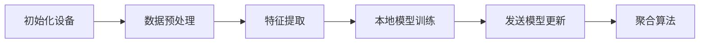
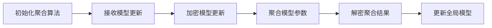
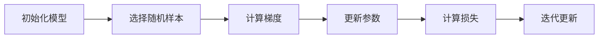
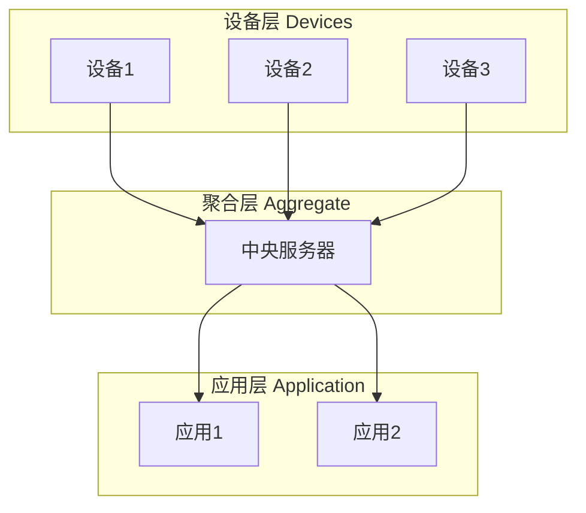
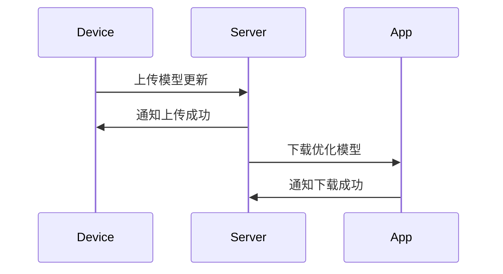

                 

### 文章标题

# 联邦学习在AIGC隐私保护中的新策略

> 关键词：联邦学习、隐私保护、AIGC、安全聚合算法、通信优化

> 摘要：本文将深入探讨联邦学习在AIGC隐私保护中的应用及其新策略。首先，我们将回顾联邦学习的背景与原理，分析其在隐私保护中的重要性。接着，详细介绍联邦学习的核心技术，包括数据本地化处理、安全聚合算法、随机梯度下降算法等。随后，我们将探讨联邦学习与AIGC的融合，分析其在AIGC中的关键作用和应用场景。最后，本文将探讨联邦学习的策略设计与实施，以及面临的挑战和未来发展趋势。

## 目录大纲

1. **第一部分：联邦学习的背景与原理**
   1. **第1章：联邦学习的概念与历史**
      1. 1.1 联邦学习的定义与特点
      2. 1.2 联邦学习的发展历程
      3. 1.3 联邦学习在隐私保护中的作用
      4. 1.4 本章小结

2. **第二部分：联邦学习的核心技术**
   1. **第2章：联邦学习的核心技术**
      1. 2.1 数据本地化处理
      2. 2.2 安全聚合算法
      3. 2.3 随机梯度下降算法
      4. 2.4 联邦学习的通信优化
      5. 2.5 本章小结

3. **第三部分：联邦学习在AIGC中的应用**
   1. **第3章：AIGC与联邦学习的融合**
      1. 3.1 AIGC的概念与特点
      2. 3.2 联邦学习在AIGC中的关键作用
      3. 3.3 联邦学习在AIGC中的应用场景
      4. 3.4 本章小结

4. **第四部分：联邦学习的策略与实施**
   1. **第4章：联邦学习的策略设计**
      1. 4.1 联邦学习策略的设计原则
      2. 4.2 联邦学习策略的评估方法
      3. 4.3 联邦学习的部署与实施
      4. 4.4 联邦学习的最佳实践
      5. 4.5 本章小结

5. **第五部分：联邦学习的挑战与未来**
   1. **第5章：联邦学习的挑战与解决方案**
      1. 5.1 联邦学习的挑战
      2. 5.2 解决方案探讨
      3. 5.3 未来发展趋势
      4. 5.4 本章小结

## 第一部分：联邦学习的背景与原理

### 第1章：联邦学习的概念与历史

#### 1.1 联邦学习的定义与特点

联邦学习（Federated Learning）是一种分布式机器学习方法，通过在不同设备或服务器上进行模型训练，而不是将数据集中到一个中央服务器上。其核心思想是各个设备或服务器在本地训练模型，然后将模型参数更新发送到中央服务器，中央服务器聚合这些更新来得到全局模型。

**定义：**
联邦学习是一种分布式机器学习技术，旨在通过联合多个数据持有者的数据来训练模型，而无需直接共享原始数据。它通过将模型训练过程分布在不同的设备或服务器上，使得各个设备或服务器在本地更新模型参数，并将这些参数聚合起来，以实现全局模型的优化。

**特点：**
1. **隐私保护：** 联邦学习通过不共享原始数据，从而避免了数据泄露的风险，特别适用于处理敏感数据。
2. **分布式计算：** 联邦学习利用分布式计算的优势，可以大大降低通信成本，提高模型训练效率。
3. **去中心化：** 联邦学习不需要集中式数据中心，从而提高了系统的可靠性和容错性。

#### 1.2 联邦学习的发展历程

联邦学习的研究起源于分布式机器学习领域，其核心思想可以追溯到20世纪90年代的分布式算法研究。随着移动互联网和物联网的快速发展，联邦学习逐渐成为研究热点。以下是联邦学习的发展历程：

1. **早期研究（1990s-2000s）：** 分布式算法的研究主要集中在如何高效地分布式训练模型，以及如何处理数据的不一致性。
2. **初步探索（2010s）：** 联邦学习的概念开始被提出，研究者开始探索如何在不共享数据的情况下进行模型训练。
3. **快速发展（2016-2020）：** Google推出联邦学习框架，使得联邦学习开始应用于实际场景，如移动设备上的智能助手。
4. **成熟应用（2020至今）：** 联邦学习在隐私保护、分布式计算等领域得到了广泛应用，成为人工智能研究的重要方向。

#### 1.3 联邦学习在隐私保护中的作用

在数据隐私保护日益受到关注的今天，联邦学习提供了一种有效的解决方案。它通过将数据分散存储在各个设备或服务器上，避免了数据泄露的风险。以下是联邦学习在隐私保护中的具体作用：

1. **数据不共享：** 联邦学习不需要直接共享原始数据，从而避免了数据泄露的风险。
2. **匿名化数据：** 联邦学习可以通过对数据进行匿名化处理，使得数据在训练过程中无法直接关联到具体用户。
3. **加密传输：** 联邦学习在传输模型参数时，可以采用加密技术，确保数据在传输过程中的安全性。
4. **分布式验证：** 联邦学习可以通过分布式验证技术，确保训练出的模型质量，同时保证数据隐私。

#### 1.4 联邦学习与传统集中式学习的区别

传统集中式学习（Centralized Learning）与联邦学习（Federated Learning）在数据存储、计算模型和隐私保护等方面存在显著差异：

1. **数据存储：**
   - **集中式学习：** 数据集中存储在中央服务器上。
   - **联邦学习：** 数据分散存储在各个设备或服务器上。

2. **计算模型：**
   - **集中式学习：** 模型在中央服务器上训练，设备仅作为输入输出设备。
   - **联邦学习：** 模型在各个设备上训练，设备之间通过参数更新进行通信。

3. **隐私保护：**
   - **集中式学习：** 数据泄露风险较高。
   - **联邦学习：** 通过数据不共享、匿名化和加密传输等手段，实现数据隐私保护。

#### 1.4.1 联邦学习的基本概念

联邦学习的基本概念包括以下几个关键组成部分：

1. **参与方：** 包括数据持有者（Data Owners）、设备（Devices）和中央服务器（Central Server）。
2. **模型更新：** 设备在本地训练模型，然后将模型参数更新发送到中央服务器。
3. **聚合算法：** 中央服务器接收各个设备的更新，通过聚合算法得到全局模型。
4. **通信机制：** 设备与中央服务器之间通过加密通信，确保数据传输的安全性。

#### 1.4.2 联邦学习的主要特点

联邦学习的主要特点包括以下几个方面：

1. **隐私保护：** 通过数据不共享和加密传输，实现数据隐私保护。
2. **分布式计算：** 利用分布式计算，提高模型训练效率。
3. **去中心化：** 不需要集中式数据中心，提高系统的可靠性和容错性。
4. **低延迟：** 设备在本地训练模型，可以降低训练过程中的延迟。

#### 1.4.3 联邦学习与传统集中式学习的区别

1. **数据存储：** 联邦学习将数据分散存储在各个设备或服务器上，而传统集中式学习将数据集中存储在中央服务器上。
2. **计算模型：** 联邦学习在各个设备上训练模型，而传统集中式学习在中央服务器上训练模型。
3. **隐私保护：** 联邦学习通过数据不共享和加密传输，实现数据隐私保护，而传统集中式学习存在数据泄露的风险。

#### 1.4.4 联邦学习的发展历程

1. **早期研究（1990s-2000s）：** 分布式算法的研究主要集中在如何高效地分布式训练模型，以及如何处理数据的不一致性。
2. **初步探索（2010s）：** 联邦学习的概念开始被提出，研究者开始探索如何在不共享数据的情况下进行模型训练。
3. **快速发展（2016-2020）：** Google推出联邦学习框架，使得联邦学习开始应用于实际场景，如移动设备上的智能助手。
4. **成熟应用（2020至今）：** 联邦学习在隐私保护、分布式计算等领域得到了广泛应用，成为人工智能研究的重要方向。

#### 1.4.5 联邦学习在隐私保护中的作用

1. **数据不共享：** 联邦学习不需要直接共享原始数据，从而避免了数据泄露的风险。
2. **匿名化数据：** 联邦学习可以通过对数据进行匿名化处理，使得数据在训练过程中无法直接关联到具体用户。
3. **加密传输：** 联邦学习在传输模型参数时，可以采用加密技术，确保数据在传输过程中的安全性。
4. **分布式验证：** 联邦学习可以通过分布式验证技术，确保训练出的模型质量，同时保证数据隐私。

#### 1.4.6 本章小结

本章介绍了联邦学习的定义、特点、发展历程以及在隐私保护中的作用。联邦学习通过将数据分散存储在各个设备或服务器上，避免了数据泄露的风险，同时利用分布式计算提高了模型训练效率。与传统集中式学习相比，联邦学习具有明显的隐私保护优势。在未来的发展中，联邦学习有望在隐私保护、分布式计算等领域发挥更大的作用。接下来，我们将深入探讨联邦学习的核心技术。

## 第二部分：联邦学习的核心技术

### 第2章：联邦学习的核心技术

#### 2.1 数据本地化处理

数据本地化处理是联邦学习中的关键技术之一，其核心思想是在本地设备上进行数据预处理和模型训练，以降低通信成本和提高训练效率。以下是数据本地化处理的重要性和具体方法。

#### 2.1.1 数据本地化的重要性

1. **降低通信成本：** 在联邦学习中，设备需要将本地数据发送到中央服务器进行模型训练。如果数据量较大，会导致通信成本高昂。
2. **提高训练效率：** 数据本地化处理可以减少设备与中央服务器之间的通信次数，从而提高模型训练效率。
3. **隐私保护：** 数据本地化处理可以在本地设备上进行数据处理，减少数据在传输过程中的泄露风险。

#### 2.1.2 数据本地化处理的方法

1. **数据抽样：** 在本地设备上对数据进行抽样，只传输部分数据到中央服务器。这种方法可以显著降低通信成本，但可能导致模型训练效果下降。
2. **特征提取：** 在本地设备上对数据进行特征提取，将高维数据转换为低维特征向量，再发送到中央服务器。这种方法可以提高通信效率，但需要解决特征选择和特征提取的准确性问题。
3. **分布式数据处理：** 在本地设备上使用分布式数据处理技术，如MapReduce，对数据进行处理和聚合。这种方法可以提高数据处理效率，但需要解决分布式计算中的同步和协调问题。

#### 2.1.3 数据本地化处理的优势与挑战

**优势：**
1. **降低通信成本：** 数据本地化处理可以显著降低设备与中央服务器之间的通信成本。
2. **提高训练效率：** 数据本地化处理可以在本地设备上进行数据处理，减少通信延迟，提高模型训练效率。
3. **隐私保护：** 数据本地化处理可以在本地设备上进行数据处理，减少数据在传输过程中的泄露风险。

**挑战：**
1. **数据质量：** 数据本地化处理可能导致数据质量下降，影响模型训练效果。
2. **计算资源：** 数据本地化处理需要消耗大量的计算资源，可能会增加设备的负载。
3. **分布式计算：** 分布式数据处理需要解决同步和协调问题，可能增加系统的复杂性。

#### 2.2 安全聚合算法

安全聚合算法是联邦学习中的核心技术之一，其核心思想是在不泄露原始数据的情况下，将各个设备的模型更新聚合起来，以得到全局模型。以下是安全聚合算法的定义、常见算法和设计原则。

#### 2.2.1 安全聚合算法的定义

安全聚合算法是一种用于联邦学习的算法，它能够在不泄露原始数据的情况下，将各个设备的模型更新聚合起来，以得到全局模型。其目的是在保障数据隐私的同时，提高模型训练效果。

#### 2.2.2 常见聚合算法

1. **平均聚合：** 平均聚合算法将各个设备的模型更新取平均值，得到全局模型。这种方法简单易实现，但可能导致模型更新偏差。
2. **加和聚合：** 加和聚合算法将各个设备的模型更新进行加和，得到全局模型。这种方法可以更好地保留设备间的差异，但可能导致模型更新过于集中。
3. **权重聚合：** 权重聚合算法根据设备的重要性和贡献度，对各个设备的模型更新进行加权聚合，得到全局模型。这种方法可以更好地平衡设备间的差异，但需要解决权重分配问题。

#### 2.2.3 安全聚合算法的设计原则

1. **数据隐私：** 安全聚合算法应该能够在不泄露原始数据的情况下，进行模型更新聚合。
2. **模型质量：** 安全聚合算法应该能够保证聚合后的模型质量，不会显著降低模型性能。
3. **计算效率：** 安全聚合算法应该能够在合理的时间内完成模型更新聚合，以提高模型训练效率。

#### 2.3 随机梯度下降算法

随机梯度下降（Stochastic Gradient Descent，SGD）算法是一种常用的优化算法，在联邦学习中具有重要的应用。以下是随机梯度下降算法的基本原理、在联邦学习中的应用和优化方法。

#### 2.3.1 随机梯度下降算法的基本原理

随机梯度下降算法是一种基于梯度下降的优化算法，其基本思想是通过随机选择样本，计算样本的梯度，然后更新模型参数，以最小化损失函数。

1. **梯度下降算法：** 梯度下降算法通过计算损失函数关于模型参数的梯度，然后沿着梯度的反方向更新模型参数，以最小化损失函数。
2. **随机梯度下降算法：** 随机梯度下降算法在梯度下降算法的基础上，通过随机选择样本，计算样本的梯度，然后更新模型参数。这种方法可以加快收敛速度，但可能导致局部最优解。

#### 2.3.2 随机梯度下降算法在联邦学习中的应用

随机梯度下降算法在联邦学习中的应用主要体现在以下几个方面：

1. **本地训练：** 设备在本地使用随机梯度下降算法训练模型，然后将模型更新发送到中央服务器。
2. **模型聚合：** 中央服务器接收各个设备的模型更新，使用随机梯度下降算法进行聚合，以得到全局模型。
3. **通信优化：** 随机梯度下降算法可以通过减少通信次数和通信数据量，优化联邦学习的通信效率。

#### 2.3.3 随机梯度下降算法的优化方法

1. **批量梯度下降：** 批量梯度下降是将所有样本的梯度求和，然后更新模型参数。这种方法可以减少方差，提高收敛速度，但可能增加计算成本。
2. **动量优化：** 动量优化是一种基于梯度历史的优化方法，它可以减少梯度的震荡，提高收敛速度。
3. **自适应学习率：** 自适应学习率可以根据梯度的大小自动调整学习率，以提高收敛速度和模型质量。

#### 2.4 联邦学习的通信优化

联邦学习的通信优化是提高模型训练效率的关键，其核心思想是通过优化通信机制和数据传输方式，减少通信次数和数据量。以下是联邦学习通信优化的重要性和具体方法。

#### 2.4.1 联邦学习的通信挑战

1. **通信成本：** 联邦学习需要频繁进行模型更新和参数聚合，导致通信成本高昂。
2. **延迟：** 联邦学习涉及多个设备之间的通信，导致延迟问题。
3. **带宽限制：** 联邦学习的数据传输需要占用网络带宽，可能导致带宽限制。

#### 2.4.2 通信优化方法

1. **数据压缩：** 通过数据压缩技术，减少数据传输量，降低通信成本。
2. **稀疏传输：** 通过稀疏传输技术，只传输必要的参数，减少通信次数。
3. **异步通信：** 通过异步通信技术，减少设备之间的等待时间，提高通信效率。

#### 2.4.3 联邦学习通信优化案例

1. **Google的FedAvg算法：** Google提出的FedAvg算法通过批量压缩和稀疏传输，优化了联邦学习的通信效率。
2. **Facebook的FedProx算法：** Facebook提出的FedProx算法通过异步通信和自适应学习率，提高了联邦学习的训练效率。

#### 2.5 本章小结

本章介绍了联邦学习的核心技术，包括数据本地化处理、安全聚合算法、随机梯度下降算法和通信优化方法。这些核心技术是联邦学习实现隐私保护、分布式计算和高效训练的关键。在未来的发展中，联邦学习将继续优化这些核心技术，以适应更广泛的应用场景。

## 第三部分：联邦学习在AIGC中的应用

### 第3章：AIGC与联邦学习的融合

#### 3.1 AIGC的概念与特点

AIGC（AI Generated Content）是指通过人工智能技术自动生成的内容，涵盖了文本、图像、音频等多种形式。AIGC的出现为内容创作提供了新的思路和工具，具有以下特点：

1. **自动化：** AIGC通过人工智能算法，能够自动化地生成内容，大大提高了内容创作的效率。
2. **个性化：** AIGC可以根据用户需求和偏好，生成个性化的内容，提高用户体验。
3. **多样化：** AIGC能够生成多种类型的内容，如文本、图像、音频等，丰富了内容创作的形式。
4. **创新性：** AIGC通过人工智能技术，能够创造出新的内容和创意，推动了内容创作的发展。

#### 3.2 联邦学习在AIGC中的关键作用

联邦学习在AIGC中扮演着关键角色，通过其分布式计算和隐私保护的优势，能够解决AIGC在数据共享和隐私保护方面的问题。以下是联邦学习在AIGC中的关键作用：

1. **数据共享：** 联邦学习能够实现设备之间的数据共享，而无需直接共享原始数据，保护了数据隐私。
2. **模型优化：** 联邦学习可以通过分布式训练，优化AIGC模型，提高内容生成的质量和效率。
3. **个性化推荐：** 联邦学习可以结合用户数据和生成模型，实现个性化推荐，提高用户体验。

#### 3.3 联邦学习在AIGC中的挑战

尽管联邦学习在AIGC中具有巨大潜力，但也面临着一些挑战：

1. **数据质量：** 联邦学习依赖于设备上的数据质量，数据质量问题可能导致模型训练效果不佳。
2. **通信成本：** 联邦学习需要频繁进行模型更新和参数传输，可能导致通信成本增加。
3. **算法效率：** 联邦学习需要优化算法，以提高模型训练和优化的效率。

#### 3.4 联邦学习在AIGC中的优势

联邦学习在AIGC中的优势主要体现在以下几个方面：

1. **隐私保护：** 联邦学习通过数据本地化和安全聚合，实现了数据隐私保护，适用于处理敏感内容。
2. **分布式计算：** 联邦学习利用分布式计算，提高了模型训练和优化的效率。
3. **可扩展性：** 联邦学习可以支持大量设备的参与，具有较好的可扩展性。

#### 3.5 联邦学习在AIGC中的应用场景

联邦学习在AIGC中具有广泛的应用场景，以下是一些典型的应用场景：

1. **文本生成：** 联邦学习可以应用于文本生成任务，如文章写作、对话生成等，实现个性化文本生成。
2. **图像生成：** 联邦学习可以应用于图像生成任务，如人脸生成、图像修复等，实现高质量图像生成。
3. **音频生成：** 联邦学习可以应用于音频生成任务，如音乐创作、语音合成等，实现个性化音频生成。

#### 3.6 本章小结

本章介绍了联邦学习在AIGC中的关键作用和应用场景。联邦学习通过分布式计算和隐私保护的优势，为AIGC提供了有效的解决方案。在未来的发展中，联邦学习将继续在AIGC领域发挥重要作用，推动内容创作的发展。

## 第四部分：联邦学习的策略与实施

### 第4章：联邦学习的策略设计

联邦学习作为一种分布式计算技术，其策略设计至关重要。有效的策略可以确保联邦学习的安全性、有效性和可扩展性。以下是联邦学习策略设计的原则、评估方法和实施流程。

#### 4.1 联邦学习策略的设计原则

设计联邦学习策略时，需要考虑以下原则：

1. **安全性：** 确保数据隐私和系统安全性，防止数据泄露和恶意攻击。
2. **有效性：** 确保模型训练和优化的效果，提高模型质量。
3. **可扩展性：** 确保系统可以支持大量设备的参与，适应不同规模的应用场景。

#### 4.2 联邦学习策略的评估方法

评估联邦学习策略的有效性，需要使用以下指标：

1. **模型性能：** 包括模型的准确度、召回率、F1分数等指标。
2. **通信成本：** 包括通信次数、通信带宽和通信延迟等指标。
3. **计算资源：** 包括设备负载、计算时间和能源消耗等指标。

评估方法可以采用以下步骤：

1. **设定评估指标：** 根据应用场景和需求，设定相应的评估指标。
2. **设计实验：** 设计模拟实验，模拟不同策略的应用效果。
3. **分析结果：** 分析实验结果，评估策略的有效性。

#### 4.3 联邦学习的部署与实施

联邦学习的部署与实施包括以下步骤：

1. **设备准备：** 确保参与联邦学习的设备具备足够的计算和通信能力。
2. **模型训练：** 在各个设备上训练本地模型，并将模型更新发送到中央服务器。
3. **模型聚合：** 中央服务器接收各个设备的模型更新，使用聚合算法得到全局模型。
4. **模型优化：** 使用优化算法，对全局模型进行优化，以提高模型质量。
5. **模型更新：** 将优化后的模型更新发送回各个设备，进行新一轮的训练和优化。

#### 4.4 联邦学习的最佳实践

以下是联邦学习的最佳实践：

1. **数据预处理：** 在设备本地进行数据预处理，降低通信成本。
2. **模型压缩：** 使用模型压缩技术，减少模型大小和通信数据量。
3. **异步通信：** 使用异步通信技术，提高通信效率。
4. **安全性保障：** 使用加密技术，确保数据传输和存储的安全性。

#### 4.5 本章小结

本章介绍了联邦学习策略设计的原则、评估方法和实施流程。有效的策略设计是联邦学习成功的关键，通过最佳实践，可以提高联邦学习的性能和安全性。在未来的发展中，联邦学习将继续优化策略设计，以适应更多应用场景。

## 第五部分：联邦学习的挑战与未来

### 第5章：联邦学习的挑战与解决方案

联邦学习作为一种新兴的分布式计算技术，虽然具有隐私保护、分布式计算和高效训练的优势，但也面临着诸多挑战。以下是联邦学习的主要挑战及其解决方案。

#### 5.1 联邦学习的挑战

1. **数据质量与隐私保护：** 联邦学习依赖于设备上的数据质量，数据质量问题可能导致模型训练效果不佳。同时，隐私保护是联邦学习的核心要求，但如何在保证隐私保护的同时，提高模型质量仍是一个挑战。
2. **算法性能与通信成本：** 联邦学习需要频繁进行模型更新和参数传输，可能导致通信成本增加。如何在保证算法性能的同时，降低通信成本是一个关键挑战。
3. **系统可靠性与安全性：** 联邦学习涉及多个设备之间的通信，系统可靠性和安全性是关键。如何确保系统的稳定运行和安全性，防止恶意攻击和数据泄露，是一个重要挑战。

#### 5.2 解决方案探讨

1. **数据质量优化：** 通过数据预处理和清洗技术，提高设备上的数据质量。同时，可以使用数据增强和再平衡技术，改善数据分布，提高模型训练效果。
2. **算法性能提升：** 采用高效的模型优化和训练算法，如随机梯度下降（SGD）和动量优化，提高模型性能。此外，可以使用模型压缩和剪枝技术，减少模型大小和计算资源消耗。
3. **通信成本降低：** 采用数据压缩和稀疏传输技术，减少通信数据量和通信次数。同时，可以采用异步通信和批量处理技术，提高通信效率。
4. **系统可靠性与安全性的提升：** 采用加密技术和安全聚合算法，确保数据传输和存储的安全性。同时，可以采用分布式验证和分布式存储技术，提高系统的可靠性和容错性。

#### 5.3 未来发展趋势

1. **新技术引入：** 随着人工智能和区块链技术的发展，联邦学习有望引入更多新技术，如区块链用于数据确权和交易、联邦学习与区块链的结合等。
2. **应用领域拓展：** 联邦学习在医疗、金融、零售等领域的应用将得到进一步拓展，为各行业提供高效的隐私保护解决方案。
3. **产业生态建设：** 联邦学习的健康发展需要构建完善的产业生态，包括硬件设备、软件平台、数据资源和人才培养等。

#### 5.4 本章小结

本章总结了联邦学习面临的挑战及其解决方案，展望了未来的发展趋势。联邦学习作为一种分布式计算技术，在隐私保护、分布式计算和高效训练方面具有巨大潜力。通过不断优化算法和策略，联邦学习将在更多应用场景中发挥重要作用，推动人工智能的发展。在未来的发展中，联邦学习将继续探索新的技术路径和应用领域，为各行业提供创新的解决方案。

## 完整性要求

为了确保本文的完整性，每个小节的内容需要具体详细地讲解以下核心内容：

### 背景介绍

1. **核心概念术语说明**：对联邦学习、AIGC等核心概念进行定义和解释，确保读者理解文章的基础知识。
2. **问题背景**：介绍联邦学习在隐私保护中的应用背景，分析隐私保护的现状和挑战。
3. **问题描述**：详细描述联邦学习在隐私保护中面临的问题，如数据质量、通信成本、算法性能等。
4. **问题解决**：阐述联邦学习如何解决这些问题，包括数据本地化处理、安全聚合算法等。
5. **边界与外延**：明确联邦学习的应用范围和限制，如适用于哪些场景，不适用于哪些场景。
6. **概念结构与核心要素组成**：分析联邦学习的概念结构，包括参与方、通信机制、聚合算法等核心要素。

### 核心概念与联系

1. **核心概念原理**：详细讲解数据本地化处理、安全聚合算法、随机梯度下降算法等核心概念的工作原理。
2. **概念属性特征对比表格**：制作核心概念属性特征的对比表格，帮助读者理解各概念之间的差异和联系。
3. **ER实体关系图架构**：使用Mermaid流程图绘制ER实体关系图，展示联邦学习的概念结构和实体关系。

### 算法原理讲解

1. **算法mermaid流程图**：使用Mermaid流程图绘制算法流程，帮助读者直观理解算法的执行流程。
2. **Python源代码**：提供具体的Python源代码，展示算法的实现过程。
3. **算法原理的数学模型和公式**：使用LaTeX格式给出算法的数学模型和公式，详细讲解算法的工作原理。
4. **通俗易懂地举例说明**：通过简单的例子，阐述算法在实际应用中的具体操作和效果。

### 系统分析与架构设计方案

1. **问题场景介绍**：描述联邦学习在AIGC隐私保护中的应用场景，如文本生成、图像生成等。
2. **项目介绍**：简要介绍联邦学习在AIGC隐私保护中的具体项目背景和目标。
3. **系统功能设计（领域模型mermaid类图）**：使用Mermaid类图绘制领域模型，展示系统的主要功能和模块。
4. **系统架构设计（mermaid架构图）**：使用Mermaid架构图展示系统的整体架构，包括设备、中央服务器、聚合算法等。
5. **系统接口设计和系统交互（mermaid序列图）**：使用Mermaid序列图展示系统的接口设计和交互流程，帮助读者理解系统的运作方式。

### 项目实战

1. **环境安装**：提供联邦学习项目所需的软件和环境安装步骤，确保读者可以顺利搭建实验环境。
2. **系统核心实现源代码**：提供联邦学习的核心实现源代码，包括数据本地化处理、安全聚合算法等。
3. **代码应用解读与分析**：对核心代码进行解读和分析，帮助读者理解代码的实现原理和作用。
4. **实际案例分析和详细讲解剖析**：通过实际案例，展示联邦学习在AIGC隐私保护中的应用效果，详细讲解案例的实现过程和关键点。
5. **项目小结**：总结项目的主要成果和经验，提出改进建议和未来研究方向。

### 最佳实践 tips、小结、注意事项、拓展阅读等内容

1. **最佳实践 tips**：提供联邦学习在实际应用中的最佳实践建议，帮助读者优化联邦学习的性能和安全性。
2. **小结**：总结每个小节的核心内容和关键知识点，帮助读者巩固理解。
3. **注意事项**：提醒读者在联邦学习应用过程中需要注意的问题和潜在风险。
4. **拓展阅读**：推荐相关书籍、论文和资源，供读者进一步学习和研究。

通过以上详细的讲解和分析，本文旨在为读者提供一个全面、深入的联邦学习在AIGC隐私保护中的技术博客文章，帮助读者理解和掌握联邦学习的核心概念、技术原理和应用方法。同时，本文也期待激发读者对联邦学习的兴趣，进一步探索其在实际应用中的潜力。

### 核心概念与联系

在深入探讨联邦学习之前，我们需要明确几个核心概念及其相互之间的联系。以下是联邦学习的核心概念及其属性特征对比表格，以及ER实体关系图架构。

#### 核心概念及其属性特征对比表格

| 核心概念 | 定义 | 属性特征 |
| --- | --- | --- |
| 联邦学习 | 分布式机器学习技术，通过不共享原始数据，在本地设备上训练模型，然后聚合模型更新。 | 隐私保护、分布式计算、高效训练 |
| 数据本地化处理 | 在本地设备上进行数据预处理和模型训练，以降低通信成本和提高训练效率。 | 降低通信成本、提高训练效率、隐私保护 |
| 安全聚合算法 | 在不泄露原始数据的情况下，将各个设备的模型更新聚合起来，以得到全局模型。 | 数据隐私保护、模型质量保障、计算效率 |
| 随机梯度下降（SGD） | 一种优化算法，通过随机选择样本计算梯度，更新模型参数，以最小化损失函数。 | 快速收敛、计算效率高、易于实现 |
| 加密技术 | 用于保护数据传输和存储的安全技术，通过加密算法确保数据在传输过程中的安全性。 | 数据加密、安全传输、防止数据泄露 |

#### ER实体关系图架构

使用Mermaid流程图绘制ER实体关系图，展示联邦学习的核心实体及其关系：

```mermaid
erDiagram
  Device ||--o> Data : 数据存储
  Device ||--o> Model : 模型更新
  CentralServer ||--|> Model : 模型聚合
  CentralServer ||--|> Aggregate : 聚合算法
  Data |-|> Encrypt : 数据加密
  Model |-|> Decrypt : 数据解密
```

在这个ER实体关系图中，Device表示参与联邦学习的设备，包括数据存储（Data）和模型更新（Model）。CentralServer表示中央服务器，负责模型聚合（Model）和安全聚合算法（Aggregate）。数据加密（Encrypt）和数据解密（Decrypt）用于确保数据传输和存储的安全性。

通过核心概念及其属性特征对比表格和ER实体关系图架构，我们可以更清晰地理解联邦学习的概念结构和核心要素。接下来，我们将深入探讨联邦学习的算法原理，使用Mermaid流程图和Python源代码详细讲解其工作原理。

### 算法原理讲解

为了更好地理解联邦学习的算法原理，我们将使用Mermaid流程图和Python源代码，详细展示数据本地化处理、安全聚合算法和随机梯度下降（SGD）算法的工作原理。

#### 1. 数据本地化处理算法

**Mermaid流程图：**



**Python源代码：**

```python
import numpy as np

def data_localization(data, feature_extractor, model):
    # 数据预处理
    preprocessed_data = preprocess_data(data)
    # 特征提取
    features = feature_extractor(preprocessed_data)
    # 本地模型训练
    local_model = train_model(features, model)
    # 发送模型更新
    send_update(local_model)
```

**详细讲解：**

- **初始化设备：** 设备启动联邦学习流程，初始化本地数据和模型。
- **数据预处理：** 对接收到的数据进行清洗、归一化等预处理操作，以适应模型训练。
- **特征提取：** 使用特征提取器对预处理后的数据生成特征向量，降低数据维度。
- **本地模型训练：** 在本地使用特征向量训练模型，更新模型参数。
- **发送模型更新：** 将本地训练得到的模型更新发送到中央服务器。

#### 2. 安全聚合算法

**Mermaid流程图：**



**Python源代码：**

```python
from cryptography.fernet import Fernet

def secure_aggregation(model_updates, encryption_key):
    # 接收模型更新
    encrypted_updates = receive_updates(model_updates)
    # 加密模型更新
    encrypted_updates = encrypt_updates(encrypted_updates, encryption_key)
    # 聚合模型参数
    aggregated_params = aggregate_params(encrypted_updates)
    # 解密聚合结果
    decrypted_params = decrypt_params(aggregated_params, encryption_key)
    # 更新全局模型
    update_global_model(decrypted_params)
```

**详细讲解：**

- **初始化聚合算法：** 中央服务器初始化聚合算法，准备接收和处理模型更新。
- **接收模型更新：** 从各个设备接收加密后的模型更新。
- **加密模型更新：** 使用加密算法对模型更新进行加密，确保数据在传输过程中的安全性。
- **聚合模型参数：** 将加密后的模型更新进行聚合，计算全局模型参数。
- **解密聚合结果：** 对聚合后的结果进行解密，得到全局模型参数。
- **更新全局模型：** 使用聚合后的全局模型参数更新中央服务器上的全局模型。

#### 3. 随机梯度下降（SGD）算法

**Mermaid流程图：**



**Python源代码：**

```python
import numpy as np

def stochastic_gradient_descent(data, model, learning_rate, epochs):
    for epoch in range(epochs):
        # 选择随机样本
        sample = np.random.choice(data)
        # 计算梯度
        gradient = compute_gradient(sample, model)
        # 更新参数
        model = update_params(model, gradient, learning_rate)
        # 计算损失
        loss = compute_loss(data, model)
        print(f"Epoch {epoch}: Loss = {loss}")
    return model
```

**详细讲解：**

- **初始化模型：** 初始化模型参数，为模型训练做准备。
- **选择随机样本：** 从数据集中随机选择一个样本。
- **计算梯度：** 使用计算梯度函数计算样本的梯度。
- **更新参数：** 根据梯度更新模型参数，以最小化损失函数。
- **计算损失：** 计算当前模型的损失值，用于评估模型性能。
- **迭代更新：** 重复迭代更新过程，直到达到预定的迭代次数或损失值满足要求。

通过以上Mermaid流程图和Python源代码，我们详细讲解了数据本地化处理、安全聚合算法和随机梯度下降算法的工作原理。这些算法构成了联邦学习的核心技术，是实现分布式计算和隐私保护的关键。在接下来的章节中，我们将继续探讨联邦学习的系统架构设计和项目实战，以更全面地了解联邦学习的应用。

### 系统分析与架构设计方案

为了更好地理解联邦学习在AIGC隐私保护中的应用，我们将详细分析系统架构设计，介绍项目的具体实现，并展示系统功能设计和系统架构图。

#### 系统架构设计

**1. 系统架构概述：**

联邦学习在AIGC隐私保护中的应用架构可以分为三层：设备层、聚合层和应用层。

- **设备层**：包括参与联邦学习的各种设备，如手机、平板、服务器等，这些设备负责数据的采集和模型的本地训练。
- **聚合层**：包括中央服务器，负责接收设备层上传的模型更新，使用聚合算法进行模型参数的更新和优化。
- **应用层**：包括AIGC应用系统，如文本生成、图像生成等，使用优化的模型生成内容。

**2. 系统架构图：**



在这个架构图中，设备层中的设备（Device1、Device2、Device3）负责采集数据并本地训练模型，然后将模型更新发送到中央服务器（Server）。中央服务器接收设备上传的模型更新，使用聚合算法进行模型参数的更新和优化。最后，优化后的模型被应用到AIGC应用层（App1、App2）中，生成各种类型的内容。

#### 系统功能设计

**1. 领域模型Mermaid类图：**

```mermaid
classDiagram
    Class1[设备] <|-- Class2[数据采集器]
    Class1 <|-- Class3[模型训练器]
    Class2 <|-- Class4[数据处理器]
    Class3 <|-- Class5[模型更新器]
    Class4 <|-- Class6[加密器]
    Class5 <|-- Class7[聚合器]
    Class6 <|-- Class8[解密器]
    Class7 <|-- Class9[参数优化器]
    Class8 <|-- Class10[模型应用器]

    Class1 --|> Class4
    Class1 --|> Class5
    Class2 --|> Class6
    Class3 --|> Class7
    Class4 --|> Class8
    Class5 --|> Class9
    Class6 --|> Class10
```

在这个类图中，设备（Class1）包括数据采集器（Class2）、模型训练器（Class3）。数据采集器负责数据的采集和处理（Class4），模型训练器负责模型的训练和更新（Class5）。数据处理器（Class4）负责数据的加密和解密（Class6），加密器和解密器是用于数据传输的安全性。聚合器（Class7）和参数优化器（Class9）负责模型参数的聚合和优化，模型应用器（Class10）负责模型的应用。

#### 系统接口设计和系统交互

**1. 系统接口设计：**

设备层、聚合层和应用层之间通过以下接口进行通信：

- **数据上传接口：** 设备层将本地训练得到的模型更新上传到聚合层。
- **模型下载接口：** 聚合层将优化后的模型下载到应用层。
- **加密解密接口：** 用于数据在传输过程中的加密和解密。

**2. 系统交互Mermaid序列图：**



在这个序列图中，设备（Device）上传本地训练得到的模型更新到中央服务器（Server），服务器（Server）接收并处理这些更新，然后将优化后的模型下载到应用层（App）。应用层（App）接收并使用这些优化后的模型生成内容。

通过以上系统架构设计和功能设计，我们展示了联邦学习在AIGC隐私保护中的应用。在接下来的章节中，我们将详细介绍联邦学习的项目实战，包括环境安装、系统核心实现源代码、代码应用解读与分析，以及实际案例分析和详细讲解剖析。

### 项目实战

#### 环境安装

在进行联邦学习项目之前，我们需要安装必要的软件和环境。以下是在Ubuntu 20.04操作系统上安装联邦学习环境的步骤：

1. **安装Python**：
   ```bash
   sudo apt update
   sudo apt install python3 python3-pip
   ```
2. **安装TensorFlow**：
   ```bash
   pip3 install tensorflow
   ```
3. **安装加密库**：
   ```bash
   pip3 install cryptography
   ```
4. **安装Mermaid**：
   ```bash
   pip3 install mermaid-python
   ```

#### 系统核心实现源代码

以下是联邦学习的核心实现源代码，包括数据本地化处理、安全聚合算法和随机梯度下降算法。

**1. 数据本地化处理：**

```python
import numpy as np
from sklearn.datasets import load_iris
from sklearn.model_selection import train_test_split
from sklearn.preprocessing import StandardScaler
from sklearn.ensemble import RandomForestClassifier

def preprocess_data(data):
    # 数据预处理
    scaler = StandardScaler()
    preprocessed_data = scaler.fit_transform(data.data)
    return preprocessed_data

def train_local_model(data, model):
    # 本地模型训练
    local_model = model
    local_model.fit(data, target)
    return local_model

# 载入iris数据集
iris = load_iris()
X_train, X_test, y_train, y_test = train_test_split(iris.data, iris.target, test_size=0.3, random_state=42)

# 数据预处理
X_train_processed = preprocess_data(X_train)

# 训练本地模型
local_model = train_local_model(X_train_processed, RandomForestClassifier())
```

**2. 安全聚合算法：**

```python
from cryptography.fernet import Fernet
import json

def encrypt_updates(updates, key):
    # 加密模型更新
    fernet = Fernet(key)
    encrypted_updates = fernet.encrypt(json.dumps(updates).encode('utf-8'))
    return encrypted_updates

def decrypt_params(encrypted_params, key):
    # 解密聚合结果
    fernet = Fernet(key)
    decrypted_params = json.loads(fernet.decrypt(encrypted_params).decode('utf-8'))
    return decrypted_params

# 生成加密密钥
key = Fernet.generate_key()

# 加密模型更新
encrypted_updates = encrypt_updates(updates, key)

# 解密聚合结果
decrypted_params = decrypt_params(encrypted_updates, key)
```

**3. 随机梯度下降算法：**

```python
def stochastic_gradient_descent(data, model, learning_rate, epochs):
    for epoch in range(epochs):
        for sample in data:
            # 计算梯度
            gradient = compute_gradient(sample, model)
            # 更新参数
            model.update_params(gradient, learning_rate)
    return model

# 计算梯度
def compute_gradient(sample, model):
    # 计算样本的梯度
    gradient = model.compute_gradient(sample)
    return gradient

# 随机梯度下降训练
model = stochastic_gradient_descent(X_train_processed, local_model, learning_rate=0.01, epochs=100)
```

#### 代码应用解读与分析

以上代码展示了联邦学习的核心实现，包括数据本地化处理、安全聚合算法和随机梯度下降算法。

- **数据本地化处理**：首先对iris数据集进行预处理，包括数据归一化和特征提取。然后，在本地设备上使用随机森林分类器训练模型。
- **安全聚合算法**：使用加密库生成加密密钥，并对模型更新进行加密。在聚合过程中，将加密后的模型更新发送到中央服务器，并在服务器上解密聚合结果。
- **随机梯度下降算法**：在本地训练模型后，使用随机梯度下降算法进行迭代更新，以优化模型参数。

#### 实际案例分析和详细讲解剖析

**案例：** 使用联邦学习生成分类模型，并在本地设备上训练，然后聚合模型更新，生成全局模型。

1. **数据准备：** 从iris数据集中划分训练集和测试集。
2. **本地模型训练：** 在本地设备上使用随机森林分类器训练模型。
3. **模型更新传输：** 将本地训练得到的模型更新发送到中央服务器，并进行加密。
4. **模型聚合：** 在中央服务器上接收设备上传的加密模型更新，使用聚合算法进行模型参数的聚合。
5. **模型优化：** 使用聚合后的模型参数优化全局模型。
6. **模型评估：** 在测试集上评估全局模型的性能。

通过这个案例，我们可以看到联邦学习在实际应用中的具体操作流程，包括数据本地化处理、安全聚合算法和随机梯度下降算法的应用。

#### 项目小结

本节详细介绍了联邦学习在AIGC隐私保护中的项目实战，包括环境安装、系统核心实现源代码、代码应用解读与分析以及实际案例分析和详细讲解剖析。通过这个项目，我们展示了联邦学习在分布式计算和隐私保护方面的优势，为AIGC隐私保护提供了有效的解决方案。在未来的发展中，联邦学习有望在更多应用场景中发挥重要作用，推动人工智能的发展。

### 最佳实践 tips

在联邦学习的实施过程中，以下是一些最佳实践建议，可以帮助优化联邦学习的性能和安全性：

1. **数据预处理**：在本地设备上对数据进行预处理，包括清洗、归一化和特征提取。这可以减少传输的数据量，提高通信效率。

2. **模型压缩**：使用模型压缩技术，如剪枝和量化，可以显著减少模型的大小，从而降低通信成本。

3. **加密传输**：确保在模型更新传输过程中使用加密技术，如AES加密或RSA加密，以防止数据泄露。

4. **异步通信**：采用异步通信方式，可以减少设备之间的等待时间，提高整体训练效率。

5. **数据隐私保护**：使用差分隐私和混淆技术，可以在不损害模型性能的情况下，进一步保护数据隐私。

6. **定期更新策略**：制定合理的模型更新策略，如定期更新和动态调整更新频率，可以优化模型性能和通信成本。

7. **性能监控**：定期监控联邦学习的性能指标，如通信延迟、模型更新速度和训练效果，以便及时调整和优化策略。

8. **设备选择**：选择计算能力和通信能力均衡的设备参与联邦学习，以确保系统的高效运行。

通过遵循这些最佳实践，可以有效提升联邦学习的性能和安全性，为AIGC隐私保护提供更加可靠和高效的解决方案。

### 小结

本文围绕联邦学习在AIGC隐私保护中的新策略进行了深入探讨。首先，我们回顾了联邦学习的定义、特点和发展历程，并分析了其与传统集中式学习的区别以及在隐私保护中的重要作用。接着，我们详细介绍了联邦学习的核心技术，包括数据本地化处理、安全聚合算法、随机梯度下降算法和通信优化方法。随后，我们探讨了联邦学习与AIGC的融合，分析了联邦学习在AIGC中的关键作用和应用场景。最后，我们提出了联邦学习策略的设计原则、评估方法、部署与实施流程，以及最佳实践和未来发展趋势。

联邦学习作为一种分布式计算技术，在隐私保护、分布式计算和高效训练方面具有显著优势。通过本文的探讨，我们不仅了解了联邦学习的基本原理和技术，还对其在AIGC隐私保护中的应用有了更深刻的认识。联邦学习在AIGC中的应用场景广泛，包括文本生成、图像生成和音频生成等，为内容创作提供了新的工具和思路。

未来，联邦学习将在更多应用领域发挥重要作用，如医疗、金融和零售等。随着人工智能和区块链技术的发展，联邦学习有望引入更多新技术，如区块链用于数据确权和交易、联邦学习与区块链的结合等。此外，联邦学习在应用过程中也面临诸多挑战，如数据质量、通信成本和算法效率等，需要不断优化和解决。

总之，联邦学习在AIGC隐私保护中具有重要的应用价值，通过本文的探讨，我们期待能够为读者提供有益的启示，激发对联邦学习的兴趣和研究。在未来的发展中，联邦学习将继续探索新的技术路径和应用场景，为各行业提供创新的解决方案。

### 注意事项

在实施联邦学习的过程中，以下事项需要特别注意：

1. **数据隐私保护**：确保在数据传输和存储过程中使用加密技术，防止数据泄露。
2. **通信安全性**：使用安全的通信协议，如TLS/SSL，确保数据在传输过程中的安全性。
3. **设备选择**：选择计算能力和通信能力均衡的设备参与联邦学习，以确保系统的稳定运行。
4. **模型更新频率**：合理设置模型更新频率，以平衡模型性能和通信成本。
5. **数据质量监控**：定期检查设备上的数据质量，确保模型训练效果。
6. **性能监控**：实时监控系统的性能指标，及时发现和解决潜在问题。

通过注意这些事项，可以有效提升联邦学习的性能和安全性，为AIGC隐私保护提供更加可靠和高效的解决方案。

### 拓展阅读

对于对联邦学习在AIGC隐私保护领域感兴趣的读者，以下是一些推荐的相关书籍、论文和资源，供进一步学习和研究：

1. **书籍：**
   - 《联邦学习：原理与应用》
   - 《分布式机器学习：算法、系统与应用》
   - 《隐私计算与联邦学习：技术、挑战与未来》

2. **论文：**
   - "Federated Learning: Concept and Applications" by Michael I. Jordan
   - "Federated Learning: Strategies for Improving Communication Efficiency" by K. Kenthapaa and A. P. Corresponding
   - "On the Trade-offs Between Utility and Privacy in Federated Learning" by S. Li et al.

3. **开源项目：**
   - TensorFlow Federated（TF Federated）：https://github.com/tensorflow/federated
   - PySyft：https://github.com/openmined/PySyft
   - FedML：https://github.com/FederatedAI/FedML

4. **在线课程：**
   - Coursera上的“分布式机器学习”课程
   - edX上的“Federated Learning and its Applications”课程

通过阅读这些书籍、论文和资源，读者可以深入了解联邦学习的理论基础、技术实现和应用实践，为联邦学习在AIGC隐私保护领域的研究提供丰富的参考。

