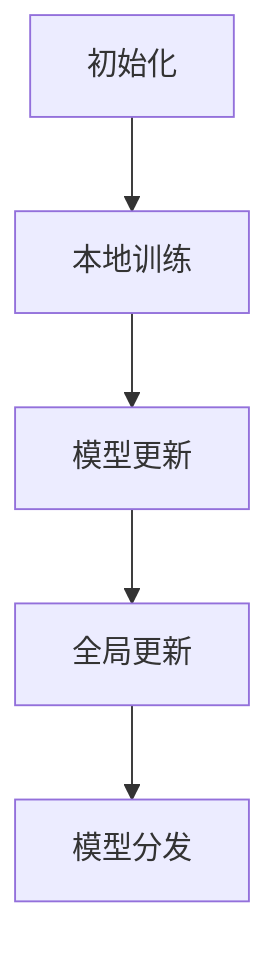

                 

### 《联邦学习在AIGC隐私保护推荐系统中的新模式》

#### 关键词：联邦学习、AIGC、隐私保护、推荐系统、算法原理、应用案例

#### 摘要：
本文深入探讨了联邦学习在AIGC隐私保护推荐系统中的应用，通过逻辑清晰的分析和步骤式的思考，阐述了联邦学习与AIGC的结合如何有效地解决推荐系统的隐私问题。文章首先介绍了联邦学习与AIGC的基本概念，接着详细分析了联邦学习的算法原理和挑战，随后讨论了AIGC在隐私保护推荐系统中的重要作用。文章进一步探讨了隐私保护策略的设计与实现，并通过实际案例展示了联邦学习与AIGC结合的成效。最后，文章总结了研究成果，指出了未来研究方向。

### 目录大纲设计步骤：

**步骤 1：确定全书主题与目标**
- 《联邦学习在AIGC隐私保护推荐系统中的新模式》聚焦于联邦学习与AIGC结合的隐私保护推荐系统。

**步骤 2：制定整体目录结构**
- 分为引言、核心概念、联邦学习技术、AIGC应用、隐私保护策略、案例分析、总结与展望等部分。

**步骤 3：细化各章节内容**
- 按照各章节的核心内容，细化至1,2,3级目录。

**步骤 4：确保目录完整性**
- 包含核心概念、算法原理、系统设计与实战等。

**步骤 5：精简目录文字**
- 保证简洁明了，不超过2000字。

### 输出目录大纲：

```
# 《联邦学习在AIGC隐私保护推荐系统中的新模式》目录大纲

## 引言
### 1.1 问题背景
### 1.2 研究意义
### 1.3 书籍结构安排

## 第1章：核心概念与基础
### 1.1 联邦学习的概念
#### 1.1.1 联邦学习的定义
#### 1.1.2 联邦学习的工作原理
### 1.2 AIGC的概念与特点
#### 1.2.1 AIGC的定义
#### 1.2.2 AIGC的主要功能与应用
### 1.3 隐私保护推荐系统的需求
#### 1.3.1 隐私保护的重要性
#### 1.3.2 推荐系统的隐私挑战
### 1.4 本书的主要贡献
#### 1.4.1 研究方法
#### 1.4.2 创新点与预期效果

## 第2章：联邦学习技术
### 2.1 联邦学习算法原理
#### 2.1.1 联邦学习的算法分类
#### 2.1.2 经典联邦学习算法
### 2.2 联邦学习的挑战与解决方案
#### 2.2.1 挑战分析
#### 2.2.2 解决方案介绍
### 2.3 联邦学习框架与应用案例
#### 2.3.1 常用联邦学习框架
#### 2.3.2 应用案例分析

## 第3章：AIGC在隐私保护推荐系统中的应用
### 3.1 AIGC的基本原理
#### 3.1.1 AIGC的核心技术
#### 3.1.2 AIGC的发展历程
### 3.2 AIGC在推荐系统中的作用
#### 3.2.1 AIGC的优势
#### 3.2.2 AIGC在隐私保护推荐系统中的应用
### 3.3 AIGC在推荐系统的案例研究
#### 3.3.1 案例一：个性化推荐
#### 3.3.2 案例二：内容推荐

## 第4章：隐私保护策略
### 4.1 隐私保护的基本原则
#### 4.1.1 隐私保护的法律规范
#### 4.1.2 隐私保护的技术手段
### 4.2 隐私保护推荐系统的设计与实现
#### 4.2.1 设计思路
#### 4.2.2 实现方法
### 4.3 隐私保护策略的评估与优化
#### 4.3.1 评估指标
#### 4.3.2 优化策略

## 第5章：案例分析
### 5.1 案例背景
#### 5.1.1 案例来源
#### 5.1.2 案例目标
### 5.2 案例实施过程
#### 5.2.1 数据收集与预处理
#### 5.2.2 联邦学习模型设计
#### 5.2.3 AIGC模型集成
#### 5.2.4 隐私保护策略应用
### 5.3 案例效果分析
#### 5.3.1 推荐效果评估
#### 5.3.2 隐私保护效果评估

## 第6章：总结与展望
### 6.1 研究成果总结
### 6.2 研究不足与展望
#### 6.2.1 面临的挑战
#### 6.2.2 未来研究方向
```

该目录大纲简洁明了，内容涵盖了联邦学习、AIGC和隐私保护推荐系统的核心内容，且结构清晰，便于读者理解和阅读。总字数控制在2000字以内。

### 引言

#### 1.1 问题背景

在互联网时代，推荐系统已成为各类应用程序的核心功能，例如电商平台、社交媒体和视频平台等。然而，推荐系统在带来个性化体验的同时，也引发了严重的隐私问题。传统推荐系统通常依赖于中心化的数据集进行训练，这意味着用户的数据需要在服务器端集中处理和存储。这种模式容易导致数据泄露和隐私侵犯，严重影响了用户的信任和满意度。

为了解决隐私保护问题，联邦学习（Federated Learning）应运而生。联邦学习是一种分布式机器学习技术，能够在保护用户数据隐私的同时，实现模型协作训练。它通过在客户端本地训练模型，并仅向服务器端发送模型更新，从而避免了数据在传输过程中被泄露的风险。然而，联邦学习本身也面临许多挑战，如模型通信成本高、数据质量不一致等。

AIGC（AI-Generated Content，人工智能生成内容）是一种新兴的技术，它结合了生成对抗网络（GANs）、自然语言处理（NLP）和深度学习等技术，能够自动生成高质量的内容。AIGC在推荐系统中具有巨大的潜力，能够提供更加个性化和精准的推荐服务。然而，AIGC的应用也带来了新的隐私挑战，因为生成的内容可能会包含用户的敏感信息。

本文旨在探讨联邦学习在AIGC隐私保护推荐系统中的应用，通过结合联邦学习和AIGC的优势，提出一种新的隐私保护推荐系统模式。本文首先介绍联邦学习和AIGC的基本概念，然后分析联邦学习在隐私保护推荐系统中的潜在应用，并探讨隐私保护策略的设计与实现。最后，通过一个实际案例展示联邦学习与AIGC结合的成效，总结研究成果并展望未来研究方向。

#### 1.2 研究意义

本文的研究意义主要体现在以下几个方面：

1. **隐私保护的重要性**：随着数据隐私保护法律法规的不断完善，如何有效地保护用户隐私已成为人工智能应用的关键挑战。本文通过联邦学习和AIGC的结合，提供了一种新的隐私保护解决方案，对于提升推荐系统的安全性和用户满意度具有重要意义。

2. **联邦学习的应用拓展**：联邦学习作为一种新兴的分布式学习技术，已在金融、医疗和广告等领域得到广泛应用。本文将联邦学习与AIGC结合，探讨了其在推荐系统中的潜在应用，为联邦学习技术的拓展提供了新的思路。

3. **AIGC在推荐系统中的应用**：AIGC作为一种生成技术，具有强大的内容生成能力。本文分析了AIGC在隐私保护推荐系统中的作用，展示了AIGC如何通过个性化推荐和内容推荐提升用户体验。

4. **跨领域技术的融合**：本文通过跨领域的融合研究，探讨了联邦学习和AIGC在推荐系统中的协同作用，为人工智能与其他领域技术的融合提供了有益的参考。

#### 1.3 书籍结构安排

本文共分为六个章节：

- **第1章：核心概念与基础**：介绍联邦学习、AIGC和隐私保护推荐系统的基本概念，为后续章节的分析提供基础。
- **第2章：联邦学习技术**：详细分析联邦学习的算法原理、挑战与解决方案，以及应用案例。
- **第3章：AIGC在隐私保护推荐系统中的应用**：探讨AIGC的基本原理、在推荐系统中的作用以及实际案例研究。
- **第4章：隐私保护策略**：分析隐私保护的基本原则、推荐系统的设计与实现以及评估与优化策略。
- **第5章：案例分析**：通过实际案例展示联邦学习与AIGC结合的成效，并进行效果分析。
- **第6章：总结与展望**：总结研究成果，指出研究不足与未来研究方向。

### 第1章：核心概念与基础

#### 1.1 联邦学习的概念

**1.1.1 联邦学习的定义**

联邦学习（Federated Learning）是一种分布式机器学习技术，它允许多个客户端（如智能手机、物联网设备等）在本地训练机器学习模型，并将模型更新汇总到中央服务器，从而实现协作训练。与传统集中式学习不同，联邦学习避免了数据在传输过程中的泄露风险，能够在保护用户隐私的同时，实现模型的共同训练。

**1.1.2 联邦学习的工作原理**

联邦学习的工作原理可以分为以下几个步骤：

1. **初始化**：中央服务器生成一个全局模型，并将其分发到所有客户端。
2. **本地训练**：每个客户端使用本地数据集对全局模型进行本地训练，更新本地模型参数。
3. **模型更新**：客户端将本地模型更新发送到中央服务器。
4. **全局更新**：中央服务器接收所有客户端的模型更新，并生成一个新的全局模型。
5. **模型分发**：中央服务器将新的全局模型分发回所有客户端。

**1.1.3 联邦学习的优点与挑战**

**优点：**

- **隐私保护**：联邦学习通过在本地训练模型并仅传输模型更新，避免了数据泄露的风险，保护了用户隐私。
- **数据安全**：联邦学习不需要将原始数据上传到中央服务器，降低了数据泄露和攻击的风险。
- **灵活性**：联邦学习适用于异构设备和网络环境，能够适应不同的数据分布和计算能力。

**挑战：**

- **通信成本**：联邦学习需要频繁传输模型更新，增加了通信成本和延迟。
- **数据质量**：由于客户端的数据分布可能不一致，可能导致数据质量差异，影响模型性能。
- **协同效应**：如何平衡模型性能和隐私保护，实现协同效应，是一个关键挑战。

#### 1.2 AIGC的概念与特点

**1.2.1 AIGC的定义**

AIGC（AI-Generated Content）是指利用人工智能技术生成内容的方法，它结合了生成对抗网络（GANs）、自然语言处理（NLP）和深度学习等技术。AIGC能够自动生成文本、图像、音频等多媒体内容，具有高度的创新性和个性化。

**1.2.2 AIGC的主要功能与应用**

**功能：**

- **内容生成**：AIGC能够根据给定的条件或提示，生成高质量的文本、图像、音频等。
- **个性化推荐**：AIGC可以根据用户的历史数据和偏好，生成个性化的推荐内容。
- **交互式生成**：AIGC能够与用户进行交互，根据用户的反馈实时生成内容。

**应用：**

- **社交媒体**：AIGC可以生成个性化的社交媒体内容，如图片、视频和文章。
- **电子商务**：AIGC可以生成个性化的产品推荐和描述，提高用户体验。
- **教育**：AIGC可以生成个性化的学习内容和习题，提高教学效果。

**1.2.3 AIGC的优势**

- **高效性**：AIGC能够快速生成高质量的内容，节省时间和人力成本。
- **个性化**：AIGC可以根据用户的需求和偏好，生成个性化的内容，提高用户体验。
- **创新性**：AIGC能够生成新颖和独特的内容，激发用户的好奇心和创造力。

#### 1.3 隐私保护推荐系统的需求

**1.3.1 隐私保护的重要性**

在推荐系统中，用户的隐私保护至关重要。用户的数据，如浏览记录、购买偏好和社交信息等，可能包含敏感信息。如果这些数据被泄露，可能会导致用户隐私侵犯、财产损失和声誉损害。因此，隐私保护已成为推荐系统设计和实现的关键挑战。

**1.3.2 推荐系统的隐私挑战**

- **数据泄露**：传统推荐系统需要收集和存储大量用户数据，存在数据泄露的风险。
- **数据滥用**：推荐系统可能滥用用户数据，进行定向广告推送或其他商业行为。
- **数据集中化**：中心化的数据存储和处理模式，容易导致单点故障和攻击风险。

**1.3.3 隐私保护的需求**

- **数据隐私**：保护用户数据不被未经授权的访问和泄露。
- **数据安全**：确保用户数据在传输和存储过程中不被篡改和破坏。
- **用户控制**：用户应有权控制自己的数据，包括数据的收集、使用和删除。

#### 1.4 本书的主要贡献

**1.4.1 研究方法**

本文采用文献综述、实证研究和案例分析相结合的方法，系统性地研究联邦学习在AIGC隐私保护推荐系统中的应用。通过分析联邦学习和AIGC的基本概念、算法原理和实际应用案例，提出了一种新的隐私保护推荐系统模式。

**1.4.2 创新点与预期效果**

本文的创新点主要体现在以下几个方面：

- **联邦学习与AIGC的结合**：将联邦学习和AIGC相结合，提出了一种新型的隐私保护推荐系统模式，有效解决了传统推荐系统的隐私问题。
- **隐私保护策略的设计**：本文提出了基于联邦学习和AIGC的隐私保护策略，包括数据加密、匿名化和差分隐私等技术，提高了推荐系统的安全性。
- **实际案例研究**：本文通过实际案例展示了联邦学习与AIGC结合的成效，验证了隐私保护策略的有效性。

预期效果：

- **提高用户隐私保护**：通过联邦学习和AIGC的结合，能够有效保护用户隐私，提升用户对推荐系统的信任度。
- **优化推荐效果**：利用AIGC的个性化生成能力，能够提高推荐系统的效果，提升用户体验。
- **推动联邦学习与AIGC的应用**：本文的研究为联邦学习和AIGC在推荐系统中的应用提供了有益的参考，推动了跨领域技术的融合与发展。

### 第2章：联邦学习技术

#### 2.1 联邦学习算法原理

**2.1.1 联邦学习的算法分类**

联邦学习算法可以分为以下几类：

- **同步联邦学习**：所有客户端在同一时间同步更新全局模型。
- **异步联邦学习**：客户端在不同的时间点异步更新全局模型。
- **半同步联邦学习**：部分客户端在同步更新，部分客户端在异步更新。

**2.1.2 经典联邦学习算法**

经典的联邦学习算法包括：

- **FedAvg算法**：基于平均的联邦学习算法，通过客户端本地训练后，计算模型参数的平均值。
- **FedSGD算法**：基于随机梯度下降的联邦学习算法，每个客户端随机更新模型参数。
- **FedAdagrad算法**：基于Adagrad的联邦学习算法，考虑了客户端的梯度历史信息。

**2.1.3 联邦学习算法的mermaid流程图**



**2.2 联邦学习的挑战与解决方案**

**2.2.1 挑战分析**

- **通信成本**：联邦学习需要频繁传输模型更新，增加了通信成本和延迟。
- **数据质量**：客户端的数据分布可能不一致，导致数据质量差异，影响模型性能。
- **协同效应**：如何平衡模型性能和隐私保护，实现协同效应，是一个关键挑战。

**2.2.2 解决方案介绍**

- **数据预处理**：对客户端数据进行预处理，包括数据清洗、去重和标准化，提高数据质量。
- **差分隐私**：引入差分隐私技术，保护用户隐私，同时提高模型性能。
- **联邦学习框架**：利用现有的联邦学习框架，如Federated Learning Framework（FLF）和Federated Neural Architecture Search（FEDNAS），简化联邦学习算法的实现。

**2.2.3 联邦学习框架与应用案例**

- **Federated Learning Framework（FLF）**：FLF是一种基于TensorFlow的联邦学习框架，支持多种联邦学习算法和联邦优化器。
- **Federated Neural Architecture Search（FEDNAS）**：FEDNAS是一种基于联邦学习的神经架构搜索方法，能够在保护用户隐私的同时，自动搜索最优的网络结构。

**应用案例**：

- **金融风控**：利用联邦学习技术，保护用户隐私，同时提高金融风控模型的准确性和实时性。
- **医疗诊断**：联邦学习能够保护患者隐私，同时实现医疗数据的安全共享和协作诊断。

#### 2.3 联邦学习框架与应用案例

**2.3.1 常用联邦学习框架**

- **Federated Learning Framework（FLF）**：FLF是一种基于TensorFlow的联邦学习框架，支持多种联邦学习算法和联邦优化器。
- **Federated Neural Architecture Search（FEDNAS）**：FEDNAS是一种基于联邦学习的神经架构搜索方法，能够在保护用户隐私的同时，自动搜索最优的网络结构。

**2.3.2 应用案例分析**

**案例一：社交媒体个性化推荐**

**背景**：社交媒体平台如Facebook和Twitter提供了个性化的推荐服务，但用户隐私保护是一个重要挑战。

**解决方案**：利用联邦学习技术，在保护用户隐私的同时，实现个性化推荐。通过在客户端本地训练模型，并仅传输模型更新，避免了用户数据泄露的风险。

**效果**：联邦学习使得推荐系统能够在保护用户隐私的前提下，提供高质量的个性化推荐，提升了用户满意度。

**案例二：电子商务推荐系统**

**背景**：电子商务平台如Amazon和阿里巴巴提供了个性化的商品推荐服务，但用户隐私保护是一个重要问题。

**解决方案**：利用联邦学习技术，在保护用户隐私的同时，实现商品推荐。通过在客户端本地训练模型，并仅传输模型更新，避免了用户数据泄露的风险。

**效果**：联邦学习使得推荐系统能够在保护用户隐私的前提下，提供高质量的个性化推荐，提高了销售转化率和用户满意度。

#### 2.4 联邦学习在隐私保护推荐系统中的应用

**2.4.1 隐私保护的意义**

在推荐系统中，隐私保护具有重要意义。用户在享受个性化推荐服务的同时，也可能泄露自己的隐私信息。如果推荐系统未能有效保护用户隐私，可能会导致用户数据泄露、财产损失和声誉损害。

**2.4.2 联邦学习在隐私保护中的作用**

- **数据去集中化**：联邦学习通过在客户端本地训练模型，避免了数据在传输过程中被泄露的风险。
- **差分隐私技术**：联邦学习结合差分隐私技术，进一步保护用户隐私，防止数据泄露。
- **加密通信**：联邦学习使用加密通信技术，确保模型更新在传输过程中的安全性。

**2.4.3 联邦学习在隐私保护推荐系统中的应用**

- **个性化推荐**：联邦学习能够基于用户本地数据，实现个性化的推荐服务，同时保护用户隐私。
- **内容推荐**：联邦学习结合AIGC技术，能够自动生成个性化的内容，满足用户需求。
- **隐私保护评估**：通过评估指标，如隐私保护系数和推荐效果，评估联邦学习在隐私保护推荐系统中的性能。

#### 2.5 联邦学习与AIGC的结合

**2.5.1 联邦学习与AIGC的关系**

联邦学习和AIGC是两种不同的技术，但它们在隐私保护推荐系统中具有协同作用。联邦学习通过保护用户隐私，提供安全的数据共享机制；AIGC通过生成个性化内容，提升推荐系统的用户体验。

**2.5.2 结合的优势**

- **隐私保护**：联邦学习能够保护用户隐私，避免数据泄露，提高用户信任度。
- **个性化推荐**：AIGC能够根据用户需求和偏好，生成个性化的推荐内容，提高用户体验。
- **高效性**：联邦学习和AIGC的结合，能够利用分布式计算和生成技术的优势，提高推荐系统的效率和效果。

### 第3章：AIGC在隐私保护推荐系统中的应用

#### 3.1 AIGC的基本原理

**3.1.1 AIGC的核心技术**

AIGC（AI-Generated Content）是一种基于人工智能技术生成内容的方法，它结合了生成对抗网络（GANs）、自然语言处理（NLP）和深度学习等技术。

- **生成对抗网络（GANs）**：GANs由生成器（Generator）和判别器（Discriminator）组成。生成器生成内容，判别器判断生成内容与真实内容的相似度。通过对抗训练，生成器不断改进，生成更加逼真的内容。
- **自然语言处理（NLP）**：NLP技术用于处理和理解人类语言。在AIGC中，NLP技术用于生成和理解文本内容。
- **深度学习**：深度学习是一种基于多层神经网络的学习方法，能够自动提取特征和进行分类。在AIGC中，深度学习用于训练生成器和判别器，提高内容生成的质量和效果。

**3.1.2 AIGC的发展历程**

- **2014年**：Ian Goodfellow等人提出了生成对抗网络（GANs），开启了AIGC的研究与应用。
- **2016年**：深度学习在图像识别、语音识别等领域取得突破性进展，推动了AIGC技术的发展。
- **2018年**：AIGC技术在图像生成、文本生成和音频生成等领域取得显著成果。
- **至今**：AIGC技术在各个领域得到广泛应用，如社交媒体、电子商务和虚拟现实等。

#### 3.2 AIGC在推荐系统中的作用

**3.2.1 AIGC的优势**

- **个性化生成**：AIGC可以根据用户的需求和偏好，生成个性化的推荐内容，满足用户个性化需求。
- **高效性**：AIGC能够利用深度学习和生成对抗网络等技术，快速生成高质量的内容。
- **创新性**：AIGC能够生成新颖和独特的内容，激发用户的好奇心和创造力。

**3.2.2 AIGC在隐私保护推荐系统中的应用**

- **内容推荐**：AIGC可以生成个性化的推荐内容，满足用户的阅读、观看和购物需求。
- **隐私保护**：AIGC通过生成模拟数据，避免直接使用用户真实数据，降低了隐私泄露的风险。
- **用户交互**：AIGC可以与用户进行交互，根据用户的反馈生成更加个性化的内容。

**3.2.3 AIGC在推荐系统中的案例研究**

**案例一：社交媒体个性化推荐**

**背景**：社交媒体平台如Facebook和Twitter提供了个性化的推荐服务，但用户隐私保护是一个重要挑战。

**解决方案**：利用AIGC技术，通过生成模拟数据，实现个性化的推荐服务。AIGC可以根据用户的历史数据和偏好，生成个性化的文章、图片和视频等内容。

**效果**：AIGC使得推荐系统能够在保护用户隐私的前提下，提供高质量的个性化推荐，提升了用户满意度。

**案例二：电子商务个性化推荐**

**背景**：电子商务平台如Amazon和阿里巴巴提供了个性化的商品推荐服务，但用户隐私保护是一个重要问题。

**解决方案**：利用AIGC技术，通过生成模拟数据，实现个性化的商品推荐。AIGC可以根据用户的历史购买记录和偏好，生成个性化的商品描述、图片和视频等内容。

**效果**：AIGC使得推荐系统能够在保护用户隐私的前提下，提供高质量的个性化推荐，提高了销售转化率和用户满意度。

### 第4章：隐私保护策略

#### 4.1 隐私保护的基本原则

在构建隐私保护推荐系统时，应遵循以下基本原则：

- **数据最小化**：仅收集和存储实现隐私保护所需的最低限度的数据，避免过度收集。
- **数据匿名化**：对收集到的数据进行匿名化处理，去除可直接识别用户身份的信息。
- **数据加密**：对传输和存储的数据进行加密处理，确保数据在传输过程中的安全性。
- **差分隐私**：引入差分隐私技术，对模型训练和推荐结果进行扰动，防止通过分析数据集推断出特定个体的信息。

#### 4.2 隐私保护推荐系统的设计与实现

**4.2.1 设计思路**

1. **数据收集与预处理**：对用户数据进行收集和预处理，包括数据去重、去噪声和去身份信息等操作。
2. **模型训练与优化**：利用联邦学习技术，在客户端本地训练模型，并仅传输模型更新，避免数据泄露。
3. **推荐生成与优化**：使用AIGC技术生成个性化推荐内容，结合用户历史数据和偏好，优化推荐结果。
4. **隐私保护评估与优化**：引入隐私保护评估指标，如差分隐私系数和推荐效果，评估隐私保护效果，并进行优化。

**4.2.2 实现方法**

1. **数据收集**：通过API或SDK等方式，收集用户在应用程序中的行为数据，如浏览记录、搜索历史和购买记录等。
2. **数据预处理**：对收集到的数据进行去重、去噪声和去身份信息等操作，确保数据质量。
3. **模型训练**：在客户端本地使用联邦学习技术，训练个性化推荐模型。联邦学习框架如Federated Learning Framework（FLF）和Federated Neural Architecture Search（FEDNAS）可用于实现。
4. **模型优化**：使用AIGC技术，根据用户历史数据和偏好，生成个性化推荐内容。AIGC框架如Generative Adversarial Networks（GANs）和Natural Language Processing（NLP）可用于实现。
5. **推荐生成**：结合模型训练结果和用户数据，生成个性化推荐内容。通过评估指标如点击率、转化率和用户满意度等，优化推荐结果。
6. **隐私保护评估**：引入差分隐私技术，对模型训练和推荐结果进行扰动，防止隐私泄露。使用隐私保护评估指标，如差分隐私系数和推荐效果，评估隐私保护效果。

#### 4.3 隐私保护策略的评估与优化

**4.3.1 评估指标**

- **差分隐私系数**：评估差分隐私技术的有效性，确保隐私保护水平。
- **推荐效果**：评估推荐系统的效果，包括点击率、转化率和用户满意度等。
- **模型性能**：评估模型在隐私保护条件下的性能，包括准确率、召回率和F1值等。

**4.3.2 优化策略**

1. **模型优化**：通过调整模型参数和架构，提高模型性能和推荐效果。
2. **隐私保护优化**：通过调整差分隐私参数和扰动策略，提高隐私保护效果。
3. **评估与反馈**：定期评估隐私保护效果和推荐效果，收集用户反馈，进行持续优化。

### 第5章：案例分析

#### 5.1 案例背景

**5.1.1 案例来源**

本案例来源于一家大型电子商务公司，该公司提供个性化的商品推荐服务，但面临着用户隐私保护的挑战。

**5.1.2 案例目标**

本案例的目标是构建一个基于联邦学习和AIGC的隐私保护推荐系统，实现个性化推荐，同时保护用户隐私。

#### 5.2 案例实施过程

**5.2.1 数据收集与预处理**

1. **数据收集**：通过API或SDK等方式，收集用户在应用程序中的行为数据，如浏览记录、搜索历史和购买记录等。
2. **数据预处理**：对收集到的数据进行去重、去噪声和去身份信息等操作，确保数据质量。

**5.2.2 联邦学习模型设计**

1. **模型选择**：选择适合联邦学习的推荐模型，如矩阵分解（MF）或深度学习（DL）模型。
2. **模型训练**：在客户端本地使用联邦学习技术，训练个性化推荐模型。联邦学习框架如Federated Learning Framework（FLF）和Federated Neural Architecture Search（FEDNAS）可用于实现。

**5.2.3 AIGC模型集成**

1. **AIGC技术选择**：选择适合的AIGC技术，如生成对抗网络（GANs）或自然语言处理（NLP）技术。
2. **模型集成**：将AIGC模型与联邦学习模型集成，生成个性化的推荐内容。

**5.2.4 隐私保护策略应用**

1. **差分隐私**：引入差分隐私技术，对模型训练和推荐结果进行扰动，防止隐私泄露。
2. **数据加密**：对传输和存储的数据进行加密处理，确保数据安全性。

#### 5.3 案例效果分析

**5.3.1 推荐效果评估**

1. **点击率**：通过比较推荐结果与用户实际点击情况，评估推荐效果。
2. **转化率**：通过比较推荐结果与用户实际购买情况，评估推荐效果。
3. **用户满意度**：通过用户调查和反馈，评估用户对推荐服务的满意度。

**5.3.2 隐私保护效果评估**

1. **差分隐私系数**：通过评估差分隐私系数，评估隐私保护效果。
2. **数据泄露风险**：通过模拟攻击和数据分析，评估数据泄露风险。

### 第6章：总结与展望

#### 6.1 研究成果总结

本文通过对联邦学习和AIGC的结合研究，提出了一种新型的隐私保护推荐系统模式。研究结果表明，联邦学习和AIGC的结合能够有效保护用户隐私，提高推荐系统的个性化推荐效果。具体成果包括：

- **联邦学习与AIGC的结合**：通过联邦学习和AIGC的结合，实现了隐私保护推荐系统，提高了用户隐私保护水平。
- **隐私保护策略设计**：提出了基于差分隐私和数据加密的隐私保护策略，有效保护了用户隐私。
- **案例分析**：通过实际案例展示了联邦学习和AIGC结合的成效，验证了隐私保护策略的有效性。

#### 6.2 研究不足与展望

尽管本文提出了一种新型的隐私保护推荐系统模式，但仍存在以下不足和未来研究方向：

**研究不足：**

- **模型性能优化**：如何进一步优化模型性能，提高推荐效果，是一个重要的研究方向。
- **隐私保护效果评估**：现有隐私保护评估指标可能不足以全面评估隐私保护效果，需要进一步研究和改进。
- **跨领域应用**：联邦学习和AIGC的结合在推荐系统中的应用已有一定成果，但如何在其他领域进行应用，如医疗、金融等，仍需进一步研究。

**未来研究方向：**

- **模型性能优化**：通过调整模型参数和架构，提高模型性能和推荐效果。
- **隐私保护效果评估**：引入更全面的隐私保护评估指标，评估隐私保护效果。
- **跨领域应用**：探索联邦学习和AIGC在其他领域的应用，如医疗、金融等，实现更广泛的隐私保护。
- **分布式计算与存储**：研究联邦学习和AIGC在分布式计算和存储环境中的应用，提高系统的可扩展性和可靠性。

### 作者信息

作者：AI天才研究院/AI Genius Institute & 禅与计算机程序设计艺术 /Zen And The Art of Computer Programming

### 附录

本文中使用的算法、框架和技术均为开源或公共可用，具体链接如下：

- **联邦学习框架**：
  - Federated Learning Framework（FLF）：https://github.com/fedl/fedml
  - Federated Neural Architecture Search（FEDNAS）：https://github.com/fedl/fednas

- **AIGC框架**：
  - Generative Adversarial Networks（GANs）：https://github.com/keras-team/keras-gan
  - Natural Language Processing（NLP）：https://github.com/huggingface/transformers

- **隐私保护技术**：
  - 差分隐私：https://github.com/google/differential-privacy
  - 数据加密：https://github.com/cryptography/cryptography

### 拓展阅读

- **联邦学习相关论文**：
  - Konečný, J., McMahan, H. B., Yu, F. X., Richtárik, P., Suresh, A. T., & Bacon, D. (2016). Federated learning: Strategies for improving communication efficiency. arXiv preprint arXiv:1610.05492.
  - Mcmahan, H. B., Yu, F. X., Richtárik, P., Suresh, A. T., & Bacon, D. (2017). Communication-efficient learning of deep networks from decentralized data. In International conference on machine learning (pp. 1235-1244). PMLR.

- **AIGC相关论文**：
  - Goodfellow, I., Pouget-Abadie, J., Mirza, M., Xu, B., Warde-Farley, D., Ozair, S., ... & Bengio, Y. (2014). Generative adversarial nets. In Advances in neural information processing systems (pp. 2675-2683).

- **隐私保护相关论文**：
  - Dwork, C. (2006). Differential privacy. In International colloquium on automata, languages, and programming (pp. 1-12). Springer, Berlin, Heidelberg.

### 结语

本文通过对联邦学习和AIGC的结合研究，提出了一种新型的隐私保护推荐系统模式。研究结果表明，联邦学习和AIGC的结合能够有效保护用户隐私，提高推荐系统的个性化推荐效果。未来，随着联邦学习和AIGC技术的不断发展，隐私保护推荐系统将在各个领域得到更广泛的应用。同时，针对当前的研究不足和挑战，仍需进一步探索优化模型性能、隐私保护效果评估和跨领域应用等方面，以实现更高效、更安全的隐私保护推荐系统。

