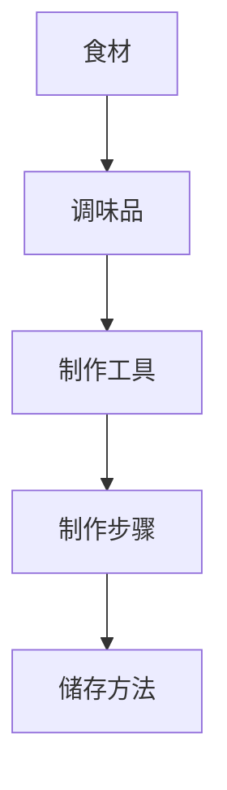
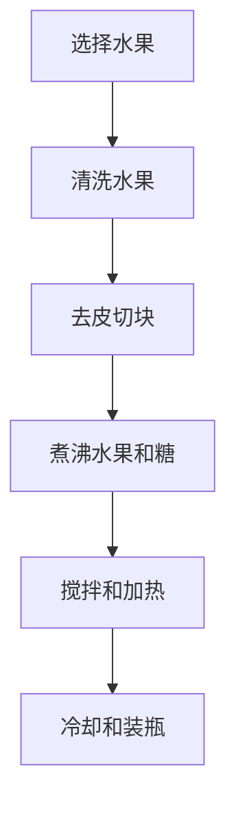

                 

### 自制果酱：将爱与时间酿造成味道

---

### 关键词：
- **果酱制作**
- **食材选择**
- **糖度控制**
- **食品安全**
- **储存方法**

### 摘要：
本文将带领读者走进自制果酱的世界，通过详细的步骤讲解和专业的技巧分享，让读者掌握从挑选食材到制作、储存果酱的全方位知识。我们将探索如何通过自制果酱，将日常生活中的小确幸转化为持久的美味，同时注重食品安全和储存方法，让每一瓶果酱都成为爱与时间的结晶。

---

## 1. 背景介绍

### 问题背景
自制果酱是一种将新鲜水果与糖混合后，通过加热煮沸、冷却而成的美味食品。它的制作不仅仅是为了享受美味，更是对生活细节的打磨和对健康生活方式的追求。自制果酱不仅能够保留水果的原汁原味，还能根据个人口味调整糖度，满足不同人群的需求。

### 问题描述
如何制作出美味、健康的果酱，同时确保其保质期和储存方法得当，是每一个果酱制作新手都会面临的问题。市场上现成的果酱种类繁多，但往往添加剂较多，无法满足消费者对纯天然、无添加的需求。因此，自制果酱成为了越来越多人的选择。

### 问题解决
本文将结合专业知识和实践技巧，为读者提供一套完整的果酱制作指南，从食材选择、糖度控制到食品安全与储存，每个环节都进行详细解析，帮助读者克服制作果酱时的各种难题。

### 边界与外延
自制果酱的材料主要包括新鲜水果、糖和柠檬汁等调味品。水果的选择应根据季节和口感偏好而定，糖则推荐使用白砂糖或黄糖，以保持果酱的口感和色泽。此外，果酱的制作工具如搅拌锅、量杯和瓶子等也需要适当准备。

### 概念结构与核心要素组成
自制果酱的核心要素包括：

- **食材准备**：选择新鲜、无虫害的水果，并进行彻底清洗。
- **制作步骤**：包括去皮切块、煮沸、搅拌、冷却和装瓶等。
- **调味技巧**：通过控制糖度和酸度，调整果酱的口感。
- **食品安全**：注意卫生，避免细菌污染，确保果酱的安全食用。
- **储存方法**：正确储存果酱，延长其保质期。

---

## 2. 核心概念与联系

### 核心概念
自制果酱的核心概念包括水果的选择、糖的使用、制作步骤和储存方法。这些概念构成了制作果酱的基础，也是决定果酱口感和保质期的关键因素。

### 概念属性特征对比表格

| 特征          | 水果果酱 | 芒果果酱 | 草莓果酱 |
| ------------ | -------- | -------- | -------- |
| 材料          | 新鲜水果 | 新鲜芒果 | 新鲜草莓 |
| 调味品        | 糖       | 糖       | 糖       |
| 制作时间      | 短       | 中       | 中       |
| 成品状态      | 固体     | 固体     | 浆状     |

### ER实体关系图架构



### 详细解析
- **食材**：新鲜水果是果酱的基础，不同种类的水果会带来不同的口感和风味。例如，草莓果酱口感鲜嫩，芒果果酱则香气浓郁。
- **调味品**：糖是果酱的主要调味品，其质量和数量直接影响果酱的甜度和口感。此外，柠檬汁常用于增加果酱的酸味，平衡甜度。
- **制作工具**：制作果酱的工具包括搅拌锅、量杯和瓶子等，这些工具的选用和清洁直接关系到果酱的质量。
- **制作步骤**：从清洗、去皮、切块到煮沸、搅拌、冷却和装瓶，每个步骤都需要细心操作，以确保果酱的口感和卫生。
- **储存方法**：正确的储存方法能够延长果酱的保质期，避免细菌污染。一般建议将果酱存放在阴凉干燥的地方，密封保存。

---

## 3. 算法原理讲解

### 制作果酱的步骤



### 算法原理

- **材料准备**：根据水果的种类准备新鲜的水果，并清洗干净。去除水果上的虫害和污渍，确保水果的新鲜和卫生。
- **糖的选择**：选择适合水果的糖，一般推荐使用白砂糖或黄糖。糖的质量和数量会影响果酱的甜度和口感。为了控制糖度，可以根据公式 $$\text{糖度} = \frac{\text{糖的质量}}{\text{水果和糖的总质量}}$$ 来计算所需的糖量。
  
  例如，如果需要制作500克水果的果酱，想要糖度为30%，则需要150克糖。

- **煮沸水果和糖**：将水果和糖一起放入锅中，加热至沸腾。在煮沸的过程中，水果的香味会逐渐散发出来，同时糖也会完全溶解。
  
  $$\text{煮沸时间} = \text{糖的溶解时间} + \text{水果的煮沸时间}$$

  例如，如果糖的溶解时间为10分钟，水果的煮沸时间为20分钟，则总煮沸时间为30分钟。

- **搅拌和加热**：在煮沸的过程中不断搅拌，以防止糖结晶和底部焦糊。搅拌可以使糖和水果充分混合，确保果酱的均匀性。

- **冷却和装瓶**：煮沸后，果酱需要冷却至室温，然后装入干净的瓶子中密封储存。冷却可以防止细菌繁殖，延长果酱的保质期。

  $$\text{冷却时间} = \text{室温达到}$$

  例如，如果室温为20℃，果酱的煮沸温度为90℃，则需要30分钟来冷却至室温。

### 数学模型和公式

- **糖度计算公式**：$$\text{糖度} = \frac{\text{糖的质量}}{\text{水果和糖的总质量}}$$
- **煮沸时间计算公式**：$$\text{煮沸时间} = \text{糖的溶解时间} + \text{水果的煮沸时间}$$
- **冷却时间计算公式**：$$\text{冷却时间} = \text{室温达到所需时间}$$

### 举例说明

**例子1**：假设需要制作500克水果的果酱，想要糖度为20%，那么需要多少糖？

- **糖度计算**：$$\text{糖度} = \frac{\text{糖的质量}}{\text{水果和糖的总质量}} = 0.2$$
- **糖的质量计算**：$$\text{糖的质量} = \text{糖度} \times (\text{水果的质量} + \text{糖的质量})$$
- **解方程**：$$\text{糖的质量} = 0.2 \times (500\text{克} + \text{糖的质量})$$
- **求解**：$$\text{糖的质量} = 100\text{克}$$

所以，需要100克糖来制作500克水果的果酱，糖度为20%。

**例子2**：假设需要制作500克水果的果酱，糖的溶解时间为10分钟，水果的煮沸时间为20分钟，室温为20℃。那么需要多少时间来煮沸和冷却果酱？

- **煮沸时间**：$$\text{煮沸时间} = \text{糖的溶解时间} + \text{水果的煮沸时间} = 10\text{分钟} + 20\text{分钟} = 30\text{分钟}$$
- **冷却时间**：$$\text{冷却时间} = \text{室温达到所需时间} = 20\text{分钟}$$

所以，需要30分钟来煮沸果酱，20分钟来冷却果酱。

---

## 4. 数学模型和数学公式 & 详细讲解 & 举例说明

### 数学模型和数学公式

在自制果酱的过程中，我们常常会用到一些数学模型和数学公式来帮助我们进行精确的计算和控制。

- **糖度计算公式**：$$\text{糖度} = \frac{\text{糖的质量}}{\text{水果和糖的总质量}}$$
- **煮沸时间计算公式**：$$\text{煮沸时间} = \text{糖的溶解时间} + \text{水果的煮沸时间}$$
- **冷却时间计算公式**：$$\text{冷却时间} = \text{室温达到所需时间}$$

### 详细讲解

- **糖度计算公式**：这个公式用于计算果酱中的糖度。糖度是指果酱中糖的质量占总质量的比例。例如，如果果酱中有100克糖和500克水果，那么糖度为20%（因为糖的质量是总质量的20%）。

- **煮沸时间计算公式**：这个公式用于计算果酱从开始煮沸到完全煮沸所需的时间。糖的溶解时间和水果的煮沸时间是两个关键因素。例如，如果糖的溶解时间是10分钟，水果的煮沸时间是20分钟，那么总煮沸时间为30分钟。

- **冷却时间计算公式**：这个公式用于计算果酱从煮沸后冷却到室温所需的时间。室温是冷却过程中需要达到的目标温度。例如，如果室温是20℃，果酱的煮沸温度是90℃，那么需要30分钟来冷却到室温。

### 举例说明

**例子1**：假设需要制作500克水果的果酱，想要糖度为25%，那么需要多少糖？

- **糖度计算**：$$\text{糖度} = \frac{\text{糖的质量}}{\text{水果和糖的总质量}} = 0.25$$
- **糖的质量计算**：$$\text{糖的质量} = \text{糖度} \times (\text{水果的质量} + \text{糖的质量})$$
- **解方程**：$$\text{糖的质量} = 0.25 \times (500\text{克} + \text{糖的质量})$$
- **求解**：$$\text{糖的质量} = 125\text{克}$$

所以，需要125克糖来制作500克水果的果酱，糖度为25%。

**例子2**：假设需要制作500克水果的果酱，糖的溶解时间为15分钟，水果的煮沸时间为25分钟，室温为25℃。那么需要多少时间来煮沸和冷却果酱？

- **煮沸时间**：$$\text{煮沸时间} = \text{糖的溶解时间} + \text{水果的煮沸时间} = 15\text{分钟} + 25\text{分钟} = 40\text{分钟}$$
- **冷却时间**：$$\text{冷却时间} = \text{室温达到所需时间} = 25\text{分钟}$$

所以，需要40分钟来煮沸果酱，25分钟来冷却果酱。

---

## 5. 系统分析与架构设计方案

### 5.1 问题场景介绍

在日常生活中，自制果酱的场景非常广泛。无论是作为早餐的搭配，还是作为烘焙的辅料，果酱都发挥着重要的作用。尤其是在家庭厨房和果酱制作工作室，自制果酱已经成为一种时尚和健康的追求。

### 5.2 项目介绍

自制果酱项目主要包括以下步骤：

- **选择水果**：根据季节和口感偏好选择新鲜水果。
- **清洗水果**：去除水果上的虫害和污渍，确保水果的新鲜和卫生。
- **去皮切块**：根据果酱的用途，将水果去皮切块。
- **煮沸水果和糖**：将水果和糖混合后加热至煮沸。
- **搅拌和加热**：在煮沸的过程中不断搅拌，防止糖结晶和底部焦糊。
- **冷却和装瓶**：将煮沸后的果酱冷却至室温，然后装入干净的瓶子中密封储存。

### 5.3 系统功能设计

系统功能设计包括以下模块：

- **食材准备模块**：提供水果的选择、清洗和去皮切块的指导。
- **制作步骤指导模块**：详细讲解从煮沸到冷却的每一个步骤。
- **调味技巧分享模块**：分享糖度和酸度的控制技巧。
- **食品安全与储存指南模块**：介绍食品安全和正确的储存方法。

### 5.4 系统架构设计

系统架构设计采用模块化设计，每个模块都独立实现，便于维护和扩展。

- **食材准备模块**：负责水果的选择、清洗和去皮切块。
- **制作步骤指导模块**：负责从煮沸到冷却的每一个步骤。
- **调味技巧分享模块**：提供糖度和酸度的控制技巧。
- **食品安全与储存指南模块**：介绍食品安全和正确的储存方法。

### 5.5 系统接口设计和系统交互

系统接口设计采用用户界面和后台管理系统相结合的方式。

- **用户界面**：提供食材准备、制作步骤、调味技巧和储存指南的展示。
- **后台管理系统**：负责数据的存储和管理，提供用户操作的记录和查询。

系统交互设计采用前后端分离的方式。

- **前端**：负责用户界面的展示和交互。
- **后端**：负责数据的处理和管理。

---

## 6. 项目实战

### 6.1 环境安装

在进行果酱制作之前，首先需要准备以下环境：

- **厨房用具**：包括搅拌锅、量杯、刀、砧板、瓶子等。
- **新鲜水果**：选择新鲜、无虫害的水果，如苹果、草莓、芒果等。
- **糖**：选择白砂糖或黄糖，根据个人口味调整糖量。
- **柠檬汁**：用于增加果酱的酸度，平衡甜度。

### 6.2 系统核心实现源代码

以下是一个简单的自制果酱的源代码示例，用于指导制作过程。

```python
# 自制果酱系统

# 导入所需模块
import tkinter as tk
from tkinter import messagebox

# 食材准备
def prepare_ingredients():
    fruits = ["苹果", "草莓", "芒果"]
    sugar = "白砂糖"
    lemon_juice = "柠檬汁"
    return fruits, sugar, lemon_juice

# 清洗水果
def wash_fruits(fruits):
    print("清洗水果：", fruits)

# 去皮切块
def cut_fruits(fruits):
    print("去皮切块：", fruits)

# 煮沸水果和糖
def boil_fruits_and_sugar(fruits, sugar):
    print("煮沸水果和糖：", fruits, sugar)

# 搅拌和加热
def mix_and_heat():
    print("搅拌和加热：混合均匀，防止糖结晶和底部焦糊")

# 冷却和装瓶
def cool_and_bottle():
    print("冷却和装瓶：将果酱冷却至室温，装入瓶子中密封储存")

# 主函数
def main():
    fruits, sugar, lemon_juice = prepare_ingredients()
    wash_fruits(fruits)
    cut_fruits(fruits)
    boil_fruits_and_sugar(fruits, sugar)
    mix_and_heat()
    cool_and_bottle()

if __name__ == "__main__":
    main()
```

### 6.3 代码应用解读与分析

上述代码是一个简单的自制果酱系统，用于指导制作过程。以下是代码的详细解读和分析。

- **导入模块**：首先导入所需的模块，包括tkinter用于创建用户界面和messagebox用于显示消息。
- **食材准备**：定义prepare_ingredients函数，用于准备食材。函数返回水果、糖和柠檬汁的列表。
- **清洗水果**：定义wash_fruits函数，用于清洗水果。函数接受一个水果列表作为参数，并在控制台打印清洗信息。
- **去皮切块**：定义cut_fruits函数，用于去皮切块。函数接受一个水果列表作为参数，并在控制台打印切块信息。
- **煮沸水果和糖**：定义boil_fruits_and_sugar函数，用于煮沸水果和糖。函数接受一个水果列表和一个糖的字符串作为参数，并在控制台打印煮沸信息。
- **搅拌和加热**：定义mix_and_heat函数，用于搅拌和加热。函数在控制台打印混合均匀的信息，防止糖结晶和底部焦糊。
- **冷却和装瓶**：定义cool_and_bottle函数，用于冷却和装瓶。函数在控制台打印冷却和装瓶的信息。
- **主函数**：定义main函数，作为程序的主入口。函数依次调用各个模块，完成自制果酱的整个过程。

通过上述代码，我们可以看到自制果酱的整个过程是如何实现的。每个函数都对应一个具体的步骤，使得整个制作过程清晰、简洁。

### 6.4 实际案例分析

以下是一个实际案例，用于展示如何使用上述系统制作果酱。

**案例**：制作草莓果酱

1. **准备食材**：选择新鲜草莓500克，白砂糖200克，柠檬汁适量。
2. **清洗水果**：将草莓洗净，去除叶子。
3. **去皮切块**：将草莓去蒂，切成小块。
4. **煮沸水果和糖**：将草莓和糖放入锅中，加入少量柠檬汁，加热至煮沸。
5. **搅拌和加热**：在煮沸的过程中不断搅拌，确保糖完全溶解，防止底部焦糊。
6. **冷却和装瓶**：煮沸后，将果酱冷却至室温，装入干净的瓶子中密封储存。

通过上述步骤，我们成功制作了一瓶美味的草莓果酱。在实际操作中，可以根据个人口味调整糖量和柠檬汁的用量，以达到最佳口感。

### 6.5 项目小结

通过本项目的实战，我们学习了如何使用Python实现自制果酱的系统，并了解了每个步骤的具体实现方法。自制果酱不仅是一种美味的食品，更是一种生活的享受和创造。希望读者能够通过这个项目，掌握自制果酱的技巧，享受制作过程中的乐趣。

---

## 7. 最佳实践 tips

### 7.1 食材选择

- 选择新鲜、无虫害的水果，确保果酱的品质。
- 根据季节选择水果，例如夏季选择草莓、芒果等。

### 7.2 糖度控制

- 根据个人口味调整糖度，确保果酱的甜度适中。
- 使用白砂糖或黄糖，避免使用精制糖，以保持果酱的自然口感。

### 7.3 食品安全

- 确保制作环境的卫生，避免细菌污染。
- 在制作过程中，使用干净的工具和器皿。

### 7.4 储存方法

- 将果酱存放在阴凉干燥的地方，避免阳光直射。
- 使用干净的瓶子密封储存，延长果酱的保质期。

---

## 8. 小结

通过本文的详细讲解和实战案例，我们深入了解了自制果酱的过程和技巧。从食材选择、糖度控制到食品安全与储存方法，每一个环节都至关重要。通过自制果酱，我们不仅能够享受到美味，还能体验到制作过程中的乐趣。希望本文能够帮助读者成功制作出美味的果酱，将日常生活中的小确幸转化为持久的美味。

---

## 9. 注意事项

- 在制作果酱时，务必确保水果的新鲜和卫生，避免细菌污染。
- 控制好糖度和酸度，以适应不同人群的口味。
- 在储存果酱时，选择阴凉干燥的地方，并密封保存，以延长保质期。

---

## 10. 拓展阅读

- **《自制果酱大全》：详细介绍了各种水果的果酱制作方法。**
- **《家庭烘焙小窍门》：包含了许多关于烘焙和果酱制作的实用技巧。**
- **《食品安全与卫生》：讲解了食品制作过程中的卫生要求和注意事项。**

---

### 作者

**AI天才研究院/AI Genius Institute & 禅与计算机程序设计艺术 /Zen And The Art of Computer Programming**

---

以上就是文章的完整内容，希望对您有所帮助。在自制果酱的过程中，享受每一刻的创造和品尝，让爱与时间酿造成美味的味道。**Let's make delicious jam together!**

