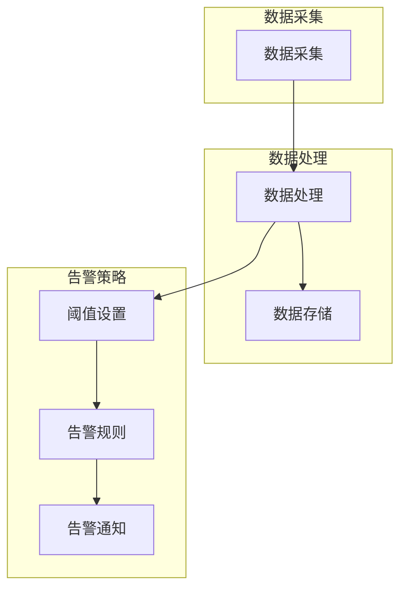
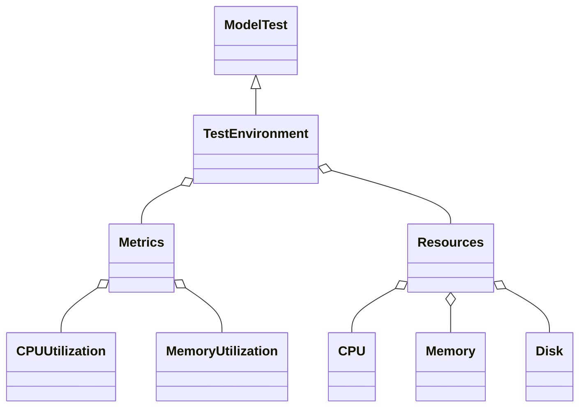
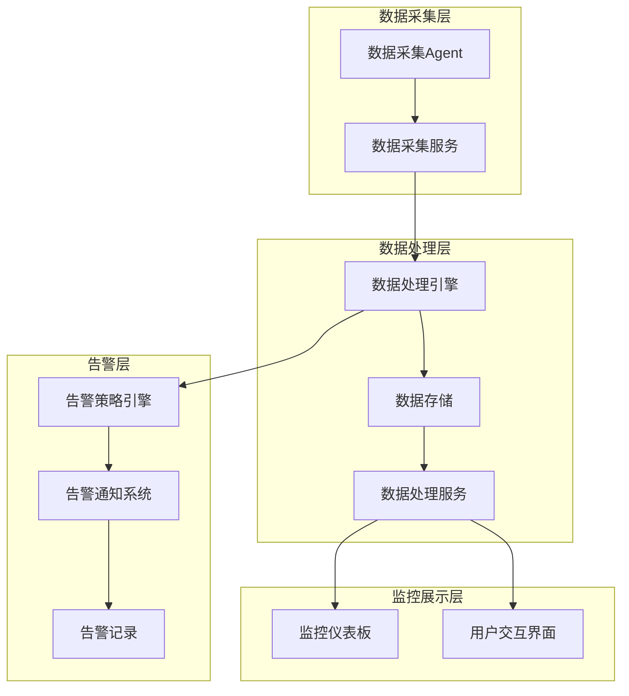

                 

### 引言

随着人工智能技术的发展，大型语言模型（LLM，Large Language Model）在自然语言处理（NLP，Natural Language Processing）领域展现出了巨大的潜力和影响力。LLM作为一种能够处理和理解人类语言的高级模型，已经广泛应用于搜索引擎、聊天机器人、语言翻译、文本生成等多个领域。然而，LLM的高复杂性和高敏感性使得其在测试和部署过程中面临诸多挑战。自动化LLM测试环境监控与告警系统成为确保模型稳定性和可靠性的关键环节。

#### 重要性

自动化LLM测试环境监控与告警的重要性主要体现在以下几个方面：

1. **保障模型稳定性**：自动化测试环境监控可以实时监测LLM模型的运行状态，及时识别和定位潜在问题，确保模型在运行过程中保持稳定。
2. **提高测试效率**：通过自动化监控，可以大幅提升测试效率，减少人工干预，节省时间和成本。
3. **优化开发流程**：自动化监控与告警机制能够及时反馈测试结果，帮助开发团队快速迭代和优化模型。
4. **提升用户体验**：稳定的LLM模型可以提供更高质量的服务，提升用户满意度和用户体验。

#### 背景与需求

在LLM的实际应用中，测试环境监控与告警的需求尤为迫切。以下是一些具体的背景和需求：

1. **复杂环境监控**：LLM模型的测试通常需要复杂的计算资源和网络环境，监控系统能够实时收集和评估这些资源的使用情况。
2. **多维度指标监控**：除了基本的CPU、内存等资源监控，LLM测试还需要对模型性能、输入输出质量等指标进行监控。
3. **异常检测与告警**：及时检测到异常情况并发出告警，可以快速响应，防止问题扩大，影响模型的应用效果。
4. **持续集成与部署**：随着LLM模型不断迭代更新，自动化监控与告警系统能够保证模型在集成和部署过程中的稳定性。

#### 全书结构概述

本文将分为以下章节：

1. **引言**：介绍自动化LLM测试环境监控与告警的重要性、背景与需求。
2. **核心概念与联系**：详细阐述LLM、测试环境监控与告警等核心概念，并使用表格和ER图进行对比和展示。
3. **算法原理讲解**：讲解监控告警算法的原理，包括流程图、Python源代码、数学模型和公式，并举例说明。
4. **系统分析与架构设计方案**：描述问题场景、系统需求，使用Mermaid绘制领域模型类图、系统架构图、系统接口和交互序列图。
5. **项目实战**：详细描述环境安装步骤、系统核心实现源代码与解读、实际案例分析，并进行项目小结与展望。
6. **最佳实践 tips、小结、注意事项、拓展阅读**：提供告警系统的最佳实践，总结全文，注意事项与安全防范，拓展阅读推荐。
7. **结论**：简要总结全书内容，强调自动化LLM测试环境监控与告警的重要性。

通过以上章节的详细阐述，本文将为读者提供一个全面、系统的自动化LLM测试环境监控与告警解决方案，助力人工智能技术的发展和应用。

---

**关键词**：自动化LLM测试，环境监控，告警系统，大型语言模型，测试效率，稳定性，算法原理，系统架构，项目实战，最佳实践。

**摘要**：本文详细介绍了自动化LLM测试环境监控与告警系统的重要性、核心概念、算法原理、系统架构、项目实战以及最佳实践。通过本文的阅读，读者将全面了解如何构建一个稳定、高效的自动化LLM测试环境监控与告警系统，为人工智能技术的发展和应用提供有力支持。

---

## 核心概念与联系

在深入探讨自动化LLM测试环境监控与告警系统之前，我们首先需要理解几个核心概念：大型语言模型（LLM）、测试环境监控和告警机制。这些概念不仅是本文讨论的基础，也是构建高效监控系统的关键。

### 自动化LLM测试环境

**定义与特点**：大型语言模型（LLM）是一种能够理解和生成自然语言的复杂模型。它通常通过大规模的文本数据进行训练，具备较强的语义理解能力和文本生成能力。自动化LLM测试环境是指利用计算机程序和自动化工具对LLM模型进行的一系列测试活动，包括模型训练、验证和部署等环节。

**自动化测试的优势与挑战**：

**优势**：
1. **效率高**：自动化测试可以快速、重复地进行，显著提高测试效率。
2. **一致性**：自动化测试减少了人为因素，确保测试结果的一致性。
3. **扩展性强**：自动化测试可以轻松扩展到更多测试场景，适应不同规模的测试需求。

**挑战**：
1. **复杂度**：LLM模型的复杂性导致自动化测试需要复杂的测试工具和脚本。
2. **环境依赖**：测试环境中的硬件、软件和网络等因素可能影响自动化测试的执行。
3. **测试覆盖**：确保自动化测试覆盖到所有可能的测试场景和边界条件是挑战之一。

### 测试环境监控

**监控目标**：测试环境监控的目的是实时收集和评估测试环境的各项指标，确保环境稳定、资源充足，以便顺利执行测试任务。主要监控目标包括：

1. **硬件资源**：CPU、内存、硬盘空间等硬件资源的使用情况。
2. **软件资源**：操作系统、数据库、中间件等软件的运行状态和性能。
3. **网络资源**：网络带宽、延迟、丢包率等网络指标。

**监控指标**：为了实现监控目标，我们需要设定一系列监控指标，如：

1. **资源利用率**：CPU利用率、内存利用率、磁盘利用率等。
2. **系统性能**：响应时间、吞吐量、并发连接数等。
3. **错误率**：系统错误、网络错误、硬件错误等。

**监控系统架构**：测试环境监控系统通常采用分布式架构，包括数据采集层、数据处理层、监控展示层和告警层。具体架构如下：

1. **数据采集层**：负责收集环境中的各项监控数据，如传感器、网络探针等。
2. **数据处理层**：对采集到的数据进行处理、存储和分析。
3. **监控展示层**：通过仪表板或可视化工具展示监控数据，提供直观的监控界面。
4. **告警层**：根据预设的告警策略，当监控指标超出阈值时，自动发送告警通知。

### 告警机制

**告警定义与目的**：告警机制是一种在监控指标超出阈值时自动触发通知的机制。它的目的是快速识别异常情况，及时采取措施，防止问题扩大。

**告警级别与策略**：

1. **告警级别**：根据告警的严重程度，告警通常分为以下级别：
   - **紧急告警**：系统处于严重故障状态，需要立即处理。
   - **重要告警**：系统存在潜在问题，需尽快解决。
   - **一般告警**：系统性能下降，但不影响核心功能。

2. **告警策略**：告警策略包括以下几个方面：
   - **阈值设定**：根据历史数据和业务需求设定监控指标的阈值。
   - **告警规则**：定义何时触发告警，如连续多分钟指标超出阈值。
   - **告警通知**：通过短信、邮件、即时通讯工具等方式发送告警通知。
   - **告警抑制**：为了避免频繁告警，对短时间内连续告警进行抑制处理。

### LLM与测试环境监控的ER图

为了更好地理解LLM与测试环境监控之间的关系，我们可以使用Mermaid绘制一个ER图（Entity-Relationship diagram）来展示这些核心实体及其关系。ER图可以帮助我们清晰明了地看到各个组成部分是如何相互关联和作用的。

以下是LLM测试环境监控的ER图的Mermaid表示：

```mermaid
erDiagram
  ModelTest --> TestEnvironment
  TestEnvironment ||--|{ Metrics}
  TestEnvironment ||--|{ Resources}
  Metrics ||--|{ CPUUtilization}
  Metrics ||--|{ MemoryUtilization}
  Metrics ||--|{ DiskUtilization}
  Resources ||--|{ CPU}
  Resources ||--|{ Memory}
  Resources ||--|{ Disk}
```

在这个ER图中，我们定义了以下几个实体：

- **ModelTest**：表示大型语言模型测试。
- **TestEnvironment**：表示测试环境。
- **Metrics**：表示监控指标，包括CPU利用率、内存利用率和磁盘利用率等。
- **Resources**：表示硬件资源，包括CPU、内存和磁盘等。

ER图展示了LLM测试与测试环境、监控指标和硬件资源之间的关系，为后续章节的具体讨论提供了结构框架。

通过上述核心概念和ER图的介绍，我们为理解自动化LLM测试环境监控与告警系统打下了坚实的基础。接下来，我们将深入探讨监控告警算法的原理，并详细介绍其在实际系统中的应用。

## 算法原理讲解

### 监控告警算法流程图

为了更好地理解自动化LLM测试环境监控与告警系统的工作原理，我们首先需要绘制一个监控告警算法的流程图。该流程图将展示从数据采集、处理到告警通知的全过程。

以下是使用Mermaid绘制的监控告警算法流程图：



**流程说明**：
1. **数据采集**：系统从各种数据源（如传感器、日志文件等）采集实时监控数据。
2. **数据处理**：对采集到的数据进行处理，包括数据清洗、格式转换和初步分析。
3. **数据存储**：将处理后的数据存储到数据库或其他存储介质中，以便后续查询和分析。
4. **阈值设置**：根据业务需求和历史数据，设定各监控指标的阈值。
5. **告警规则**：定义告警条件，如连续多分钟指标超出阈值，则触发告警。
6. **告警通知**：根据设定的告警规则，当监控指标超出阈值时，系统自动发送告警通知。

### 监控告警算法Python源代码讲解

下面是监控告警算法的Python源代码示例。代码展示了如何实现数据采集、数据处理、阈值设置和告警通知的基本功能。

```python
import psutil
import time
import smtplib
from email.mime.text import MIMEText

# 监控指标阈值
thresholds = {
    'CPUUtilization': 90,  # CPU利用率阈值
    'MemoryUtilization': 80,  # 内存利用率阈值
}

# 邮件通知函数
def send_alert(message):
    # 发送邮件通知
    mail_host = "smtp.example.com"
    mail_user = "user@example.com"
    mail_pass = "password"
    sender = 'alert@example.com'
    receivers = ['admin@example.com']

    message = MIMEText(message, 'plain', 'utf-8')
    message['From'] = sender
    message['To'] = receivers
    message['Subject'] = "告警通知"

    try:
        smtp_obj = smtplib.SMTP()
        smtp_obj.connect(mail_host, 25)  # 25为SMTP端口号
        smtp_obj.login(mail_user, mail_pass)
        smtp_obj.sendmail(sender, receivers, message.as_string())
        print("邮件发送成功")
    except smtplib.SMTPException as e:
        print("Error: 无法发送邮件", e)

# 数据采集与处理
def collect_data():
    data = {}
    data['CPUUtilization'] = psutil.cpu_percent()
    data['MemoryUtilization'] = psutil.virtual_memory().percent
    return data

# 主函数
def monitor():
    while True:
        data = collect_data()
        for metric, value in data.items():
            if value > thresholds[metric]:
                send_alert(f"{metric}超过阈值：{value}%")
        time.sleep(60)  # 每分钟检查一次

if __name__ == '__main__':
    monitor()
```

**代码解析**：

1. **阈值设置**：在`thresholds`字典中，我们设置了CPU和内存的利用率阈值。
2. **数据采集**：使用`psutil`库采集CPU和内存利用率数据。
3. **数据处理**：将采集到的数据存储在`data`字典中。
4. **告警规则**：当监控指标超过设定的阈值时，调用`send_alert`函数发送告警通知。
5. **告警通知**：使用`smtplib`库发送邮件通知。

### 监控告警算法的数学模型

监控告警算法的核心是监控指标阈值设置和告警规则定义。为了更深入地理解这些规则，我们需要引入一些数学模型和公式。

**监控指标阈值公式**：

设某监控指标为\(X\)，阈值设为\(T\)，则阈值公式可以表示为：

\[ X > T \]

例如，如果CPU利用率的阈值设置为90%，则当CPU利用率超过90%时，触发告警。

**告警规则定义**：

告警规则通常定义为一个时间窗口内的监控指标平均值或最大值超过阈值时触发告警。一个简单的告警规则公式为：

\[ \frac{1}{N} \sum_{i=1}^{N} X_i > T \]

其中，\(N\)为时间窗口内采集的监控指标数据点数量，\(X_i\)为第\(i\)个时间点的监控指标值。

**具体应用实例**：

假设我们设定一个1分钟时间窗口，CPU利用率的阈值设置为85%。在1分钟内，我们采集到5个CPU利用率数据点，分别为：80%，82%，87%，88%，90%。根据告警规则，计算这5个数据的平均值：

\[ \frac{80 + 82 + 87 + 88 + 90}{5} = 85.8 \]

由于平均值85.8超过了阈值85%，因此会触发告警。

通过上述数学模型和公式，我们可以更加科学和精确地设定监控告警策略，确保监控系统能够及时、准确地检测到异常情况。

### 举例说明

为了更好地理解监控告警算法在实际中的应用，我们通过一个具体实例来演示其工作流程。

**实例背景**：

假设我们正在监控一个大型语言模型（LLM）的测试环境，主要关注CPU利用率和内存利用率两个关键指标。我们设定CPU利用率的阈值为85%，内存利用率的阈值为75%。监控系统每隔1分钟采集一次这两个指标的当前值。

**实例步骤**：

1. **数据采集**：在第1分钟内，系统采集到以下数据：
   - CPU利用率：85%
   - 内存利用率：78%
2. **数据处理**：系统将采集到的数据存储在内存中，并计算过去1分钟的CPU和内存利用率的平均值。
3. **阈值判断**：计算得到的平均CPU利用率为85%，未超过阈值；平均内存利用率为78%，未超过阈值。因此，当前系统状态正常。
4. **监控持续**：系统继续每隔1分钟采集一次监控数据，并重复上述步骤。
5. **阈值触发**：在第5分钟内，系统采集到以下数据：
   - CPU利用率：90%
   - 内存利用率：80%
6. **阈值判断**：系统计算过去1分钟的CPU和内存利用率的平均值：
   - CPU利用率平均值：87%
   - 内存利用率平均值：79%
   由于CPU利用率平均值87%超过了设定的阈值85%，系统触发告警。
7. **告警通知**：系统向管理员发送告警邮件，通知CPU利用率超过阈值。

**实例总结**：

通过这个实例，我们展示了监控告警算法在数据采集、数据处理、阈值判断和告警通知中的实际应用。监控告警算法不仅能够实时监控LLM测试环境的资源利用率，还能够及时发现和响应异常情况，确保测试环境的稳定性和可靠性。

综上所述，监控告警算法通过数学模型和编程实现，为自动化LLM测试环境监控与告警系统提供了科学和有效的解决方案。接下来，我们将进一步探讨系统架构设计，为构建高效、稳定的监控体系奠定基础。

## 系统分析与架构设计方案

在深入探讨自动化LLM测试环境监控与告警系统的具体实现之前，我们需要对系统进行详细的分析，明确问题场景和系统需求。通过系统分析与架构设计，我们能够构建一个高效、稳定且可扩展的监控系统。

### 问题场景描述

**背景**：

随着大型语言模型（LLM）在自然语言处理（NLP）领域的广泛应用，LLM的测试环境逐渐变得更加复杂和重要。测试环境需要具备高计算能力、丰富的数据资源和稳定的网络连接，以确保LLM模型在测试过程中的准确性和稳定性。

**场景**：

1. **模型训练与验证**：LLM模型在训练和验证过程中，需要大量的计算资源和数据支持。训练过程涉及大量的矩阵运算和梯度下降，对CPU和GPU性能要求极高。
2. **多环境部署**：测试环境可能包括本地环境、云端环境以及混合部署环境，这些环境在硬件配置、网络连接和资源利用率方面存在差异，需要统一监控和管理。
3. **持续集成与持续部署（CI/CD）**：在LLM模型的持续集成与持续部署过程中，自动化测试环境监控与告警系统能够确保每次模型更新和部署的稳定性和可靠性。
4. **异常处理与故障恢复**：在测试过程中，系统需要能够实时监测环境状态，快速识别和响应异常情况，如资源不足、网络中断等，确保测试流程的连续性和完整性。

### 系统需求

为了满足上述问题场景的要求，系统需要具备以下需求：

1. **高可用性与可靠性**：系统需具备高可用性，能够持续运行并保证监控数据的准确性和完整性。
2. **实时监控与告警**：系统需能够实时收集和监控测试环境的各项指标，如CPU利用率、内存利用率、网络延迟等，并在指标超出阈值时及时发出告警通知。
3. **可扩展性与可维护性**：系统应具备良好的可扩展性，能够支持多种测试环境和部署模式，同时易于维护和升级。
4. **数据存储与分析**：系统需能够存储历史监控数据，并提供数据分析和可视化工具，以便开发人员和管理员能够直观地了解系统运行状况。
5. **集成与兼容性**：系统需与其他系统（如CI/CD工具、日志管理系统等）进行集成，确保数据的一致性和监控的全面性。

### 领域模型类图

为了更清晰地展示系统中的各类实体及其关系，我们可以使用Mermaid绘制领域模型类图。以下是一个简化的领域模型类图，展示了系统中主要实体的关系。



**类图解析**：

- **ModelTest**：表示大型语言模型测试，是系统的核心实体。
- **TestEnvironment**：表示测试环境，包括硬件资源和监控指标。
- **Metrics**：表示监控指标，如CPU利用率和内存利用率。
- **Resources**：表示硬件资源，包括CPU、内存和磁盘等。
- **CPUUtilization**、**MemoryUtilization**：具体监控指标实体。
- **CPU**、**Memory**、**Disk**：具体硬件资源实体。

通过领域模型类图，我们可以看到系统中的各类实体及其相互关系，为后续的系统架构设计提供了基础。

### 系统架构设计

为了满足上述系统需求，我们设计了一个分布式架构的系统，包括数据采集层、数据处理层、监控展示层和告警层。以下是系统架构的详细设计。

**1. 数据采集层**

数据采集层负责从各个测试环境实时收集监控数据。主要组件包括：

- **数据采集Agent**：部署在各个测试环境中，负责采集CPU利用率、内存利用率、磁盘利用率、网络延迟等监控指标。
- **数据采集服务**：接收和存储数据采集Agent发送的监控数据，并进行初步处理和清洗。

**2. 数据处理层**

数据处理层负责处理和存储采集到的监控数据，并提供数据分析和可视化功能。主要组件包括：

- **数据处理引擎**：对采集到的监控数据进行处理，包括数据清洗、格式转换和聚合分析。
- **数据存储**：存储处理后的监控数据，支持快速查询和数据分析。
- **数据处理服务**：提供数据查询、分析和可视化接口，支持实时监控和告警。

**3. 监控展示层**

监控展示层负责将处理后的监控数据通过可视化界面展示给用户。主要组件包括：

- **监控仪表板**：提供监控数据的可视化展示，包括图表、仪表盘和表格等形式。
- **用户交互界面**：允许用户自定义监控指标、阈值设置和告警通知。

**4. 告警层**

告警层负责根据监控数据触发告警通知，并记录告警历史。主要组件包括：

- **告警策略引擎**：根据监控指标和告警规则，判断是否触发告警。
- **告警通知系统**：发送告警通知，支持多种通知方式，如邮件、短信、即时通讯等。
- **告警记录**：记录告警历史，包括告警时间、告警原因、处理结果等。

### 系统架构图

以下是系统架构的Mermaid表示：



**架构图解析**：

- **数据采集层**：数据采集Agent部署在各个测试环境中，实时收集监控数据，发送到数据采集服务进行初步处理和存储。
- **数据处理层**：数据处理引擎对监控数据进行处理和分析，存储在数据存储中，并通过数据处理服务提供数据查询和可视化接口。
- **监控展示层**：监控仪表板和用户交互界面展示处理后的监控数据，支持用户自定义监控指标和告警设置。
- **告警层**：告警策略引擎根据监控数据和预设的告警规则判断是否触发告警，告警通知系统发送告警通知，告警记录记录告警历史。

通过上述系统分析与架构设计，我们为构建一个高效、稳定且可扩展的自动化LLM测试环境监控与告警系统奠定了基础。接下来，我们将通过实际项目来展示该系统的具体实现和应用。

## 项目实战

在本文的最后一部分，我们将通过一个实际项目来展示自动化LLM测试环境监控与告警系统的具体实现。本节将详细描述项目环境安装、系统核心实现源代码以及实际案例分析，帮助读者深入理解系统的实际应用。

### 项目环境安装

要实现一个自动化LLM测试环境监控与告警系统，我们需要安装和配置一系列软件和工具。以下是项目环境安装的详细步骤：

#### 1. 安装Python环境

确保系统上已经安装了Python 3.8及以上版本。可以通过以下命令检查Python版本：

```bash
python3 --version
```

如果未安装，请从[Python官网](https://www.python.org/)下载并安装。

#### 2. 安装依赖库

项目依赖多个Python库，如psutil、smtplib、pandas等。可以使用pip命令安装：

```bash
pip3 install psutil smtplib pandas
```

#### 3. 配置邮件服务

为了能够发送告警邮件，我们需要配置邮件服务。以下是一个简单的配置示例：

- 邮件服务器地址（SMTP Host）：`smtp.example.com`
- 邮件用户名：`user@example.com`
- 邮件密码：`password`
- 发送者邮箱：`alert@example.com`
- 接收者邮箱：`admin@example.com`

确保这些参数正确无误，并根据实际情况进行配置。

#### 4. 部署数据采集Agent

在测试环境中部署数据采集Agent。数据采集Agent是一个Python脚本，负责定期采集CPU利用率、内存利用率等监控数据，并将其发送到数据采集服务。

```bash
# 将以下内容保存为 data_agent.py
import psutil
import smtplib
import time
from email.mime.text import MIMEText

def send_alert(message):
    # 在这里填写邮件服务配置
    pass

def collect_data():
    data = {
        'CPUUtilization': psutil.cpu_percent(),
        'MemoryUtilization': psutil.virtual_memory().percent,
    }
    return data

while True:
    data = collect_data()
    send_alert(f"Current metrics: {data}")
    time.sleep(60)

# 在测试环境中运行 data_agent.py
python3 data_agent.py
```

#### 5. 部署数据采集服务

数据采集服务负责接收和处理来自数据采集Agent的监控数据。以下是一个简单的数据采集服务实现：

```bash
# 将以下内容保存为 data_collector.py
import socket
import json
import threading

def handle_client(client_socket):
    data = client_socket.recv(1024).decode('utf-8')
    print(f"Received data: {data}")
    client_socket.close()

    # 在这里可以存储或处理数据

    # 返回响应
    client_socket.sendall(b"OK")

    client_socket.close()

with socket.socket(socket.AF_INET, socket.SOCK_STREAM) as server_socket:
    server_socket.bind(('0.0.0.0', 12345))
    server_socket.listen()

    while True:
        client_sock

