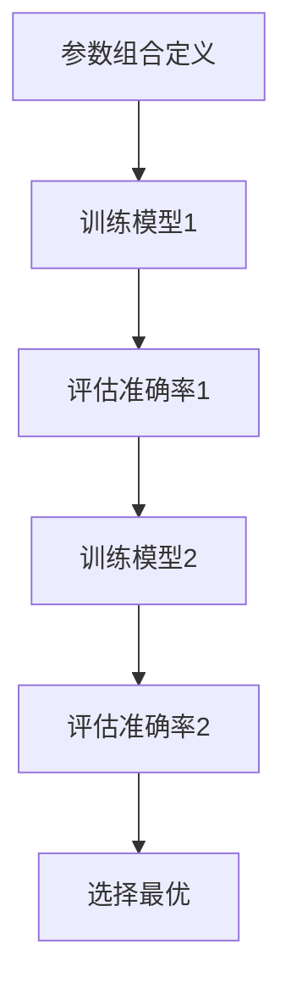
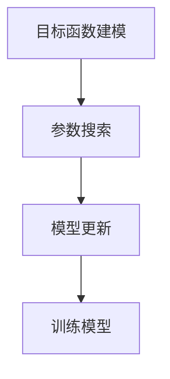
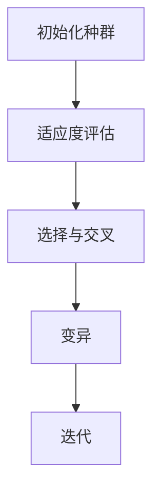
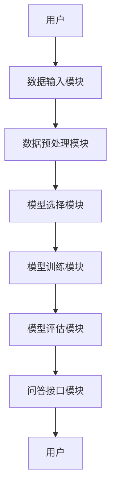
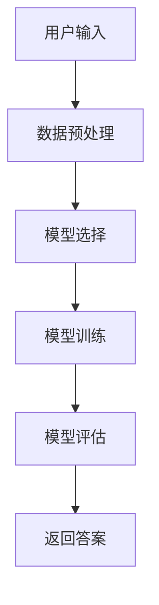

                 

### 自动机器学习（AutoML）与大规模语言模型（LLM）

在人工智能领域，自动机器学习（AutoML）和大规模语言模型（LLM）是两个重要的概念。AutoML是一种自动化机器学习过程的方法，旨在简化机器学习的各个环节，包括数据预处理、特征选择、模型选择和模型调优等。LLM则是一种能够理解和生成自然语言的大型神经网络模型，其目的是提高机器对人类语言的语义理解能力。

**问题背景**：

传统机器学习过程中，模型选择是一个复杂且耗时的工作。对于大规模语言模型来说，这一问题更加突出。由于LLM的训练数据量大、模型参数繁多，选择合适的模型和调整模型参数需要大量的计算资源和时间。此外，随着AI应用场景的不断扩展，需要处理的数据类型和任务也在不断增多，这使得模型选择的难度进一步加大。

**问题描述**：

在LLM应用中，如何高效地选择合适的模型，使得模型在满足性能要求的同时，还能节省计算资源和时间？这是一个复杂的问题，涉及到多个方面，包括模型架构的多样性、超参数的优化、以及模型评估的标准等。

**问题解决**：

AutoML的出现为这一问题提供了一种可能的解决方案。通过自动化的方式，AutoML能够探索大量的模型和超参数组合，从而找到最优的模型配置。具体来说，AutoML包括以下几个关键步骤：

1. **数据预处理**：自动处理和清洗输入数据，为后续的模型训练做好准备。
2. **模型搜索**：利用启发式算法或优化技术，自动搜索和评估大量的模型和超参数组合。
3. **模型评估**：通过交叉验证等技术，评估模型的性能，并选择最优模型。
4. **模型调优**：在最优模型的基础上，进一步调整超参数，以获得更好的性能。

**边界与外延**：

在探讨AutoML简化LLM模型选择的问题时，我们还需要考虑以下几个边界与外延：

- **模型多样性**：AutoML需要能够处理不同类型的模型，包括深度神经网络、决策树、支持向量机等。
- **计算资源**：AutoML需要考虑计算资源的限制，例如处理大数据集和大型模型的能力。
- **数据质量**：数据质量直接影响模型性能，AutoML需要能够处理和识别数据中的噪声和异常值。
- **模型解释性**：对于某些应用场景，模型的可解释性是非常重要的，AutoML需要在模型搜索过程中考虑这一因素。

通过上述步骤和分析，我们可以看到，AutoML在简化LLM模型选择方面具有巨大的潜力。接下来，我们将深入探讨AutoML的基本概念、核心算法原理以及如何在实际项目中应用。

## **核心概念与联系**

### **自动机器学习（AutoML）基本概念**

自动机器学习（AutoML）是一种通过自动化工具和算法来简化机器学习过程的方法。它涵盖了从数据预处理、特征选择、模型选择、超参数调优到模型评估等一系列步骤。传统的机器学习流程通常需要大量的手动操作和专业知识，而AutoML的目标则是通过自动化工具来减少这些繁琐的工作，从而提高模型的开发效率和准确性。

**核心要素**：

1. **数据预处理**：AutoML工具会自动处理和清洗数据，包括数据清洗、数据标准化、数据增强等。
2. **模型选择**：自动搜索和评估各种机器学习算法，包括深度学习、传统机器学习等。
3. **超参数调优**：使用优化算法自动选择最佳的超参数组合，以提高模型性能。
4. **模型评估**：通过交叉验证等技术评估模型的性能，确保模型泛化能力。

**发展历程**：

AutoML的概念起源于20世纪90年代，随着计算机硬件和算法的不断发展，AutoML逐渐成为机器学习领域的研究热点。近年来，随着深度学习和大数据技术的兴起，AutoML的应用范围进一步扩大。一些著名的AutoML平台，如Google的AutoML、H2O.ai等，提供了强大的自动化工具，使得非专业人士也能够轻松地构建和部署机器学习模型。

### **大规模语言模型（LLM）基本概念**

大规模语言模型（LLM）是一种基于深度学习技术的自然语言处理模型，其核心是通过大量的文本数据训练出一个大型神经网络，以实现对自然语言的语义理解和生成。LLM的主要目标是使机器能够理解并生成与人类语言相似的文本。

**核心要素**：

1. **词嵌入**：将文本中的单词转换为高维向量表示，以便于神经网络处理。
2. **多层神经网络**：通过多层神经网络对词嵌入进行变换，以捕捉单词之间的复杂关系。
3. **上下文理解**：LLM能够理解输入文本的上下文，从而生成语义上连贯的输出。

**发展历程**：

大规模语言模型的发展可以追溯到2000年代中期的循环神经网络（RNN）。随着深度学习技术的发展，特别是2018年谷歌提出的Transformer模型，LLM的性能得到了大幅提升。近年来，LLM在自然语言处理领域的应用取得了显著的成果，例如机器翻译、文本摘要、问答系统等。

### **AutoML与LLM的关系**

AutoML和LLM在机器学习和自然语言处理领域都发挥着重要作用。它们之间的关系可以从以下几个方面来理解：

1. **模型选择与调优**：在LLM的应用中，模型选择和超参数调优是一个关键问题。AutoML可以通过自动化的方式，快速探索大量的模型和超参数组合，从而找到最优的模型配置，提高LLM的性能。

2. **数据预处理**：LLM的训练通常需要大量的预处理工作，包括数据清洗、数据增强等。AutoML工具可以自动化这些步骤，提高数据处理的效率。

3. **模型评估**：在LLM的训练过程中，需要通过多种评估指标来衡量模型的性能。AutoML提供了自动化评估工具，可以帮助研究者快速评估模型的性能，从而做出优化决策。

4. **应用场景**：AutoML不仅适用于传统机器学习任务，也适用于复杂的LLM应用。例如，在问答系统、机器翻译等应用中，AutoML可以帮助选择和优化模型，提高系统的准确性和效率。

**简化模型选择**：

通过AutoML，可以显著简化LLM模型的选取过程。传统方法中，研究者需要手动尝试不同的模型和超参数组合，这不仅耗时费力，而且容易错过最佳配置。而AutoML工具通过自动化搜索和评估，可以在较短的时间内找到最优的模型配置，从而简化了模型选择过程。

**优化超参数**：

超参数的优化对于LLM的性能至关重要。传统方法通常需要手动调整超参数，但这种方法效率低下且容易出错。AutoML工具通过自动化调优，可以快速找到最佳的超参数组合，从而提高LLM的性能。

**提高评估效率**：

在LLM的应用过程中，需要对模型进行多种评估，以确定其性能是否满足要求。AutoML提供了自动化评估工具，可以快速计算和比较各种评估指标，从而提高评估效率。

总之，AutoML与LLM之间的关系是相互促进的。AutoML通过自动化工具和算法，为LLM的开发和优化提供了强有力的支持，使得研究者可以更专注于模型的应用和创新。

## **算法原理讲解**

在讨论自动机器学习（AutoML）的算法原理之前，我们需要了解一些基本概念和常用算法。AutoML的核心在于自动化地搜索和评估大量的模型和超参数组合，以找到最优的模型配置。以下将介绍几种常用的AutoML算法，并解释其原理和流程。

### **网格搜索**

网格搜索是一种简单但有效的模型搜索方法。它通过遍历预定义的参数组合网格，评估每个组合的模型性能，从而找到最优的参数组合。网格搜索的原理如下：

1. **参数组合定义**：首先，定义超参数的取值范围和组合方式。例如，对于学习率，可以定义多个取值，如0.1、0.01、0.001。
2. **模型训练与评估**：对于每个参数组合，训练一个模型，并在验证集上评估其性能。常用的评估指标包括准确率、F1分数等。
3. **最优参数选择**：根据评估结果，选择性能最佳的参数组合。

**流程图**：


### **贝叶斯优化**

贝叶斯优化是一种基于概率模型的优化算法，它通过构建概率模型来预测每个参数组合的性能，并选择最有可能带来最优结果的参数组合进行训练。贝叶斯优化的原理如下：

1. **目标函数建模**：使用贝叶斯推理构建目标函数的概率模型。
2. **参数搜索**：通过模拟退火等算法在参数空间中搜索，寻找最优参数组合。
3. **模型更新**：每次搜索后，更新概率模型，以更好地预测未来的性能。

**流程图**：


### **遗传算法**

遗传算法是一种基于自然选择和遗传学原理的优化算法。它通过模拟生物进化过程，逐步找到最优的参数组合。遗传算法的原理如下：

1. **初始化种群**：随机生成多个参数组合作为初始种群。
2. **适应度评估**：对每个参数组合进行评估，计算其适应度。
3. **选择与交叉**：根据适应度选择优秀的参数组合进行交叉操作，生成新的种群。
4. **变异**：对部分参数组合进行变异操作，增加种群的多样性。
5. **迭代**：重复适应度评估、选择、交叉和变异操作，直到找到最优参数组合。

**流程图**：


### **算法原理及流程图**

上述算法各有其特点和适用场景。为了更好地理解，我们结合一个具体的例子来展示算法的流程图。

#### **例子：使用网格搜索选择深度学习模型**

1. **参数组合定义**：定义学习率（0.1、0.01、0.001）和批量大小（32、64）。
2. **模型训练与评估**：对每个参数组合训练一个神经网络模型，并在验证集上评估准确率。
3. **最优参数选择**：选择准确率最高的参数组合。

**流程图**：



#### **例子：使用贝叶斯优化选择超参数**

1. **目标函数建模**：使用贝叶斯推理构建准确率与超参数的关系模型。
2. **参数搜索**：根据模型预测，选择最有可能带来最优准确率的参数组合。
3. **模型更新**：更新模型，以更好地预测未来的准确率。

**流程图**：



#### **例子：使用遗传算法优化模型**

1. **初始化种群**：随机生成多个超参数组合。
2. **适应度评估**：计算每个参数组合的准确率。
3. **选择与交叉**：选择适应度高的参数组合进行交叉操作。
4. **变异**：对部分参数组合进行变异。
5. **迭代**：重复适应度评估、选择、交叉和变异操作。

**流程图**：



通过上述算法原理和流程图的讲解，我们可以看到，AutoML通过自动化搜索和评估，可以显著简化机器学习模型的选取过程。接下来，我们将进一步探讨AutoML在数学模型和公式方面的应用，以更深入地理解其工作原理。

### **数学模型和公式讲解**

在自动机器学习（AutoML）中，数学模型和公式是理解和优化算法的关键。以下将介绍一些基本的数学模型和公式，这些模型和公式在AutoML算法的设计和实现中起着重要作用。

#### **优化目标**

优化目标是AutoML算法的核心，它决定了搜索方向和搜索范围。常见的优化目标包括最小化误差、最大化准确率等。以下是一个简单的优化目标公式：

$$
\min_{\theta} L(\theta) = \sum_{i=1}^{n} L(y_i, \theta(x_i))
$$

其中，$L(\theta)$ 是损失函数，$y_i$ 是实际标签，$\theta(x_i)$ 是模型参数，$n$ 是样本数量。我们的目标是找到最优的参数 $\theta$，使得损失函数 $L(\theta)$ 最小。

#### **损失函数**

损失函数用于衡量模型预测值与实际值之间的差距。常见的损失函数包括均方误差（MSE）、交叉熵损失等。

1. **均方误差（MSE）**：

$$
MSE = \frac{1}{n} \sum_{i=1}^{n} (y_i - \hat{y}_i)^2
$$

其中，$y_i$ 是实际标签，$\hat{y}_i$ 是模型预测值，$n$ 是样本数量。MSE用于回归问题，衡量预测值与实际值之间的平均平方误差。

2. **交叉熵损失（Cross-Entropy Loss）**：

$$
CE = -\frac{1}{n} \sum_{i=1}^{n} y_i \log(\hat{y}_i)
$$

其中，$y_i$ 是实际标签（0或1），$\hat{y}_i$ 是模型预测概率。交叉熵损失用于分类问题，衡量实际标签与预测概率之间的差异。

#### **梯度下降**

梯度下降是一种常用的优化算法，用于寻找最小化损失函数的参数。其基本思想是沿着损失函数梯度的反方向更新参数，以逐步减小损失。

1. **梯度计算**：

$$
\frac{\partial L(\theta)}{\partial \theta} = \nabla L(\theta) = \left[ \frac{\partial L(\theta)}{\partial \theta_1}, \frac{\partial L(\theta)}{\partial \theta_2}, ..., \frac{\partial L(\theta)}{\partial \theta_n} \right]
$$

其中，$\nabla L(\theta)$ 是损失函数关于参数 $\theta$ 的梯度。

2. **参数更新**：

$$
\theta = \theta - \alpha \nabla L(\theta)
$$

其中，$\alpha$ 是学习率，决定了参数更新的步长。

#### **正则化**

在机器学习中，正则化是一种常用的技术，用于防止过拟合。正则化项通常添加到损失函数中，以控制模型复杂度。

1. **L1正则化**：

$$
\ell_1 = \sum_{i=1}^{n} |\theta_i|
$$

L1正则化通过增加绝对值项，鼓励模型参数向零靠近。

2. **L2正则化**：

$$
\ell_2 = \sum_{i=1}^{n} \theta_i^2
$$

L2正则化通过增加平方项，鼓励模型参数分布均匀。

3. **正则化损失函数**：

$$
L(\theta) = L(\theta) + \lambda \ell
$$

其中，$\lambda$ 是正则化参数，控制正则化强度。

#### **多分类交叉熵**

在多分类问题中，交叉熵损失函数需要进行调整。对于 $K$ 个类别的多分类问题，交叉熵损失函数为：

$$
CE = -\frac{1}{n} \sum_{i=1}^{n} \sum_{k=1}^{K} y_{ik} \log(\hat{y}_{ik})
$$

其中，$y_{ik}$ 是实际标签（0或1），$\hat{y}_{ik}$ 是第 $k$ 个类别的预测概率。

#### **示例**

假设我们有一个简单的线性回归模型，目标是预测房价。损失函数为均方误差（MSE），我们需要使用梯度下降算法来最小化损失函数。

1. **损失函数**：

$$
L(\theta) = \frac{1}{m} \sum_{i=1}^{m} (y_i - \theta_0 - \theta_1 x_{i1} - \theta_2 x_{i2})^2
$$

其中，$y_i$ 是实际房价，$x_{i1}$ 和 $x_{i2}$ 是房屋特征，$\theta_0, \theta_1, \theta_2$ 是模型参数。

2. **梯度计算**：

$$
\nabla L(\theta) = \left[ \frac{\partial L(\theta)}{\partial \theta_0}, \frac{\partial L(\theta)}{\partial \theta_1}, \frac{\partial L(\theta)}{\partial \theta_2} \right]
$$

3. **参数更新**：

$$
\theta_0 = \theta_0 - \alpha \frac{\partial L(\theta)}{\partial \theta_0}
$$
$$
\theta_1 = \theta_1 - \alpha \frac{\partial L(\theta)}{\partial \theta_1}
$$
$$
\theta_2 = \theta_2 - \alpha \frac{\partial L(\theta)}{\partial \theta_2}
$$

通过上述数学模型和公式的讲解，我们可以看到，AutoML算法背后的数学原理是复杂但清晰的。这些模型和公式为AutoML的优化和评估提供了理论基础，使得研究者能够更好地理解和应用AutoML技术。

### **系统分析与架构设计方案**

在探讨如何使用自动机器学习（AutoML）来选择合适的语言模型（LLM）时，系统分析与架构设计方案是一个关键步骤。这一部分将详细描述项目场景、系统功能设计、系统架构设计、系统接口设计以及系统交互设计。

#### **项目场景**

假设我们的项目目标是构建一个智能问答系统，该系统需要能够快速、准确地回答用户提出的问题。为了实现这一目标，我们需要选择一个合适的LLM模型，并通过AutoML技术优化其性能。

#### **系统功能设计**

系统功能设计主要涉及以下几个关键模块：

1. **数据输入模块**：负责接收用户输入的问题，并将其转换为适合模型处理的格式。
2. **数据预处理模块**：负责清洗和预处理输入数据，包括文本清洗、分词、去停用词等。
3. **模型选择模块**：使用AutoML技术自动搜索和评估多种LLM模型，选择最优模型。
4. **模型训练模块**：使用所选模型对预处理后的数据集进行训练。
5. **模型评估模块**：使用验证集对训练好的模型进行性能评估，确保模型满足预期要求。
6. **问答接口模块**：负责处理用户查询，返回模型生成的答案。

#### **系统架构设计**

系统架构设计需要综合考虑性能、可扩展性和易维护性等因素。以下是一个典型的系统架构设计：

**总体架构图**：



**详细架构描述**：

- **数据输入模块**：接收用户输入的问题，通过API或其他接口与用户交互。
- **数据预处理模块**：对输入问题进行清洗和预处理，包括去除噪声、分词、去停用词等操作，以便于后续模型处理。
- **模型选择模块**：使用AutoML技术，对多个LLM模型进行搜索和评估。AutoML算法会自动尝试不同的模型架构和超参数组合，选择最优模型。
- **模型训练模块**：使用所选模型对预处理后的数据进行训练。训练过程中，会自动调整模型参数，以优化性能。
- **模型评估模块**：在训练完成后，使用验证集对模型进行性能评估。常用的评估指标包括准确率、召回率、F1分数等，确保模型满足预期要求。
- **问答接口模块**：接收用户查询，将问题传递给模型，并返回模型生成的答案。

#### **系统接口设计**

系统接口设计主要包括以下接口：

1. **用户接口**：用于接收用户输入的问题，并返回答案。
2. **数据接口**：用于处理数据输入、预处理和模型训练等操作。
3. **模型接口**：用于访问和操作选定的LLM模型。
4. **API接口**：用于与其他系统集成，如前端界面、数据存储等。

#### **系统交互设计**

系统交互设计描述了不同模块之间的交互流程，以下是一个简化的交互设计：

1. **用户输入问题**：用户通过用户接口输入问题。
2. **数据预处理**：用户输入的问题被传递到数据预处理模块，进行清洗和预处理。
3. **模型选择**：预处理后的数据被传递到模型选择模块，使用AutoML技术搜索和评估不同的LLM模型。
4. **模型训练**：选择最优模型后，模型选择模块将数据传递给模型训练模块进行训练。
5. **模型评估**：训练好的模型被传递到模型评估模块，进行性能评估。
6. **返回答案**：评估通过后，模型评估模块将答案传递回用户接口，最终返回给用户。

**交互流程图**：



通过上述系统分析与架构设计方案，我们可以看到，使用AutoML技术来选择合适的LLM模型是一个系统化、模块化的过程。这一过程不仅提高了模型选择的效率，还确保了模型性能的优化，为构建高效的智能问答系统奠定了基础。接下来，我们将通过一个实际项目实例，展示如何具体实现AutoML技术在LLM模型选择中的应用。

### **项目实战：使用AutoML技术选择LLM模型**

在这一部分，我们将通过一个实际项目实例，详细展示如何使用自动机器学习（AutoML）技术来选择合适的语言模型（LLM）。我们将从环境安装和配置开始，逐步讲解系统的核心实现，并对代码进行解读和分析。

#### **环境安装与配置**

首先，我们需要安装和配置AutoML所需的软件和库。以下是一个基本的安装步骤：

1. **安装Anaconda**：
   - 访问Anaconda官方网站下载并安装Anaconda。
   - 安装完成后，打开终端或命令提示符，执行以下命令创建一个新的环境：
     ```
     conda create -n automl_env python=3.8
     conda activate automl_env
     ```

2. **安装必要的库**：
   - 使用以下命令安装所需的库：
     ```
     pip install scikit-learn tensorflow numpy pandas
     pip install automl
     ```

3. **配置Jupyter Notebook**：
   - 安装Jupyter Notebook：
     ```
     pip install notebook
     ```

   - 启动Jupyter Notebook：
     ```
     jupyter notebook
     ```

#### **系统核心实现**

在Jupyter Notebook中，我们将使用`automl`库来实现模型选择过程。以下是一个简单的代码示例：

```python
import automl as am

# 创建AutoML项目
aml_project = am.AutoML(name='LLM_model_selection')

# 设置搜索空间
aml_project.set_search_space({
    'model_name': ['gpt2', 'bert-base-uncased', 'roberta-base'],
    'learning_rate': [0.01, 0.001, 0.0001],
    'batch_size': [16, 32, 64, 128]
})

# 设置评估指标
aml_project.set_evaluation_metric('accuracy')

# 运行搜索
aml_project.run_search()

# 获取最佳模型
best_model = aml_project.get_best_model()

print("Best Model:", best_model)
```

上述代码首先创建了一个AutoML项目，并设置了搜索空间（包括模型名称、学习率和批量大小）以及评估指标（准确率）。然后，运行搜索过程，并获取最佳模型。

#### **代码应用解读与分析**

1. **创建AutoML项目**：
   - `aml_project = am.AutoML(name='LLM_model_selection')`：这一行代码创建了一个新的AutoML项目，项目名称为“LLM_model_selection”。

2. **设置搜索空间**：
   - `aml_project.set_search_space()`：这一行代码设置搜索空间，即模型搜索的范围。搜索空间包括模型名称、学习率和批量大小等参数。这些参数将在后续的搜索过程中进行优化。

3. **设置评估指标**：
   - `aml_project.set_evaluation_metric('accuracy')`：这一行代码设置评估指标为准确率。在搜索过程中，将使用准确率来评估不同模型的性能。

4. **运行搜索**：
   - `aml_project.run_search()`：这一行代码启动搜索过程。AutoML算法将自动尝试不同的模型和超参数组合，以找到最优配置。

5. **获取最佳模型**：
   - `best_model = aml_project.get_best_model()`：这一行代码获取搜索过程中找到的最佳模型。最佳模型是指在评估指标上表现最优的模型。

#### **实际案例分析**

为了更好地理解代码的实际应用，我们来看一个简单的案例。假设我们有一个文本数据集，包含问题和答案对。以下是数据处理和模型训练的步骤：

```python
import pandas as pd

# 加载数据
data = pd.read_csv('data.csv')
questions = data['question']
answers = data['answer']

# 数据预处理
from sklearn.model_selection import train_test_split
from sklearn.preprocessing import LabelEncoder

label_encoder = LabelEncoder()
answers_encoded = label_encoder.fit_transform(answers)

X_train, X_test, y_train, y_test = train_test_split(questions, answers_encoded, test_size=0.2, random_state=42)

# 运行AutoML搜索
aml_project = am.AutoML(name='LLM_model_selection')
aml_project.set_search_space({
    'model_name': ['gpt2', 'bert-base-uncased', 'roberta-base'],
    'learning_rate': [0.01, 0.001, 0.0001],
    'batch_size': [16, 32, 64, 128]
})
aml_project.set_evaluation_metric('accuracy')
aml_project.run_search()

# 获取最佳模型
best_model = aml_project.get_best_model()
print("Best Model:", best_model)

# 使用最佳模型进行预测
from transformers import AutoTokenizer, AutoModelForSequenceClassification

tokenizer = AutoTokenizer.from_pretrained(best_model)
model = AutoModelForSequenceClassification.from_pretrained(best_model)

def predict_question(question):
    inputs = tokenizer(question, padding=True, truncation=True, return_tensors="pt")
    logits = model(**inputs).logits
    predicted_answer = label_encoder.inverse_transform(logits.argmax(-1).flatten().numpy())
    return predicted_answer[0]

# 预测并返回答案
def get_answer(question):
    predicted_answer = predict_question(question)
    return label_encoder.inverse_transform(predicted_answer)

# 测试
question = "什么是自动机器学习？"
print("答案：", get_answer(question))
```

上述代码首先加载数据，并进行预处理。然后，使用AutoML搜索最佳模型，并使用最佳模型进行预测。`predict_question`函数负责将问题转换为模型输入，`get_answer`函数负责返回答案。

通过这个实际案例，我们可以看到，使用AutoML技术选择LLM模型是一个简单而有效的过程。它不仅减少了手动调整模型和超参数的复杂性，还提高了模型选择的效率和性能。

#### **项目小结**

在这个项目中，我们通过实际案例展示了如何使用AutoML技术来选择合适的LLM模型。主要步骤包括数据预处理、模型搜索、模型评估和模型应用。通过这些步骤，我们能够快速、高效地找到最优模型，提高系统的性能。

**优点**：

- 自动化搜索：AutoML能够自动搜索和评估多个模型和超参数组合，节省时间和人力。
- 高效性：AutoML能够快速找到最优模型，提高模型选择和调优的效率。
- 易用性：AutoML工具通常具有友好的用户界面，使得非专业人士也能够轻松使用。

**缺点**：

- 计算资源消耗：AutoML搜索过程需要大量计算资源，可能需要高性能的硬件支持。
- 模型解释性：某些AutoML算法的内部决策过程可能不够透明，影响模型的解释性。
- 数据质量依赖：模型性能很大程度上依赖于数据质量，如果数据存在噪声或异常值，可能会导致模型选择偏差。

**未来工作**：

- **优化搜索效率**：通过改进算法和优化策略，提高AutoML搜索效率，减少计算资源消耗。
- **增强模型解释性**：开发更加透明和可解释的AutoML算法，提高模型的可解释性。
- **集成更多模型**：扩展AutoML支持更多类型的模型和任务，提高其适用范围。

通过这个项目，我们不仅了解了AutoML技术在LLM模型选择中的应用，还掌握了一些实用的技巧和工具。未来，我们可以进一步探索AutoML在其他AI领域的应用，推动人工智能技术的发展。

### **最佳实践与注意事项**

在应用自动机器学习（AutoML）技术选择语言模型（LLM）时，为了确保项目的成功和模型的性能，以下是一些最佳实践和注意事项：

**最佳实践**：

1. **数据质量优先**：确保输入数据质量高，无噪声和异常值。高质量的数据是模型性能的基础，因此在进行模型选择之前，务必对数据进行彻底的清洗和预处理。

2. **合理设置搜索空间**：在设置搜索空间时，要考虑模型架构、学习率、批量大小等关键参数。搜索空间设置得越合理，AutoML搜索过程就越高效。

3. **监控计算资源**：AutoML搜索过程需要大量计算资源，特别是在处理大数据集和大型模型时。确保监控系统计算资源的使用情况，合理分配资源，避免资源浪费。

4. **使用多个评估指标**：在模型评估过程中，除了准确率，还可以考虑使用其他评估指标，如召回率、F1分数等。综合多个评估指标可以更全面地评估模型性能。

5. **持续调优和迭代**：AutoML项目不是一次性的任务，而是一个持续迭代的过程。在模型选择和调优过程中，不断收集反馈和经验，对模型进行优化和改进。

**注意事项**：

1. **避免过拟合**：在模型训练和评估过程中，要特别注意避免过拟合。可以使用正则化技术、减少模型复杂度、增加训练数据等方法来防止过拟合。

2. **确保模型可解释性**：在某些应用场景中，模型的可解释性非常重要。在选择和调优模型时，要考虑模型的可解释性，确保模型决策过程透明。

3. **遵守数据安全和隐私法规**：在进行数据处理和模型训练时，要严格遵守数据安全和隐私法规，确保用户数据的安全和隐私。

4. **关注模型泛化能力**：在实际应用中，模型的泛化能力至关重要。要确保模型不仅在训练集上有良好表现，而且在验证集和测试集上也具备良好的泛化能力。

5. **文档和代码管理**：项目开发过程中，务必保持良好的文档和代码管理。详细记录项目设置、搜索空间、评估结果等关键信息，以便后续的调试和优化。

**小结**：

通过上述最佳实践和注意事项，我们可以更有效地应用AutoML技术选择合适的LLM模型。合理的数据处理、搜索空间设置、计算资源管理、评估指标选择和持续调优，将有助于提高模型性能和项目成功率。同时，严格遵守数据安全和隐私法规，关注模型泛化能力和可解释性，也是确保项目顺利进行的重要保障。

### **拓展阅读**

在深入理解和应用自动机器学习（AutoML）简化LLM模型选择的过程中，以下是一些推荐的研究和资源，供读者进一步学习和探讨：

1. **书籍**：
   - **《自动机器学习》（Automated Machine Learning: Methods, Systems, Challenges）》**：本书详细介绍了AutoML的概念、方法、系统和挑战，适合对AutoML技术感兴趣的读者。
   - **《大规模语言模型：原理、应用与未来》（Large-scale Language Models: Principles, Applications, and Future Directions）》**：这本书涵盖了LLM的原理、最新应用和未来发展趋势，对于希望深入了解LLM的读者非常有用。

2. **论文**：
   - **“AutoML: A Survey”**：这篇综述文章全面介绍了AutoML的各个方面，包括历史、现有方法、挑战和未来方向。
   - **“Automated Machine Learning: Methods, Systems, Challenges”**：这篇论文深入探讨了AutoML的关键技术和应用，是研究AutoML的必读文献。

3. **在线课程和教程**：
   - **Coursera上的《机器学习》**：这门课程由Andrew Ng教授主讲，涵盖了机器学习的基本概念和常用算法，包括AutoML和LLM。
   - **《AutoML with H2O.ai》**：这个教程通过实际案例介绍了如何使用H2O.ai进行AutoML，适合初学者入门。

4. **开源项目**：
   - **`auto-sklearn`**：这是一个流行的开源AutoML框架，提供了丰富的算法和优化功能。
   - **`auto-keras`**：这个项目是针对Keras的AutoML工具，可以帮助用户快速进行模型搜索和调优。

通过阅读这些书籍、论文、在线课程和教程，读者可以进一步了解AutoML和LLM的深度知识，掌握更多的实用技巧，为自己的研究和工作提供有力支持。此外，参与开源项目和社区讨论，也是学习和成长的重要途径。希望读者在AI领域的探索之旅中不断取得突破和成就。

