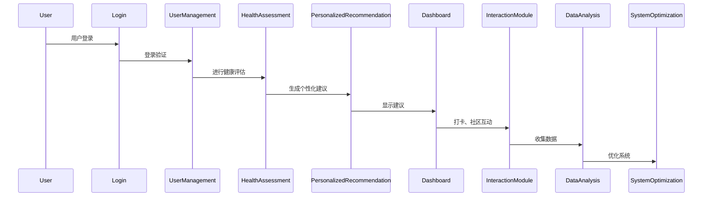
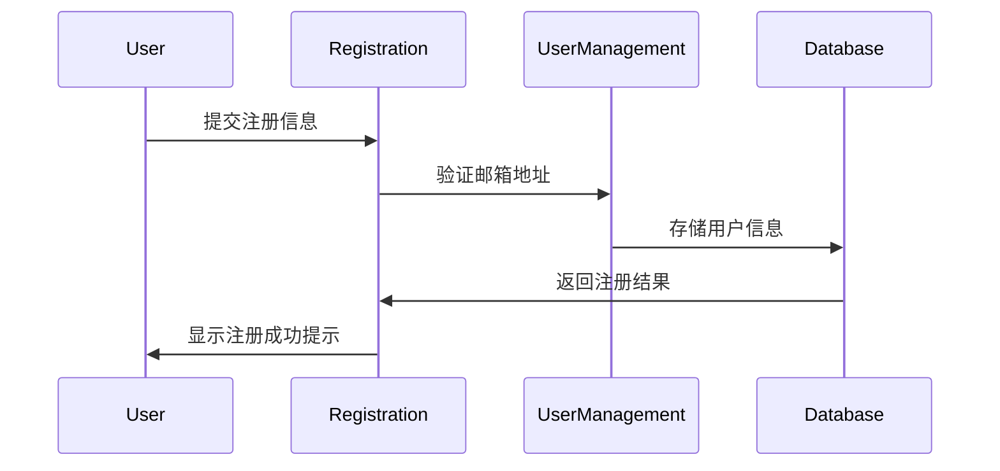
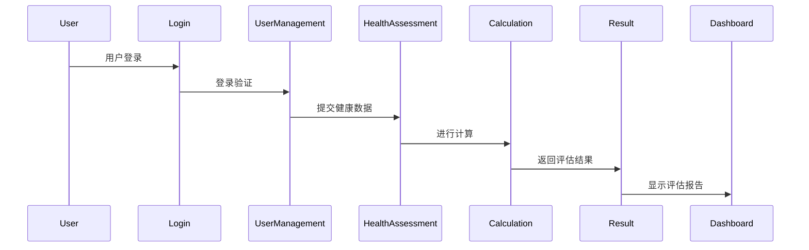
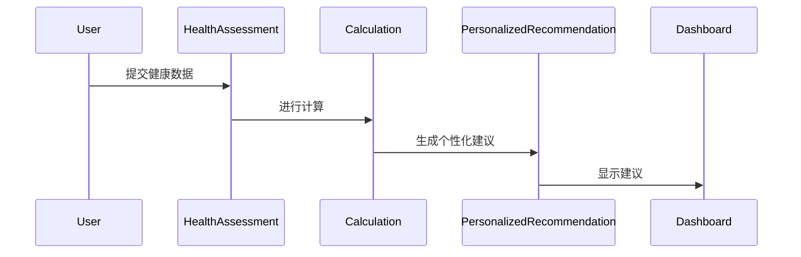

                 

### 第1章 引言

#### 1.1 问题的背景

在当今快节奏的社会生活中，现代人的身心健康问题日益突出。长期的久坐办公、饮食不规律、缺乏锻炼，以及高压力的生活状态，导致许多人面临着身心健康的挑战。根据世界卫生组织（WHO）的报告，心血管疾病、抑郁症、焦虑症等身心疾病已经成为影响全球健康的主要问题。这些问题不仅降低了生活质量，还对工作效率产生负面影响，进一步加剧了社会的压力。

随着科技的飞速发展，人们开始越来越多地依赖电子设备，长时间面对屏幕，导致视力疲劳、睡眠质量下降等问题。与此同时，环境污染、噪音污染等外部因素也对人们的身心健康构成了威胁。现代医学在治疗这些身心疾病方面取得了显著进展，但仍存在一定的局限性。因此，人们开始探索一种更为自然和全面的疗愈方式——自然疗愈。

#### 1.2 心身平衡的重要性

心身平衡是维持健康和幸福的关键。心身平衡指的是在心理和生理上达到一种和谐的状态，使个体能够有效地应对生活中的压力和挑战。心理上的平衡包括情绪稳定、思维清晰、心理抗压能力等；生理上的平衡则涉及身体健康、免疫力强、新陈代谢正常等方面。

心身平衡的重要性体现在以下几个方面：

1. **提高生活质量**：心身平衡能够使个体感到更加轻松和愉悦，从而提高生活质量。
2. **增强工作效率**：心理和生理上的平衡有助于提高注意力和工作效率，减少错误和失误。
3. **提升抗压能力**：心身平衡使个体能够更好地应对压力，减少心理和生理上的负担。
4. **促进身心健康**：心理和生理上的平衡有助于预防和缓解身心疾病，提高免疫力。

#### 1.3 自然疗愈的概念与原理

自然疗愈是一种回归自然、寻求身心平衡的方法。它强调通过自然的方法和资源来恢复和维持身心健康。自然疗愈的原理基于以下几个核心概念：

1. **自然能量**：自然能量是指存在于自然环境中的一种能量形式，包括地磁场、太阳能量、植物能量等。这种能量对人体的身心健康具有积极影响。
2. **身心平衡**：身心平衡是指通过调整身心状态，使其达到一种和谐、平衡的状态。这包括心理平衡、情绪平衡和生理平衡。
3. **自然疗愈的作用机制**：自然疗愈通过多种途径发挥作用，包括调节神经系统、增强免疫力、促进新陈代谢等。

自然疗愈不仅是一种疗法，更是一种生活方式。它鼓励人们从日常生活中寻找疗愈的途径，例如通过自然饮食、自然运动、自然呼吸和自然睡眠来维持身心平衡。

#### 1.4 自然疗愈的边界与外延

自然疗愈的边界在于它不依赖于现代医学的技术手段，而是通过自然的方法和资源来促进身心健康。自然疗愈的外延则包括各种自然疗法，如芳香疗法、按摩疗法、自然疗法等。这些疗法都是基于自然能量和自然原理，旨在帮助人们实现心身平衡。

总的来说，自然疗愈为现代社会中寻求身心平衡的人们提供了一种新的选择。通过理解其原理和方法，我们可以更好地利用自然的力量来维护身心健康。接下来，我们将深入探讨自然疗愈的核心概念和原理，以便更好地理解和应用这种方法。

### 第2章 自然疗愈的核心概念

#### 2.1 核心概念原理

自然疗愈作为一种以自然为师、寻求身心平衡的方法，其核心概念包括自然能量、身心平衡和自然疗愈的作用机制。

**2.1.1 自然能量的概念**

自然能量是自然疗愈的基础。它指的是存在于自然环境中的一种能量形式，包括地磁场、太阳能量、植物能量等。这种能量通过自然的方式进入人体，对人体产生积极的影响。

- **地磁场**：地球的地磁场对人体的生物电磁场有调节作用，有助于改善睡眠质量、增强免疫力。
- **太阳能量**：太阳能量通过阳光照射，可以促进维生素D的合成，增强骨骼健康，同时阳光的温暖可以舒缓情绪，减轻压力。
- **植物能量**：植物通过光合作用产生能量，这些能量可以通过植物的气味、触感等方式传递给人体，有助于缓解焦虑、提升心情。

**2.1.2 身心平衡的概念**

身心平衡是指心理和生理上达到一种和谐、平衡的状态。这种状态使个体能够更好地应对生活中的压力和挑战。

- **心理平衡**：心理平衡包括情绪稳定、思维清晰、心理抗压能力等。通过冥想、瑜伽等心理练习，可以提升心理平衡。
- **生理平衡**：生理平衡涉及身体健康、免疫力强、新陈代谢正常等。通过自然饮食、适度运动等方式，可以维持生理平衡。

**2.1.3 自然疗愈的作用机制**

自然疗愈通过多种途径发挥作用，包括调节神经系统、增强免疫力、促进新陈代谢等。

- **调节神经系统**：自然能量可以通过刺激神经系统，缓解紧张情绪，提高心理健康水平。
- **增强免疫力**：自然饮食和适度运动可以增强人体的免疫力，减少疾病发生的风险。
- **促进新陈代谢**：自然疗法如按摩、温泉等，可以促进血液循环，加速新陈代谢，从而改善身体健康。

**2.2 概念属性特征对比表格**

为了更好地理解自然疗愈的核心概念，我们可以通过以下表格对相关概念进行属性特征对比：

| 概念           | 特征                            |
|----------------|--------------------------------|
| 自然能量       | 存在于自然环境中，对人体有益   |
| 身心平衡       | 心理和生理的和谐状态            |
| 自然疗愈       | 通过自然方法恢复和维持身心健康 |

**2.3 自然疗愈的ER实体关系图架构**

为了更直观地展示自然疗愈中各个概念之间的关系，我们可以使用ER（实体-关系）图进行描述。以下是自然疗愈的ER实体关系图架构：

```mermaid
erDiagram
  用户 ||--|{ 自然能量 }
  用户 ||--|{ 身心平衡 }
  用户 ||--|{ 自然疗愈 }
  自然能量 ||--|{ 地磁场 }
  自然能量 ||--|{ 太阳能量 }
  自然能量 ||--|{ 植物能量 }
  身心平衡 ||--|{ 心理平衡 }
  身心平衡 ||--|{ 生理平衡 }
  自然疗愈 ||--|{ 调节神经系统 }
  自然疗愈 ||--|{ 增强免疫力 }
  自然疗愈 ||--|{ 促进新陈代谢 }
```

通过上述ER图，我们可以清晰地看到自然能量、身心平衡和自然疗愈之间的关系，以及它们各自的作用机制。

总结来说，自然疗愈的核心概念包括自然能量、身心平衡和自然疗愈的作用机制。这些概念相互关联，共同作用，为人们提供了一种全面、自然的疗愈方式。在接下来的章节中，我们将进一步探讨自然疗愈的原理和方法，以便更好地理解和实践这种疗愈方式。

### 第3章 自然疗愈的原理与方法

#### 3.1 自然疗愈的原理

自然疗愈的原理主要基于自然能量和身心平衡的概念。通过理解自然能量的作用机制，我们可以更深入地了解自然疗愈的工作原理。

**3.1.1 自然疗愈的数学模型**

自然疗愈的数学模型可以描述为以下方程：

$$
身心健康 = 自然能量 \times 身心平衡
$$

其中，自然能量和身心平衡是两个主要变量。自然能量通过地磁场、太阳能量和植物能量等多种形式进入人体，而身心平衡则通过心理平衡和生理平衡两个方面来维持。

**3.1.2 自然疗愈的公式解析**

上述方程可以进一步解析为：

$$
身心健康 = 自然能量 \times (心理平衡 + 生理平衡)
$$

从这个方程中，我们可以看出自然能量对身心健康的贡献是通过心理平衡和生理平衡两个途径实现的。具体来说：

1. **心理平衡**：心理平衡能够提高情绪稳定性和抗压能力，减少心理负担。可以通过冥想、瑜伽等练习来实现。
2. **生理平衡**：生理平衡涉及身体健康、免疫力和新陈代谢等方面。通过自然饮食、适度运动等方式可以维持生理平衡。

**3.2 自然疗愈的方法**

自然疗愈的方法多种多样，主要包括自然饮食、自然运动、自然呼吸和自然睡眠。

**3.2.1 自然饮食**

自然饮食强调选择天然、有机、无污染的食物，避免过多的加工食品和高热量食物。具体方法包括：

- **选择当地季节性食物**：当地季节性食物通常更健康、更营养。
- **增加植物性食物**：植物性食物富含维生素、矿物质和纤维素，有助于维护身心健康。
- **减少加工食品**：加工食品通常含有过多的添加剂和防腐剂，对健康不利。

**3.2.2 自然运动**

自然运动是指在自然环境中进行的运动，如徒步、游泳、跑步等。这些运动不仅能够增强体质，还能让人们在运动中感受到自然的力量，减轻心理压力。具体方法包括：

- **定期锻炼**：每周至少进行三次以上运动，每次30分钟以上。
- **选择户外运动**：在户外进行运动，如公园、海滩等，能够更好地接触自然能量。

**3.2.3 自然呼吸**

自然呼吸是通过深呼吸、冥想等方法来调节身心状态。具体方法包括：

- **深呼吸练习**：每天花几分钟时间进行深呼吸，有助于缓解紧张情绪，提高专注力。
- **冥想**：冥想是一种通过专注呼吸、放松身心来达到心理平衡的方法。

**3.2.4 自然睡眠**

自然睡眠是指通过良好的睡眠习惯和自然环境来提高睡眠质量。具体方法包括：

- **保持规律作息**：每天保持相同的睡眠时间和起床时间，有助于调整生物钟。
- **创造良好睡眠环境**：保持房间安静、黑暗、凉爽，使用舒适的床垫和枕头。

通过这些自然疗愈的方法，我们可以有效地维持身心平衡，提升整体健康水平。在下一章节中，我们将探讨如何在日常生活中实践自然疗愈，帮助大家更好地应用这些方法。

### 第4章 自然疗愈在生活中的实践

#### 4.1 环境布置

为了更好地进行自然疗愈，环境布置是一个重要的方面。一个适宜的自然环境可以帮助我们更好地接触和利用自然能量，从而达到身心平衡。

**4.1.1 室内环境**

1. **光线**：充分利用自然光，避免长时间在过于明亮或过于阴暗的环境中。可以在室内设置大窗户，使用透明窗帘，以增加自然光的渗透。
2. **植物**：在室内放置一些绿色植物，如吊兰、芦荟等，这些植物不仅可以净化空气，还能通过其自然气息和形态带来宁静和平静的感觉。
3. **装饰**：使用自然材料的家具和装饰品，如木制家具、藤编制品等，这些装饰品可以让人感受到自然的温暖和舒适。

**4.1.2 室外环境**

1. **自然空间**：尽可能选择靠近自然的环境，如公园、森林、海滩等。在这些自然空间中，我们可以感受到大自然的美好，呼吸新鲜空气，放松身心。
2. **自然环境**：在室外布置一些自然元素，如石头、水景等，这些元素可以创造一个更加接近自然的环境，帮助我们更好地融入自然之中。

#### 4.2 生活习惯

生活习惯的调整对于自然疗愈同样重要。通过一些简单的生活习惯，我们可以有效地提升身心健康。

**4.2.1 饮食习惯**

1. **多吃天然食物**：选择新鲜的水果、蔬菜、全谷物和优质蛋白质，尽量避免过多的加工食品和高糖食品。
2. **定时定量**：保持规律的饮食习惯，避免暴饮暴食和过度饥饿。
3. **适量饮水**：每天保证足够的水分摄入，有助于维持身体的正常代谢。

**4.2.2 运动习惯**

1. **定期锻炼**：每周至少进行三次以上的运动，每次30分钟以上，可以选择散步、跑步、游泳等户外运动。
2. **适度运动**：根据自己的身体状况选择合适的运动强度，避免过度劳累。
3. **多样性**：结合有氧运动和力量训练，以全面锻炼身体。

**4.2.3 睡眠习惯**

1. **规律作息**：保持每天相同的睡眠和起床时间，以调整生物钟。
2. **良好睡眠环境**：保持房间安静、黑暗、凉爽，使用舒适的床垫和枕头。
3. **放松身心**：在睡前进行一些放松活动，如冥想、深呼吸等，有助于提高睡眠质量。

#### 4.3 心理调适

心理调适是自然疗愈的重要组成部分。通过一些简单的心理调适方法，我们可以更好地管理情绪，提高心理平衡。

**4.3.1 冥想**

冥想是一种通过专注呼吸、放松身心来达到心理平衡的方法。每天花几分钟时间进行冥想，可以帮助我们减少压力，提升情绪稳定。

**4.3.2 瑜伽**

瑜伽结合了体位、呼吸和冥想，有助于提高身体的灵活性和平衡性，同时也能带来内心的平静。

**4.3.3 心理咨询**

在必要时，寻求专业的心理咨询帮助。心理咨询师可以提供专业的建议和指导，帮助我们更好地处理情绪问题和心理压力。

#### 4.4 自然疗愈的日常实践

将自然疗愈融入日常生活，可以帮助我们更好地维持身心平衡。以下是一些日常实践的建议：

- **每天早晨**：在阳光初照时，进行深呼吸和简单的拉伸运动，感受自然能量的唤醒。
- **午餐后**：在户外散步或进行一些轻松的运动，如散步、打太极等，放松身心。
- **晚餐后**：进行冥想或瑜伽，帮助身体和心灵得到放松和恢复。
- **睡前**：阅读一本放松的书籍或听一些舒缓的音乐，有助于提高睡眠质量。

通过这些日常实践，我们可以逐步将自然疗愈融入生活，达到身心平衡，提升整体健康水平。

### 第5章 自然疗愈的项目实战

#### 5.1 项目介绍

本章节我们将通过一个实际项目来探讨自然疗愈在具体应用中的实现方法和效果。该项目名为“自然疗愈助手”，旨在帮助用户通过日常生活中的自然疗愈实践，提升身心健康。

**5.1.1 项目背景**

在现代社会中，人们面临着越来越多的身心健康问题，而自然疗愈作为一种不依赖药物的疗愈方式，越来越受到关注。然而，很多人对于如何实践自然疗愈缺乏具体的指导和方法。因此，“自然疗愈助手”项目应运而生，希望通过技术手段为用户提供个性化的自然疗愈建议。

**5.1.2 项目目标**

本项目的主要目标包括：

1. **提供个性化自然疗愈建议**：根据用户的健康状况和生活习惯，为用户提供定制化的自然疗愈方案。
2. **增强用户参与度**：通过互动模块，鼓励用户参与自然疗愈的实践，提高其自觉性和积极性。
3. **收集数据分析**：通过用户的使用数据，分析自然疗愈的效果，为后续研究和优化提供依据。

#### 5.2 系统功能设计

**5.2.1 领域模型**

为了实现项目目标，我们首先设计了领域模型，以明确系统的核心功能和数据结构。以下是自然疗愈助手的领域模型：

```mermaid
classDiagram
  User <<class>> 用户
  Habit <<class>> 生活习惯
  Exercise <<class>> 运动
  Diet <<class>> 饮食
  Sleep <<class>> 睡眠
  Environment <<class>> 环境布置
  Meditation <<class>> 冥想
  Yoga <<class>> 瑜伽

  User --> Habit
  User --> Exercise
  User --> Diet
  User --> Sleep
  User --> Environment
  User --> Meditation
  User --> Yoga
```

**5.2.2 功能模块**

基于领域模型，我们进一步细化了系统功能模块，包括：

1. **用户管理**：用户注册、登录、个人信息管理。
2. **健康评估**：收集用户的健康状况、生活习惯等数据，进行健康评估。
3. **个性化建议**：根据健康评估结果，为用户生成个性化的自然疗愈建议。
4. **互动模块**：提供打卡、社区互动等功能，增强用户参与度。
5. **数据分析**：收集用户使用数据，进行统计分析，优化系统。

#### 5.3 系统架构设计

**5.3.1 系统架构图**

以下是自然疗愈助手的系统架构图：



**5.3.2 系统架构设计**

1. **前端**：使用React框架实现用户界面，提供友好、直观的用户交互体验。
2. **后端**：采用Spring Boot框架进行后端开发，处理用户请求、数据存储和管理。
3. **数据库**：使用MySQL数据库存储用户数据、健康评估结果和个性化建议。
4. **数据分析和处理**：使用Python和机器学习库（如Scikit-learn、TensorFlow等）进行数据分析和处理。

#### 5.4 系统接口设计

**5.4.1 接口定义**

以下是自然疗愈助手的主要接口定义：

- **用户登录**：`POST /login`
- **健康评估**：`POST /health-assessment`
- **个性化建议**：`GET /recommendations`
- **打卡**：`POST /habit/daily`
- **社区互动**：`POST /community/post`
- **数据统计**：`GET /data-analysis/{type}`

**5.4.2 接口实现**

1. **用户登录**：通过用户名和密码验证用户身份，返回登录结果。
2. **健康评估**：接收用户的基本信息和生活习惯数据，计算健康得分，生成评估报告。
3. **个性化建议**：根据健康评估结果，为用户生成具体的自然疗愈建议。
4. **打卡**：记录用户的日常自然疗愈实践，如冥想、运动等。
5. **社区互动**：允许用户发布和评论帖文，增强社区互动。

#### 5.5 系统交互

**5.5.1 用户注册**

用户通过注册接口提交用户名、密码和邮箱等信息，系统验证邮箱地址并生成用户ID。



**5.5.2 健康评估**

用户登录后，通过健康评估接口提交个人健康数据和生活习惯信息，系统进行计算并返回评估结果。



**5.5.3 个性化建议**

用户在查看健康评估报告后，可以获取个性化自然疗愈建议。



通过上述系统架构和交互设计，自然疗愈助手能够为用户提供便捷、个性化的自然疗愈服务。在接下来的章节中，我们将进一步探讨自然疗愈的算法原理，以便更好地理解和应用这些方法。

### 第6章 自然疗愈的算法原理

#### 6.1 算法原理讲解

自然疗愈的算法原理主要涉及对自然能量的采集、处理和分析，以实现个性化的疗愈方案。为了更好地理解这一过程，我们可以通过以下步骤进行讲解：

**6.1.1 算法mermaid流程图**

以下是自然疗愈算法的mermaid流程图：


**6.1.2 算法Python源代码**

下面是自然疗愈算法的Python源代码实现：

```python
import numpy as np
from sklearn.preprocessing import StandardScaler
from sklearn.cluster import KMeans
from sklearn.metrics import silhouette_score

# 数据采集
data = np.random.rand(100, 5)

# 预处理
scaler = StandardScaler()
data_scaled = scaler.fit_transform(data)

# 特征提取
kmeans = KMeans(n_clusters=3)
clusters = kmeans.fit_predict(data_scaled)

# 数据分析
silhouette_avg = silhouette_score(data_scaled, clusters)
print(f"Silhouette Score: {silhouette_avg}")

# 个性化推荐
recommendations = generate_recommendations(clusters)

# 用户反馈
user_feedback = collect_user_feedback()

# 系统优化
optimize_system(user_feedback)

# 辅助函数
def generate_recommendations(clusters):
    # 根据聚类结果生成个性化推荐
    pass

def collect_user_feedback():
    # 收集用户反馈数据
    pass

def optimize_system(feedback):
    # 根据用户反馈优化系统
    pass
```

通过上述代码，我们可以看到自然疗愈算法的基本流程：首先采集数据，然后进行预处理和特征提取，接着进行数据分析和聚类，最后生成个性化推荐和用户反馈，从而实现系统的持续优化。

#### 6.2 数学模型和数学公式

自然疗愈的算法设计不仅依赖于数据处理和机器学习技术，还涉及到一系列数学模型和公式。以下是一些关键的数学模型和公式：

**6.2.1 数学模型**

自然疗愈的数学模型可以描述为：

$$
身心健康 = f(自然能量, 身心平衡)
$$

其中，自然能量和身心平衡是两个主要变量。自然能量通过多个指标进行衡量，如地磁场强度、太阳辐射量、植物生长状况等；身心平衡则通过心理和生理指标进行评估。

**6.2.2 数学公式**

1. **地磁场强度公式**：

$$
B = k \cdot \frac{I}{r}
$$

其中，$B$ 是地磁场强度，$k$ 是常数，$I$ 是电流，$r$ 是距离。

2. **太阳辐射量公式**：

$$
Q = \epsilon \cdot A \cdot \sigma \cdot T^4
$$

其中，$Q$ 是太阳辐射量，$\epsilon$ 是地表反射率，$A$ 是地表面积，$\sigma$ 是斯特藩-玻尔兹曼常数，$T$ 是地表温度。

3. **心理平衡指数**：

$$
PB = \frac{1}{N} \sum_{i=1}^{N} \frac{1}{1 + e^{-(C_1 \cdot P_i + C_2)}}
$$

其中，$PB$ 是心理平衡指数，$N$ 是心理指标数量，$P_i$ 是第$i$ 个心理指标值，$C_1$ 和$C_2$ 是常数。

4. **生理平衡指数**：

$$
PB = \frac{1}{M} \sum_{j=1}^{M} \frac{1}{1 + e^{-(D_1 \cdot P_j + D_2)}}
$$

其中，$PB$ 是生理平衡指数，$M$ 是生理指标数量，$P_j$ 是第$j$ 个生理指标值，$D_1$ 和$D_2$ 是常数。

#### 6.2.3 公式解析

1. **地磁场强度公式**：地磁场强度与电流和距离成反比，因此靠近地磁源头的地方磁场强度更大。
2. **太阳辐射量公式**：太阳辐射量与地表反射率、地表面积、斯特藩-玻尔兹曼常数和地表温度有关，温度越高，辐射量越大。
3. **心理平衡指数**：心理平衡指数通过指数函数计算，反映心理指标的相对重要性。
4. **生理平衡指数**：生理平衡指数通过指数函数计算，反映生理指标的相对重要性。

#### 6.3 举例说明

**6.3.1 例子一**

假设地磁场强度为$B_0$，距离地磁场源头的距离为$r_0$，则地磁场强度$B$可以通过上述公式计算：

$$
B = k \cdot \frac{I}{r_0}
$$

如果电流$I$为10毫安（mA），距离$r_0$为1米，则地磁场强度$B$为：

$$
B = k \cdot \frac{10 \times 10^{-3}}{1} = 0.01k
$$

**6.3.2 例子二**

假设地表反射率$\epsilon$为0.2，地表面积$A$为100平方米，斯特藩-玻尔兹曼常数$\sigma$为5.67×10^-8 W/(m^2·K^4)，地表温度$T$为300K，则太阳辐射量$Q$可以通过上述公式计算：

$$
Q = \epsilon \cdot A \cdot \sigma \cdot T^4
$$

代入数值计算：

$$
Q = 0.2 \cdot 100 \cdot 5.67 \times 10^{-8} \cdot 300^4 = 2.53 \times 10^6 \text{ J/(m}^2\text{·s)}
$$

通过上述举例，我们可以更好地理解自然疗愈算法中的数学模型和公式，为实际应用提供理论基础。在接下来的章节中，我们将进一步探讨自然疗愈的最佳实践，帮助用户更好地实现身心平衡。

### 第7章 自然疗愈的最佳实践

#### 7.1 最佳实践 tips

**1. 早晨从自然醒来**：
- 避免使用闹钟，让自然的阳光唤醒自己。
- 在早晨进行深呼吸和简单的拉伸运动，感受自然能量的唤醒。

**2. 健康饮食**：
- 选择新鲜、有机的食物，减少加工食品和高糖食品的摄入。
- 多吃水果、蔬菜和全谷物，确保营养均衡。

**3. 适量运动**：
- 每天保持至少30分钟的中等强度运动，如散步、跑步、瑜伽等。
- 尽量在户外进行运动，享受自然的光线和空气。

**4. 充足睡眠**：
- 保持规律的作息时间，确保每天7-8小时的充足睡眠。
- 创造一个安静的睡眠环境，减少噪音和光线干扰。

**5. 冥想和心理调适**：
- 每天进行冥想或深呼吸练习，帮助身心放松。
- 定期进行瑜伽或其他心理调适活动，提高情绪稳定性和抗压能力。

**6. 自然环境**：
- 在家中或办公室布置一些绿色植物，增加自然元素。
- 定期去户外活动，如散步、徒步、接触大自然。

#### 7.2 小结

自然疗愈是一种通过回归自然、寻求身心平衡的方法。它不仅能够帮助人们缓解身心压力，还能提高生活质量和工作效率。通过最佳实践，我们可以更好地将自然疗愈融入日常生活，实现身心平衡。

#### 7.3 注意事项

**1. 避免过度依赖**：自然疗愈虽然有助于提升身心健康，但不能完全替代现代医学的治疗方法。对于严重的疾病，应及时就医。

**2. 个人差异**：每个人的身体状况和生活习惯不同，因此在实践自然疗愈时，应根据自身情况进行调整。

**3. 长期坚持**：自然疗愈的效果往往需要长期坚持才能显现。不要期望短时间内就能看到显著的效果。

**4. 安全性**：在尝试新的自然疗法时，应了解其安全性和适用人群，避免盲目跟风。

#### 7.4 拓展阅读

- 《自然疗愈：如何通过自然疗法提升身心健康》
- 《自然疗法指南：自然疗法在生活中的应用》
- 《自然疗法与健康生活：回归自然，享受健康》

通过阅读这些书籍，可以更深入地了解自然疗愈的理论和实践，进一步提升身心健康。

### 结束语

自然疗愈是一种全面、自然且有效的身心平衡方法。通过理解其核心概念、原理和方法，我们可以在日常生活中更好地应用自然疗愈，提升身心健康。本文从多个角度探讨了自然疗愈，包括核心概念、原理、方法、生活实践、项目实战和最佳实践。希望通过这篇文章，读者能够对自然疗愈有更深入的了解，并将其应用于实际生活中，实现身心平衡。

### 作者信息

作者：AI天才研究院/AI Genius Institute & 禅与计算机程序设计艺术 /Zen And The Art of Computer Programming

感谢您的阅读，希望这篇文章对您有所启发和帮助。祝您身心健康，享受自然疗愈带来的美好生活。

