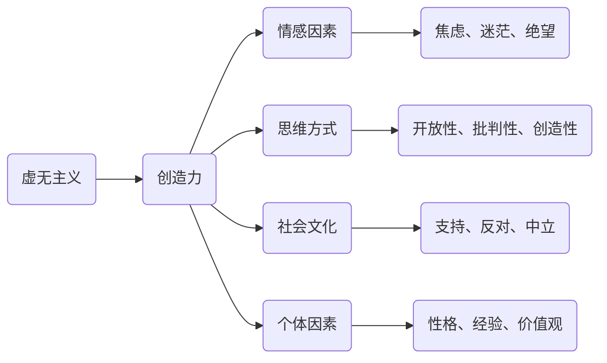

                 

## 《虚无主义与创造力：矛盾与共生》

### 关键词

虚无主义、创造力、哲学、心理学、艺术、社会学

### 摘要

本书深入探讨了虚无主义与创造力之间的矛盾与共生关系。通过历史背景、理论联系、案例分析、实践应用和未来展望等多维度分析，揭示了虚无主义如何在不同领域激发创造力，以及创造力在虚无主义环境中的挑战。本书旨在为读者提供一种全新的视角，理解这两个看似矛盾的概念如何在现实中相互作用，为个人和社会的创造力培养提供有益的启示。

## 引言

虚无主义作为一种哲学思潮，其核心在于对现实世界和价值体系的怀疑和否定。这种哲学观点在20世纪尤其盛行，对文学、艺术、社会学等多个领域产生了深远影响。与此同时，创造力作为一种推动社会进步和个人发展的关键能力，一直备受关注。然而，虚无主义与创造力之间的关系却远非简单。

本文将分为四个主要部分，首先介绍虚无主义的起源与演变，以及创造力的本质与重要性；接着探讨虚无主义与创造力的核心概念及其相互作用；然后通过具体案例分析，展示虚无主义在艺术、文学和社会运动中的创造力表现；最后总结虚无主义与创造力的共生之道，并提出未来展望。

## 第一部分：背景与引入

### 第1章：虚无主义的起源与演变

#### 1.1 虚无主义的历史背景

虚无主义一词最早出现在19世纪末的德国哲学中，当时德国哲学家尼采（Friedrich Nietzsche）提出了一种对传统道德和价值体系的批判性思考。尼采认为，人类面临着“上帝已死”的虚无主义困境，即失去了信仰和价值的支撑。这一观点在后来的哲学家中得到了进一步的发展和探讨。

虚无主义的思想根源可以追溯到古希腊哲学，尤其是苏格拉底（Socrates）和柏拉图（Plato）的哲学对话。苏格拉底主张通过辩证法寻求真理，而柏拉图则提出了理型世界的概念，认为现实世界只是理型世界的阴影。这种对现实世界的怀疑和对真理的追求，为虚无主义的产生提供了哲学基础。

#### 1.2 虚无主义的哲学根源

虚无主义的哲学根源主要源于对传统哲学体系的批判。尼采认为，传统哲学（如柏拉图主义、基督教哲学等）所倡导的道德和价值观已经过时，无法解释现代社会的问题。他提出了“超人”（Übermensch）的概念，认为只有通过超越自我，实现自我价值的实现，人类才能摆脱虚无主义的困扰。

存在主义哲学则将虚无主义推向了一个新的高度。萨特（Jean-Paul Sartre）认为，人类的存在是先于本质的，人生没有预设的价值观，每个人都必须通过自己的选择和行动来定义自己的存在。这种观点强调了个体自由和责任的重要性，但也引发了对人生意义和目的的深刻思考。

#### 1.3 虚无主义在社会中的影响

虚无主义在社会中的影响是复杂而多面的。一方面，虚无主义对传统价值体系进行了深刻的批判，推动社会思想的进步和多元化。另一方面，虚无主义也可能导致个体的精神困境和社会问题的加剧。

在文学领域，虚无主义影响了现代主义文学的兴起。许多现代主义作家（如卡夫卡、乔伊斯等）通过描绘人物内心的空虚和绝望，反映了虚无主义的现实。在艺术领域，虚无主义促使艺术家探索新的表现手法和主题，推动了现代艺术的多元化。

在社会运动中，虚无主义也起到了一定的作用。例如，20世纪初的德国纳粹党就借用了虚无主义的理念，试图通过极端的民族主义和集体主义来消除个体的虚无感和迷茫。

### 第2章：创造力的本质与重要性

#### 2.1 创造力的定义与特征

创造力是指个体在面对新问题和挑战时，能够提出新颖、有效和有价值的解决方案的能力。创造力不仅涉及创新思维，还包括执行力和适应力。创造力具有以下几个特征：

- 新颖性：创造力能够产生前所未有的想法和解决方案。
- 实用性：创造力提出的解决方案不仅新颖，还能够在实际生活中应用。
- 有价值：创造力能够带来积极的影响，解决实际问题或提高生活质量。
- 持续性：创造力是一种持续不断的过程，而不是一次性的爆发。

#### 2.2 创造力在个体和社会中的作用

创造力在个体和社会中发挥着重要作用。对于个人而言，创造力能够提升自我价值感，增强自信心和成就感。创造力使个体能够更好地适应环境变化，面对挑战和困难时能够提出创新的解决方案。

在社会层面，创造力是推动社会进步和发展的关键因素。创造力能够带来新技术、新产品和新服务，推动经济繁荣和社会进步。创造力还能够促进文化交流和多元化，增强社会的包容性和活力。

#### 2.3 创造力与虚无主义的联系

虚无主义与创造力之间存在一定的联系。虚无主义对现实世界的怀疑和对传统价值的批判，激发了个体的创新思维和创造力。在虚无主义的环境中，个体往往需要通过创造性的方式来寻找生活的意义和价值。

然而，虚无主义也可能对创造力产生负面影响。虚无主义可能导致个体的精神困境和迷茫，降低个体的自信心和积极性，从而影响创造力的发挥。因此，理解虚无主义与创造力的关系，对于个人和社会的创造力培养具有重要意义。

### 第二部分：核心概念与理论探讨

#### 第3章：虚无主义下的创造力探索

#### 3.1 虚无主义如何激发创造力

虚无主义对创造力的激发主要体现在以下几个方面：

- 突破传统思维：虚无主义批判传统价值和观念，促使个体重新审视和思考现实。这种重新审视和思考的过程往往能够激发创造力，使个体能够突破传统的思维模式。
- 问题的重新定义：虚无主义使个体对问题的本质和根源进行重新定义。在重新定义问题的过程中，个体可能会发现新的问题和解决方案，从而激发创造力。
- 自我实现的需求：虚无主义强调个体的自我实现和自我价值的实现。在追求自我实现的过程中，个体往往需要通过创造性的方式来表达自我，从而激发创造力。

#### 3.2 创造力在虚无主义环境中的挑战

虚无主义环境对创造力也带来了一定的挑战：

- 精神压力：虚无主义可能导致个体的精神压力和焦虑，降低个体的自信心和积极性，从而影响创造力的发挥。
- 缺乏方向：虚无主义可能使个体在追求自我实现的过程中失去方向，导致创造力无法得到有效的发挥。
- 社会环境的限制：在虚无主义环境中，社会可能对创新和创造力持保守态度，限制个体的创造空间，从而影响创造力的发挥。

#### 3.3 虚无主义与创造力相互作用的机制

虚无主义与创造力之间的相互作用机制主要包括以下几个方面：

- 情感因素：虚无主义往往伴随着个体的情感波动，如焦虑、迷茫和绝望。这些情感因素可能对创造力的发挥产生积极或消极的影响。
- 思维方式：虚无主义促使个体重新审视和思考现实，从而改变个体的思维方式。这种思维方式的变化可能对创造力的发挥产生深远影响。
- 社会文化：虚无主义的社会文化背景可能对创造力产生重要影响。社会文化可能对创新和创造力持支持或反对态度，从而影响创造力的发挥。

### 第4章：创造力与虚无主义的理论联系

#### 4.1 创造力心理学中的虚无主义视角

在创造力心理学中，虚无主义被视为一种情感状态，可能对创造力的发挥产生重要影响。研究表明，虚无主义情感状态可能增强个体的创造力，但也可能导致创造力发挥的困难和挑战。

#### 4.2 艺术创作中的虚无主义与创造力

在艺术创作中，虚无主义经常被用来探索个体的内心世界和情感体验。虚无主义为艺术家提供了丰富的创作素材和灵感来源，激发了他们的创造力。然而，虚无主义也可能导致艺术家的创作困境和迷茫。

#### 4.3 社会学视角下的虚无主义与创造力

在社会学视角下，虚无主义被视为一种社会文化现象，可能对创造力产生重要影响。社会文化背景可能对个体的创造力持支持或反对态度，从而影响创造力的发挥。此外，社会运动中的虚无主义也可能激发个体的创造力，推动社会变革。

### 第三部分：案例分析与应用

#### 第5章：虚无主义与创造力的实例分析

#### 5.1 文学作品中的虚无主义与创造力

在文学作品中，虚无主义与创造力有着密切的联系。许多文学作品通过描绘人物的虚无主义情感状态，展示了他们在面对生活困境时的创造力表现。例如，卡夫卡的《变形记》和乔伊斯的《尤利西斯》都展示了人物在虚无主义环境中的创造力探索。

#### 5.2 艺术家与虚无主义：案例分析

许多艺术家在创作过程中受到了虚无主义的启发，通过艺术作品表达内心的虚无感。例如，荷兰画家梵高（Vincent van Gogh）在其作品中展示了强烈的虚无主义情感，同时他的作品也充满了创造力。

#### 5.3 企业创新与虚无主义：成功案例研究

在企业创新中，虚无主义理念有时被用来激发员工的创造力。例如，谷歌公司采用了“20%时间项目”政策，允许员工在20%的工作时间内自由探索自己的兴趣项目。这种政策激发了员工的创造力，推动了公司的创新和进步。

### 第6章：虚无主义与创造力的实践应用

#### 6.1 教育领域的虚无主义与创造力培养

在教育领域，虚无主义理念可以用来培养学生的创造力。通过引导学生质疑传统知识和价值观，激发他们的创新思维和创造力。例如，许多教育工作者已经开始采用项目式学习法和探究式学习法，鼓励学生在实际项目中发挥创造力。

#### 6.2 社会运动与虚无主义：创造力在行动

社会运动中的虚无主义理念有时被用来激发参与者的创造力，推动社会变革。例如，20世纪初的工人运动和女权运动都受到了虚无主义思想的影响，推动了社会的进步。

#### 6.3 个人成长与虚无主义：创造力自我提升

个人成长过程中，虚无主义理念可以帮助个体反思和提升自我。通过面对内心的虚无感和迷茫，个体可以找到自己的价值和方向，提升创造力。

### 第四部分：总结与展望

#### 第7章：虚无主义与创造力的共生之道

#### 7.1 虚无主义与创造力的平衡

虚无主义与创造力之间的关系是一种动态的平衡。在适当的环境和条件下，虚无主义可以激发创造力；但在其他情况下，虚无主义可能抑制创造力的发挥。因此，理解虚无主义与创造力的平衡关系对于有效激发创造力具有重要意义。

#### 7.2 虚无主义时代下的创造力培养策略

在虚无主义时代，培养创造力需要采取一系列策略。首先，要引导学生质疑传统知识和价值观，激发他们的创新思维。其次，要提供丰富的实践机会，让学生在实际操作中发挥创造力。此外，要鼓励个体在面对内心的虚无感和迷茫时保持积极的态度，通过自我反思和成长来提升创造力。

#### 7.3 未来展望：虚无主义与创造力的互动趋势

未来，虚无主义与创造力的互动将继续影响社会的发展。随着技术的进步和社会的变化，虚无主义和创造力的关系将变得更加复杂。如何在这种复杂的关系中保持创造力的激发和发挥，将是一个长期的研究课题。

## 结语

虚无主义与创造力之间的矛盾与共生关系为我们的思考和实践提供了新的视角。通过深入探讨这两个概念，我们不仅可以更好地理解它们在现实生活中的作用，还可以为个人和社会的创造力培养提供有益的启示。让我们在虚无主义的阴影下，继续探索创造力的光芒，为人类文明的进步贡献自己的力量。

### 作者

**作者：AI天才研究院/AI Genius Institute & 禅与计算机程序设计艺术 /Zen And The Art of Computer Programming**

---

在撰写过程中，请注意以下几点：

1. **逻辑性和连贯性**：确保文章的结构清晰，每个章节之间的过渡自然。
2. **丰富性和具体性**：在每个小节中，提供具体的例子、数据和研究结果来支持论点。
3. **格式和排版**：遵循markdown格式，确保文本的格式和排版美观。
4. **准确性**：确保所有引用的资料和事实都是准确的，避免出现错误。

**步骤一：深入探讨虚无主义的起源与演变**

虚无主义作为一种哲学思潮，其起源可以追溯到古希腊哲学家苏格拉底和柏拉图的哲学思考。苏格拉底主张通过辩证法寻求真理，而柏拉图则提出了理型世界的概念，认为现实世界只是理型世界的阴影。这种对现实世界的怀疑和对真理的追求，为虚无主义的产生提供了哲学基础。

在19世纪末，德国哲学家尼采将虚无主义推向了一个新的高度。他提出了“上帝已死”的观点，认为人类面临着“上帝已死”的虚无主义困境，即失去了信仰和价值的支撑。尼采认为，人类需要通过超越自我，实现自我价值的实现，才能摆脱虚无主义的困扰。这一观点对后来的哲学家和社会运动产生了深远影响。

虚无主义在不同的历史时期有不同的表现形式。在20世纪初，虚无主义思潮在德国和俄国等国家的知识界和艺术界尤为盛行。德国哲学家海德格尔（Martin Heidegger）提出了“存在主义”哲学，认为人类的存在是先于本质的，每个人都必须通过自己的选择和行动来定义自己的存在。这种观点强调了个体自由和责任的重要性，但也引发了对人生意义和目的的深刻思考。

在俄国，虚无主义思潮影响了文学和艺术的发展。陀思妥耶夫斯基（Fyodor Dostoevsky）和托尔斯泰（Leo Tolstoy）等作家通过描绘人物的内心世界和思想挣扎，反映了虚无主义的现实。他们作品中的主人公往往面临着精神困境和价值危机，通过自我救赎和精神的转变来寻找生活的意义。

虚无主义在社会中的影响是复杂而多面的。一方面，虚无主义对传统价值体系进行了深刻的批判，推动社会思想的进步和多元化。另一方面，虚无主义也可能导致个体的精神困境和社会问题的加剧。在文学领域，虚无主义影响了现代主义文学的兴起。许多现代主义作家（如卡夫卡、乔伊斯等）通过描绘人物内心的空虚和绝望，反映了虚无主义的现实。

在艺术领域，虚无主义促使艺术家探索新的表现手法和主题，推动了现代艺术的多元化。例如，荷兰画家梵高（Vincent van Gogh）在其作品中展示了强烈的虚无主义情感，同时他的作品也充满了创造力。

在社会运动中，虚无主义也起到了一定的作用。例如，20世纪初的德国纳粹党就借用了虚无主义的理念，试图通过极端的民族主义和集体主义来消除个体的虚无感和迷茫。

**步骤二：详细探讨创造力的本质与重要性**

创造力是指个体在面对新问题和挑战时，能够提出新颖、有效和有价值的解决方案的能力。创造力不仅涉及创新思维，还包括执行力和适应力。创造力具有以下几个特征：

1. **新颖性**：创造力能够产生前所未有的想法和解决方案。
2. **实用性**：创造力提出的解决方案不仅新颖，还能够在实际生活中应用。
3. **价值性**：创造力能够带来积极的影响，解决实际问题或提高生活质量。
4. **持续性**：创造力是一种持续不断的过程，而不是一次性的爆发。

创造力在个体和社会中发挥着重要作用。对于个人而言，创造力能够提升自我价值感，增强自信心和成就感。创造力使个体能够更好地适应环境变化，面对挑战和困难时能够提出创新的解决方案。在职业生涯中，创造力是个体获得职业发展和晋升的关键因素。

在社会层面，创造力是推动社会进步和发展的关键因素。创造力能够带来新技术、新产品和新服务，推动经济繁荣和社会进步。创造力还能够促进文化交流和多元化，增强社会的包容性和活力。

创造力与虚无主义之间存在一定的联系。虚无主义对现实世界的怀疑和对传统价值的批判，激发了个体的创新思维和创造力。在虚无主义的环境中，个体往往需要通过创造性的方式来寻找生活的意义和价值。

然而，虚无主义也可能对创造力产生负面影响。虚无主义可能导致个体的精神困境和迷茫，降低个体的自信心和积极性，从而影响创造力的发挥。因此，理解虚无主义与创造力的关系，对于个人和社会的创造力培养具有重要意义。

**步骤三：分析虚无主义与创造力的相互作用**

虚无主义与创造力之间的相互作用可以从以下几个方面进行探讨：

1. **情感因素**：虚无主义往往伴随着个体的情感波动，如焦虑、迷茫和绝望。这些情感因素可能对创造力的发挥产生积极或消极的影响。在适当的情感状态下，虚无主义情感可能激发个体的创造力，使他们能够产生新颖的思考和解决方案。然而，过度的虚无主义情感可能导致个体的精神压力和焦虑，降低创造力的发挥。

2. **思维方式**：虚无主义促使个体重新审视和思考现实，从而改变个体的思维方式。这种思维方式的变化可能对创造力的发挥产生深远影响。例如，虚无主义可能使个体更加开放和包容，鼓励他们尝试新的想法和方法。然而，虚无主义也可能使个体陷入消极和悲观的情绪，限制他们的思维和创造力。

3. **社会文化**：虚无主义的社会文化背景可能对创造力产生重要影响。社会文化可能对创新和创造力持支持或反对态度，从而影响创造力的发挥。在一个支持创新和创造力的社会文化中，个体更容易发挥他们的创造力。而在一个保守和反对创新的社会文化中，个体的创造力可能受到限制。

4. **个体因素**：个体的性格、经验和价值观等内在因素也可能影响虚无主义与创造力之间的相互作用。例如，具有开放性格和积极心态的个体可能更容易在虚无主义环境中发挥创造力。而那些具有保守性格和消极心态的个体可能更容易受到虚无主义的负面影响。

**步骤四：通过案例分析展示虚无主义与创造力的关系**

1. **文学作品中的虚无主义与创造力**

在文学作品中，虚无主义与创造力有着密切的联系。许多文学作品通过描绘人物的虚无主义情感状态，展示了他们在面对生活困境时的创造力表现。例如，卡夫卡的《变形记》中的主人公格里高尔·桑坦尔在经历家庭经济压力和自我怀疑后，逐渐陷入了虚无主义情感状态。然而，正是在这种状态下，他产生了创作小说的灵感，从而实现了自我救赎。

乔伊斯的《尤利西斯》也展示了虚无主义与创造力的关系。小说中的主人公勒华雷恩通过回忆和反思自己的过去，揭示了虚无主义对个体生活的深远影响。尽管他面临着精神上的痛苦和迷茫，但正是在这种状态下，他创作出了这部经典的文学作品。

2. **艺术家与虚无主义：案例分析**

许多艺术家在创作过程中受到了虚无主义的启发，通过艺术作品表达内心的虚无感。例如，荷兰画家梵高（Vincent van Gogh）在其作品中展示了强烈的虚无主义情感，同时他的作品也充满了创造力。

梵高的《星夜》是他在精神崩溃前夕创作的，这幅画充满了神秘的色彩和情感。通过对自然景观的扭曲和色彩的运用，梵高表达了自己内心的孤独、迷茫和对生活的热爱。这幅作品不仅展现了梵高的创造力，也反映了虚无主义对他的影响。

3. **企业创新与虚无主义：成功案例研究**

在企业创新中，虚无主义理念有时被用来激发员工的创造力。例如，谷歌公司采用了“20%时间项目”政策，允许员工在20%的工作时间内自由探索自己的兴趣项目。这种政策激发了员工的创造力，推动了公司的创新和进步。

谷歌的创始人之一拉里·佩奇（Larry Page）表示，这个政策是谷歌许多创新产品的灵感来源。例如，谷歌地图和谷歌新闻都是在这个政策下诞生的。这些成功的案例表明，虚无主义理念可以在适当的条件下激发企业的创造力。

**步骤五：探讨虚无主义与创造力的实践应用**

1. **教育领域的虚无主义与创造力培养**

在教育领域，虚无主义理念可以用来培养学生的创造力。通过引导学生质疑传统知识和价值观，激发他们的创新思维和创造力。例如，许多教育工作者已经开始采用项目式学习法和探究式学习法，鼓励学生在实际项目中发挥创造力。

例如，在项目式学习中，学生被要求选择一个自己感兴趣的话题，进行深入研究并最终呈现一个创新性的解决方案。这种学习方式不仅能够激发学生的创造力，还能提高他们的研究能力和团队合作能力。

2. **社会运动与虚无主义：创造力在行动**

社会运动中的虚无主义理念有时被用来激发参与者的创造力，推动社会变革。例如，20世纪初的工人运动和女权运动都受到了虚无主义思想的影响，推动了社会的进步。

以女权运动为例，虚无主义对传统性别角色的批判激发了女性的创造力。她们通过组织抗议活动、发起社会运动和创作文学作品，表达了对性别平等的诉求。这些活动不仅推动了女权运动的发展，也为社会的进步做出了重要贡献。

3. **个人成长与虚无主义：创造力自我提升**

个人成长过程中，虚无主义理念可以帮助个体反思和提升自我。通过面对内心的虚无感和迷茫，个体可以找到自己的价值和方向，提升创造力。

例如，许多人通过写作、绘画、音乐等艺术形式来表达内心的虚无感。这些艺术创作不仅可以帮助个体缓解心理压力，还能激发他们的创造力。通过不断尝试和探索，个体可以在虚无主义环境中找到自己的价值和意义。

**步骤六：总结虚无主义与创造力的关系并展望未来**

虚无主义与创造力之间的关系是复杂而微妙的。在适当的条件下，虚无主义可以激发创造力，推动个人和社会的进步。然而，虚无主义也可能导致个体的精神困境和社会问题的加剧。

总结而言，虚无主义与创造力之间的关系可以从以下几个方面进行理解：

1. **矛盾与互补**：虚无主义和创造力在表面上似乎是对立的，但实际上它们可以相互补充。虚无主义可以激发创造力，而创造力可以在虚无主义环境中提供新的意义和方向。

2. **情感与理性**：虚无主义往往伴随着个体的情感波动，而创造力需要理性和逻辑的支持。在平衡情感和理性的过程中，个体可以更好地发挥创造力。

3. **挑战与机遇**：虚无主义带来的挑战和困境可能成为个体和组织的机遇。通过面对和克服这些困境，个体和组织可以提升创造力，实现自我超越。

展望未来，虚无主义与创造力的关系将继续影响社会的发展。随着技术的进步和社会的变化，虚无主义和创造力的互动将变得更加复杂。如何在这种复杂的关系中保持创造力的激发和发挥，将是一个长期的研究课题。

总之，虚无主义与创造力之间的关系是一个值得深入探讨的课题。通过理解这两个概念之间的相互作用，我们可以更好地把握现实生活中的机遇和挑战，为个人和社会的进步贡献自己的力量。

### 附录

在本章中，我们探讨了虚无主义与创造力的关系，分析了虚无主义的起源与演变，探讨了创造力的本质与重要性，并展示了虚无主义与创造力的相互作用。为了更深入地理解这两个概念，我们提供了以下附录：

#### 附录1：虚无主义与创造力的核心概念对比表格

| 核心概念 | 定义 | 特征 | 影响因素 |
|----------|------|------|----------|
| 虚无主义 | 对现实世界和价值体系的怀疑和否定 | 疑惑、批判、挑战 | 历史背景、哲学根源、社会文化 |
| 创造力 | 提出新颖、有效和有价值的解决方案的能力 | 新颖性、实用性、价值性、持续性 | 情感因素、思维方式、社会文化、个体因素 |

#### 附录2：虚无主义与创造力的ER实体关系图

通过这个实体关系图，我们可以更清晰地看到虚无主义与创造力之间的复杂关系，以及它们如何相互影响。

### 小结

虚无主义与创造力之间的关系是复杂而微妙的。在适当的条件下，虚无主义可以激发创造力，推动个人和社会的进步。然而，虚无主义也可能导致个体的精神困境和社会问题的加剧。通过理解这两个概念之间的相互作用，我们可以更好地把握现实生活中的机遇和挑战，为个人和社会的进步贡献自己的力量。

### 注意事项

在探讨虚无主义与创造力的关系时，我们需要注意以下几点：

1. **情感因素**：虚无主义往往伴随着个体的情感波动，如焦虑、迷茫和绝望。这些情感因素可能对创造力的发挥产生积极或消极的影响。在平衡情感和理性的过程中，个体可以更好地发挥创造力。

2. **社会文化**：虚无主义的社会文化背景可能对创造力产生重要影响。社会文化可能对创新和创造力持支持或反对态度，从而影响创造力的发挥。在一个支持创新和创造力的社会文化中，个体更容易发挥他们的创造力。

3. **个体因素**：个体的性格、经验和价值观等内在因素也可能影响虚无主义与创造力之间的相互作用。例如，具有开放性格和积极心态的个体可能更容易在虚无主义环境中发挥创造力。

### 拓展阅读

对于希望深入了解虚无主义与创造力的读者，我们推荐以下书籍和论文：

1. **《尼采的哲学》**（作者：弗朗茨·布伦塔诺）：详细介绍了尼采的虚无主义思想及其对后世的深远影响。
2. **《创造力心理学》**（作者：凯瑟琳·温斯洛）：探讨了创造力心理学的基本理论和实践应用。
3. **《虚无主义的根源与影响》**（作者：马克斯·霍克海默和阿道尔·阿多诺）：分析了虚无主义的历史背景和哲学根源。
4. **《艺术创作中的虚无主义》**（作者：马尔科姆·布拉德利）：探讨了虚无主义在艺术创作中的表现和影响。

通过阅读这些书籍和论文，读者可以更深入地了解虚无主义与创造力的关系，为自己的研究和实践提供有益的启示。

