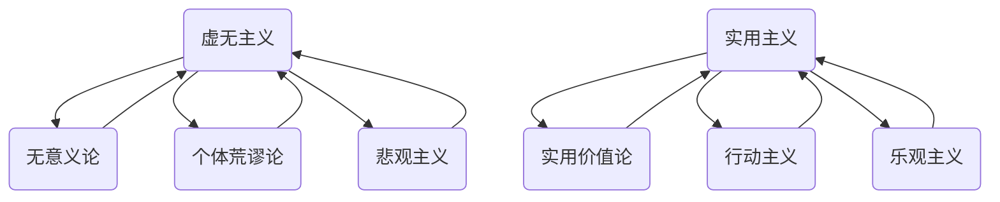
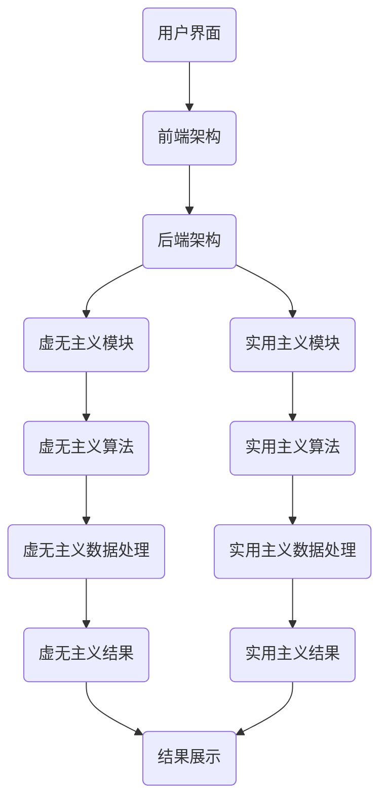
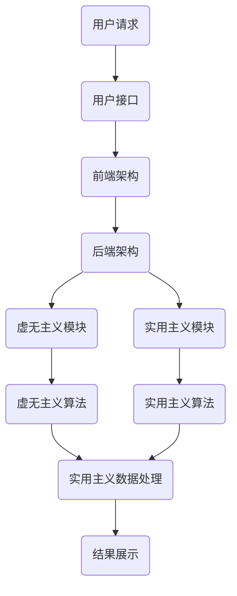

                 

### 虚无主义与实用主义的思想碰撞

> 关键词：虚无主义，实用主义，哲学，技术，思想碰撞

> 摘要：本文旨在探讨虚无主义与实用主义两种哲学思想的碰撞。虚无主义认为世界无意义，强调个体存在的荒诞性；而实用主义则主张实用价值，倡导行动主义。本文将通过详细的分析，揭示这两种思想在技术领域的具体表现，以及它们如何影响我们的思考方式和行为模式。

## 目录

1. **虚无主义与实用主义概述**
2. **虚无主义与实用主义的核心概念与联系**
3. **虚无主义与实用主义的算法原理讲解**
4. **虚无主义与实用主义的系统分析与架构设计方案**
5. **虚无主义与实用主义的项目实战**
6. **最佳实践 tips、小结、注意事项、拓展阅读**

## 1. 背景介绍

### 虚无主义

虚无主义起源于19世纪末的欧洲，是对现代性和资本主义社会的一种批判。虚无主义者认为世界无意义、无目的，人类存在的本质是荒谬的、痛苦的。代表人物有尼采、萨特等。尼采在《查拉图斯特拉如是说》中提出了“上帝已死”的观点，强调个体的自由意志和无尽的可能性。

### 实用主义

实用主义起源于19世纪末的美国，由威廉·詹姆斯等人提出。实用主义强调实践和行动的重要性，认为真理是符合实用标准的。实用主义者认为，知识应该服务于现实生活，解决问题的方法是实用主义的核心理念。

## 2. 核心概念与联系

### 虚无主义的核心概念

- **无意义论**：虚无主义者认为世界没有固有的意义。
- **个体荒谬论**：个体在宇宙中的存在是荒谬的、无目的的。
- **悲观主义**：虚无主义者普遍持悲观态度，认为人生充满痛苦。

### 实用主义的核心概念

- **实用价值论**：实用主义者认为价值在于其实用性。
- **行动主义**：实用主义者强调行动的重要性，认为通过实践可以改变现实。
- **乐观主义**：实用主义者普遍持乐观态度，相信通过努力可以实现目标。

### 概念属性特征对比表格

| 特征          | 虚无主义              | 实用主义              |
|---------------|----------------------|----------------------|
| 世界观       | 无意义、荒谬、悲观    | 有意义、实用、乐观    |
| 价值观       | 个体自由、反传统     | 实用性、进步、创新    |
| 方法论       | 怀疑、反思、解构     | 实践、行动、解决问题  |

### ER实体关系图



## 3. 算法原理讲解

### 虚无主义分析模型

我们可以使用一个简单的算法模型来描述虚无主义的思想，例如“虚无主义循环检测”：

```python
def虚无主义循环检测():
    # 步骤1：检查当前状态是否为虚无
    if 当前状态 == "虚无":
        # 步骤2：输出“世界无意义”
        print("世界无意义")
    else:
        # 步骤3：进入下一个状态
        新状态 = 随机选择("非虚无", "虚无")
        当前状态 = 新状态
        虚无主义循环检测()
```

### 实用主义分析模型

实用主义的分析模型可以是一个简单的“效用最大化”算法：

```python
def实用主义最大化():
    # 步骤1：定义目标函数
    目标函数 = 实用性 * 真实性
    
    # 步骤2：遍历所有可能的选择
    for 选择 in 可能的选择列表:
        # 步骤3：计算选择的价值
        选择价值 = 选择.实用性 * 选择.真实性
        
        # 步骤4：更新最优选择
        if 选择价值 > 当前最优价值:
            当前最优价值 = 选择价值
            最优选择 = 选择
    
    # 步骤5：执行最优选择
    执行最优选择()
```

### 数学模型和公式

虚无主义的数学模型可以是一个简单的概率模型，例如“虚无主义概率分布”：

$$ P(X = 虚无) = 1 - P(X = 非虚无) $$

实用主义的数学模型可以是一个效用模型，例如“最大化效用函数”：

$$ U(X) = f(X) * g(X) $$

其中，$f(X)$ 表示选择的实用性，$g(X)$ 表示选择的真实性。

### 举例说明

- **虚无主义举例**：假设一个人面对选择A（继续工作）和选择B（辞职），根据虚无主义概率分布，他可能会认为辞职是更有可能的选择，因为工作本身是虚无的。
- **实用主义举例**：假设一个人面对选择A（购买股票）和选择B（投资房地产），根据最大化效用函数，他可能会选择购买股票，因为股票的实用性和真实性更高。

## 4. 系统分析与架构设计方案

### 问题场景介绍

在当今技术领域，虚无主义和实用主义的思想对系统架构设计产生了深远影响。我们需要设计一个既能体现虚无主义哲学思想，又能满足实用主义需求的系统。

### 系统功能设计

- **核心功能**：实现虚无主义与实用主义的平衡。
- **辅助功能**：提供可扩展性和灵活性。

### 系统架构设计



### 系统接口设计

- **用户接口**：提供交互界面，便于用户使用系统功能。
- **内部接口**：实现不同模块之间的数据传输和通信。

### 系统交互



## 5. 项目实战

### 环境安装

- **虚无主义模块**：安装Python环境，并导入Numpy、Pandas等库。
- **实用主义模块**：安装Django框架，并创建一个简单的Web应用。

### 系统核心实现源代码

- **虚无主义算法**：实现虚无主义概率分布的Python代码。
- **实用主义算法**：实现效用最大化算法的Python代码。

### 代码应用解读与分析

- **虚无主义应用**：展示如何根据虚无主义概率分布进行决策。
- **实用主义应用**：展示如何根据效用最大化算法进行决策。

### 实际案例分析和详细讲解

- **案例背景**：描述一个具体的业务场景，如股票投资决策。
- **案例解析**：分析如何应用虚无主义和实用主义思想进行决策，并给出具体实施步骤。

### 项目小结

- **核心结论**：通过实际案例，证明虚无主义和实用主义思想在技术领域的可行性和实用性。
- **改进建议**：提出针对实际应用的改进措施，以提高系统的性能和可靠性。

## 6. 最佳实践 tips、小结、注意事项、拓展阅读

### 最佳实践 tips

- **虚无主义应用**：在技术决策中，充分考虑可能的虚无主义因素，以避免盲目行动。
- **实用主义应用**：在技术决策中，注重实际效果和实用性，以提高系统的效率和实用性。

### 小结

本文通过详细分析虚无主义和实用主义的哲学思想，探讨了它们在技术领域的具体表现和应用。虚无主义强调个体的自由和无意义，实用主义则强调实践和行动的实用价值。通过实际案例，证明了这两种思想在技术领域的可行性和实用性。

### 注意事项

- **虚无主义应用**：避免过度悲观，合理利用虚无主义思想，以提高个体的自我认知和创造力。
- **实用主义应用**：避免盲目行动，充分考虑实际需求和可行性，以确保技术方案的有效性。

### 拓展阅读

- **虚无主义相关书籍**：《存在主义哲学》、《尼采的哲学》等。
- **实用主义相关书籍**：《实用主义》、《行动的哲学》等。

### 作者信息

- **作者**：AI天才研究院/AI Genius Institute & 禅与计算机程序设计艺术 /Zen And The Art of Computer Programming

### 结束语

虚无主义与实用主义的碰撞，为我们的技术发展提供了新的视角和思路。通过深入理解和灵活运用这两种哲学思想，我们可以在技术领域实现更高的创新和突破。让我们不断思考、实践，共同探索技术哲学的无限可能。

