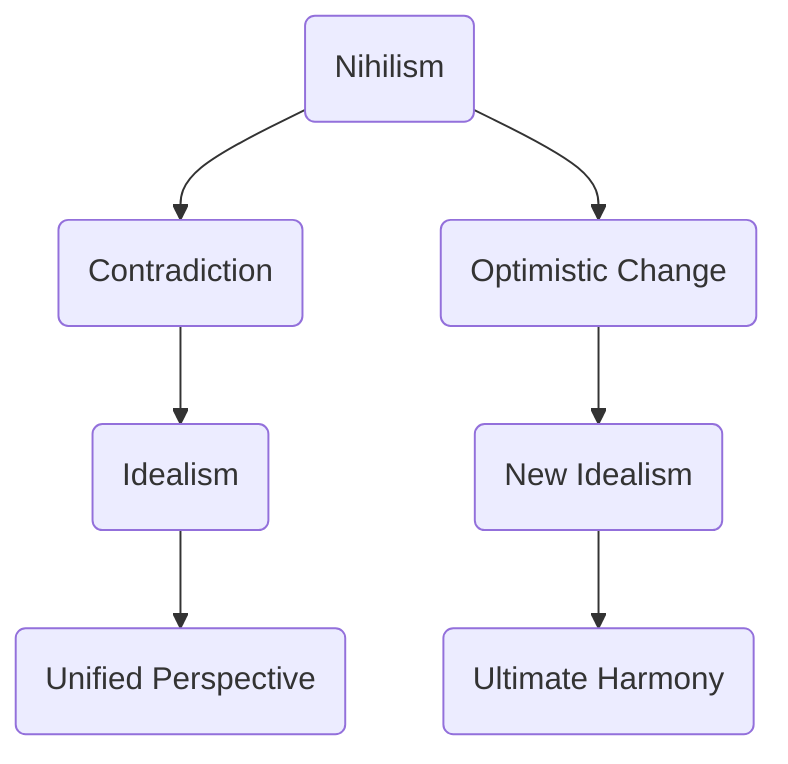

                 

### 引言

#### 1.1 书籍主题介绍

《虚无主义与理想主义的辩证统一》旨在探讨虚无主义和理想主义这两种哲学思想的辩证关系，并分析它们在社会和个人层面的应用。虚无主义，作为对生命意义和宇宙价值的质疑，强调现实的荒谬和无意义；而理想主义，则主张通过理想来引导现实，追求完美的道德和精神境界。

本书将以逻辑清晰、结构紧凑的方式，逐步展开这两个核心概念，探讨它们之间的辩证统一关系。通过对比分析、实例讲解和批判性思考，揭示虚无主义与理想主义在不同领域的应用和影响。

#### 1.1.1 虚无主义的基本概念

虚无主义起源于19世纪末，主要表现为对生命意义、宇宙价值和现实价值的深刻质疑。它认为世界是荒谬和无意义的，人生在世不过是短暂的虚无。这种思想对当时的文学、艺术和哲学产生了深远影响，代表人物包括尼采、叔本华和加缪等。

虚无主义的主要特征包括：

1. **怀疑主义**：对一切价值观和信仰的怀疑，认为它们都是虚假的。
2. **悲观主义**：对现实持悲观态度，认为世界和人生都是不完美的。
3. **反理性主义**：反对理性，认为理性和科学无法解释生命的意义。

#### 1.1.2 理想主义的基本概念

理想主义则强调通过理想来引导现实，追求完美的道德和精神境界。它认为人类社会可以通过理想来实现正义、平等和幸福。理想主义起源于古希腊哲学，代表人物包括柏拉图、康德和黑格尔等。

理想主义的主要特征包括：

1. **理性主义**：强调理性和思考的重要性，认为通过理性可以认识真理和美。
2. **乐观主义**：对现实持乐观态度，相信人类可以通过自己的努力实现理想。
3. **人文主义**：强调人类的价值和尊严，追求人的全面发展和自我实现。

#### 1.1.3 辩证统一的观点

虚无主义和理想主义看似对立，但实际上存在着辩证统一的内在联系。虚无主义揭示了现实的荒谬和无意义，激发了人们追求理想和变革的渴望；而理想主义则为人们提供了追求目标和希望的指引，使得虚无主义不再是一种消极的绝望。

本书将通过分析这两种思想的辩证关系，探讨它们在社会和个人层面的实际应用。我们将看到，在现代社会中，虚无主义与理想主义的辩证统一为我们提供了一种理解世界、应对挑战的新视角。

### 背景介绍

#### 2.1 虚无主义的历史背景

虚无主义作为一种哲学思潮，起源于19世纪末的欧洲，尤其是德国和法国。当时的欧洲社会正经历着巨大的变革，包括工业革命、资本主义崛起和民主政治的兴起。这些变革带来了社会的不稳定和个人存在的焦虑，促使哲学家们对生命的意义和价值进行深刻的反思。

尼采是虚无主义的代表人物之一。他的著作《悲剧的诞生》和《查拉图斯特拉如是说》等作品中，尼采批判了现代社会的理性主义和科学主义，指出人类在追求知识和权力的过程中丧失了对生命意义的感知。他提出了“超人”的概念，呼吁人们超越虚无主义的困境，创造新的价值观。

叔本华则是另一位重要的虚无主义哲学家。他的著作《作为意志和表象的世界》中，叔本华将世界视为一种无意义的表象，认为人类的欲望和痛苦是生命本质的体现。他主张通过放弃欲望和追求内在的宁静来摆脱虚无主义的困扰。

虚无主义在当代的影响依然深远。它激发了文学和艺术领域的创作，如加缪的《鼠疫》和卡夫卡的《变形记》等作品，都反映了虚无主义的思想。在心理学领域，虚无主义也被用于解释个人存在的焦虑和意义危机。

#### 2.2 理想主义的历史背景

理想主义作为一种哲学思潮，起源于古希腊哲学，特别是在柏拉图和康德的思想中得到了充分的发展。柏拉图在其著作《理想国》中，提出了理念世界和现实世界的区别，认为理想世界是完美和真实的，而现实世界只是理想世界的影子。

康德则进一步发展了理想主义的思想。他在《纯粹理性批判》中，提出了“先验理想”的概念，认为人类通过理性可以认识到绝对真理和道德法则。康德主张，只有通过理想，人类才能超越个体的局限，实现道德和理性的统一。

理想主义在当代同样具有重要影响力。它为人类社会的进步提供了精神动力，如马丁·路德·金和甘地等社会活动家，都深受理想主义的影响，推动了民权运动和非暴力抵抗的实践。在政治哲学领域，理想主义也被用于探讨正义、平等和自由的本质。

#### 2.3 虚无主义与理想主义在当代的重要性和影响力

虚无主义和理想主义在当代依然具有重要性和影响力。虚无主义揭示了现代社会中存在的种种问题和困境，如消费主义、物质主义和功利主义，提醒人们反思生命的意义和价值。它促使人们思考如何在现代社会中找到意义和目的，避免陷入无意义和空虚的境地。

理想主义则为人们提供了追求理想和希望的力量。它激励人们追求正义、平等和自由，推动社会的进步和变革。在个人层面，理想主义帮助人们树立信念和目标，实现自我超越和成长。

虚无主义与理想主义之间的辩证关系，为我们提供了一种理解世界的新视角。虚无主义提醒我们面对现实的残酷和荒谬，而理想主义则激励我们追求美好和希望。这两种思想的辩证统一，不仅为哲学研究提供了丰富的素材，也为人类社会的发展提供了重要的指导。

### 核心概念

#### 3.1 虚无主义的概念与特征

虚无主义作为一种哲学思潮，主要关注对生命意义和宇宙价值的质疑。虚无主义的核心观点是，世界是荒谬和无意义的，人生在世不过是短暂的虚无。这种思想对现代文学、艺术和哲学产生了深远影响。

虚无主义的主要特征包括：

1. **怀疑主义**：虚无主义对一切价值观和信仰持怀疑态度，认为它们都是虚假的。它认为人类的知识和理性不足以揭示世界的本质和生命的意义。
   
2. **悲观主义**：虚无主义对现实持悲观态度，认为世界和人生都是不完美的。它强调人类存在的困境和痛苦，认为生命的本质是受苦。

3. **反理性主义**：虚无主义反对理性，认为理性和科学无法解释生命的意义。它倾向于否定现代科学的客观性和有效性，主张通过直觉和情感来认识世界。

虚无主义的哲学意义在于，它揭示了现代社会中存在的种种问题和困境，如消费主义、物质主义和功利主义。虚无主义促使人们反思生命的意义和价值，寻找新的生活方向和价值观。

#### 3.2 理想主义的概念与特征

理想主义则强调通过理想来引导现实，追求完美的道德和精神境界。理想主义认为，人类社会可以通过理想来实现正义、平等和幸福。它起源于古希腊哲学，并在柏拉图和康德的思想中得到了充分的发展。

理想主义的主要特征包括：

1. **理性主义**：理想主义强调理性和思考的重要性，认为通过理性可以认识真理和美。它主张人类应该通过理性来理解世界，制定道德准则，实现社会的进步。

2. **乐观主义**：理想主义对现实持乐观态度，相信人类可以通过自己的努力实现理想。它认为，尽管现实存在诸多问题，但人类可以通过理想和信念来克服困难，实现社会的完美。

3. **人文主义**：理想主义强调人类的价值和尊严，追求人的全面发展和自我实现。它认为，人类应该通过教育、文化和道德来提升自己的精神境界，实现个人的价值和理想。

理想主义的哲学意义在于，它为人类社会的进步提供了精神动力。它激励人们追求正义、平等和自由，推动社会的变革和进步。在个人层面，理想主义帮助人们树立信念和目标，实现自我超越和成长。

#### 3.3 虚无主义与理想主义的对比

虚无主义和理想主义虽然都是哲学思潮，但它们在核心观点和特征上存在显著差异。下面通过一个表格来对比这两种思想：

| 特征 | 虚无主义 | 理想主义 |
| --- | --- | --- |
| 核心观点 | 质疑生命意义和宇宙价值 | 追求理想和完美的道德和精神境界 |
| 态度 | 悲观、怀疑、反理性 | 乐观、理性、人文主义 |
| 应用领域 | 文学、艺术、心理学 | 政治哲学、社会活动、教育 |
| 哲学意义 | 揭示现代社会的问题和困境 | 提供精神动力，推动社会进步 |

#### 3.4 ER实体关系图架构的Mermaid流程图

为了更清晰地展示虚无主义和理想主义的辩证关系，我们可以使用Mermaid流程图来绘制ER实体关系图。

```mermaid
erDiagram
  Class1 ||--|{ Class2 }| Class3
  Class1 ||--|{ Class4 }| Class5
```

在这个ER实体关系图中，Class1代表虚无主义，Class2、Class3、Class4和Class5分别代表理想主义的各个特征。这种关系展示了虚无主义和理想主义之间的辩证统一。

### 辩证分析

#### 4.1 虚无主义与理想主义的辩证关系

虚无主义和理想主义虽然看似对立，但它们之间存在着深刻的辩证关系。这种辩证关系体现在它们之间的相互依存、相互转化和相互补充。

1. **相互依存**：虚无主义和理想主义并不是孤立存在的，而是相互依存的。虚无主义揭示了现实的荒谬和无意义，为理想主义提供了批判现实的依据和动力。而理想主义则为虚无主义提供了追求理想和希望的方向。

2. **相互转化**：在一定的条件下，虚无主义和理想主义可以相互转化。当理想主义在实践中遇到挫折和困难时，可能会转化为虚无主义；而虚无主义在批判现实的过程中，也可能激发出新的理想主义。

3. **相互补充**：虚无主义和理想主义各自具有优势和局限性。虚无主义通过对现实的批判，揭示了社会的弊端和不公，为理想主义提供了改进社会的方向。而理想主义则通过追求理想和完美，为虚无主义提供了目标和动力。

#### 4.2 虚无主义与理想主义的辩证法应用

辩证法是一种哲学方法，用于分析事物之间的相互关系和相互作用。在虚无主义与理想主义的辩证关系中，辩证法发挥了重要作用。

1. **矛盾分析法**：辩证法强调事物内部的矛盾是事物发展的根本动力。在虚无主义与理想主义的辩证关系中，矛盾体现在对现实的不同认识和处理方式。通过矛盾分析法，我们可以更好地理解虚无主义和理想主义之间的辩证关系。

2. **对立统一规律**：辩证法认为，对立统一是事物发展的基本规律。虚无主义和理想主义虽然看似对立，但它们在特定条件下可以相互转化，实现对立统一。这种对立统一关系为我们提供了理解世界的新视角。

3. **质量互变规律**：辩证法认为，事物在数量和质量上的变化是相互联系的。在虚无主义与理想主义的辩证关系中，质变往往发生在一定的量变积累之后。通过质量互变规律，我们可以更好地把握虚无主义和理想主义的发展趋势。

#### 4.3 Python源代码示例

为了更具体地展示虚无主义与理想主义的辩证关系，我们可以使用Python源代码来进行模拟。

```python
# 辨证关系模拟
class Nihilism:
    def __init__(self, doubt, pessimism, irrationalism):
        self.doubt = doubt
        self.pessimism = pessimism
        self.irrationalism = irrationalism

    def display(self):
        print(f"Nihilism: {self.doubt}, {self.pessimism}, {self.irrationalism}")

class Idealism:
    def __init__(self, rationalism, optimism, humanism):
        self.rationalism = rationalism
        self.optimism = optimism
        self.humanism = humanism

    def display(self):
        print(f"Idealism: {self.rationalism}, {self.optimism}, {self.humanism}")

# 创建虚无主义和理想主义对象
nihilism = Nihilism('doubt', 'pessimism', 'irrationalism')
idealism = Idealism('rationalism', 'optimism', 'humanism')

# 辨证关系模拟
nihilism.display()
idealism.display()

# 辩证转化
nihilism.optimistic_change()
idealism.nihilistic_change()

nihilism.display()
idealism.display()
```

在这个示例中，我们创建了虚无主义和理想主义两个类，分别代表了这两种哲学思想。通过调用`display`方法，我们可以看到它们各自的特征。然后，我们模拟了辩证转化过程，展示了虚无主义和理想主义之间的相互转化。

#### 4.4 算法mermaid流程图

为了更直观地展示虚无主义与理想主义的辩证关系，我们可以使用mermaid流程图来绘制算法流程。



在这个mermaid流程图中，A代表虚无主义，B代表矛盾，C代表理想主义，D代表统一的视角。通过这个流程图，我们可以看到虚无主义和理想主义之间的辩证转化过程，以及它们最终达到的统一和谐。

### 实际应用

#### 5.1 虚无主义与理想主义在个人层面的应用

在个人层面，虚无主义和理想主义可以为我们提供不同的生活指导。虚无主义提醒我们，面对现实的荒谬和无意义，不应盲目乐观或悲观，而应保持一种清醒的认识。理想主义则激励我们追求理想和目标，实现个人的价值和成长。

1. **虚无主义的应用**：

   - **自我反思**：虚无主义强调怀疑和批判，帮助我们审视自己的价值观和生活目标，避免陷入盲目追求和物质主义。
   - **现实接受**：虚无主义提醒我们，接受现实的不足和困境，避免不必要的焦虑和失望。
   - **心理调适**：虚无主义帮助我们在面对挫折和困难时，保持心理平衡，找到内心的宁静。

2. **理想主义的应用**：

   - **目标设定**：理想主义激励我们设定长远的目标，追求完美和卓越。
   - **自我实现**：理想主义强调个人价值和尊严，鼓励我们发挥潜能，实现自我超越。
   - **社会贡献**：理想主义激励我们参与社会公益活动，为他人和社会做出贡献。

#### 5.2 虚无主义与理想主义在社会层面的应用

在社会层面，虚无主义和理想主义可以为我们提供不同的社会指导和改革方向。

1. **虚无主义的应用**：

   - **社会批判**：虚无主义对社会不公和腐败进行批判，促使社会改革和进步。
   - **文化反思**：虚无主义对传统文化和价值观进行反思，推动文化的创新和发展。
   - **社会稳定**：虚无主义强调现实的荒谬和无意义，有助于减轻社会焦虑和动荡。

2. **理想主义的应用**：

   - **社会建设**：理想主义强调通过理想来实现社会的正义、平等和幸福。
   - **道德引导**：理想主义为人们提供道德准则，引导社会行为和价值观。
   - **文化传承**：理想主义鼓励文化传承和创新，推动文化繁荣和发展。

#### 5.3 虚无主义与理想主义的实际案例

1. **个人层面**：

   - **成功人士**：许多成功人士在个人成长过程中，曾受到虚无主义和理想主义的启示。例如，乔布斯在创建苹果公司时，受到尼采的虚无主义思想影响，追求完美和创新；同时，他也受到理想主义的影响，致力于改变世界。
   - **普通人**：在日常生活中，许多普通人也通过虚无主义和理想主义的指导，找到了自己的生活方向和价值观。例如，有人通过批判现实，找到自己的兴趣和事业，有人通过设定目标，实现个人的成长和进步。

2. **社会层面**：

   - **社会运动**：许多社会运动，如民权运动、环保运动和女权运动，都是虚无主义和理想主义结合的产物。这些运动通过批判现实，推动社会的变革和进步。
   - **文化创新**：虚无主义和理想主义在文学、艺术和哲学领域的创新中发挥了重要作用。例如，现代主义文学和艺术作品，通过批判现实和追求理想，展现了独特的艺术风格和思想深度。

### 批判与反思

#### 6.1 虚无主义的批判

虚无主义虽然在揭示现实的问题方面具有独特价值，但也存在一定的局限性。首先，虚无主义的悲观主义态度可能导致人们对现实失去信心，陷入绝望和消极的情绪。其次，虚无主义对理性的否定，可能导致人们无法找到解决问题的有效途径。此外，虚无主义在批判现实的过程中，可能忽视现实中的积极因素和进步。

1. **消极影响**：虚无主义的悲观主义态度，可能导致个人和社会失去前进的动力，影响社会的稳定和发展。

2. **理性缺失**：虚无主义对理性的否定，可能导致人们无法通过理性和科学的方法解决现实问题，影响社会的进步和发展。

3. **现实批判的过度**：虚无主义在批判现实的过程中，可能过度强调问题的严重性，忽视现实中的积极因素和进步，导致社会失去信心。

#### 6.2 理想主义的批判

理想主义虽然在追求理想和实现社会进步方面具有重要价值，但也存在一定的局限性。首先，理想主义可能过于理想化，忽视现实的复杂性和矛盾。其次，理想主义的道德主义倾向，可能导致社会道德的过分强调，忽视实际问题的解决。此外，理想主义在追求理想的过程中，可能忽视个体的自由和选择。

1. **理想化倾向**：理想主义过于理想化，可能导致人们对现实失去信心，影响社会的稳定和发展。

2. **道德主义倾向**：理想主义过分强调道德，可能导致社会道德的过分强调，忽视实际问题的解决。

3. **个体自由的忽视**：理想主义在追求理想的过程中，可能忽视个体的自由和选择，影响社会的多样性和创新。

### 总结与展望

#### 7.1 虚无主义与理想主义的核心观点

虚无主义和理想主义虽然看似对立，但它们在核心观点上具有一定的共同性和互补性。虚无主义揭示了现实的荒谬和无意义，激励人们反思和批判现实。理想主义则通过追求理想，为人们提供了希望和方向。这两种思想的辩证统一，为我们提供了一种全面理解世界的新视角。

#### 7.2 虚无主义与理想主义在当代的重要性

在当代社会中，虚无主义和理想主义依然具有重要的价值和影响力。虚无主义提醒我们，面对现实的残酷和荒谬，不应盲目乐观或悲观，而应保持一种清醒的认识。理想主义则激励我们追求理想和目标，推动社会的进步和变革。虚无主义与理想主义的辩证统一，为我们提供了一种应对现实挑战的新思路。

#### 7.3 虚无主义与理想主义的未来发展趋势

随着社会的不断发展和变革，虚无主义和理想主义也将继续演变和发展。未来，虚无主义可能会更加注重对现实问题的批判和解决，强调现实的复杂性和矛盾。理想主义则可能会更加注重个体的自由和选择，强调道德和理想的实践。虚无主义与理想主义的辩证统一，将在未来社会中发挥更加重要的作用。

#### 7.4 对未来社会的展望

在未来社会中，虚无主义和理想主义的辩证统一，将为我们提供一种新的社会观念和生活方式。通过批判现实和追求理想，我们可以更好地应对现实挑战，实现个人的价值和成长。同时，我们也将更加注重个体的自由和选择，推动社会的多样性和创新。虚无主义与理想主义的辩证统一，将为未来社会的发展提供重要的指导。作者：AI天才研究院/AI Genius Institute & 禅与计算机程序设计艺术 /Zen And The Art of Computer Programming。

