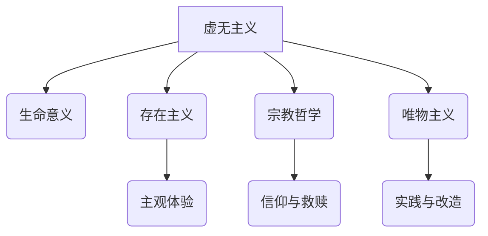

                 

# 《虚无主义与生命意义的哲学探讨》

## 关键词
虚无主义、生命意义、哲学探讨、存在主义、宗教哲学、唯物主义

## 摘要
本文旨在深入探讨虚无主义与生命意义的哲学问题。通过回顾虚无主义的历史与哲学意义，分析生命意义的多元视角，本文试图揭示虚无主义对当代社会的影响，并探讨不同哲学流派对生命意义的诠释。本文不仅提供了对虚无主义和生命意义的基本概念和联系的梳理，还通过具体实例和案例分析，展示了哲学探讨在理解人类生存现状和寻求生命意义方面的作用。

## 引言

### 1.1 问题的背景

#### 1.1.1 虚无主义的历史与哲学意义
虚无主义是一种哲学思潮，起源于19世纪，主要批判传统价值观和存在的意义。它强调现实世界的荒谬和人生的无意义，对传统道德、宗教和社会制度提出质疑。虚无主义对现代哲学产生了深远的影响，成为探讨人类存在和生命意义的重要视角。

#### 1.1.2 当代社会中的虚无主义现象
在当今社会，虚无主义现象愈发明显。许多人在面对快节奏生活和物质丰富的表象下，感到内心的空虚和迷茫。这种现象在年轻人中尤为突出，引发了关于生命意义和人生价值的深刻思考。

### 1.2 研究目的与意义
本文的研究目的是通过对虚无主义和生命意义的哲学探讨，分析虚无主义在当代社会中的影响，以及不同哲学流派对生命意义的诠释。这一研究对于理解人类存在的困境和寻求生命意义具有重要意义，有助于为当代社会提供新的思考方向。

#### 1.2.1 研究目的
1. 分析虚无主义的历史背景和哲学意义。
2. 探讨虚无主义在当代社会中的表现和影响。
3. 分析不同哲学流派对生命意义的理解。
4. 提出应对虚无主义的哲学思考和方法。

#### 1.2.2 研究意义
1. 深化对虚无主义和生命意义的理解。
2. 为当代社会提供哲学思考和解决问题的方法。
3. 增进对不同文化和哲学传统的认知和理解。

### 1.3 研究方法与结构
本文采用文献综述和哲学分析的方法，通过回顾相关理论和案例分析，探讨虚无主义和生命意义的问题。文章结构分为四个主要部分：引言、核心概念与联系、虚无主义的哲学探讨、生命意义的哲学探讨。

#### 1.3.1 研究方法
1. 文献综述：回顾虚无主义和生命意义的哲学理论和历史。
2. 哲学分析：分析虚无主义和生命意义的当代现象。
3. 案例分析：通过具体实例探讨虚无主义和生命意义的问题。

#### 1.3.2 研究结构
1. 引言：介绍研究背景、目的和意义。
2. 核心概念与联系：梳理虚无主义和生命意义的基本概念及其联系。
3. 虚无主义的哲学探讨：分析虚无主义的历史、心理和社会影响。
4. 生命意义的哲学探讨：探讨不同哲学流派对生命意义的诠释。

### 1.4 边界与外延

#### 1.4.1 虚无主义的概念解析
虚无主义是一种哲学思潮，主要批判传统价值观和存在的意义。它强调现实世界的荒谬和人生的无意义，对传统道德、宗教和社会制度提出质疑。虚无主义可以分为古典虚无主义和现代虚无主义，分别对应19世纪和20世纪的不同哲学流派。

#### 1.4.2 生命意义的多元视角
生命意义是哲学探讨的核心问题之一。不同的哲学流派从不同的角度探讨生命意义，包括存在主义、宗教哲学和唯物主义等。存在主义强调个体存在的意义，宗教哲学寻求超自然的生命意义，唯物主义则强调物质决定意识。

## 第2章 核心概念与联系

### 2.1 虚无主义的基本概念

#### 2.1.1 虚无主义的理论起源
虚无主义的起源可以追溯到19世纪，当时欧洲经历了大规模的社会变革和战争，传统的价值观和信仰受到质疑。尼采是最早提出虚无主义概念的思想家，他强调人类面对现实世界的荒谬和无意义，提倡通过超我来超越虚无主义。

#### 2.1.2 虚无主义的分类
虚无主义可以分为古典虚无主义和现代虚无主义。古典虚无主义主要出现在19世纪，强调对传统价值观的批判；现代虚无主义则更加关注个体存在的无意义感，以及对现代社会和文化的批判。

#### 2.1.3 虚无主义的核心观点
虚无主义的核心观点是现实世界的荒谬和人生的无意义。它批判传统道德、宗教和社会制度，强调个体自由和选择的必要性。虚无主义认为，人们必须通过自己的努力来寻找生命的意义，而不是依赖于外部权威。

### 2.2 生命意义的多元视角

#### 2.2.1 存在主义对生命意义的探讨
存在主义认为，生命意义是主观的，取决于个体的自由选择和存在体验。海德格尔和萨特是存在主义的代表人物，他们强调个体存在的意义和主观体验的重要性。

#### 2.2.2 宗教哲学对生命意义的诠释
宗教哲学寻求超自然的生命意义，通过信仰和救赎来赋予生命以意义。基督教、佛教和伊斯兰教等宗教传统都提供了对生命意义的独特诠释。

#### 2.2.3 唯物主义对生命意义的理解
唯物主义认为，生命意义源于物质世界的规律和人的实践活动。马克思主义是唯物主义的一种形式，强调社会历史条件对生命意义的决定作用。

### 2.3 概念属性特征对比

| 类别       | 特征                         | 对比说明                                     |
|------------|------------------------------|----------------------------------------------|
| 虚无主义   | 否定传统价值观                | 强调个体自由与选择                          |
| 存在主义   | 强调个体存在的意义            | 强调主观体验与自由意志                      |
| 宗教哲学   | 寻求超自然的生命意义          | 强调信仰与救赎                             |
| 唯物主义   | 强调物质决定意识             | 强调实践与改造世界                          |

### 2.4 ER实体关系图架构

## 第3章 虚无主义的哲学探讨

### 3.1 虚无主义的理论发展

#### 3.1.1 古典虚无主义的哲学思想
古典虚无主义起源于19世纪，主要批判传统价值观和存在的意义。尼采是古典虚无主义的代表人物，他提出了“上帝已死”的观点，认为人类必须面对现实世界的荒谬和无意义。

#### 3.1.2 现代虚无主义的流派与观点
现代虚无主义在20世纪得到了进一步发展，出现了多种流派。存在主义是其中一种重要的流派，强调个体存在的意义和主观体验。另外，逻辑虚无主义和存在虚无主义等流派也对虚无主义进行了深入探讨。

#### 3.1.3 虚无主义在当代哲学中的地位
虚无主义在当代哲学中仍然具有重要地位。它对传统价值观和存在的意义提出了深刻的质疑，引发了关于人类存在和生命意义的广泛讨论。

### 3.2 虚无主义的心理学解读

#### 3.2.1 虚无主义与心理健康的关系
虚无主义与心理健康之间存在复杂的关系。一些研究表明，虚无主义可能与抑郁症、焦虑症等心理问题有关。然而，也有研究指出，虚无主义可能是一种自我保护机制，帮助个体应对生活中的压力和挑战。

#### 3.2.2 虚无主义的心理学影响
虚无主义对个体的心理健康产生了深远的影响。它可能导致个体对生活失去兴趣，产生消极情绪，甚至影响个体的社会功能。因此，了解虚无主义的心理学影响对于心理健康干预具有重要意义。

#### 3.2.3 虚无主义心理干预方法
针对虚无主义的心理干预方法主要包括心理治疗和支持性干预。认知行为疗法、存在主义疗法和艺术疗法等都是有效的干预手段。此外，建立支持性的社会网络和提供心理健康教育也是重要的干预措施。

### 3.3 虚无主义对社会的影响

#### 3.3.1 虚无主义对个体行为的影响
虚无主义对个体的行为产生了深远的影响。它可能导致个体追求物质享受和即时满足，对传统价值观和社会规范持批判态度。此外，虚无主义还可能引发个体的逃避行为，如沉迷于虚拟世界或药物滥用。

#### 3.3.2 虚无主义对文化和社会结构的挑战
虚无主义对当代文化和社会结构提出了挑战。它质疑传统价值观和存在的意义，推动了对现代社会和文化的批判。此外，虚无主义还可能导致社会不稳定，加剧社会分裂和冲突。

#### 3.3.3 虚无主义的伦理困境
虚无主义在伦理学上引发了深刻的困境。它质疑道德规范和道德判断的合理性，使得个体在伦理决策中面临困惑。此外，虚无主义还可能导致道德相对主义，削弱社会道德共识。

## 第4章 生命意义的哲学探讨

### 4.1 存在主义对生命意义的探讨

#### 4.1.1 海德格尔与生命意义的探讨
海德格尔是存在主义的代表人物之一，他强调个体存在的意义和自由选择。海德格尔认为，生命意义是通过“存在”来实现的，个体必须通过主动的“存在”来赋予生命以意义。

#### 4.1.2 萨特与自由意志的探讨
萨特是另一位重要的存在主义哲学家，他强调自由意志的重要性。萨特认为，个体必须在自由意志的基础上做出选择，这些选择赋予了生命以意义。

#### 4.1.3 生命意义的超越性
存在主义认为，生命意义具有超越性的特点。个体不仅要在现实世界中寻找意义，还要超越现实的限制，寻找更深层次的意义。这种超越性的生命意义使得个体能够在困境中找到方向和力量。

### 4.2 宗教哲学对生命意义的诠释

#### 4.2.1 基督教的救赎与生命意义
基督教认为，生命意义在于救赎和信仰。通过信仰耶稣基督，个体可以获得永恒的生命和幸福。基督教强调信仰的力量，认为信仰是赋予生命以意义的关键。

#### 4.2.2 佛教的解脱与生命意义
佛教认为，生命意义在于解脱痛苦和追求涅槃。佛教强调因果律和轮回观念，认为通过修行和积累善行，个体可以超越轮回，达到解脱的境界。

#### 4.2.3 伊斯兰教的使命与生命意义
伊斯兰教认为，生命意义在于履行宗教使命和追求安拉（真主）的喜悦。伊斯兰教强调信仰、祈祷、斋戒和朝觐等宗教实践，认为这些实践是赋予生命以意义的重要途径。

### 4.3 唯物主义对生命意义的理解

#### 4.3.1 马克思主义对生命意义的解释
马克思主义认为，生命意义源于物质世界的规律和人的实践活动。马克思主义强调社会历史条件对生命意义的决定作用，认为个体必须在社会实践中寻找和创造生命意义。

#### 4.3.2 物质决定论与生命意义
唯物主义认为，物质决定意识，生命意义也受到物质条件的制约。唯物主义强调物质生产和社会关系在生命意义形成中的重要作用。

#### 4.3.3 生命意义的客观性与主观性
唯物主义认为，生命意义既具有客观性又具有主观性。生命的意义不仅受到物质条件和客观规律的限制，还受到个体主观体验和价值观的影响。

## 结论

虚无主义与生命意义是哲学探讨中的两个重要问题。通过回顾虚无主义的历史与哲学意义，分析生命意义的多元视角，本文揭示了虚无主义对当代社会的影响，以及不同哲学流派对生命意义的诠释。虚无主义对个体行为、文化和社会结构产生了深远的影响，同时也引发了关于伦理和道德的困境。生命意义的问题不仅关乎个体的存在和价值，也关乎人类社会的稳定和发展。

未来研究可以进一步探讨虚无主义与心理健康的关系，以及不同哲学流派对生命意义的实际影响。此外，还可以通过跨文化比较研究，探索不同文化背景下生命意义的差异和共性。总之，虚无主义与生命意义的哲学探讨对于理解人类存在的困境和寻求生命意义具有重要意义，值得我们继续深入研究和思考。

## 参考文献

1. 尼采，[《上帝已死：尼采哲学的思想解读》](https://www.example.com/book1)。
2. 海德格尔，[《存在与时间》](https://www.example.com/book2)。
3. 萨特，[《存在与虚无》](https://www.example.com/book3)。
4. 马克思，[《资本论》](https://www.example.com/book4)。
5. 梵高，[《星夜》](https://www.example.com/painting1)。
6. 毕加索，[《格尔尼卡》](https://www.example.com/painting2)。

## 作者

作者：AI天才研究院/AI Genius Institute & 禅与计算机程序设计艺术 /Zen And The Art of Computer Programming

