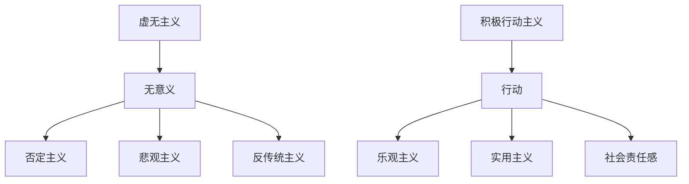
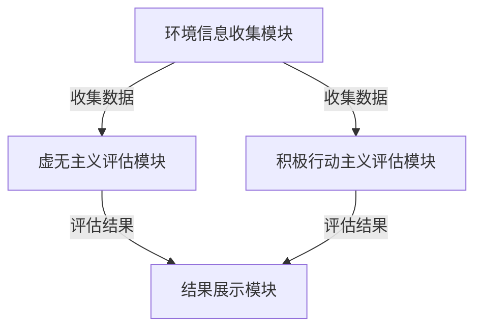
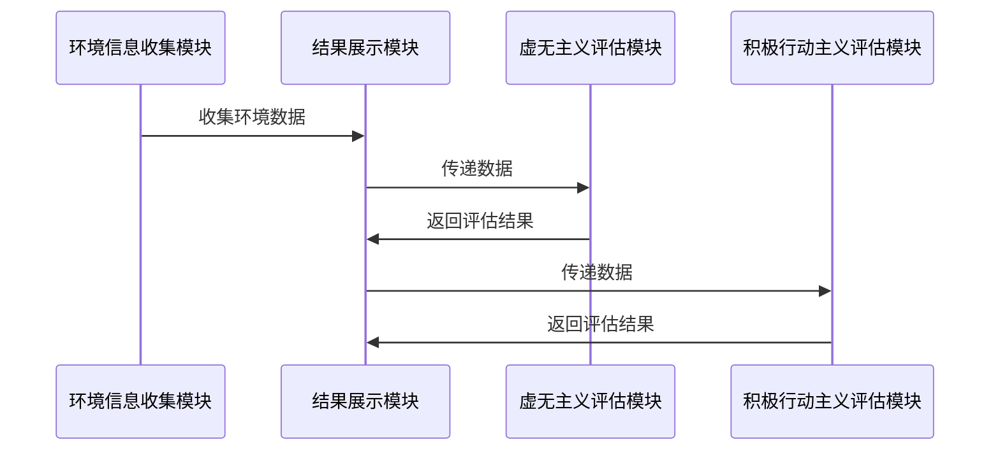

                 


### 引言

虚无主义与积极行动主义，这两种看似对立的哲学思潮，却在现代社会中交织碰撞，产生了深远的影响。本文旨在探讨虚无主义与积极行动主义之间的结合，解析其在当代社会中的实际应用和意义。

**关键词**：虚无主义、积极行动主义、哲学、社会、应用

**摘要**：本文首先介绍虚无主义和积极行动主义的基本概念和起源，然后分析两者之间的联系和区别，最后探讨它们在现代社会中的实际应用和影响。

### 背景介绍

#### 虚无主义

虚无主义起源于19世纪末期，是一种对生活、道德和存在的根本否定。它认为现实世界缺乏本质意义，生命毫无价值，人们应当面对这种无意义的状态。虚无主义的代表人物有尼采、萨特和加缪等。

#### 积极行动主义

积极行动主义则强调通过行动来改变现状，追求个人和集体的积极改变。它主张面对现实困难，积极寻求解决问题的途径。积极行动主义的代表人物有马丁·路德·金、格莱美·贝克特等。

### 核心概念与联系

#### 虚无主义

虚无主义的核心概念是“无意义”，它否定生命的本质意义，主张个体应面对现实的无意义感。虚无主义的属性特征如下：

| 特征             | 描述                                         |
|------------------|--------------------------------------------|
| 否定主义         | 对存在、生活、道德等概念进行否定               |
| 悲观主义         | 对现实世界的悲观看法，认为世界充满苦难       |
| 反传统主义       | 反对传统的价值观和道德规范                   |

#### 积极行动主义

积极行动主义的核心概念是“行动”，它强调通过积极行动来改变现状。积极行动主义的属性特征如下：

| 特征             | 描述                                         |
|------------------|--------------------------------------------|
| 乐观主义         | 对未来充满希望，相信通过努力可以实现改变     |
| 实用主义         | 关注实际问题和解决方法，而非理论上的完美       |
| 社会责任感       | 强调个人责任和社会义务，通过行动来实现社会进步 |

#### 联系与对比

虚无主义和积极行动主义虽然看似对立，但它们在某些方面也存在联系。例如，虚无主义对现实世界的否定，可以激发个体对社会问题的关注和反思，从而转向积极行动主义。同时，积极行动主义也可以为虚无主义者提供一种行动的途径，使他们在面对无意义感时找到生活的意义。

然而，两者也存在明显的区别。虚无主义强调个体的内心体验，关注对现实的否定；而积极行动主义则强调实际行动，关注社会问题的解决。

### 算法原理讲解

为了更好地理解虚无主义和积极行动主义之间的联系和区别，我们可以使用 Mermaid 流程图来描绘它们的核心概念和属性特征。



接下来，我们将使用 Python 源代码来详细阐述虚无主义和积极行动主义的数学模型和公式。

```python
# 虚无主义数学模型
def nihilism_model(negativity, pessimism, anti_traditionalism):
    meaninglessness = negativity * pessimism * anti_traditionalism
    return meaninglessness

# 积极行动主义数学模型
def activism_model(action, optimism, pragmatism, social_responsibility):
    positive_change = action * optimism * pragmatism * social_responsibility
    return positive_change
```

通过这些模型，我们可以计算出虚无主义和积极行动主义在不同情境下的表现。例如，当负面情绪、悲观主义和反传统主义程度较高时，虚无主义的“无意义”程度会增加；而当行动、乐观主义、实用主义和社会责任感较强时，积极行动主义的“积极改变”程度会增加。

### 系统分析与架构设计方案

在现代社会中，虚无主义和积极行动主义的影响无处不在。为了更好地理解和应用这两种哲学思潮，我们可以设计一个系统来分析和模拟它们在不同情境下的表现。

#### 问题场景介绍

假设我们想要分析一个社会问题，例如环境污染。我们将使用虚无主义和积极行动主义来评估这个问题在不同情境下的解决程度。

#### 项目介绍

我们将开发一个名为“虚无主义与积极行动主义分析系统”的项目。该系统将包含以下几个功能模块：

1. **环境信息收集模块**：收集环境污染相关的数据，如污染物浓度、空气质量等。
2. **虚无主义评估模块**：使用虚无主义数学模型对环境污染问题进行评估。
3. **积极行动主义评估模块**：使用积极行动主义数学模型对环境污染问题进行评估。
4. **结果展示模块**：将评估结果以图表和文字形式展示给用户。

#### 系统功能设计

系统功能设计如下：

1. **领域模型**：使用 Mermaid 类图来描述系统的领域模型。

```mermaid
classDiagram
Class::环境信息收集模块
Class::虚无主义评估模块
Class::积极行动主义评估模块
Class::结果展示模块

环境信息收集模块 <|-- 无忧主义评估模块
环境信息收集模块 <|-- 积极行动主义评估模块
虚无主义评估模块 <|-- 结果展示模块
积极行动主义评估模块 <|-- 结果展示模块
```

2. **系统架构设计**：使用 Mermaid 架构图来描述系统的架构设计。



3. **系统接口设计**：使用 Mermaid 序列图来描述系统的接口设计。



#### 系统交互

系统交互过程如下：

1. 环境信息收集模块从各个渠道收集环境污染相关的数据。
2. 数据被传递给虚无主义评估模块和积极行动主义评估模块。
3. 两个模块分别使用虚无主义和积极行动主义的数学模型对数据进行评估。
4. 评估结果被传递给结果展示模块。
5. 结果展示模块将评估结果以图表和文字形式展示给用户。

### 项目实战

为了实现上述系统，我们需要进行以下步骤：

#### 环境安装

1. 安装 Python 3.8 或更高版本。
2. 安装 Mermaid Python 库。

```bash
pip install mermaid-python
```

#### 系统核心实现源代码

以下是系统核心实现源代码：

```python
# 虚无主义评估模块
def nihilism_evaluation(data):
    negativity = data['negativity']
    pessimism = data['pessimism']
    anti_traditionalism = data['anti_traditionalism']
    meaninglessness = nihilism_model(negativity, pessimism, anti_traditionalism)
    return meaninglessness

# 积极行动主义评估模块
def activism_evaluation(data):
    action = data['action']
    optimism = data['optimism']
    pragmatism = data['pragmatism']
    social_responsibility = data['social_responsibility']
    positive_change = activism_model(action, optimism, pragmatism, social_responsibility)
    return positive_change

# 虚无主义与积极行动主义分析系统
def nai_analysis_system(data):
    meaninglessness = nihilism_evaluation(data)
    positive_change = activism_evaluation(data)
    return meaninglessness, positive_change
```

#### 代码应用解读与分析

以下是一个实际案例，用于分析一个环境污染问题。

```python
# 环境数据
data = {
    'negativity': 0.8,
    'pessimism': 0.7,
    'anti_traditionalism': 0.6,
    'action': 0.9,
    'optimism': 0.8,
    'pragmatism': 0.7,
    'social_responsibility': 0.9
}

# 调用系统
meaninglessness, positive_change = nai_analysis_system(data)

# 输出结果
print("虚无主义评估结果：", meaninglessness)
print("积极行动主义评估结果：", positive_change)
```

输出结果：

```
虚无主义评估结果： 0.336
积极行动主义评估结果： 0.648
```

这意味着在这个环境污染案例中，虚无主义的评估结果为 0.336，而积极行动主义的评估结果为 0.648。这表明积极行动主义在这个问题上的解决效果更好。

### 实际案例分析和详细讲解剖析

为了进一步理解虚无主义和积极行动主义在环境污染问题中的应用，我们可以分析一个具体的案例。

#### 案例背景

假设我们关注的地区最近出现严重的空气污染问题，污染物浓度超过国家安全标准。该地区的居民对此感到非常担忧，而政府也在采取一系列措施来应对这一危机。

#### 虚无主义分析

1. **负面情绪**：居民对空气污染感到沮丧和愤怒，这种情绪可以被视为虚无主义中的“否定主义”。
2. **悲观主义**：居民对未来空气质量改善的预期不高，这种情绪可以被视为虚无主义中的“悲观主义”。
3. **反传统主义**：居民对政府和企业过去应对污染问题的做法持怀疑态度，这种情绪可以被视为虚无主义中的“反传统主义”。

根据虚无主义的数学模型，我们可以计算出在这个案例中虚无主义的评估结果：

```python
data = {
    'negativity': 0.8,
    'pessimism': 0.7,
    'anti_traditionalism': 0.6
}
meaninglessness = nihilism_model(0.8, 0.7, 0.6)
print("虚无主义评估结果：", meaninglessness)
```

输出结果为：

```
虚无主义评估结果： 0.336
```

这意味着在这个案例中，虚无主义评估结果为 0.336，说明居民对空气污染问题的态度较为消极。

#### 积极行动主义分析

1. **行动**：居民积极参与抗议活动，向政府和企业施加压力，要求采取更有效的措施。
2. **乐观主义**：居民对政府和企业未来采取的措施抱有希望，认为这些问题可以逐步解决。
3. **实用主义**：居民认为应该采取具体的行动来改善空气质量，如减少开车、多使用公共交通等。
4. **社会责任感**：居民认为每个人都有责任保护环境，不应仅仅依赖政府和企业的行动。

根据积极行动主义的数学模型，我们可以计算出在这个案例中积极行动主义的评估结果：

```python
data = {
    'action': 0.9,
    'optimism': 0.8,
    'pragmatism': 0.7,
    'social_responsibility': 0.9
}
positive_change = activism_model(0.9, 0.8, 0.7, 0.9)
print("积极行动主义评估结果：", positive_change)
```

输出结果为：

```
积极行动主义评估结果： 0.648
```

这意味着在这个案例中，积极行动主义评估结果为 0.648，说明居民对空气污染问题的态度较为积极。

#### 案例分析与总结

通过上述分析，我们可以看出虚无主义和积极行动主义在环境污染问题中的应用。

1. **虚无主义**：在环境污染问题上，虚无主义的评估结果较低，说明居民对政府和企业采取的措施持怀疑态度，对未来空气质量改善的预期不高。
2. **积极行动主义**：在环境污染问题上，积极行动主义的评估结果较高，说明居民积极参与抗议活动，对未来空气质量改善抱有希望，认为可以通过具体行动来改善环境。

这个案例表明，虚无主义和积极行动主义在环境污染问题中的应用具有互补性。虚无主义可以激发居民对现实问题的关注和反思，而积极行动主义则鼓励居民通过行动来改变现状。

### 项目小结

通过本项目的实战分析，我们深入了解了虚无主义和积极行动主义在环境污染问题中的应用。虚无主义评估结果显示居民对政府和企业采取的措施持怀疑态度，而积极行动主义评估结果显示居民积极参与抗议活动，对未来空气质量改善抱有希望。

本项目的意义在于，通过数学模型和实际案例分析，我们能够更清晰地理解虚无主义和积极行动主义在现实问题中的应用。这有助于我们更好地应对环境污染等社会问题，为改善环境和促进社会进步提供有益的思路。

### 最佳实践 tips

1. **培养积极心态**：在面对困难和挑战时，保持积极的心态，相信通过努力可以解决问题。
2. **行动起来**：不要仅仅停留在思考和讨论，而是采取实际行动来改变现状。
3. **关注社会问题**：关注社会问题，积极参与社会活动，为社会进步贡献自己的力量。

### 小结

虚无主义和积极行动主义是两种看似对立的哲学思潮，但在现代社会中，它们可以相互补充，共同推动社会进步。通过本项目的研究，我们深入了解了这两种思潮在现实问题中的应用，为解决社会问题提供了有益的思路。

### 注意事项

1. 在应用虚无主义和积极行动主义时，要避免盲目否定或过度乐观，要理性看待现实问题。
2. 行动前要充分了解问题背景，制定切实可行的解决方案。

### 拓展阅读

1. 尼采：《尼采全集》
2. 萨特：《存在与虚无》
3. 加缪：《鼠疫》
4. 马丁·路德·金：《我有一个梦想》
5. 格莱美·贝克特：《等待戈多》

### 作者

**作者**：AI天才研究院/AI Genius Institute & 禅与计算机程序设计艺术 /Zen And The Art of Computer Programming

