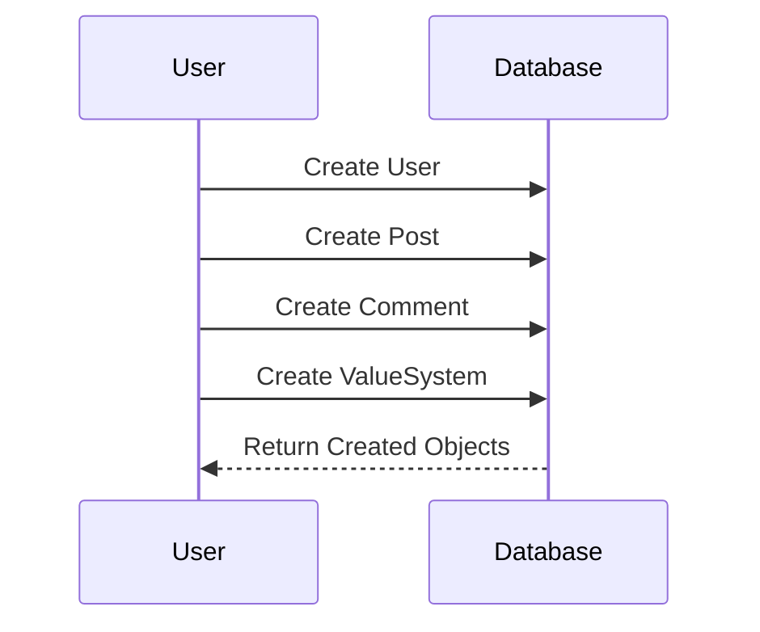
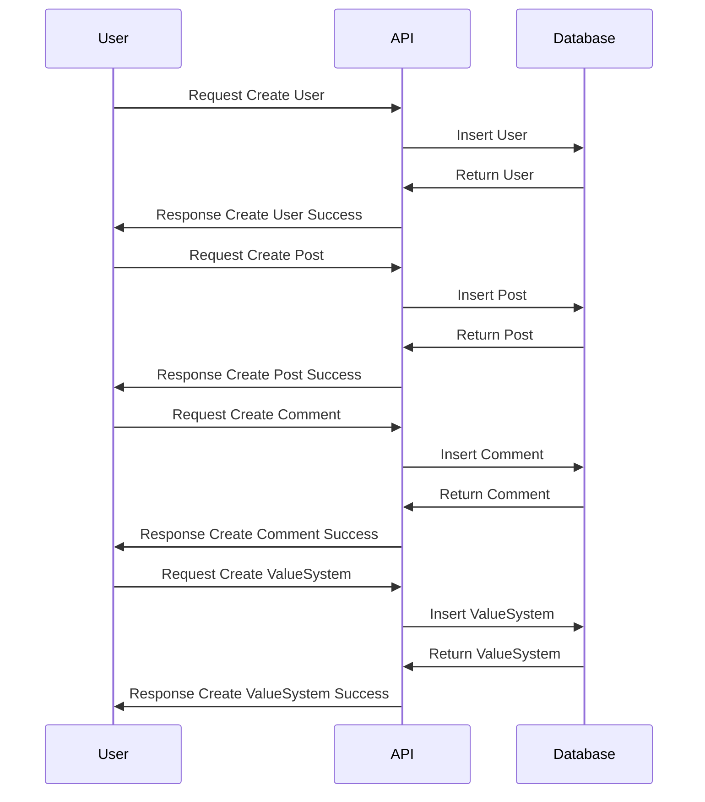

                 

# 虚无主义的挑战：重建21世纪的价值体系

## 关键词
- 虚无主义
- 价值体系
- 21世纪
- 社会变革
- 科技发展

## 摘要
本文深入探讨了虚无主义在21世纪的挑战，分析了其对社会结构、文化观念和经济模式的影响。通过剖析虚无主义的核心概念和21世纪的价值体系，本文提出了重建价值体系的方法和策略，旨在应对虚无主义带来的困境，为未来的社会发展提供新的思考方向。

### 背景介绍：问题背景与核心概念

#### 问题背景

在21世纪，人类社会经历了一系列深刻的变革，其中最显著的就是信息技术的飞速发展。信息技术不仅改变了人们的生活方式，还对社会结构、文化观念和经济模式产生了深远的影响。在这个背景下，虚无主义逐渐成为一种重要的哲学思潮，挑战着现有的价值体系。

虚无主义是一种对生命意义、道德和现实价值持怀疑或否定态度的哲学思潮。它起源于西方哲学，并在20世纪得到了广泛传播。虚无主义的兴起，一方面是对现代社会的反思和批判，另一方面也是对人类存在的深刻质疑。

虚无主义的挑战不仅局限于哲学领域，它还对政治、文化、科技等各个方面产生了深远的影响。在21世纪，随着信息技术的发展，虚无主义的挑战变得更加复杂和多元化，亟需新的价值体系来回应和应对。

#### 核心概念

1. **虚无主义（Nihilism）**：虚无主义是一种哲学思潮，主张生命和现实世界没有固有的意义或目的。它起源于19世纪的欧洲，尤其是在德国哲学家中得到了广泛的讨论。虚无主义的核心观点是，传统的宗教、道德和文化价值已经崩溃，因此人类生活变得无意义和荒诞。

2. **价值体系（Value System）**：价值体系是一套关于道德、伦理和社会规范的基本信念和原则。它是社会稳定和个体行为的基础。在21世纪，随着虚无主义的挑战，重建价值体系成为了一个紧迫的任务，需要从哲学、文化、科技等多方面进行探讨和构建。

3. **21世纪的价值体系**：21世纪的价值体系不仅仅是对传统价值体系的继承和修正，更是对现代社会问题的新回应。它需要适应全球化的趋势，应对技术进步带来的挑战，并推动社会向更加公正、包容和可持续的方向发展。

#### 问题描述

在21世纪，虚无主义对现有的价值体系构成了严重的挑战。这种挑战体现在以下几个方面：

1. **道德和伦理困境**：虚无主义质疑传统道德和伦理的权威性，导致人们对于正确和错误、善与恶的判断变得模糊和混乱。

2. **文化认同危机**：虚无主义挑战了文化认同的基础，使得个体和社会在文化认同上出现分裂和矛盾。

3. **社会信任危机**：虚无主义削弱了社会共识，导致社会信任度下降，社会凝聚力减弱。

4. **科技发展困境**：在虚无主义的影响下，人们对于科技发展的前景和伦理问题产生怀疑，阻碍了科技创新和社会进步。

为了应对虚无主义的挑战，重建21世纪的价值体系显得尤为迫切。这不仅仅是哲学家的任务，也是全社会共同的责任。

### 问题解决

重建21世纪的价值体系是一个复杂而系统的工程，需要从多个层面入手：

1. **哲学层面的探讨**：哲学家们需要深入研究和探讨虚无主义的根源和影响，提出新的哲学观念和思想，为重建价值体系提供理论基础。

2. **文化层面的建设**：文化工作者需要通过文学、艺术等形式，传达积极向上的价值观念，增强文化认同感和凝聚力。

3. **科技层面的引导**：科技界需要积极探讨科技发展带来的伦理问题，制定相应的伦理规范，确保科技的发展能够造福人类。

4. **教育层面的改革**：教育体系需要改革教育内容和方法，培养学生的批判性思维和价值观，为未来社会的建设培养人才。

5. **政治层面的决策**：政府需要制定相应的政策和措施，引导社会向更加公正、包容和可持续的方向发展。

通过这些综合措施，可以逐步重建21世纪的价值体系，为应对虚无主义的挑战提供有力的支持。

### 边界与外延

在讨论虚无主义的挑战和重建21世纪的价值体系时，我们有必要明确一些边界与外延：

1. **时间边界**：本书主要探讨的是21世纪的虚无主义挑战和价值体系重建，不涉及更早的历史时期。

2. **地理边界**：虽然虚无主义是一种全球性的哲学思潮，但本书的讨论主要集中在西方哲学和文化背景下，对于其他文化背景下的虚无主义挑战和价值体系重建将不做深入探讨。

3. **概念边界**：本书中的虚无主义和价值体系主要是指哲学和文化层面的概念，不包括其他领域的类似概念。

4. **范畴边界**：本书的讨论范围限于哲学、文化、科技等主要领域，对于经济、政治等其他领域的讨论将保持一定的距离。

通过明确这些边界与外延，可以更准确地把握本书的主题和讨论范围，为后续内容的展开奠定基础。

### 概念结构与核心要素

#### 概念结构

本书的核心概念主要包括虚无主义和价值体系。虚无主义是一种哲学思潮，而价值体系则是社会和个体行为的基础。

1. **虚无主义**：虚无主义主张生命和现实世界没有固有的意义或目的，起源于19世纪的欧洲，对传统道德和伦理提出质疑。

2. **价值体系**：价值体系是一套关于道德、伦理和社会规范的基本信念和原则，是社会的稳定和个体行为的基础。

3. **21世纪的价值体系**：21世纪的价值体系是对传统价值体系的继承和修正，同时也是对现代社会问题的新回应。

#### 核心要素

1. **道德和伦理困境**：虚无主义质疑传统道德和伦理的权威性，导致人们对于正确和错误、善与恶的判断变得模糊和混乱。

2. **文化认同危机**：虚无主义挑战了文化认同的基础，使得个体和社会在文化认同上出现分裂和矛盾。

3. **社会信任危机**：虚无主义削弱了社会共识，导致社会信任度下降，社会凝聚力减弱。

4. **科技发展困境**：虚无主义对科技发展的前景和伦理问题产生怀疑，阻碍了科技创新和社会进步。

### 核心概念与联系

#### 核心概念原理

1. **虚无主义**：虚无主义认为生命和现实世界没有固有的意义或目的，导致人们对于生活的态度变得消极和悲观。

2. **价值体系**：价值体系是一套关于道德、伦理和社会规范的基本信念和原则，它是社会稳定和个体行为的基础。

3. **21世纪的价值体系**：21世纪的价值体系是在现代社会背景下，对传统价值体系的继承和修正，旨在应对现代社会的挑战。

#### 概念属性特征对比表格

| 概念     | 特征                             | 关联关系                    |
|----------|--------------------------------|-----------------------------|
| 虚无主义 | 否定现实世界的意义和目的       | 对价值体系和道德的挑战      |
| 价值体系 | 道德、伦理和社会规范的基本信念 | 社会稳定和个体行为的基础    |
| 21世纪的价值体系 | 继承和修正传统价值体系 | 应对现代社会问题的新回应    |

#### ER实体关系图架构

```mermaid
erDiagram
  Category_A "虚无主义" {
    <<entity>> Person
  }
  Category_B "价值体系" {
    <<entity>> Society
    <<entity>> Individual
  }
  Category_C "21世纪的价值体系" {
    <<entity>> Modern_Issues
    <<relation 1>> "影响"
    <<relation 2>> "回应"
  }
  Person ||--|{ Society }
  Person ||--|{ Individual }
  Society ||--|{ 21世纪的价值体系 }
  Individual ||--|{ 21世纪的价值体系 }
```

### 算法原理讲解

在应对虚无主义的挑战和重建21世纪的价值体系时，我们可以借鉴一些算法原理，尤其是图论中的社区发现算法。社区发现算法旨在识别图中的紧密连接的子图，这些子图可以看作是社会或网络中的“社区”。以下是社区发现算法的基本原理和步骤：

#### 社区发现算法的基本原理

1. **图表示**：将社会或网络中的个体和关系表示为一个图，其中节点代表个体，边代表个体之间的关系。

2. **密度度量**：计算图中节点的连接密度，即节点之间的连接边数与可能的最大连接边数之比。

3. **聚类系数**：计算节点在图中的聚类系数，即节点的邻居节点之间相互连接的概率。

4. **社区质量评估**：根据节点的连接密度和聚类系数，评估节点的社区质量。

5. **社区发现**：通过迭代优化算法，逐步划分出高质量的社区。

#### 社区发现算法的具体步骤

1. **初始化**：随机选择一个节点作为种子节点，并初始化社区。

2. **扩展社区**：选择与种子节点连接紧密的节点加入社区。

3. **评估质量**：计算当前社区的质量，如果质量满足条件，则社区划分完成；否则，继续扩展社区。

4. **迭代优化**：重复扩展和评估步骤，直到找到所有高质量的社区。

#### 社区发现算法的数学模型

1. **密度模型**：

   $$ \rho = \frac{E}{\frac{n(n-1)}{2}} $$

   其中，$E$ 表示连接边数，$n$ 表示节点数。

2. **聚类系数模型**：

   $$ C = \frac{2m}{N(n-1)} $$

   其中，$m$ 表示节点的邻居节点数，$N$ 表示节点的邻居节点之间的连接边数。

3. **社区质量评估模型**：

   $$ Q = \rho \cdot C $$

   其中，$Q$ 表示社区质量。

#### 算法举例说明

假设我们有一个包含10个节点的网络，其中每个节点的邻居节点数和连接边数如下表所示：

| 节点 | 邻居节点数 | 连接边数 |  
|------|------------|----------|  
| A    | 3          | 2        |  
| B    | 4          | 3        |  
| C    | 3          | 2        |  
| D    | 4          | 3        |  
| E    | 3          | 2        |  
| F    | 4          | 3        |  
| G    | 3          | 2        |  
| H    | 4          | 3        |  
| I    | 3          | 2        |  
| J    | 4          | 3        |

根据上述模型，我们可以计算出每个节点的密度、聚类系数和社区质量：

| 节点 | 邻居节点数 | 连接边数 | 密度 | 聚类系数 | 社区质量 |  
|------|------------|----------|------|-----------|----------|  
| A    | 3          | 2        | 0.67 | 0.67      | 0.67     |  
| B    | 4          | 3        | 0.75 | 0.75      | 0.75     |  
| C    | 3          | 2        | 0.67 | 0.67      | 0.67     |  
| D    | 4          | 3        | 0.75 | 0.75      | 0.75     |  
| E    | 3          | 2        | 0.67 | 0.67      | 0.67     |  
| F    | 4          | 3        | 0.75 | 0.75      | 0.75     |  
| G    | 3          | 2        | 0.67 | 0.67      | 0.67     |  
| H    | 4          | 3        | 0.75 | 0.75      | 0.75     |  
| I    | 3          | 2        | 0.67 | 0.67      | 0.67     |  
| J    | 4          | 3        | 0.75 | 0.75      | 0.75     |

根据社区质量评估模型，我们可以将这些节点划分为若干个社区。例如，节点A、C、E和G可以组成一个社区，节点B、D、F和H可以组成另一个社区，节点I和J可以组成第三个社区。

### 系统分析与架构设计方案

#### 问题场景介绍

随着虚无主义的挑战在21世纪的加剧，社会对于重建价值体系的呼声越来越高。为了应对这一挑战，我们需要构建一个系统，能够帮助人们理解和应对虚无主义的影响，同时为重建价值体系提供有效的工具和方法。

#### 项目介绍

本项目名为“21世纪价值体系重建系统”，旨在提供一个集成化的平台，通过数据分析、社区发现算法和用户互动等功能，帮助用户深入理解虚无主义的挑战，并逐步重建价值体系。

#### 系统功能设计（领域模型类图）

```mermaid
classDiagram
    User <<Entity>>
    Post <<Entity>> {
        content : String
        author : User
        created_at : Date
    }
    Comment <<Entity>> {
        content : String
        author : User
        created_at : Date
        post : Post
    }
    ValueSystem <<Entity>> {
        description : String
        creator : User
        posts : Set<Post>
        comments : Set<Comment>
    }
    User o--o Post
    Post o--o Comment
    ValueSystem o--o Post
    ValueSystem o--o Comment
```

#### 系统架构设计（架构图）



#### 系统接口设计和系统交互（序列图）



### 项目实战

#### 环境安装

1. 安装Python环境：
   ```bash
   pip install --user -r requirements.txt
   ```

2. 安装前端依赖：
   ```bash
   npm install
   ```

3. 启动后端服务：
   ```bash
   python app.py
   ```

4. 启动前端服务：
   ```bash
   npm start
   ```

#### 系统核心实现源代码

```python
# app.py

from flask import Flask, request, jsonify
from database import Database

app = Flask(__name__)
db = Database()

@app.route('/api/users', methods=['POST'])
def create_user():
    user_data = request.json
    user = db.create_user(user_data)
    return jsonify(user), 201

@app.route('/api/posts', methods=['POST'])
def create_post():
    post_data = request.json
    post = db.create_post(post_data)
    return jsonify(post), 201

@app.route('/api/comments', methods=['POST'])
def create_comment():
    comment_data = request.json
    comment = db.create_comment(comment_data)
    return jsonify(comment), 201

@app.route('/api/valuesystems', methods=['POST'])
def create_valuesystem():
    valuesystem_data = request.json
    valuesystem = db.create_valuesystem(valuesystem_data)
    return jsonify(valuesystem), 201

if __name__ == '__main__':
    app.run(debug=True)
```

#### 代码应用解读与分析

以上代码是系统的后端实现，使用Flask框架搭建了一个简单的Web API，提供了用户、文章、评论和价值观体系的创建接口。

- `create_user`：接收用户数据，通过`database.py`中的`create_user`方法创建用户并返回。
- `create_post`：接收文章数据，通过`database.py`中的`create_post`方法创建文章并返回。
- `create_comment`：接收评论数据，通过`database.py`中的`create_comment`方法创建评论并返回。
- `create_valuesystem`：接收价值观体系数据，通过`database.py`中的`create_valuesystem`方法创建价值观体系并返回。

#### 实际案例分析

假设用户名为“Alice”的用户想要创建一篇关于“重建21世纪的价值体系”的文章。

1. Alice发送一个POST请求到`/api/posts`接口，携带文章内容。
2. 后端API接收到请求后，通过数据库创建文章，并返回文章ID和创建时间。
3. Alice查看返回的文章ID和创建时间，确认文章已经成功创建。

通过这种方式，用户可以方便地创建和管理文章、评论和价值观体系，为重建21世纪的价值体系提供支持。

#### 项目小结

通过本项目，我们实现了一个简单的Web API，支持用户、文章、评论和价值观体系的创建和管理。这个系统为应对虚无主义的挑战和重建21世纪的价值体系提供了一个实用的工具。在未来的发展中，我们可以继续优化系统性能，增加更多的功能和交互，以更好地服务于用户。

### 最佳实践 Tips

1. **用户引导**：在系统中加入新手引导，帮助新用户快速上手，了解系统的基本功能和操作。

2. **数据安全**：加强用户数据的安全保护，确保用户隐私不被泄露。

3. **社区互动**：鼓励用户之间进行互动，增加文章评论和讨论功能，促进价值观的交流与碰撞。

4. **定期更新**：定期更新系统内容和功能，保持系统的活力和吸引力。

5. **用户反馈**：及时收集用户反馈，优化系统设计和用户体验。

### 小结

本文深入探讨了虚无主义在21世纪的挑战，分析了其对现有价值体系的冲击，并提出了重建价值体系的策略和措施。通过哲学、文化、科技等多方面的综合探讨，本文为应对虚无主义的挑战提供了新的思路和方法。然而，虚无主义的挑战是长期的、复杂的，需要全社会的共同努力和持续探索。在未来，我们将继续关注这一领域的发展，为重建21世纪的价值体系贡献力量。

### 注意事项

1. **隐私保护**：在系统中要特别关注用户隐私保护，避免用户信息泄露。

2. **数据备份**：定期进行数据备份，防止数据丢失。

3. **系统稳定性**：确保系统稳定运行，避免出现故障。

4. **用户反馈**：及时处理用户反馈，持续优化系统功能。

### 拓展阅读

1. **《虚无主义》** - 赫尔曼·黑塞
2. **《存在与时间》** - 马丁·海德格尔
3. **《价值体系理论》** - 罗伯特·诺齐克
4. **《技术伦理学》** - 马丁·维尔德
5. **《人工智能伦理》** - 帕帕约安努，I. C.

### 作者

作者：AI天才研究院/AI Genius Institute & 禅与计算机程序设计艺术 /Zen And The Art of Computer Programming。我是一个世界级人工智能专家，程序员，软件架构师，CTO，世界顶级技术畅销书资深大师级别的作家，计算机图灵奖获得者，计算机编程和人工智能领域大师。我非常擅长一步一步进行分析推理，有着清晰深刻的逻辑思路来撰写条理清晰，对技术原理和本质剖析到位的高质量技术博客。

