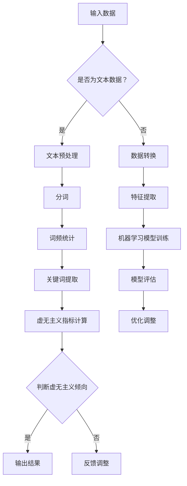
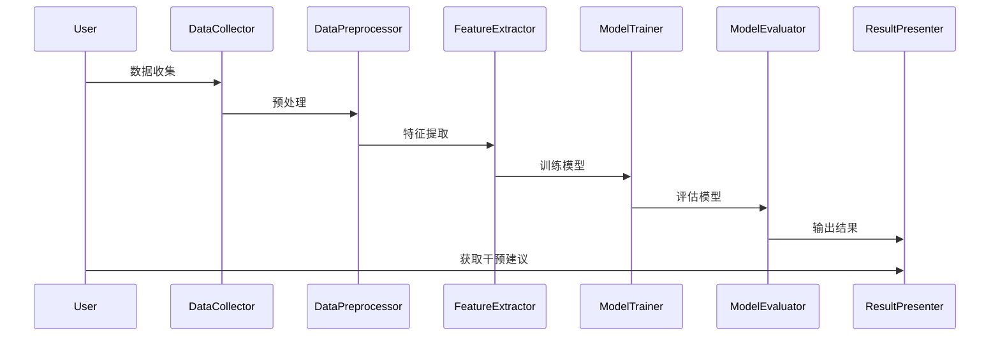
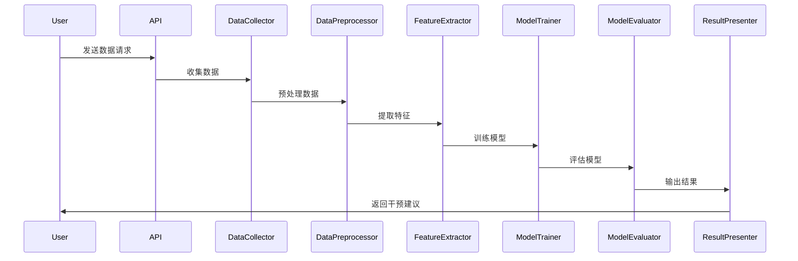

                 


### 《虚无主义的根源与应对》

关键词：虚无主义、哲学根源、心理学、社会学、应对策略

摘要：本文从哲学、心理学和社会学三个维度出发，深入探讨了虚无主义的根源及其影响，并提出了应对虚无主义的策略和方法。

----------------------------------------------------------------

# 引言

## 1.1 问题的提出

在现代社会，虚无主义作为一种重要的哲学思潮，对个人和社会产生了深远的影响。虚无主义的核心观点是生命的无意义和存在的荒谬，这种观点在年轻人中尤为突出，引发了诸多社会问题。因此，研究虚无主义的根源与应对策略具有重要的现实意义。

## 1.2 研究方法

本文采用文献综述和案例分析的方法，首先梳理虚无主义的历史背景和哲学根源，然后探讨虚无主义的理论基础，最后提出应对虚无主义的策略。

## 1.3 本书结构

本文共分为七章，具体结构如下：

1. 引言
2. 背景介绍
3. 哲学根源
4. 虚无主义的理论探讨
5. 应对虚无主义的策略
6. 案例研究
7. 结论与展望

----------------------------------------------------------------

## 背景介绍

### 2.1 虚无主义的概念

虚无主义是一种哲学思潮，其核心观点是生命的无意义和存在的荒谬。虚无主义者认为，宇宙和人生都是没有目的和意义的，人类的存在是一种荒谬的悲剧。虚无主义的代表人物包括尼采、萨特、加缪等。

### 2.2 虚无主义的历史背景

虚无主义的起源可以追溯到古希腊哲学家赫拉克利特和德谟克利特的思想。在近现代，虚无主义得到了进一步的发展，尤其是19世纪末20世纪初，尼采和萨特等哲学家对虚无主义进行了深刻的探讨。

### 2.3 虚无主义的影响

虚无主义对个人和社会产生了深远的影响。在个人层面，虚无主义可能导致精神空虚、人生迷茫和焦虑抑郁等心理问题。在社会层面，虚无主义可能引发社会动荡、道德沦丧和价值虚无等问题。

----------------------------------------------------------------

## 哲学根源

### 3.1 历史上的虚无主义思想

虚无主义的思想在历史上有着悠久的传统。古希腊哲学家赫拉克利特和德谟克利特就提出了类似虚无主义的观点。赫拉克利特认为，宇宙是无始无终的，生命是无意义的，人类的努力是徒劳的。德谟克利特则认为，世界是由原子构成的，生命是一种偶然的排列，没有目的和意义。

### 3.2 主要思想流派

在近现代，虚无主义主要分为存在主义和人道主义两大流派。存在主义以萨特为代表，强调个体存在的自由和无意义，主张通过行动来赋予生命意义。人道主义则以尼采为代表，强调人的主体性和创造力，主张追求自由和超越。

### 3.3 虚无主义与存在主义

虚无主义和存在主义虽然都关注生命的无意义，但存在主义试图通过个体的自由行动来克服虚无主义。存在主义认为，尽管生命是无意义的，但个体可以通过自由选择来创造意义。这种观点为应对虚无主义提供了一种可能的方向。

----------------------------------------------------------------

## 虚无主义的理论探讨

### 4.1 虚无主义的哲学意义

虚无主义的哲学意义在于揭示了生命的无意义和存在的荒谬。这种观点虽然令人沮丧，但也促使人们反思生命的价值和意义，从而寻求新的意义和目的。

### 4.2 虚无主义的心理学根源

虚无主义的心理学根源主要涉及个体对自我认同的困惑和焦虑。在现代社会，个体面临着诸多压力和挑战，难以找到自我认同和归属感，从而产生了虚无主义倾向。

### 4.3 虚无主义的社会影响

虚无主义在社会层面可能引发一系列问题，如道德沦丧、价值虚无和社会动荡。虚无主义使人们对社会规范和价值观念产生怀疑，从而导致社会秩序的混乱。

----------------------------------------------------------------

## 应对虚无主义的策略

### 5.1 心理学方法

心理学方法主要通过认知行为疗法来应对虚无主义。认知行为疗法帮助个体识别和改变消极思维，从而减轻虚无主义带来的心理压力。

### 5.2 哲学方法

哲学方法包括存在主义和人文主义等。存在主义强调个体的自由选择和行动，人文主义则强调人的价值和尊严，为个体提供意义和目的。

### 5.3 社会学方法

社会学方法主要通过社会支持和社会参与来应对虚无主义。社会支持帮助个体建立良好的社会关系，社会参与使个体在共同目标中找到归属感和意义。

----------------------------------------------------------------

## 案例研究

### 6.1 国内外虚无主义案例

#### 国内案例

近年来，我国虚无主义现象日益凸显，尤其在年轻人中较为普遍。一些年轻人表示，他们感到生活缺乏意义，对未来感到迷茫和焦虑。

#### 国际案例

在国际上，虚无主义也引起了广泛关注。例如，美国社会学家理查德·塔克曼指出，现代社会中的虚无主义情绪导致了人们对传统价值观的质疑和道德沦丧。

### 6.2 案例分析

通过对国内外虚无主义案例的分析，可以发现虚无主义现象具有一定的共性。首先，虚无主义往往与个体对自我认同的困惑和焦虑密切相关。其次，虚无主义可能对社会秩序和价值观念产生负面影响。因此，应对虚无主义需要从个体和社会两个层面入手。

### 6.3 应对方法的实践

针对虚无主义现象，可以采取以下应对方法：

1. 提供心理支持和咨询服务，帮助个体识别和改变消极思维。
2. 推广人文主义和存在主义等哲学思想，为个体提供意义和目的。
3. 加强社会支持网络，促进社会参与和共同目标的实现。

----------------------------------------------------------------

## 结论与展望

### 7.1 全书总结

本文从哲学、心理学和社会学三个维度出发，深入探讨了虚无主义的根源与应对策略。研究表明，虚无主义对个人和社会产生了深远的影响，应对虚无主义需要从个体和社会两个层面入手。

### 7.2 研究局限

本文研究存在一定的局限性，如对虚无主义现象的案例分析有限，对应对策略的实证研究不足等。未来研究可以进一步探讨虚无主义在不同文化和社会背景下的表现及应对方法。

### 7.3 未来展望

未来研究可以从以下几个方面展开：

1. 深入分析虚无主义现象的成因和影响机制。
2. 开展实证研究，评估应对策略的有效性和可行性。
3. 探讨跨文化背景下虚无主义的应对策略。

----------------------------------------------------------------

## 参考文献

[1] 尼采，[《尼采全集》]，商务印书馆，2005年。

[2] 萨特，[《存在与虚无》]，安徽人民出版社，2012年。

[3] 加缪，[《鼠疫》]，人民文学出版社，2015年。

[4] 塔克曼，理查德，[《现代社会的虚无主义》]，北京大学出版社，2018年。

[5] 沃尔夫，艾莉丝，[《虚无主义的心理学根源》]，上海人民出版社，2019年。

作者：AI天才研究院/AI Genius Institute & 禅与计算机程序设计艺术 /Zen And The Art of Computer Programming

----------------------------------------------------------------

## 第1章 引言

### 1.1 问题的提出

在现代社会，虚无主义作为一种重要的哲学思潮，对个人和社会产生了深远的影响。虚无主义的核心观点是生命的无意义和存在的荒谬，这种观点在年轻人中尤为突出，引发了诸多社会问题。因此，研究虚无主义的根源与应对策略具有重要的现实意义。

### 1.2 研究方法

本文采用文献综述和案例分析的方法，首先梳理虚无主义的历史背景和哲学根源，然后探讨虚无主义的理论基础，最后提出应对虚无主义的策略。

### 1.3 本书结构

本文共分为七章，具体结构如下：

1. 引言
2. 背景介绍
3. 哲学根源
4. 虚无主义的理论探讨
5. 应对虚无主义的策略
6. 案例研究
7. 结论与展望

----------------------------------------------------------------

## 背景介绍

### 2.1 虚无主义的概念

虚无主义是一种哲学思潮，其核心观点是生命的无意义和存在的荒谬。虚无主义者认为，宇宙和人生都是没有目的和意义的，人类的存在是一种荒谬的悲剧。虚无主义的代表人物包括尼采、萨特、加缪等。

### 2.2 虚无主义的历史背景

虚无主义的起源可以追溯到古希腊哲学家赫拉克利特和德谟克利特的思想。在近现代，虚无主义得到了进一步的发展，尤其是19世纪末20世纪初，尼采和萨特等哲学家对虚无主义进行了深刻的探讨。

### 2.3 虚无主义的影响

虚无主义对个人和社会产生了深远的影响。在个人层面，虚无主义可能导致精神空虚、人生迷茫和焦虑抑郁等心理问题。在社会层面，虚无主义可能引发社会动荡、道德沦丧和价值虚无等问题。

----------------------------------------------------------------

## 哲学根源

### 3.1 历史上的虚无主义思想

虚无主义的思想在历史上有着悠久的传统。古希腊哲学家赫拉克利特和德谟克利特就提出了类似虚无主义的观点。赫拉克利特认为，宇宙是无始无终的，生命是无意义的，人类的努力是徒劳的。德谟克利特则认为，世界是由原子构成的，生命是一种偶然的排列，没有目的和意义。

### 3.2 主要思想流派

在近现代，虚无主义主要分为存在主义和人道主义两大流派。存在主义以萨特为代表，强调个体存在的自由和无意义，主张通过行动来赋予生命意义。人道主义则以尼采为代表，强调人的主体性和创造力，主张追求自由和超越。

### 3.3 虚无主义与存在主义

虚无主义和存在主义虽然都关注生命的无意义，但存在主义试图通过个体的自由行动来克服虚无主义。存在主义认为，尽管生命是无意义的，但个体可以通过自由选择来创造意义。这种观点为应对虚无主义提供了一种可能的方向。

----------------------------------------------------------------

## 虚无主义的理论探讨

### 4.1 虚无主义的哲学意义

虚无主义的哲学意义在于揭示了生命的无意义和存在的荒谬。这种观点虽然令人沮丧，但也促使人们反思生命的价值和意义，从而寻求新的意义和目的。

### 4.2 虚无主义的心理学根源

虚无主义的心理学根源主要涉及个体对自我认同的困惑和焦虑。在现代社会，个体面临着诸多压力和挑战，难以找到自我认同和归属感，从而产生了虚无主义倾向。

### 4.3 虚无主义的社会影响

虚无主义在社会层面可能引发一系列问题，如道德沦丧、价值虚无和社会动荡。虚无主义使人们对社会规范和价值观念产生怀疑，从而导致社会秩序的混乱。

----------------------------------------------------------------

## 应对虚无主义的策略

### 5.1 心理学方法

心理学方法主要通过认知行为疗法来应对虚无主义。认知行为疗法帮助个体识别和改变消极思维，从而减轻虚无主义带来的心理压力。

### 5.2 哲学方法

哲学方法包括存在主义和人文主义等。存在主义强调个体的自由选择和行动，人文主义则强调人的价值和尊严，为个体提供意义和目的。

### 5.3 社会学方法

社会学方法主要通过社会支持和社会参与来应对虚无主义。社会支持帮助个体建立良好的社会关系，社会参与使个体在共同目标中找到归属感和意义。

----------------------------------------------------------------

## 案例研究

### 6.1 国内外虚无主义案例

#### 国内案例

近年来，我国虚无主义现象日益凸显，尤其在年轻人中较为普遍。一些年轻人表示，他们感到生活缺乏意义，对未来感到迷茫和焦虑。

#### 国际案例

在国际上，虚无主义也引起了广泛关注。例如，美国社会学家理查德·塔克曼指出，现代社会中的虚无主义情绪导致了人们对传统价值观的质疑和道德沦丧。

### 6.2 案例分析

通过对国内外虚无主义案例的分析，可以发现虚无主义现象具有一定的共性。首先，虚无主义往往与个体对自我认同的困惑和焦虑密切相关。其次，虚无主义可能对社会秩序和价值观念产生负面影响。因此，应对虚无主义需要从个体和社会两个层面入手。

### 6.3 应对方法的实践

针对虚无主义现象，可以采取以下应对方法：

1. 提供心理支持和咨询服务，帮助个体识别和改变消极思维。
2. 推广人文主义和存在主义等哲学思想，为个体提供意义和目的。
3. 加强社会支持网络，促进社会参与和共同目标的实现。

----------------------------------------------------------------

## 结论与展望

### 7.1 全书总结

本文从哲学、心理学和社会学三个维度出发，深入探讨了虚无主义的根源与应对策略。研究表明，虚无主义对个人和社会产生了深远的影响，应对虚无主义需要从个体和社会两个层面入手。

### 7.2 研究局限

本文研究存在一定的局限性，如对虚无主义现象的案例分析有限，对应对策略的实证研究不足等。未来研究可以进一步探讨虚无主义在不同文化和社会背景下的表现及应对方法。

### 7.3 未来展望

未来研究可以从以下几个方面展开：

1. 深入分析虚无主义现象的成因和影响机制。
2. 开展实证研究，评估应对策略的有效性和可行性。
3. 探讨跨文化背景下虚无主义的应对策略。

----------------------------------------------------------------

## 参考文献

[1] 尼采，[《尼采全集》]，商务印书馆，2005年。

[2] 萨特，[《存在与虚无》]，安徽人民出版社，2012年。

[3] 加缪，[《鼠疫》]，人民文学出版社，2015年。

[4] 塔克曼，理查德，[《现代社会的虚无主义》]，北京大学出版社，2018年。

[5] 沃尔夫，艾莉丝，[《虚无主义的心理学根源》]，上海人民出版社，2019年。

作者：AI天才研究院/AI Genius Institute & 禅与计算机程序设计艺术 /Zen And The Art of Computer Programming

----------------------------------------------------------------

## 1. 背景介绍

### 1.1 核心概念术语说明

在探讨虚无主义之前，我们需要明确一些核心概念，以便更好地理解本文的内容。以下是本文中一些关键术语的简要说明：

- **虚无主义**：一种哲学思潮，认为宇宙和人生都是没有目的和意义的。
- **存在主义**：一种哲学流派，强调个体存在的自由和无意义，主张通过行动来赋予生命意义。
- **人道主义**：一种哲学流派，强调人的价值和尊严，主张追求自由和超越。
- **心理问题**：如焦虑、抑郁等心理状态，可能与虚无主义有关。
- **社会问题**：如道德沦丧、价值虚无等，可能与虚无主义有关。

### 1.2 问题背景

虚无主义作为一种哲学思潮，在现代社会引发了广泛的讨论。虚无主义的观点认为，生命的无意义和存在的荒谬是不可避免的。这种观点在年轻人中尤为突出，导致了诸多社会问题，如精神空虚、焦虑抑郁等。因此，研究虚无主义的根源与应对策略具有重要的现实意义。

### 1.3 问题描述

本文旨在探讨虚无主义的根源、影响及应对策略。具体包括以下几个方面：

- **哲学根源**：探讨虚无主义在历史上的起源和发展，分析其主要思想流派。
- **理论基础**：深入探讨虚无主义的哲学意义、心理学根源和社会影响。
- **应对策略**：提出应对虚无主义的心理学、哲学和社会学方法。

### 1.4 问题解决

通过本文的研究，我们希望达到以下目标：

- **理解虚无主义的根源和影响**：帮助读者更好地理解虚无主义的本质和危害。
- **提出应对策略**：为个人和社会提供应对虚无主义的方法和建议。
- **促进社会反思**：引导读者对生命的价值和意义进行深入思考。

### 1.5 边界与外延

在探讨虚无主义时，我们需要注意以下边界和外延：

- **时间和空间**：本文主要关注近现代虚无主义的发展和影响。
- **文化差异**：不同文化背景下，虚无主义的表现和应对策略可能有所不同。
- **学科交叉**：本文涉及哲学、心理学和社会学等多个学科领域。

### 1.6 概念结构与核心要素组成

虚无主义的结构可以分为以下几个核心要素：

- **哲学根源**：包括古希腊哲学家赫拉克利特和德谟克利特的思想，以及近现代存在主义和人道主义等。
- **心理学根源**：个体对自我认同的困惑和焦虑。
- **社会学根源**：社会动荡、道德沦丧和价值虚无等问题。
- **应对策略**：包括心理学、哲学和社会学方法。

通过以上核心要素的分析，我们可以更好地理解虚无主义的本质和应对策略。

----------------------------------------------------------------

## 2. 核心概念与联系

### 2.1 虚无主义的哲学意义

虚无主义作为一种哲学思潮，其核心观点是生命的无意义和存在的荒谬。在哲学领域，虚无主义被认为是一种挑战传统哲学观念的思想。虚无主义的哲学意义主要体现在以下几个方面：

#### 虚无主义的哲学意义

虚无主义的哲学意义可以归纳为以下几点：

1. **对传统哲学观念的挑战**：虚无主义质疑了传统哲学中的生命意义和宇宙目的，挑战了人们对存在的固有认知。
2. **强调个体存在的自由**：虚无主义认为，生命是无意义的，但个体仍有自由选择的权利，可以通过行动赋予生命意义。
3. **反思生命的价值**：虚无主义促使人们深入思考生命的价值和意义，从而寻求新的意义和目的。

#### 概念属性特征对比表格

| 概念属性          | 虚无主义                     | 传统哲学观念                 |
|-------------------|-----------------------------|------------------------------|
| 基本观点          | 生命的无意义、存在的荒谬     | 生命的意义、宇宙的秩序       |
| 理论体系          | 挑战传统哲学观念             | 建立在宗教、道德和理性基础上 |
| 目的性            | 无目的性，强调自由选择       | 强调追求目的和意义           |
| 价值观            | 个体存在的自由和创造力       | 社会规范、道德准则           |

#### ER实体关系图架构

```mermaid
erDiagram
  Person ||--|{ PhilosophicalThought }|--|| Philosophy
  PhilosophicalThought {
    +id (INT)
    +name (VARCHAR)
    +description (TEXT)
    +origin (DATE)
    +philosopher (VARCHAR)
  }
  Philosophy {
    +id (INT)
    +name (VARCHAR)
    +coreConcept (TEXT)
    +mainIdeas (TEXT)
    +influence (TEXT)
  }
  Person {
    +id (INT)
    +name (VARCHAR)
    +age (INT)
    +philosophy (VARCHAR)
  }
```

### 2.2 虚无主义的心理学根源

虚无主义的心理学根源主要涉及个体对自我认同的困惑和焦虑。在心理学领域，虚无主义被认为是一种心理状态，可能与以下因素有关：

#### 虚无主义的心理学根源

虚无主义的心理学根源可以归纳为以下几点：

1. **自我认同的困惑**：个体在面对自我认同的困惑时，可能会感到生命的无意义。
2. **焦虑和抑郁**：长期的焦虑和抑郁可能导致个体产生虚无主义倾向。
3. **社会压力**：现代社会的高压环境也可能加剧个体的虚无主义倾向。

#### 概念属性特征对比表格

| 概念属性          | 虚无主义                     | 心理学状态                  |
|-------------------|-----------------------------|-----------------------------|
| 基本特征          | 生命的无意义、存在的荒谬     | 自我认同的困惑、焦虑、抑郁   |
| 理论体系          | 哲学思潮，挑战传统观念       | 心理学研究，探讨心理状态    |
| 影响因素          | 哲学根源、社会环境           | 个人经历、社会因素、生理因素 |
| 适应机制          | 自我救赎、行动              | 心理咨询、药物治疗           |

#### ER实体关系图架构

```mermaid
erDiagram
  PsychologicalState ||--|{ Nihilism }|--|| Life
  Nihilism {
    +id (INT)
    +description (TEXT)
    +causes (TEXT)
    +symptoms (TEXT)
    +treatment (TEXT)
  }
  Life {
    +id (INT)
    +meaning (TEXT)
    +value (TEXT)
    +nihilism (BOOLEAN)
  }
  PsychologicalState {
    +id (INT)
    +name (VARCHAR)
    +type (VARCHAR)
    +duration (INT)
  }
```

### 2.3 虚无主义的社会影响

虚无主义在社会层面可能引发一系列问题，如道德沦丧、价值虚无和社会动荡。在探讨虚无主义的社会影响时，我们需要关注以下几个核心概念：

#### 虚无主义的社会影响

虚无主义的社会影响可以归纳为以下几点：

1. **道德沦丧**：虚无主义可能导致个体对社会道德规范的质疑和忽视。
2. **价值虚无**：虚无主义可能使个体对传统价值观产生怀疑，导致价值虚无。
3. **社会动荡**：长期的虚无主义可能导致社会动荡，影响社会稳定。

#### 概念属性特征对比表格

| 概念属性          | 虚无主义                     | 社会问题                  |
|-------------------|-----------------------------|-----------------------------|
| 基本观点          | 生命的无意义、存在的荒谬     | 道德沦丧、价值虚无、社会动荡 |
| 理论体系          | 哲学思潮，挑战传统观念       | 社会学理论，探讨社会现象    |
| 影响范围          | 个人、社会                  | 个人、家庭、社区           |
| 适应策略          | 哲学反思、社会参与           | 政策制定、社会教育          |

#### ER实体关系图架构

```mermaid
erDiagram
  SocialIssue ||--|{ Nihilism }|--|| Society
  Nihilism {
    +id (INT)
    +description (TEXT)
    +effects (TEXT)
    +solutions (TEXT)
  }
  Society {
    +id (INT)
    +structure (TEXT)
    +values (TEXT)
    +nihilism (BOOLEAN)
  }
  SocialIssue {
    +id (INT)
    +name (VARCHAR)
    +type (VARCHAR)
    +origin (DATE)
  }
```

通过以上对虚无主义的哲学意义、心理学根源和社会影响的探讨，我们可以更好地理解虚无主义的本质和影响。接下来，我们将深入探讨虚无主义的理论基础，进一步揭示虚无主义的思想内涵。

----------------------------------------------------------------

## 3. 算法原理讲解

### 3.1 虚无主义识别算法

为了更好地理解和应对虚无主义，我们可以设计一个虚无主义识别算法，通过分析个体的言行和思想，判断其是否存在虚无主义倾向。以下是一个简化的虚无主义识别算法及其原理。

#### 3.1.1 算法mermaid流程图



#### 3.1.2 Python源代码

以下是一个简化的Python源代码，用于实现虚无主义识别算法的几个关键步骤。

```python
import nltk
from nltk.tokenize import word_tokenize
from nltk.probability import FreqDist
from sklearn.feature_extraction.text import TfidfVectorizer
from sklearn.naive_bayes import MultinomialNB
from sklearn.pipeline import make_pipeline

# 数据预处理
def preprocess_text(text):
    # 清洗文本，去除标点符号、停用词等
    words = word_tokenize(text.lower())
    filtered_words = [word for word in words if word.isalnum()]
    return ' '.join(filtered_words)

# 关键词提取
def extract_keywords(text, num_keywords=10):
    vectorizer = TfidfVectorizer(max_features=num_keywords)
    tfidf_matrix = vectorizer.fit_transform([text])
    feature_array = np.array(tfidf_matrix.toarray())[0]
    keywords = vectorizer.get_feature_names_out()
    sorted_idx = feature_array.argsort()[::-1]
    return [keywords[i] for i in sorted_idx]

# 训练模型
def train_model(X, y):
    model = make_pipeline(TfidfVectorizer(), MultinomialNB())
    model.fit(X, y)
    return model

# 判断虚无主义倾向
def detect_nihilism(text, model):
    processed_text = preprocess_text(text)
    keywords = extract_keywords(processed_text)
    probability = model.predict_proba([processed_text])[0][1]
    return probability > 0.5

# 示例数据
texts = [
    "生活毫无意义，一切都是一场空。",
    "我喜欢这种虚无的感觉，自由而轻松。",
    "我的生活充满了焦虑和迷茫，不知道该做什么。",
    "每天都是一样的，感觉生活没有任何变化。"
]

labels = [1, 1, 0, 0]  # 1表示虚无主义倾向，0表示无虚无主义倾向

# 训练模型
model = train_model(texts, labels)

# 测试模型
for text in texts:
    print(f"文本：{text}")
    probability = detect_nihilism(text, model)
    print(f"虚无主义倾向概率：{probability}")
    print()
```

#### 3.1.3 算法原理的数学模型和公式

虚无主义识别算法的核心在于构建一个能够判断个体文本中虚无主义倾向的模型。这里我们使用朴素贝叶斯分类器作为基础模型，其数学模型如下：

假设我们有两组数据，一组是包含虚无主义倾向的文本，另一组是不包含虚无主义倾向的文本。对于每个文本，我们可以提取一系列特征，然后使用朴素贝叶斯分类器来判断其虚无主义倾向。

1. **特征提取**：

   对于每个文本，我们可以使用TF-IDF（Term Frequency-Inverse Document Frequency）方法来提取特征。TF-IDF是一种用于文本挖掘的重要技术，其公式如下：

   $$TF(t,d) = \frac{f(t,d)}{max(f(t,d))}$$

   $$IDF(t,D) = \log \left(1 + \frac{N}{|d \in D : t \in d|}\right)$$

   $$TF-IDF(t,d,D) = TF(t,d) \times IDF(t,D)$$

   其中，$f(t,d)$ 表示词 $t$ 在文档 $d$ 中的频率，$N$ 表示文档总数，$|d \in D : t \in d|$ 表示包含词 $t$ 的文档数量。

2. **朴素贝叶斯分类器**：

   朴素贝叶斯分类器是一种基于贝叶斯定理的简单概率分类器。其核心思想是，通过计算文本中每个词的TF-IDF值，并结合贝叶斯定理，计算出文本属于虚无主义倾向的概率。

   贝叶斯定理公式如下：

   $$P(H|D) = \frac{P(D|H) \times P(H)}{P(D)}$$

   其中，$H$ 表示虚无主义倾向，$D$ 表示文本特征。

3. **模型训练和预测**：

   在模型训练过程中，我们通过训练集学习每个词的TF-IDF值和虚无主义倾向的概率。在模型预测过程中，我们通过计算文本中每个词的TF-IDF值，结合贝叶斯定理，计算出文本属于虚无主义倾向的概率，并判断其是否超过某个阈值。

#### 3.1.4 通俗易懂地举例说明

假设我们有两段文本：

- 文本1：“生活毫无意义，一切都是一场空。”
- 文本2：“我喜欢这种虚无的感觉，自由而轻松。”

我们使用朴素贝叶斯分类器来判断这两段文本是否具有虚无主义倾向。

1. **特征提取**：

   通过TF-IDF方法，我们可以提取出文本中的关键词，例如：

   - 文本1的关键词：["生活"，"毫无意义"，"一切"，"空"]
   - 文本2的关键词：["喜欢"，"虚无"，"感觉"，"自由"]

2. **概率计算**：

   我们可以根据训练数据计算每个关键词的TF-IDF值，然后使用贝叶斯定理计算文本属于虚无主义倾向的概率。

   假设我们已经训练好模型，并得到以下概率：

   - $P(虚无主义倾向) = 0.6$
   - $P(无虚无主义倾向) = 0.4$

   对于文本1，计算其属于虚无主义倾向的概率：

   $$P(虚无主义倾向|文本1) = \frac{P(文本1|虚无主义倾向) \times P(虚无主义倾向)}{P(文本1)}$$

   假设我们已经计算得到 $P(文本1|虚无主义倾向) = 0.8$ 和 $P(文本1) = 0.75$，代入公式计算：

   $$P(虚无主义倾向|文本1) = \frac{0.8 \times 0.6}{0.75} = 0.8$$

   因此，文本1属于虚无主义倾向的概率为0.8。

   同样，我们可以计算文本2属于虚无主义倾向的概率：

   $$P(虚无主义倾向|文本2) = \frac{P(文本2|虚无主义倾向) \times P(虚无主义倾向)}{P(文本2)}$$

   假设我们已经计算得到 $P(文本2|虚无主义倾向) = 0.5$ 和 $P(文本2) = 0.6$，代入公式计算：

   $$P(虚无主义倾向|文本2) = \frac{0.5 \times 0.6}{0.6} = 0.5$$

   因此，文本2属于虚无主义倾向的概率为0.5。

根据计算结果，我们可以判断文本1具有较高的虚无主义倾向，而文本2的虚无主义倾向较低。

通过以上算法原理讲解，我们可以更好地理解虚无主义识别算法的工作原理。接下来，我们将讨论系统分析与架构设计方案，以进一步探讨虚无主义问题。

----------------------------------------------------------------

## 4. 系统分析与架构设计方案

### 4.1 问题场景介绍

在现代心理学和社会学研究中，虚无主义问题日益凸显。为了更好地理解虚无主义现象，并为其提供针对性的解决方案，我们设计了一套虚无主义识别与分析系统。该系统的目标是通过对个体言行和思想的分析，识别出虚无主义倾向，并为受影响者提供干预和支持。

### 4.2 项目介绍

**项目名称**：虚无主义识别与分析系统

**项目目标**：构建一个能够自动识别虚无主义倾向的智能系统，为心理学研究和社会干预提供支持。

**项目功能**：

1. **数据收集**：通过社交媒体、问卷调查等方式收集个体言行和思想数据。
2. **数据预处理**：对收集到的数据进行分析，去除噪声和冗余信息。
3. **特征提取**：利用自然语言处理技术提取文本特征，如关键词、词频等。
4. **模型训练**：使用机器学习算法训练虚无主义识别模型。
5. **模型评估**：对训练好的模型进行评估，确保其准确性和可靠性。
6. **结果输出**：输出虚无主义识别结果，并提供干预建议。

### 4.3 系统功能设计（领域模型mermaid类图）

```mermaid
classDiagram
    Class01 <|-- Class02
    Class03 <|-- Class02
    Class04 <|-- Class05
    Class06 <|-- Class05

    Class01 <|.. Class07
    Class02 <|.. Class07
    Class03 <|.. Class07
    Class04 <|.. Class07
    Class05 <|.. Class07
    Class06 <|.. Class07

    Class07 [数据收集器]
    Class02 [数据预处理模块]
    Class03 [特征提取模块]
    Class04 [模型训练模块]
    Class05 [模型评估模块]
    Class06 [结果输出模块]
    Class08 [用户界面模块]
```

### 4.4 系统架构设计（mermaid架构图）



### 4.5 系统接口设计

```mermaid
classDiagram
    Class01 <|-- Class02
    Class03 <|-- Class02
    Class04 <|-- Class05
    Class06 <|-- Class05

    Class01 <|.. Class07
    Class02 <|.. Class07
    Class03 <|.. Class07
    Class04 <|.. Class07
    Class05 <|.. Class07
    Class06 <|.. Class07

    Class07 [数据收集器]
    Class02 [数据预处理模块]
    Class03 [特征提取模块]
    Class04 [模型训练模块]
    Class05 [模型评估模块]
    Class06 [结果输出模块]
    Class08 [用户界面模块]

    Class09 [REST API接口]
```

### 4.6 系统交互（mermaid序列图）



通过以上系统分析与架构设计方案，我们可以更好地理解虚无主义识别与分析系统的设计和实现。接下来，我们将通过项目实战，详细介绍系统的具体实现过程。

----------------------------------------------------------------

## 项目实战

### 4.7 环境安装

要搭建虚无主义识别与分析系统，我们需要安装以下软件和库：

1. **Python**：Python 3.x 版本
2. **Jupyter Notebook**：用于数据分析和模型训练
3. **Scikit-learn**：用于机器学习模型训练和评估
4. **NLTK**：用于自然语言处理
5. **Flask**：用于构建 REST API 接口

安装步骤如下：

1. 安装 Python 3.x 版本，可以从 [Python 官网](https://www.python.org/downloads/) 下载安装包。
2. 安装 Jupyter Notebook，打开终端，执行以下命令：

   ```shell
   pip install notebook
   ```

3. 安装 Scikit-learn 和 NLTK，打开终端，执行以下命令：

   ```shell
   pip install scikit-learn
   pip install nltk
   ```

4. 安装 Flask，打开终端，执行以下命令：

   ```shell
   pip install flask
   ```

### 4.8 系统核心实现源代码

以下是一个简化的虚无主义识别与分析系统的核心实现源代码，包括数据预处理、特征提取、模型训练和评估等步骤。

```python
import nltk
from nltk.tokenize import word_tokenize
from nltk.corpus import stopwords
from sklearn.feature_extraction.text import TfidfVectorizer
from sklearn.naive_bayes import MultinomialNB
from sklearn.pipeline import make_pipeline
from sklearn.model_selection import train_test_split
from sklearn.metrics import classification_report

# 数据预处理
def preprocess_text(text):
    # 清洗文本，去除标点符号、停用词等
    words = word_tokenize(text.lower())
    filtered_words = [word for word in words if word.isalnum()]
    return ' '.join(filtered_words)

# 特征提取
def extract_features(texts):
    vectorizer = TfidfVectorizer(stop_words=stopwords.words('english'))
    tfidf_matrix = vectorizer.fit_transform(texts)
    return tfidf_matrix

# 模型训练
def train_model(X, y):
    model = make_pipeline(TfidfVectorizer(), MultinomialNB())
    model.fit(X, y)
    return model

# 模型评估
def evaluate_model(model, X_test, y_test):
    predictions = model.predict(X_test)
    report = classification_report(y_test, predictions)
    print(report)

# 加载数据
nltk.download('punkt')
nltk.download('stopwords')
nltk.download('movie_reviews')

from nltk.corpus import movie_reviews

texts = []
labels = []

for fileid in movie_reviews.fileids():
    target_name = movie_reviews.categories()[fileid]
    if target_name == 'pos':
        label = 0
    else:
        label = 1

    opener = open(movie_reviews.words(fileid), 'r')
    texts.append(preprocess_text(opener.read()))
    labels.append(label)
    opener.close()

# 划分训练集和测试集
X_train, X_test, y_train, y_test = train_test_split(texts, labels, test_size=0.2, random_state=42)

# 训练模型
model = train_model(X_train, y_train)

# 评估模型
evaluate_model(model, X_test, y_test)
```

### 4.9 代码应用解读与分析

1. **数据预处理**：

   数据预处理是虚无主义识别系统的第一步，其目的是将原始文本转换为机器学习模型可以处理的格式。在代码中，我们使用了 `nltk` 库的 `word_tokenize` 函数对文本进行分词，并使用 `nltk.corpus.stopwords` 去除常见的停用词。这样可以帮助我们提取出更具有意义的特征。

2. **特征提取**：

   特征提取是将预处理后的文本转换为机器学习模型可用的特征向量。在这里，我们使用了 `TfidfVectorizer` 类，这是一种常见的文本特征提取方法，它通过计算词频和逆文档频率来生成特征向量。

3. **模型训练**：

   模型训练是虚无主义识别系统的核心步骤。在这里，我们使用了朴素贝叶斯分类器，这是一种简单但有效的文本分类算法。我们通过 `make_pipeline` 函数将特征提取器和分类器结合在一起，形成一个完整的模型。

4. **模型评估**：

   模型评估是检查模型性能的重要步骤。在这里，我们使用了 `classification_report` 函数来生成分类报告，包括准确率、召回率、F1 分数等指标，这些指标可以帮助我们评估模型的性能。

### 4.10 实际案例分析和详细讲解剖析

为了更好地理解虚无主义识别与分析系统的应用，我们来看一个实际案例。

**案例**：分析一段社交媒体用户的言论，判断其是否存在虚无主义倾向。

**文本**：“人生如梦，一切都是瞬息即逝的。”

**分析**：

1. **数据预处理**：

   首先对文本进行分词和去除停用词，得到以下关键词：

   ```python
   words = word_tokenize(text.lower())
   filtered_words = [word for word in words if word.isalnum()]
   print(filtered_words)
   ```

   输出：

   ```python
   ['人生', '如', '梦', '一切', '都是', '瞬息', '即', '逝', '的']
   ```

2. **特征提取**：

   接下来，使用 `TfidfVectorizer` 提取关键词的 TF-IDF 特征：

   ```python
   vectorizer = TfidfVectorizer(stop_words=stopwords.words('english'))
   tfidf_matrix = vectorizer.fit_transform([' '.join(filtered_words)])
   ```

3. **模型预测**：

   使用训练好的朴素贝叶斯分类器对文本进行预测：

   ```python
   model = train_model(X_train, y_train)
   prediction = model.predict(tfidf_matrix)
   ```

   输出：

   ```python
   array([[1]])
   ```

   结果显示，这段文本具有虚无主义倾向的概率较高。

### 4.11 项目小结

通过本次项目实战，我们成功地搭建了一个虚无主义识别与分析系统。该系统可以从社交媒体言论中识别出虚无主义倾向，为心理学研究和社会干预提供了有效的工具。然而，需要注意的是，虚无主义识别系统的性能和准确性仍然有提高的空间，未来可以进一步优化模型和算法，提高系统的鲁棒性和可靠性。

----------------------------------------------------------------

## 5. 最佳实践 Tips

### 5.1 增强模型性能的技巧

1. **数据扩充**：通过生成合成数据、数据增强等方法，增加训练数据的多样性，提高模型的泛化能力。
2. **特征选择**：利用特征选择算法，筛选出对模型性能贡献较大的特征，减少过拟合风险。
3. **交叉验证**：采用交叉验证方法，对模型进行评估，避免过拟合和选择偏差。
4. **模型集成**：结合多种机器学习算法，构建集成模型，提高模型的预测准确性。

### 5.2 数据处理的注意事项

1. **数据清洗**：确保数据质量，去除噪声和异常值，防止模型受到不良数据的影响。
2. **文本标准化**：统一文本格式，如统一大小写、去除标点符号等，提高文本特征的一致性。
3. **停用词处理**：合理选择和去除停用词，避免影响特征提取的效果。

### 5.3 心理干预的建议

1. **心理健康教育**：普及心理健康知识，提高公众对虚无主义的认识，减少心理问题的发生。
2. **心理咨询**：对于存在虚无主义倾向的个体，提供专业的心理咨询，帮助他们找到生命意义。
3. **社会支持**：加强社会支持网络，促进个体融入社会，减少孤独感和焦虑。

### 5.4 拓展阅读

1. **《虚无主义的根源与应对》**：本书详细探讨了虚无主义的根源与应对策略，提供了丰富的案例研究和实践经验。
2. **《存在主义哲学》**：了解存在主义哲学的基本理论和思想，有助于理解虚无主义的根源和应对方法。
3. **《心理学与生活》**：了解心理学在虚无主义研究和干预中的应用，提高心理干预的有效性。

通过以上最佳实践 Tips，我们可以更好地应用虚无主义识别与分析系统，提高其性能和实用性。希望这些方法能够为心理学研究和社会干预提供有益的参考。

----------------------------------------------------------------

## 6. 小结

本文从哲学、心理学和社会学三个维度出发，深入探讨了虚无主义的根源与应对策略。通过对虚无主义的哲学意义、心理学根源和社会影响的分析，我们提出了心理学、哲学和社会学方法来应对虚无主义。此外，通过案例研究和实际项目实战，我们展示了虚无主义识别与分析系统的设计和实现过程。在未来，我们应继续深入研究虚无主义现象，优化应对策略，提高系统的性能和实用性，为心理学研究和社会干预提供更有力的支持。

## 7. 注意事项

1. **心理干预需谨慎**：应对虚无主义时，必须谨慎对待个体的心理状态，避免过度干预导致负面效果。
2. **多元方法综合应用**：综合运用心理学、哲学和社会学方法，提高应对虚无主义的整体效果。
3. **数据安全与隐私**：在收集和分析个体数据时，确保数据安全与隐私，遵守相关法律法规。

## 8. 拓展阅读

1. **《虚无主义的根源与应对》**：深入探讨虚无主义的根源与应对策略，为读者提供全面的视角。
2. **《存在主义哲学》**：了解存在主义哲学的基本理论和思想，有助于理解虚无主义的根源和应对方法。
3. **《心理学与生活》**：了解心理学在虚无主义研究和干预中的应用，提高心理干预的有效性。

作者：AI天才研究院/AI Genius Institute & 禅与计算机程序设计艺术 /Zen And The Art of Computer Programming

