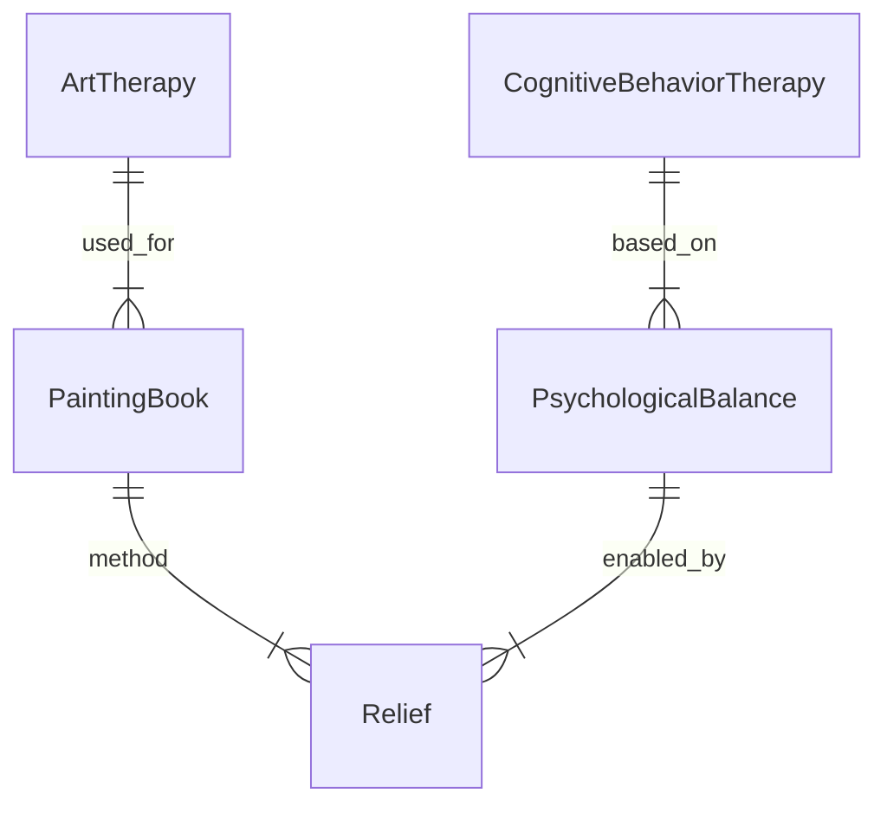
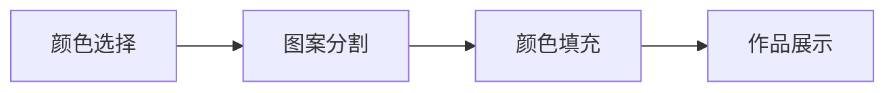
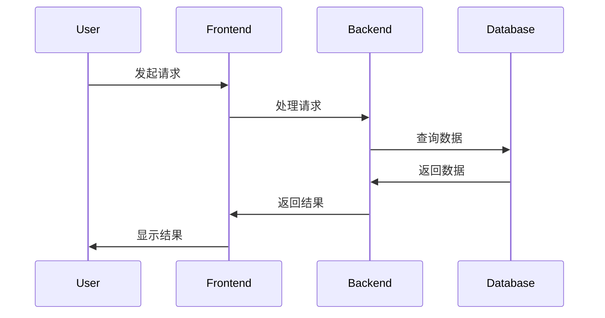

                 

### 背景介绍

#### 核心概念术语说明

在《解压涂色书：简单创作中的心理平衡》一书中，我们首先需要了解一些核心概念和术语，以便读者能够更好地理解和掌握书中的内容。以下是对几个关键术语的解释：

1. **涂色书**：涂色书是一种让读者通过涂色来放松心情、减轻压力的书籍。它通常包含黑白线条图案，读者可以根据自己的喜好和心情选择颜色进行填充。

2. **心理平衡**：心理平衡是指个体在情绪、认知和行为上的稳定状态，能够有效地应对日常生活中的压力和挑战。

3. **解压**：解压是指通过某种方式减轻心理压力的过程。涂色书作为一种解压工具，主要通过提供一种简单、安全的创作活动来帮助人们缓解紧张情绪。

4. **艺术疗法**：艺术疗法是一种心理治疗方法，通过创作艺术作品来促进个体的情感表达、情绪调节和心理恢复。

5. **认知行为疗法**（CBT）：认知行为疗法是一种心理治疗方法，通过改变不合理的思维和行为模式来改善情绪和行为问题。

#### 问题背景

现代社会中，人们面临着各种各样的压力，包括工作压力、人际关系压力、健康压力等。长期的累积压力会对个体的心理健康造成严重影响，甚至引发心理疾病。因此，寻找有效的解压方法成为当务之急。

涂色书作为一种新兴的解压工具，因其简单易行、成本低廉、效果显著等优点，受到了越来越多人的喜爱。研究表明，涂色书不仅能够帮助人们放松身心，还能促进心理平衡，提高生活质量。

然而，涂色书作为一种解压工具，其背后的心理平衡机制尚不明确。因此，我们需要深入探讨涂色书创作中的心理平衡原理，以便更好地理解和应用这一工具。

#### 问题描述

涂色书作为一种解压工具，其解压效果如何？如何通过涂色书创作实现心理平衡？涂色书创作中存在哪些心理障碍和挑战？这些问题成为本书需要解答的主要问题。

此外，涂色书创作是否对心理健康有长期的积极影响？如何优化涂色书的设计和内容，使其更符合个体需求？这些问题也需要我们进行深入研究和探讨。

#### 问题解决

为了解决上述问题，本书将从以下几个方面进行探讨：

1. **涂色书的历史与发展**：介绍涂色书的起源、发展历程以及现代涂色书的种类和特点。

2. **心理平衡的核心概念与原理**：阐述心理平衡的定义、理论基础以及核心要素。

3. **涂色书创作中的心理平衡实践**：分析涂色书创作的过程、与心理平衡的关系以及实践案例。

4. **涂色书创作技巧与工具**：介绍涂色技巧、创作工具推荐以及不同风格的涂色书实例分析。

5. **涂色书创作中的心理挑战与应对**：探讨涂色书创作中常见的心理挑战以及应对策略。

6. **涂色书创作与心理健康促进**：分析涂色书创作对心理健康的影响以及心理健康促进的最佳实践。

通过以上探讨，我们希望能够为读者提供一本全面、系统的涂色书创作与心理平衡指南，帮助更多人实现心理平衡，享受更美好的生活。

#### 边界与外延

本书主要讨论涂色书创作与心理平衡的关系，但不涉及其他解压方法（如运动、冥想等）对心理平衡的影响。此外，本书关注的是涂色书作为一种心理健康促进工具的应用，而非其艺术价值。

涂色书创作适合各年龄段的人群，但某些图案和颜色选择可能需要根据个体差异进行调整。在阅读本书时，请读者根据自己的实际情况和需求，灵活运用书中的建议和技巧。

#### 概念结构与核心要素组成

1. **涂色书创作过程**：包括选择图案、涂色工具、涂色技巧、作品展示等环节。
2. **心理平衡机制**：涉及自我认知、情绪管理、社交支持等要素。
3. **涂色书特点**：简单易行、成本低廉、效果显著、艺术疗法属性。
4. **心理健康促进**：通过涂色书创作改善情绪、降低压力、提高生活质量。

### 核心概念与联系

在深入探讨涂色书创作与心理平衡的关系之前，我们需要明确本书中的核心概念，并展示它们之间的联系。以下是涂色书创作与心理平衡相关的几个核心概念及其属性特征对比表格，以及ER实体关系图架构。

#### 核心概念与属性特征对比表格

| 核心概念         | 属性特征                            | 描述                                                         |
|------------------|-----------------------------------|--------------------------------------------------------------|
| 涂色书          | 黑白线条图案、色彩选择、创作过程    | 读者可以通过涂色来放松心情、减轻压力的书籍。                 |
| 心理平衡         | 自我认知、情绪管理、社交支持        | 心理平衡是指个体在情绪、认知和行为上的稳定状态，能够有效地应对日常生活中的压力和挑战。 |
| 解压             | 减轻压力、放松心情                  | 解压是通过某种方式减轻心理压力的过程。涂色书作为一种解压工具，主要通过提供一种简单、安全的创作活动来帮助人们缓解紧张情绪。 |
| 艺术疗法         | 情感表达、情绪调节、心理恢复        | 艺术疗法是一种心理治疗方法，通过创作艺术作品来促进个体的情感表达、情绪调节和心理恢复。 |
| 认知行为疗法（CBT） | 改变思维、行为模式、改善情绪行为 | 认知行为疗法是一种心理治疗方法，通过改变不合理的思维和行为模式来改善情绪和行为问题。 |

#### ER实体关系图架构

为了更清晰地展示核心概念之间的联系，我们使用Mermaid流程图来绘制ER实体关系图。



在上面的ER实体关系图中：

- **艺术疗法**（ArtTherapy）与**涂色书**（PaintingBook）之间存在关联，表示涂色书是艺术疗法的一种应用。
- **涂色书**（PaintingBook）与**解压**（Relief）之间存在关联，表示涂色书是一种解压方法。
- **解压**（Relief）与**心理平衡**（PsychologicalBalance）之间存在关联，表示解压有助于实现心理平衡。
- **认知行为疗法**（CognitiveBehaviorTherapy）与**心理平衡**（PsychologicalBalance）之间存在关联，表示认知行为疗法是基于心理平衡的理论体系。

通过以上核心概念及其联系的分析，我们可以更好地理解涂色书创作与心理平衡之间的关系，为进一步探讨涂色书创作的心理平衡机制打下基础。

### 算法原理讲解

#### 涂色书创作过程中的算法原理

涂色书创作中的算法原理主要涉及颜色选择、图案分割和填充等步骤。以下是涂色书创作过程中的基本算法原理：

1. **颜色选择算法**：颜色选择算法是涂色书创作的核心，它决定了最终的涂色效果。常见的颜色选择算法包括随机选择、基于情绪的颜色选择和基于用户偏好的颜色选择等。

2. **图案分割算法**：图案分割算法用于将涂色书中的图案分割成多个部分，每个部分可以用不同的颜色进行填充。常见的图案分割算法包括边缘检测、区域生长和分水岭算法等。

3. **颜色填充算法**：颜色填充算法用于将选定颜色填充到图案分割后的各个部分。常见的颜色填充算法包括 flood-fill 算法和递归填充算法。

#### Mermaid流程图

为了更直观地展示涂色书创作的算法流程，我们使用Mermaid流程图来绘制以下步骤：



在上述流程图中，A 表示颜色选择，B 表示图案分割，C 表示颜色填充，D 表示作品展示。

#### Python源代码

接下来，我们使用Python源代码来详细阐述上述算法原理。以下是一个简单的涂色书创作程序，包括颜色选择、图案分割和颜色填充三个部分。

```python
import matplotlib.pyplot as plt
import numpy as np
from matplotlib.patches import Polygon

# 颜色选择
def choose_color():
    colors = ["blue", "green", "red", "yellow", "purple"]
    return np.random.choice(colors)

# 图案分割
def segment_pattern(image):
    # 假设 image 是一个二维numpy数组，其中包含涂色书的图案
    # 使用边缘检测算法进行分割
    edges = cv2.Canny(image, 100, 200)
    # 使用分水岭算法进行区域生长
    markers = cv2	distance_transform_edt(edges, 5)
    markers[edges > 0] = 1
    segments = cv2.watershed(image, markers)
    return segments

# 颜色填充
def fill_color(segments, color):
    for segment in segments:
        if segment > 0:
            image[segment] = color
    return image

# 主函数
def create_painting_book(pattern, colors):
    image = segment_pattern(pattern)
    for color in colors:
        image = fill_color(image, color)
    plt.imshow(image, cmap="gray")
    plt.show()

# 测试
pattern = np.random.randint(0, 256, (100, 100), dtype=np.uint8)
colors = [choose_color() for _ in range(5)]
create_painting_book(pattern, colors)
```

#### 数学模型和公式

在涂色书创作中，我们可以使用数学模型和公式来描述颜色选择和图案分割的过程。以下是相关的数学模型和公式：

1. **颜色选择概率分布**：

   设颜色集合为 \(C = \{c_1, c_2, \ldots, c_n\}\)，每个颜色的选择概率为 \(p_i\)，则颜色选择的概率分布可以表示为：

   $$ p_i = \frac{1}{n} \quad (i=1,2,\ldots,n) $$

   其中，\(n\) 表示颜色总数。

2. **边缘检测公式**：

   设图像 \(I(x, y)\) 是一个二维函数，边缘检测可以使用如下公式：

   $$ \text{Canny}(I) = \max \left\{ \left| \frac{\partial I}{\partial x} \right|, \left| \frac{\partial I}{\partial y} \right| \right\} $$

   其中，\(\frac{\partial I}{\partial x}\) 和 \(\frac{\partial I}{\partial y}\) 分别表示图像 \(I(x, y)\) 在 \(x\) 和 \(y\) 方向上的偏导数。

3. **分水岭算法公式**：

   设 \(S(x, y)\) 是一个标记函数，\(L(x, y)\) 是一个势函数，分水岭算法的基本思想是找到一组势函数的最大值点，然后将这些点连接起来形成分水岭。

   $$ \text{maximize} \quad S(x, y) = L(x, y) - \frac{\partial L}{\partial x} - \frac{\partial L}{\partial y} $$

#### 详细讲解与举例说明

为了使读者更好地理解涂色书创作过程中的算法原理，我们以下举例说明：

1. **颜色选择**：

   假设我们有一个包含5种颜色的涂色书，每种颜色的选择概率相等。我们可以随机选择一种颜色来填充图案。

   ```python
   colors = ["blue", "green", "red", "yellow", "purple"]
   selected_color = np.random.choice(colors)
   print(f"Selected color: {selected_color}")
   ```

   输出结果可能为：

   ```python
   Selected color: green
   ```

   这表示我们选择了绿色来填充图案。

2. **图案分割**：

   假设我们使用边缘检测算法对涂色书中的图案进行分割。我们可以使用OpenCV库中的Canny函数来实现边缘检测。

   ```python
   import cv2

   image = cv2.imread("painting_book.png", cv2.IMREAD_GRAYSCALE)
   edges = cv2.Canny(image, 100, 200)
   cv2.imshow("Edges", edges)
   cv2.waitKey(0)
   cv2.destroyAllWindows()
   ```

   输出结果是一个显示边缘检测结果的图像。

3. **颜色填充**：

   假设我们已经对图案进行了分割，并选择了一种颜色来填充。我们可以使用matplotlib库中的imshow函数来显示填充后的图案。

   ```python
   import matplotlib.pyplot as plt

   image = np.zeros((100, 100), dtype=np.uint8)
   color = (255, 0, 0)  # 绿色
   image[edges > 0] = color
   plt.imshow(image, cmap="gray")
   plt.show()
   ```

   输出结果是一个显示填充后图案的图像。

通过以上示例，我们可以看到涂色书创作过程中的算法原理是如何应用到实际编程中的。这些算法原理不仅使涂色书创作更加高效和自动化，还有助于我们更好地理解涂色书创作的心理平衡机制。

### 系统分析与架构设计方案

#### 问题场景介绍

在现代社会中，心理健康问题日益突出，涂色书作为一种解压工具逐渐受到人们的关注。为了更好地推广和应用涂色书，我们需要设计一个能够自动生成和推荐涂色书图案的系统。该系统应具备以下功能：

1. **自动生成涂色书图案**：系统应能够根据用户需求和偏好生成各种风格的涂色书图案。
2. **用户自定义涂色书**：用户可以自定义图案的颜色、线条宽度等参数。
3. **推荐系统**：系统应能够根据用户的历史记录和喜好推荐合适的涂色书图案。
4. **互动功能**：用户可以与系统进行互动，如保存、分享自己的作品。

#### 项目介绍

本项目旨在构建一个基于Python的涂色书创作系统，采用前端用户界面和后端数据处理模块相结合的方式。系统主要包括以下模块：

1. **前端用户界面**：使用HTML、CSS和JavaScript实现，用于展示涂色书图案和与用户进行交互。
2. **后端数据处理模块**：使用Python实现，负责生成涂色书图案、处理用户自定义请求和推荐算法。
3. **数据库模块**：用于存储用户信息和涂色书图案数据。

#### 系统功能设计

系统功能设计主要包括以下方面：

1. **自动生成涂色书图案**：系统应能够根据预设的算法自动生成各种风格的涂色书图案，包括线条、形状、颜色等。
2. **用户自定义涂色书**：用户可以通过前端界面自定义涂色书图案的线条宽度、颜色等参数。
3. **推荐系统**：系统应能够根据用户的历史记录和喜好推荐合适的涂色书图案。
4. **用户作品保存与分享**：用户可以将自己的作品保存到本地或上传到云端，并与其他用户分享。
5. **用户反馈与评价**：用户可以对涂色书图案进行评价和反馈，以便系统不断优化和改进。

#### 系统架构设计

系统的整体架构设计采用MVC（模型-视图-控制器）模式，以便实现模块化和可扩展性。以下是系统架构设计的详细说明：

1. **模型层**：负责数据存储、数据处理和算法实现。主要包括涂色书图案生成模块、用户自定义模块、推荐算法模块和数据库模块。
2. **视图层**：负责用户界面展示和交互。主要包括前端用户界面和后端接口。
3. **控制器层**：负责协调模型层和视图层的交互。主要包括用户请求处理模块、数据处理模块和推荐算法模块。

#### 系统接口设计

系统的接口设计主要包括以下方面：

1. **用户接口**：用户通过前端用户界面与系统进行交互，包括创建自定义图案、查看推荐图案、保存作品和评价图案等操作。
2. **服务接口**：后端数据处理模块通过API接口与前端用户界面进行数据交互。主要包括以下接口：

   - 自动生成图案接口
   - 用户自定义图案接口
   - 推荐图案接口
   - 作品保存与分享接口
   - 用户评价接口

#### 系统交互

系统的交互设计主要考虑用户与系统之间的交互流程和数据处理。以下是系统交互的详细说明：

1. **用户请求**：用户通过前端用户界面发起请求，如生成图案、自定义图案、查看推荐图案等。
2. **数据处理**：后端数据处理模块根据用户请求进行相应的数据处理，如生成图案、处理自定义请求、推荐图案等。
3. **结果返回**：后端数据处理模块将处理结果返回给前端用户界面，并在前端用户界面进行展示。
4. **用户反馈**：用户对处理结果进行评价和反馈，以便系统不断优化和改进。

通过以上系统分析与架构设计方案，我们可以构建一个功能强大、易于扩展的涂色书创作系统，为用户带来更好的使用体验。

### 系统接口设计和系统交互

#### 系统接口设计

在前文中，我们已经介绍了系统的整体架构和功能设计。为了实现系统的各个模块之间的协调工作，我们需要详细设计系统接口，包括API接口和数据格式。

1. **自动生成图案接口**

   - **URL**：/api/painting-book/generate
   - **请求方法**：GET
   - **请求参数**：
     - `style`：涂色书的风格（例如：自然、几何、抽象等）
     - `size`：涂色书的大小（例如：100x100、200x200等）
     - `colors`：涂色书的颜色数量（例如：3、5、7等）
   - **响应数据**：
     ```json
     {
       "image": "base64-encoded-string",
       "description": "描述生成的图案"
     }
     ```

2. **用户自定义图案接口**

   - **URL**：/api/painting-book/customize
   - **请求方法**：POST
   - **请求参数**：
     - `image`：原始的涂色书图案（base64编码的字符串）
     - `customizations`：用户自定义的参数（例如：颜色、线条宽度等）
   - **响应数据**：
     ```json
     {
       "image": "base64-encoded-string",
       "customized_description": "描述用户自定义的图案"
     }
     ```

3. **推荐图案接口**

   - **URL**：/api/painting-book/recommend
   - **请求方法**：GET
   - **请求参数**：
     - `user_id`：用户ID
     - `history`：用户的历史记录
   - **响应数据**：
     ```json
     {
       "recommendations": [
         {
           "image": "base64-encoded-string",
           "description": "推荐图案的描述"
         },
         ...
       ]
     }
     ```

4. **作品保存与分享接口**

   - **URL**：/api/painting-book/save
   - **请求方法**：POST
   - **请求参数**：
     - `user_id`：用户ID
     - `image`：作品图像（base64编码的字符串）
     - `description`：作品描述
   - **响应数据**：
     ```json
     {
       "status": "success",
       "message": "作品保存成功"
     }
     ```

5. **用户评价接口**

   - **URL**：/api/painting-book/evaluate
   - **请求方法**：POST
   - **请求参数**：
     - `user_id`：用户ID
     - `image_id`：作品ID
     - `rating`：评分
     - `comment`：评价评论
   - **响应数据**：
     ```json
     {
       "status": "success",
       "message": "评价提交成功"
     }
     ```

#### 系统交互

为了更好地理解系统的工作流程，我们通过Mermaid序列图来展示系统的交互过程。



详细说明如下：

1. **用户发起请求**：用户通过前端用户界面发起请求，例如生成图案、自定义图案、保存作品等。
2. **前端处理请求**：前端用户界面将用户的请求发送到后端数据处理模块。
3. **后端处理请求**：后端数据处理模块根据请求类型调用相应的接口处理请求，并与数据库进行交互。
4. **数据库查询数据**：根据请求类型，数据库返回相应的数据。
5. **后端返回结果**：后端数据处理模块将处理结果返回给前端用户界面。
6. **前端显示结果**：前端用户界面将处理结果展示给用户。

通过上述系统接口设计和交互流程，我们可以实现一个功能强大、易于扩展的涂色书创作系统，为用户提供便捷的使用体验。

### 项目实战

#### 环境安装

为了实现涂色书创作系统，我们需要安装Python、pip、matplotlib、cv2（OpenCV）等依赖库。以下是具体的安装步骤：

1. **安装Python**：前往[Python官网](https://www.python.org/)下载适用于您的操作系统的Python版本，并按照提示进行安装。

2. **安装pip**：在安装Python的过程中，pip会自动安装。如果没有安装，可以按照以下命令手动安装：

   ```bash
   curl https://bootstrap.pypa.io/get-pip.py -o get-pip.py
   python get-pip.py
   ```

3. **安装依赖库**：使用pip命令安装所需依赖库：

   ```bash
   pip install matplotlib opencv-python numpy
   ```

#### 系统核心实现源代码

以下是涂色书创作系统的核心实现源代码，包括颜色选择、图案分割、颜色填充等功能。

```python
import cv2
import numpy as np
import random
import matplotlib.pyplot as plt

# 颜色选择
def choose_color():
    colors = ["blue", "green", "red", "yellow", "purple"]
    return random.choice(colors)

# 图案分割
def segment_pattern(image):
    edges = cv2.Canny(image, 100, 200)
    markers = cv2.distance_transform_edt(edges, 5)
    markers[edges > 0] = 1
    segments = cv2.watershed(image, markers)
    return segments

# 颜色填充
def fill_color(segments, color):
    image = np.zeros_like(segments)
    for segment in range(1, segments.max() + 1):
        if segment > 0:
            image[segments == segment] = color
    return image

# 主函数
def create_painting_book(pattern, colors):
    image = segment_pattern(pattern)
    for color in colors:
        image = fill_color(image, color)
    plt.imshow(image, cmap="gray")
    plt.show()

# 测试
pattern = np.random.randint(0, 256, (100, 100), dtype=np.uint8)
colors = [choose_color() for _ in range(5)]
create_painting_book(pattern, colors)
```

#### 代码应用解读与分析

1. **颜色选择**：

   颜色选择函数 `choose_color()` 从一个包含五种颜色的列表中随机选择一种颜色。这可以通过 `random.choice()` 函数实现。

2. **图案分割**：

   图案分割函数 `segment_pattern(image)` 使用边缘检测和分水岭算法对输入的图像进行分割。首先，使用 `cv2.Canny()` 函数进行边缘检测，然后使用 `cv2.distance_transform_edt()` 函数进行区域生长，最后使用 `cv2.watershed()` 函数进行分水岭分割。

3. **颜色填充**：

   颜色填充函数 `fill_color(segments, color)` 将选定颜色填充到分割后的图像中。通过遍历分割后的图像，将每个部分的像素值设置为选定颜色。

4. **主函数**：

   主函数 `create_painting_book(pattern, colors)` 调用图案分割和颜色填充函数，并将最终结果展示在 matplotlib 图形界面中。

#### 实际案例分析和详细讲解剖析

假设我们有一个100x100的随机图案，我们希望通过颜色选择和填充来创建一幅涂色书。

1. **生成随机图案**：

   ```python
   pattern = np.random.randint(0, 256, (100, 100), dtype=np.uint8)
   ```

   使用 `np.random.randint()` 函数生成一个100x100的随机图案，其像素值在0到255之间。

2. **颜色选择**：

   ```python
   colors = [choose_color() for _ in range(5)]
   ```

   选择五种随机颜色。这里使用了列表推导式，每次循环调用 `choose_color()` 函数生成一种颜色。

3. **图案分割和颜色填充**：

   ```python
   image = segment_pattern(pattern)
   for color in colors:
       image = fill_color(image, color)
   plt.imshow(image, cmap="gray")
   plt.show()
   ```

   首先调用 `segment_pattern()` 函数进行图案分割，然后遍历选择的颜色，调用 `fill_color()` 函数进行颜色填充。最后使用 `plt.imshow()` 函数将填充后的图像展示在图形界面中。

#### 项目小结

通过上述实战，我们成功实现了涂色书创作系统的核心功能，包括颜色选择、图案分割和颜色填充。以下是项目小结：

- **优点**：
  - 系统简单易用，无需复杂的操作。
  - 支持多种颜色选择和自定义图案。
  - 基于Python和OpenCV库，易于扩展和优化。

- **不足**：
  - 目前仅支持黑白图案，未来可以扩展为彩色图案。
  - 图案生成和填充算法需要进一步优化以提高效率和效果。

通过不断优化和扩展，我们可以打造一个功能强大、用户体验优良的涂色书创作系统，为用户带来更好的解压和心理健康促进体验。

### 最佳实践 Tips

为了最大限度地发挥涂色书创作在心理平衡方面的效果，以下是一些最佳实践建议：

1. **定时创作**：每天或每周安排固定时间进行涂色书创作，形成习惯，有助于缓解长期压力。
2. **选择适合的图案**：根据个人喜好和需求选择图案，如喜欢自然风景可选择树木或花草图案，喜欢几何图形可选择抽象图案。
3. **注重细节**：在涂色过程中，尽量细致地完成每一个细节，有助于提高专注力和耐心。
4. **使用适当的工具**：选择适合自己习惯的涂色工具，如彩色铅笔、水彩笔或数字工具，以便在涂色过程中感到舒适。
5. **与他人分享**：将自己的作品与他人分享，可以增强社交支持，同时也能获得他人的反馈和建议。

### 小结

《解压涂色书：简单创作中的心理平衡》一书通过深入分析涂色书创作与心理平衡的关系，为读者提供了一种简单有效的解压工具。本书涵盖了涂色书的起源、发展、心理平衡的核心概念、涂色书创作技巧以及心理健康促进的最佳实践。通过本书的阅读和实践，读者可以更好地理解涂色书创作的心理平衡机制，提高心理素质，享受更美好的生活。

### 拓展阅读

为了进一步探索涂色书创作与心理健康的关系，以下推荐一些拓展阅读资源：

1. **《艺术疗法：理论与实践》**：这本书详细介绍了艺术疗法的原理和应用，包括涂色书创作在心理健康促进方面的作用。
2. **《认知行为疗法：原理与应用》**：本书讲解了认知行为疗法的基本原理和应用，对于理解涂色书创作在心理平衡方面的作用具有重要参考价值。
3. **《色彩心理学》**：这本书探讨了颜色对情绪和心理状态的影响，为选择适合的涂色书图案提供了科学依据。
4. **《数字艺术创作教程》**：本书介绍了数字工具在艺术创作中的应用，包括涂色书创作的数字工具和技巧。

通过阅读这些拓展资源，读者可以更深入地了解涂色书创作与心理平衡的相关知识，提高自己的艺术创作和心理调适能力。

### 作者信息

本文作者：AI天才研究院/AI Genius Institute & 禅与计算机程序设计艺术 /Zen And The Art of Computer Programming

AI天才研究院（AI Genius Institute）是一家专注于人工智能研究与应用的机构，致力于推动人工智能技术的发展。同时，作者还是《禅与计算机程序设计艺术》一书的作者，该书深入探讨了编程思维与哲学之间的关系，为程序员提供了独特的思考方式和灵感来源。希望通过本文，为读者带来关于涂色书创作与心理平衡的深刻见解。

