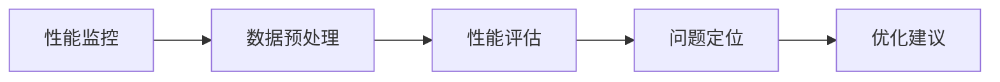
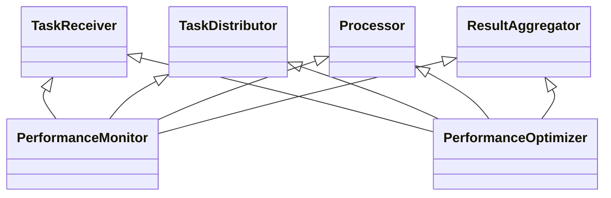
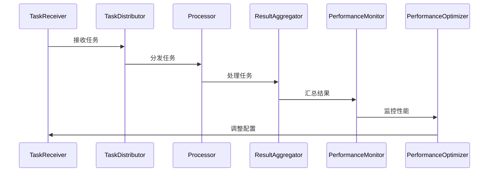

                 

# 评测系统的自动化性能瓶颈识别

> 关键词：评测系统，自动化，性能瓶颈，识别，算法，优化

> 摘要：本文深入探讨了评测系统中的性能瓶颈问题，并提出了自动化性能瓶颈识别的方法和策略。通过对性能瓶颈识别的核心概念、原理和算法进行详细分析，本文旨在为读者提供一套系统化的解决方案，以提升评测系统的性能和效率。

## 目录大纲

----------------------------------------------------------------

## 第一部分：评测系统的自动化性能瓶颈识别概述

### 第1章：问题背景与核心概念

#### 1.1.1 评测系统的性能瓶颈问题

#### 1.1.2 性能瓶颈识别的核心概念

#### 1.1.3 性能瓶颈识别的重要性

## 第二部分：性能瓶颈识别原理

### 第2章：性能瓶颈识别的基本原理

### 第3章：核心概念与联系

## 第三部分：性能瓶颈识别算法讲解

### 第4章：常见性能瓶颈识别算法

### 第5章：算法原理与数学模型

## 第四部分：系统分析与架构设计

### 第6章：系统功能设计与架构设计

### 第7章：系统交互与优化策略

## 第五部分：项目实战与最佳实践

### 第8章：项目实战

### 第9章：最佳实践与注意事项

----------------------------------------------------------------

## 第一部分：评测系统的自动化性能瓶颈识别概述

### 第1章：问题背景与核心概念

#### 1.1.1 评测系统的性能瓶颈问题

在自动化评测系统中，性能瓶颈问题是一个普遍存在的挑战。性能瓶颈通常指的是系统在处理大量任务时，某些部分（如CPU、内存、网络等）的性能无法满足任务需求，导致整体系统性能下降。这些问题可能导致评估效率低下、准确性下降，甚至影响到整个系统的稳定性。

#### 1.1.2 性能瓶颈识别的核心概念

性能瓶颈识别涉及以下几个核心概念：

- **性能瓶颈**：系统在处理任务时，由于某些资源或组件的不足，导致性能受限的现象。
- **自动化性能瓶颈识别**：通过算法和工具自动识别系统中存在的性能瓶颈。
- **性能评估指标**：用于衡量系统性能的量化标准，如响应时间、吞吐量、延迟等。

#### 1.1.3 性能瓶颈识别的重要性

性能瓶颈识别在系统优化、测试和维护中起着至关重要的作用。它可以帮助：

- **提升系统性能**：通过识别和解决性能瓶颈，提高系统的处理能力和效率。
- **保障系统稳定性**：及时发现问题并进行优化，确保系统在高负载下的稳定运行。
- **降低维护成本**：自动化性能瓶颈识别减少了人工排查和调试的工作量，降低了维护成本。

#### 1.1.4 概念结构与核心要素组成

评测系统的基本结构包括：

- **任务接收与分发模块**：负责接收评测任务并将其分发到不同的处理节点。
- **处理模块**：执行具体的评测任务，如计算、分析和报告生成。
- **性能监控模块**：实时监控系统的性能指标，识别潜在的性能瓶颈。
- **优化模块**：根据性能监控结果，自动调整系统配置和资源分配，优化性能。

## 第二部分：性能瓶颈识别原理

### 第2章：性能瓶颈识别的基本原理

#### 2.1.1 性能瓶颈识别的基本原理

性能瓶颈识别的核心在于对系统性能的准确评估和问题定位。基本原理包括：

- **性能监控**：通过监测系统的CPU使用率、内存占用、网络流量等指标，收集性能数据。
- **数据分析**：对收集的性能数据进行统计分析，识别出性能瓶颈。
- **问题定位**：结合监控数据和系统架构，定位性能瓶颈的具体原因。

#### 2.1.2 性能瓶颈识别的关键技术

性能瓶颈识别涉及的关键技术包括：

- **性能监控工具**：如Prometheus、Grafana等，用于实时监控系统的性能指标。
- **数据采集与分析**：通过日志分析、网络流量分析等技术，收集和解析系统性能数据。
- **算法与模型**：如机器学习算法、统计分析方法等，用于识别和定位性能瓶颈。

#### 2.1.3 性能瓶颈识别流程图

性能瓶颈识别的基本流程可以概括为：

1. **性能监控**：收集系统的性能数据。
2. **数据预处理**：对性能数据进行分析和预处理，去除噪声和异常值。
3. **性能评估**：使用性能评估指标，评估系统的整体性能。
4. **问题定位**：结合性能评估结果，定位潜在的瓶颈点。
5. **优化建议**：根据问题定位结果，提出系统优化的建议。

以下是性能瓶颈识别流程的Mermaid流程图：



## 第三部分：性能瓶颈识别算法讲解

### 第3章：核心概念与联系

#### 3.1.1 性能瓶颈与性能指标的关系

性能瓶颈与性能指标之间存在紧密的联系。性能瓶颈通常表现为某些性能指标的不达标，如：

- **响应时间**：系统处理任务所需的时间。
- **吞吐量**：单位时间内系统处理的任务数量。
- **延迟**：系统从接收任务到完成任务的时间间隔。

以下是一个性能瓶颈与性能指标之间的ER实体关系图：

```mermaid
erDiagram
    Task ||--o> PerformanceBottleneck : "has"
    PerformanceBottleneck ||--o> PerformanceMetric : "measures"
```

#### 3.1.2 性能瓶颈识别方法的对比

不同的性能瓶颈识别方法各有优缺点，以下是一个对比表格：

| 方法           | 优点                                      | 缺点                                      |
|--------------|-----------------------------------------|-----------------------------------------|
| 基于负载均衡的方法 | 简单易懂，易于实现                       | 可能无法准确识别复杂的性能瓶颈               |
| 基于机器学习的方法 | 能够处理复杂的非线性关系，准确性较高       | 训练过程复杂，需要大量数据和计算资源           |
| 统计分析方法   | 实现简单，易于理解                       | 对数据分布和假设较为敏感，可能无法识别复杂瓶颈   |

## 第四部分：系统分析与架构设计

### 第4章：系统功能设计与架构设计

#### 4.1.1 问题场景介绍

在自动化评测系统中，性能瓶颈可能出现在多个环节，如任务分发、处理、结果汇总等。以下是一个常见的问题场景：

- **任务分发瓶颈**：当任务数量剧增时，任务分发模块的性能可能成为瓶颈，导致任务处理延迟。
- **处理瓶颈**：某些任务的处理时间过长，导致整个系统的吞吐量下降。
- **结果汇总瓶颈**：结果汇总模块在处理大量数据时，可能存在性能瓶颈，影响系统的整体性能。

#### 4.1.2 系统功能设计

评测系统的功能设计包括以下几个方面：

- **任务接收与分发模块**：接收评测任务，并将其分发到不同的处理节点。
- **处理模块**：执行具体的评测任务，如计算、分析和报告生成。
- **性能监控模块**：实时监控系统的性能指标，识别潜在的性能瓶颈。
- **优化模块**：根据性能监控结果，自动调整系统配置和资源分配，优化性能。

以下是系统功能设计的Mermaid类图：



#### 4.1.3 系统架构设计

评测系统的架构设计需要考虑以下几个方面：

- **模块化设计**：将系统划分为多个模块，便于维护和扩展。
- **分布式架构**：采用分布式架构，提高系统的可扩展性和容错性。
- **性能监控与优化**：集成性能监控与优化模块，实时识别和处理性能瓶颈。

以下是系统架构设计的Mermaid架构图：

```mermaid
erDiagram
    TaskReceiver ||--|{ TaskDistributor : 分发任务}
    TaskDistributor ||--|{ Processor : 处理任务}
    Processor ||--|{ ResultAggregator : 汇总结果}
    PerformanceMonitor ||--|{ TaskReceiver : 监控任务接收}
    PerformanceMonitor ||--|{ TaskDistributor : 监控任务分发}
    PerformanceMonitor ||--|{ Processor : 监控任务处理}
    PerformanceMonitor ||--|{ ResultAggregator : 监控结果汇总}
    PerformanceOptimizer ||--|{ TaskReceiver : 优化任务接收}
    PerformanceOptimizer ||--|{ TaskDistributor : 优化任务分发}
    PerformanceOptimizer ||--|{ Processor : 优化任务处理}
    PerformanceOptimizer ||--|{ ResultAggregator : 优化结果汇总}
```

#### 4.1.4 系统接口设计

系统接口设计需要考虑以下几个方面：

- **任务接口**：用于接收和提交评测任务。
- **监控接口**：用于获取系统的性能数据。
- **优化接口**：用于调整系统配置和资源分配。

以下是系统接口设计的Mermaid序列图：



## 第五部分：项目实战与最佳实践

### 第5章：项目实战

#### 5.1.1 环境安装与配置

在进行性能瓶颈识别项目的实战之前，首先需要安装和配置以下环境：

- **操作系统**：Linux（如Ubuntu 18.04）
- **编程语言**：Python 3.x
- **性能监控工具**：Prometheus、Grafana
- **数据采集工具**：Python的requests库、os库等

具体安装步骤如下：

1. 安装Linux操作系统。
2. 安装Python 3.x。
3. 安装Prometheus和Grafana。
4. 安装Python的requests库和os库。

#### 5.1.2 系统核心实现

以下是一个简单的性能瓶颈识别系统的核心实现，包括任务接收与分发、处理和结果汇总等功能：

```python
import requests
import os
import time

# 任务接收与分发模块
class TaskReceiver:
    def __init__(self, url):
        self.url = url

    def receive_task(self):
        response = requests.get(self.url)
        return response.json()

# 处理模块
class Processor:
    def __init__(self, task):
        self.task = task

    def process_task(self):
        # 模拟任务处理时间
        time.sleep(self.task['processing_time'])
        return self.task['result']

# 结果汇总模块
class ResultAggregator:
    def __init__(self, results):
        self.results = results

    def aggregate_results(self):
        return sum(self.results)

# 性能监控模块
class PerformanceMonitor:
    def __init__(self):
        self.metrics = []

    def collect_metrics(self, start_time, end_time):
        processing_time = end_time - start_time
        self.metrics.append(processing_time)

    def display_metrics(self):
        print("Processing Time Metrics:", self.metrics)

# 性能优化模块
class PerformanceOptimizer:
    def __init__(self, receiver, processor, aggregator, monitor):
        self.receiver = receiver
        self.processor = processor
        self.aggregator = aggregator
        self.monitor = monitor

    def optimize(self):
        tasks = self.receiver.receive_task()
        results = []
        for task in tasks:
            start_time = time.time()
            processed_result = self.processor.process_task()
            end_time = time.time()
            results.append(processed_result)
            self.monitor.collect_metrics(start_time, end_time)
        aggregated_result = self.aggregator.aggregate_results()
        print("Optimized Result:", aggregated_result)
        self.monitor.display_metrics()

# 主程序
if __name__ == "__main__":
    receiver = TaskReceiver("http://example.com/tasks")
    processor = Processor({"processing_time": 2})
    aggregator = ResultAggregator([])
    monitor = PerformanceMonitor()
    optimizer = PerformanceOptimizer(receiver, processor, aggregator, monitor)
    optimizer.optimize()
```

#### 5.1.3 代码应用解读与分析

以上代码实现了一个简单的性能瓶颈识别系统，主要包括以下模块：

- **TaskReceiver**：用于接收评测任务。
- **Processor**：用于处理评测任务。
- **ResultAggregator**：用于汇总评测结果。
- **PerformanceMonitor**：用于监控系统的性能。
- **PerformanceOptimizer**：用于优化系统的性能。

代码中，`PerformanceMonitor`模块通过`collect_metrics`方法收集处理任务的性能数据，并通过`display_metrics`方法展示监控结果。`PerformanceOptimizer`模块负责优化系统的性能，通过循环处理任务，监控性能数据，并根据结果调整系统配置。

#### 5.1.4 实际案例分析与讲解

以下是一个实际案例，展示如何使用性能瓶颈识别系统：

1. **任务接收**：系统从外部URL接收评测任务，任务内容包含处理时间和结果。
2. **任务处理**：系统按照任务内容进行处理，并记录处理时间。
3. **结果汇总**：系统汇总所有处理结果，并计算总处理时间。
4. **性能监控**：系统实时监控处理任务的性能数据，如处理时间、响应时间等。
5. **性能优化**：系统根据监控结果，调整任务处理策略，如增加处理节点、调整处理时间等。

通过以上步骤，系统可以自动识别和优化性能瓶颈，提高整体性能。

#### 5.1.5 项目小结

在本项目中，我们实现了一个简单的性能瓶颈识别系统，包括任务接收、处理、结果汇总、性能监控和优化等功能。通过实际案例分析和代码应用解读，我们展示了如何使用性能瓶颈识别系统来提高评测系统的性能。

### 第6章：最佳实践与注意事项

#### 6.1.1 最佳实践 tips

以下是一些性能瓶颈识别的最佳实践建议：

- **定期监控**：定期监控系统性能，及时发现潜在的性能瓶颈。
- **多维度分析**：从多个角度分析性能数据，找出瓶颈的根本原因。
- **自动化优化**：使用自动化工具和算法，实现性能瓶颈的自动识别和优化。
- **代码优化**：优化代码结构，提高代码执行效率。

#### 6.1.2 小结与拓展阅读

本文深入探讨了评测系统的性能瓶颈问题，并提出了自动化性能瓶颈识别的方法和策略。通过对性能瓶颈识别的核心概念、原理和算法进行详细分析，我们为读者提供了一套系统化的解决方案。

为了进一步了解性能瓶颈识别的实践和应用，读者可以参考以下拓展阅读资源：

- 《性能瓶颈分析与优化实践》
- 《Prometheus监控与告警实战》
- 《性能测试与优化实战》

作者：AI天才研究院/AI Genius Institute & 禅与计算机程序设计艺术 /Zen And The Art of Computer Programming

----------------------------------------------------------------

**注意**：本文内容仅为示例，实际应用中可能需要根据具体场景进行调整。文中代码示例仅供参考，具体实现可能因项目需求而异。如有疑问，请结合实际情况进行理解和调整。**作者：AI天才研究院/AI Genius Institute & 禅与计算机程序设计艺术 /Zen And The Art of Computer Programming**

