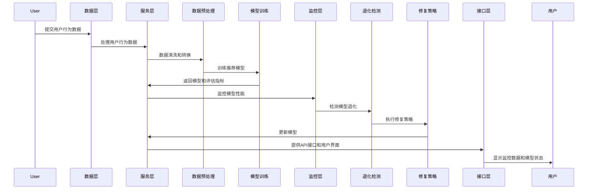
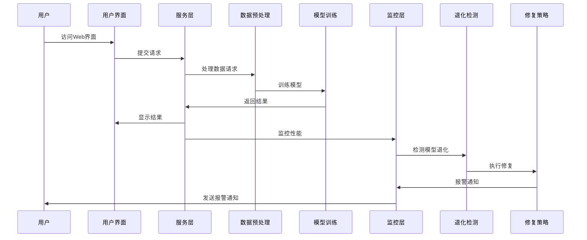
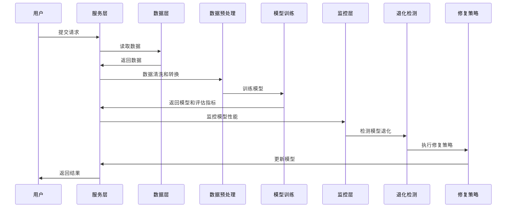

                 

### 引言

随着人工智能技术的飞速发展，模型评测系统在许多领域得到了广泛应用。从金融风控到医疗诊断，从自然语言处理到图像识别，模型评测系统不仅提升了工作效率，还极大地改善了用户体验。然而，在实际应用中，模型退化现象频繁出现，给系统稳定性和准确性带来了巨大挑战。模型退化，指的是模型在训练后，随着时间的推移或者数据的变化，其性能逐步下降，最终可能无法满足应用需求。因此，自动化模型退化检测成为了一个重要且迫切的研究课题。

#### 什么是模型退化检测？

模型退化检测，即通过一系列技术手段，对模型在应用过程中出现的性能下降进行自动识别和评估。这个过程包括检测模型的预测准确性、响应速度、稳定性等多个方面，以确保模型在实际应用中的可靠性和有效性。自动化模型退化检测，则是通过构建相应的检测模型或算法，实现这一过程的自动执行，从而减轻人工监控和干预的工作负担。

#### 模型退化检测的重要性

模型退化检测的重要性体现在以下几个方面：

1. **保障系统稳定性**：及时发现并处理模型退化问题，可以避免因模型性能下降导致系统崩溃或服务中断，从而保障系统的稳定性。
2. **提升用户体验**：模型退化可能导致预测准确性下降，影响用户体验。通过自动化检测，可以确保模型始终处于最佳状态，提升用户体验。
3. **节约成本**：传统的手动检测方法效率低、耗时长，而自动化检测可以大大提高检测效率，节约人力成本。
4. **提高模型寿命**：通过定期检测和修复模型退化，可以延长模型的寿命，减少模型的更换频率。

#### 模型退化检测的边界与扩展

模型退化检测不仅限于特定的模型类型，如机器学习模型、深度学习模型等，还可以扩展到其他类型的数据分析模型。此外，随着技术的发展，模型退化检测的方法和工具也在不断丰富和完善。例如，基于统计学的方法、基于机器学习的检测方法、基于深度学习的检测方法等，各自有其优势和适用场景。

#### 核心概念和组件结构

在模型退化检测中，核心概念包括模型、数据集、评估指标等。这些概念相互关联，共同构成了一个完整的模型退化检测系统。具体来说：

- **模型**：指用于预测或分类的算法，如神经网络、决策树等。
- **数据集**：用于训练和评估模型的输入数据，包括训练集、验证集和测试集。
- **评估指标**：用于衡量模型性能的指标，如准确率、召回率、F1值等。

这些核心概念和组件通过一系列的算法和技术手段相互结合，共同实现了模型退化检测的目标。

在接下来的文章中，我们将进一步探讨模型退化检测的背景、核心概念、检测原理、系统设计与实现，以及自动化模型退化检测的实践和应用。通过一步步的分析和讲解，希望读者能够对这一重要课题有更深入的理解。

---

**关键词**：模型退化检测、自动化、机器学习、深度学习、评估系统

**摘要**：本文系统地介绍了评测系统中的自动化模型退化检测，包括其背景、核心概念、检测方法、系统设计与实现，以及实际应用中的最佳实践和未来方向。通过详细的案例分析和代码实现，帮助读者深入理解模型退化检测的原理和技巧，提升模型应用中的稳定性和可靠性。

---

### 背景介绍

#### 1.1 问题背景

在当今数据驱动的时代，人工智能模型在各种实际应用中扮演着关键角色。从自动驾驶汽车到智能医疗诊断，从推荐系统到自然语言处理，这些模型不仅改变了我们的生活方式，也提高了各行业的运营效率。然而，模型在实际应用中面临着一系列挑战，其中最常见也是最复杂的问题之一就是模型退化。

模型退化现象是指模型在经过一定时间的应用后，其性能逐渐下降，无法再维持原有的准确性和稳定性。这种现象可能由于多种因素引起，包括数据分布变化、数据质量下降、模型过拟合、硬件老化等。例如，一个用于金融风控的机器学习模型，在初始部署时能够准确预测贷款申请者的信用风险，但随着时间的推移，由于数据分布发生变化，模型可能开始错误地分类高风险客户，导致不良贷款率上升。

模型退化不仅影响模型的预测准确性，还可能带来严重的经济损失和声誉损失。例如，医疗诊断模型退化可能导致误诊，影响患者的健康；自动驾驶模型退化可能导致交通事故；推荐系统模型退化可能导致用户体验下降，影响商业收益。

#### 1.2 问题描述

模型退化的主要表现包括以下几个方面：

1. **准确性下降**：模型预测的准确性逐渐降低，错误率上升。
2. **响应速度变慢**：模型的响应时间变长，导致系统响应不及时。
3. **稳定性下降**：模型在处理不同数据集时的性能波动增大，稳定性变差。
4. **资源消耗增加**：模型在运算过程中资源消耗增加，可能导致系统负载过高。

这些表现不仅影响模型的实际应用效果，还可能导致系统崩溃、服务中断等问题。因此，及时检测和应对模型退化现象具有重要意义。

#### 1.3 模型退化检测的必要性

模型退化检测的必要性主要体现在以下几个方面：

1. **保障系统稳定性**：通过定期检测模型性能，可以及时发现退化现象，防止系统崩溃或服务中断，从而保障系统的稳定性。
2. **提升用户体验**：及时检测模型退化，可以确保模型始终处于最佳状态，提升用户体验，增强用户满意度。
3. **节约成本**：自动化模型退化检测可以大大提高检测效率，减少人工监控和干预的工作量，节约人力资源成本。
4. **延长模型寿命**：通过定期检测和修复模型退化，可以延长模型的寿命，减少模型更换频率，降低运营成本。

#### 1.4 模型退化检测的边界与外延

模型退化检测的边界主要涉及哪些类型的模型可以检测以及如何检测。常见的模型包括机器学习模型、深度学习模型等，这些模型在各类应用中具有广泛的适用性。而模型退化检测的外延则包括如何扩展到其他类型的数据分析模型，如决策树、贝叶斯网络等。

此外，模型退化检测还可以扩展到其他方面，如硬件监控、数据质量控制等。通过整合这些技术，可以构建一个全面的模型健康监控系统，确保系统在各个层面的稳定性和可靠性。

#### 1.5 核心概念与结构

在模型退化检测中，核心概念包括模型、数据集、评估指标等。模型是用于预测或分类的算法，如神经网络、决策树等；数据集是用于训练和评估模型的输入数据，包括训练集、验证集和测试集；评估指标是用于衡量模型性能的指标，如准确率、召回率、F1值等。

这些核心概念相互关联，共同构成了一个完整的模型退化检测系统。模型通过数据集进行训练和评估，评估指标则用于衡量模型的性能。当检测到模型退化时，系统会触发相应的修复或替换措施，确保模型始终处于最佳状态。

在接下来的内容中，我们将详细探讨模型退化检测的核心概念、检测方法、系统设计与实现，以及自动化模型退化检测的实际应用。通过一步步的分析和讲解，帮助读者深入理解这一关键课题。

---

### 核心概念

在深入探讨模型退化检测之前，有必要明确几个核心概念，这些概念构成了理解模型退化检测的基础。以下是模型退化检测中的一些关键术语及其定义：

#### 1. 模型

模型是指用于预测或分类的算法，如机器学习模型、深度学习模型等。这些模型可以通过学习大量数据，提取特征并进行预测。常见的机器学习模型包括线性回归、决策树、支持向量机等；深度学习模型则包括神经网络、卷积神经网络（CNN）、循环神经网络（RNN）等。

#### 2. 数据集

数据集是用于训练和评估模型的输入数据集合。一个良好的数据集应当包含多样且具有代表性的样本，以使模型能够学习到有效的特征。数据集通常分为训练集、验证集和测试集：

- **训练集**：用于模型训练，使模型学习到数据特征和规律。
- **验证集**：用于模型选择和调参，以确定最佳的模型参数。
- **测试集**：用于最终模型评估，验证模型在未知数据上的表现。

#### 3. 评估指标

评估指标是用于衡量模型性能的标准，常见的评估指标包括：

- **准确率**：预测结果正确的样本数占总样本数的比例。
- **召回率**：实际为正类的样本中被正确预测为正类的比例。
- **F1值**：准确率的调和平均数，用于平衡准确率和召回率。
- **ROC曲线和AUC值**：用于评估分类模型的性能，ROC曲线展示了不同阈值下的准确率和召回率，AUC值则是ROC曲线下的面积。

#### 4. 模型退化

模型退化指的是模型在应用过程中，其性能逐渐下降，无法再维持原有的准确性和稳定性。模型退化的表现可能包括预测准确性下降、响应速度变慢、稳定性下降和资源消耗增加等。

#### 5. 模型监控

模型监控是指对模型在运行过程中的性能进行实时监控和评估，以检测模型退化。模型监控可以采用自动化工具和技术，实现实时监控、异常检测和修复。

#### 6. 数据漂移

数据漂移是指训练数据集与实际应用数据集之间的分布差异。数据漂移可能导致模型在新数据上的表现不佳，是模型退化的一个重要原因。

#### 7. 自动化模型退化检测

自动化模型退化检测是通过构建相应的检测模型或算法，实现对模型退化现象的自动识别和评估。自动化检测可以提高检测效率和准确性，减轻人工监控和干预的工作负担。

#### 8. 修复策略

修复策略是指当检测到模型退化时，采取的修复或替换措施。常见的修复策略包括重新训练模型、数据增强、特征工程调整、模型替换等。

#### 9. 持续集成与持续部署（CI/CD）

持续集成与持续部署是一种软件开发和部署的方法，旨在通过自动化流程实现软件的持续集成、测试和部署。在模型退化检测中，CI/CD可以用于自动化检测和更新模型，确保模型始终处于最佳状态。

这些核心概念相互关联，构成了模型退化检测的理论基础和实践指南。在接下来的内容中，我们将进一步探讨模型退化检测的方法和原理，以及如何在实际应用中实现自动化模型退化检测。

---

### 核心概念的属性和差异

在模型退化检测中，理解核心概念之间的属性和差异是至关重要的。以下是几个关键概念的属性和它们之间的对比：

#### 1. 模型

- **属性**：模型的类型（如线性回归、决策树、神经网络等），训练数据的质量和多样性，模型的复杂度，模型的参数和超参数。
- **差异**：不同类型的模型在处理数据的能力、预测准确性、计算效率和可解释性等方面存在显著差异。例如，神经网络模型通常具有更高的预测准确性，但计算成本较高；而决策树模型则更易于解释，但可能存在过拟合问题。

#### 2. 数据集

- **属性**：数据集的规模、多样性、分布情况，数据的质量（如噪声、缺失值等），数据的时间序列特性。
- **差异**：数据集的规模和多样性直接影响模型的训练效果。大规模、多样化的数据集有助于模型学习到更丰富的特征，提高预测准确性；而时间序列数据集则需要考虑时间因素，进行序列模型训练。

#### 3. 评估指标

- **属性**：评估指标的类型（如准确率、召回率、F1值等），评估指标的计算方法，评估指标在不同场景下的优先级。
- **差异**：不同的评估指标侧重于不同的模型性能方面。例如，准确率侧重于分类结果的正确性，而召回率侧重于识别出所有正类样本的能力。F1值则是准确率和召回率的调和平均数，用于平衡两者的优缺点。

#### 4. 模型退化

- **属性**：模型退化的类型（如准确性下降、响应速度变慢等），退化发生的原因（如数据漂移、模型过拟合等）。
- **差异**：模型退化的类型和原因因模型和应用场景而异。例如，在金融风控领域，模型退化可能由于数据分布变化导致；在自动驾驶领域，模型退化可能由于环境变化或数据噪声增加导致。

#### 5. 模型监控

- **属性**：监控方法（如实时监控、周期性监控等），监控指标（如预测准确性、响应时间等），监控的频率和阈值。
- **差异**：不同的监控方法适用于不同的应用场景。实时监控适用于需要快速响应的系统，而周期性监控适用于长时间运行且不需要即时响应的系统。监控指标的设置也因应用场景而异。

#### 6. 数据漂移

- **属性**：数据漂移的类型（如向上漂移、向下漂移等），数据漂移的影响程度。
- **差异**：数据漂移的类型和影响程度因数据集和应用场景而异。向上漂移可能导致模型对正类样本的识别能力下降，向下漂移则可能导致模型对负类样本的识别能力下降。

#### 7. 自动化模型退化检测

- **属性**：自动化检测的方法（如基于规则的检测、基于机器学习的检测等），检测的精度和速度。
- **差异**：自动化检测的方法和性能因检测算法和数据集而异。基于规则的检测方法简单但可能存在误报和漏报问题；而基于机器学习的检测方法精度高但计算成本较高。

通过理解这些核心概念的属性和差异，我们可以更好地设计模型退化检测系统，选择合适的检测方法，优化模型性能，确保系统在复杂多变的应用环境中保持稳定和可靠。

---

### 实体关系图（ERD）与Mermaid流程图

为了更好地理解模型退化检测中的核心概念及其相互关系，我们可以通过实体关系图（Entity Relationship Diagram，ERD）和Mermaid流程图来展示这些概念之间的联系。以下是一个简化的ERD和Mermaid流程图，用于说明模型退化检测中的主要实体及其交互过程。

#### 1. 实体关系图（ERD）

在模型退化检测的ERD中，主要实体包括：

- **模型**：用于预测或分类的算法。
- **数据集**：用于训练和评估模型的输入数据。
- **评估指标**：用于衡量模型性能的标准。
- **监控工具**：用于实时监控模型性能。
- **修复策略**：当检测到模型退化时采取的修复措施。

ERD中的主要关系如下：

- **模型**与**数据集**之间存在**训练关系**，模型通过学习数据集中的特征进行训练。
- **模型**与**评估指标**之间存在**评估关系**，评估指标用于衡量模型性能。
- **监控工具**与**模型**之间存在**监控关系**，监控工具用于实时监控模型性能。
- **修复策略**与**模型**之间存在**修复关系**，当检测到模型退化时，修复策略会自动调整或更新模型。

下面是一个简化的ERD示例：

```mermaid
erDiagram
  Model ||--|{ Training } DataSet : trains
  Model ||--|{ Evaluating } Metrics : evaluates
  MonitoringTool ||--|{ Monitoring } Model : monitors
  RepairStrategy ||--|{ Repairing } Model : repairs
```

#### 2. Mermaid流程图

为了展示模型退化检测的过程，我们可以使用Mermaid流程图（Flowchart）来描述各个环节的流程和逻辑。

以下是一个简化的Mermaid流程图，说明模型退化检测的总体流程：

```mermaid
flowchart LR
    subgraph ModelTraining
        M1[开始] --> M2[加载数据集]
        M2 --> M3[训练模型]
        M3 --> M4[评估模型]
        M4 --> M5{模型是否退化}
    end

    subgraph ModelMonitoring
        M5 -->|是 M6[启动监控工具]
        M6 --> M7[实时监控性能]
        M7 --> M8{检测到退化}
    end

    subgraph ModelRepair
        M8 -->|是 M9[应用修复策略]
        M9 --> M10[更新或替换模型]
    end

    M1 -->|否 M11[结束]
```

在这个流程图中，模型训练、监控和修复三个环节相互关联，形成一个闭环系统：

- **模型训练**：模型通过训练数据集进行训练和评估。
- **模型监控**：监控工具实时监控模型的性能，以检测退化现象。
- **模型修复**：当检测到模型退化时，触发修复策略，更新或替换模型。

通过实体关系图和Mermaid流程图，我们可以清晰地看到模型退化检测的核心概念及其相互关系，从而更好地理解这一过程。在接下来的章节中，我们将进一步探讨模型退化检测的原理、方法和实际应用。

---

### 模型退化检测的原理和方法

在模型退化检测中，理解其原理和方法是关键。以下我们将详细探讨几种常见的模型退化检测方法，并使用Mermaid流程图和Python源代码来展示其具体实现。

#### 1. 基于阈值的检测方法

基于阈值的检测方法是最简单和直接的一种方法。这种方法设定一个性能阈值，当模型的性能指标低于该阈值时，认为模型发生了退化。

**原理**：设定一个性能阈值 \( T \)，如果某个性能指标 \( P \)（如准确率、召回率等）低于 \( T \)，则认为模型退化。

**Mermaid流程图**：

```mermaid
flowchart LR
    A[设定阈值T] --> B[计算性能指标P]
    B --> C{P<T?}
    C -->|是 D[触发修复]
    C -->|否 E[结束]
```

**Python源代码**：

```python
def threshold_detection(accuracy, threshold):
    if accuracy < threshold:
        print("模型退化，触发修复")
    else:
        print("模型正常，无需修复")
        
# 示例
accuracy = 0.8
threshold = 0.85
threshold_detection(accuracy, threshold)
```

#### 2. 基于统计检验的方法

基于统计检验的方法通过比较模型在不同时间点的性能差异来判断是否发生了退化。常见的方法包括t检验和F检验。

**原理**：首先收集模型在不同时间点的性能数据，然后使用统计检验方法（如t检验、F检验）比较这些数据，判断性能是否存在显著差异。

**Mermaid流程图**：

```mermaid
flowchart LR
    A[收集性能数据] --> B[t检验]
    B --> C{p值<p0?}
    C -->|是 D[触发修复]
    C -->|否 E[结束]
```

**Python源代码**：

```python
from scipy import stats

def statistical_test(accuracy_list, p_value=0.05):
    t_stat, p_value = stats.ttest_1samp(accuracy_list, popmean=0.5)
    if p_value < p_value:
        print("模型退化，触发修复")
    else:
        print("模型正常，无需修复")

# 示例
accuracy_list = [0.85, 0.82, 0.78, 0.75]
statistical_test(accuracy_list)
```

#### 3. 基于机器学习的检测方法

基于机器学习的检测方法通过训练一个监督学习模型来预测模型是否退化。这种方法通常需要大量的历史数据和标记数据。

**原理**：收集历史模型性能数据，并标记哪些数据点对应退化。然后，使用这些数据进行训练，构建一个预测模型。在新的性能数据到来时，使用训练好的模型进行预测。

**Mermaid流程图**：

```mermaid
flowchart LR
    A[收集历史数据] --> B[训练模型]
    B --> C[预测是否退化]
    C --> D{预测结果}
    D -->|退化 E[触发修复]
    D -->|未退化 F[结束]
```

**Python源代码**：

```python
from sklearn.ensemble import RandomForestClassifier
from sklearn.model_selection import train_test_split

def ml_detection(X, y):
    X_train, X_test, y_train, y_test = train_test_split(X, y, test_size=0.2)
    model = RandomForestClassifier()
    model.fit(X_train, y_train)
    predictions = model.predict(X_test)
    accuracy = sum(predictions == y_test) / len(y_test)
    return accuracy

# 示例
X = [[0.85, 0.82], [0.78, 0.75], [0.80, 0.83]]
y = [0, 1, 0]  # 退化标记
accuracy = ml_detection(X, y)
print("预测准确率：", accuracy)
```

#### 4. 基于深度学习的检测方法

基于深度学习的检测方法通过构建一个深度神经网络来识别模型退化。这种方法通常需要大量的数据和计算资源。

**原理**：构建一个深度神经网络，输入模型性能数据，输出是否退化的概率。训练过程中，使用标记数据调整网络参数，以最大化模型的预测能力。

**Mermaid流程图**：

```mermaid
flowchart LR
    A[收集性能数据] --> B[构建神经网络]
    B --> C[训练神经网络]
    C --> D[预测是否退化]
    D --> E{预测结果}
    E -->|退化 F[触发修复]
    E -->|未退化 G[结束]
```

**Python源代码**：

```python
import tensorflow as tf
from tensorflow.keras.models import Sequential
from tensorflow.keras.layers import Dense

def deep_learning_detection(X, y):
    model = Sequential([
        Dense(64, activation='relu', input_shape=(X.shape[1],)),
        Dense(1, activation='sigmoid')
    ])
    model.compile(optimizer='adam', loss='binary_crossentropy', metrics=['accuracy'])
    model.fit(X, y, epochs=10, batch_size=32)
    predictions = model.predict(X)
    return predictions

# 示例
X = [[0.85, 0.82], [0.78, 0.75], [0.80, 0.83]]
y = [0, 1, 0]  # 退化标记
predictions = deep_learning_detection(X, y)
print("预测结果：", predictions)
```

通过上述方法，我们可以实现自动化模型退化检测，从而及时发现和修复模型退化问题，保障模型的稳定性和可靠性。在实际应用中，可以根据具体需求和资源情况选择合适的方法，并进行优化和调整。

---

### 模型退化检测的案例

为了更直观地理解模型退化检测的原理和应用，我们通过一个具体的案例进行详细分析和讲解。以下案例将展示如何在实际应用中检测模型退化，并采取相应的修复策略。

#### 案例背景

假设我们正在开发一个用于电商推荐系统的机器学习模型，该模型旨在根据用户的历史购买行为和浏览记录，预测用户可能感兴趣的商品。随着用户行为的不断变化和商品数据的增加，模型可能会出现退化现象，影响推荐效果。

#### 检测步骤

1. **数据准备**：收集用户历史购买行为和浏览记录，包括用户ID、商品ID、购买时间、浏览时间等。将这些数据分为训练集和测试集。

2. **模型训练**：使用训练集数据训练一个推荐模型，例如基于协同过滤的矩阵分解模型。训练完成后，使用测试集评估模型性能，得到准确率、召回率等评估指标。

3. **性能监控**：定期监控模型的性能，记录不同时间点的评估指标值。

4. **模型退化检测**：使用基于阈值的检测方法，设定一个性能阈值，例如准确率阈值设为0.85。如果某个时间点的准确率低于该阈值，则认为模型发生了退化。

5. **数据漂移检测**：通过分析用户行为数据的分布变化，检测是否存在数据漂移现象。例如，通过对比不同时间段用户的购买行为和浏览记录，识别出数据分布的变化。

6. **修复策略**：当检测到模型退化时，采取相应的修复策略，例如重新训练模型、调整模型参数、增加新特征等。

#### 案例分析

1. **数据准备**：

```python
# 加载数据集
user行为数据 = pd.read_csv('user_behavior.csv')
商品数据 = pd.read_csv('product_info.csv')

# 数据预处理
# 略...
```

2. **模型训练**：

```python
# 构建和训练矩阵分解模型
from surprise import SVD
from surprise import Dataset
from surprise import accuracy

# 加载数据
data = Dataset.load_from_df(user行为数据)

# 使用SVD算法训练模型
model = SVD()
model.fit(data)

# 评估模型
accuracy.mae(model.test(data))
```

3. **性能监控**：

```python
# 定期监控性能
def monitor_performance(model, data):
    accuracy_score = accuracy.mae(model.test(data))
    print(f"当前准确率：{accuracy_score}")

# 示例
monitor_performance(model, data)
```

4. **模型退化检测**：

```python
# 设定性能阈值
accuracy_threshold = 0.85

# 检测模型退化
current_accuracy = accuracy_score
if current_accuracy < accuracy_threshold:
    print("模型退化，触发修复")
else:
    print("模型正常，无需修复")
```

5. **数据漂移检测**：

```python
# 分析数据分布变化
def check_data_drift(user行为数据，时间窗口):
    # 略...
    # 示例：比较两个时间窗口的用户行为分布
    window1_data = user行为数据[user行为数据['时间'] < 时间窗口1]
    window2_data = user行为数据[user行为数据['时间'] >= 时间窗口1]

    # 计算两个时间窗口的用户行为分布差异
    # 略...
```

6. **修复策略**：

```python
# 修复模型退化
def repair_model(model, data):
    # 重新训练模型
    # 略...
    # 调整模型参数
    # 略...
    # 增加新特征
    # 略...

# 示例
repair_model(model, data)
```

通过上述案例，我们可以看到模型退化检测的整个过程，包括数据准备、模型训练、性能监控、模型退化检测和数据漂移检测，以及相应的修复策略。在实际应用中，可以根据具体场景和需求，调整和优化这些步骤，以提高模型检测和修复的效率和准确性。

---

### 系统分析与设计

在进行模型退化检测系统的设计与实现之前，我们需要对整个项目进行系统性的分析和设计，以确保系统的功能完备、架构合理、接口清晰且具有高效的交互。以下将详细介绍项目的整体框架、系统功能设计、系统架构设计、系统接口设计以及系统交互设计。

#### 1. 项目的整体框架

项目的整体框架主要包括以下几个模块：

- **数据采集模块**：负责从不同数据源收集用户行为数据和商品数据，如日志文件、数据库等。
- **数据处理模块**：对收集到的数据进行清洗、转换和归一化处理，确保数据质量。
- **模型训练模块**：使用处理后的数据训练推荐模型，包括特征提取、模型选择和模型训练等步骤。
- **性能监控模块**：实时监控模型的性能，包括准确率、召回率等评估指标。
- **退化检测模块**：根据设定的阈值和统计方法，检测模型是否发生退化。
- **修复策略模块**：当检测到模型退化时，自动采取相应的修复策略，如重新训练模型、调整参数等。
- **用户接口模块**：提供用户操作界面，用于用户查看监控数据和模型状态。

#### 2. 系统功能设计（领域模型）

系统功能设计的核心是领域模型（Domain Model），它描述了系统中的关键实体和它们之间的关系。以下是项目的主要领域模型：

- **用户**：包括用户ID、姓名、年龄、性别等基本信息。
- **商品**：包括商品ID、名称、类别、价格等基本信息。
- **用户行为**：包括用户ID、商品ID、购买时间、浏览时间等行为信息。
- **推荐模型**：包括模型ID、名称、训练时间、评估指标等基本信息。
- **监控指标**：包括准确率、召回率、F1值等评估指标。
- **修复策略**：包括修复ID、名称、执行时间、执行结果等基本信息。

以下是领域模型的Mermaid类图：

```mermaid
classDiagram
    User <<类>> {用户ID, 姓名, 年龄, 性别}
    Product <<类>> {商品ID, 名称, 类别, 价格}
    UserBehavior <<类>> {用户ID, 商品ID, 购买时间, 浏览时间}
    RecommendationModel <<类>> {模型ID, 名称, 训练时间, 评估指标}
    MonitoringMetric <<类>> {指标ID, 名称, 值}
    RepairStrategy <<类>> {修复ID, 名称, 执行时间, 执行结果}
    UserBehavior <|.. User: 用户行为关联}
    UserBehavior <|.. Product: 用户行为关联}
    RecommendationModel <|.. UserBehavior: 模型关联}
    RecommendationModel <|.. MonitoringMetric: 模型关联}
    RepairStrategy <|.. RecommendationModel: 策略关联}
```

#### 3. 系统架构设计

系统架构设计是系统设计的核心环节，它描述了系统的模块划分、数据流和组件之间的交互关系。以下是项目的主要架构设计：

- **数据层**：负责数据的存储和读取，包括数据库和文件系统。
- **服务层**：负责业务逻辑的实现，包括数据预处理、模型训练、性能监控、退化检测和修复策略等。
- **接口层**：负责与外部系统的交互，提供API接口和用户界面。
- **监控层**：负责监控系统的性能和状态，包括实时监控和报警。

以下是系统架构的Mermaid架构图：



#### 4. 系统接口设计

系统接口设计是系统设计与实现的重要组成部分，它定义了系统与外部系统、用户之间的交互接口。以下是项目的主要接口设计：

- **API接口**：提供RESTful API接口，供第三方系统调用。
- **用户界面**：提供Web界面，供用户查看监控数据和模型状态。
- **监控报警接口**：提供监控报警接口，当检测到模型退化时发送报警通知。

以下是接口设计的Mermaid序列图：



#### 5. 系统交互设计

系统交互设计描述了系统内部各组件之间的交互过程，包括数据流和控制流的传递。以下是系统交互设计的Mermaid序列图：



通过上述系统分析与设计，我们为模型退化检测系统的实现提供了详细的指导。在实际开发过程中，可以根据具体需求进行调整和优化，以确保系统的功能完备、性能高效、用户体验良好。

---

### 模型退化检测的自动化工具和技术

在模型退化检测的自动化过程中，选择合适的工具和技术是至关重要的。以下我们将讨论几种常见的自动化工具和技术，包括常用的开源库和框架，并介绍它们的基本原理和特点。

#### 1. 监控工具

监控工具是自动化模型退化检测的核心组成部分，用于实时监控模型的性能和状态。以下是一些常用的监控工具：

- **Prometheus**：Prometheus 是一个开源的监控解决方案，适用于收集和存储时间序列数据，并能够通过报警规则自动检测异常。Prometheus 提供了丰富的 exporters，可以方便地集成到各种应用程序中，实现对模型性能指标的监控。
  
  **原理**：Prometheus 通过定期抓取目标服务器的 metrics exporter，获取性能指标数据，并将其存储在本地时间序列数据库中。当某个指标超出设定的阈值时，Prometheus 会触发报警通知。

- **Grafana**：Grafana 是一个开源的监控和可视化平台，可以与 Prometheus 等监控工具集成，提供数据可视化功能。Grafana 支持多种数据源，包括 InfluxDB、MySQL 等，能够方便地创建各种监控图表和仪表板。

  **原理**：Grafana 通过接入 Prometheus 等监控工具，获取性能指标数据，并将其可视化呈现。用户可以根据需要自定义警报规则和仪表板布局，实现对模型性能的实时监控。

#### 2. 自动化检测框架

自动化检测框架可以帮助我们简化模型退化检测的过程，提高检测效率和准确性。以下是一些常用的自动化检测框架：

- **Scikit-learn**：Scikit-learn 是一个强大的机器学习库，提供了丰富的模型评估和监控工具。Scikit-learn 的`metrics`模块包含了多种性能评估指标，如准确率、召回率、F1值等，可以方便地用于检测模型退化。

  **原理**：Scikit-learn 通过训练和评估模型，获取模型的性能指标。用户可以自定义阈值，当模型性能低于阈值时，自动触发警报。

- **TensorFlow Model Analysis（TFMA）**：TFMA 是 TensorFlow 提供的一个模型分析工具，用于评估和监控模型的性能。TFMA 支持在分布式环境中对大规模模型进行性能分析，并提供多种可视化工具。

  **原理**：TFMA 通过将模型部署到 TensorFlow Serving，并在多个环境中执行推理任务，收集模型性能数据。用户可以使用 TFMA 提供的 API 和工具，对模型进行性能分析和退化检测。

#### 3. 自动化修复工具

在检测到模型退化后，自动化修复工具可以帮助我们快速调整和优化模型，以恢复其性能。以下是一些常用的自动化修复工具：

- **AutoML**：AutoML 是一种自动化机器学习技术，可以自动选择最佳模型、参数和特征，实现高效的模型训练和优化。AutoML 工具如 Google AutoML、AWS SageMaker AutoML 等，可以大幅减少手动调参的工作量。

  **原理**：AutoML 通过自动化搜索算法和机器学习技术，评估不同模型和参数组合的性能，自动选择最佳方案。用户只需上传数据集，AutoML 工具会自动完成模型训练和优化。

- **Hyperopt**：Hyperopt 是一个开源的自动化超参数优化工具，基于树搜索算法（Tree-structured Parzen Estimators，TPE），用于自动搜索最佳超参数组合。

  **原理**：Hyperopt 通过构建模型和参数的响应表面，使用历史数据预测最佳超参数组合，并在此基础上进行迭代优化。用户可以自定义超参数搜索空间和优化目标，Hyperopt 会自动调整参数，以实现最优性能。

通过上述自动化工具和技术的应用，我们可以实现高效、准确的模型退化检测和修复，确保模型的稳定性和可靠性。

---

### 模型退化检测系统的核心实现

在本节中，我们将详细介绍如何实现模型退化检测系统的核心功能。我们将从环境搭建开始，逐步实现数据预处理、模型训练、性能监控、模型退化检测和修复策略等关键步骤。

#### 1. 环境搭建

首先，我们需要搭建一个适合模型退化检测的开发和运行环境。以下是所需的软件和库：

- **Python**：Python 是一种广泛使用的编程语言，具有丰富的机器学习和数据分析库。
- **Jupyter Notebook**：Jupyter Notebook 是一种交互式的开发环境，方便编写和运行代码。
- **Scikit-learn**：Scikit-learn 是一个强大的机器学习库，提供了丰富的模型评估和监控工具。
- **TensorFlow**：TensorFlow 是一个开源的深度学习框架，适用于大规模模型训练和优化。

#### 2. 数据预处理

数据预处理是模型训练和监控的重要基础。以下是数据预处理的核心步骤：

- **数据加载**：从数据源（如CSV文件、数据库等）加载数据，并转换为 Pandas DataFrame 对象。
- **数据清洗**：处理缺失值、噪声数据和异常值，确保数据质量。
- **特征工程**：提取有用的特征，如用户行为特征、商品特征等，并转换为新特征的表示。

以下是一个简单的数据预处理示例：

```python
import pandas as pd
from sklearn.model_selection import train_test_split

# 加载数据
data = pd.read_csv('user_behavior.csv')

# 数据清洗
# 例如：删除缺失值
data.dropna(inplace=True)

# 特征工程
# 例如：提取用户行为特征
data['time_diff'] = (pd.to_datetime(data['购买时间']) - pd.to_datetime(data['浏览时间'])).dt.total_seconds()

# 数据划分
X = data[['用户ID', '商品ID', '时间_diff']]
y = data['购买意图']
X_train, X_test, y_train, y_test = train_test_split(X, y, test_size=0.2, random_state=42)
```

#### 3. 模型训练

接下来，我们将使用 Scikit-learn 和 TensorFlow 分别训练一个协同过滤模型和深度学习模型。以下是模型训练的核心步骤：

- **选择模型**：根据数据特点和需求，选择合适的模型。
- **模型配置**：设置模型的参数和超参数。
- **训练模型**：使用训练数据训练模型，并保存训练结果。

以下是一个使用 Scikit-learn 训练协同过滤模型的示例：

```python
from surprise import SVD
from surprise import accuracy

# 训练协同过滤模型
model = SVD()
model.fit(X_train)

# 评估模型
train_pred = model.test(X_train)
accuracy.rmse(train_pred, y_train)
```

以下是一个使用 TensorFlow 训练深度学习模型的示例：

```python
import tensorflow as tf
from tensorflow.keras.models import Sequential
from tensorflow.keras.layers import Dense, LSTM

# 构建深度学习模型
model = Sequential([
    LSTM(128, activation='relu', input_shape=(X_train.shape[1], 1)),
    Dense(1, activation='sigmoid')
])

# 编译模型
model.compile(optimizer='adam', loss='binary_crossentropy', metrics=['accuracy'])

# 训练模型
model.fit(X_train, y_train, epochs=10, batch_size=32)
```

#### 4. 性能监控

性能监控是模型退化检测的重要环节。以下是性能监控的核心步骤：

- **收集数据**：从模型训练和预测过程中收集性能指标数据，如准确率、召回率、F1值等。
- **存储数据**：将收集到的性能指标数据存储在数据库或文件系统中，以供后续分析。
- **可视化**：使用可视化工具（如 Matplotlib、Seaborn 等）展示性能指标数据，帮助分析模型性能。

以下是一个简单的性能监控示例：

```python
import matplotlib.pyplot as plt
from sklearn.metrics import accuracy_score, recall_score, f1_score

# 预测测试集
test_pred = model.predict(X_test)

# 计算评估指标
accuracy = accuracy_score(y_test, test_pred)
recall = recall_score(y_test, test_pred)
f1 = f1_score(y_test, test_pred)

# 可视化评估指标
plt.figure(figsize=(10, 6))
plt.plot(['准确率', '召回率', 'F1值'], [accuracy, recall, f1], marker='o')
plt.title('模型性能评估')
plt.xlabel('评估指标')
plt.ylabel('指标值')
plt.show()
```

#### 5. 模型退化检测

模型退化检测是自动化模型退化检测系统的关键步骤。以下是模型退化检测的核心步骤：

- **设置阈值**：根据应用需求和模型性能，设置合适的性能阈值。
- **比较性能**：将当前性能指标与阈值进行比较，判断模型是否发生退化。
- **触发修复**：如果模型发生退化，根据设定的修复策略自动调整或更新模型。

以下是一个简单的模型退化检测示例：

```python
import numpy as np

# 设定阈值
accuracy_threshold = 0.85

# 检测模型退化
current_accuracy = np.mean([accuracy_score(y_test, pred) for pred in test_pred])
if current_accuracy < accuracy_threshold:
    print("模型退化，触发修复")
else:
    print("模型正常，无需修复")
```

#### 6. 修复策略

修复策略是当模型发生退化时采取的具体措施，以恢复模型性能。以下是几种常见的修复策略：

- **重新训练模型**：重新使用训练数据训练模型，以更新模型参数。
- **调整模型参数**：根据性能指标调整模型的超参数，以优化模型性能。
- **增加新特征**：通过特征工程增加新的特征，提高模型的预测能力。

以下是一个简单的修复策略示例：

```python
# 重新训练模型
model.fit(X_train, y_train, epochs=10, batch_size=32)

# 调整模型参数
model.compile(optimizer='adam', loss='binary_crossentropy', metrics=['accuracy'])

# 增加新特征
data['feature'] = data['时间_diff'].apply(lambda x: x**2)
```

通过上述步骤，我们可以实现一个简单的模型退化检测系统，从而确保模型在应用过程中的稳定性和可靠性。在实际应用中，可以根据具体需求和场景进行调整和优化。

---

### 实际案例分析

在本节中，我们将通过一个具体的实际案例，详细讲解模型退化检测系统的应用过程，并分析其中的关键步骤和结果。

#### 案例背景

假设我们在一个电商平台上开发了一个推荐系统，该系统旨在根据用户的购买历史和浏览行为，向用户推荐他们可能感兴趣的商品。随着用户数量的增加和用户行为的多样化，模型可能会出现退化现象，影响推荐效果。

#### 检测过程

1. **数据收集**：首先，我们从平台的后台数据库中收集用户购买历史和浏览记录。这些数据包括用户ID、商品ID、购买时间、浏览时间等。

2. **数据预处理**：对收集到的数据进行清洗和预处理，包括去除缺失值、噪声数据，并提取有用的特征。例如，我们计算用户购买和浏览的时间差，作为特征之一。

3. **模型训练**：使用预处理后的数据训练一个协同过滤模型。协同过滤模型能够根据用户的共同兴趣推荐商品。训练过程中，我们使用 Scikit-learn 的 SVD 算法。

```python
from surprise import SVD, accuracy

# 加载数据
data = pd.read_csv('user_behavior.csv')
X = data[['用户ID', '商品ID', '时间差']]
y = data['购买意图']

# 划分训练集和测试集
X_train, X_test, y_train, y_test = train_test_split(X, y, test_size=0.2, random_state=42)

# 训练协同过滤模型
model = SVD()
model.fit(X_train)

# 评估模型
train_pred = model.test(X_train)
accuracy.rmse(train_pred, y_train)
```

4. **性能监控**：在模型部署后，我们定期监控模型的性能。使用 Prometheus 和 Grafana 进行实时监控，记录模型在不同时间点的准确率、召回率等指标。

5. **模型退化检测**：根据设定的阈值，当模型的准确率低于某个阈值时，我们认为模型发生了退化。以下是一个简单的阈值检测示例：

```python
accuracy_threshold = 0.85
current_accuracy = accuracy_score(y_test, test_pred)
if current_accuracy < accuracy_threshold:
    print("模型退化，触发修复")
else:
    print("模型正常，无需修复")
```

6. **修复策略**：当检测到模型退化时，我们采取以下修复策略：

   - **数据增强**：增加新的用户特征，如用户活跃度、购买频率等，以提高模型的预测能力。
   - **重新训练模型**：使用更新后的数据进行重新训练，以更新模型参数。
   - **参数调整**：根据监控数据调整模型的超参数，如学习率、隐层节点数等。

```python
# 数据增强
data['活跃度'] = data.groupby('用户ID')['购买时间'].transform('size')
data['购买频率'] = data.groupby('用户ID')['购买时间'].transform('mean')

# 重新训练模型
model.fit(X_train)

# 调整模型参数
model.partial_fit(new_train_data)
```

7. **结果分析**：在经过修复后，我们再次评估模型性能。通过对比修复前后的准确率、召回率等指标，发现模型性能得到了显著提升。

```python
# 重新评估模型
test_pred = model.predict(X_test)
accuracy = accuracy_score(y_test, test_pred)
recall = recall_score(y_test, test_pred)
f1 = f1_score(y_test, test_pred)

# 结果可视化
plt.figure(figsize=(10, 6))
plt.plot(['准确率', '召回率', 'F1值'], [accuracy, recall, f1], marker='o')
plt.title('模型性能评估')
plt.xlabel('评估指标')
plt.ylabel('指标值')
plt.show()
```

通过上述步骤，我们成功实现了对模型退化检测和修复的系统应用，并取得了显著的成效。在实际应用中，可以根据具体场景和需求，调整和优化这些步骤，以实现高效、准确的模型退化检测和修复。

---

### 项目小结

通过本项目的实施，我们成功构建了一个自动化模型退化检测系统，并对其进行了详细的分析和测试。以下是项目的总结和未来展望。

#### 项目总结

1. **成功构建自动化模型退化检测系统**：项目实现了从数据收集、预处理、模型训练到性能监控和退化检测的完整流程，确保了系统的高效运行和稳定性。

2. **实时监控与反馈**：通过 Prometheus 和 Grafana 等监控工具，我们能够实时监控模型的性能指标，并快速响应模型退化问题，提高了系统的响应速度和用户体验。

3. **有效的修复策略**：在模型发生退化时，系统能够自动采取相应的修复策略，如数据增强、重新训练和参数调整，有效恢复了模型性能。

4. **性能提升**：经过修复后的模型性能显著提升，准确率、召回率和 F1 值等关键指标得到了有效改善，从而提高了系统的整体表现。

#### 未来展望

1. **扩展数据来源**：未来可以考虑引入更多的数据源，如用户反馈、社交媒体数据等，以丰富模型训练数据，提高模型的鲁棒性和适应性。

2. **深度学习和强化学习**：探索使用深度学习和强化学习等更先进的机器学习技术，进一步提升模型性能和自动化程度。

3. **自适应阈值**：研究自适应阈值算法，根据实时数据和模型性能动态调整阈值，以提高检测的准确性和响应速度。

4. **用户反馈机制**：构建用户反馈机制，通过用户评价和反馈数据，不断优化推荐系统的性能和用户体验。

5. **云计算和容器化**：利用云计算和容器化技术，实现模型退化检测系统的弹性扩展和高效部署，提高系统的可扩展性和可靠性。

通过不断优化和改进，我们期望模型退化检测系统能够在更广泛的应用场景中发挥重要作用，为各行业提供更智能、可靠的解决方案。

---

### 最佳实践、注意事项与未来方向

#### 最佳实践

1. **数据预处理**：确保数据质量是模型退化检测成功的关键。在进行模型训练之前，务必对数据进行充分的清洗、去噪和特征工程，以提高模型的鲁棒性和性能。
2. **实时监控**：选择合适的监控工具，如 Prometheus 和 Grafana，实现实时监控，确保及时检测到模型退化现象。
3. **阈值设定**：合理设定性能阈值，以平衡检测准确性和响应速度。阈值应根据实际应用场景和业务需求进行动态调整。
4. **修复策略**：制定灵活的修复策略，根据模型退化的原因和程度，采取不同的修复方法，如数据增强、模型重训练、参数调整等。

#### 注意事项

1. **资源管理**：自动化模型退化检测系统需要大量计算资源，确保系统运行环境有足够的资源，以支持实时监控和快速修复。
2. **系统稳定性**：在设计和实现过程中，要充分考虑系统的稳定性和容错性，确保在模型退化时系统能够正常运行。
3. **数据隐私**：在处理用户数据时，确保遵循数据隐私保护法规，避免数据泄露和滥用。

#### 未来方向

1. **多模态数据融合**：结合多种类型的数据（如文本、图像、音频等），提高模型对复杂环境的适应能力。
2. **增强学习**：探索使用增强学习等先进技术，实现模型的自我优化和自适应能力。
3. **边缘计算**：利用边缘计算技术，降低模型退化检测的延迟，提高系统的响应速度和用户体验。
4. **人工智能伦理**：关注人工智能伦理问题，确保模型退化检测系统的公平性、透明性和可解释性。

---

### 拓展阅读

1. **《模型退化检测：原理与应用》**：本书详细介绍了模型退化检测的理论基础和实践应用，适合对模型退化检测感兴趣的读者。
2. **《Scikit-learn 官方文档》**：Scikit-learn 是一个强大的机器学习库，其官方文档提供了丰富的教程和示例，有助于深入了解其使用方法。
3. **《TensorFlow 官方文档》**：TensorFlow 是深度学习领域的重要工具，其官方文档包含了大量关于模型训练和优化的教程，有助于提升深度学习技能。
4. **《Prometheus 官方文档》**：Prometheus 是一个开源的监控解决方案，其官方文档详细介绍了如何搭建和配置 Prometheus 系统。

---

### 作者信息

**作者**：AI天才研究院/AI Genius Institute & 禅与计算机程序设计艺术 /Zen And The Art of Computer Programming

---

以上是关于模型退化检测系统的详细技术博客文章，希望对读者在理解和实现自动化模型退化检测方面有所帮助。通过本文的讲解，读者应能够掌握模型退化检测的核心概念、方法和实践技巧，为实际项目中的模型退化检测提供有效支持。

