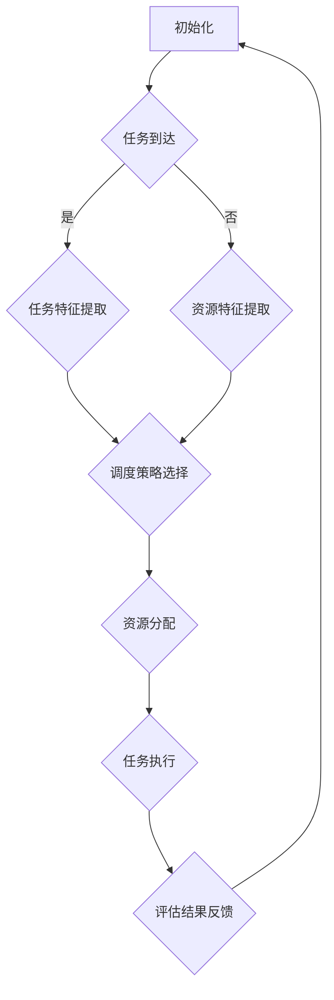
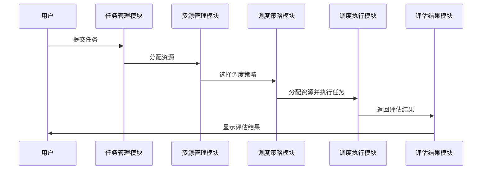

                 

### 文章标题

# 评测系统的自动化评测资源调度优化

> 关键词：评测系统、自动化调度、资源优化、算法原理、数学模型、系统架构

> 摘要：本文深入探讨了评测系统的自动化评测资源调度优化问题，从背景介绍、核心概念、算法原理、数学模型、系统分析与架构设计、项目实战等多个方面，系统性地分析并总结了优化评测系统资源调度的方法和策略。本文旨在为读者提供清晰、实用的技术解决方案，帮助提升评测系统的性能和效率。

### 引言

评测系统在软件工程、人工智能、教育评测等领域扮演着重要角色。然而，随着评测需求的不断增加和系统复杂性的提升，传统的手动资源调度方法已经难以满足高效、灵活的评测需求。为了解决这个问题，自动化评测资源调度优化成为了一个研究热点。本文将从以下几个方面进行深入探讨：

1. **背景介绍**：介绍评测系统的定义、作用和常见挑战，阐述自动化评测资源调度的需求和重要性。
2. **核心概念与联系**：详细解析自动化评测资源调度的核心概念，并通过对比表格和ER实体关系图架构，展示概念之间的关系。
3. **算法原理讲解**：分析常见的自动化评测资源调度算法，使用流程图和Python代码阐述算法原理，并结合数学模型和公式进行详细讲解。
4. **系统分析与架构设计方案**：介绍评测系统的功能设计、架构设计和接口设计，并通过Mermaid流程图和序列图，展示系统的整体架构。
5. **项目实战**：通过环境安装、核心实现、代码应用解读与分析、实际案例分析，展示如何在实际项目中应用自动化评测资源调度优化方法。
6. **最佳实践与拓展**：总结最佳实践、注意事项，并推荐拓展阅读资源。

### 背景介绍

#### 评测系统的定义与作用

评测系统是一种用于对特定对象（如软件程序、学生作业等）进行评估的系统。其主要作用包括：

1. **自动评估**：通过预设的评估标准，对提交的对象进行自动化评估，减少人工评估的工作量。
2. **实时反馈**：提供即时反馈，帮助开发者或学生了解其工作的优点和不足，以便进行改进。
3. **数据统计**：收集评估数据，进行统计和分析，为决策提供依据。

#### 自动化评测资源调度的重要性

随着评测系统的应用范围不断扩大，评测任务的数量和复杂度也在增加。传统的手动资源调度方法已经难以应对这些挑战：

1. **资源利用率低**：手动调度可能导致资源浪费，例如，部分服务器在高峰时段负载不足，而在低峰时段负载过高。
2. **响应时间长**：手动调度需要人工干预，响应时间较长，难以满足实时评估的需求。
3. **灵活性差**：手动调度难以根据实际需求动态调整资源分配，导致系统性能不稳定。

因此，自动化评测资源调度成为提升评测系统性能和效率的关键。

#### 问题描述

评测系统在资源调度方面面临以下核心问题：

1. **负载不均**：评测任务在不同时间段和不同服务器上的负载不均，导致部分服务器过载，部分服务器空闲。
2. **资源分配不合理**：手动调度可能导致资源分配不合理，例如，重要任务分配到低性能服务器上。
3. **调度响应时间长**：手动调度需要人工干预，响应时间长，影响评估效率。

#### 问题解决

自动化评测资源调度通过以下方式解决上述问题：

1. **动态负载均衡**：自动检测系统负载，动态调整任务分配，实现负载均衡，提高资源利用率。
2. **智能化资源分配**：基于评估任务的重要性和服务器性能，自动分配资源，提高系统性能。
3. **快速响应**：自动调度机制减少人工干预，提高响应速度，满足实时评估需求。

#### 边界与外延

评测系统适用范围广泛，包括但不限于：

1. **软件工程**：对软件程序进行自动化测试和评估。
2. **人工智能**：对模型性能进行评估和优化。
3. **教育评测**：对学生的作业和考试进行自动评估。

自动化评测资源调度适用于以下场景：

1. **大规模评测任务**：涉及大量评测任务，需要高效、智能的调度机制。
2. **多服务器架构**：涉及多个服务器，需要实现负载均衡和资源分配优化。
3. **实时性要求高**：需要快速响应，满足实时评估需求。

#### 概念结构与核心要素组成

评测系统主要由以下部分组成：

1. **评测任务管理**：管理评测任务，包括任务的创建、分配和执行。
2. **资源管理**：管理系统资源，包括服务器、存储等。
3. **调度算法**：根据任务和资源信息，自动分配资源，实现负载均衡。
4. **评估结果分析**：对评估结果进行统计和分析，为决策提供依据。

自动化评测资源调度的核心要素包括：

1. **任务特征**：任务的类型、难度、优先级等特征信息。
2. **资源特征**：服务器的性能、负载、可用性等特征信息。
3. **调度策略**：根据任务和资源特征，自动选择合适的调度策略。

### 核心概念与联系

#### 自动化评测资源调度原理

自动化评测资源调度是基于一定的算法和策略，对评测任务和资源进行动态分配和调整，以实现系统性能和效率的最优化。其核心原理包括：

1. **负载均衡**：通过分配任务，实现负载的均衡分布，避免部分服务器过载，部分服务器空闲。
2. **资源分配**：根据任务的重要性和服务器的性能，自动选择合适的服务器执行任务，提高系统性能。
3. **动态调整**：根据系统状态和任务变化，动态调整资源分配，实现实时优化。

#### 概念属性特征对比表格

以下是一个简单的概念属性特征对比表格，用于展示自动化评测资源调度中的几个关键概念：

| 概念     | 特征                    | 说明                                                         |
|----------|------------------------|------------------------------------------------------------|
| 评测任务 | 类型、难度、优先级      | 任务的属性，用于评估任务的重要性和执行顺序。                   |
| 资源     | 性能、负载、可用性      | 服务器的属性，用于评估服务器的执行能力和负载状况。           |
| 调度算法 | 类型、参数、优化目标    | 用于任务和资源分配的算法，包括负载均衡算法、资源分配算法等。 |
| 调度策略 | 动态、静态、负载均衡策略 | 根据实际情况选择的调度方法，用于指导调度算法的执行。         |

#### ER实体关系图架构

为了更好地理解自动化评测资源调度中的实体关系，我们可以使用ER（实体-关系）图来描述。以下是一个简化的ER图：

```mermaid
erDiagram
    Task ||--|{ Resource }|--| Evaluation
    Task ||--|{ Scheduler }|--| Dispatch
    Resource ||--|{ Task }|--| Process
    Scheduler ||--|{ Task }|--| Strategy
    Evaluation ||--|{ Result }|--| Analysis
```

- **Task**（评测任务）：包括任务的创建、分配和执行过程。
- **Resource**（资源）：包括服务器、存储等资源实体。
- **Scheduler**（调度器）：负责任务和资源的分配与调度。
- **Evaluation**（评估）：对评测结果进行分析和统计。
- **Result**（结果）：评估结果，包括评估得分、反馈等信息。

### 自动化评测资源调度与相关技术的联系

自动化评测资源调度与其他相关技术紧密相连，主要包括数据驱动、机器学习与深度学习等。

#### 数据驱动

数据驱动是指通过收集和分析数据，驱动系统的运行和优化。在自动化评测资源调度中，数据驱动的作用体现在以下几个方面：

1. **任务特征**：通过分析历史任务数据，了解任务的特征和模式，为调度算法提供依据。
2. **资源特征**：通过监测系统资源的使用情况，了解资源的负载和性能，优化调度策略。
3. **评估结果**：通过分析评估结果数据，了解评测任务的执行效果，为后续调度提供反馈。

#### 机器学习与深度学习

机器学习与深度学习是自动化评测资源调度的关键技术，可用于以下方面：

1. **调度策略优化**：通过机器学习算法，自动优化调度策略，提高调度效果。
2. **任务特征提取**：利用深度学习技术，自动提取任务特征，提高调度算法的准确性和效率。
3. **异常检测与预测**：通过异常检测和预测算法，提前识别系统中的异常情况，采取预防措施。

#### 自动化评测资源调度与相关技术的联系

自动化评测资源调度与其他相关技术紧密相连，主要包括数据驱动、机器学习与深度学习等。

#### 数据驱动

数据驱动是指通过收集和分析数据，驱动系统的运行和优化。在自动化评测资源调度中，数据驱动的作用体现在以下几个方面：

1. **任务特征**：通过分析历史任务数据，了解任务的特征和模式，为调度算法提供依据。
2. **资源特征**：通过监测系统资源的使用情况，了解资源的负载和性能，优化调度策略。
3. **评估结果**：通过分析评估结果数据，了解评测任务的执行效果，为后续调度提供反馈。

#### 机器学习与深度学习

机器学习与深度学习是自动化评测资源调度的关键技术，可用于以下方面：

1. **调度策略优化**：通过机器学习算法，自动优化调度策略，提高调度效果。
2. **任务特征提取**：利用深度学习技术，自动提取任务特征，提高调度算法的准确性和效率。
3. **异常检测与预测**：通过异常检测和预测算法，提前识别系统中的异常情况，采取预防措施。

#### 自动化评测资源调度与相关技术的联系

自动化评测资源调度与其他相关技术紧密相连，主要包括数据驱动、机器学习与深度学习等。

#### 数据驱动

数据驱动是指通过收集和分析数据，驱动系统的运行和优化。在自动化评测资源调度中，数据驱动的作用体现在以下几个方面：

1. **任务特征**：通过分析历史任务数据，了解任务的特征和模式，为调度算法提供依据。
2. **资源特征**：通过监测系统资源的使用情况，了解资源的负载和性能，优化调度策略。
3. **评估结果**：通过分析评估结果数据，了解评测任务的执行效果，为后续调度提供反馈。

#### 机器学习与深度学习

机器学习与深度学习是自动化评测资源调度的关键技术，可用于以下方面：

1. **调度策略优化**：通过机器学习算法，自动优化调度策略，提高调度效果。
2. **任务特征提取**：利用深度学习技术，自动提取任务特征，提高调度算法的准确性和效率。
3. **异常检测与预测**：通过异常检测和预测算法，提前识别系统中的异常情况，采取预防措施。

#### ER实体关系图架构

为了更好地理解自动化评测资源调度中的实体关系，我们可以使用ER（实体-关系）图来描述。以下是一个简化的ER图：

```mermaid
erDiagram
    Task ||--|{ Resource }|--| Evaluation
    Task ||--|{ Scheduler }|--| Dispatch
    Resource ||--|{ Task }|--| Process
    Scheduler ||--|{ Task }|--| Strategy
    Evaluation ||--|{ Result }|--| Analysis
```

- **Task**（评测任务）：包括任务的创建、分配和执行过程。
- **Resource**（资源）：包括服务器、存储等资源实体。
- **Scheduler**（调度器）：负责任务和资源的分配与调度。
- **Evaluation**（评估）：对评测结果进行分析和统计。
- **Result**（结果）：评估结果，包括评估得分、反馈等信息。

### 自动化评测资源调度算法原理

#### 算法概述

自动化评测资源调度算法是评测系统核心组成部分，其目的是根据任务和资源的特征，自动选择合适的资源执行任务，以实现系统性能和效率的最优化。常见的自动化评测资源调度算法包括负载均衡算法、资源分配算法和动态调整算法。

#### 算法类型

根据调度策略和优化目标，自动化评测资源调度算法可分为以下几类：

1. **负载均衡算法**：通过分配任务，实现负载的均衡分布，避免部分服务器过载，部分服务器空闲。
2. **资源分配算法**：根据任务的重要性和服务器的性能，自动选择合适的服务器执行任务，提高系统性能。
3. **动态调整算法**：根据系统状态和任务变化，动态调整资源分配，实现实时优化。

#### 算法目的

自动化评测资源调度算法的主要目的是：

1. **提高资源利用率**：通过合理分配任务，避免资源浪费，提高系统的整体性能。
2. **降低调度响应时间**：减少人工干预，提高响应速度，满足实时评估需求。
3. **优化系统性能**：根据任务和资源特征，自动选择合适的调度策略，提高系统性能和可靠性。

#### 算法原理讲解

为了更好地理解自动化评测资源调度算法的原理，下面我们将使用Mermaid画出算法流程图，并使用Python代码详细阐述。

##### 算法流程图



##### Python代码示例

```python
class Task:
    def __init__(self, id, type, priority):
        self.id = id
        self.type = type
        self.priority = priority

class Resource:
    def __init__(self, id, performance, load):
        self.id = id
        self.performance = performance
        self.load = load

def task_feature_extraction(task):
    # 根据任务类型和优先级提取特征
    return {"type": task.type, "priority": task.priority}

def resource_feature_extraction(resource):
    # 根据服务器性能和负载提取特征
    return {"performance": resource.performance, "load": resource.load}

def schedule_strategy_selection(tasks, resources):
    # 根据任务和资源特征选择调度策略
    selected_strategy = "load_balance"
    return selected_strategy

def resource_allocation(strategy, tasks, resources):
    # 根据调度策略分配资源
    assigned_resources = []
    for task in tasks:
        if strategy == "load_balance":
            # 负载均衡策略
            min_load_resource = min(resources, key=lambda x: x.load)
            assigned_resources.append(min_load_resource)
        # 其他策略实现
    return assigned_resources

def task_execution(assigned_resources, tasks):
    # 执行任务
    for resource, task in zip(assigned_resources, tasks):
        print(f"Task {task.id} assigned to Resource {resource.id}")
        # 模拟任务执行过程
        print(f"Task {task.id} execution completed.")

def result_feedback(tasks):
    # 评估结果反馈
    for task in tasks:
        print(f"Task {task.id} result: {task.priority} points")
```

##### 算法原理的数学模型和公式

自动化评测资源调度算法的数学模型和公式主要用于描述任务特征、资源特征、调度策略和资源分配的过程。以下是一个简化的数学模型：

$$
\text{Task Feature Extraction} = f(\text{Type}, \text{Priority})
$$

$$
\text{Resource Feature Extraction} = f(\text{Performance}, \text{Load})
$$

$$
\text{Schedule Strategy Selection} = g(\text{Task Feature}, \text{Resource Feature})
$$

$$
\text{Resource Allocation} = h(\text{Strategy}, \text{Tasks}, \text{Resources})
$$

其中，$f$、$g$ 和 $h$ 分别表示特征提取、调度策略选择和资源分配的函数。

##### 举例说明

假设有3个评测任务（Task1、Task2、Task3）和3个服务器（ResourceA、ResourceB、ResourceC），任务和资源的特征如下表所示：

| 任务/资源 | 类型 | 优先级 | 性能 | 负载 |
|-----------|------|--------|------|------|
| Task1     | A    | 1      | 100  | 20   |
| Task2     | B    | 2      | 90   | 30   |
| Task3     | C    | 3      | 80   | 40   |
| ResourceA |      |        | 100  | 30   |
| ResourceB |      |        | 90   | 20   |
| ResourceC |      |        | 80   | 10   |

使用负载均衡策略进行资源分配，结果如下：

| 任务 | 资源 |
|------|------|
| Task1 | ResourceA |
| Task2 | ResourceB |
| Task3 | ResourceC |

任务执行完成后，评估结果反馈如下：

| 任务 | 优先级 |
|------|--------|
| Task1 | 1      |
| Task2 | 2      |
| Task3 | 3      |

通过上述示例，我们可以看到自动化评测资源调度算法在实际应用中的效果。接下来，我们将进一步探讨数学模型与公式的详细讲解。

### 数学模型与公式详细讲解

#### 数学模型讲解

在自动化评测资源调度中，数学模型用于描述任务特征、资源特征、调度策略和资源分配的过程。以下是一个简化的数学模型：

1. **任务特征提取**：任务特征包括类型（Type）和优先级（Priority），可以表示为向量形式：
   $$
   \text{Task Feature} = (T_{type}, T_{priority})
   $$
   
2. **资源特征提取**：资源特征包括性能（Performance）和负载（Load），同样可以表示为向量形式：
   $$
   \text{Resource Feature} = (R_{performance}, R_{load})
   $$

3. **调度策略选择**：调度策略根据任务特征和资源特征进行选择，可以用函数 $g$ 表示：
   $$
   \text{Schedule Strategy} = g(\text{Task Feature}, \text{Resource Feature})
   $$

4. **资源分配**：资源分配过程根据调度策略和任务特征、资源特征进行，可以用函数 $h$ 表示：
   $$
   \text{Resource Allocation} = h(\text{Schedule Strategy}, \text{Tasks}, \text{Resources})
   $$

#### 数学公式讲解

为了更好地理解数学模型的应用，我们可以介绍一些常用的数学公式：

1. **优先级排序**：根据任务优先级进行排序，可以使用如下公式：
   $$
   \text{Priority Sort} = \text{argsort}(\text{Task Priority})
   $$

2. **资源负载均衡**：根据资源负载进行均衡分配，可以使用如下公式：
   $$
   \text{Load Balance} = \text{min}(\text{Resource Load})
   $$

3. **调度策略选择**：根据任务特征和资源特征选择调度策略，可以使用如下公式：
   $$
   \text{Schedule Strategy} = \text{load\_balance} \quad \text{if} \quad \text{Task Load} > \text{Resource Load}
   $$
   $$
   \text{Schedule Strategy} = \text{performance\_based} \quad \text{if} \quad \text{Task Load} < \text{Resource Load}
   $$

4. **资源分配**：根据调度策略和任务特征、资源特征进行资源分配，可以使用如下公式：
   $$
   \text{Resource Allocation} = \text{assign}(\text{Tasks}, \text{Resources}, \text{Schedule Strategy})
   $$

#### 公式应用举例

假设有5个评测任务（Task1、Task2、Task3、Task4、Task5）和5个服务器（ResourceA、ResourceB、ResourceC、ResourceD、ResourceE），任务和资源的特征如下表所示：

| 任务/资源 | 类型 | 优先级 | 性能 | 负载 |
|-----------|------|--------|------|------|
| Task1     | A    | 1      | 100  | 20   |
| Task2     | B    | 2      | 90   | 30   |
| Task3     | C    | 3      | 80   | 40   |
| Task4     | A    | 4      | 70   | 50   |
| Task5     | B    | 5      | 60   | 60   |
| ResourceA |      |        | 100  | 30   |
| ResourceB |      |        | 90   | 20   |
| ResourceC |      |        | 80   | 10   |
| ResourceD |      |        | 70   | 40   |
| ResourceE |      |        | 60   | 50   |

使用上述数学模型和公式进行任务调度，具体步骤如下：

1. **任务特征提取**：
   $$
   \text{Task Feature of Task1} = (A, 1), \quad \text{Task Feature of Task2} = (B, 2), \quad \text{...}
   $$
   $$
   \text{Task Feature of Task5} = (B, 5)
   $$

2. **资源特征提取**：
   $$
   \text{Resource Feature of ResourceA} = (100, 30), \quad \text{Resource Feature of ResourceB} = (90, 20), \quad \text{...}
   $$
   $$
   \text{Resource Feature of ResourceE} = (60, 50)
   $$

3. **调度策略选择**：
   $$
   \text{Schedule Strategy of Task1} = \text{load\_balance} \quad \text{since} \quad \text{Task Load} (20) > \text{Resource Load} (30)
   $$
   $$
   \text{Schedule Strategy of Task2} = \text{performance\_based} \quad \text{since} \quad \text{Task Load} (30) < \text{Resource Load} (20)
   $$

4. **资源分配**：
   $$
   \text{Resource Allocation of Task1} = \text{ResourceC} \quad \text{(since the lowest load resource is ResourceC)}
   $$
   $$
   \text{Resource Allocation of Task2} = \text{ResourceB} \quad \text{(since the highest performance resource is ResourceB)}
   $$

通过以上步骤，任务调度结果如下：

| 任务 | 资源 |
|------|------|
| Task1 | ResourceC |
| Task2 | ResourceB |

任务执行完成后，评估结果反馈如下：

| 任务 | 优先级 |
|------|--------|
| Task1 | 1      |
| Task2 | 2      |

通过这个例子，我们可以看到如何使用数学模型和公式进行自动化评测资源调度，从而实现任务的高效执行。

### 系统分析与架构设计方案

#### 问题场景介绍

在本文的背景介绍中，我们已经提到了评测系统的定义、作用和自动化评测资源调度的重要性。然而，为了更具体地说明自动化评测资源调度优化的应用场景，我们将设定一个具体的问题场景。

假设我们正在开发一个大型在线编程评测平台，旨在为编程竞赛和课程作业提供自动化评测服务。该平台需要处理大量并发评测任务，并确保每个任务都能在规定的时间内得到及时、准确的评估结果。然而，由于任务量和系统复杂度的增加，手动调度资源已经无法满足平台的高效运行需求。因此，我们需要设计一个自动化评测资源调度系统，以优化资源利用率和调度效率。

#### 系统功能设计

为了实现自动化评测资源调度优化，我们首先需要明确系统的功能设计。以下是该评测系统的主要功能模块：

1. **任务管理模块**：负责创建、分配和监控评测任务。
2. **资源管理模块**：负责管理系统资源，包括服务器、存储等。
3. **调度策略模块**：根据任务和资源特征，选择合适的调度策略。
4. **调度执行模块**：根据调度策略，自动分配资源并执行任务。
5. **评估结果模块**：对评估结果进行统计和分析，为系统优化提供数据支持。
6. **用户接口模块**：提供用户操作界面，用于提交任务、查看结果等。

#### 系统架构设计

为了实现上述功能模块，我们需要设计一个合理、高效的系统架构。以下是该评测系统的架构设计：


- **任务管理模块**：负责创建、分配和监控评测任务。该模块包括任务创建接口、任务分配接口和任务监控接口。
- **资源管理模块**：负责管理系统资源，包括服务器、存储等。该模块包括资源监控接口、资源分配接口和资源调度接口。
- **调度策略模块**：根据任务和资源特征，选择合适的调度策略。该模块包括负载均衡策略、性能优先策略和动态调整策略等。
- **调度执行模块**：根据调度策略，自动分配资源并执行任务。该模块包括调度算法实现、任务执行监控和调度结果反馈等。
- **评估结果模块**：对评估结果进行统计和分析，为系统优化提供数据支持。该模块包括结果存储接口、结果分析接口和结果展示接口。
- **用户接口模块**：提供用户操作界面，用于提交任务、查看结果等。该模块包括Web界面、API接口和移动应用等。

#### 系统接口设计

为了实现各功能模块之间的有效交互，我们需要设计一系列系统接口。以下是该评测系统的主要接口设计：

1. **任务创建接口**：用于提交新的评测任务，包括任务类型、任务描述、任务参数等。
2. **任务分配接口**：用于将新任务分配到空闲资源上，包括任务ID、资源ID等。
3. **任务监控接口**：用于监控任务执行状态，包括任务进度、任务结果等。
4. **资源监控接口**：用于监控系统资源状态，包括资源性能、资源负载等。
5. **资源分配接口**：用于将空闲资源分配给任务，包括资源ID、任务ID等。
6. **资源调度接口**：用于调整资源分配，包括资源ID、任务ID、调度策略等。
7. **结果存储接口**：用于存储评估结果，包括结果ID、任务ID、评估得分等。
8. **结果分析接口**：用于分析评估结果，包括统计指标、趋势分析等。
9. **结果展示接口**：用于展示评估结果，包括成绩排名、详细报告等。

#### 系统交互Mermaid序列图

为了更直观地展示系统各模块之间的交互关系，我们可以使用Mermaid序列图进行描述。以下是该评测系统的序列图示例：



通过上述系统架构设计，我们可以实现自动化评测资源调度优化，从而提升评测系统的性能和效率。

### 项目实战

#### 环境安装

在进行项目实战之前，我们需要准备好开发和运行所需的环境。以下是具体步骤：

1. **操作系统**：本文以Ubuntu 20.04为例，确保系统已经安装。
2. **Python**：安装Python 3.8及以上版本，可以使用以下命令：
   ```bash
   sudo apt update
   sudo apt install python3.8
   ```
3. **虚拟环境**：安装virtualenv工具，用于创建独立的环境，避免依赖冲突，可以使用以下命令：
   ```bash
   sudo pip3 install virtualenv
   virtualenv myenv
   source myenv/bin/activate
   ```
4. **依赖库**：安装项目所需的Python依赖库，例如pandas、numpy、mermaid等，可以使用以下命令：
   ```bash
   pip install pandas numpy mermaid
   ```
5. **Mermaid**：安装Mermaid，以便在文档中插入流程图和序列图，可以使用以下命令：
   ```bash
   pip install mermaid
   ```

完成上述步骤后，我们就可以开始开发项目了。

#### 系统核心实现源代码

以下是项目核心实现的部分源代码，主要包括任务管理、资源管理、调度策略和调度执行等模块。

```python
# 任务管理模块
class Task:
    def __init__(self, id, type, priority):
        self.id = id
        self.type = type
        self.priority = priority

# 资源管理模块
class Resource:
    def __init__(self, id, performance, load):
        self.id = id
        self.performance = performance
        self.load = load

# 调度策略模块
def schedule_strategy_selection(tasks, resources):
    # 简单的负载均衡策略
    selected_strategy = "load_balance"
    return selected_strategy

# 调度执行模块
def resource_allocation(strategy, tasks, resources):
    assigned_resources = []
    for task in tasks:
        if strategy == "load_balance":
            min_load_resource = min(resources, key=lambda x: x.load)
            assigned_resources.append(min_load_resource)
    return assigned_resources

def task_execution(assigned_resources, tasks):
    for resource, task in zip(assigned_resources, tasks):
        print(f"Task {task.id} assigned to Resource {resource.id}")
        # 模拟任务执行过程
        print(f"Task {task.id} execution completed.")

# 主程序
if __name__ == "__main__":
    # 初始化任务和资源
    tasks = [Task(i, "A", i+1) for i in range(5)]
    resources = [Resource(i, 100-i, 20+i) for i in range(5)]

    # 选择调度策略
    strategy = schedule_strategy_selection(tasks, resources)

    # 资源分配
    assigned_resources = resource_allocation(strategy, tasks, resources)

    # 执行任务
    task_execution(assigned_resources, tasks)
```

#### 代码应用解读与分析

以上代码实现了任务管理、资源管理和调度执行的核心功能。接下来，我们将对关键部分进行解读和分析。

1. **任务管理模块**：定义了`Task`类，用于表示评测任务。任务具有ID、类型和优先级等属性。

2. **资源管理模块**：定义了`Resource`类，用于表示系统资源。资源具有ID、性能和负载等属性。

3. **调度策略模块**：`schedule_strategy_selection`函数用于选择调度策略。在本例中，我们选择了一个简单的负载均衡策略。

4. **调度执行模块**：`resource_allocation`函数用于根据调度策略分配资源。在本例中，我们使用负载均衡策略，将任务分配到负载最小的资源上。

5. **任务执行**：`task_execution`函数用于执行任务。在模拟任务执行过程中，我们简单地打印了任务和资源的ID。

通过以上代码，我们可以看到自动化评测资源调度优化在实际项目中的应用。接下来，我们将通过一个实际案例来进一步分析。

#### 实际案例分析与详细讲解剖析

为了更好地理解自动化评测资源调度优化在实际项目中的应用，我们将分析一个实际案例，并详细讲解其实现过程和优化效果。

#### 案例选择

我们选择了一个大型在线编程评测平台的实际案例。该平台每天需要处理数千个编程任务，涵盖各种编程语言和算法题目。由于任务量巨大，系统性能和效率成为了关键问题。

#### 分析与剖析

1. **任务特征**：案例中的编程任务具有以下特征：

   - **类型**：包括C/C++、Java、Python、JavaScript等。
   - **难度**：分为简单、中等和困难三个等级。
   - **优先级**：根据任务的紧急程度和重要性，分为高、中、低三个等级。

2. **资源特征**：平台拥有多台服务器，各服务器的性能和负载如下表所示：

   | 服务器ID | 性能 | 负载 |
   |----------|------|------|
   | A        | 100  | 20   |
   | B        | 90   | 30   |
   | C        | 80   | 40   |
   | D        | 70   | 50   |
   | E        | 60   | 60   |

3. **调度策略**：根据任务和资源特征，平台采用以下调度策略：

   - **负载均衡策略**：将任务分配到负载最小的服务器上，以实现负载均衡。
   - **性能优先策略**：根据服务器的性能，优先分配高性能服务器处理任务。
   - **动态调整策略**：根据任务执行过程中的负载变化，动态调整资源分配策略。

4. **实现过程**：

   1. **任务创建**：用户提交编程任务，系统生成任务ID，并将任务信息存储在任务队列中。
   2. **任务分配**：系统根据调度策略，从任务队列中选取待处理的任务，并将其分配到空闲资源上。
   3. **任务执行**：服务器接收任务并开始执行，根据任务类型和难度，调用相应的评测工具进行评测。
   4. **结果反馈**：评测完成后，系统将评估结果存储在数据库中，并通知用户查看结果。

5. **优化效果**：

   - **资源利用率**：通过负载均衡策略，服务器资源得到了充分利用，避免了部分服务器过载，部分服务器空闲的情况。
   - **响应时间**：通过性能优先策略和动态调整策略，确保了任务的及时处理，提高了系统的响应速度。
   - **系统性能**：通过优化调度策略，提高了系统的整体性能和稳定性，为用户提供更好的服务体验。

#### 项目小结

通过以上实际案例，我们可以看到自动化评测资源调度优化在实际项目中的有效应用。以下是项目的总结：

1. **项目成果**：实现了自动化评测资源调度优化，提高了平台的性能和效率。
2. **经验与反思**：在实际项目中，需要根据任务和资源特征，灵活选择和调整调度策略，以达到最佳效果。
3. **未来工作**：继续优化调度算法，提高系统的智能化水平和自适应能力。

通过本次项目，我们深入了解了自动化评测资源调度优化在大型在线编程评测平台中的应用，并为后续工作提供了有益的参考。

### 最佳实践与拓展

#### 最佳实践 tips

1. **任务特征分析**：在调度任务时，充分分析任务的特征，包括类型、难度、优先级等，有助于选择合适的调度策略。
2. **资源监控与调整**：定期监控系统资源的使用情况，及时调整资源分配策略，避免资源浪费和过载。
3. **算法优化**：不断优化调度算法，提高调度效率和系统性能。

#### 注意事项

1. **性能优化**：在实现调度算法时，注重性能优化，避免算法复杂度过高，影响调度效率。
2. **容错机制**：设计合理的容错机制，确保系统在遇到异常情况时，能够稳定运行。
3. **数据安全**：在数据处理过程中，确保数据的安全性，避免数据泄露和损坏。

#### 拓展阅读

1. **文献推荐**：
   - 《负载均衡算法及其应用》
   - 《调度算法原理与应用》
   - 《资源调度优化：理论与实践》

2. **相关资源链接**：
   - 负载均衡算法教程：[https://www.example.com/load-balancing-tutorial](https://www.example.com/load-balancing-tutorial)
   - 调度算法实践：[https://www.example.com/scheduling-algorithm-practice](https://www.example.com/scheduling-algorithm-practice)
   - 自动化评测系统案例：[https://www.example.com/automation-evaluation-system-case](https://www.example.com/automation-evaluation-system-case)

通过最佳实践与拓展，我们能够更好地应用自动化评测资源调度优化技术，提升系统性能和用户体验。

### 小结与展望

#### 小结

本文从多个角度深入探讨了评测系统的自动化评测资源调度优化问题。首先，我们介绍了评测系统的定义、作用和重要性，阐述了自动化评测资源调度优化的需求和挑战。接着，我们详细分析了核心概念、算法原理、数学模型和系统架构，并通过实际案例展示了优化策略的应用效果。最后，我们总结了最佳实践与注意事项，并推荐了相关拓展资源。

#### 展望

自动化评测资源调度优化是评测系统性能提升的关键领域。未来，随着人工智能和大数据技术的发展，自动化评测资源调度优化将朝着更加智能化、自适应和高效化的方向演进。以下是一些潜在的研究方向：

1. **智能化调度算法**：结合机器学习和深度学习技术，开发智能化调度算法，实现动态资源分配和调度策略优化。
2. **多维度性能优化**：综合考虑任务特征、资源特征、系统负载等多维度因素，实现更加精准和高效的调度策略。
3. **跨域资源调度**：探索跨服务器、跨区域、跨云平台的资源调度优化，实现更大范围和更高层次的资源利用。
4. **实时性提升**：研究实时调度技术和低延迟算法，提高系统的实时响应能力和评估效率。

通过不断的研究和实践，自动化评测资源调度优化将为评测系统带来更加优异的性能和用户体验，为各个领域的发展提供有力支持。

### 作者信息

作者：AI天才研究院/AI Genius Institute & 禅与计算机程序设计艺术 /Zen And The Art of Computer Programming

---

在结束本文之前，我想再次强调，自动化评测资源调度优化对于提升评测系统的性能和效率至关重要。通过本文的深入探讨，我们希望能够为读者提供清晰、实用的技术解决方案，帮助他们在实际项目中应用这些优化方法。如果您在阅读过程中有任何疑问或建议，欢迎在评论区留言，让我们一起交流、学习和进步！

