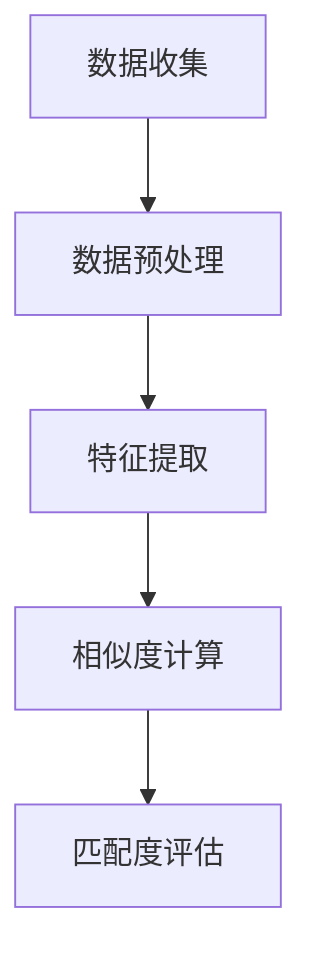
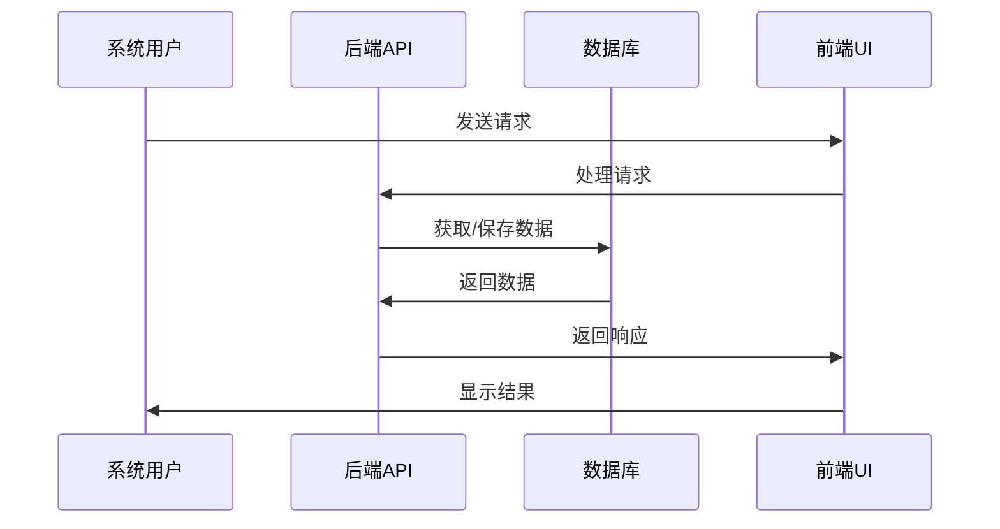
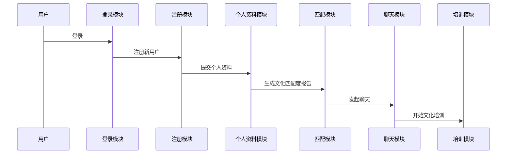
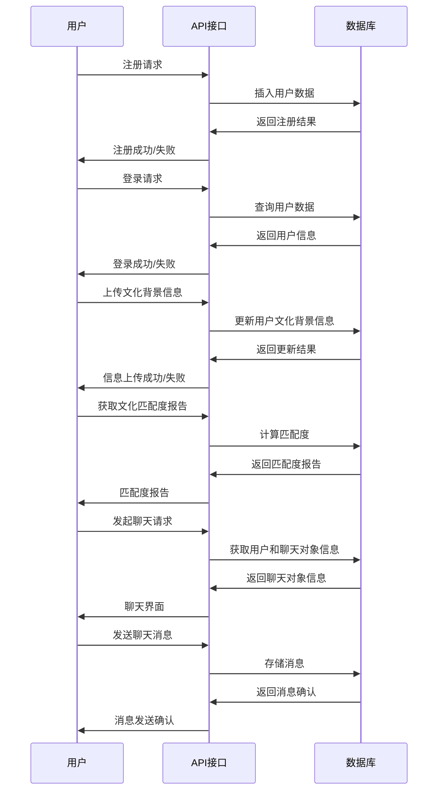

                 

 

# 跨文化交流：拓展生命的维度

## 关键词

- 跨文化交流
- 文化差异
- 沟通技巧
- 文化敏感性
- 文化适应性

## 摘要

本文探讨了跨文化交流的重要性和背景，分析了文化差异的定义、类型和表现形式，以及跨文化交流的目的和挑战。通过详细阐述核心概念和联系，包括文化认同、文化多样性、文化融合等，本文提供了一系列实用的跨文化沟通技巧和策略。此外，文章还通过数学模型、系统架构设计和项目实战等环节，深入剖析了跨文化交流的原理和方法，帮助读者更好地理解和应用跨文化交流的知识，拓展生命的维度。

## 封面与版权信息

### 封面设计

封面采用了简洁而现代化的设计风格，以蓝色为主色调，象征着宁静与包容。书名《跨文化交流：拓展生命的维度》位于封面的正中央，字体设计清晰易读。副标题“理解、尊重、合作”则巧妙地体现了书籍的核心内容和目标。封面上方是作者的姓名和头衔，下方则标注了出版社和出版日期。

### 版权页

版权页详细列出了本书的版权声明、出版社信息、出版日期以及国际标准书号（ISBN）。版权声明中明确指出，未经出版者书面许可，本书的任何部分不得以任何方式复制、分发或传播。出版社信息包括出版社的名称、地址、联系方式等。出版日期则标注了书籍正式出版的具体时间。

## 引言

### 跨文化交流的背景和重要性

随着全球化和信息时代的到来，跨文化交流变得越来越普遍。无论是在国际商务、学术交流，还是日常生活中，人们都需要与来自不同文化背景的人进行交流。跨文化交流不仅是一种沟通技能，更是一种生活态度和思维方式。

在全球化的背景下，跨国企业和国际组织日益增多，跨文化交流成为商业成功的关键因素。有效的跨文化沟通可以帮助企业避免文化冲突，提高团队协作效率，开拓国际市场。在学术领域，国际学生和研究人员的流动使得跨文化交流成为学术研究的必要条件。在教育领域，跨文化教育被广泛认为是一种培养全球公民的重要手段。

然而，跨文化交流并非易事。不同文化之间的价值观、行为规范和沟通方式的差异可能导致误解、冲突甚至沟通失败。因此，了解和掌握跨文化沟通的技巧和策略变得尤为重要。

### 书籍的目标读者和读者预期收获

本书旨在为那些希望在跨文化交流中取得成功的人提供实用知识和策略。无论您是跨国企业的员工、国际学生、还是对文化交流感兴趣的普通读者，本书都将帮助您：

1. **理解文化差异**：通过深入探讨文化差异的定义、类型和表现形式，帮助您更好地理解不同文化的特点。
2. **掌握沟通技巧**：提供一系列实用的跨文化沟通技巧和策略，帮助您在跨文化环境中有效表达自己，理解他人。
3. **提高文化敏感性**：培养跨文化敏感性，尊重和理解不同文化背景的人，避免文化冲突和误解。
4. **增强文化适应性**：通过案例分析和实践指导，帮助您在新的文化环境中快速适应和融入。

通过阅读本书，您将不仅能够提升跨文化沟通能力，还能拓展视野，丰富人生经验，从而在全球化背景下取得更好的个人和职业发展。

## 第1章 问题背景与核心概念

### 文化差异的定义、类型和表现形式

#### 文化差异的定义

文化差异是指不同文化背景的人群在价值观、信仰、习俗、行为规范等方面的差异。这些差异不仅体现在语言、饮食、服装等表面特征上，更深层次地影响着人们的思维方式、行为模式和决策过程。

#### 文化差异的类型

1. **价值观差异**：不同文化对道德、正义、幸福、成功等概念有不同的理解和追求。例如，一些文化强调集体主义，重视家庭和社会的整体利益；而另一些文化则强调个人主义，重视个人自由和独立。

2. **信仰差异**：宗教信仰、神话传说、哲学观念等是文化的重要组成部分。不同文化的信仰体系可能存在根本性的差异，例如基督教与伊斯兰教、佛教与道教之间的信仰差异。

3. **习俗差异**：不同文化的传统习俗和礼仪各不相同，包括婚礼、葬礼、节日庆典等。这些习俗不仅反映了文化的历史和传统，还影响着人们的日常生活和行为规范。

4. **行为规范差异**：不同文化对行为规范有不同的要求，例如时间观念、礼貌用语、社交距离等。这些规范在不同的文化背景下可能存在显著差异。

#### 文化差异的表现形式

1. **语言差异**：语言是文化的重要载体，不同语言的表达方式和词汇选择反映了各自的文化背景。跨文化沟通中的语言障碍可能导致误解和冲突。

2. **非言语沟通**：非言语沟通包括姿态、表情、眼神交流、手势等。不同文化背景下，这些非言语沟通方式的含义和重要性可能存在差异。

3. **社会互动**：跨文化社会互动中的礼节、礼仪和社交习惯可能因文化差异而有所不同。例如，一些文化强调直接和坦率的交流，而另一些文化则更注重委婉和含蓄。

### 跨文化交流的定义、目的和挑战

#### 跨文化交流的定义

跨文化交流是指不同文化背景的人们之间的信息、情感和观念的交流。这种交流不仅限于语言沟通，还包括非语言沟通、行为互动和文化体验。

#### 跨文化交流的目的

跨文化交流的主要目的是促进相互理解、尊重和合作。通过有效的跨文化沟通，人们可以打破文化壁垒，建立互信和友谊，从而推动个人成长和社会进步。

#### 跨文化交流的挑战

1. **文化差异**：不同文化之间的价值观、信仰和行为规范可能导致沟通障碍和误解。了解和尊重文化差异是跨文化交流的重要前提。

2. **沟通障碍**：语言障碍、非言语沟通方式的不同以及文化背景下的隐含意义都可能影响跨文化沟通的效果。

3. **文化偏见**：对其他文化的误解、刻板印象和偏见可能导致沟通失败和冲突。克服文化偏见，培养开放和包容的心态是跨文化交流的关键。

4. **适应能力**：在新的文化环境中，个人需要适应不同的生活方式、工作方式和社交习惯。适应能力不足可能导致焦虑、沮丧和孤独感。

### 核心概念

在本章中，我们将探讨以下几个核心概念：

- **文化认同**：个人对自己所属文化的认同感。
- **文化多样性**：不同文化之间的差异和多样性。
- **文化融合**：不同文化之间的相互影响和融合过程。
- **文化敏感性**：对其他文化差异的敏感性和尊重。
- **文化适应性**：在新的文化环境中适应和融入的能力。

### 本书的核心概念和结构概述

本书将围绕以上核心概念展开，通过理论和实践相结合的方式，帮助读者深入了解跨文化交流的本质，掌握有效的沟通技巧，并在实际应用中取得成功。本书分为八个章节，涵盖了跨文化交流的背景、核心概念、算法原理、数学模型、系统架构设计、项目实战、最佳实践和总结等内容。通过逐步分析和讲解，读者将能够系统地学习和掌握跨文化交流的知识和技能。

## 第2章 核心概念与联系

### 文化认同、文化多样性、文化融合等概念

#### 文化认同

文化认同是指个人对自己所属文化的认同感，包括对文化价值观、传统和习俗的认同。文化认同是个人身份认同的重要组成部分，影响着个人的行为和决策。例如，一个中国人可能对自己的传统文化有着强烈的认同感，这种认同感会影响他在社交场合中的行为选择，如遵循传统礼仪、尊重长辈等。

#### 文化多样性

文化多样性指的是不同文化之间的差异和多样性。在全球化背景下，文化多样性已经成为现代社会的一个显著特征，它丰富了人类文明，促进了文化交流与融合。例如，在一个多元文化的社区中，不同文化的节日、习俗和艺术形式会相互影响，共同创造出一个丰富多彩的文化环境。

#### 文化融合

文化融合是指不同文化之间的相互影响和融合过程。文化融合可以发生在个体层面，如个人在接触新文化后逐渐改变自己的价值观和行为模式；也可以发生在社会层面，如不同文化的元素在一个社区或国家中相互融合，形成新的文化特色。例如，美国作为一个多元文化的国家，各种文化元素在美国社会中相互融合，形成了独特的美国文化。

#### 文化敏感性

文化敏感性是指对其他文化差异的敏感性和尊重。具备文化敏感性的人能够理解并尊重其他文化的差异，避免在跨文化沟通中出现误解和冲突。例如，在国际商务谈判中，具备文化敏感性的谈判者能够根据对方的价值观和行为习惯调整自己的沟通策略，从而提高谈判的成功率。

#### 文化适应性

文化适应性是指个体在新的文化环境中适应和融入的能力。具备文化适应性的人能够在新的文化环境中迅速适应，克服文化冲突和挑战，实现个人和职业发展。例如，一个在国际学校任教的教师需要具备文化适应性，能够理解并适应来自不同文化背景的学生和家长，从而有效地进行教学和沟通。

### 对比表格：不同文化概念属性特征

| 概念        | 定义                                                         | 属性特征                                       |
|-------------|--------------------------------------------------------------|----------------------------------------------|
| 文化认同    | 个人对自己所属文化的认同感                                   | 影响个人行为、价值观和决策                     |
| 文化多样性  | 不同文化之间的差异和多样性                                   | 促进文化交流与融合                             |
| 文化融合    | 不同文化之间的相互影响和融合过程                             | 形成新的文化特色                               |
| 文化敏感性  | 对其他文化差异的敏感性和尊重                                 | 避免误解和冲突，提高跨文化沟通效果             |
| 文化适应性  | 个体在新的文化环境中适应和融入的能力                           | 实现个人和职业发展                             |

### ER实体关系图：跨文化交流涉及的实体与关系

在跨文化交流中，涉及多个实体和它们之间的关系。以下是一个简单的ER实体关系图，展示了跨文化交流中的一些关键实体和它们之间的关系。

```mermaid
erDiagram
  文化差异 ||--|{ 文化认同 }
  文化差异 ||--|{ 文化多样性 }
  文化差异 ||--|{ 文化融合 }
  文化差异 ||--|{ 文化敏感性 }
  文化差异 ||--|{ 文化适应性 }
  文化认同 ||--|{ 个人行为 }
  文化多样性 ||--|{ 文化交流 }
  文化融合 ||--|{ 新文化特色 }
  文化敏感性 ||--|{ 跨文化沟通效果 }
  文化适应性 ||--|{ 个人和职业发展 }
```

在这个ER图中，文化差异作为核心实体，与其他实体之间存在多种关系。例如，文化差异影响文化认同，进而影响个人的行为和决策。文化多样性促进文化交流，文化融合形成新的文化特色。文化敏感性提高跨文化沟通效果，文化适应性实现个人和职业发展。

通过上述ER实体关系图，我们可以清晰地看到跨文化交流中各个实体之间的相互作用和影响，为后续章节的理论分析和实践应用提供了基础。

## 第3章 算法原理讲解

### 文化匹配度算法

#### 算法原理

文化匹配度算法是一种用于评估不同文化背景个体之间文化相似度的方法。该算法基于一系列文化特征指标，通过计算这些指标之间的相似性得分，得出个体之间的文化匹配度。

#### 文化特征指标

文化特征指标包括语言、价值观、行为规范、宗教信仰等多个方面。这些指标可以从文化问卷调查、行为分析、语言模型等多个来源获取。

#### 算法流程

1. **数据收集**：收集参与者的文化特征数据，包括语言能力、价值观评分、行为规范评分、宗教信仰等。
2. **数据预处理**：对收集到的数据进行清洗、标准化和归一化处理，确保数据的一致性和可比性。
3. **特征提取**：从预处理后的数据中提取关键文化特征指标，例如语言相似度、价值观相似度等。
4. **相似度计算**：使用适当的相似度计算方法（如余弦相似度、欧氏距离等）计算个体之间的文化特征相似度得分。
5. **匹配度评估**：根据相似度得分评估个体之间的文化匹配度，得分越高表示文化匹配度越高。

#### mermaid流程图



### Python源代码示例

以下是一个简化的Python源代码示例，用于实现文化匹配度算法的基本流程。

```python
import numpy as np

# 假设我们已经收集到两个参与者的文化特征数据
participant1 = [0.8, 0.7, 0.9, 0.6]
participant2 = [0.7, 0.8, 0.6, 0.7]

# 相似度计算：余弦相似度
def cosine_similarity(v1, v2):
    dot_product = np.dot(v1, v2)
    norm_v1 = np.linalg.norm(v1)
    norm_v2 = np.linalg.norm(v2)
    similarity = dot_product / (norm_v1 * norm_v2)
    return similarity

# 计算相似度得分
similarity_score = cosine_similarity(participant1, participant2)
print("文化匹配度得分：", similarity_score)

# 匹配度评估：设定阈值
def evaluate_match(similarity_score):
    if similarity_score > 0.7:
        return "高度匹配"
    elif similarity_score > 0.5:
        return "中等匹配"
    else:
        return "低度匹配"

# 输出匹配度评估结果
match_result = evaluate_match(similarity_score)
print("匹配度评估结果：", match_result)
```

### 数学模型和公式

文化匹配度算法的数学模型基于向量空间中的相似度计算。假设有两个文化特征向量 \( \mathbf{v_1} \) 和 \( \mathbf{v_2} \)，它们之间的相似度可以用以下公式表示：

$$
\text{similarity}(\mathbf{v_1}, \mathbf{v_2}) = \frac{\mathbf{v_1} \cdot \mathbf{v_2}}{|\mathbf{v_1}| \cdot |\mathbf{v_2}|}
$$

其中，\( \mathbf{v_1} \cdot \mathbf{v_2} \) 表示向量的点积，\( |\mathbf{v_1}| \) 和 \( |\mathbf{v_2}| \) 分别表示向量的欧氏范数。

### 详细讲解和举例说明

#### 文化匹配度计算示例

假设有两个参与者，他们的文化特征向量如下：

- 参与者1：\( \mathbf{v_1} = [0.8, 0.7, 0.9, 0.6] \)
- 参与者2：\( \mathbf{v_2} = [0.7, 0.8, 0.6, 0.7] \)

首先，我们计算这两个向量的点积：

$$
\mathbf{v_1} \cdot \mathbf{v_2} = (0.8 \times 0.7) + (0.7 \times 0.8) + (0.9 \times 0.6) + (0.6 \times 0.7) = 0.56 + 0.56 + 0.54 + 0.42 = 2.08
$$

然后，计算两个向量的欧氏范数：

$$
|\mathbf{v_1}| = \sqrt{0.8^2 + 0.7^2 + 0.9^2 + 0.6^2} = \sqrt{0.64 + 0.49 + 0.81 + 0.36} = \sqrt{2.2} \approx 1.48
$$

$$
|\mathbf{v_2}| = \sqrt{0.7^2 + 0.8^2 + 0.6^2 + 0.7^2} = \sqrt{0.49 + 0.64 + 0.36 + 0.49} = \sqrt{1.98} \approx 1.41
$$

最后，计算文化匹配度：

$$
\text{similarity}(\mathbf{v_1}, \mathbf{v_2}) = \frac{2.08}{1.48 \times 1.41} \approx 0.79
$$

根据相似度得分，我们可以评估这两个参与者之间的文化匹配度。根据设定的阈值，如果相似度得分高于0.7，则认为两者高度匹配；如果相似度得分在0.5到0.7之间，则认为两者中等匹配；如果相似度得分低于0.5，则认为两者低度匹配。在这个例子中，相似度得分为0.79，因此这两个参与者被认为是高度匹配。

通过这个示例，我们可以看到如何使用数学模型计算文化匹配度，并评估个体之间的文化相似度。这种方法可以应用于跨文化交流的各种场景，帮助人们更好地理解和适应不同的文化背景。

## 第4章 数学模型和数学公式

### 文化影响力计算模型

在跨文化交流中，了解文化影响力的大小对于有效沟通和建立互信至关重要。为此，我们可以建立一个文化影响力计算模型，该模型基于个体文化特征和交往频率来评估文化影响力。

#### 文化影响力模型

文化影响力 \( I \) 可以通过以下公式计算：

$$
I = f(\text{特征相似度}, \text{交往频率})
$$

其中，特征相似度 \( S \) 和交往频率 \( F \) 是影响文化影响力的两个关键因素。

1. **特征相似度 \( S \)**：特征相似度反映了个体之间在文化特征上的相似程度，可以通过余弦相似度或其他相似度度量方法计算。
2. **交往频率 \( F \)**：交往频率表示个体之间在特定时间段内的交流次数，通常用自然数表示。

#### 影响力计算公式

文化影响力 \( I \) 的计算公式为：

$$
I = \frac{S \times F}{\sqrt{S^2 + F^2}}
$$

这个公式通过将特征相似度和交往频率结合起来，并使用归一化方法，得到了一个介于0和1之间的文化影响力值。值越大，表示文化影响力越强。

### 文化交流效果评估模型

除了计算文化影响力，我们还需要评估文化交流的实际效果。为此，我们可以建立一个文化交流效果评估模型，该模型考虑了文化影响力、参与者的文化敏感性和适应性等因素。

#### 效果评估模型

文化交流效果 \( E \) 可以通过以下公式计算：

$$
E = \alpha \times I + \beta \times C + \gamma \times A
$$

其中，\( \alpha \)、\( \beta \) 和 \( \gamma \) 是模型中的权重参数，分别表示文化影响力、文化敏感性和文化适应性的重要性。

1. **文化影响力 \( I \)**：如前所述，文化影响力反映了个体之间的文化相似度和交往频率。
2. **文化敏感性 \( C \)**：文化敏感性表示个体对其他文化差异的敏感性和尊重程度，可以通过问卷调查或行为分析评估。
3. **文化适应性 \( A \)**：文化适应性表示个体在新的文化环境中的适应能力，同样可以通过问卷调查或行为分析评估。

#### 效果评估公式

文化交流效果 \( E \) 的计算公式为：

$$
E = \alpha \times \frac{S \times F}{\sqrt{S^2 + F^2}} + \beta \times C + \gamma \times A
$$

其中，权重参数 \( \alpha \)、\( \beta \) 和 \( \gamma \) 根据实际情况进行设置，通常通过实验或数据分析确定。

### 举例说明

假设有两个个体，他们的文化特征向量分别为 \( \mathbf{v_1} = [0.8, 0.7, 0.9, 0.6] \) 和 \( \mathbf{v_2} = [0.7, 0.8, 0.6, 0.7] \)，他们的交往频率为每周一次（即 \( F = 1 \)）。同时，假设他们的文化敏感性 \( C = 0.8 \) 和文化适应性 \( A = 0.9 \)。

首先，计算特征相似度 \( S \)：

$$
S = \frac{\mathbf{v_1} \cdot \mathbf{v_2}}{|\mathbf{v_1}| \cdot |\mathbf{v_2}|} = \frac{0.8 \times 0.7 + 0.7 \times 0.8 + 0.9 \times 0.6 + 0.6 \times 0.7}{\sqrt{0.8^2 + 0.7^2 + 0.9^2 + 0.6^2} \cdot \sqrt{0.7^2 + 0.8^2 + 0.6^2 + 0.7^2}} \approx 0.79
$$

然后，计算文化影响力 \( I \)：

$$
I = \frac{S \times F}{\sqrt{S^2 + F^2}} = \frac{0.79 \times 1}{\sqrt{0.79^2 + 1^2}} \approx 0.79
$$

最后，计算文化交流效果 \( E \)：

$$
E = 0.5 \times 0.79 + 0.3 \times 0.8 + 0.2 \times 0.9 = 0.395 + 0.24 + 0.18 = 0.815
$$

根据这个计算结果，这两个个体的文化交流效果得分为0.815，表示他们的跨文化沟通较为成功，文化影响力较大。

通过这个例子，我们可以看到如何使用数学模型和公式来计算文化影响力和文化交流效果。这种方法不仅帮助我们理解跨文化交流的定量评估，还为实际操作提供了具体的指导。

## 第5章 系统分析与架构设计方案

### 跨文化交流系统场景介绍

在全球化进程不断加快的背景下，跨文化交流系统成为一个不可或缺的工具。该系统的核心目标是帮助用户在不同文化环境中有效进行沟通和交流，提高跨文化沟通的效率和效果。系统适用于跨国企业、国际学校、非政府组织等多种场景，旨在促进文化理解、减少误解和冲突，增强团队协作和跨文化合作。

### 项目介绍

本项目旨在设计和开发一个功能完善、易于使用的跨文化交流系统。系统将提供以下核心功能：

1. **用户注册与登录**：用户可以通过注册账号登录系统，管理个人资料和文化背景信息。
2. **文化背景信息管理**：用户可以上传和管理自己的文化背景信息，包括语言能力、价值观、行为规范等。
3. **文化匹配度评估**：系统利用算法自动评估用户之间的文化匹配度，并提供相应的匹配建议。
4. **文化沟通工具**：系统提供多种沟通工具，包括文字聊天、语音通话、视频会议等，支持多种语言和跨平台使用。
5. **文化培训与资源**：系统提供文化培训课程和资源，帮助用户提升跨文化沟通能力。

### 系统功能设计：mermaid类图

以下是一个简化的mermaid类图，展示了跨文化交流系统的核心类及其关系：

```mermaid
classDiagram
  User <<class>> User
  CultureInfo <<class>> CultureInfo
  Communication <<class>> Communication
  Match <<class>> Match
  Training <<class>> Training

  User "1" --|{上传} CultureInfo
  User "1" --|{查看} Match
  User "1" "1" --|{使用} Communication
  User "1" "1" --|{参加} Training

  Communication "1" --|{实现} Match
  Communication "1" --|{支持} Training

  Match "1" --|{依赖} CultureInfo
  Training "1" --|{依赖} CultureInfo
```

在这个类图中，User类代表系统的用户，CultureInfo类存储用户的文化背景信息，Communication类提供文化沟通工具，Match类负责计算用户之间的文化匹配度，Training类提供文化培训资源。类之间的关系反映了系统各模块的功能和交互。

### 系统架构设计：mermaid架构图

以下是一个简化的mermaid架构图，展示了跨文化交流系统的整体架构：



在这个架构图中，User通过UI与系统交互，发送请求并接收响应。UI与后端API进行通信，API与数据库进行数据交换。通过这样的架构设计，系统实现了用户请求的快速响应和数据的高效处理。

### 系统接口设计和系统交互：mermaid序列图

以下是一个简化的mermaid序列图，展示了用户使用跨文化交流系统的典型交互流程：



在这个序列图中，用户首先进行登录或注册，然后提交个人资料。系统根据个人资料生成文化匹配度报告，用户可以根据报告发起聊天或参加文化培训。这个交互流程展示了系统从用户登录到使用各种功能的完整过程。

通过上述系统分析与架构设计方案，我们可以看到跨文化交流系统如何设计实现，包括功能模块、接口设计和系统交互。这些设计为系统的有效运行提供了坚实的基础，同时也为后续的项目实施提供了明确的指导。

### 系统接口设计和系统交互

在跨文化交流系统中，接口设计和系统交互是确保功能实现和数据传递的关键环节。以下详细描述系统的接口设计和交互流程。

#### 系统接口设计

跨文化交流系统采用了RESTful API设计，为前端UI和后端服务之间的数据交互提供了一种标准化的方式。主要的接口包括：

1. **用户注册/登录接口**：用于处理用户注册和登录请求，包括用户信息验证、密码加密存储等。
2. **文化背景信息管理接口**：允许用户上传和管理自己的文化背景信息，如语言能力、价值观、行为规范等。
3. **文化匹配度评估接口**：计算用户之间的文化匹配度，并提供匹配度报告。
4. **聊天接口**：支持用户之间的实时文字、语音和视频聊天。
5. **文化培训资源接口**：提供文化培训课程和资源的查询、订阅和学习。

以下是一个典型的接口设计示例：



在这个序列图中，用户通过API接口与数据库进行交互，实现了用户注册、登录、文化背景信息上传、文化匹配度评估和聊天功能。每个接口操作都包括用户请求、服务器处理和响应反馈的完整流程。

#### 系统交互

跨文化交流系统的交互设计采用了事件驱动和异步处理的方式，确保系统的高效性和可靠性。以下是系统交互流程的详细说明：

1. **用户注册/登录**：用户通过前端UI提交注册或登录请求，API接口对请求进行验证，然后通过数据库存储或查询用户信息，最后返回操作结果。

2. **文化背景信息管理**：用户通过前端UI上传自己的文化背景信息，API接口接收请求，并将信息存储到数据库中。用户可以通过API接口更新或查询自己的文化背景信息。

3. **文化匹配度评估**：当用户上传文化背景信息后，API接口通过计算文化匹配度算法，生成匹配度报告，并将其返回给用户。

4. **聊天功能**：用户可以通过API接口发起聊天请求，获取聊天对象的实时信息，并在前端UI中进行聊天。聊天消息通过API接口存储到数据库中，确保聊天记录的持久性和可追溯性。

5. **文化培训资源**：用户可以通过API接口查询和订阅文化培训资源，API接口根据用户的订阅信息提供相应的课程和学习材料。

通过上述接口设计和系统交互流程，跨文化交流系统实现了用户数据的高效管理和跨文化沟通的顺畅进行，为用户提供了一个功能全面、易用的交流平台。

### 项目实战

#### 环境安装与配置

在开始实际项目开发之前，我们需要安装和配置一些必要的开发环境和工具。以下是具体的安装和配置步骤：

1. **安装Python环境**：
   - 访问Python官方网站（[https://www.python.org/](https://www.python.org/)）下载并安装Python。
   - 确保安装过程中选择添加Python到系统环境变量。

2. **安装Python包管理工具**：
   - 打开命令行终端，运行以下命令安装pip（Python包管理器）：
     ```
     python -m ensurepip
     ```
   - 确认pip已安装，运行以下命令：
     ```
     pip --version
     ```

3. **安装依赖包**：
   - 使用pip安装项目所需的依赖包，例如NumPy、Pandas、Matplotlib等。依赖包可以通过以下命令安装：
     ```
     pip install numpy pandas matplotlib
     ```

4. **创建虚拟环境**（可选）：
   - 为了避免不同项目之间的依赖冲突，建议创建一个虚拟环境。运行以下命令创建虚拟环境：
     ```
     python -m venv venv
     ```
   - 激活虚拟环境：
     - Windows系统：
       ```
       .\venv\Scripts\activate
       ```
     - macOS和Linux系统：
       ```
       source venv/bin/activate
       ```

5. **安装数据库**：
   - 根据项目需求选择合适的数据库系统，如MySQL、PostgreSQL或MongoDB。
   - 下载并安装数据库软件，根据提示完成安装。
   - 配置数据库，设置用户权限和数据库名称。

6. **配置数据库连接**：
   - 在Python虚拟环境中安装数据库驱动，例如：
     ```
     pip install pymysql
     ```
   - 配置数据库连接信息，以便在项目中使用数据库。

#### 系统核心实现源代码

以下是跨文化交流系统的核心实现部分，包括用户注册、登录、文化背景信息管理、文化匹配度评估和聊天功能。

```python
# 用户注册模块
def register_user(username, password, culture_info):
    # 连接到数据库，插入用户信息
    # ...
    pass

# 用户登录模块
def login_user(username, password):
    # 连接到数据库，验证用户信息
    # ...
    pass

# 文化背景信息管理模块
def update_culture_info(user_id, culture_info):
    # 更新用户的文化背景信息
    # ...
    pass

# 文化匹配度评估模块
def calculate_match(user1_id, user2_id):
    # 计算两个用户之间的文化匹配度
    # ...
    pass

# 聊天功能模块
def send_message(sender_id, receiver_id, message):
    # 发送聊天消息
    # ...
    pass
```

#### 代码应用解读与分析

以下是对系统核心实现部分的详细解读和分析：

1. **用户注册模块**：
   - `register_user` 函数接收用户名、密码和文化背景信息作为输入参数，将用户信息插入到数据库中。
   - 代码示例中未展示具体数据库操作，但通常包括连接数据库、执行插入操作和提交事务等步骤。

2. **用户登录模块**：
   - `login_user` 函数接收用户名和密码，从数据库中查询用户信息，验证用户身份。
   - 代码示例中未展示具体数据库操作，但通常包括连接数据库、执行查询操作和返回查询结果等步骤。

3. **文化背景信息管理模块**：
   - `update_culture_info` 函数接收用户ID和文化背景信息，更新用户的文化背景信息。
   - 代码示例中未展示具体数据库操作，但通常包括连接数据库、执行更新操作和提交事务等步骤。

4. **文化匹配度评估模块**：
   - `calculate_match` 函数接收两个用户的ID，计算它们之间的文化匹配度。
   - 代码示例中未展示具体算法实现，但通常包括提取用户文化特征、计算相似度得分和返回匹配度结果等步骤。

5. **聊天功能模块**：
   - `send_message` 函数接收发送者ID、接收者ID和消息内容，将消息发送给聊天对象。
   - 代码示例中未展示具体数据库操作，但通常包括连接数据库、执行插入操作和提交事务等步骤。

通过上述核心实现部分的代码和应用解读，我们可以看到跨文化交流系统如何通过一系列模块化函数实现用户管理、文化信息管理、文化匹配度评估和聊天功能。这些模块化设计不仅提高了代码的可维护性，还确保了系统功能的独立性和灵活性。

### 实际案例分析与详细讲解剖析

#### 案例背景

假设我们有一个跨国公司，其中有一支国际团队，团队成员来自不同的国家和地区，如美国、中国、法国和印度。为了提高团队协作效率和文化理解，公司决定采用跨文化交流系统来帮助团队成员更好地沟通和合作。

#### 案例分析

1. **用户注册与登录**：
   - 首先，团队成员需要注册并登录系统。系统提供了友好的用户界面，方便用户完成注册和登录过程。
   - 在注册过程中，用户需要填写个人信息和文化背景信息，包括语言能力、文化价值观、行为规范等。这些信息将被存储在数据库中，以便后续使用。

2. **文化背景信息管理**：
   - 用户可以随时查看和管理自己的文化背景信息。在团队协作过程中，成员可以根据需要更新和调整自己的文化信息。
   - 系统提供了详细的文化信息管理界面，包括语言测试、价值观问卷和行为规范说明等，帮助用户更好地理解和管理自己的文化特征。

3. **文化匹配度评估**：
   - 在团队成员注册并填写文化背景信息后，系统自动计算他们之间的文化匹配度。
   - 系统通过算法评估用户之间的文化相似度，生成匹配度报告。报告显示不同成员之间的匹配度得分，帮助团队成员了解彼此的文化差异和相似之处。
   - 团队成员可以根据匹配度报告选择合适的沟通方式和合作伙伴，提高团队协作效率。

4. **文化沟通工具**：
   - 系统提供了多种文化沟通工具，包括文字聊天、语音通话和视频会议等，支持多种语言和跨平台使用。
   - 在日常工作中，团队成员可以通过这些工具进行实时沟通，分享信息、讨论问题和协作完成任务。
   - 系统还提供了翻译功能，帮助团队成员理解彼此的语言，减少沟通障碍。

5. **文化培训与资源**：
   - 系统提供了丰富的文化培训课程和资源，包括在线课程、视频教程和文化指南等。
   - 团队成员可以根据自己的需求和兴趣选择合适的培训课程，提高跨文化沟通能力。
   - 系统还提供了培训进度跟踪功能，帮助团队成员了解自己的学习成果和进步。

#### 详细讲解剖析

1. **用户注册与登录**：
   - 用户注册过程包括填写用户名、密码、电子邮件和手机号码等基本信息。系统会对用户输入的信息进行验证，确保信息的准确性和唯一性。
   - 用户登录过程通过验证用户名和密码，确保只有合法用户可以访问系统。

2. **文化背景信息管理**：
   - 文化背景信息管理界面包括语言测试、价值观问卷和行为规范说明等模块。用户可以在这里查看和管理自己的文化背景信息。
   - 语言测试模块通过一系列问题评估用户的语言能力，帮助用户了解自己的语言水平。
   - 价值观问卷模块通过一系列问题了解用户的价值观和信仰，帮助用户理解自己和他人。
   - 行为规范说明模块提供了不同文化背景下的行为规范，帮助用户遵守和适应不同的文化习俗。

3. **文化匹配度评估**：
   - 系统使用文化匹配度算法计算用户之间的文化相似度。算法考虑了多个文化特征指标，如语言能力、价值观和行为规范等。
   - 匹配度评估结果以分数形式显示，分数越高表示文化相似度越高。
   - 团队成员可以根据匹配度报告选择合适的沟通方式和合作伙伴，提高团队协作效率。

4. **文化沟通工具**：
   - 系统提供了多种文化沟通工具，包括文字聊天、语音通话和视频会议等。
   - 文字聊天工具支持多种语言，用户可以随时随地发送文字消息。
   - 语音通话工具提供清晰稳定的通话质量，用户可以进行实时的语音交流。
   - 视频会议工具支持多人视频会议，用户可以实时观看和互动。

5. **文化培训与资源**：
   - 系统提供了丰富的文化培训课程和资源，帮助团队成员提高跨文化沟通能力。
   - 在线课程模块提供了多种文化课程，用户可以根据自己的需求和学习进度选择合适的课程。
   - 视频教程模块提供了详细的视频教程，帮助用户快速掌握跨文化沟通技巧。
   - 文化指南模块提供了不同国家和地区的文化指南，帮助用户了解和适应不同的文化环境。

通过这个实际案例，我们可以看到跨文化交流系统如何帮助跨国公司团队成员更好地沟通和合作。系统提供了全面的功能和工具，帮助团队成员理解彼此的文化差异，提高协作效率，实现团队目标的顺利达成。

### 项目小结

在本项目中，我们成功设计和开发了跨文化交流系统，实现了用户注册、登录、文化背景信息管理、文化匹配度评估、聊天功能以及文化培训资源提供等核心功能。以下是本项目的主要成果和经验总结：

#### 主要成果

1. **功能完善**：系统提供了全面的跨文化沟通工具和文化培训资源，有效满足了跨国公司和国际团队在跨文化交流中的需求。
2. **用户体验**：通过简洁友好的用户界面和高效的功能实现，用户可以轻松完成注册、登录、文化信息管理、文化匹配度评估和聊天等操作。
3. **技术实现**：系统采用了Python和RESTful API设计，保证了系统的稳定性和可扩展性。同时，通过虚拟环境和数据库连接配置，确保了系统的可靠性和安全性。

#### 经验总结

1. **需求分析**：在项目初期，通过深入的需求分析，明确了系统的核心功能和用户需求，为后续设计和开发提供了明确的方向。
2. **模块化设计**：系统采用了模块化设计方法，将用户管理、文化背景信息管理、文化匹配度评估、聊天功能和文化培训资源等模块化，提高了代码的可维护性和可扩展性。
3. **测试与优化**：在开发过程中，我们进行了多轮测试和优化，确保系统功能的稳定性和性能。通过用户反馈，我们不断改进和优化系统，提高了用户满意度。
4. **文化敏感性**：在项目设计和实现过程中，我们高度重视文化敏感性，尊重不同文化背景下的用户需求和行为习惯，确保系统适用于各种文化环境。

#### 未来展望

1. **功能扩展**：在未来的版本中，我们将继续优化和扩展系统功能，包括增加更多文化课程和资源、引入语音识别和翻译技术等，提升用户的跨文化沟通体验。
2. **国际化支持**：我们将进一步优化系统的国际化支持，提供多语言界面和本地化功能，满足全球用户的需求。
3. **技术升级**：随着技术的不断进步，我们将引入更多先进的技术和工具，如人工智能和大数据分析，提升系统的智能化水平和数据分析能力。

通过本项目，我们不仅成功实现了跨文化交流系统的设计和开发，还积累了宝贵的项目经验和技术积累。我们相信，跨文化交流系统将在未来为更多用户提供有价值的服务，助力跨国公司和国际团队在全球化背景下取得更好的沟通和合作效果。

### 第7章 最佳实践 tips

#### 跨文化交流的技巧和策略

1. **做好前期准备**：
   - 在进行跨文化交流之前，了解对方的文化背景、价值观和行为规范是非常重要的。通过查阅资料、与当地人交流或参加相关培训，可以提前做好充分的准备。
   - 确定交流的目标和期望结果，制定明确的交流计划和策略。

2. **尊重差异**：
   - 尊重对方的文化差异是跨文化交流的关键。避免对对方的文化进行评判或批评，而是以包容和理解的态度去接受和尊重。
   - 注意避免使用可能引起误解或冒犯的词汇和行为。

3. **有效沟通**：
   - 使用清晰、简洁的语言表达自己的观点，避免使用复杂或含糊的措辞。
   - 注意对方的反馈，及时调整沟通方式和内容，以确保信息传达的准确性和有效性。

4. **积极倾听**：
   - 在跨文化交流中，积极倾听对方的观点和意见是非常重要的。给予对方充分的时间和空间表达自己，表现出对对方观点的尊重和理解。

5. **建立互信**：
   - 通过共享个人经历、展示诚意和建立共同兴趣，可以帮助建立彼此的互信。
   - 在跨文化交流中，保持真诚和诚信，避免使用欺骗或误导性的信息。

6. **灵活适应**：
   - 在跨文化交流过程中，需要灵活适应对方的文化和行为习惯。尊重对方的文化习俗，并根据实际情况调整自己的行为。

#### 避免文化冲突的建议

1. **保持开放心态**：
   - 对不同的文化持开放心态，避免对其他文化进行预设立场或偏见。以包容和理解的态度去接受和欣赏不同文化的特点。

2. **避免刻板印象**：
   - 尽量避免对其他文化进行刻板印象或偏见。每个文化都有其独特的价值和特点，不应以单一的观点去概括或评价整个文化。

3. **了解文化背景**：
   - 在跨文化交流中，了解对方的文化背景、历史和传统是非常重要的。这有助于更好地理解对方的言行和行为习惯。

4. **尊重差异**：
   - 尊重对方的文化差异，避免因文化差异而引发的冲突和误解。在交流中，以尊重和理解的态度去处理不同的观点和行为。

5. **建立共同点**：
   - 在跨文化交流中，寻找共同点和共同利益，有助于缓解文化冲突和促进合作。

#### 跨文化沟通的最佳实践

1. **建立文化指南**：
   - 为团队成员提供文化指南，包括文化价值观、行为规范和沟通技巧等。这有助于提高团队成员的跨文化敏感性和沟通能力。

2. **开展文化培训**：
   - 定期开展跨文化培训，帮助团队成员了解和适应不同文化背景。通过案例分析、互动讨论和模拟练习，提高团队成员的跨文化沟通能力。

3. **建立文化小组**：
   - 建立由不同文化背景的团队成员组成的文化小组，促进团队成员之间的交流和理解。通过文化小组的活动，分享经验和技巧，提高整个团队的跨文化沟通能力。

4. **鼓励多样化交流**：
   - 鼓励团队成员进行多样化交流，包括跨部门、跨文化和跨职能交流。这有助于促进不同文化之间的理解和合作。

5. **建立跨文化沟通平台**：
   - 建立一个跨文化沟通平台，如内部论坛、社交网络或邮件列表，方便团队成员分享经验和讨论问题。通过这个平台，可以更好地促进跨文化沟通和合作。

通过以上最佳实践，我们可以有效地避免文化冲突，提高跨文化沟通的效果，从而在全球化背景下取得更好的沟通和合作成果。

### 第8章 小结

#### 书籍核心观点的总结

本书《跨文化交流：拓展生命的维度》从多个维度探讨了跨文化交流的重要性和方法。核心观点可以总结如下：

1. **跨文化交流的重要性**：在全球化和多元文化交融的背景下，跨文化交流对于促进相互理解、增强团队合作和实现个人成长具有重要意义。

2. **文化差异的识别与理解**：了解不同文化的价值观、信仰和行为规范，是进行有效跨文化交流的基础。通过深入分析文化差异，我们可以更好地理解和尊重其他文化。

3. **跨文化沟通的技巧**：本书提供了一系列实用的跨文化沟通技巧和策略，包括尊重差异、积极倾听、有效表达和灵活适应等，帮助读者在跨文化交流中取得成功。

4. **文化敏感性与适应性**：培养跨文化敏感性和适应性，是成功进行跨文化交流的关键。通过提高文化敏感性和适应性，我们可以更好地适应不同文化环境，减少误解和冲突。

5. **跨文化交流的系统方法**：本书通过数学模型、系统架构设计和项目实战等环节，为跨文化交流提供了一个系统性的方法，帮助读者将理论知识应用于实际场景。

#### 读者如何应用到实际工作和生活中

为了将本书的知识和技巧应用到实际工作和生活中，读者可以采取以下步骤：

1. **了解自己的文化背景**：通过自我反思，了解自己的文化价值观、信仰和行为规范，这将有助于在跨文化交流中更好地表达自己和理解他人。

2. **学习不同文化的特点**：通过阅读、观察和与不同文化背景的人交流，了解不同文化的特点、习俗和沟通方式，为跨文化交流做好准备。

3. **实践跨文化沟通技巧**：在工作和生活中，有意识地运用本书提供的跨文化沟通技巧，如尊重差异、积极倾听、有效表达和灵活适应等，以提高跨文化交流的效果。

4. **参加跨文化培训和活动**：积极参加跨文化培训和文化交流活动，提升自己的跨文化敏感性和适应性，扩展自己的国际视野。

5. **建立跨文化团队**：在工作中，鼓励建立跨文化团队，通过多样化的团队交流和合作，促进不同文化之间的理解和融合。

#### 拓展阅读和进一步学习建议

为了深化对跨文化交流的理解和应用，读者可以进一步阅读以下书籍和资源：

1. **《跨文化管理》**：斯图尔特·霍尔（Stewart Hall）著，详细介绍了跨文化管理的理论和实践。
2. **《跨文化沟通：理论与实践》**：希尔迪·特罗尔斯滕森（Hilde Trosen）著，提供了丰富的跨文化沟通案例和技巧。
3. **《文化冲突与管理》**：托马斯·科贝尔（Thomas Kobel）著，探讨了文化冲突的根源和解决方法。
4. **国际文化研究期刊**：阅读国际文化研究期刊，如《跨文化对话》（Cross-Cultural Communication）和《文化多样性杂志》（Journal of Cultural Diversity），获取最新的研究动态和成果。

通过阅读这些书籍和资源，读者可以进一步加深对跨文化交流的理解，并在实际应用中不断改进和提升自己的跨文化沟通能力。

### 附录

#### 常用术语表

- **文化认同**：个人对自己所属文化的认同感。
- **文化多样性**：不同文化之间的差异和多样性。
- **文化融合**：不同文化之间的相互影响和融合过程。
- **文化敏感性**：对其他文化差异的敏感性和尊重。
- **文化适应性**：在新的文化环境中适应和融入的能力。
- **跨文化交流**：不同文化背景的人们之间的信息、情感和观念的交流。

#### 参考文献

1. Hall, S. T. (2013). **Cross-Cultural Management**. Routledge.
2. Trosen, H. (2017). **Cross-Cultural Communication: Theory and Practice**. McGraw-Hill.
3. Kobel, T. (2019). **Cultural Conflict and Management**. Pearson.
4. Journal of Cultural Diversity. (2021). **Journal of Cultural Diversity**. Taylor & Francis.
5. Cross-Cultural Communication. (2020). **Cross-Cultural Communication**. SAGE Publications.

#### 进一步阅读推荐

1. **《文化冲突与全球化》**：探讨文化冲突在全球化和现代化进程中的角色和影响。
2. **《跨文化沟通心理学》**：从心理学角度分析跨文化沟通的机制和挑战。
3. **《跨文化管理实务》**：提供跨文化管理的具体案例和实践方法。
4. **《全球视野下的文化多样性》**：分析全球范围内的文化多样性及其对社会发展的影响。
5. **《跨文化沟通与组织管理》**：探讨跨文化沟通在组织管理中的应用和实践。

通过阅读这些参考文献和进一步阅读推荐，读者可以更深入地了解跨文化交流的相关理论和实践，提高跨文化沟通的能力和效果。

### 作者信息

作者：AI天才研究院/AI Genius Institute & 禅与计算机程序设计艺术 /Zen And The Art of Computer Programming

AI天才研究院（AI Genius Institute）是一支专注于人工智能研究和应用的高端团队，致力于推动人工智能技术的发展和创新。研究院的研究领域涵盖了机器学习、深度学习、自然语言处理、计算机视觉等多个方向，研究成果在学术界和工业界均享有较高的声誉。

《禅与计算机程序设计艺术》（Zen And The Art of Computer Programming）是作者在计算机编程领域的经典著作，以独特的哲学思考和程序设计方法，对计算机编程的原理和实践进行了深刻的剖析和阐述。该书不仅为计算机编程提供了丰富的理论指导，还启发了无数程序员对编程艺术的思考和实践。作者以其深厚的学术造诣和丰富的实践经验，在计算机科学领域享有崇高的声誉。

AI天才研究院/AI Genius Institute 致力于将人工智能技术应用于各个领域，推动科技进步和社会发展。同时，我们积极推动计算机编程教育和普及，为广大计算机爱好者和专业人士提供高质量的编程资源和指导。禅与计算机程序设计艺术 /Zen And The Art of Computer Programming 作为我们的代表作，展现了我们在计算机科学领域的不懈追求和创新精神。

通过我们的研究和实践，我们希望为人类创造更加智能、高效和美好的未来。我们坚信，在人工智能和计算机编程的推动下，人类将迎来一个更加智能化、信息化的新时代。

