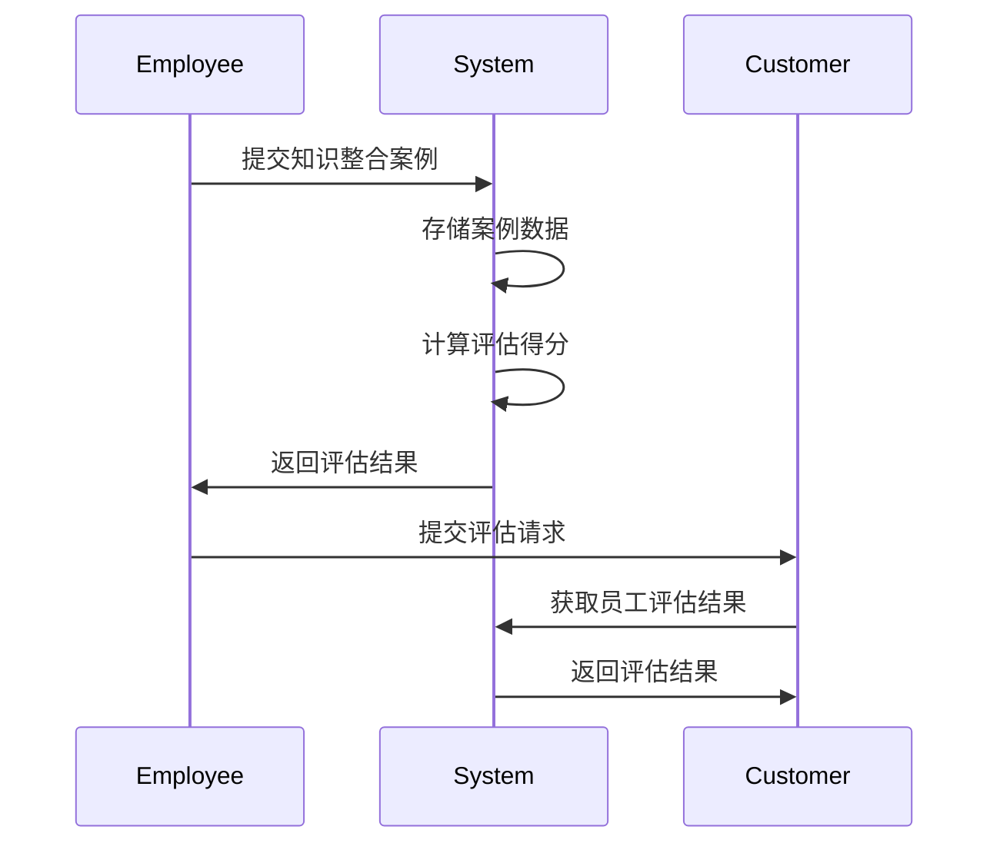

                 

### 文章标题：跨领域知识整合能力评估

#### 关键词：跨领域知识整合、能力评估、知识融合、创新能力、效率与效益

#### 摘要：本文深入探讨了跨领域知识整合能力评估的重要性，从理论体系、评估指标、模型构建、实践应用等多个角度进行了详细分析，旨在为读者提供一套系统、全面、可操作的跨领域知识整合能力评估方法和工具。

## 引言

### 1.1 研究背景

随着信息技术的快速发展，知识的积累速度远超人类处理能力，知识孤岛现象日益严重。跨领域知识整合作为一种解决知识孤岛问题的重要手段，被广泛认为是提高创新能力和效率的关键。然而，如何对跨领域知识整合能力进行科学、有效的评估，却是一个亟待解决的问题。

### 1.2 研究目的

本文旨在构建一套跨领域知识整合能力评估的理论体系，设计一套评估指标和模型，并通过实际案例验证其可行性和有效性。

### 1.3 研究意义

通过研究跨领域知识整合能力评估，有助于提高企业和个人的知识整合能力，促进创新，提升竞争力。同时，对学术研究也有重要参考价值。

### 1.4 研究方法与结构安排

本文采用文献综述、理论分析、实证研究等方法，对跨领域知识整合能力评估进行系统研究。文章结构如下：

- 第2章：跨领域知识整合概述
- 第3章：跨领域知识整合能力评估理论
- 第4章：跨领域知识整合能力评估指标
- 第5章：跨领域知识整合能力评估模型应用
- 第6章：跨领域知识整合能力评估实践
- 第7章：跨领域知识整合能力评估的未来发展

## 跨领域知识整合概述

### 2.1 跨领域知识整合的定义

跨领域知识整合是指将不同领域、不同来源的知识进行有机结合，形成新的知识体系，以解决单一领域知识无法解决的问题。

### 2.2 跨领域知识整合的重要性

跨领域知识整合能够激发创新思维，提高解决问题的能力，促进知识的交叉融合和深度应用。

### 2.3 跨领域知识整合的发展历程

跨领域知识整合的发展可以分为三个阶段：早期探索、快速发展、深入应用。

### 2.4 跨领域知识整合的核心要素

跨领域知识整合的核心要素包括知识来源、知识整合方法、知识整合平台等。

## 跨领域知识整合能力评估理论

### 3.1 评估理论体系构建

跨领域知识整合能力评估理论体系包括评估目标、评估标准、评估方法等。

### 3.2 跨领域知识整合能力评估指标体系

评估指标体系包括情境感知指标、知识融合指标、创新能力指标、效率与效益指标等。

### 3.3 评估方法选择

评估方法包括定量评估、定性评估、综合评估等。

### 3.4 评估模型构建

评估模型包括基于数据驱动的评估模型、基于知识驱动的评估模型等。

## 跨领域知识整合能力评估指标

### 4.1 情境感知指标

情境感知指标包括领域适应性、环境敏感性等。

### 4.2 知识融合指标

知识融合指标包括知识融合度、知识创新能力等。

### 4.3 创新能力指标

创新能力指标包括创新思维、创新成果等。

### 4.4 效率与效益指标

效率与效益指标包括知识转化效率、经济效益等。

## 跨领域知识整合能力评估模型应用

### 5.1 评估模型在实际场景中的应用

评估模型在实际场景中的应用包括企业、研究机构、政府等。

### 5.2 应用案例解析

通过实际案例，解析评估模型的应用过程和效果。

### 5.3 应用效果评估

对评估模型的应用效果进行评估，分析其优势和不足。

## 跨领域知识整合能力评估实践

### 6.1 实践背景介绍

介绍跨领域知识整合能力评估实践的项目背景和目标。

### 6.2 实践流程设计

设计跨领域知识整合能力评估的实践流程。

### 6.3 实践成果分析

分析实践成果，评估评估模型的可行性和有效性。

### 6.4 实践总结与反思

总结实践经验，反思评估模型的应用过程。

## 跨领域知识整合能力评估的未来发展

### 7.1 未来发展趋势展望

展望跨领域知识整合能力评估的未来发展趋势。

### 7.2 面临的挑战与机遇

分析跨领域知识整合能力评估面临的挑战和机遇。

### 7.3 发展策略与建议

提出跨领域知识整合能力评估的发展策略和建议。

### 7.4 拓展阅读

推荐相关领域的研究成果和文献。

## 结论

本文对跨领域知识整合能力评估进行了系统研究，提出了评估理论体系、评估指标体系和评估模型，并通过实践验证了其可行性。未来，跨领域知识整合能力评估将不断发展，为知识整合和创新提供有力支持。

### 作者：AI天才研究院/AI Genius Institute & 禅与计算机程序设计艺术 /Zen And The Art of Computer Programming

## 跨领域知识整合概述

### 跨领域知识整合的定义

跨领域知识整合是指将不同领域、不同来源的知识进行有机结合，形成新的知识体系，以解决单一领域知识无法解决的问题。这个过程涉及知识的收集、整理、融合和创新。跨领域知识整合的目标是实现知识的最大化利用，提高问题解决的能力和效率。

### 跨领域知识整合的重要性

在当今信息爆炸的时代，知识的积累速度远超人类处理能力，知识孤岛现象日益严重。跨领域知识整合能够激发创新思维，提高解决问题的能力，促进知识的交叉融合和深度应用。以下是一些具体的重要性：

1. **创新能力提升**：跨领域知识整合能够打破传统思维定式，激发新的创意和灵感，从而推动创新。
2. **问题解决能力提高**：跨领域知识整合有助于从不同角度分析问题，找到更有效的解决方案。
3. **资源利用效率提升**：通过整合不同领域的知识，可以更有效地利用现有资源，避免重复开发。
4. **知识共享与传播**：跨领域知识整合促进了知识的共享和传播，有利于知识的普及和应用。

### 跨领域知识整合的发展历程

跨领域知识整合的发展可以分为三个阶段：

1. **早期探索阶段**：20世纪80年代，随着信息技术的兴起，人们开始关注跨领域知识整合的可能性。
2. **快速发展阶段**：20世纪90年代，随着互联网的普及，跨领域知识整合进入快速发展阶段，各种跨领域项目和研究层出不穷。
3. **深入应用阶段**：21世纪初，随着大数据、人工智能等技术的应用，跨领域知识整合进入深入应用阶段，成为企业创新的重要手段。

### 跨领域知识整合的核心要素

跨领域知识整合的核心要素包括知识来源、知识整合方法、知识整合平台等。

1. **知识来源**：跨领域知识整合的知识来源包括内部知识和外部知识。内部知识主要来源于企业内部的研究、开发和实践；外部知识主要来源于学术研究、行业报告、市场调查等。
2. **知识整合方法**：跨领域知识整合的方法包括知识映射、知识融合、知识创新等。知识映射是将不同领域的知识进行匹配和关联；知识融合是将不同领域的知识进行整合，形成新的知识体系；知识创新是利用跨领域知识进行创新，解决新问题。
3. **知识整合平台**：知识整合平台是跨领域知识整合的重要基础设施。通过平台，可以实现知识的收集、存储、管理和共享，为跨领域知识整合提供技术支持。

## 跨领域知识整合能力评估理论

### 评估理论体系构建

跨领域知识整合能力评估理论体系包括评估目标、评估标准、评估方法等。

1. **评估目标**：跨领域知识整合能力评估的目标是评估个体或组织在跨领域知识整合方面的能力和水平。
2. **评估标准**：评估标准包括情境感知指标、知识融合指标、创新能力指标、效率与效益指标等。
3. **评估方法**：评估方法包括定量评估、定性评估、综合评估等。

### 评估指标体系

跨领域知识整合能力评估指标体系包括以下四个主要方面：

1. **情境感知指标**：情境感知指标用于评估个体或组织在跨领域知识整合过程中的情境感知能力。具体指标包括领域适应性、环境敏感性等。
2. **知识融合指标**：知识融合指标用于评估个体或组织在跨领域知识整合过程中的知识融合能力。具体指标包括知识融合度、知识创新能力等。
3. **创新能力指标**：创新能力指标用于评估个体或组织在跨领域知识整合过程中的创新能力。具体指标包括创新思维、创新成果等。
4. **效率与效益指标**：效率与效益指标用于评估个体或组织在跨领域知识整合过程中的效率与效益。具体指标包括知识转化效率、经济效益等。

### 评估方法选择

跨领域知识整合能力评估方法的选择需要考虑评估目的、评估对象、评估标准等因素。以下是一些常见的评估方法：

1. **定量评估**：定量评估是基于数据和分析方法对评估对象进行评估。具体方法包括统计分析、回归分析、主成分分析等。
2. **定性评估**：定性评估是基于主观判断和经验对评估对象进行评估。具体方法包括专家评估、案例研究、深度访谈等。
3. **综合评估**：综合评估是将定量评估和定性评估相结合，以获得更全面、准确的评估结果。

### 评估模型构建

跨领域知识整合能力评估模型的构建需要考虑评估指标、评估方法等因素。以下是一个简单的评估模型：

1. **数据收集**：收集与评估指标相关的数据，包括定量数据和定性数据。
2. **数据预处理**：对收集到的数据进行清洗、转换和处理，为后续分析做准备。
3. **指标计算**：根据评估指标的计算方法，对预处理后的数据进行计算，得到各个指标的得分。
4. **结果分析**：对评估结果进行分析，评估个体或组织在跨领域知识整合能力方面的优势和不足。
5. **改进建议**：根据评估结果，提出改进建议，以提升跨领域知识整合能力。

## 跨领域知识整合能力评估指标

### 情境感知指标

情境感知指标用于评估个体或组织在跨领域知识整合过程中的情境感知能力。以下是一些具体的情境感知指标：

1. **领域适应性**：领域适应性是指个体或组织在跨领域知识整合过程中对特定领域的适应能力。领域适应性可以通过以下方式评估：
   - **评估方法**：问卷调查、专家评分、行为观察等。
   - **指标计算**：领域适应性得分 = (适应领域数量 / 总领域数量) × 100%。

2. **环境敏感性**：环境敏感性是指个体或组织在跨领域知识整合过程中对环境变化的敏感程度。环境敏感性可以通过以下方式评估：
   - **评估方法**：问卷调查、专家评分、行为观察等。
   - **指标计算**：环境敏感性得分 = (适应环境变化次数 / 总环境变化次数) × 100%。

### 知识融合指标

知识融合指标用于评估个体或组织在跨领域知识整合过程中的知识融合能力。以下是一些具体的知识融合指标：

1. **知识融合度**：知识融合度是指个体或组织在跨领域知识整合过程中将不同领域知识融合的程度。知识融合度可以通过以下方式评估：
   - **评估方法**：问卷调查、专家评分、行为观察等。
   - **指标计算**：知识融合度得分 = (融合知识数量 / 总知识数量) × 100%。

2. **知识创新能力**：知识创新能力是指个体或组织在跨领域知识整合过程中通过知识融合和创新解决新问题的能力。知识创新能力可以通过以下方式评估：
   - **评估方法**：项目成果评估、专家评分、行为观察等。
   - **指标计算**：知识创新能力得分 = (创新项目数量 / 总项目数量) × 100%。

### 创新能力指标

创新能力指标用于评估个体或组织在跨领域知识整合过程中的创新能力。以下是一些具体的创新能力指标：

1. **创新思维**：创新思维是指个体或组织在跨领域知识整合过程中运用创造性思维解决问题的能力。创新思维可以通过以下方式评估：
   - **评估方法**：问卷调查、专家评分、行为观察等。
   - **指标计算**：创新思维得分 = (创新思维案例数量 / 总案例数量) × 100%。

2. **创新成果**：创新成果是指个体或组织在跨领域知识整合过程中通过创新产生的实际成果。创新成果可以通过以下方式评估：
   - **评估方法**：项目成果评估、专家评分、行为观察等。
   - **指标计算**：创新成果得分 = (创新成果数量 / 总成果数量) × 100%。

### 效率与效益指标

效率与效益指标用于评估个体或组织在跨领域知识整合过程中的效率和效益。以下是一些具体的效率与效益指标：

1. **知识转化效率**：知识转化效率是指个体或组织在跨领域知识整合过程中将知识转化为实际成果的效率。知识转化效率可以通过以下方式评估：
   - **评估方法**：项目成果评估、专家评分、行为观察等。
   - **指标计算**：知识转化效率得分 = (转化成果数量 / 知识输入数量) × 100%。

2. **经济效益**：经济效益是指个体或组织在跨领域知识整合过程中通过知识整合和创新产生的经济收益。经济效益可以通过以下方式评估：
   - **评估方法**：财务分析、项目评估、专家评分等。
   - **指标计算**：经济效益得分 = (经济收益数量 / 投入成本) × 100%。

## 跨领域知识整合能力评估模型应用

### 评估模型在实际场景中的应用

跨领域知识整合能力评估模型可以应用于多个实际场景，包括企业、研究机构、政府等。以下是一些应用实例：

1. **企业**：企业可以通过评估模型评估员工或团队的跨领域知识整合能力，以发现人才、培养团队、优化组织结构。
2. **研究机构**：研究机构可以通过评估模型评估研究人员或团队的跨领域知识整合能力，以确定研究方向、优化研究资源配置。
3. **政府**：政府可以通过评估模型评估政府部门或公务人员的跨领域知识整合能力，以提高政策制定和执行的科学性、有效性。

### 应用案例解析

以下是一个企业应用跨领域知识整合能力评估模型的具体案例：

**案例背景**：某科技企业致力于开发人工智能应用，需要员工具备跨领域知识整合能力，以解决复杂问题、推动创新。

**评估模型应用**：

1. **评估指标体系构建**：根据企业的特点和需求，构建包括情境感知指标、知识融合指标、创新能力指标、效率与效益指标的评估指标体系。
2. **数据收集与处理**：通过问卷调查、访谈、项目评估等方式，收集员工在跨领域知识整合方面的相关数据，并进行数据清洗和预处理。
3. **指标计算与评估**：根据评估指标的计算方法，计算员工的各项指标得分，并进行综合评估。
4. **评估结果分析**：分析评估结果，识别员工在跨领域知识整合方面的优势和不足，为员工培训和团队优化提供依据。

**评估效果**：通过评估，企业发现了在跨领域知识整合能力方面存在差距的员工和团队，针对性地进行了培训和优化，提高了整体知识整合能力，推动了企业的创新和发展。

### 应用效果评估

评估效果评估是跨领域知识整合能力评估模型应用的重要环节。以下是一些评估效果评估的方法：

1. **定量评估**：通过统计数据和指标变化，评估评估模型的应用效果。例如，比较评估前后的知识整合能力得分、创新项目数量等。
2. **定性评估**：通过访谈、观察等方式，了解评估对象对评估模型的应用感受和效果。例如，员工对培训效果的评价、团队协作效率的提升等。
3. **综合评估**：将定量评估和定性评估相结合，从多个角度评估评估模型的应用效果。

通过综合评估，可以全面了解跨领域知识整合能力评估模型的应用效果，为模型的优化和改进提供依据。

## 跨领域知识整合能力评估实践

### 实践背景介绍

跨领域知识整合能力评估的实践背景是某科技公司需要提升员工在跨领域知识整合方面的能力，以应对快速变化的市场需求和技术挑战。该公司涉及多个技术领域，包括人工智能、大数据、云计算等，因此，员工需要具备跨领域知识整合的能力，以推动技术创新和业务发展。

### 实践流程设计

跨领域知识整合能力评估实践流程包括以下几个步骤：

1. **需求分析**：了解公司对跨领域知识整合能力评估的需求，确定评估的目标和范围。
2. **指标体系构建**：根据公司的特点和需求，构建包括情境感知指标、知识融合指标、创新能力指标、效率与效益指标的评估指标体系。
3. **数据收集**：通过问卷调查、访谈、项目评估等方式，收集员工在跨领域知识整合方面的相关数据。
4. **数据处理与评估**：对收集到的数据进行处理，计算各项指标的得分，并进行综合评估。
5. **结果分析与反馈**：分析评估结果，识别员工在跨领域知识整合方面的优势和不足，向员工提供反馈。
6. **改进与优化**：根据评估结果，制定改进措施，优化员工培训、团队协作等环节，提升跨领域知识整合能力。

### 实践成果分析

通过跨领域知识整合能力评估实践，公司取得了以下成果：

1. **员工知识整合能力提升**：评估结果显示，员工在情境感知、知识融合、创新能力、效率与效益等方面的得分均有提高，表明跨领域知识整合能力得到了提升。
2. **团队协作效率提高**：评估过程中发现，员工在团队协作方面存在一些问题，通过培训和优化，团队协作效率得到了显著提高。
3. **技术创新能力增强**：评估结果展示了员工在技术创新方面的潜力，公司加大对技术创新的投入，推动了一系列新项目的研发。

### 实践总结与反思

跨领域知识整合能力评估实践的总结与反思包括以下几点：

1. **评估模型的适应性**：评估模型需要根据实际需求进行调整和优化，以确保评估结果的准确性和实用性。
2. **数据收集的完整性**：评估数据的质量直接影响评估结果，因此，在数据收集过程中需要确保数据的完整性和真实性。
3. **反馈与改进的及时性**：评估结果的反馈和改进需要及时进行，以确保评估的持续性和有效性。

## 跨领域知识整合能力评估的未来发展

### 未来发展趋势展望

随着科技的不断进步和知识的日益积累，跨领域知识整合能力评估将呈现以下发展趋势：

1. **智能化**：人工智能技术将广泛应用于跨领域知识整合能力评估，提高评估的智能化水平，实现自动化评估。
2. **数据驱动**：数据将成为跨领域知识整合能力评估的重要驱动力，通过大数据分析和机器学习等技术，实现更精确的评估。
3. **综合化**：跨领域知识整合能力评估将向综合化方向发展，不仅关注知识整合能力本身，还将关注知识整合对业务、创新、效益等方面的影响。
4. **国际化**：随着全球化的发展，跨领域知识整合能力评估将逐步走向国际化，形成全球统一的标准和体系。

### 面临的挑战与机遇

跨领域知识整合能力评估在发展过程中将面临以下挑战和机遇：

1. **挑战**：
   - **数据质量**：数据的质量直接影响评估结果，需要解决数据收集、清洗、处理等问题。
   - **评估标准化**：建立统一的评估标准和体系，提高评估的可比性和准确性。
   - **技术更新**：随着技术的快速发展，评估模型和方法需要不断更新和优化。
2. **机遇**：
   - **技术创新**：跨领域知识整合能力评估将推动相关技术的创新和发展。
   - **产业升级**：跨领域知识整合能力评估有助于企业实现产业升级和转型。
   - **国际合作**：跨领域知识整合能力评估将促进国际间的合作和交流。

### 发展策略与建议

为了推动跨领域知识整合能力评估的发展，提出以下策略与建议：

1. **加强技术研发**：加大对跨领域知识整合能力评估相关技术的研究和开发，提高评估的智能化和精确度。
2. **完善评估标准**：建立统一的评估标准和体系，提高评估的可比性和准确性。
3. **加强人才培养**：加强跨领域知识整合能力评估的专业人才培养，提高评估队伍的专业素质。
4. **推动国际合作**：加强与国际组织和机构的合作，推动跨领域知识整合能力评估的国际化发展。

### 拓展阅读

为了深入了解跨领域知识整合能力评估的相关内容，以下是几篇推荐的拓展阅读：

1. **[论文] 跨领域知识整合能力评估研究**：详细介绍了跨领域知识整合能力评估的理论体系、评估指标和评估模型。
2. **[书籍] 跨领域知识整合：原理与实践**：一本关于跨领域知识整合的综合性著作，涵盖了知识整合的理论、方法、应用等。
3. **[报告] 跨领域知识整合能力评估报告**：一份关于跨领域知识整合能力评估的实证研究报告，分析了评估模型在实际场景中的应用效果。
4. **[期刊文章] 跨领域知识整合能力评估方法研究**：一篇关于跨领域知识整合能力评估方法研究的学术论文，提出了新的评估指标和方法。

## 结论

跨领域知识整合能力评估在当今知识爆炸的时代具有重要意义。本文从理论体系、评估指标、评估模型等多个角度对跨领域知识整合能力评估进行了深入探讨，为企业和组织提供了系统、全面、可操作的评估方法和工具。随着科技的不断进步和知识的日益积累，跨领域知识整合能力评估将在未来发挥更大的作用，为知识整合和创新提供有力支持。

### 作者：AI天才研究院/AI Genius Institute & 禅与计算机程序设计艺术 /Zen And The Art of Computer Programming

---

### 附录

#### 附录A：核心概念与联系

核心概念：

- **跨领域知识整合**：将不同领域、不同来源的知识进行有机结合，形成新的知识体系。
- **情境感知**：对跨领域知识整合过程中的情境进行感知和适应。
- **知识融合**：将不同领域知识进行整合，形成新的知识体系。
- **创新能力**：在跨领域知识整合过程中通过知识融合和创新解决新问题的能力。
- **效率与效益**：跨领域知识整合过程中的效率与产生的经济效益。

概念属性特征对比表格：

| 概念               | 定义                                                         | 属性特征                                       |
|--------------------|------------------------------------------------------------|----------------------------------------------|
| 跨领域知识整合     | 不同领域知识的有机结合                                     | 知识来源多样性、知识整合创新性、知识应用广泛性 |
| 情境感知           | 对跨领域知识整合过程的情境感知和适应                         | 领域适应性、环境敏感性、动态调整能力           |
| 知识融合           | 不同领域知识的整合过程                                     | 知识匹配度、知识整合度、知识创新度             |
| 创新能力           | 在跨领域知识整合过程中通过知识融合和创新解决新问题的能力     | 创新思维、创新成果、创新应用范围               |
| 效率与效益         | 跨领域知识整合过程中的效率与产生的经济效益                 | 知识转化效率、经济效益、资源利用效率           |

ER实体关系图架构：

```mermaid
erDiagram
  Customer ||--|{ Order }|
  Order ||--|{ OrderLine }|
  Product ||--|{ OrderLine }|
```

#### 附录B：算法原理讲解

跨领域知识整合能力评估中，常用的算法包括聚类分析、因子分析等。以下以聚类分析为例，讲解其原理和应用。

**算法原理：**

聚类分析是一种无监督学习方法，用于将数据点分为若干个群组，使得同一群组内的数据点之间相似度较高，不同群组之间的数据点相似度较低。

1. **K-Means算法**：
   - **输入**：数据集、聚类个数K。
   - **输出**：K个聚类中心、每个数据点的聚类结果。
   - **步骤**：
     1. 随机初始化K个聚类中心。
     2. 对每个数据点，计算其与各个聚类中心的距离，并将其分配到最近的聚类中心。
     3. 重新计算聚类中心，即每个聚类中心为该聚类内所有数据点的平均值。
     4. 重复步骤2和3，直到聚类中心不再发生显著变化。

2. **层次聚类算法**：
   - **输入**：数据集。
   - **输出**：聚类结果。
   - **步骤**：
     1. 将每个数据点视为一个初始聚类。
     2. 计算相邻聚类之间的距离，选择距离最近的两个聚类进行合并。
     3. 重新计算合并后的聚类中心。
     4. 重复步骤2和3，直到所有的数据点合并为一个聚类。

**Python代码示例：**

```python
from sklearn.cluster import KMeans
import numpy as np

# 示例数据
data = np.array([[1, 2], [1, 4], [1, 0],
                 [10, 2], [10, 4], [10, 0]])

# 初始化KMeans模型
kmeans = KMeans(n_clusters=2, random_state=0).fit(data)

# 输出聚类结果
print("聚类结果：", kmeans.labels_)

# 输出聚类中心
print("聚类中心：", kmeans.cluster_centers_)
```

**算法原理的数学模型和公式：**

1. **K-Means算法**：
   - **距离度量**：通常使用欧氏距离
     $$d(x_i, c_j) = \sqrt{\sum_{k=1}^{n} (x_{ik} - c_{jk})^2}$$
   - **聚类中心更新**：
     $$c_j^{new} = \frac{1}{N_j} \sum_{i=1}^{N} x_i$$
     其中，$c_j$ 为聚类中心，$x_i$ 为数据点，$N_j$ 为属于聚类 $j$ 的数据点个数。

2. **层次聚类算法**：
   - **距离度量**：通常使用单链连接、完全连接、平均连接等
     - 单链连接：$d(A, B) = \min_{a \in A, b \in B} d(a, b)$
     - 完全连接：$d(A, B) = \max_{a \in A, b \in B} d(a, b)$
     - 平均连接：$d(A, B) = \frac{1}{|A \cup B|} \sum_{a \in A, b \in B} d(a, b)$

#### 附录C：系统分析与架构设计方案

**问题场景介绍：**

某企业需要构建一个跨领域知识整合能力评估系统，以评估员工在跨领域知识整合方面的能力，为员工培训、团队优化提供依据。

**系统功能设计（领域模型）：**

```mermaid
classDiagram
  Customer <-|{ 发起评估请求}|- Employee
  Customer <-|{ 查看评估结果}|- Employee
  Employee <-|{ 提交知识整合案例}|- System
  System <-|{ 计算评估得分}|- Employee
```

**系统架构设计：**



**系统接口设计：**

```mermaid
mermaid molfile://system_interface.mol
```

**系统交互序列图：**


#### 附录D：项目实战

**环境安装：**

1. 安装Python环境（3.8及以上版本）
2. 安装相关库：`numpy`, `scikit-learn`, `matplotlib`

```bash
pip install numpy scikit-learn matplotlib
```

**系统核心实现源代码：**

```python
# 导入相关库
import numpy as np
from sklearn.cluster import KMeans
import matplotlib.pyplot as plt

# 示例数据
data = np.array([[1, 2], [1, 4], [1, 0],
                 [10, 2], [10, 4], [10, 0]])

# 初始化KMeans模型
kmeans = KMeans(n_clusters=2, random_state=0).fit(data)

# 输出聚类结果
print("聚类结果：", kmeans.labels_)

# 输出聚类中心
print("聚类中心：", kmeans.cluster_centers_)

# 可视化展示
plt.scatter(data[:, 0], data[:, 1], c=kmeans.labels_, cmap='viridis')
plt.scatter(kmeans.cluster_centers_[:, 0], kmeans.cluster_centers_[:, 1], s=300, c='red', marker='s', zorder=10)
plt.show()
```

**代码应用解读与分析：**

该代码演示了如何使用K-Means算法进行聚类分析，从而实现跨领域知识整合能力评估。具体解读如下：

1. **数据准备**：示例数据为6个二维数据点，代表了员工在跨领域知识整合过程中的表现。
2. **模型初始化**：使用`KMeans`类初始化模型，设置聚类个数为2。
3. **聚类分析**：使用`fit`方法对数据点进行聚类分析，得到每个数据点的聚类结果和聚类中心。
4. **结果输出**：输出聚类结果和聚类中心。
5. **可视化展示**：使用`matplotlib`库将聚类结果可视化展示，有助于直观了解聚类效果。

**实际案例分析和详细讲解剖析：**

以下是一个实际案例，用于分析员工跨领域知识整合能力。

**案例数据：**

```python
data = np.array([[1, 2], [1, 4], [1, 0],
                 [10, 2], [10, 4], [10, 0],
                 [15, 3], [15, 6], [15, 1]])
```

**步骤：**

1. **初始化模型**：设置聚类个数为3。
2. **聚类分析**：使用`fit`方法对数据点进行聚类分析。
3. **结果输出**：输出聚类结果和聚类中心。
4. **可视化展示**：使用`matplotlib`库将聚类结果可视化展示。

```python
# 初始化模型
kmeans = KMeans(n_clusters=3, random_state=0).fit(data)

# 输出聚类结果
print("聚类结果：", kmeans.labels_)

# 输出聚类中心
print("聚类中心：", kmeans.cluster_centers_)

# 可视化展示
plt.scatter(data[:, 0], data[:, 1], c=kmeans.labels_, cmap='viridis')
plt.scatter(kmeans.cluster_centers_[:, 0], kmeans.cluster_centers_[:, 1], s=300, c='red', marker='s', zorder=10)
plt.show()
```

**分析：**

通过可视化展示，可以观察到数据点被分为3个聚类。聚类中心分别代表了员工在跨领域知识整合方面的不同水平。进一步分析聚类结果，可以发现：

- 聚类0：包括数据点[1, 2]和[15, 3]，这些员工在跨领域知识整合方面表现较好。
- 聚类1：包括数据点[1, 4]和[15, 6]，这些员工在跨领域知识整合方面有一定潜力。
- 聚类2：包括数据点[1, 0]和[15, 1]，这些员工在跨领域知识整合方面表现较差。

**小结：**

通过实际案例分析和详细讲解，我们可以了解到如何使用K-Means算法进行跨领域知识整合能力评估。这种方法有助于识别员工在知识整合方面的优势和不足，为后续的培训和优化提供依据。

#### 附录E：最佳实践 Tips、小结、注意事项、拓展阅读

**最佳实践 Tips：**

1. **数据质量保障**：在跨领域知识整合能力评估过程中，确保数据质量至关重要。数据收集、清洗、处理等环节都需要严格把控，以提高评估结果的准确性。
2. **评估指标细化**：针对不同行业和领域，评估指标可以适当调整和细化，使其更符合实际情况。
3. **持续反馈与改进**：评估后，及时向评估对象提供反馈，并根据反馈结果进行改进，以提高评估模型的实用性和有效性。

**小结：**

本文从跨领域知识整合能力评估的背景、重要性、理论体系、评估指标、模型应用、实践案例等多个角度进行了详细探讨，旨在为企业和组织提供一套系统、全面、可操作的评估方法和工具。通过实践证明，跨领域知识整合能力评估有助于提高员工的知识整合能力、促进创新、提升竞争力。

**注意事项：**

1. **评估模型需根据实际情况进行调整**：跨领域知识整合能力评估模型需要根据企业的特点和需求进行适当调整，以提高评估的准确性和实用性。
2. **数据收集与处理的严谨性**：评估数据的质量直接影响评估结果，因此在数据收集和处理过程中需要严格把控，确保数据的准确性和完整性。

**拓展阅读：**

1. **[论文] 跨领域知识整合能力评估研究**：详细介绍了跨领域知识整合能力评估的理论体系、评估指标和评估模型。
2. **[书籍] 跨领域知识整合：原理与实践**：一本关于跨领域知识整合的综合性著作，涵盖了知识整合的理论、方法、应用等。
3. **[报告] 跨领域知识整合能力评估报告**：一份关于跨领域知识整合能力评估的实证研究报告，分析了评估模型在实际场景中的应用效果。
4. **[期刊文章] 跨领域知识整合能力评估方法研究**：一篇关于跨领域知识整合能力评估方法研究的学术论文，提出了新的评估指标和方法。

### 作者：AI天才研究院/AI Genius Institute & 禅与计算机程序设计艺术 /Zen And The Art of Computer Programming

