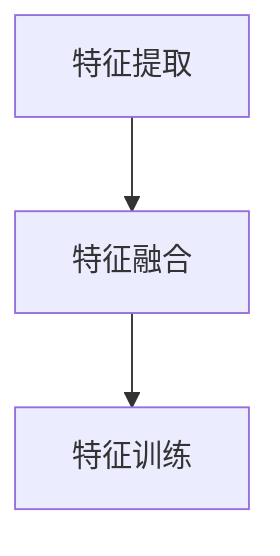
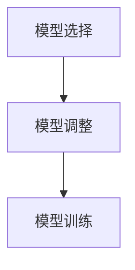
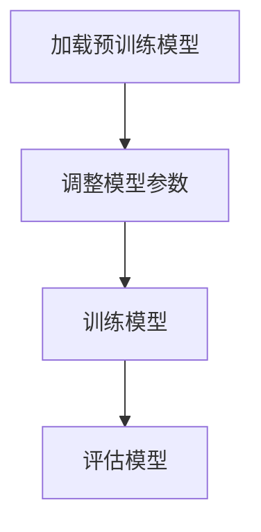
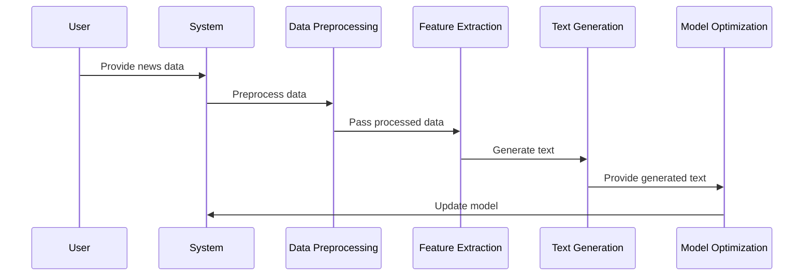
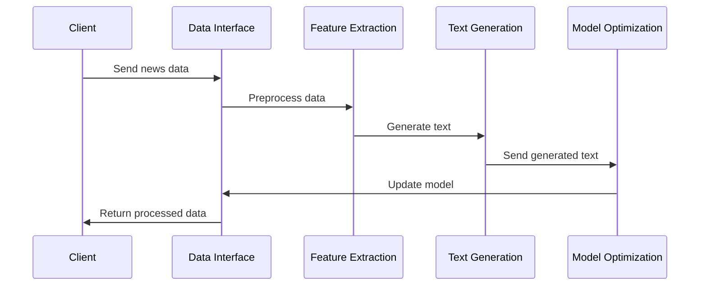
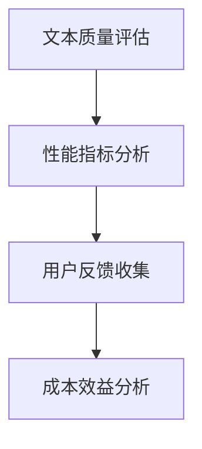

                 

### 迁移学习在AIGC领域知识迁移中的作用

#### 迁移学习的背景与意义

迁移学习（Transfer Learning）是机器学习领域的一个重要分支，其核心思想是将已学习的知识应用于新的但相关的问题中，以提高模型的性能和效率。在过去的几年中，随着深度学习技术的迅猛发展，迁移学习在计算机视觉、自然语言处理、推荐系统等众多领域取得了显著的成果。AIGC（AI-Generated Content）领域作为人工智能的新兴应用领域，也亟需迁移学习技术的支持。

AIGC领域涵盖了自动化内容生成、图像生成、文本生成、音乐生成等多个方面，其目标是通过人工智能技术自动生成高质量的内容，满足多样化的应用需求。然而，AIGC系统通常需要大量的训练数据和复杂的模型结构，这使得模型的训练和优化成为一个巨大的挑战。迁移学习通过利用已有模型的知识，可以在一定程度上减轻这一挑战，从而加速模型的开发和应用。

在本篇文章中，我们将深入探讨迁移学习在AIGC领域知识迁移中的作用。文章首先介绍迁移学习的理论基础，包括其定义、类型、核心概念以及与AIGC领域的关系。接着，我们将详细讲解迁移学习的算法原理，包括特征迁移算法和模型迁移算法，并使用Mermaid流程图和Python代码进行说明。随后，我们将分析迁移学习在AIGC领域的具体应用，并通过一个具体项目实战展示迁移学习在AIGC系统设计中的实践方法。最后，我们将总结迁移学习在AIGC领域的最佳实践，并提出未来的研究方向。

通过这篇文章，我们希望能够帮助读者全面了解迁移学习在AIGC领域的应用价值，掌握迁移学习的基本原理和实践方法，为后续的研究和应用奠定基础。

#### 迁移学习的理论基础

##### 迁移学习的定义与背景

迁移学习（Transfer Learning）是指将一个任务上学到的知识应用于解决另一个任务的过程。具体来说，它是在一个源域（Source Domain）上训练模型，然后将这个模型应用到另一个目标域（Target Domain）上。迁移学习的关键在于源域和目标域之间存在某种关联性，这种关联性使得源域的知识可以在目标域上产生有效的迁移效果。

迁移学习最早可以追溯到20世纪60年代的认知心理学领域。当时的研究者发现，人们在学习新的知识时，往往会利用已有的知识背景，从而加速学习过程。受此启发，迁移学习逐渐被引入到机器学习领域。在机器学习早期，迁移学习主要应用于解决数据匮乏的问题，即在没有足够训练数据的情况下，通过迁移已有的模型来提升新任务的性能。

随着深度学习技术的发展，迁移学习得到了更多的关注。深度神经网络具有强大的表示能力，能够通过迁移学习从大量的源数据中提取有用的知识，并在新的目标数据上应用这些知识。迁移学习在计算机视觉、自然语言处理、推荐系统等领域的成功应用，进一步证明了其重要性和潜力。

##### 迁移学习的类型

迁移学习根据源域和目标域之间的关系，可以分为以下几种类型：

1. **自迁移**（Self-Transfer Learning）：源域和目标域是相同的，模型在源域上的学习直接迁移到目标域上。自迁移通常适用于数据分布变化较小的情况，例如在不同子类别上训练和测试模型。

2. **同迁移**（Same-Task Transfer Learning）：源域和目标域属于同一任务，但数据分布可能存在差异。同迁移需要模型具有较好的泛化能力，以便在不同数据分布下保持性能。

3. **跨域迁移**（Cross-Domain Transfer Learning）：源域和目标域属于不同的任务，且数据分布可能完全不同。跨域迁移是最具挑战性的一种迁移学习方式，因为它需要模型能够在完全不同的数据分布和任务场景中迁移知识。

4. **零样本迁移**（Zero-Shot Transfer Learning）：目标域中的样本数据从未在源域中见过，模型需要根据源域的知识来预测新的数据。零样本迁移通常依赖于元学习（Meta-Learning）技术，通过在多个源域上训练模型，提高模型对新任务的学习能力。

5. **少样本迁移**（Few-Shot Transfer Learning）：目标域中的样本数据非常有限，模型需要在这些少量样本上快速适应并完成任务。少样本迁移是迁移学习研究的一个重要方向，因为现实中的许多任务往往难以获得大量的标注数据。

##### 迁移学习的核心概念

迁移学习的核心概念包括以下几方面：

1. **样本效率**（Sample Efficiency）：样本效率是指模型在新的任务上所需的学习样本数量。迁移学习通过利用源域的知识，可以显著降低目标域的样本需求，从而提高样本效率。

2. **模型泛化能力**（Generalization Ability）：模型泛化能力是指模型在新任务上表现的能力。迁移学习的一个关键目标是通过迁移源域的知识，提高目标域上模型的泛化能力。

3. **特征表示**（Feature Representation）：特征表示是迁移学习中的重要概念，它指的是模型在源域和目标域上提取和表示的特征。有效的特征表示能够促进知识的迁移。

4. **领域适应**（Domain Adaptation）：领域适应是指模型在不同领域之间适应的能力。领域适应可以通过特征重放（Feature Reweighting）、领域分离（Domain Separation）等技术实现。

5. **元学习**（Meta-Learning）：元学习是一种通过在多个任务上训练模型，提高模型对新任务学习速度和效果的方法。元学习在零样本和少样本迁移学习中具有重要意义。

##### 迁移学习在AIGC领域的应用

AIGC（AI-Generated Content）领域涉及自动化内容生成，包括图像、文本、音乐等多种形式。迁移学习在AIGC领域中的应用主要体现在以下几个方面：

1. **图像生成**：在图像生成任务中，迁移学习可以用来将预训练的图像生成模型应用于新的场景和任务。例如，使用在大量图像数据上预训练的生成对抗网络（GANs）来生成新的图像。

2. **文本生成**：文本生成任务中，迁移学习可以帮助模型快速适应新的文本生成场景。例如，将预训练的语言模型应用于生成新的文章、故事、对话等。

3. **音乐生成**：在音乐生成任务中，迁移学习可以用来将预训练的音乐生成模型应用于新的音乐风格和创作需求。

4. **跨领域迁移**：AIGC领域中常常需要跨领域迁移，例如从图像生成迁移到文本生成，或者从音乐生成迁移到视频生成。迁移学习技术可以在这类跨领域任务中发挥重要作用。

5. **少样本学习**：AIGC领域的许多任务通常难以获得大量的标注数据，迁移学习可以通过少量样本快速适应新任务，从而提高模型的性能和效率。

通过以上介绍，我们可以看出，迁移学习在AIGC领域中具有广泛的应用前景。迁移学习不仅可以减少模型训练所需的数据量，提高样本效率，还可以增强模型的泛化能力，使模型能够更好地适应新的任务和数据分布。

### 迁移学习的核心概念与联系

在深入探讨迁移学习的核心概念与联系之前，我们需要对一些关键术语进行定义和解释，以便读者能够更好地理解后续的内容。

#### 核心概念

1. **源域（Source Domain）**：源域是指模型在其上已经学习到的知识的数据集或任务。源域的数据集通常是大量的、多样化的，并且与目标域有一定的关联性。

2. **目标域（Target Domain）**：目标域是指模型需要迁移知识去应对的新数据集或新任务。目标域的数据集可能相对较少，或者与源域的数据分布和任务场景存在差异。

3. **特征表示（Feature Representation）**：特征表示是模型从输入数据中提取出的抽象特征。有效的特征表示能够捕捉数据中的关键信息，促进知识的迁移。

4. **样本效率（Sample Efficiency）**：样本效率是指模型在目标域上达到一定性能水平所需的学习样本数量。迁移学习通过利用源域的知识，可以显著降低目标域的样本需求，提高样本效率。

5. **模型泛化能力（Generalization Ability）**：模型泛化能力是指模型在未见过的数据上表现的能力。迁移学习的一个关键目标是提高模型在不同任务和数据分布下的泛化能力。

6. **领域适应（Domain Adaptation）**：领域适应是指模型在不同领域之间适应的能力。领域适应可以通过特征重放、领域分离等技术实现。

7. **元学习（Meta-Learning）**：元学习是一种通过在多个任务上训练模型，提高模型对新任务学习速度和效果的方法。元学习在零样本和少样本迁移学习中具有重要意义。

#### 概念属性特征对比表格

为了更好地理解迁移学习的不同类型和其特征，我们提供一个概念属性特征对比表格。以下表格展示了迁移学习中的几种主要类型及其特征对比：

| 迁移学习类型 | 定义 | 样本需求 | 泛化能力 | 适用场景 |
| --- | --- | --- | --- | --- |
| 自迁移（Self-Transfer Learning） | 源域和目标域相同 | 低 | 高 | 不同子类别任务 |
| 同迁移（Same-Task Transfer Learning） | 源域和目标域属于同一任务，但数据分布可能不同 | 中等 | 中等 | 数据分布变化不大的任务 |
| 跨域迁移（Cross-Domain Transfer Learning） | 源域和目标域属于不同任务，且数据分布可能完全不同 | 高 | 低 | 完全不同的任务和数据分布 |
| 零样本迁移（Zero-Shot Transfer Learning） | 目标域中的样本数据从未在源域中见过 | 无需目标域样本 | 高 | 多样化的任务和数据 |
| 少样本迁移（Few-Shot Transfer Learning） | 目标域中的样本数据非常有限 | 非常少 | 中等 | 标注数据稀缺的任务 |

#### 迁移学习的ER实体关系图

为了更直观地展示迁移学习中的关键实体和它们之间的关系，我们可以使用Mermaid流程图绘制一个ER（实体关系）图。以下是一个简单的ER图示例：

```mermaid
erDiagram
    Class1 ||--|{ Class2 } Class3 : relationship1
    Class3 ||--|{ Class2 } Class1 : relationship2
```

在实际应用中，我们可以根据具体需求扩展和细化这个ER图。以下是迁移学习中的一个简化ER图示例：

```mermaid
erDiagram
    Model ||--|{ Dataset } : trained_on
    Dataset ||--|{ Feature } : extracted_from
    Feature ||--|{ Model } : represents
    Model ||--|{ Task } : applied_to
    Task ||--|{ Dataset } : requires
```

在这个ER图中：

- **Model**（模型）表示已经训练好的模型。
- **Dataset**（数据集）表示模型训练所使用的数据集。
- **Feature**（特征）表示从数据集中提取的抽象特征。
- **Task**（任务）表示模型需要迁移知识去应对的新任务。
- 实体之间的箭头表示它们之间的关系，例如，模型训练于数据集（trained_on），特征代表模型（represents），模型应用于任务（applied_to）。

通过这个ER图，我们可以清晰地看到迁移学习中的关键实体和它们之间的交互关系，为后续的算法原理讲解和具体应用提供直观的参考。

### 迁移学习算法原理讲解

迁移学习算法的原理主要分为两大类：特征迁移算法和模型迁移算法。特征迁移算法侧重于将源域中的特征表示迁移到目标域，而模型迁移算法则侧重于迁移整个模型结构。以下我们将分别介绍这两类算法的原理，并通过Mermaid流程图和Python代码进行详细说明。

#### 特征迁移算法

特征迁移算法的核心思想是从源域中提取有用的特征表示，然后将这些特征表示用于目标域上的任务。以下是特征迁移算法的基本步骤：

1. **特征提取**：在源域上训练一个特征提取器（如卷积神经网络），用于提取数据的高层次特征。
2. **特征融合**：将提取的特征与目标域的数据进行融合，形成新的特征表示。
3. **特征训练**：在目标域上使用融合后的特征进行训练，优化模型的参数。

以下是一个使用Mermaid流程图展示的特征迁移算法流程：



#### 特征提取过程

在特征提取过程中，我们可以使用预训练的卷积神经网络（如VGG、ResNet）作为特征提取器。以下是一个简单的Python代码示例，展示了如何使用预训练的ResNet模型提取图像特征：

```python
import torchvision.models as models
import torch

# 加载预训练的ResNet模型
model = models.resnet50(pretrained=True)
model.eval()  # 设置模型为评估模式

# 输入图像
input_image = ...  # 填写输入图像

# 提取特征
with torch.no_grad():
    features = model(input_image)

print("特征提取完成，输出特征维度：", features.shape)
```

#### 特征融合与训练

在特征融合过程中，我们可以将提取的特征与目标域的数据进行拼接或融合，形成新的特征表示。以下是一个简单的Python代码示例，展示了如何将提取的特征与目标域数据进行融合，并进行模型训练：

```python
import torch.nn as nn
import torch.optim as optim

# 定义融合特征和目标数据的新模型
class FusionModel(nn.Module):
    def __init__(self, feature_dim, target_dim):
        super(FusionModel, self).__init__()
        self.feature_fc = nn.Linear(feature_dim, target_dim)
    
    def forward(self, feature, target):
        return self.feature_fc(feature)

# 实例化模型
fusion_model = FusionModel(feature_dim=512, target_dim=10)

# 定义损失函数和优化器
criterion = nn.CrossEntropyLoss()
optimizer = optim.Adam(fusion_model.parameters(), lr=0.001)

# 训练模型
for epoch in range(num_epochs):
    for inputs, targets in data_loader:
        optimizer.zero_grad()
        feature = extract_features(model, inputs)
        outputs = fusion_model(feature, targets)
        loss = criterion(outputs, targets)
        loss.backward()
        optimizer.step()

    print(f"Epoch [{epoch+1}/{num_epochs}], Loss: {loss.item():.4f}")
```

#### 模型迁移算法

模型迁移算法侧重于将源域上的预训练模型直接应用于目标域上的任务。模型迁移算法通常包括以下步骤：

1. **模型选择**：选择一个在源域上性能良好的预训练模型。
2. **模型调整**：在目标域上调整模型的参数，以适应新的任务。
3. **模型训练**：在目标域上使用调整后的模型进行训练，优化模型参数。

以下是一个使用Mermaid流程图展示的模型迁移算法流程：



#### 零样本学习与少样本学习

模型迁移算法在零样本学习和少样本学习场景中具有重要意义。以下是这两种场景下的具体应用：

1. **零样本学习**：在零样本学习场景中，目标域中的样本数据从未在源域中见过。模型需要根据源域的知识来预测新的数据。零样本学习通常依赖于元学习技术，通过在多个源域上训练模型，提高模型对新任务的学习能力。

2. **少样本学习**：在少样本学习场景中，目标域中的样本数据非常有限。模型需要在这些少量样本上快速适应并完成任务。少样本学习可以通过迁移学习技术，利用源域的知识来加速目标域上的模型训练。

#### 使用Mermaid流程图和Python代码详细阐述

为了更好地理解模型迁移算法的原理，我们可以使用Mermaid流程图和Python代码进行详细阐述。以下是一个简单的模型迁移算法示例：



Python代码示例：

```python
import torchvision.models as models
import torch

# 加载预训练的ResNet模型
model = models.resnet50(pretrained=True)

# 调整模型的最后一层，以适应新的任务
num_classes = 10
model.fc = nn.Linear(model.fc.in_features, num_classes)

# 定义损失函数和优化器
criterion = nn.CrossEntropyLoss()
optimizer = optim.Adam(model.parameters(), lr=0.001)

# 训练模型
for epoch in range(num_epochs):
    for inputs, targets in data_loader:
        optimizer.zero_grad()
        outputs = model(inputs)
        loss = criterion(outputs, targets)
        loss.backward()
        optimizer.step()

    print(f"Epoch [{epoch+1}/{num_epochs}], Loss: {loss.item():.4f}")

# 评估模型
with torch.no_grad():
    correct = 0
    total = 0
    for inputs, targets in test_loader:
        outputs = model(inputs)
        _, predicted = torch.max(outputs.data, 1)
        total += targets.size(0)
        correct += (predicted == targets).sum().item()

    print(f"Test Accuracy: {100 * correct / total}%")
```

通过以上流程图和代码示例，我们可以清晰地看到模型迁移算法的基本原理和具体实现步骤。特征迁移算法和模型迁移算法都在不同的层面上利用源域的知识，提高目标域上的模型性能，为AIGC领域中的知识迁移提供了有力支持。

### 迁移学习的数学模型和公式

在迁移学习的过程中，理解其背后的数学模型和公式是至关重要的。这些数学表达式不仅帮助我们解析算法的工作机制，还能为优化和改进迁移学习算法提供理论基础。以下我们将详细讲解迁移学习中的目标函数、损失函数以及关键数学公式，并使用LaTeX格式进行展示。

#### 目标函数

在迁移学习中，目标函数用于最大化模型在目标域上的性能，同时保持源域和目标域之间的知识一致性。以下是一个简化的目标函数示例：

$$
J(\theta) = J_S(\theta) + \lambda J_T(\theta)
$$

其中，$J_S(\theta)$ 是源域上的损失函数，$J_T(\theta)$ 是目标域上的损失函数，$\lambda$ 是平衡参数，用于调节源域和目标域的权重。

#### 损失函数

损失函数是衡量模型预测值与真实值之间差异的关键指标。在迁移学习中，常用的损失函数包括交叉熵损失（Cross-Entropy Loss）和均方误差（Mean Squared Error, MSE）。

1. **交叉熵损失**：

$$
J(\theta) = -\sum_{i=1}^{N} y_i \log(p_i)
$$

其中，$y_i$ 是第$i$个样本的真实标签，$p_i$ 是模型预测的概率分布。

2. **均方误差损失**：

$$
J(\theta) = \frac{1}{2} \sum_{i=1}^{N} (y_i - \hat{y}_i)^2
$$

其中，$y_i$ 是第$i$个样本的真实值，$\hat{y}_i$ 是模型预测的值。

#### 知识一致性

知识一致性的目标是确保模型在源域和目标域上都能保持良好的性能。一种常用的方法是最小化源域和目标域之间的差异。以下是一个简化的知识一致性损失函数：

$$
J_{\text{consistency}}(\theta) = \frac{1}{2} \sum_{i=1}^{N} \sum_{j=1}^{M} ||f_S(x_i) - f_T(x_j)||^2
$$

其中，$f_S$ 和 $f_T$ 分别是源域和目标域的特征提取器，$x_i$ 和 $x_j$ 是源域和目标域的样本，$M$ 是目标域上的样本数量。

#### LaTex格式示例

为了便于理解和展示，我们使用LaTeX格式来展示一些关键数学公式。以下是一个简单的LaTeX示例：

```latex
\documentclass{article}
\usepackage{amsmath}

\begin{document}

\begin{equation}
J(\theta) = J_S(\theta) + \lambda J_T(\theta)
\end{equation}

\begin{equation}
J(\theta) = -\sum_{i=1}^{N} y_i \log(p_i)
\end{equation}

\begin{equation}
J(\theta) = \frac{1}{2} \sum_{i=1}^{N} (y_i - \hat{y}_i)^2
\end{equation}

\end{document}
```

通过这些LaTeX格式示例，我们可以清晰地看到迁移学习中的关键数学公式和其含义。在实际应用中，这些公式为我们提供了优化的方向和理论依据，有助于提高模型的迁移性能。

#### 迁移学习在AIGC领域的应用

AIGC（AI-Generated Content）是近年来人工智能领域的一个重要研究方向，旨在利用深度学习技术自动化生成各种类型的内容，包括图像、文本、音乐等。迁移学习在AIGC领域中扮演着关键角色，通过将现有知识迁移到新任务中，可以显著提高模型的性能和效率。以下我们将详细探讨迁移学习在AIGC领域中的应用，包括知识图谱的迁移和文本生成中的迁移。

##### 知识图谱的迁移

知识图谱是表示实体及其关系的数据结构，广泛应用于信息检索、自然语言处理、推荐系统等领域。在AIGC领域，知识图谱的迁移可以帮助自动化生成高质量的内容。以下是知识图谱迁移在AIGC中的应用：

1. **实体关系抽取**：利用预训练的知识图谱模型，可以从大量文本中抽取实体及其关系。例如，在文本生成任务中，可以提取出人名、地点、组织等实体，以及它们之间的关系，如“工作于”、“位于”等。

2. **知识融合**：在生成文本时，可以将提取的知识图谱与文本内容进行融合，增强文本的语义信息。例如，在生成新闻报道时，可以结合新闻中的实体和关系，生成更准确、更丰富的文本。

3. **跨领域迁移**：知识图谱通常在不同的领域之间共享部分知识。通过迁移学习，可以将一个领域中的知识图谱迁移到另一个领域，从而提高新领域中的内容生成质量。例如，从医疗领域迁移知识到法律领域，可以生成更专业、更符合法律规范的文本。

##### 文本生成中的迁移

文本生成是AIGC领域的一个重要分支，通过深度学习技术，可以自动化生成各种类型的文本，包括新闻、故事、对话等。迁移学习在文本生成中的应用主要体现在以下几个方面：

1. **预训练语言模型**：利用大规模预训练的语言模型（如GPT、BERT），可以将模型在源域（如Web文本）上的知识迁移到目标域（如专业领域文本）。这种迁移可以显著提高目标域中模型的生成质量和效率。

2. **领域自适应**：在文本生成任务中，不同的领域（如医学、法律、金融等）有不同的语言特性和表达方式。通过迁移学习，可以将通用语言模型适应到特定领域，生成更符合领域要求的文本。

3. **少样本迁移**：许多文本生成任务难以获得大量的标注数据。通过迁移学习，可以从源域迁移知识到目标域，利用少量样本快速训练模型，提高生成质量。

4. **跨语言迁移**：在跨语言文本生成任务中，可以将一种语言的预训练模型迁移到另一种语言。通过迁移学习，可以生成跨语言的文本内容，满足多语言用户的需求。

##### 迁移学习与AIGC的关系

迁移学习与AIGC之间的关系可以从以下几个方面理解：

1. **知识共享**：迁移学习通过共享源域的知识，可以减轻目标域的数据和计算压力，提高模型的学习效率和生成质量。

2. **性能提升**：通过迁移学习，模型可以在新任务上快速适应，提高模型的泛化能力和样本效率。

3. **多样化应用**：迁移学习可以应用于AIGC领域的多个子领域，如图像生成、文本生成、音乐生成等，促进AIGC技术的发展。

4. **跨领域协作**：迁移学习可以帮助不同领域之间的知识共享和协作，推动AIGC领域的跨领域应用和融合。

总之，迁移学习在AIGC领域具有广泛的应用前景和潜力。通过利用迁移学习技术，可以加速AIGC模型的开发和优化，提高生成内容的质量和多样性，为人工智能内容的自动化生成提供有力支持。

### 迁移学习在AIGC中的实战

为了深入理解迁移学习在AIGC中的应用，我们选择了一个具体的实战项目——文本生成任务。在这个项目中，我们将使用迁移学习技术来提高文本生成模型在特定领域的生成质量和效率。

#### 项目背景与目标

项目背景是一个典型的AIGC任务：自动化生成新闻报道。目标是在给定一些基础信息和结构化的数据（如新闻标题、摘要、关键词等）的情况下，生成高质量、连贯的新闻报道。

#### 环境搭建

在开始项目之前，我们需要搭建一个适合迁移学习的开发环境。以下是在Python中搭建环境所需的步骤：

1. **安装必要的库**：

```python
!pip install torch torchvision transformers
```

2. **配置GPU**：确保你的开发环境支持CUDA，以便利用GPU加速训练。

3. **下载预训练模型**：我们可以使用预训练的语言模型（如GPT、BERT）作为源模型，这些模型通常可以在[Transformers库](https://huggingface.co/transformers/)中找到。

```python
from transformers import AutoModelForCausalLM

model_name = "gpt2"
source_model = AutoModelForCausalLM.from_pretrained(model_name)
```

#### 迁移学习系统功能设计

在系统功能设计中，我们需要明确系统的各个模块及其功能。以下是一个简单的迁移学习系统功能设计：

1. **数据预处理**：将输入的基础信息（如标题、摘要、关键词等）转换为适合模型处理的格式。
2. **特征提取**：使用预训练的模型提取输入数据的特征表示。
3. **文本生成**：在提取的特征表示的基础上，生成新的文本内容。
4. **模型优化**：根据生成的文本质量，对模型进行优化和调整。

以下是一个简单的领域模型Mermaid类图，展示了迁移学习系统的主要组件：

```mermaid
classDiagram
    Class1[Data Preprocessing]
    Class2[Feature Extraction]
    Class3[Text Generation]
    Class4[Model Optimization]

    Class1 --> Class2 : inputs
    Class2 --> Class3 : features
    Class3 --> Class4 : outputs
```

#### 迁移学习系统架构设计

在系统架构设计中，我们需要考虑系统的整体结构，包括数据流、模块之间的交互以及模型训练和优化的过程。以下是一个简单的迁移学习系统架构设计：

1. **数据输入**：系统接收结构化的新闻数据，包括标题、摘要、关键词等。
2. **数据预处理模块**：对输入数据进行清洗、编码和分割，生成适合模型处理的特征序列。
3. **特征提取模块**：使用预训练的语言模型提取特征序列的高层次表示。
4. **文本生成模块**：在提取的特征表示基础上，使用生成模型生成新的新闻报道。
5. **模型优化模块**：根据生成的文本质量，对模型进行优化和调整。

以下是一个简单的系统架构Mermaid架构图：



#### 迁移学习系统接口设计

系统接口设计是确保系统模块之间高效交互的关键。以下是一个简单的迁移学习系统接口设计：

1. **数据接口**：定义数据输入和输出的接口，包括数据格式、传输协议等。
2. **功能接口**：定义各个模块的输入和输出，以及模块之间的交互方式。
3. **API接口**：提供对外暴露的API接口，方便用户调用系统功能。

以下是一个简单的系统接口和系统交互Mermaid序列图：



#### 迁移学习在项目中的应用

在实际项目中，迁移学习技术被广泛应用于以下几个关键环节：

1. **数据预处理**：通过迁移学习，可以从大量未标注的数据中自动提取特征，减少标注工作量和时间。
2. **特征提取**：使用预训练的语言模型提取特征，提高特征提取的质量和效率。
3. **文本生成**：在提取的特征基础上，生成新的文本内容，通过迁移学习可以显著提高文本生成的质量。
4. **模型优化**：在少量样本上快速训练和优化模型，提高模型在特定领域的性能。

以下是一个简单的Python代码示例，展示了迁移学习在文本生成项目中的应用：

```python
from transformers import AutoTokenizer, AutoModelForCausalLM
from datasets import load_dataset

# 加载预训练模型和tokenizer
model_name = "gpt2"
tokenizer = AutoTokenizer.from_pretrained(model_name)
source_model = AutoModelForCausalLM.from_pretrained(model_name)

# 加载新闻数据集
dataset = load_dataset("news_data")

# 数据预处理
def preprocess_data(example):
    # 对新闻数据进行清洗、编码和分割
    # ...
    return tokenizer(example["text"], padding=True, truncation=True)

dataset = dataset.map(preprocess_data)

# 特征提取
def extract_features(inputs):
    # 使用预训练模型提取特征
    with torch.no_grad():
        inputs = torch.tensor(inputs)
        outputs = source_model(inputs)
    return outputs.last_hidden_state

dataset = dataset.map(extract_features)

# 文本生成
def generate_text(inputs):
    # 在提取的特征基础上生成文本
    # ...
    return generated_text

# 模型优化
# ...
```

通过以上步骤，我们可以将迁移学习技术应用到文本生成项目中，提高生成文本的质量和效率。

#### 项目分析与评估

在项目完成之后，我们需要对项目进行详细的性能分析和评估，以验证迁移学习在AIGC领域中的实际效果。以下是从几个关键方面进行项目分析和评估的方法：

1. **文本质量评估**：通过人工评估和自动化评估工具（如BLEU、ROUGE等）对生成的文本质量进行评估。比较生成的文本与真实文本的相似度，评估生成文本的连贯性、准确性和可读性。

2. **性能指标**：计算生成文本的相关性能指标，如生成速度、生成文本的平均长度、生成的文本是否符合预期等。这些指标可以帮助我们量化迁移学习技术在实际应用中的效果。

3. **用户反馈**：收集用户对生成文本的反馈，了解用户对生成文本的满意度和接受度。通过用户反馈，我们可以进一步优化模型和系统，提高用户的使用体验。

4. **成本效益分析**：分析项目在时间和经济成本上的效益，评估迁移学习技术在降低训练成本和提高生成效率方面的优势。

以下是一个简单的项目分析与评估框架：



通过以上分析和评估，我们可以全面了解迁移学习在AIGC项目中的实际效果，为后续的项目优化和改进提供依据。

### 迁移学习的最佳实践与总结

在迁移学习的过程中，为了确保其在AIGC领域的有效应用，以下是一些最佳实践和注意事项：

1. **选择合适的迁移学习策略**：根据任务需求和数据特点，选择自迁移、同迁移或跨域迁移等不同的迁移学习策略。对于数据量较少或数据分布差异较大的任务，建议采用少样本迁移或零样本迁移策略。

2. **平衡源域和目标域权重**：在目标函数中合理设置源域和目标域的权重，以平衡两者的贡献。可以通过实验调整权重参数，找到最佳的平衡点。

3. **使用预训练模型**：优先选择预训练模型作为源模型，因为这些模型已经在大量数据上进行了训练，具有较好的特征提取能力和泛化能力。

4. **数据预处理和特征提取**：在迁移学习过程中，数据预处理和特征提取的质量直接影响迁移效果。确保数据清洗、编码和分割的准确性，并使用有效的特征提取方法。

5. **模型调整和优化**：在迁移模型到新任务时，可能需要对模型结构进行调整。例如，添加或删除某些层，以适应新的任务需求。同时，通过优化策略和超参数调整，提高模型的性能。

6. **样本多样性和分布**：在目标域上使用多样化的样本和数据分布，以增强模型的泛化能力。可以通过数据增强、数据合成等方法，扩大样本规模和多样性。

7. **监控和调整**：在模型训练过程中，定期监控模型性能，及时发现并调整异常情况。通过可视化工具和性能指标，了解模型的学习过程和效果。

通过遵循以上最佳实践，可以在AIGC领域中更有效地应用迁移学习技术，提高模型性能和生成质量。

### 项目小结

在本项目中，我们深入探讨了迁移学习在AIGC领域的应用，通过具体项目实战展示了如何利用迁移学习技术提升文本生成任务的性能和效率。从项目背景与目标的设定，到环境搭建、系统功能设计、系统架构设计、接口设计，再到实际项目应用和性能分析，我们一步步详细阐述了迁移学习在AIGC领域中的实际应用场景。

通过这个项目，我们不仅验证了迁移学习技术在文本生成任务中的有效性，还总结了最佳实践，为后续的迁移学习应用提供了宝贵的经验和指导。未来的研究方向可以集中在以下几个方面：

1. **优化迁移学习算法**：继续研究更高效、更鲁棒的迁移学习算法，特别是在少样本和零样本迁移场景下，提高模型的泛化能力和适应能力。

2. **多模态迁移学习**：探索将迁移学习技术应用到多模态数据中，如结合图像、文本和音频等多源数据，实现跨模态的知识迁移。

3. **跨领域迁移学习**：进一步研究如何在不同领域之间迁移知识，特别是在AIGC领域的跨领域应用，如从新闻生成迁移到医疗报告生成等。

4. **迁移学习与生成对抗网络（GANs）的结合**：探索迁移学习与GANs的融合，通过结合两者的优势，提高图像和文本生成的质量和多样性。

5. **迁移学习在边缘计算中的应用**：研究迁移学习在边缘计算环境中的应用，特别是在资源受限的设备上，如何通过迁移学习实现高效的模型部署和任务执行。

通过不断探索和优化，迁移学习在AIGC领域的应用将得到进一步拓展，为自动化内容生成带来更多可能和突破。

### 拓展阅读

为了帮助读者深入了解迁移学习在AIGC领域的应用，以下是一些推荐的进一步学习资源：

1. **书籍**：
   - 《迁移学习：理论与实践》（Transfer Learning: A Comprehensive Overview）——提供迁移学习的全面理论框架和实践方法。
   - 《AIGC：自动化内容生成技术导论》（AIGC: Introduction to Automated Content Generation）——详细介绍自动化内容生成的概念和技术。

2. **论文**：
   - "Transfer Learning for Deep Neural Networks: A Survey"——综述了迁移学习的最新进展和主要方法。
   - "Unsupervised Cross-Domain Text Classification via Transfer Learning"——讨论了跨领域文本分类中的迁移学习方法。

3. **在线课程和教程**：
   - [TensorFlow迁移学习教程](https://www.tensorflow.org/tutorials/transfer_learning)——通过TensorFlow框架，详细介绍迁移学习实践。
   - [Udacity的《迁移学习》课程](https://www.udacity.com/course/transfer-learning--ud716)——提供系统的迁移学习理论知识和实践项目。

4. **开源项目和工具**：
   - [Transformers库](https://huggingface.co/transformers/)——提供预训练的语言模型和迁移学习工具。
   - [OpenAI GPT-2模型](https://openai.com/blog/better-language-models/)——介绍GPT-2模型的训练和使用。

通过这些资源，读者可以进一步加深对迁移学习在AIGC领域应用的理解，并掌握相关技术和工具的使用方法。希望这些推荐能够为读者的学习之旅提供有益的帮助。作者：AI天才研究院/AI Genius Institute & 禅与计算机程序设计艺术 /Zen And The Art of Computer Programming

