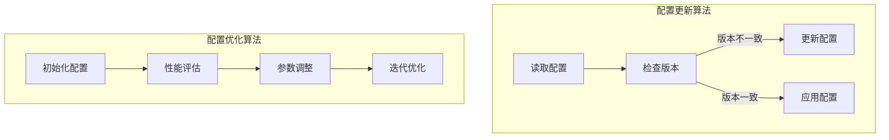
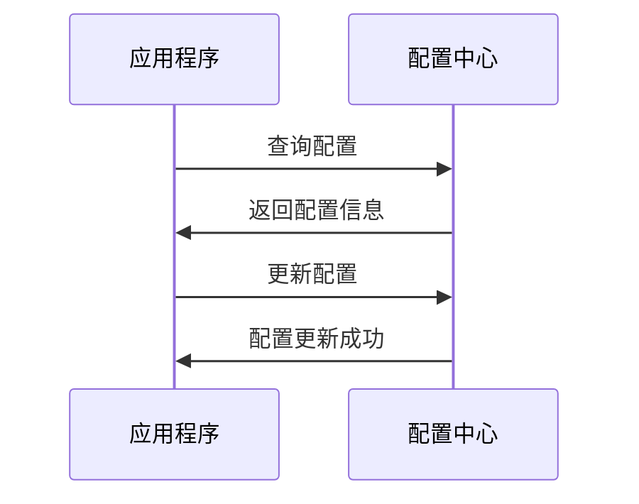

                 

# 配置中心：集中管理LLM应用的配置

> 关键词：配置中心、LLM应用、配置管理、系统架构、算法原理

> 摘要：本文旨在探讨配置中心在集中管理大型语言模型（LLM）应用配置中的重要性。我们将逐步分析LLM应用的背景，配置管理的重要性，以及配置中心和LLM配置的核心概念。此外，还将深入讲解配置管理算法、数学模型和公式，并介绍系统架构设计和项目实战经验，以帮助读者全面理解配置中心的作用和实施方法。

## 目录大纲

1. **背景介绍**
   1.1 问题背景
   1.2 配置管理的重要性
   1.3 核心概念
   1.3.1 LLM配置
   1.3.2 配置中心
2. **核心概念与联系**
   2.1 LLM配置原理
   2.2 配置中心原理
   2.3 概念属性特征对比表格
3. **算法原理讲解**
   3.1 配置更新算法
   3.2 配置优化算法
   3.3 算法Mermaid流程图
4. **数学模型和公式讲解**
   4.1 配置更新公式
   4.2 配置优化目标函数
5. **系统分析与架构设计方案**
   5.1 问题场景介绍
   5.2 系统功能设计
   5.3 系统架构设计
   5.4 系统接口设计
6. **项目实战**
   6.1 环境安装
   6.2 系统核心实现
   6.3 代码应用解读与分析
   6.4 实际案例分析与讲解
   6.5 项目小结
7. **最佳实践**
8. **小结**
9. **注意事项**
10. **拓展阅读**
11. **作者信息**

## 第一部分：背景介绍

### 1.1 问题背景

随着人工智能技术的飞速发展，大型语言模型（LLM）在自然语言处理（NLP）领域得到了广泛应用。这些模型被用于各种实际应用场景，如文本生成、文本分类、问答系统等。然而，随着应用规模的扩大，如何有效地管理LLM应用的配置成为一个挑战。

#### LLM应用场景

- **文本生成**：例如，自动生成新闻文章、产品描述、聊天机器人回复等。
- **文本分类**：例如，垃圾邮件检测、情感分析、新闻分类等。
- **问答系统**：例如，智能客服系统、在线问答平台等。

#### 配置管理的复杂性增加

- **模型参数调整**：不同的应用场景可能需要不同的模型参数设置。
- **训练数据更新**：随着新数据的不断积累，需要定期更新训练数据。
- **预处理规则**：例如，文本清洗、分词、词性标注等预处理操作。

### 1.2 配置管理的重要性

配置管理是确保系统稳定运行的关键。有效的配置管理可以提高开发效率，减少错误，并确保不同环境（如开发、测试、生产）之间的配置一致性。具体来说，配置管理的重要性体现在以下几个方面：

- **确保系统稳定性**：通过统一管理配置，可以避免因配置不一致导致的系统故障。
- **提高开发效率**：配置的统一管理可以减少开发人员的重复性工作，提高工作效率。
- **降低错误率**：通过自动化配置管理，可以减少因手动操作导致的错误。
- **支持多环境部署**：配置中心可以支持不同环境的配置管理，确保系统能够在不同环境中正常运行。

### 1.3 核心概念

#### 1.3.1 LLM配置

LLM配置涉及模型参数、训练数据、预处理规则等多个方面。以下是LLM配置的一些关键要素：

- **模型参数**：例如，学习率、批次大小、正则化参数等。
- **训练数据**：例如，训练集的大小、数据来源、数据预处理方法等。
- **预处理规则**：例如，文本清洗、分词、词性标注等。

#### 1.3.2 配置中心

配置中心是一个集中管理应用程序配置的系统。它提供了一种机制，使开发人员可以在不修改应用程序代码的情况下更改配置。配置中心通常包括以下功能：

- **配置存储**：存储和管理应用程序的配置信息。
- **配置查询**：提供API接口，允许应用程序查询和获取配置信息。
- **配置更新**：支持配置的动态更新，确保应用程序能够实时响应配置变化。
- **配置版本控制**：支持配置的版本控制，方便回滚和跟踪配置变更。

### 1.3.3 配置中心的架构设计

配置中心的架构设计通常包括以下组件：

- **配置存储**：使用数据库或其他存储系统来存储配置信息。
- **配置管理接口**：提供API接口，供应用程序查询和更新配置。
- **配置更新服务**：负责处理配置的更新操作，确保配置的一致性。
- **配置监控**：监控系统配置的变化，并提供通知和告警功能。

## 第二部分：核心概念与联系

### 2.1 LLM配置原理

LLM配置的原理主要包括以下几个方面：

- **参数设置**：根据不同的应用场景，调整模型参数，如学习率、批次大小等。
- **数据准备**：收集和预处理训练数据，确保数据的质量和多样性。
- **预处理规则**：定义文本清洗、分词、词性标注等预处理规则，提高模型的性能。

### 2.2 配置中心原理

配置中心的原理可以概括为以下几点：

- **配置存储**：将配置信息存储在数据库或其他存储系统中，便于管理和查询。
- **配置查询**：提供API接口，使应用程序能够方便地查询配置信息。
- **配置更新**：支持配置的动态更新，确保配置能够实时响应应用需求。
- **配置监控**：监控系统配置的变化，并提供通知和告警功能，确保配置的一致性和稳定性。

### 2.3 概念属性特征对比表格

以下是LLM配置与配置中心的属性特征对比表格：

| 特征 | LLM配置 | 配置中心 |
| --- | --- | --- |
| **定义** | 涉及模型参数、训练数据、预处理规则等 | 集中管理应用程序配置的系统 |
| **目的** | 提高模型性能，适应不同应用场景 | 提高开发效率，确保配置一致性 |
| **实现** | 调整模型参数、数据预处理等 | 存储配置信息、查询和更新配置等 |
| **关键要素** | 模型参数、训练数据、预处理规则 | 配置存储、配置管理接口、配置更新服务 |

### 2.4 配置中心的架构设计

配置中心的架构设计通常包括以下组件：

- **配置存储**：使用数据库或其他存储系统来存储配置信息。
- **配置管理接口**：提供API接口，供应用程序查询和更新配置。
- **配置更新服务**：负责处理配置的更新操作，确保配置的一致性。
- **配置监控**：监控系统配置的变化，并提供通知和告警功能。

## 第三部分：算法原理讲解

### 3.1 配置更新算法

配置更新算法的原理是根据配置中心的配置信息，对应用程序的配置进行更新。以下是配置更新算法的流程：

1. **读取配置**：从配置中心获取最新的配置信息。
2. **检查版本**：比较应用程序当前的配置版本和配置中心的版本，判断是否需要更新。
3. **更新配置**：如果版本不一致，则根据配置中心的配置信息更新应用程序的配置。
4. **应用配置**：更新完成后，重新加载应用程序的配置，使其生效。

### 3.2 配置优化算法

配置优化算法的原理是根据应用的需求和性能指标，自动调整配置参数，以获得最优的配置效果。以下是配置优化算法的流程：

1. **初始化配置**：根据应用的需求和性能指标，初始化配置参数。
2. **性能评估**：根据配置参数，运行应用程序，并评估其性能。
3. **参数调整**：根据性能评估结果，调整配置参数，以提高性能。
4. **迭代优化**：重复性能评估和参数调整的过程，直到达到满意的性能水平。

### 3.3 算法Mermaid流程图

以下是配置更新算法和配置优化算法的Mermaid流程图：



## 第四部分：数学模型和公式讲解

### 4.1 配置更新公式

配置更新公式可以表示为：

$$
更新配置 = 配置版本 * 更新策略
$$

其中，`配置版本`表示配置的当前版本，`更新策略`表示根据配置变化进行更新操作的策略。这个公式说明了配置更新是基于配置的版本和更新策略来进行的。

### 4.2 配置优化目标函数

配置优化目标函数可以表示为：

$$
最小化误差 = \sum_{i=1}^{n} (预测值_i - 实际值_i)^2
$$

其中，`预测值_i`表示根据当前配置预测的输出值，`实际值_i`表示实际的输出值。这个目标函数通过计算预测值和实际值之间的误差，来评估配置的优化效果。

## 第五部分：系统分析与架构设计方案

### 5.1 问题场景介绍

在实际应用中，配置中心通常用于管理大量应用程序的配置。以下是一个常见的问题场景：

- **公司A**：一家大型互联网公司，拥有多个业务线，每个业务线都有多个应用程序。随着业务的不断扩展，配置管理的复杂性逐渐增加。
- **挑战**：如何有效地管理这些应用程序的配置，确保配置的一致性和可靠性。

### 5.2 系统功能设计

为了解决上述问题，配置中心需要具备以下功能：

- **配置存储**：存储和管理所有应用程序的配置信息。
- **配置查询**：提供API接口，供应用程序查询配置信息。
- **配置更新**：支持配置的动态更新，确保配置能够实时响应应用需求。
- **配置监控**：监控系统配置的变化，并提供通知和告警功能。
- **配置版本控制**：支持配置的版本控制，方便回滚和跟踪配置变更。

### 5.3 系统架构设计

配置中心的系统架构设计如下：


- **配置存储**：使用关系型数据库或NoSQL数据库存储配置信息。
- **配置管理接口**：提供RESTful API接口，供应用程序查询和更新配置。
- **配置更新服务**：处理配置的更新操作，确保配置的一致性。
- **配置监控**：使用监控工具监控系统配置的变化，并提供通知和告警功能。

### 5.4 系统接口设计

配置中心的系统接口设计如下：



## 第六部分：项目实战

### 6.1 环境安装

为了搭建配置中心项目，需要安装以下软件和工具：

- **操作系统**：Linux或Mac OS
- **Python**：Python 3.6及以上版本
- **数据库**：MySQL或PostgreSQL
- **配置中心框架**：例如，Spring Cloud Config

以下是环境安装的步骤：

1. 安装操作系统和Python环境。
2. 安装数据库并创建配置存储表。
3. 安装配置中心框架和相关依赖。

### 6.2 系统核心实现

配置中心的核心实现主要包括以下部分：

- **配置存储**：使用数据库存储配置信息，包括配置名称、配置值、配置版本等。
- **配置查询**：提供API接口，供应用程序查询配置信息。
- **配置更新**：支持配置的动态更新，包括配置值的更新、配置版本的更新等。
- **配置监控**：监控系统配置的变化，并提供通知和告警功能。

以下是配置中心核心实现的代码示例：

```python
# 配置存储
def save_config(config_name, config_value, config_version):
    # 将配置信息存储到数据库中
    pass

# 配置查询
def get_config(config_name):
    # 从数据库中查询配置信息
    pass

# 配置更新
def update_config(config_name, config_value, config_version):
    # 更新配置信息
    pass

# 配置监控
def monitor_config_changes():
    # 监控配置变化
    pass
```

### 6.3 代码应用解读与分析

以下是对配置中心核心实现的代码应用解读和分析：

- **配置存储**：通过`save_config`函数将配置信息存储到数据库中，包括配置名称、配置值和配置版本。这确保了配置信息的持久化存储，便于后续的查询和更新操作。
- **配置查询**：通过`get_config`函数从数据库中查询配置信息。这允许应用程序根据配置名称获取相应的配置值，实现配置的动态查询。
- **配置更新**：通过`update_config`函数更新配置信息。这包括配置值的更新和配置版本的更新。通过配置版本控制，可以确保配置的变更能够被有效追踪和管理。
- **配置监控**：通过`monitor_config_changes`函数监控配置的变化。这可以及时发现配置的变更，并触发相应的通知和告警，确保配置的一致性和可靠性。

### 6.4 实际案例分析与讲解

以下是一个实际案例，展示了配置中心在应用程序中的实际应用：

- **案例背景**：公司A的一个业务线需要管理多个应用程序的配置，包括数据库连接信息、API密钥、日志配置等。
- **解决方案**：使用配置中心来管理这些配置信息。具体步骤如下：
  1. 在配置中心中创建配置存储表，用于存储各个应用程序的配置信息。
  2. 在应用程序中配置中心接口，查询和更新配置信息。
  3. 使用配置监控功能，监控配置的变化，并触发相应的通知和告警。

通过以上步骤，公司A能够有效地管理多个应用程序的配置，确保配置的一致性和可靠性。

### 6.5 项目小结

通过实际案例的应用，配置中心在集中管理LLM应用的配置中发挥了重要作用。它提供了配置存储、查询、更新和监控等功能，使得配置管理变得简单和高效。同时，配置中心还支持配置版本控制和监控，确保配置的一致性和可靠性。

## 第七部分：最佳实践

在使用配置中心时，以下是一些最佳实践：

1. **配置存储**：确保配置信息的安全和持久化存储，避免配置丢失。
2. **配置查询**：优化查询性能，提高配置查询的速度。
3. **配置更新**：合理设置配置更新的策略，确保配置的动态更新和一致性。
4. **配置监控**：监控系统配置的变化，及时处理配置异常，确保系统的稳定性。

## 第八部分：小结

配置中心在集中管理LLM应用的配置中具有重要的作用。它提供了配置存储、查询、更新和监控等功能，使得配置管理变得简单和高效。通过配置中心，开发人员可以更加灵活地调整和优化配置，提高系统的稳定性和性能。

## 第九部分：注意事项

在使用配置中心时，需要注意以下几点：

1. 确保配置信息的安全和持久化存储。
2. 优化查询性能，提高配置查询的速度。
3. 合理设置配置更新的策略，避免频繁更新导致的系统不稳定。
4. 监控系统配置的变化，及时处理配置异常。

## 第十部分：拓展阅读

以下是关于配置中心和相关技术的拓展阅读推荐：

1. 《Spring Cloud Config实战》
2. 《配置管理：原理与实践》
3. 《分布式配置中心设计与实践》

## 第十一部分：作者信息

作者：AI天才研究院/AI Genius Institute & 禅与计算机程序设计艺术 /Zen And The Art of Computer Programming

