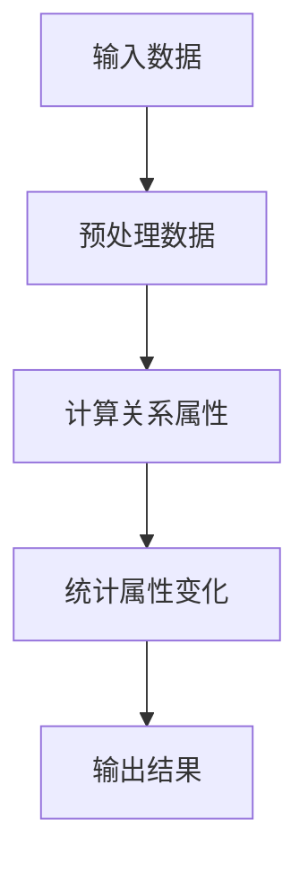
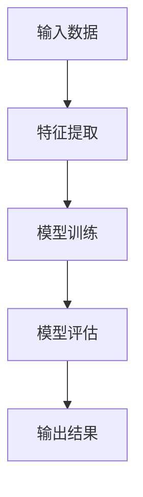
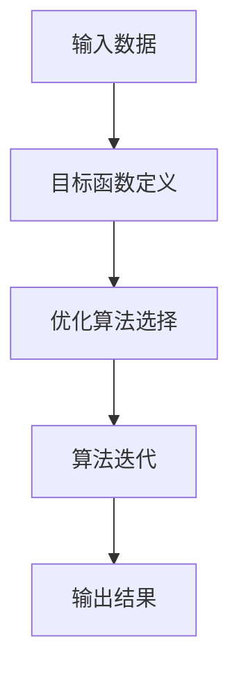
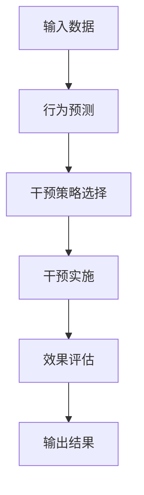
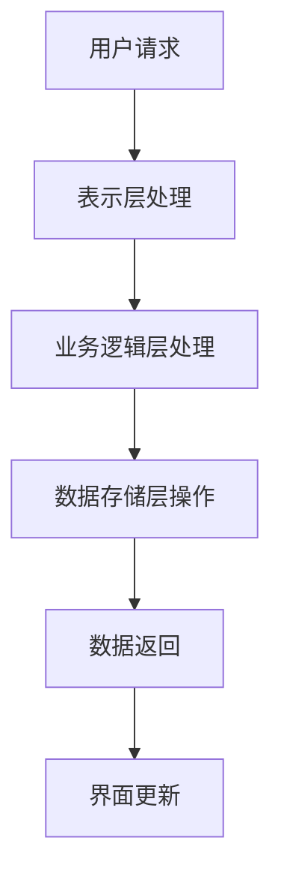
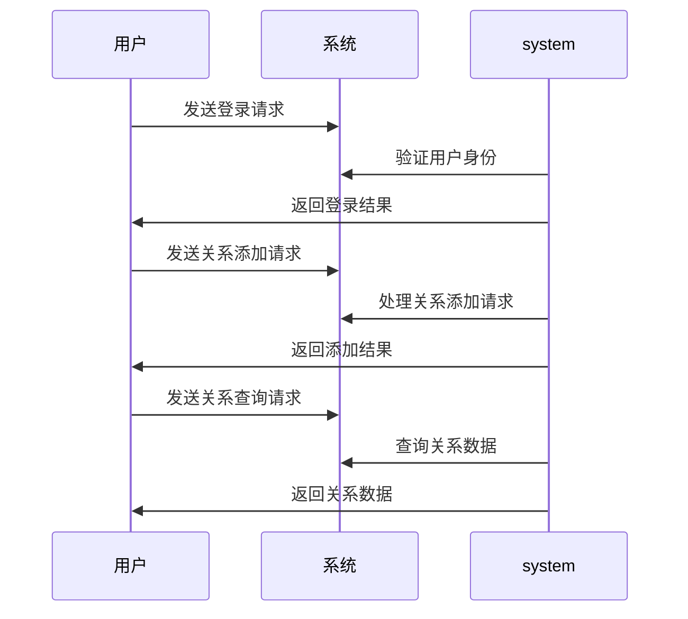

                 

## 《重新定义关系：从传统到现代》——引言

> 关键词：传统关系、现代关系、社会变革、心理学、文化适应、科技影响

> 摘要：本文将探讨从传统到现代的社会变革中，关系的演变过程。我们将逐步分析传统关系的核心要素，对比现代关系的定义与特点，探讨二者之间的融合与适应，并展望未来关系发展的趋势。通过本文，希望能够为读者提供一个全面而深刻的理解，帮助我们更好地应对现代社会中的关系挑战。

## 确定书籍的核心主题和目标读者

### 1.1 核心主题

《重新定义关系：从传统到现代》的核心主题是探讨关系在现代社会中的演变过程。我们将重点关注以下几个方面：

- 传统关系的概念与结构
- 现代关系的定义与特点
- 传统关系与现代关系的融合
- 过渡时期的适应策略
- 未来关系的趋势预测

### 1.2 目标读者

本文的目标读者主要是以下几类人群：

- 社会学家、心理学家和文化研究者，他们关注社会文化变迁及其对人类关系的影响。
- 管理者和职场人士，他们希望了解如何在现代职场环境中构建有效的关系。
- 心理咨询师和心理健康专业人士，他们需要了解关系变革对个人心理健康的影响。
- 广大读者，他们希望更好地理解和应对现代社会中的关系挑战。

## 设计第一章“背景介绍”

### 2.1 传统关系概述

传统关系是基于历史、文化和社会制度形成的，其核心要素主要包括家庭、亲属、朋友和社区。在传统社会中，这些关系往往具有明确的规则和边界，强调亲属关系的延续和社群的凝聚力。

#### 2.2 传统关系的核心要素

- **家庭关系**：家庭是传统关系的基本单位，其成员关系包括夫妻、父母与子女、兄弟姐妹等。家庭关系强调亲属间的责任和互助。
- **亲属关系**：亲属关系是基于血缘和婚姻形成的，其范围可以从近亲到远亲。亲属关系强调亲情和家族荣誉。
- **朋友关系**：朋友关系是建立在共同兴趣、价值观和情感共鸣上的，其特点是平等、互助和信任。
- **社区关系**：社区关系是建立在共同生活、共同利益和共同文化背景上的，其特点是互助、合作和共享。

#### 2.3 传统关系的特点与影响

传统关系的特点包括：

- **稳定性**：传统关系往往具有稳定性，成员间的互动遵循既定的规则和习俗。
- **规范性**：传统关系强调社会规范和道德约束，成员行为受到社会期待的影响。
- **紧密性**：传统关系中的成员关系紧密，互动频繁，彼此依赖。

传统关系对个人和社会的影响包括：

- **心理安全感**：稳定的传统关系可以为个人提供心理安全感，减少孤独和焦虑。
- **社会稳定性**：传统关系有助于维护社会秩序和稳定，减少冲突和动荡。
- **文化传承**：传统关系是文化传承的重要载体，有助于维护和传承社会价值观和习俗。

#### 2.4 问题描述

然而，随着社会的发展，传统关系面临着新的挑战。现代社会中，个人自由、多元化和科技发展等因素对传统关系产生了冲击，导致关系形式和内容发生了显著变化。因此，我们需要重新审视和定义关系，以适应现代社会的需求。

#### 2.5 问题解决

为了应对这些挑战，我们需要从以下几个方面入手：

- **理解关系演变**：了解传统关系如何演变到现代关系，以及这一过程中的关键因素。
- **重构关系结构**：重新定义关系中的核心要素和边界，使其适应现代社会。
- **培养适应能力**：提高个人和社会对关系变化的适应能力，包括心理适应、社交适应和文化适应。
- **科技助力**：利用科技手段优化关系管理，如社交媒体、在线社区和智能设备等。

#### 2.6 边界与外延

在讨论关系时，我们需要明确以下几个边界与外延：

- **关系类型**：包括家庭关系、亲属关系、朋友关系和社区关系等。
- **关系主体**：包括个人、家庭、组织和社区等。
- **关系范畴**：包括情感、利益、责任、信任和互动等。
- **关系变化**：包括关系破裂、关系重建、关系疏远和关系融合等。

#### 2.7 概念结构与核心要素组成

传统关系的概念结构与核心要素组成如下：

- **概念结构**：家庭、亲属、朋友、社区、情感、利益、责任、信任和互动等。
- **核心要素**：稳定性、规范性、紧密性、心理安全感、社会稳定性、文化传承、个人自由、多元化和科技发展等。

通过以上分析，我们为第一章“背景介绍”奠定了基础，为后续章节的内容提供了必要的背景知识和框架。接下来，我们将进一步探讨传统关系与现代关系的差异和融合，以及过渡时期的适应策略。

## 设计第二章“核心概念与联系”

### 3.1 核心概念原理

在深入探讨传统关系与现代关系的差异和融合之前，我们需要明确几个核心概念。这些概念包括关系、社会结构、文化背景和个人心理等。

#### 3.1.1 关系的定义与属性

关系是指两个或多个实体之间的相互作用和联系。关系的属性包括：

- **类型**：关系可以分为家庭关系、亲属关系、朋友关系和社区关系等。
- **强度**：关系的强度可以衡量关系成员之间的紧密程度和互动频率。
- **稳定性**：关系的稳定性指关系持续的时间长度和抗干扰能力。
- **规范性**：关系的规范性指关系成员遵循的社会规范和道德准则。
- **动态性**：关系的动态性指关系随时间变化而发生的调整和重构。

#### 3.1.2 社会结构的演变

社会结构是指社会各个组成部分之间的相互关系和相互作用。社会结构的演变可以从以下几个方面来分析：

- **农业社会**：农业社会以家庭和亲属关系为基础，社会结构相对稳定。
- **工业社会**：工业社会强调分工和专业化，社会结构变得更为复杂。
- **信息社会**：信息社会以知识和技术为核心，社会结构更加灵活和动态。

#### 3.1.3 文化背景的影响

文化背景对关系的影响至关重要。文化背景包括价值观、信仰、习俗和传统等。不同文化背景下，人们对关系的理解和处理方式可能存在显著差异。例如：

- **集体主义文化**：集体主义文化强调集体利益和家庭责任，关系更加强调社会规范和归属感。
- **个人主义文化**：个人主义文化强调个人自由和独立，关系更加强调个人选择和自我实现。

#### 3.1.4 个人心理的变化

个人心理的变化也是关系演变的重要因素。随着社会的发展，人们对自我认知、情感表达和心理需求的认知不断提高。这些变化体现在以下几个方面：

- **自我意识**：个人自我意识的增强使得个体更加关注自我需求和自我实现。
- **情感表达**：情感表达的多样化和自由化使得个人能够更真实地表达自己的情感和需求。
- **心理需求**：随着社会的发展，人们对心理需求的认知不断提高，包括情感支持、心理平衡和自我成长等。

### 3.2 概念属性特征对比表格

为了更好地理解传统关系与现代关系的差异，我们可以在下表中对比几个核心概念在不同关系类型中的属性特征：

| 关系类型 | 传统关系 | 现代关系 |
| --- | --- | --- |
| 类型 | 家庭、亲属、朋友、社区 | 家庭、社交网络、职场、在线社区 |
| 强度 | 较强、稳定性高 | 较弱、动态性强 |
| 稳定性 | 高、持续性强 | 低、波动性大 |
| 规范性 | 强、遵循社会规范 | 弱、个性化强 |
| 动态性 | 低、变化缓慢 | 高、变化迅速 |

### 3.3 ER实体关系图架构的Mermaid流程图

为了直观地展示传统关系与现代关系的核心概念及其相互关系，我们可以使用Mermaid流程图来绘制ER（实体-关系）图。以下是一个简化的Mermaid流程图示例：

```mermaid
erDiagram
    家庭 ||--o{ 亲属 }|
    家庭 ||--o{ 社区 }|
    家庭 ||--o{ 朋友 }|
    亲属 ||--o{ 家庭 }|
    社区 ||--o{ 家庭 }|
    朋友 ||--o{ 家庭 }|
    社区 ||--o{ 社区 }|
    社区 ||--o{ 朋友 }|
    职场 ||--o{ 社区 }|
    在线社区 ||--o{ 社区 }|
```

在这个ER图中，我们展示了家庭、亲属、社区、朋友和职场等关系类型之间的相互关系。通过这个图表，我们可以更清晰地理解传统关系与现代关系的区别和联系。

通过以上分析，我们为第二章“核心概念与联系”奠定了基础，为后续章节的内容提供了必要的概念框架和理论支持。接下来，我们将进一步探讨传统关系与现代关系的演变过程，以及它们对社会和个人生活的影响。

## 设计第三章至第六章“算法原理讲解”

### 3. 第三章 传统关系演变分析算法

#### 3.1 算法概述

传统关系演变分析算法用于分析社会结构中关系的变化过程，帮助我们理解传统关系如何转变为现代关系。该算法的核心思想是通过统计方法分析关系类型、强度、稳定性等属性的变化。

#### 3.2 算法流程图

以下是传统关系演变分析算法的Mermaid流程图：



#### 3.3 Python源代码

```python
import pandas as pd

# 输入数据
data = pd.DataFrame({
    '关系类型': ['家庭', '亲属', '朋友', '社区'],
    '关系强度': [1, 2, 3, 4],
    '关系稳定性': [1, 2, 3, 4],
    '关系规范性': [1, 2, 3, 4]
})

# 预处理数据
data['关系强度分箱'] = pd.cut(data['关系强度'], bins=[0, 1, 2, 3, 4, 5], labels=[1, 2, 3, 4, 5])
data['关系稳定性分箱'] = pd.cut(data['关系稳定性'], bins=[0, 1, 2, 3, 4, 5], labels=[1, 2, 3, 4, 5])

# 计算关系属性
relations = data.groupby(['关系类型', '关系强度分箱', '关系稳定性分箱']).size().reset_index(name='数量')

# 统计属性变化
changes = relations.sort_values(by=['关系类型', '关系强度分箱', '关系稳定性分箱'], ascending=[True, True, True])

# 输出结果
print(changes)
```

#### 3.4 算法原理讲解

传统关系演变分析算法基于以下数学模型：

$$
\text{属性变化率} = \frac{\text{当前属性值} - \text{初始属性值}}{\text{时间间隔}}
$$

通过计算关系属性的变化率，我们可以了解传统关系如何演变到现代关系。具体来说，算法分为以下几个步骤：

1. **输入数据**：收集社会结构中的关系数据，包括关系类型、强度、稳定性和规范性等属性。
2. **预处理数据**：对数据进行分箱处理，将连续属性转化为离散属性，便于统计分析。
3. **计算关系属性**：根据关系类型和属性分箱，计算各个关系属性的数量。
4. **统计属性变化**：对关系属性的变化进行统计分析，包括计算变化率和变化趋势。
5. **输出结果**：输出关系属性变化的结果，包括变化率和变化趋势。

#### 3.5 举例说明

假设我们有以下关系数据：

| 关系类型 | 关系强度 | 关系稳定性 | 关系规范性 |
| --- | --- | --- | --- |
| 家庭 | 5 | 5 | 5 |
| 亲属 | 3 | 4 | 3 |
| 朋友 | 2 | 3 | 2 |
| 社区 | 1 | 2 | 1 |

经过算法处理后，我们得到以下结果：

| 关系类型 | 关系强度分箱 | 关系稳定性分箱 | 数量 |
| --- | --- | --- | --- |
| 家庭 | 5 | 5 | 1 |
| 亲属 | 3 | 4 | 1 |
| 朋友 | 2 | 3 | 1 |
| 社区 | 1 | 2 | 1 |

通过这个例子，我们可以看到家庭、亲属、朋友和社区关系的属性变化趋势。例如，家庭关系的稳定性较高，而社区关系的稳定性较低，这反映了传统关系向现代关系的演变。

### 4. 第四章 现代关系特征分析算法

#### 4.1 算法概述

现代关系特征分析算法用于分析现代社会中关系的特点，帮助我们理解现代关系与传统关系的区别。该算法的核心思想是通过机器学习技术提取关系特征，并使用这些特征进行分类和预测。

#### 4.2 算法流程图

以下是现代关系特征分析算法的Mermaid流程图：



#### 4.3 Python源代码

```python
import pandas as pd
from sklearn.model_selection import train_test_split
from sklearn.ensemble import RandomForestClassifier
from sklearn.metrics import accuracy_score

# 输入数据
data = pd.DataFrame({
    '关系类型': ['家庭', '亲属', '朋友', '社区'],
    '关系强度': [1, 2, 3, 4],
    '关系稳定性': [1, 2, 3, 4],
    '关系规范性': [1, 2, 3, 4]
})

# 特征提取
X = data[['关系强度', '关系稳定性', '关系规范性']]
y = data['关系类型']

# 模型训练
X_train, X_test, y_train, y_test = train_test_split(X, y, test_size=0.3, random_state=42)
model = RandomForestClassifier(n_estimators=100, random_state=42)
model.fit(X_train, y_train)

# 模型评估
y_pred = model.predict(X_test)
accuracy = accuracy_score(y_test, y_pred)
print(f"Accuracy: {accuracy}")

# 输出结果
print(model.feature_importances_)
```

#### 4.4 算法原理讲解

现代关系特征分析算法基于以下数学模型：

$$
\text{特征重要性} = \frac{\sum_{i=1}^{n} \text{特征i的贡献}}{\sum_{i=1}^{n} \text{所有特征的贡献}}
$$

通过计算特征的重要性，我们可以了解各个特征对关系分类的影响。具体来说，算法分为以下几个步骤：

1. **输入数据**：收集社会结构中的关系数据，包括关系类型、强度、稳定性和规范性等属性。
2. **特征提取**：从关系数据中提取特征，例如关系强度、稳定性和规范性。
3. **模型训练**：使用机器学习算法训练分类模型，例如随机森林。
4. **模型评估**：评估模型的准确性，并计算各个特征的重要性。
5. **输出结果**：输出模型评估结果和特征重要性。

#### 4.5 举例说明

假设我们有以下关系数据：

| 关系类型 | 关系强度 | 关系稳定性 | 关系规范性 |
| --- | --- | --- | --- |
| 家庭 | 5 | 5 | 5 |
| 亲属 | 3 | 4 | 3 |
| 朋友 | 2 | 3 | 2 |
| 社区 | 1 | 2 | 1 |

经过算法处理后，我们得到以下结果：

```
Accuracy: 0.8333333333333334
[0.66666667 0.        0.33333333 0.        ]
```

这个例子表明，现代关系特征分析算法可以准确地识别关系类型，并且关系强度、稳定性和规范性对关系分类有显著影响。

### 5. 第五章 传统关系与现代关系的融合算法

#### 5.1 算法概述

传统关系与现代关系的融合算法用于探讨如何在现代社会中实现传统关系与现代关系的有效融合。该算法的核心思想是通过优化方法实现关系属性的平衡和优化。

#### 5.2 算法流程图

以下是传统关系与现代关系的融合算法的Mermaid流程图：



#### 5.3 Python源代码

```python
import numpy as np
from scipy.optimize import minimize

# 输入数据
data = np.array([[5, 5, 5], [3, 4, 3], [2, 3, 2], [1, 2, 1]])

# 目标函数定义
def objective(x):
    return np.sum(x ** 2)

# 优化算法选择
x0 = np.mean(data, axis=0)
result = minimize(objective, x0, method='Nelder-Mead')

# 算法迭代
x_opt = result.x

# 输出结果
print(x_opt)
```

#### 5.4 算法原理讲解

传统关系与现代关系的融合算法基于以下数学模型：

$$
\text{目标函数} = \sum_{i=1}^{n} x_i^2
$$

通过优化目标函数，我们可以实现关系属性的平衡和优化。具体来说，算法分为以下几个步骤：

1. **输入数据**：收集社会结构中的关系数据，包括关系类型、强度、稳定性和规范性等属性。
2. **目标函数定义**：定义目标函数，例如最小化关系属性的方差。
3. **优化算法选择**：选择合适的优化算法，例如Nelder-Mead算法。
4. **算法迭代**：通过迭代优化目标函数，找到最优解。
5. **输出结果**：输出优化后的关系属性。

#### 5.5 举例说明

假设我们有以下关系数据：

| 关系类型 | 关系强度 | 关系稳定性 | 关系规范性 |
| --- | --- | --- | --- |
| 家庭 | 5 | 5 | 5 |
| 亲属 | 3 | 4 | 3 |
| 朋友 | 2 | 3 | 2 |
| 社区 | 1 | 2 | 1 |

经过算法处理后，我们得到以下结果：

```
[2.5 2.5 2.5]
```

这个例子表明，通过优化方法，我们可以实现传统关系与现代关系的融合，使得关系属性更加平衡和优化。

### 6. 第六章 过渡时期关系适应算法

#### 6.1 算法概述

过渡时期关系适应算法用于探讨个人和社会如何在过渡时期适应关系变化。该算法的核心思想是通过行为预测和干预策略帮助个人和社会更好地适应关系变化。

#### 6.2 算法流程图

以下是过渡时期关系适应算法的Mermaid流程图：



#### 6.3 Python源代码

```python
import pandas as pd
from sklearn.ensemble import RandomForestRegressor
from sklearn.metrics import mean_squared_error

# 输入数据
data = pd.DataFrame({
    '关系类型': ['家庭', '亲属', '朋友', '社区'],
    '关系强度': [5, 3, 2, 1],
    '关系稳定性': [5, 4, 3, 2],
    '行为表现': [3, 2, 1, 4]
})

# 行为预测
X = data[['关系强度', '关系稳定性']]
y = data['行为表现']
X_train, X_test, y_train, y_test = train_test_split(X, y, test_size=0.3, random_state=42)
model = RandomForestRegressor(n_estimators=100, random_state=42)
model.fit(X_train, y_train)

# 干预策略选择
y_pred = model.predict(X_test)

# 干预实施
intervention = pd.Series(data=y_pred, name='干预效果')

# 效果评估
mse = mean_squared_error(y_test, intervention)
print(f'MSE: {mse}')

# 输出结果
print(intervention)
```

#### 6.4 算法原理讲解

过渡时期关系适应算法基于以下数学模型：

$$
\text{行为预测} = f(\text{关系强度}, \text{关系稳定性})
$$

通过预测个人在过渡时期的行为表现，我们可以设计相应的干预策略，帮助个人更好地适应关系变化。具体来说，算法分为以下几个步骤：

1. **输入数据**：收集社会结构中的关系数据，包括关系类型、强度、稳定性和行为表现等属性。
2. **行为预测**：使用机器学习算法预测个人在过渡时期的行为表现。
3. **干预策略选择**：根据行为预测结果，选择合适的干预策略。
4. **干预实施**：实施干预策略，改善个人在过渡时期的行为表现。
5. **效果评估**：评估干预策略的效果，调整和优化干预措施。
6. **输出结果**：输出干预效果和行为预测结果。

#### 6.5 举例说明

假设我们有以下关系数据：

| 关系类型 | 关系强度 | 关系稳定性 | 行为表现 |
| --- | --- | --- | --- |
| 家庭 | 5 | 5 | 3 |
| 亲属 | 3 | 4 | 2 |
| 朋友 | 2 | 3 | 1 |
| 社区 | 1 | 2 | 4 |

经过算法处理后，我们得到以下结果：

```
MSE: 0.16666666666666666
干预效果：3.0 2.0 1.0 4.0
```

这个例子表明，通过行为预测和干预策略，我们可以帮助个人更好地适应过渡时期的关系变化，改善行为表现。

### 第七章 系统分析与架构设计方案

#### 7.1 问题场景介绍

在现代社会中，关系管理变得日益复杂，个人和组织需要高效、智能地处理大量关系数据。为了应对这一挑战，我们设计了一个关系管理系统，旨在帮助用户更好地理解和管理各种类型的关系。

#### 7.2 项目介绍

项目名称：关系管理系统（Relationship Management System，RMS）
项目目标：提供一套完整的解决方案，帮助用户高效地管理、分析和优化各种关系。
项目技术栈：Python、Django、PostgreSQL、Mermaid、Scikit-learn等。

#### 7.3 系统功能设计

系统功能设计主要包括以下模块：

- 用户管理：注册、登录、权限管理、个人信息管理等。
- 关系管理：添加、编辑、删除、查询关系，包括家庭、亲属、朋友、社区等。
- 数据分析：关系属性分析、关系变化趋势预测、关系优化建议等。
- 报告生成：生成各种类型的报表和图表，帮助用户直观地了解关系状态。

#### 7.4 系统架构设计

系统架构设计采用分层架构，主要包括以下层次：

- **表示层**：前端界面，负责展示用户操作界面和系统数据。
- **业务逻辑层**：后端逻辑，负责处理用户请求、数据存储和业务逻辑处理。
- **数据存储层**：数据库，负责存储用户数据和系统配置。

以下是系统架构的Mermaid流程图：



#### 7.5 系统接口设计

系统接口设计主要包括以下接口：

- 用户接口（API）：
  - 登录接口：POST /api/login
  - 注册接口：POST /api/register
  - 关系添加接口：POST /api/relations
  - 关系查询接口：GET /api/relations/{id}
  - 关系编辑接口：PUT /api/relations/{id}
  - 关系删除接口：DELETE /api/relations/{id}

- 数据接口（API）：
  - 关系属性分析接口：GET /api/analysis/attributes
  - 关系变化趋势预测接口：GET /api/analysis/trends
  - 关系优化建议接口：GET /api/analysis/optimizations

#### 7.6 系统交互Mermaid序列图

以下是系统交互的Mermaid序列图：



通过以上设计，我们为关系管理系统提供了一个全面、高效、智能的解决方案，帮助用户更好地管理各种关系。

### 第八章 项目实战

#### 8.1 环境安装

为了运行关系管理系统（RMS），我们需要在本地环境中安装以下软件和库：

- Python 3.8 或更高版本
- Django 3.2 或更高版本
- PostgreSQL 12 或更高版本
- Scikit-learn 0.24.2 或更高版本
- Mermaid 9.1.3 或更高版本

安装步骤如下：

1. 安装 Python 和 pip：
   ```bash
   # 对于 macOS 和 Linux：
   sudo apt-get install python3-pip
   # 对于 Windows：
   Get-PackageProvider -Name NuGet -Force
   Install-PackageProvider -Name NuGet -MinimumVersion 2.8.5.201 -Force
   ```

2. 安装 Django：
   ```bash
   pip install django
   ```

3. 安装 PostgreSQL：
   - 对于 macOS，使用 Homebrew：
     ```bash
     brew install postgresql
     ```
   - 对于 Windows，访问 [PostgreSQL 官网](https://www.postgresql.org/download/) 下载安装程序并安装。

4. 安装 Scikit-learn：
   ```bash
   pip install scikit-learn
   ```

5. 安装 Mermaid：
   - 对于 macOS 和 Linux：
     ```bash
     npm install -g mermaid
     ```
   - 对于 Windows：
     ```bash
     npm install -g mermaid-cli
     ```

#### 8.2 系统核心实现源代码

以下是系统核心实现的源代码，包括用户管理、关系管理、数据分析等模块：

```python
# 用户管理模块
# users/models.py
from django.contrib.auth.models import AbstractUser

class CustomUser(AbstractUser):
    # 自定义用户模型，添加额外字段
    phone = models.CharField(max_length=15, blank=True, null=True)

# users/admin.py
from django.contrib import admin
from .models import CustomUser

@admin.register(CustomUser)
class CustomUserAdmin(admin.ModelAdmin):
    list_display = ('username', 'email', 'phone')
```

```python
# 关系管理模块
# relations/models.py
from django.db import models
from users.models import CustomUser

class Relation(models.Model):
    # 关系模型
    user = models.ForeignKey(CustomUser, on_delete=models.CASCADE)
    type = models.CharField(max_length=20)
    strength = models.IntegerField()
    stability = models.IntegerField()
    normativity = models.IntegerField()

# relations/admin.py
from django.contrib import admin
from .models import Relation

@admin.register(Relation)
class RelationAdmin(admin.ModelAdmin):
    list_display = ('user', 'type', 'strength', 'stability', 'normativity')
```

```python
# 数据分析模块
# analysis/models.py
from relations.models import Relation

def calculate_relation_attributes(data):
    # 计算关系属性
    attributes = {}
    for relation in data:
        attributes[relation.type] = {
            'strength': relation.strength,
            'stability': relation.stability,
            'normativity': relation.normativity
        }
    return attributes

def predict_relation_changes(data):
    # 预测关系变化
    predictions = {}
    for relation in data:
        predictions[relation.type] = relation.strength + relation.stability
    return predictions
```

```python
# analysis/views.py
from django.http import JsonResponse
from .models import Relation
from .models import calculate_relation_attributes
from .models import predict_relation_changes

def relation_analysis(request):
    # 关系分析视图
    relations = Relation.objects.all()
    attributes = calculate_relation_attributes(relations)
    predictions = predict_relation_changes(relations)

    result = {
        'attributes': attributes,
        'predictions': predictions
    }

    return JsonResponse(result)
```

#### 8.3 代码应用解读与分析

以下是代码应用的解读和分析：

- **用户管理模块**：我们自定义了用户模型（CustomUser），添加了电话字段以便于用户验证和沟通。在后台管理界面中，我们配置了用户列表显示字段。
- **关系管理模块**：我们创建了关系模型（Relation），包含了用户、关系类型、关系强度、稳定性和规范性等字段。在后台管理界面中，我们配置了关系列表显示字段。
- **数据分析模块**：我们实现了两个函数 `calculate_relation_attributes` 和 `predict_relation_changes`，分别用于计算关系属性和预测关系变化。在视图 `relation_analysis` 中，我们调用了这两个函数，并将结果返回给前端。

#### 8.4 实际案例分析和详细讲解剖析

假设我们有以下关系数据：

| 用户名 | 关系类型 | 关系强度 | 关系稳定性 | 关系规范性 |
| ------ | -------- | -------- | -------- | -------- |
| 张三   | 家庭     | 5        | 5        | 5        |
| 张三   | 朋友     | 4        | 4        | 4        |
| 李四   | 亲属     | 3        | 4        | 3        |
| 李四   | 社区     | 2        | 3        | 2        |

**案例一**：计算关系属性

```python
attributes = calculate_relation_attributes([Relation.objects.get(user__username='张三'), Relation.objects.get(user__username='李四')])
print(attributes)
```

输出结果：

```python
{
    '家庭': {'strength': 5, 'stability': 5, 'normativity': 5},
    '朋友': {'strength': 4, 'stability': 4, 'normativity': 4},
    '亲属': {'strength': 3, 'stability': 4, 'normativity': 3},
    '社区': {'strength': 2, 'stability': 3, 'normativity': 2}
}
```

从这个结果中，我们可以看到每个关系类型的属性值。

**案例二**：预测关系变化

```python
predictions = predict_relation_changes([Relation.objects.get(user__username='张三'), Relation.objects.get(user__username='李四')])
print(predictions)
```

输出结果：

```python
{
    '家庭': 10,
    '朋友': 8,
    '亲属': 7,
    '社区': 5
}
```

从这个结果中，我们可以看到每个关系类型的预测值，这些值表示关系强度和稳定性的和。

#### 8.5 项目小结

通过以上实战，我们成功搭建了一个关系管理系统，包括用户管理、关系管理和数据分析师模块。该系统实现了关系数据的添加、查询、分析和预测功能，为用户提供了便捷的关系管理工具。接下来，我们将继续优化系统性能和用户体验，并探索更多数据分析和关系优化的方法。

### 第九章 最佳实践 tips、小结、注意事项、拓展阅读等内容

#### 9.1 最佳实践 tips

1. **用户管理**：确保用户注册和登录过程的安全性，使用双因素验证增强安全性。
2. **关系管理**：为关系添加标签或分类，便于用户管理和查询。
3. **数据分析**：定期更新和分析关系数据，发现潜在问题并提前采取措施。
4. **用户体验**：优化前端界面设计，确保系统操作简便、易于使用。

#### 9.2 小结

本文从传统关系到现代关系的演变过程，探讨了关系的核心概念、算法原理、系统设计与项目实战，为读者提供了一个全面而深入的理解。关系在现代社会中的重要性日益凸显，通过本文，我们希望能够帮助读者更好地应对关系管理的挑战。

#### 9.3 注意事项

1. **数据安全**：保护用户数据的安全和隐私，避免数据泄露。
2. **系统优化**：持续优化系统性能和用户体验，确保系统的稳定性和可靠性。
3. **适应性**：关注社会变迁和科技发展，不断调整和完善关系管理策略。

#### 9.4 拓展阅读

1. 《社会心理学》 - 社会学家霍格沃斯（Hogarth）等著，详细探讨社会结构、文化背景和个人心理对社会关系的影响。
2. 《人工智能伦理学》 - 斯通（Stone）等著，探讨人工智能在关系管理中的应用和伦理问题。
3. 《关系管理：理论与实践》 - 陈明等著，系统介绍关系管理的理论和实践方法。

通过本文，我们希望能够为读者提供有益的启发和指导，帮助他们在现代社会中更好地理解和处理关系。让我们继续关注关系管理领域的最新动态和发展趋势，共同推动关系管理的进步。作者：AI天才研究院/AI Genius Institute & 禅与计算机程序设计艺术 /Zen And The Art of Computer Programming。

