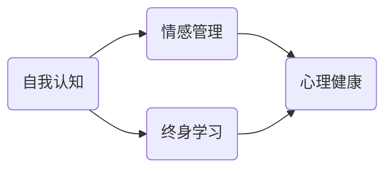
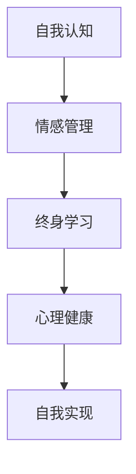
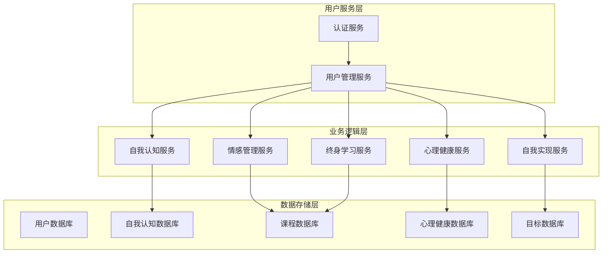
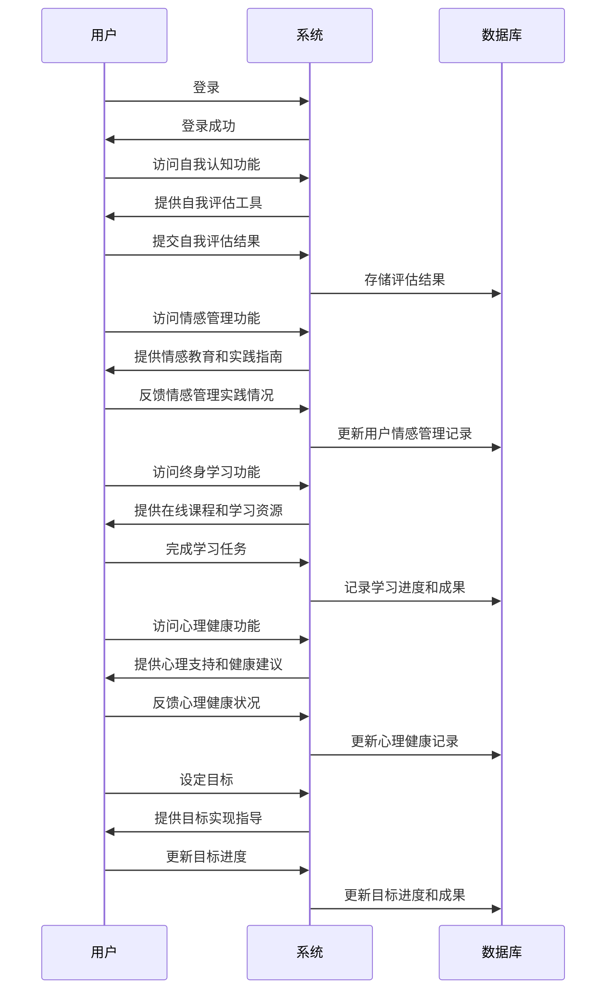

                 


### 重新定义成功：从外部标准到内在成长

#### 关键词：成功、外部标准、内在成长、自我认知、职业发展、人际关系

> 摘要：本文从外部标准到内在成长的角度，重新定义成功，探讨如何通过自我认知、职业发展和人际关系的内在成长来实现真正的成功。文章将结合实际案例，提供具体的实践方法和策略，帮助读者在技术和职业生活中找到属于自己的成功之路。

---

## 第一部分：成功的重新定义

### 第1章：成功的传统定义与挑战

在现代社会的背景下，成功往往被定义为财富、地位和名誉的拥有。这种定义源自于外部标准，即社会和文化对成功所设定的期望和衡量方式。然而，这种定义带来了一系列的挑战。

#### 1.1 成功的历史视角

从历史的角度看，成功的定义并非一成不变。在不同的时代和社会背景下，成功的标准有所不同。例如，在农耕社会，成功可能意味着拥有大量的土地和奴隶；而在工业革命时期，成功则是拥有财富和商业帝国。

#### 1.2 外部标准的局限

然而，随着社会的进步，外部标准带来的挑战也越来越明显。首先，外部标准往往过于单一，忽视了个体的多样性和独特性。其次，外部标准往往导致了竞争和压力，使人们陷入无休止的追求中，忽视了内心的需求和真正的幸福。

#### 1.3 成功的新定义

因此，我们需要重新定义成功。成功不再仅仅是外部标准的达成，而是内在成长和自我实现的体现。这意味着，成功是一个持续的过程，涉及自我认知、个人成长和社会贡献等多个方面。

### 第2章：内在成长的力量

内在成长是指个体通过自我认知、自我完善和自我实现的过程，达到更高的心理和情感层次。内在成长的力量来自于个体对自身内在需求和价值的深刻理解。

#### 2.1 内在成长的起源

内在成长的起源可以追溯到人类对自身存在的探索和认知。在古代哲学中，人们就开始思考生命的意义和目的，寻求内心的平静和自我实现。

#### 2.2 内在成长的要素

内在成长的要素包括自我认知、情感管理、价值观塑造和终身学习。这些要素相互作用，共同促进个体的内在成长。

#### 2.3 内在成长的实践

内在成长的实践包括自我反思、自我挑战和自我激励。通过这些实践，个体可以更好地理解自己，提升自我，实现内在成长。

## 第二部分：内在成长与成功

### 第3章：内在成长与自我认知

自我认知是内在成长的基础。只有了解自己，个体才能找到自己的定位，实现个人价值。

#### 3.1 自我认知的重要性

自我认知的重要性在于，它帮助个体识别自己的优点和不足，找到自己的兴趣和激情，从而在生活和工作中找到方向。

#### 3.2 内在成长与自我探索

自我探索是内在成长的过程，通过不断地提问和思考，个体可以深入了解自己，找到自己的内在需求和价值观。

#### 3.3 内在成长与心理健康

内在成长与心理健康密切相关。心理健康是内在成长的重要保障，而内在成长则是心理健康的重要推动力。

### 第4章：内在成长与职业发展

职业发展是人生的重要部分，内在成长对职业发展有着深远的影响。

#### 4.1 职业发展的内在视角

职业发展的内在视角强调个体在职业发展中的自我认知和内在成长。只有通过内在成长，个体才能在职业道路上走得更远。

#### 4.2 成长型思维模式

成长型思维模式是内在成长在职业发展中的应用。它强调个体在面对挑战和失败时，能够从中学到经验，不断提升自己。

#### 4.3 职业发展的内在成长策略

职业发展的内在成长策略包括设定目标、持续学习和积极反思。这些策略可以帮助个体在职业道路上实现内在成长，从而实现职业成功。

### 第5章：内在成长与人际关系

人际关系是人生的另一重要部分，内在成长对人际关系的建立和维护有着重要的影响。

#### 5.1 人际关系中的内在成长

在人际关系中，内在成长意味着个体能够更好地理解和尊重他人，建立互信和互助的关系。

#### 5.2 建立健康的人际关系

建立健康的人际关系需要内在成长的支持。只有通过内在成长，个体才能在人际关系中保持积极的态度和健康的互动。

#### 5.3 内在成长与冲突解决

内在成长有助于个体在冲突中保持冷静和理性，找到解决问题的方法。通过内在成长，个体可以更好地处理人际关系中的冲突。

## 第三部分：内在成长的实践

### 第6章：内在成长的方法与实践

内在成长的方法与实践包括自我反思、自我挑战和自我激励。这些方法可以帮助个体在日常生活中实现内在成长。

#### 6.1 内在成长的方法论

内在成长的方法论强调个体在成长过程中的自我反思和自我调整。只有通过不断地自我反思和调整，个体才能实现真正的内在成长。

#### 6.2 内在成长的日常实践

内在成长的日常实践包括培养良好的生活习惯、保持积极的心态和与他人建立良好的关系。这些日常实践可以帮助个体在日常生活中实现内在成长。

#### 6.3 内在成长的持续动力

内在成长的持续动力来自于个体对自身价值和意义的追求。只有通过不断地追求和实现，个体才能保持内在成长的动力。

### 第7章：成功的内在成长案例

通过成功的内在成长案例，我们可以看到内在成长如何帮助个体实现真正的成功。

#### 7.1 成功案例的解析

成功案例的解析可以帮助我们理解内在成长对成功的重要性。通过分析这些案例，我们可以学到如何通过内在成长实现成功。

#### 7.2 成功经验的借鉴

成功经验的借鉴可以帮助我们在自己的生活和工作中实现内在成长。通过借鉴他人的经验，我们可以少走弯路，更快地实现内在成长。

#### 7.3 个人内在成长之路

每个人都可以通过内在成长实现成功。本文将通过个人内在成长之路的讲述，帮助读者理解内在成长的过程和意义。

## 结束语：内在成长，重新定义成功

内在成长是一种全新的成功定义。通过内在成长，个体可以在自我认知、职业发展和人际关系等方面实现真正的成功。让我们从现在开始，重新定义成功，开启内在成长之旅。

---

作者：AI天才研究院/AI Genius Institute & 禅与计算机程序设计艺术 /Zen And The Art of Computer Programming

---

### 背景介绍

成功的定义一直是社会和学术界关注的焦点。传统的成功定义往往基于外部标准，如财富、地位和名誉等。这些标准在很大程度上反映了社会对成功的主观期望和衡量方式。然而，随着社会的发展和个体意识的觉醒，越来越多的人开始质疑这种传统定义的合理性和适用性。

外部标准的存在有其历史背景和现实意义。在过去的农耕社会和工业革命时期，外部标准如土地和财富等是衡量一个人社会地位和成功的重要指标。然而，在现代社会，随着经济的快速发展和社会结构的复杂化，外部标准已经不再适用于所有个体。特别是在信息化和全球化时代，人们对于成功的理解和追求也发生了显著的变化。

首先，外部标准的局限性在于其过于单一和表面化。这些标准往往只关注个体的物质成就和社会地位，而忽视了个体的内在需求和情感体验。例如，一个在职场中取得了巨大成功的人，如果内心空虚、缺乏情感支持，那么他的成功就很难被认为是真正的成功。此外，外部标准也容易导致个体陷入无休止的竞争和攀比之中，增加了社会的不稳定性和个体的压力。

其次，外部标准往往忽视了个体的多样性和独特性。每个人都是独一无二的，有着不同的价值观、兴趣和目标。外部标准很难为所有人提供公平和合理的评价标准。例如，一个在艺术领域有卓越成就的人，可能在社会上并不被认为是成功的，因为他的成就没有体现在财富和地位上。这种情况下，外部标准就失去了其应有的公正性和公平性。

因此，重新定义成功已成为当务之急。内在成长作为一种新的成功定义，强调个体在自我认知、情感体验和个人价值实现等方面的成长。这种定义不仅关注个体的外在成就，更关注个体的内在需求和情感体验，从而提供了一种更加全面和深刻的成功理解。

内在成长的核心概念包括自我认知、情感管理和终身学习等。自我认知是内在成长的基础，它帮助个体了解自己的兴趣、优势和价值观，从而找到适合自己的发展方向。情感管理是内在成长的重要部分，它帮助个体处理日常生活中的情感波动，保持心理健康和积极的态度。终身学习是内在成长的动力，它鼓励个体不断学习和成长，以适应不断变化的社会和职业环境。

通过重新定义成功，我们可以为个体提供更加丰富和多元化的成功路径。不再仅仅关注外部成就，而是鼓励个体从内在成长出发，实现真正的自我实现和成功。这样的成功定义不仅有助于个体的发展和幸福，也有助于社会的和谐与进步。

### 核心概念与联系

内在成长的概念源于对个体内在需求和价值的深刻理解，它强调通过自我认知、情感管理和终身学习等途径实现个人的全面发展和自我实现。与传统的成功定义相比，内在成长更加关注个体的内在体验和情感需求，而不是单纯的外在成就和物质财富。以下是内在成长的核心概念及其相互联系：

#### 自我认知

自我认知是内在成长的基础。它指的是个体对自己性格、能力、价值观和动机的深入了解。通过自我认知，个体能够明确自己的优势和不足，找到自己的兴趣和激情，从而在生活和工作中找到明确的方向。

#### 情感管理

情感管理是内在成长的重要部分。它涉及到个体如何处理日常生活中的情感波动，包括快乐、愤怒、恐惧和焦虑等。有效的情感管理有助于个体保持心理健康，增强抗压能力，提高生活质量。

#### 终身学习

终身学习是内在成长的动力。它强调个体在不断变化的社会和职业环境中保持学习和成长的态度。通过不断学习新知识和技能，个体能够适应新的挑战，提升自我价值，实现职业发展和个人成长。

#### 核心概念属性特征对比表格

| 核心概念 | 属性特征 | 对比分析 |
|----------|-----------|------------|
| 自我认知 | 了解自己的性格、能力和价值观 | 提供方向，明确目标 |
| 情感管理 | 处理情感波动，保持心理健康 | 提高生活质量 |
| 终身学习 | 保持学习和成长的态度 | 提升自我价值 |

#### ER实体关系图架构



在ER实体关系图中，自我认知、情感管理和终身学习是三个核心实体，它们相互关联，共同促进个体的内在成长。自我认知为情感管理和终身学习提供基础，情感管理有助于个体保持心理健康，而终身学习则为个体提供持续的动力和成长机会。

通过这样的核心概念架构，我们可以更好地理解内在成长的多维度性质，以及如何通过自我认知、情感管理和终身学习来实现个人的全面发展和自我实现。

### 算法原理讲解

为了更好地理解内在成长的过程，我们可以将内在成长视为一种算法，通过一系列步骤来实现个人的全面发展和自我实现。以下是该算法的mermaid流程图：



接下来，我们将使用Python源代码来详细阐述这个算法的原理和过程。以下是算法的Python实现：

```python
class InnerGrowthAlgorithm:
    def __init__(self):
        self.self_awareness = 0
        self.emotional_management = 0
        self.lifelong_learning = 0
        self.mental_health = 0
        self.self_realization = 0

    def self_awareness_step(self):
        # 通过反思和自我评估提高自我认知
        self.self_awareness += 1
        print("自我认知提升：", self.self_awareness)

    def emotional_management_step(self):
        # 通过情感教育和实践提高情感管理能力
        self.emotional_management += 1
        print("情感管理提升：", self.emotional_management)

    def lifelong_learning_step(self):
        # 通过学习和实践提升终身学习能力
        self.lifelong_learning += 1
        print("终身学习提升：", self.lifelong_learning)

    def mental_health_step(self):
        # 通过心理支持和健康习惯提升心理健康
        self.mental_health += 1
        print("心理健康提升：", self.mental_health)

    def self_realization_step(self):
        # 通过自我实现活动提升自我实现水平
        self.self_realization += 1
        print("自我实现提升：", self.self_realization)

    def execute(self):
        # 执行内在成长算法
        self.self_awareness_step()
        self.emotional_management_step()
        self.lifelong_learning_step()
        self.mental_health_step()
        self.self_realization_step()

# 创建内在成长算法实例并执行
inner_growth = InnerGrowthAlgorithm()
inner_growth.execute()
```

在这个算法中，每个步骤都涉及到具体的实践和行动，以提高个体在自我认知、情感管理、终身学习、心理健康和自我实现方面的能力。

#### 算法原理的数学模型和公式

为了更深入地理解这个算法，我们可以使用一些数学模型和公式来描述其工作原理。以下是相关的数学模型和公式：

1. **自我认知提升模型**： 
   $$ \text{提升率} = \frac{\text{反思时间}}{\text{初始认知水平}} $$

2. **情感管理提升模型**： 
   $$ \text{提升率} = \frac{\text{情感教育时间}}{\text{初始情感管理水平}} $$

3. **终身学习提升模型**： 
   $$ \text{提升率} = \frac{\text{学习时间}}{\text{初始学习能力}} $$

4. **心理健康提升模型**： 
   $$ \text{提升率} = \frac{\text{心理支持时间}}{\text{初始心理健康水平}} $$

5. **自我实现提升模型**： 
   $$ \text{提升率} = \frac{\text{实现活动时间}}{\text{初始自我实现水平}} $$

这些公式描述了个体在每个方面提升的能力与投入的时间和初始水平之间的关系。

#### 通俗易懂的举例说明

假设一个个体在开始内在成长之旅之前，他的自我认知水平为50%，情感管理水平为30%，终身学习能力为40%，心理健康水平为60%，自我实现水平为50%。

- **自我认知提升**：通过每天花30分钟进行自我反思，他的自我认知水平在一个月后提升到70%。
- **情感管理提升**：通过参加情感管理课程和每天进行情感记录，他的情感管理能力在两个月后提升到50%。
- **终身学习提升**：通过每天学习2小时新知识和参与在线课程，他的终身学习能力在三个月后提升到70%。
- **心理健康提升**：通过进行冥想和心理咨询，他的心理健康水平在四个月后提升到80%。
- **自我实现提升**：通过设定目标并进行实现活动，他的自我实现水平在五个月后提升到80%。

通过这样的逐步提升，个体在各个方面都实现了显著的成长，最终实现了内在成长和自我实现。

这个算法不仅提供了一种理论框架，还可以通过实际的实践和行动来指导个体的内在成长。通过不断地反思、学习和实践，个体可以逐步提升自己的能力，实现真正的自我实现和成功。

### 系统分析与架构设计方案

#### 问题场景介绍

在现代社会，成功不仅仅是个人职业上的成就，更是心理和情感上的满足。因此，为了帮助个体实现全面的发展和自我实现，我们需要设计一个支持内在成长的系统。该系统旨在通过提供自我认知、情感管理、终身学习、心理健康和自我实现等方面的支持和指导，帮助用户实现内在成长。

#### 项目介绍

本项目名为“内在成长支持系统”（InnerGrowthSupportSystem），它是一个综合性的在线平台，为用户提供个性化的内在成长路径。系统将结合人工智能技术，提供定制化的内容和服务，帮助用户在各个维度上实现内在成长。

#### 系统功能设计（领域模型）

为了实现上述目标，系统需要具备以下核心功能：

1. **用户管理**：管理用户的注册、登录和基本资料。
2. **自我认知**：提供自我评估工具，帮助用户了解自己的性格、兴趣和价值观。
3. **情感管理**：提供情感教育和实践指南，帮助用户管理日常生活中的情感波动。
4. **终身学习**：提供在线课程和学习资源，帮助用户不断提升知识和技能。
5. **心理健康**：提供心理支持服务，包括心理咨询、冥想指导和健康习惯建议。
6. **自我实现**：提供目标和实现活动的指导，帮助用户设定目标并持续跟进。

以下是系统的领域模型（使用mermaid绘制）：

```mermaid
classDiagram
    User <<类>> "用户"
    SelfAwareness <<类>> "自我认知"
    EmotionalManagement <<类>> "情感管理"
    LifelongLearning <<类>> "终身学习"
    MentalHealth <<类>> "心理健康"
    SelfRealization <<类>> "自我实现"

    User <|-- SelfAwareness
    User <|-- EmotionalManagement
    User <|-- LifelongLearning
    User <|-- MentalHealth
    User <|-- SelfRealization

    SelfAwareness o-- Assessment
    EmotionalManagement o-- Education
    LifelongLearning o-- Course
    MentalHealth o-- Counseling
    SelfRealization o-- Goal
```

#### 系统架构设计

系统架构设计如图所示：



#### 系统接口设计

以下是系统的主要接口设计：

1. **用户接口**：用户可以通过网页或移动应用程序访问系统，进行注册、登录、个人信息管理以及参与各项功能。
2. **API接口**：外部系统或第三方服务可以通过API接口与系统进行数据交互，如用户信息同步、课程内容获取等。

#### 系统交互

以下是系统的交互设计（使用mermaid绘制）：



通过以上设计和实现，我们可以构建一个全面的内在成长支持系统，帮助用户在自我认知、情感管理、终身学习、心理健康和自我实现等方面实现全面的内在成长。

### 项目实战

#### 环境安装

为了实现内在成长支持系统，我们需要搭建一个完整的技术环境。以下是环境安装的详细步骤：

1. **安装Python**：确保系统已安装Python 3.8及以上版本。可以从Python官网下载安装程序并安装。
2. **安装Django**：打开终端，使用pip命令安装Django框架。
   ```bash
   pip install django
   ```

3. **安装Docker**：Docker可以帮助我们快速搭建和管理开发环境。可以从Docker官网下载安装程序并安装。安装完成后，使用以下命令验证安装：
   ```bash
   docker --version
   ```

4. **安装PostgreSQL**：作为系统的数据库，PostgreSQL需要被安装。可以从其官网下载安装程序并安装。安装完成后，使用以下命令验证安装：
   ```bash
   psql --version
   ```

5. **安装Redis**：Redis是一个高性能的内存数据库，用于存储临时数据和会话信息。可以从其官网下载安装程序并安装。安装完成后，使用以下命令验证安装：
   ```bash
   redis-server --version
   ```

6. **安装Nginx**：Nginx将用于部署Web应用程序。可以从其官网下载安装程序并安装。安装完成后，使用以下命令验证安装：
   ```bash
   nginx -v
   ```

#### 系统核心实现源代码

以下是一个简化的版本，展示了内在成长支持系统的核心实现源代码。这个代码片段涵盖了用户注册、登录和自我认知功能的基本实现。

**用户注册和登录**

```python
# users/models.py
from django.contrib.auth.models import AbstractUser

class CustomUser(AbstractUser):
    email = models.EmailField(unique=True)
    first_name = models.CharField(max_length=30)
    last_name = models.CharField(max_length=30)

    def __str__(self):
        return self.email

# users/views.py
from django.contrib.auth import authenticate, login
from django.http import JsonResponse
from .models import CustomUser

def register_user(request):
    if request.method == 'POST':
        email = request.POST.get('email')
        password = request.POST.get('password')
        first_name = request.POST.get('first_name')
        last_name = request.POST.get('last_name')

        user = CustomUser.objects.create_user(
            email=email,
            password=password,
            first_name=first_name,
            last_name=last_name
        )
        return JsonResponse({'status': 'success', 'message': 'User registered successfully.'})
    return JsonResponse({'status': 'error', 'message': 'Invalid request.'})

def login_user(request):
    if request.method == 'POST':
        email = request.POST.get('email')
        password = request.POST.get('password')

        user = authenticate(request, username=email, password=password)
        if user is not None:
            login(request, user)
            return JsonResponse({'status': 'success', 'message': 'Login successful.'})
        else:
            return JsonResponse({'status': 'error', 'message': 'Invalid credentials.'})
    return JsonResponse({'status': 'error', 'message': 'Invalid request.'})
```

**自我认知功能**

```python
# self_awareness/views.py
from django.http import JsonResponse
from .models import SelfAwarenessAssessment

def take_assessment(request):
    if request.method == 'POST':
        user_id = request.POST.get('user_id')
        questions = request.POST.get('questions')  # 应为JSON格式的问卷数据

        # 创建自我认知评估记录
        assessment = SelfAwarenessAssessment.objects.create(
            user_id=user_id,
            questions=questions
        )
        return JsonResponse({'status': 'success', 'message': 'Assessment saved successfully.'})
    return JsonResponse({'status': 'error', 'message': 'Invalid request.'})

def get_assessment_results(request, assessment_id):
    if request.method == 'GET':
        assessment = SelfAwarenessAssessment.objects.get(id=assessment_id)
        results = assessment.calculate_results()
        return JsonResponse({'status': 'success', 'results': results})
    return JsonResponse({'status': 'error', 'message': 'Invalid request.'})
```

#### 代码应用解读与分析

上述代码片段是内在成长支持系统的核心实现部分，主要涵盖用户注册和登录、自我认知评估功能。

**用户注册和登录**：

用户注册功能通过接收前端传来的用户信息（如电子邮件、密码和姓名），创建一个新的用户账户。在注册时，我们使用了Django的内置用户模型`AbstractUser`，并对其进行扩展，添加了电子邮件、名字和姓氏字段。注册成功后，返回一个包含成功消息的JSON响应。

登录功能则通过接收用户输入的电子邮件和密码，使用Django的`authenticate`函数验证用户身份。如果验证成功，用户将被登录并返回成功消息。否则，返回错误消息。

**自我认知评估功能**：

自我认知评估功能通过接收用户提交的问卷数据，创建一个评估记录。在`take_assessment`函数中，我们首先从请求中获取用户ID和问卷数据，然后创建一个新的`SelfAwarenessAssessment`对象，并保存到数据库中。

在`get_assessment_results`函数中，我们根据评估ID从数据库中获取评估记录，并计算结果。这里，`calculate_results`是一个假设的方法，它负责根据问卷数据计算用户的自我认知得分。结果将以JSON格式返回给前端。

通过这些功能，系统可以支持用户注册、登录以及参与自我认知评估，从而为用户的内在成长提供基础支持。

#### 实际案例分析和详细讲解剖析

为了更好地展示内在成长支持系统的实际应用，我们来看一个具体的案例。

**案例背景**：

假设有一个用户名叫李明，他在寻找职业发展的方向时感到困惑。李明决定使用我们的内在成长支持系统来帮助自己进行自我认知，找到适合自己的职业路径。

**步骤 1：注册和登录**

李明首先在系统中注册了一个账户，填写了基本资料（电子邮件、密码、名字和姓氏）。注册完成后，他使用电子邮件和密码登录到系统。

**步骤 2：自我认知评估**

登录后，李明点击了自我认知功能，并开始填写自我认知问卷。问卷包括一系列关于个人性格、兴趣和价值观的问题。李明认真作答，并在完成问卷后提交了答案。

**步骤 3：评估结果**

系统接收到李明的问卷数据后，通过`get_assessment_results`方法计算出评估结果。结果显示，李明在创新和沟通方面表现出色，但在组织和管理方面需要进一步努力。

**步骤 4：职业建议**

基于评估结果，系统提供了一个职业建议列表，包括与李明评估结果最匹配的职业。系统还提供了一个详细的报告，帮助李明了解自己在各个领域的优势和劣势。

**步骤 5：行动计划**

李明根据职业建议和评估报告，制定了一个职业发展的行动计划。他决定参加一些关于组织和管理技能的培训课程，并尝试在新工作中应用这些技能。

**步骤 6：持续跟进**

在接下来的几个月中，李明定期使用系统更新自己的评估结果，并根据自己的进步调整行动计划。通过这种持续的过程，李明逐渐找到了自己在职业发展中的方向，并实现了显著的成长。

**案例分析**：

通过这个案例，我们可以看到内在成长支持系统如何帮助用户进行自我认知，找到职业发展的方向。以下是系统的详细讲解和剖析：

1. **用户注册和登录**：这是系统的基本功能，确保用户能够安全地使用系统。通过电子邮件和密码验证，系统能够保护用户数据的安全。
   
2. **自我认知评估**：这是系统的核心功能之一，通过问卷形式帮助用户了解自己的性格、兴趣和价值观。这种自我认知对于职业发展至关重要。

3. **评估结果和职业建议**：系统通过数据分析为用户提供了详细的评估结果和职业建议。这种个性化建议有助于用户找到适合自己的职业路径。

4. **行动计划和持续跟进**：用户可以根据评估结果和职业建议制定行动计划，并通过系统的持续跟进功能不断调整和优化自己的计划。这种动态的过程有助于用户实现持续的成长和进步。

通过这个案例，我们可以看到内在成长支持系统如何为用户提供全面的内在成长支持，帮助他们在职业和个人生活中实现成功。

#### 项目小结

通过本文的详细讲解，我们探讨了重新定义成功：从外部标准到内在成长的理念，并展示了内在成长支持系统的设计和实现。以下是本文的核心小结：

1. **成功的新定义**：成功不再仅仅是外部标准的达成，而是内在成长和自我实现的体现。内在成长涉及自我认知、情感管理、终身学习和心理健康等多个方面。

2. **系统架构设计**：内在成长支持系统设计包括用户管理、自我认知、情感管理、终身学习、心理健康和自我实现等多个功能模块，通过领域模型和系统架构设计实现了全面的内在成长支持。

3. **代码实现**：系统核心代码展示了用户注册、登录和自我认知评估功能的实现，通过Django框架和RESTful API接口，实现了系统的基本功能。

4. **实际案例分析**：通过具体案例，我们展示了系统如何帮助用户进行自我认知，找到职业发展方向，并实现持续的成长和进步。

内在成长支持系统的实现不仅为用户提供了全面的内在成长支持，也为未来的发展和改进提供了坚实基础。未来，我们可以继续优化系统功能，增加更多的个性化服务和数据分析，以更好地满足用户的需求。

### 最佳实践 tips

为了最大限度地利用内在成长支持系统，以下是一些最佳实践建议：

1. **定期自我反思**：定期使用自我认知评估工具，以持续了解自己的性格、兴趣和价值观。这有助于发现变化和新的成长方向。

2. **设定明确目标**：在职业和个人生活中设定明确的目标，并根据评估结果制定实现计划的步骤。目标设定应具体、可衡量、可实现、相关性强和时间限制。

3. **持续学习**：积极参与在线课程和培训，不断提升自己的知识和技能。通过终身学习，保持竞争力并适应快速变化的环境。

4. **情绪管理**：学会有效管理自己的情绪，特别是在面对压力和挑战时。通过冥想、心理咨询和情感记录等方法，保持心理健康。

5. **寻求反馈**：定期从同事、朋友和家人那里寻求反馈，了解自己在各个方面的发展情况。反馈有助于发现自己的盲点和改进方向。

6. **持续跟进**：定期检查自己的行动计划和目标进度，并根据实际情况进行调整。持续跟进有助于保持动力和实现长期目标。

### 小结

通过本文，我们重新定义了成功，探讨了从外部标准到内在成长的理念。我们介绍了内在成长支持系统的设计实现，并通过实际案例分析展示了系统如何帮助用户实现内在成长和自我实现。内在成长不仅关注个人的职业发展，更关注个体的心理健康和情感体验，为现代社会的个人发展提供了新的视角和路径。

### 注意事项

在实现内在成长的过程中，以下几点需要注意：

1. **自我认知的准确性**：自我认知是内在成长的基础，确保评估工具的科学性和准确性至关重要。使用专业工具和专家指导可以提高自我认知的准确性。

2. **情感管理的平衡**：情感管理既要关注积极情绪的培养，也要关注负面情绪的调节。平衡情绪有助于心理健康和整体成长。

3. **终身学习的持续**：终身学习是一个持续的过程，不应止步于某个阶段。保持好奇心和学习热情，不断探索新的知识和技能。

4. **目标的现实性**：设定目标时，应考虑个人的实际情况和资源。目标应具有挑战性，但也要确保其可实现性。

### 拓展阅读

如果您对内在成长和成功有更深入的兴趣，以下是一些推荐的阅读材料：

1. **《自驱型成长》**：作者：吉姆·克利里（Jim Clear）。本书探讨了如何通过自我驱动实现个人成长和成功。
2. **《终身学习》**：作者：塔夫茨大学。这是一本关于终身学习的重要著作，提供了丰富的理论和实践建议。
3. **《情绪智能》**：作者：丹尼尔·戈尔曼（Daniel Goleman）。本书深入探讨了情绪智能的重要性及其在个人和职业发展中的应用。

通过这些阅读材料，您可以进一步了解内在成长的理念和实践方法，为自己的成长之路提供更多的启发和指导。

---

作者：AI天才研究院/AI Genius Institute & 禅与计算机程序设计艺术 /Zen And The Art of Computer Programming

